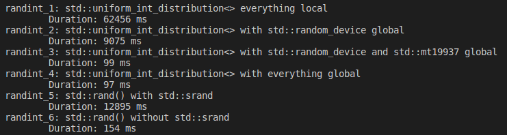

# C++ Tips

这里记录了我在实际写码中学习到的一些 **C++** 要点，其顺序没有多少关系。每一条都只反映当时我的一些实验和反思，不一定是正确或最优的选择。通常我也会查阅网上的相关建议，如果有必要会附在每一条后面。

[TOC]

## 仿函数的传递方式（2021/12/02）

之前不记得是在哪里学到的，将仿函数（比如标准库种经常出现的 `Compare`、`Predicate` 模板类型）通过转发引用方式传递，但今天写码的时候突然有点迷惑：通常我也不需要转发（`std::forward`）这个仿函数，为什么还要这样传进来呢？我看了看标准库中的传递方式，比如 `std::sort` 的接口如下：

```cpp
template<class RandomIt, class Compare>
void sort(RandomIt first, RandomIt last, Compare comp);
```

这里是用值传递的，显然这是最保险的方式，因为值传递可以包揽所有情形：首先对于最常见的，使用 lambda 表达式或用标准库中 `std::less` 等在调用处当场构建对象的时候，作为纯右值它会移动传递到 `sort` 函数中；如果是一个左值那就只能复制进来了，对于一些复杂的仿函数这可能有点让人膈应。

显然我们不应该以左值引用传递，因为这就直接封死了 lambda 表达式。那么常量左值引用（`const&`）如何呢？一开始我差点确信这个没什么问题了，毕竟常量左值引用一向作为万金油的参数传递方式：因为还有不少不允许复制操作的类型，但是没有任何类型不允许引用。刚改一两行码，突然意识到这样产生的问题：如果仿函数是通过 `const` 传进来的，那就不应该允许修改捕获变量了，这样对于声明为 `mutable` 的闭包可能会编译不过：

```cpp
template<typename F>
void foo(F const& f) {
    f();
}

int main() {
    int i = 42;
    foo([i] mutable { return ++i; });	    // 错误，mutable 的闭包，其 operator() 没有被声明为 const
    return 0;
}
```

于是回到开头的解法，既然常量左值引用不合适，我们或许应该试试转发引用，因为它一样可以接受任何传递形式的参数。下面我做了一个小实验，来看看仿函数类型通过转发引用传递时是怎么选择的：

```cpp
template<typename F>
void foo(F&& f) {
    std::cout << f();
}
struct Functor {
	Functor() = default;
    Functor(Functor const& other) {
        std::cout << "copied" << '\n';
    }
    Functor(Functor&& other) {
        std::cout << "moved" << '\n';
    }
    auto operator ()() const {
        return 42;
    }
};

int main() {
    Functor f;
    foo(f);	                // 传递左值引用
    foo(Functor{});	        // 传递右值引用
    foo(std::move(f));	    // 传递右值引用
    return 0;
}
```

答案其实还挺出乎我意料的（因为我此前对转发引用的理解有问题），三种情况都会静悄悄地输出 `42` ，仿佛没有产生任何构造操作（我原来以为在通过右值引用传递时会进行一次移动构造，这简直误会大了）。事实上，无论是通过左值还是右值引用传递，它们都是 *引用*，因此不会发生任何构造。之所以会产生它们会发生移动或复制操作的错觉是因为通常在函数中会出现类似于：

```cpp
auto new_obj = std::forward<T>(elem);
```

或者：

```cpp
auto new_obj = std::move(elem);
```

的用法。当右值引用出现在初始化语句中时，*的确* 会发生移动构造，同理左值引用在初始化语句中也会导致复制构造，因为此时确实需要构造一个对象。

回到之前的例子，毫无疑问转发引用的效果是最好的，因为无论是左值还是右值，它都能低成本地传递到函数当中。

既然谈到了仿函数，这里讲一个题外话。通常来讲我们认为闭包类型和手动定义的仿函数是等价的，但通过这次的例子我们发现了 lambda 的局限性：它默认是 `const` 的，但当声明为 `mutable` 时它不是将捕获变量声明为 `mutable`，而是去除 `operator ()` 函数的 `const` 修饰，这就带来一定的局限性。作为对比，手动定义的仿函数是可以通过 `const&` 传递的：

```cpp
template<typename F>
void foo(F const& f) {
    std::cout << f() << '\n';
}
class Functor {
public:
    Functor(int i, int& r) : m_i(i), m_r(r) {}
    auto operator ()() const {
        m_r += 10;
        return i += 10;
    }
private:
    mutable int m_i;
    int& m_r;
};

int main() {
    Functor f(10);
    foo(f);	            // 输出 20
    foo(f);	            // 输出 30
    return 0;
}
```

引用捕获的变量没法通过 `mutable` 标记，但它们本来就可以随意修改（**C++** 中的引用本身不能修改，即所有引用类型 `T&` 都似乎默认是 `T& const`，虽然对引用的修饰符是非法的；但引用所指的对象可以随意修改），即使闭包被默认声明为 `const` 的。这其实某种角度也反映了 **C++** 中 `const` 的局部性，无论是指针还是引用都无法通过内置语法将其常量性传递到更深层。一个解决方案是 `std::propagate_const`，它能够在对象被声明为 `const` 时，令使用这个模板的类指针对象指向内容也被 `const` 修饰：

```cpp
struct Foo {
    void foo() {
        std::cout << "Foo::foo()" << '\n';
    }
    void foo() const {
        std::cout << "Foo::foo() const" << '\n';
    }
};
struct Bar {
    Bar() : ptr(std::make_unique<Foo>()) {}
    void bar() {
        std::cout << "Bar::bar()" << '\n';
        ptr->foo();
    }
    void bar() const {
        std::cout << "Bar::bar() const" << '\n';
        ptr->foo();
    }
    std::propagate_const<std::unique_ptr<Foo>> ptr;
};
int main() {
    Bar b1{};
    Bar const b2{};
    b1.bar();	    // 输出 Bar::bar() 及 Foo::foo()
    b2.bar();	    // 输出 Bar::bar() const 及 Foo::foo() const
    return 0;
}
```

如果不用 `std::propagate_const`，两次都只会调用 `Foo::foo()`。不过这个模板目前还在 **TS** 中，暂时不清楚什么时候合并到标准库中，但可以用 `std::experimental::propagate_const` 来调用。

扯远了，说到底闭包也不能用这个，因为这是用在类型声明上的，捕获列表中可能没法将普通指针/引用类型转换为这个类型。那么应该如何以常量引用/常量指针来捕获变量呢？在 **C++14** 后可以用带初始化的捕获：

```cpp
int main() {
    std::string str = "abc";
    auto f = [&s = static_cast<int const&>(str)] (auto i) { return s[i]; };
    return 0;
}
```

在 **C++17** 后，可以用更简洁的 `std::as_const`：

```cpp
int main() {
    std::string str = "abc";
    auto f = [&s = std::as_const(str)] (auto i) { return s[i]; };
    return 0;
}
```

参考资料：[Stack Overflow](https://stackoverflow.com/questions/3772867/lambda-capture-as-const-reference)

## Trait 定义成类比较好处理（2021/12/04）

众所周知，**C++** 处理模板中的成员（无论是成员变量、成员函数还是成员别名）时无法准确判断其性质，因为在不同实例中可能会有不同含义。因此我们需要两个 **消歧器（Disambiguator）** 来提示编译器某个成员是否为类型（`typename`）以及是否是模板（`template`），下面举两个简单的例子：

```cpp
template<typename T>
struct Foo {
    struct A {};
    using B = int;
    template<typename U>
    struct C {};
    template<typename U>
    U bar(int i, int j) {
        return U{};
    }
};
int main() {
    using AType = typename Foo<int>::Type;
    typename Foo<int>::A a{};
    typename Foo<int>::B b{};
    typename Foo<int>::template C<int> c{};
    auto x = Foo<int>{}.template bar<int>(1, 2);
    return 0;
}
```

以上都是比较夸张的情况。事实上从 **C++20** 起在声明变量以及别名时时不再需要写这些烦人的东西了（虽然在同时存在模板成员函数和普通成员函数时依然需要使用 `template` 关键字来强制指定调用函数），虽然自从 **C++11** 开始标准逐渐开始扩展消歧器的使用场景，比如下面这些迷惑的用法都是合法的：

```cpp
template<typename T>
struct Foo {};

int main() {
    typename ::Foo<int> f1;
    typename std::vector<int> v;
    ::template Foo<int> f2;
    std::template vector<int> v2;
    return 0;
}
```

我是感觉为了追求语法的普适性有点矫枉过正了。当然以 **C++** 的传奇历史说不定以后能够玩出什么花来，但目前来看这就是个毫无用处的语法。

回到正题，**C++** 标准库在设计 **特性（Traits）** 的时候通常会定义一个类，然后再给出一个别名用来省略啰嗦的 `typename`，比如说：

```cpp
template<typename T>
struct is_magic {
    using Type = /* 省略定义 */;
};
template<typename T>
using is_magic_t = typename is_magic<T>::Type;
```

这样能保证在任何情况下只要使用 `is_magic_t<T>` 就一定不需要使用 `typename`（因为 `is_magic_t` 是一个不内嵌在任何模板类中的别名，因此一定是一个类型）。标准库里有大量类似的用法，好不麻烦。

于是我为了节约精力，干脆直接这么写：

```cpp
template<typename T>
using is_magic_t = /* 省略定义 */;
```

这样做确实方便了，但是一旦需要改一些条件，需要用到模板元编程的一些技巧时，这就不好用了（因为模板别名无法偏特化）。我一开始是为了给一些通用成员别名写一个全局的别名，比如：

```cpp
template<typename C>
using ReferenceType = typename C::Reference;
```

不过由于我对成员别名的起名方式有别于标准库（全部首字母大写），标准库里的类到我这里会报错。于是我不得不加上一个判断，但由于我只写了别名，在定义时直接判断是不行的：

```cpp
template<typename C>
using ReferenceType = std::conditional_t<is_stl_v<C>, typename C::reference, typename C::Reference>;
// 这里的 is_stl_v<C> 是我定义的一个判断是否为 STL 容器的 Trait
```

上面会出现编译错误，因为标准库的类型 `C` 根本就没有 `Reference` 这个成员别名。通常的解决方法是：

```cpp
template<typename C, typename = is_stl<C>>
struct Reference;
template<typename C>
using ReferenceType = typename Reference::Type;

template<typename C>
struct Reference<C, std::true_type> {
    using Type = typename C::reference;
}
template<typename C>
struct Reference<C, std::false_type> {
    using Type = typename C::Reference;
}
```

可以看到真的费事了很多，但如果一开始我就把 Trait 的类定义写好，就能少改点东西（我有大概十个类似的 Trait）。

## 如何写一个递归的 `lambda` 表达式（2021/12/30）

起因是我写一道 **LeetCode** 题的时候突然懒得额外定义辅助函数了，心想不如直接写个 lambda 表达式然后当场调用，比如像下面这样：

```cpp
extern int input;
int foo() {
    // 先不细说下面这个写法究竟有多少问题，只需要知道它有问题就行
    return [] (auto in) {
        return in == 0 ? 0 : this(std::abs(in) - 1) + in;
    } (input);
}
```

呃，不过这根本不是 **C++**，因为函数中没有 `this` 的概念。因此我（不情愿地）额外定义了这个 lambda：

```cpp
extern int input;
int foo() {
    auto lambda = [&lambda] (auto in) {
        return in == 0 ? 0 : lambda(std::abs(in) - 1) + in;
    };
    return lambda(input);
}
```

这里我还没有意识到另一个比较重要的问题，不过我看到 **GCC** 报错是，由于 `lambda` 是通过 `auto` 声明的，我们不能将它自己用在自己的初始化器中。这实际上非常合理。作为对比，数组的初始化器中就可以使用自己：

```cpp
int foo() {
    int arr[] = { 1, arr[0], arr[1], 3 };
    for (auto i : arr) {
        std::cout << i;	        // 输出 1, 1, 1, 3
    }
}
```

不过可惜的是，**C++** 的闭包类型从来都是编译器特定的（可能以后也不会标准化），因此我们不可能写出来。一个显然的解决方法是使用无所不能的 `std::function`：

```cpp
extern int input;
int foo() {
    std::function<int(int)> lambda = [&lambda] (auto in) {
        return in == 0 ? 0 : lambda(std::abs(in) - 1) + in;
    };
    return lambda(input);
}
```

可惜 `std::function` 有一定的性能损失（类型擦除、无法编译期执行等）。通常，对于无捕获的闭包，我们可以用函数指针来存储；不过这里需要捕获闭包自身的引用，所以不行。但这也为我们提供了一个思路：如果捕获自身是个问题，那么我们完全可以把函数当作参数传进去。此时实际上也不需要在意闭包类型了，因为我们在 lambda 中没有用到任何递归：

```cpp
extern int input;
int foo() {
    auto lambda = [] (auto in, auto&& f) {
        return in == 0 ? 0 : f(std::abs(in) - 1, f) + in;
    };
    return lambda(input, lambda);
}
```

不过不可否认这样实在太丑了。如果要保证接口的易用和清晰，可以对其进行简单的包装：

```cpp
extern int input;
int foo() {
    return [] (auto in) {
        auto lambda_impl = [] (auto in, auto&& f) -> int {
            return in == 0 ? 0 : f(std::abs(in) - 1, f) + in;
        };
        return lambda_impl(in, lambda_impl);
    } (input);
}
```

上面内层 lambda 的返回类型必须显式声明出来，因为我在函数体中用的是三元运算符表达式，编译器没法推断出类型，这也就是我一开始没有发现的问题；如果改成 `if` 表达式，把返回 `0` 写在前面的话就不用声明返回类型了。

上面这个实际上已经是完美的解决方案了，它只需要 **C++14** 的泛型 lambda 表达式就可以做到。作为拓展，我们可以从 $\lambda$ 演算的角度分析这个问题：在 $\lambda$ 演算中，所有 lambda 都是匿名的，此时应该怎样使用递归呢？答案是使用 **Y 结合子（Y Combinator）**，其定义如下：
$$
Y \equiv \lambda f.(\lambda x. f\ (x\ x))\ (\lambda x. f\ (x\ x))
$$
举个例子，如果我们需要定义递归版本的阶乘函数 $FACT$，则可以先定义 $G \equiv \lambda f. \lambda n.\ \textbf{if}\ n = 0\ \textbf{then}\ 1\ \textbf{else}\ n \times (f\ (n-1))$。随后定义：
$$
\begin{align*}
	FACT &\equiv Y\ G \\
	&= (\lambda f.(\lambda x. f\ (x\ x))\ (\lambda x. f\ (x\ x)))\ G \\
	&= (\lambda x. G\ (x\ x))\ (\lambda x. G\ (x\ x)) \\
	&= G\ ((\lambda x. G\ (x\ x))\ (\lambda x. G\ (x\ x))) \\
	&= (\lambda f.\lambda n.\ \textbf{if}\ n = 0\ \textbf{then}\ 1\ \textbf{else}\ n\times(f\ (n - 1)))\ ((\lambda x. G\ (x\ x))\ (\lambda x. G\ (x\ x))) \\
	&= \lambda n.\textbf{if}\ n = 0\ \textbf{then}\ 1\ \textbf{else}\ n\times (((\lambda x. G\ (x\ x))\ (\lambda x. G\ (x\ x)))\ (n - 1)) \\
	&= \lambda n.\textbf{if}\ n = 0\ \textbf{then}\ 1\ \textbf{else}\ n\times ((Y\ G)\ (n - 1)) \\
	&= \lambda n.\textbf{if}\ n = 0\ \textbf{then}\ 1\ \textbf{else}\ n\times (FACT\ (n - 1))
\end{align*}
$$
我们惊奇地发现，利用 Y 结合子，函数可以自行逐层展开，直到基本情形（这里并不打算给出其对普遍情形有效的数学证明）。我们完全可以在 **C++** 中实现一个 Y 结合子：

```cpp
template<typename F>
struct YCombinator {
    template<typename... Args>
    decltype(auto) operator ()(Args&&... args) const {
        return f(*this, std::forward<Args>(args)...);
    }
    F f;
};
// 类模板参数推导（C++17），之前需要手写一个 make_y_combinator
// 不过 C++20 之后对于聚合类型可以自行推导，这个语句也不需要了
template<typename F>
YCombinator(F) -> YCombinator<F>;
```

之后我们可以利用它进行递归调用：

```cpp
extern int input;
int foo() {
    return YCombinator(
        [] (auto&& f, int in) { 
            return in == 0 ? 0 : f(std::abs(in) - 1) + in; 
        })(input);
}
```

可以看到我们的逻辑和前面介绍的 Y 结合子及其用法基本一致。本例中，Y 结合子是我们定义的类 `YCombinator`，它的成员 `f` 就是其定义中的第一个参数，同时也是函数 $G$，也即我们传入的匿名 lambda 的第一个参数。

参考资料：[Stack Overflow](https://stackoverflow.com/questions/2067988/recursive-lambda-functions-in-c11)、[Pedro Melendez](http://pedromelendez.com/blog/2015/07/16/recursive-lambdas-in-c14/)、[Harvard](https://groups.seas.harvard.edu/courses/cs152/2010sp/lectures/lec09.pdf)

## 如何传递 `std::string`（2022/01/02)

假设某一个类型中声明了 `std::string` 类型的成员，那么在构造函数中我们应该怎么传入参数呢？第一反应显然是使用常引用：

```cpp
struct Foo {
    Foo(std::string const& s) : str(s) {}
    std::string str;
};
```

这在多数情况下当然没有问题，不过如果调用方使用的是字符串字面量，这就得经历两次构造：

```cpp
int main() {
    Foo f("abc");	// 先通过 "abc" 构造一个 std::string 对象，经过常引用传递后再通过复制构造 Foo::str
    return 0;
}
```

这样显然不够高效。于是我立马想到传值进来：因为 `std::string` 注定会被拷贝一次，那么就让它在传参的时候构造，然后移动构造 `Foo::str`：

```cpp
struct Foo {
    Foo(std::string s) : str(std::move(s)) {}
    std::string str;
};
int main() {
    Foo f("abc");	// 先通过 "abc"构造一个 std::string 对象（值传递），然后通过移动构造 Foo::str
    return 0;
}
```

不过随即我想到 `std::string` 使用了 **小对象优化（Small Object Optimization）**，在字符串较短时在栈上存储字符数组。因此如果构造很短的字符串，移动操作和复制操作一样耗时。经过我的 benchmark 测试，上面列出的两种方法和我猜想一致：在字符串较长时值传递更高效，反之引用传递更高效。

那么，有没有什么方法能够减少构造次数的同时不会受到字符串大小的影响呢？巧了，我们有 **C++17** 引入的 `std::string_view`。由于它是本质是一对指针（类似于 range），因此任何情况下它的构造都是轻量的；在 `Foo` 的构造函数中我们可以通过 `std::string_view` 构造 `std::string`：

```cpp
struct Foo {
    Foo(std::string_view sv) : str(sv) {}
    std::string str;
};
int main() {
    Foo f1("abc");
    Foo f2(f1.str);
    Foo f3(std::string("def"));
    return 0;
}
```

经过 benchmark 测试，无论是那种情况下 `std::string_view` 都有更高的性能。

## 如何为类初始化 `static` 变量（2022/01/03）

**C++** 中，类的成员声明为 `static` 时，它就脱离任何实例化对象存在了，我们可以直接通过类名来调用它：

```cpp
struct Foo {
    static int i;
};
int Foo::i = 42;	// 需要这样定义 static 成员
int main() {
    std::cout << Foo::i;
    Foo f{};
    std::cout << f.i;	// 也可以通过实例化对象调用
    return 0;
}
```

然而，为 `static` 成员逐个定义未免过于麻烦，它们也不能出现在构造函数的初始化列表中。**C++** 支持一种简易的类中定义方式：

```cpp
struct Foo {
    static int const i = 42;
};
```

需要注意这种方式只对 `const` 的静态成员试用。此后所有的 `Foo::i`（或利用实例化对象调用的 `i`）都会被替换为  `42`，因此编译器甚至不需要为这个对象分配内存。某种程度上这是对 `#define` 部分用法的完美替代。不过也正是因为没有分配内存，对 `Foo::i` 取地址会出现链接错误：

```cpp
int main() {
    std::cout << Foo::i;
    std::cout << &Foo::i;	// 错误
    return 0;
}
```

所以这个解决方法非常局限。如果一定要这么写，也要在类外给出一个没有初始化器的声明：

```cpp
struct Foo {
	static int const i = 42;
};
int const Foo::i;
```

而在 **C++17** 之后，即使不是 `const` 的静态成员，我们也可以通过声明为 `inline` 让其可以在类中安全地定义（这实际上和函数形成了微妙的不对称，类中定义的函数默认是 `inline` 的）：

```cpp
struct Foo {
    static inline int i = 42;
};
```

顺带一提，`constexpr` 本身就蕴含了 `inline`，所以 **C++17** 之后的 `static constexpr` 成员是可以取地址的。不过，如果我们需要用复杂的方式初始化静态成员时，初始化器就显得有些笨拙了。我们当然可以写一个函数或者 lambda 表达式来初始化：

```cpp
struct Foo {
    static inline std::vector<int> v = [](int ct) {
        std::vector<int> result{};
        result.reserve(ct);
        for (int i = 0; i < ct; ++i) {
            result.push_back(2 * i + 1);
        }
    }(10);
};
```

这样的写法一两个大概没有问题，但如果有许多需要初始化的静态变量，能把他们放到一起初始化是最好的。这就需要一个确保某个函数在任何实例对象开始构造前进行构造。**Java** 的类允许利用 `static` 代码块在任一个此类型对象实例化前做一些准备工作，但是 **C++** 并不支持这个特性。不过我们依然可以实现类似的行为。我们可以定义一个内部类，在其初始化时构造所有静态变量，然后再定义一个该内部类的静态对象，让其默认初始化即可。此时这个内部类的默认构造函数和 **Java** 的 `static` 代码块基本上是一个作用：

```cpp
struct Foo {
    static inline int i;
    static inline std::vector<int> v;
private:
    static inline struct Inner {
        // 为所有静态变量赋值
        Inner() {
            i = 42;
            v.reserve(10);
            for (int i = 0; i < 10; ++i) {
                v.push_back(2 * i + 1);
            }
        }
    } initializer{};
};
```

需要注意的是，这里的静态变量在声明初就已经初始化了（默认初始化），此后我们做的是修改它的值。这对于包含 `const` 或引用类型变量的对象来说局限性很大，但我们随时都可以在声明处进行初始化。

## 完全理解编译与链接（2022/01/04-2022/01/06）（持续更新中）

**C++** 从 **C** 继承的编译与链接过程不可谓不复杂。虽然此前零零碎碎地有一些理解，但总还是有不清楚的地方（比如 `inline` 相关的简直一团乱麻）。此次我想把这个知识完全捋清楚。这一条目的内容可能会比之前条目多很多，所以我会用副标题来标明结构。

### 编译过程

**C++** 代码（**C++20** 前，因为我们不打算在本条目中讨论 **模块（Module）**）的编译过程大概可以分为下面的两步：

- 分别编译每一个源文件，即 `.cpp`、`.cc`、`.cxx` 等文件（后缀其实并不重要，但看到这些后缀通常可以断定它们是 **C++** 的源文件），并得到一个 **目标文件（Object File）**。这也是我们对 **C++** 中狭义的 **编译（Compilation）** 的定义。这个过程中主要进行的有下面几步（并不分先后顺序）：

  - **预处理（Preprocessing）**：让 **预处理器（Preprocessor）** 执行代码中的 **预处理指令（Preprocessor Directive）**，主要进行一些文本替换，包括但不限于 `#include`（引入头文件）、`#if`（条件编译）、`#define`（宏）等。值得一提的是，`#include` 指令会在执行时对文件中的代码递归地进行预处理；考虑到宏对头文件也能产生效果，应该是首先执行 `#include` 再进行其它操作。

  - 字符串处理：包括转换用户自定义字面量、**原始字符串（Raw String）** 等为常规的字符串（这个操作通常和预处理同时进行，我们也可以认为它是预处理的一部分），然后再将所有字符串从代码中的字符集转换为编译指定字符集。此外，所有相邻的字符串字面量都会被拼接在一起。

  - 传统定义下的编译：这里的编译更加的特定，指的是包括将源代码分析并转化为 **中间代码（Intermediate Representative, IR）**（编译器前端），然后对其进行 **代码分析（Code Analysis）** 并加以优化（编译器中端），最后进行机器特定的优化和 **代码生成（Code Generation）**，即产生目标语言的程序（编译器后端）。本篇中的编译的目标语言一概是汇编码。编译器前端的代码分析包括下面几步（有先后顺序）：

    - **词法分析（Lexical Analysis）**：将源代码变为一系列 **词法标记（Lexical Token）**，可以分类为标识符、运算符、数字、空格等。这部分只需要通过正则表达式来匹配代码。
    - **语法分析（Parsing）**：将词法标记的序列变为 **语法分析树（Parse Tree）**，其中遇到不合法的语法会产生错误，比如代码 `n ++ 1` 变成的词法标记序列 `["n", "++", "1"]` 不满足任何语法，因此会报错。语法的规则是通过一个 **正式语言（Formal Language）** 定义的，比如 **上下文无关语法（Context-Free Grammar）** 等。语法分析通常可以和词法分析并行。
    - **语义分析（Semantic Analysis）**：涉及变量绑定（将标识符和对象或函数等对应起来）和类型检查。如果遇到语义错误会报错，比如 `int i = 42; i = "abc";` 中，`i` 在此前的声明中表明它是 `int` 类型，但在随后的赋值操作中等号右侧是一个 `char const*` 类型。语义分析总是在词法和语法分析完毕后进行。

    每个源文件经过编译器前端生成的结构被称为 **编译单元（Translation Unit）**，这个名词我们会在后面反复提到。

    随后对于每个编译单元，编译器会进行中端和后端的操作。前者主要对代码结构和特征进行分析，比如定义的依赖性、别名分析（判断两个变量是否绑定同一个对象）等，随后进行 **内联展开（Inline Expansion）**、**常量折叠（Constant Folding）**、**死代码消除（Dead Code Elimination）** 等优化。最后，编译器后端会根据机器选择特定的汇编码作为目标，在存储模型上也会随机器不同有不同表现。

  - **模板实例化（Template Instantiation）**：**C++** 中的模板类似代码生成器，在实际使用时需要将其实例化为有意义的代码（我们之后会详细说明），这通常在编译器前端执行完毕后进行。模板实例化可能会产生新的结构， **实例化单元（Instantiation Unit）**，也可能直接将实例化置入所有使用它的编译单元中。

  至此，我们得到了一系列编译单元（以及可能还有一系列实例化单元），其中每个编译单元都是一个目标文件，使用 `.o`、`.obj` 等后缀，其中各主要包含：

  - 数据：包括机器指令和值。
  - **元数据（Metadata）**：用于帮助后续步骤中合并多个目标文件为可执行程序的信息（标签）。包括函数和对象的名字，以及程序段的名字。前者对应着我们在 **C++** 中定义的标识符，它们可能在当前编译单元中有定义，或仅有声明。后者则表明下面一段内容的性质，比如有下面几种：
    - `text` 或 `code`：机器指令。
    - `literal`：经过初始化的只读数据。
    - `data`：经过初始化的可读写数据。
    - `bss`：未经初始化的可读写数据。

- 将每个目标文件产生的编译单元和实例化单元用 **链接器（Linker）** 进行链接，并生成可执行文件，后缀因平台而异，如 `.exe`、`.app`。

  - 所有未经定义的名字会在不同编译单元中寻找其定义，并用其实际地址代替原来的标签。此时可能会遇到两种问题：
    - 找不到定义，这便是一个链接错误。
    - 找到多个定义。如果这个名字不是类、内联函数或变量、模板、模板偏特化中的任一个，这就违反了 **单一定义规则（One Definition Rule, ODR）**，即（原则上）任一个全程序可见的实体只能在一个编译单元中定义。如果是上面提到的特殊情况，则允许在不同的编译单元中分别有唯一且完全相同的定义；若定义不同则会引起 **UB**。通俗来讲，这意味着只有它们能在头文件中定义。通常，编译器只会保留一个定义。

### 存储类型与链接性质

**C++** 根据对象存储的生命周期（即什么时候它可以被访问，通常是指分配了内存），设计了一系列关键字来声明其 **存储类型（Storage Class）**，这些限定符通常修饰的是变量，因此我有时会简称为某变量的存储类型，而非某变量对应对象的存储类型。此外，根据标识符（变量、类等）是否可以和其它作用域的同名标识符指向相同定义，我们对其 **链接性（Linkage）** 也进行了分类。链接性和存储类型往往相关，让我们先从后者开始介绍：

- **自动（Automatic）** 存储周期：从其所在代码块（即大括号包围的作用域）开始到结束。所有大括号中定义的不包含任何存储类型限定符的变量都是拥有自动存储周期。
- **静态（Static）** 存储周期：从程序开始到结束。在全局作用域（或文件作用域）以及命名空间中用 `static` 限定符声明的变量拥有静态存储周期。
- **线程（Thread）** 存储周期：从线程开始到结束。只有用 `thread_local` 限定符声明的变量拥有线程存储周期。
- **动态（Dynamic）** 存储周期：从手动分配到手动释放。通过 **动态内存分配（Dynamic Memory Allocation）** 机制，如 `new` 表达式和标准库中的分配器、智能指针等都可以创建动态存储周期的对象。

链接性则分为三种：

- **无链接（No Linkage）**：即标识符不会进行任何链接，其名字只会于其所在作用域中使用。所有块作用域中的自动变量、类（即局部类）、别名、枚举类型和枚举量都是无链接的。
- **内部链接（Internal Linkage）**：标识符可在当前编译单元的所有作用域中引用。用 `static` 声明的变量、用 `const` 修饰的非 `volatile` 非 `inline` 非模板且此前未经过 `extern` 声明的变量，以及匿名命名空间或匿名联合中的所有标识符都拥有内部链接。
- **外部链接（External Linkage）**：即标识符可以被其它编译单元引用。理论上，其它编译单元不一定是 **C++** 编译得到的。所有在命名空间作用域（包括全局作用域但不包括匿名命名空间和声明为 `inline` 的命名空间）定义的，不属于无链接或内部链接类型的变量或函数、枚举类型、类以及其成员函数和静态成员与内部类和枚举类型，以及除了静态模板函数以外的所有模板。此外，一旦任意标识符在块作用域中首次声明为 `extern`，它会自动被认为拥有外部链接。

说实话，上面这几段真的过于繁琐，如果本来没有一些认识的话，看一遍只会徒增困惑。这无疑是因为 **C++** 将关键字滥用（说的就是你，`static`），存在一些不显然的默认行为（如全局标识符自动声明为 `extern`，即拥有外部链接），且模板、类、作用域、命名空间等概念大量组合等原因导致的。本条目的目标就是将上面这几句话好好捋清楚。下面我会先将一些需要明确定义的点阐明：

1. 标识符和名字：**标识符（Identifier）** 可以代表变量、函数、类、枚举、枚举量、模板等一切有 **名字（Name）** 的东西。我会不加区别地使用标识符和名字这两个词语。至于“标识符的名字”，顾名思义，就是这个标识符的名字（比如 `x` 是一个标识符，它的名字就是 `x`）。此外，我也会使用 **实体（Entity）** 代指标识符和它绑定的对象。

2. 声明与定义：大多数语言中并不对这两个名词进行区别，但在 **C++** 中，**声明（Declaration）** 只给出了标识符的一些特征，比如其名字、类型，以及一些限定符。**定义（Definition）** 则特指让编译器为其分配内存的声明，通常带有一些详细的内容。为了不造成歧义，我有时会将不是定义的声明称为纯声明。

   ```cpp
   extern int i;              // 声明一个变量
   extern void foo();         // 声明一个函数
   struct Bar;                // 声明一个类
   enum Baz;                  // 声明一个枚举类型
   
   extern int i = 42;         // 定义一个变量
   extern int foo() {         // 定义一个函数
       return 42;    
   }    
   struct Bar {               // 定义一个类
       int num;               // 声明一个成员，成员只有在实例化一个对象时才会被定义，且不同对象拥有同一成员的不同定义
       void func(int);        // 声明一个成员函数
   };
   enum Baz { X, Y, Z };      // 定义一个枚举类型
   void Bar::func(int i) {    // 定义一个成员函数
       printf("%d", i);
   }
   ```

   上面的例子并非一定是最惯用的写法，有一些为了清楚展示而刻意使用的语法。可以发现，上面的定义中总是包含了声明中的所有内容（标识符的名字和类型，包括函数的参数列表和返回值等），且给出了新的信息，如变量的初值、函数的函数体、类的类体等。纯声明的一个意义在于，我们可以相对随意地组织标识符的定义，这在有循环引用时额外重要：

   ```cpp
   class Bar;                   // 声明了 Bar 类型，此后 Bar 会被认为是一个类，但它是不完整类型，只能使用它的指针或引用
   class Foo {                  // 定义了 Foo 类型
       Bar* bptr;               // 使用了 Bar 的指针类型，没有问题
   };
   class Bar {
       Far* fptr;               // 这里使用 Foo 类型也是可以的，因为此前 Foo 已经被定义了
   }
   ```

   此外，纯声明在头文件中占有巨大作用，这四十年（即截止到 **C++20** 标准）模块功能缺失的期间，**C++** 始终使用一种微妙且笨拙的方式暴露库的接口，我们会在后文讲到外部链接时着重介绍。

3. **C++** 中的 **函数（Function）**、**运算符（Operator）** 与 **闭包（Closure）** 有较大区别，但作为可调用类型使用时我不对其进行区分（尤其是它们的定义有非常相似的语法）。

4. **C++** 的 **类（Class）** 包含三种结构，其中两种 `struct` 和 `class` 除了默认的访问修饰等级以外性质完全一样，我们将不加以区分，但我在例子中主要使用 `struct`（因为其默认所有成员都是 `public` 的，就无需我在例子中多写一行字了）。此外，`union` 也属于类。当我不加额外说明时，类指的是上面三种结构中的任何一种。

5. **C++** 的 **成员（Member）** 包括成员变量、成员函数、成员模板、别名等等一系列内容；由于它们的规则往往不通用（即不会出现对所有成员都成立的规则），我会将成员变量称为成员，其余名称不变。

6. **C++** 的模板包括类模板、函数模板、别名模板、变量模板和 `concept`。由于后三种的性质和前两种有显著不同（实际上更好总结），当我提到模板时只包括类模板和函数模板；包含后面集中结构时我会特别列出。

7. **C++** 的 **作用域（Scope）** 是一个标识符可以被引用的区域，通常由大括号来框定，我们可以将其分为下面几种：

   1. 块作用域：所有复合语句的大括号，包括 `if`、`for`、`try` 等语句块和函数体等以内的标识符，其作用域到该语句块结束为止。
   2. 函数参数作用域：从参数列表中被声明开始，延续到函数体的作用域结束为止。
   3. 命名空间作用域：在命名空间中被声明开始，（通常）到该命名空间结束为止。虽然 **C++** 中的命名空间是可扩展的，即不同的文件中可以声明同样的命名空间，但每个编译单元中声明的命名空间的作用域只限于该文件中的部分。特别地，所有其它命名空间的外层也是一个命名空间，即 **全局命名空间（Global Namespace）**，其作用域被称为 **全局作用域（Global Scope）** 或 **文件作用域（File Scope）**，因为它受限于当前文件。此外，匿名的命名空间和声明为 `inline` 的命名空间中声明的标识符，其作用域到其外层命名空间的作用域结束为止。
   4. 类作用域：类中声明的标识符的作用域为整个类体。这其实相当特殊，也导致类中容易出现 **UB**。为了在类外使用类作用域的标识符（即成员、成员函数等），可以使用 `.`、`->`、`::` 运算符。
   5. 枚举作用域：对于无作用域枚举（即 `enum`），其中的枚举量的作用域从定义到枚举类型所在作用域结束为止。有作用域枚举（`enum class` 或 `enum struct`）中的枚举量的作用域则从定义到枚举类型定义结束为止。
   6. 模板参数作用域：从定义开始到第一个模板声明（或定义结尾）。这导致模板模板参数中声明的模板参数在模板中不可见。

   有关作用域开始的具体位置：**C++** 的标识符通常在其声明语句之后才可见。但这也不乏一些例外，使得我们可以在其初始化器中递归调用其本身：

   ```cpp
   int const i = 0;
   namespace {
       int i = i;                        // 等号右侧的 i 是指在外部定义域定义的 i
   }
   int arr[] = { 0, arr[0], arr[1] };    // 任何情况下这里的 arr 都是指刚刚声明的 arr
   std::function<int(int)> f = [](int n) { return n <= 0 ? 1 : f(n - 1) + n; }; // 任何情况下这里的 f 都是指刚刚声明的 f
   struct S : CRTP<S> {};                // 任何情况下这里的 S 都是指刚刚声明的 S
   enum E { 
       X = sizeof(E),                    // 任何情况下这里的 E 都是指刚刚声明的 E
       i = i;                            // 等号右侧的 i 是指外部作用域定义的 i
   };
   int const x = 10;
   using T = int;
   namespace {
       int x[x] = { 42, x[0] };           // 声明部分的 x 是在外部作用域
       using T = T*;                      // 等号右侧的 T 是指在外部作用域定义的 T，即 int
   }
   auto [x, y, z] = arr;                  // 实际上，它们等式右侧开始就可见了，但是标准不允许在结构化绑定初始化器中引用这个语句中声明的标识符
   template<typename T>
   struct MyTemplate : CRTP<MyTemplate<T> {};    // MyTemplate<T> 可见，但是 MyTemplate，即注入类名（Injected Class Name）在类体中才可见
   ```

接下来，我将对 **C++** 各种实体在不同情况下的链接性进行讨论。

#### 变量

**C++** 的变量是一等公民，它们可以声明或定义在 *任何地方*。不加任何存储类型限定符时，它通常拥有自动存储类型；拥有命名空间作用域的变量则拥有静态存储类型，它们在程序的任何时刻都有定义；类作用域的变量（成员）则关联类的实例。这些其实比较好理解。

```cpp
int x = 42;			     // 全局作用域，静态存储类型，外部链接
namespace ns {
    int x = 42;          // 命名空间作用域，静态存储类型，外部链接
}
namespace {
    int y = 42;          // 命名空间作用域（匿名），静态存储类型，内部链接
}
void foo(int x) {        // 函数参数作用域，自动存储类型，无链接
    try {
        int x = 42;      // 块作用域，自动存储类型，无链接
        throw x;
    }
    catch (int x) {      // 块作用域，自动存储类型，无链接
        printf("%d", x);
    }
    enum E { x = 42 };   // 枚举作用域，自动存储类型，无链接
}
struct S {
    int x;               // 类作用域，其存储类型和链接性与该类的实例化对象相同；此处只是一个声明
};
enum E { x = 42 };       // 枚举作用域，静态存储类型，外部链接
```

可以看到，命名空间作用域（或者对于无作用域枚举量，其延续到命名空间作用域）定义的才有外部链接，匿名命名空间中定义的变量只有内部链接，此外都是无链接。这其实很好理解，因为其它的情形中，其它编译单元根本没有办法得到这个变量的定义；即使允许它们得到，这个变量的存储类型也不允许它们合理地访问；匿名命名空间虽然无法被其它编译单元访问，但其存储类型可以让当前编译单元正常访问，因此是内部链接。

当为变量声明了 `static` 修饰符后，情况变得略有迷惑性：

```cpp
static int x = 42;        // 全局作用域，静态存储类型，内部链接
namespace ns {
    static int x = 42;    // 命名空间作用域，静态存储类型，内部链接
}
namespace {
    struct T {
        static int x;     // 命名空间作用域（匿名），静态存储类型，内部链接
    };
}
void foo(int x) {         // 函数参数作用域，不能声明为 static（因为没有意义）
    static int x = 42;    // 块作用域，静态存储类型，无链接
    struct S {
        static int x;     // 错误！内部类型与匿名类不允许拥有静态变量
    };
}
struct S {
    static int x;         // 类作用域，静态存储类型，外部链接。注意这只是一个声明，我们需要定义它
};
int S::x = 42;            // 定义静态成员，这里不允许使用 static 限定符
```

命名空间、块、类三种作用域中，我们可以将变量声明为 `static`，此时变量一定是静态存储类型的。但是！虽然静态存储类型为外部引用提供了很好的条件，它最多只是内部链接。我们完全可以将 `static` 关键字理解为：使变量拥有静态存储类型，并将命名空间作用域的变量限制为内部链接——但是类中的静态成员让上面这个概括变得不全面：名义上，静态成员也拥有静态存储类型和外部链接，但它们：

- 需要额外的定义。其它任何情况下的 `static` 变量都是进行默认初始化（或零初始化）的，但是类中的静态成员声明不是一个定义。而且，我们没办法直接将静态成员直接在类中定义为 `static int x = 42;` 的形式。如何对其初始化可以看上一个条目。
- 拥有其它的含义。将类成员声明为 `static` 更多是强调这个变量和类的实例没有关系，因此其链接性只和类的链接性有关，也即和类定义所在作用域有关：命名空间作用域就是外部链接，匿名命名空间作用域就是内部链接，至于块作用域中的 **局部类（Local Class）**，不允许声明静态成员（不知道为什么）。如果我们将静态成员 `S::x` 本身看成一个独立的变量，这就更好理解了（不同之处在于它不能声明在块作用域，且不是一个定义）。

接下来让我们介绍混沌邪恶的 `extern`。顾名思义，它可以声明某个变量拥有外部链接，但前提是它有可能拥有外部链接，比如命名空间作用域的非静态变量。

```cpp
int x = 42;                 // 总是外部链接
extern int x;               // 声明了外部链接，其实就是上面定义的 x
extern int y = 42;          // 外部链接，这里的 extern 不需要
namespace ns {
    static int x = 42;      // 内部链接
    extern int x;           // 没有问题，但是会被忽略（这很奇怪，我们下面会进行分析）
    extern int y;           // 声明了外部链接
    static int y = 42;      // 错误，这里的链接性质和此前声明的不同
}
void foo() {
    int x = 42;             // 无链接
    extern int x;           // 错误，这里的链接性质和此前声明的不同
    extern int y = 42;      // 错误，外部链接的变量只能在命名空间作用域中定义
    extern int z;           // 外部链接
}
int z = 42;
```

只有命名空间作用域和块作用域中的变量才能被声明为 `extern`，此外，只有块作用域中 `extern` 的变量只能是一个纯声明。相比其它存储类型限定符（如 `static` 和已经移除的 `auto` 和 `register`），`extern` 的性质比较特殊：

- 它只提供对变量的声明。`extern int x;` 只声明某个编译单元中定义了 `x`，它自己不负责定义。

- `extern` 和所有非外部链接的变量定义不兼容（绝大多数情况下）。首先就是 `extern` 不能和 `static` 一起使用。单独出现的 `extern` 一定表示外部链接，如果带有初始化器则只能定义在命名空间作用域（确保了外部链接）。如果已经声明了某个变量是 `extern`，它的定义就只能表现为外部链接，这可以理解为确保其它编译单元能够访问到该定义。比较难理解的是先定义为非外部链接，然后再声明为 `extern`。上面的例子中，我们看到内部链接的情形不会报错，但无链接就会报错。我能想到的理解方式就是，内部链接总是会定义一个变量并产生一个用于引用的符号，如果一个已经声明为内部链接的变量再次被声明为外部链接，完全不会造成任何问题；但是外部链接的变量声明为内部链接就会导致同一作用域下的前后行为不一致：

  ```cpp
  extern int x;
  void foo() {
      printf("%d", x);   // 这里的 x 会尝试去链接外部的变量，因为至此编译器只知道 x 在某个编译单元定义了
  }
  static int x = 42;     // 假设这里不报错
  void bar() {
      printf("%d", x);   // 链接的是静态变量 x
  }
  ```

  反过来的情况完全可控：

  ```cpp
  static int x = 42;
  void foo() {
      printf("%d", x);    // 使用内部链接的静态变量
  }
  extern int x;           // x 是在某个编译单元定义的变量……哦原来就是当前文件中的 x 啊，那再好不过了
  void bar() {
      printf("%d", x);    // 依然链接了静态变量 x   
  }
  ```

  相比之下，无链接的变量不会产生用于引用的符号，在遇到 `extern` 声明之后也会出现引用不一致的现象：

  ```cpp
  void foo() {
      int x = 42;
      printf("%d", x);
      extern int x;       // 假设这里不报错，由于编译器没有找到 x 的链接符号，就只能假设它在某个编译单元定义了
      printf("%d", x);    // 链接了一个外部链接的变量 x
  }
  ```

- 匿名命名空间中的 `extern` 没有任何作用，变量依然是内部链接。

- 虽然 `extern` 不能决定变量的存储类型，但从某种角度来说，它也隐含了对存储类型的要求，所有合法的 `extern` 使用最终都暗示其有外部或内部链接，也即自动存储类型的变量必然不能使用 `extern`。

`thread_local` 是 **C++11** 新加入的存储类型限定符，它并不影响变量的链接性，是一个 *存粹的* 存储类型限定符，因此和 `static` 与 `extern` 作为内部链接/外部链接限定符时是正交的，可以一起使用。它只能用在命名空间作用域、块作用域中使用，或者类作用域中作为 `static` 成员：

```cpp
thread_local int i;              // 线程存储类型，外部链接
thread_local static int j;       // 线程存储类型，内部链接
struct Foo {
    thread_local static int x;   // 线程存储类型，外部链接
};
void foo() {
    thread_local static int x;   // 线程存储类型，无链接
}
```

简而言之，`thread_local` 声明一个比静态存储类型略弱的存储类型，其生命周期跟随当前的进程（也因此，不同进程间的 `thread_local` 变量是相互独立的），其链接性取决于其它的限定符和拥有的作用域。

自从 **C++17** 起，变量也可以被 `inline` 限定符修饰，由于它对变量的语义完全继承自其对函数的作用，我们将在后文介绍 `inline` 函数时再讨论。

最后让我们谈谈 `const` 修饰符。**C** 中的 `const` 不会影响变量的链接性，但 **C++** 中没有预先声明为 `extern` 的变量默认为内部链接（特别注意的是 `constexpr` 默认被 `const` 修饰）：

```cpp
int const x = 42;          // 内部链接
extern int const x;        // 依然是内部链接（可以参考 static）
extern int const y = 42;   // 外部链接
extern int const z;
int const z = 42;          // 外部链接
namespace ns {
    int const x = 42;      // 内部链接   
}
struct S {
    int const x;           // 成员的链接性总是取决于类的实例化对象
    static int const y;    // 静态成员的链接性总是取决于类的链接性，这里是外部链接
};
```

#### 函数

这里的函数指的是内置支持的函数，包括普通函数、成员函数和静态成员函数。函数只能定义在命名空间作用域或类作用域中：

```cpp
void foo() {}               // 全局作用域，外部链接
namespace ns {
    void foo() {}           // 命名空间作用域，外部链接
}
namespace {
    void bar() {}           // 命名空间作用域（匿名），内部链接
}
void baz() {
    struct S {
        void foo();         // 类作用域（局部类），无链接
    };
}
struct S {
    void foo();             // 类作用域，外部链接；此处只是一个声明
};
```

不加任何限定符的函数基本上总是外部链接，除了定义在匿名命名空间以及局部类中的成员函数。这从常理来看也很好理解，且和变量的链接性高度一致。

使用 `static` 修饰的函数则依然和变量的情况类似：

```cpp
static void foo() {}        // 内部链接
namespace ns {
    static void foo() {}    // 内部链接
}
namespace {
    static void bar() {}    // 内部链接
    struct T {
        static void foo();  // 静态成员函数的链接性取决于类的链接性，此处是内部链接
    }
}
void baz() {
    struct S {
        static void foo();  // 错误！局部类不允许声明静态成员函数  
    };
}
struct S {
    static void foo();      // 外部链接  
};
```

`extern` 对于函数来说毫无用处，因为 *所有* 普通函数都默认声明为 `extern` 。成员函数则不能声明为 `extern`。和变量的情况类似，如果函数先后被声明为 `static` 或 `extern`（或不带着两个限定符），编译器的态度是不同的：

```cpp
int foo();
static int foo() {}          // 错误！
static int bar();
int bar() {}                 // 没有问题
```

最后，让我们讲讲混乱的 `inline`。它的本意是希望编译器在调用处展开其定义，编译器会对函数进行检查判断其是否适合内联。但是由于历史上编译器的限制，内联操作是在链接之前进行的，如果内联函数定义在不同编译单元，编译器就无法判断是否进行内联（因此就不进行内联了）。因此，内联函数常常写在头文件中；为了不触犯 **ODR**，即单一定义原则，编译器就把内联函数作为“特殊对待”的几个实体之一。多个编译单元中允许出现多个同名内联函数的定义，只要它们的定义完全一致就不会有 **UB**，编译器会删掉除了一个定义以外的所有定义。也因此，`inline` 被赋予了比其原本含义更加复杂的用法。

**C++17** 之后加入的内联变量是内联函数的一个翻版，也同样写在头文件中以出现在使用者同一个编译单元里，且受到编译器的特殊照顾。自此，我们可以写出纯头文件的库了（内联函数很早就有，主要的问题还是变量定义必须在源文件中）。

- 类中定义的任何函数（成员函数、静态成员函数、友元函数）都默认被 `inline` 修饰。然而，成员（无论是否 `static` 或 `const`）一律默认不被 `inline` 修饰。如果需要将静态成员在头文件中定义，我们需要使用 `inline` 关键字：

  ```cpp
  struct Foo {
      static inline int x = 42;  
  };
  ```

  需要注意的是，`inline` 暗含着变量会在此处定义，因此如果只想在类定义中声明内联变量，就不能使用 `inline`，而是应该在定义处才使用（这一点和成员函数不一样，因此有些奇怪）：

  ```cpp
  struct Foo {
      static int x;      // 这里如果声明为 inline，就构成了定义
  };
  inline int Foo::x = 42;
  ```

  需要注意，内联的成员是没有意义的，因为每个成员都取决于实例化对象。

- `inline` 通常暗示外部链接，尽管它们的定义总是出现在当前的编译单元。但是 `inline` 可以和 `static` 和 `extern` 并用，这也是最容易令人迷惑的点。当 `inline` 不和这两个限定符一起使用时，它遵守我们此前介绍的所有特点，包括允许在每个编译单元中存在一个完全相同的定义。此时由于编译器最终会删除到只剩下一个定义，对内联函数取地址时无论是哪个编译单元总能够得到唯一的结果。相比之下 `static` 函数虽然也允许每个编译单元中存在相同名字的不同（或相同）定义，对它们取地址得到的一定是不同的结果。此外，定义在内联函数中的 `static` 变量是唯一的，也即不同编译单元访问的是同一个变量：

  ```cpp
  // header.h
  inline int counter() {
      static int ct{};
      return ++ct;
  }
  void foo();
  void bar();
  // a.cpp
  #include "header.h"
  void foo() {
      while (counter() < 10);
  }
  // b.cpp
  #include "header.h"
  void bar() {
      printf("%d", counter());
  }
  // main.cpp
  #include "header.h"
  int main() {
      foo();
      bar();      // 打印出 11
  }
  ```

  如果 `header.h` 中声明的是 `static`，上面打印出来的就是 `1`，因为 `a.cpp` 和 `b.cpp` 调用的是不同函数，其对应的静态局部变量也不同。

- `static inline` 的本质还是 `static`，因此它是内部链接，并在当前编译单元提示编译器进行内联展开。这个 `static` 有助于防止编译器优化同名内联函数时将其删除（也即 **UB**）：

  ```cpp
  // a.cpp
  inline int foo() {          // 呃，不小心和另一个编译单元中的内联函数重名了，然而定义还不一样，导致 UB
      return 42;
  }
  static inline int bar() {   // 保证了不会被优化掉，且当前文件中一定会调用这个函数
      return 24;
  }
  // b.cpp
  inline int foo() {
      return 43;
  }
  inline int bar() {
      return 23;
  }
  ```

- `extern inline` 在 **C++** 中是 `inline` 的同义词，不过它在 **C** 中的含义与后者略有不同（为什么！！），这超出了我们的话题。

- `inline` 的 `const` 变量是外部链接（前提是它不在匿名命名空间中），这和普通的 `const` 变量不同，需要注意区分。也因此，`extern inline` 的变量和 `inline` 变量无异，与上条吻合。当然，`static inline` 的变量仍然是内部链接。

- `constexpr` 函数自动被 `inline` 修饰；`static` 的 `constexpr` 变量自动被 `inline` 修饰。

#### 类与枚举

类的声明几乎像变量一样受到优待，可以出现在大多数地方。类的定义可以出现在命名空间作用域、块作用域和类作用域。类没有类似于 `static` 这样的限定符，但它有两种差别较大的分类：结构体与联合体。

```cpp
struct S;                 // 类的声明，全局作用域，外部链接
struct S {};              // 类的定义，全局作用域，外部链接
namespace ns {
    struct S {};          // 命名空间作用域，外部链接
}
namespace {
    struct T {};          // 命名空间作用域（匿名），内部链接
}
void foo(struct S& s) {   // 类的声明，函数参数作用域，链接未知。这也被称为 详细类型限定符（Elaborated Type Specifier），下面会介绍
    struct T {};          // 块作用域，无链接
}
struct Outer {
    struct Inner {};      // 内部类，链接类型取决于所在类的链接类型，此处是外部链接
};
```

相对而言，类的链接性没有那么复杂，它和变量与函数在类似情况下的默认表现相似，还不需要和 `static`、`extern`、`inline` 等限定符纠缠不休。唯一需要讲讲的是下面两个：

- **详细类型限定符（Elaborated Type Specifier）**：源自 **C** 的特性之一，彼时所有 `struct`、`union` 和 `enum` 类型都必须给出这三个关键字。**C++** 中依然支持这种写法并拓展了其用法。它最常见的用法就是类（或枚举类型）的声明，即 **前置声明（Forward Declaration）**：

  ```cpp
  struct S;               // 声明了一个 struct，我们目前对这个类一无所知，它还是一个 不完整类型。注意 struct 和 class 在此互换无所谓
  union U;                // 声明了一个 union
  enum E;                 // 声明了一个枚举类型
  enum struct ES;         // 声明了一个有作用域枚举类型
  ```

  在有了前置声明后，我们就可以进行关于这个类的指针或引用等 *不需要* 知晓类型大小和成员信息的操作。值得一提的是，如果利用 `extern` 对某个变量进行纯声明，其类型也 *不需要* 是完整类型（`void` 除外）：

  ```cpp
  struct S;
  enum class E;
  void foo(S* s, E* e) {
      printf("%p, %p", s, e);
  }
  extern S x;             // 不需要 S 的定义。但是定义 x 之前必须要定义 S
  extern E e;
  ```

  此外，详细类型限定符可以出现在变量定义处，也就是声明类型的时候也可以声明变量，但不包括枚举类型。这也是源于 **C** 语言中的奇妙语法：

  ```cpp
  struct S* s1;           // 这里的 S 经过声明之后立刻用于定义变量
  S* s2;                  // 由于 S 已经声明过了，这里可以直接使用
  extern struct T t;      // 使用 extern 所以不是指针类型也可以接受。这里相当于定义了一个对类型一无所知的外部链接变量
  extern enum E e;        // 错误！枚举不能在声明处声明变量（这很奇怪）
  ```

  在出现类/枚举类型被拥有相同名字的其它实体隐藏时，可以用详细类型限定符来显式使用前者：

  ```cpp
  struct T {
      class U;
  private:
      int U;               // 隐藏了内部类 U
  };
  int T;                   // 隐藏了作为类的 T
  T t;                     // 错误，T 是一个变量
  struct T t;              // struct T 表明这是一个类
  extern T::U u;           // 错误，U 是一个变量（而且还是 private 的）
  extern class T::U u;     // class T::U 表明这是一个类
  ```

  上例使用的 `class T::U` 并不是寻常能够使用的语法（即我们没法通过这个前置声明一个在类型 `T` 或命名空间 `T` 中的类型），只有确定此前这个名称 *已经* 被声明过才能这样使用。

- 匿名 `union`：匿名 `union` 有一个奇妙的性质，其成员会“内嵌”在外部作用域当中，和匿名命名空间颇为类似：

  ```cpp
  struct A {
      union {              // 无名类型
          int x;
          char c;
      };                   // 没有声明任何该类型的变量
      char const* str;
  };
  union {                  // 命名空间作用域的匿名 union 的成员拥有外部链接
      int n;
      float f;
  };
  static union {           // static 的匿名 union 等同于将其成员声明为静态存储类型的（注意这和将其成员声明为 static 不同！），拥有内部链接
      int x;
      double d;
  };
  void foo() {
      A a = { 42, "abc" };
      printf("%d", a.x);   // 匿名 union 的成员仿佛就是外部的类的成员
      f = 1.0f;
      x = 42;
  }
  ```

  匿名 `union` 某种程度上是一个带有 `union` 性质的全局命名空间，它作为类的功能也因此大大受限，比如无法声明成员函数、静态成员和静态成员函数，且所有成员必须是 `public` 的。注意匿名 `union` 和无名类的区别。后者只是没有类名，但在定义类之后会紧跟着声明变量，此时类的很多功能依然保留，但也就不能像匿名 `union` 那样将成员都注入到类所在作用域中了。

#### 命名空间

命名空间总是声明在命名空间作用域，所以除了匿名命名空间（及其内部的命名空间）以外，我们总能访问到任意的命名空间。某种程度上，命名空间只作为标识符的前置修饰符，其中直接声明的实体总是默认拥有外部链接。唯一的例外是匿名命名空间，它会将其中的任何标识符变为内部链接：

```cpp
namespace ns {
    int x;                    // 外部链接
    static int y;             // 内部链接，因为声明为 static 了
    void foo();               // 外部链接
    namespace {
        int z;                // 内部链接
        extern int w;         // 内部链接
        namespace inner {     // 内部链接
            int x;            // 内部链接
        }
    }
}
```

匿名命名空间是 `static` 作为链接限定符的更为通用和强大的扩张。**C++03** 曾经弃用了命名空间作用域中的 `static` 限定符使用（可能是为了弥补它一词多义带来的迷惑），因为匿名命名空间可以霸道地将任何其中的标识符变为内部链接，包括无法用 `static` 修饰的类与模版类，这能保证相同语义使用统一的语法。不过 **C++11** 又将其移除弃用状态了，大概是因为 `static` 在 **C** 中的用法已经深入人心（指写了成千上万行历史代码）了吧。

命名空间在 **C++** 的 **名字查找（Name Lookup）** 机制中有重要作用，但这不是本条目的重点了。

#### 模版

最后，让我们看看 **C++** 中以复杂著称的模版。除了被 `static` 修饰，还有匿名命名空间中的函数模版以及变量模版，其余的所有模版都拥有外部链接，这是因为它们只能在命名空间作用域或类作用域中声明或定义：

```cpp
template<typename T>
void foo(T t);                // 函数模版，外部链接
namespace ns {
    template<typename T>
    struct S {};              // 类模版，外部链接
    template<typename T>
    static size_t size = sizeof(S<T>);    // 变量模版，内部链接
}
```

模版几乎总是定义在头文件当中，这和 `inline` 的理由基本一样：为了让编译器能够按照需求实例化模版，它需要在当前编译单元中看到模版的完整定义。因此模版也成为了受到编译器特殊照顾的大家庭的一员（前面介绍的有内联函数和变量以及类）。不过这也带来一个不必要的问题：每个编译单元都会实例化它们需要的模版，然后最后再让编译器从中删除多余的只剩下一个；可不可以让编译器预知到这一点，从一开始就只产生一个实例化呢？我们可以使用 **显式模版实例化声明（Explicit Template Instantiation Declaration）**，以减少重复实例化的成本：

```cpp
template<typename T>
void foo(T t) {}
template<typename T>
struct Foo {
    void foo() {}
};
template<typename T>
size_t size = sizeof(Foo<T>);

extern template             // extern 奇特用法 +1
void foo(int i);            // 这是一个显式模版实例化，且只作为声明，提示编译器只进行一次实例化
extern template
void Foo<int>::foo();
extern template
size_t size<int>;
```

为了理解这个奇特的 `extern` 用法，我们可以尝试探究模版实例化的来龙去脉。众所周知，**C++** 的 *任何* 标识符都需要声明才能使用，模版的实例化也不例外：

```cpp
template<typename T>
void foo(T t) {}
template<typename T>
struct Foo {
    void foo();
};

template
void foo<int>();            // 这就是一个显式模版实例化定义，编译器会在此处将 int 代入模版定义生成一个函数
template
struct Foo<int>;            // 显式模版实例化定义，编译器会在此处将 int 代入模版定义；需要注意，成员函数不会被实例化
template
void Foo<double>::foo();    // 这里首先进行的是隐式模版实例化，因为我们并没有定义过 template struct Foo<double>
                            // C++ 中最常用的其实就是这种实例化方式，所以显示模版实例化定义反而比较少见
                            // 随后对于 Foo<double> 中的 foo 成员函数进行显式模版实例化定义
```

这些实例化定义 *不需要* 函数体等初始化结构，和变量的定义类似。因此，如果不希望编译器在每个使用实例化的编译单元中都生成定义（然后再删掉多余的），就是用和变量的声明一致的 `extern` 关键字。正如我们此前介绍那样，在显示模版实例化语句前加上 `extern` 即可。

**模版特化（Template Specialization）** 是一个给予模版特殊的实例化规则的技巧。模版特化表现为一个类或函数的声明或定义，其 *完全* 等同于声明或定义一个类（除了它只能出现在块作用域中）：

```cpp
template<typename T>
struct Foo {
    T a, b, c;
};

template<>                  // 不要忘记加这一句，尖括号虽然是空的也不能省略
struct Foo<int> {           // 定义了模版特化，它等同于定义了一个类 Foo<int>
    int i;                  // 可以看到这个定义和通常的 Foo<T> 相去甚远
};
```

由于类模版的成员函数有特殊的实例化机制，即只在需要实例化某个成员函数时才会实例化（而非在实例化类模版是直接实例化所有的成员函数），我们也可以为类模版的成员函数设计模版特化：

```cpp
template<typename T>
struct Foo {
    void foo();
};
template<>
void Foo<int>::foo() {      // 只对一个成员函数进行特化
    puts("Specialized foo");
}
```

需要注意的是，由于模版特化的定义等同于类或函数的定义，因此函数模版以及类模版的成员函数进行特化时，要注意 **ODR**，将其定义在源文件或声明为 `inline`。

### 模块与头文件

数十年来，**C++** 都通过头文件的方式将标识符的声明、内联函数/变量、类与模板等信息引入源文件。某种角度来说它已经非常成熟，因为迄今为止几乎所有的 **C++**（以及 **C**）程序都是通过这种方式组织的。它让 **C++** 代码有文件层面的封装性，因为只有在头文件中的标识符才会被显式暴露出来，同时我们可以将标识符的定义隐藏在源文件中；但它也非常原始，其体现在下面几点：

- 每个需要某头文件的源文件都会将其 *所有* 代码复制过来。这是预处理阶段进行的工作。这会导致源代码的大小膨胀，拖慢编译速度。即使是一个 Hello World 程序，由于引入了 `<iostream>` 头文件，在预处理后的代码多达数千行，其中大部分是不需要的代码。

- 由于 `#include` 指令基本上是文本替换，如果重复引入头文件会违反 **ODR**。通常使用 **头文件保护符（Header Guard）** 或 `#pragma once` 来确保一个头文件只会被引入一次。详细如下：

  - 头文件保护符利用了条件编译：

    ```cpp
    // header.hpp
    #ifndef HEADER_HPP
    #   define HEADER_HPP
    // contents
    #endif // #ifndef HEADER_HPP
    ```

    上面这个头文件在第一次引入时，编译器没有找到宏 `HEADER_HPP` 的定义，因此会进入条件编译的分支，首先定义这个宏，然后编译后面头文件的内容。如果再次引入 `header.hpp`，由于此时已经定义了 `HEADER_HPP`，就不会编译 `#ifndef` 中的内容。

  - `#pragma once` 是更加美观的用法，它根据文件路径限定某个文件只会被引入一次：

    ```cpp
    // header.hpp
    #pragma once
    ```

    不过如果同一个头文件的内容被复制到了多个路径，这个方法就无法避免重复引入了。

  不要认为重复引入头文件很难发生。**C++** 中经常会出现“菱形依赖”，此时根据预处理的机制，一个头文件会先后被多个头文件引入，随后这些头文件再被某个文件引入时，就会发生重复引入。参考下面的例子：

  ```cpp
  // a.hpp
  #include "header.hpp"
  // b.hpp
  #include "header.hpp"
  // c.cpp
  #include "a.hpp"    // 间接引入了 header.hpp
  #include "b.hpp"    // 再次间接引入了 header.hpp
  ```

- 头文件的 *所有* 内容都会被引入到源文件中，这也导致在头文件中定义的宏会“污染”所有源文件。典型的例子是引入 `<Windows.h>` 时连带的 `min` 和 `max` 宏会让标准库中的函数无法正常工作。虽然也不是没有解决方法（使用 `#undef`），但非常不方便。此外，头文件中定义的静态变量与函数会在不同源文件中都生成一个实例，有时这并不是期望的行为。

- 由于宏和条件编译的使用，头文件的引入顺序也会影响到程序行为。考虑下面的例子：

  ```cpp
  // a.hpp
  #ifndef XXX
  #   define XXX
      void foo();
  #endif // #ifndef XXX
  // b.hpp
  #ifndef XXX
  #   define XXX
      int foo(int);
  #endif // #ifndef XXX
  // c.cpp
  #include "a.hpp"
  #include "b.hpp"
  ```

  上面的例子中，先引入 `a.hpp` 或后引入 `a.hpp` 会产生完全不同的代码。这在一些情况下可能非常有用，但总体来说这有造成预料之外效果的可能性。为了避免这一点（包括此前的头文件保护符也需要避免重名），用作条件编译的宏大多名字和格式都很奇怪。

头文件机制确实比较强大，但是上述提到的问题对新手来说非常令人迷惑。这也是这些年对模组化库的呼声这么高的原因之一。

**C++20** 引入了 **模块（Module）**，一个独立于命名空间和文件的用于对代码分组的全新语言设施。我们必须在编译单元的第最开始（先于任何声明语句）选择是否声明模块。我们将声明了模块的文件称为 **模块单元（Module Unit）**，和此前的编译单元对应。其文件后缀常常是 `ixx` 等。和其它标识符不同，模块的名字中允许出现 `.` 但语义上不表示层级结构。比如 `A.B` 中的 `A` 和 `B` 并没有任何关系（实际上 `B` 在此没有含义，只有 `A.B` 才表示一个模块）。不过通常我们会通过 `.` 来暗示层级结构，比如 `std` 和 `std.math` 显然有那么一丝联系。

**模块分划（Module Partition）** 是一个定义在模块内的模块单元，可以简单与命名空间中的命名空间类比。**C++** 使用 `:` 符号作为前缀来表示模块分划，比如 `A:B` 表示模块 `A` 的分划 `B`。我们可以在模块 `A` 中导入或导出 `:B`。和允许嵌套的命名空间不同的是，我们不能声明模块分划的分划。此外，模块分划仅对同一模块可视，其它模块无法导入这个模块的分划。

实际编写模块时，我们会根据功能将一个模块分为 **模块接口单元（Module Interface Unit）** 和 **模块实现单元（Module Implementation Unit）** 两个部分（可能是两个文件）。前者用于将标识符导出，而后者具体声明标识符。不考虑模块分化时，一个模块只能拥有一个模块接口单元，但可能拥有多个模块实现单元（这也就意味着模块是比文件层级更大的单元）。

多说无益，让我们来看一些使用模块的例子：

```cpp
// a.ixx
export module A;        // 声明模块 A，且进行导出
export import :B;       // 导入模块 A 的分划 :B，且进行导出
export int foo();       // 声明函数 foo，且进行导出
// a_b.ixx
export module A:B;      // 声明模块 A 的分划 B，且进行导出
import :Internal;       // 导入模块 A 的分划 :Internal
export int bar() {      // 定义函数 bar，且进行导出
    return baz() * 2;   // 这里的 baz 声明在分划 :Internal 中
}
// a_internal.ixx
module A:Internal;      // 声明模块 A 的分划 Internal
int bar();
// a_impl.ixx
module A;               // 声明模块 A
import :Internal;       // 导入模块 A 的分划 :Internal
int baz() {             // 定义函数 baz
    return foo() + 1;   // 这里的 foo 声明在当前模块中了（在 a.ixx）
}
int foo() {             // 定义函数 foo
    return 42;
}
```

上面的模块 `A` 被分散定义在四个编译单元中。其中  `a.ixx` 是 **主要模块接口单元（Primary Module Interface Unit）**，用以导入 `A` 模块；`a_b.ixx` 是分划 `:B` 的模块接口单元，相当于将 `A` 模块中部分相关功能移出来单独设置接口，这里它提供的都是允许导出的接口；`a_internal.ixx` 同样也声明了一个分划，不过这里它没有提供允许导出的接口；`a_impl.ixx` 是一个模块实现单元，其实现了两个函数。

我们可以看到，一个模块是由好几个编译单元组成的。我们将从模块声明开始到编译单元结束的代码称为 **模块单元范围（Module Unit Purview）**。一个 **模块范围（Module Purview）** 是由多个模块单元范围组成的，其构成了一整个模块。特别地，如果模块没有名字，它就开始了一个 **全局模块片段（Global Module Fragment）**，它可以类比常规模块的模块单元范围.但随后若出现常规模块声明，则全局模块片段中止。所有的全局模块片段构成了一整个 **全局模块（Global Module）**。全局模块用来引入头文件，相当于对不能导入的头文件提供过渡性支持。

如果模块声明中没有使用 `export` 关键字（也即不进行导出），且不是一个模块分划，则会默认导入该模块的主要模块接口单元。

```cpp
// a_x.ixx
module A:X;              // 不会隐式导入 A
int foo();
// a.ixx
export module A;
import :X;
int n = foo();
// a_y.ixx
module A:Y;              // 不会隐式导入 A
int& r1 = n;             // 错误！n 在此前没有声明
// a_z.ixx
module A:Z;              // 不会隐式导入 A
import A;                // 导入 A
int& r2 = n;             // 没问题
// a_impl.ixx
module A;                // 隐式导入 A
int& r3 = n;             // 没问题
```

#### `export` 语句

前面我们已经见到了 `export` 的使用，它只能用于命名空间作用域，用于导出拥有外部链接的标识符，也可以将导入的模块整个导出。针对标识符没有被 `export` 的情形，如果它不是内部链接（即被 `static` 关键字修饰或声明在匿名命名空间等情形），我们称其拥有 **模块链接（Module Linkage）**。它的链接“程度”大于内部链接但小于外部链接。模块链接的标识符在同一模块范围中可引用；当使用了 `export` 关键字后，标识符一定应该拥有外部链接。

需要特别注意的是，`export` 修饰命名空间时，会默认将其中声明的所有标识符都修饰为 `export`。类似地，被 `export` 修饰的类，其所有静态成员、静态成员函数等都拥有外部链接。匿名命名空间不能被 `export` 修饰，且其中的所有标识符也不能被 `export` 修饰（因为它们都是内部链接）。类似地，`static` 修饰的标识符无法被 `export`。

```cpp
// a.hpp 头文件
int foo();                         // 外部链接
// b.hpp 可导入的头文件
int bar();                         // 外部链接
// x.ixx
export module X;
export int baz();                  // 外部链接
// y.ixx
module;                            // 全局模块
#include "a.hpp"                   // 引入头文件
export module Y;                   // Y 的模块范围
import "b.hpp";                    // 导入头文件
import X;                          // 导入其它模块
export using ::foo, ::bar, ::baz;  // 导出标识符
struct S;                          // 模块链接
export using S;                    // 错误！无法导出模块链接的标识符
export using T = S;                // 没问题，这里相当于导出一个别名，其指向拥有模块链接的 S
export typedef S U;                // 也没有问题（但还是别用 typedef 了）
namespace ns {
    export int bee();              // 外部链接
    static int bee(int);           // 内部链接
}
export using ns::bee;              // 错误！无法导出内部链接的标识符
```

如果每个标识符，包括变量、函数、类等都使用 `export` 未免过于繁琐，所以 **C++** 支持 `export` 代码块，其中所有声明的标识符均默认被 `export` 修饰：

```cpp
export module A;
export {                   // 这个代码块依然维持此前的作用域和模块范围
    int foo();             // 等同于 export int foo();
    namespace ns {         // 等同于 export namespace ns
        void bar();        // 等同于 export void bar();
    }
}
```

下面是一个详细的例子：

```cpp
// m.ixx
export module M;
export struct X {          // 外部链接
    static void f();       // 外部链接
    struct Y {};           // 外部链接
};
namespace {
    struct S {};           // 内部链接
}
export void foo(S);        // 外部链接
struct T {};               // 模块链接
export {
    void bar(T);           // 外部链接
    struct A;              // 外部链接，但是不完整类型
    int const c = 42;      // 外部链接！这或许有些出人意料，因为 export 似乎战胜了默认的内部链接（对比 static）
}
// m_impl.ixx
module M;
struct A {                 // 定义了 A
    int val;
};
// main.cpp
import M;
int main() {
    X::f();
    X::Y y{};
    A a{};                  // 错误！A 是不完整类型
    return 0;
}
```

#### `import` 语句

`import` 语句只能用在全局作用域中，用于导入某个模块。所有包含 `import` 的语句必须出现在所有其它声明语句之前（也就说不能像 `#include` 指令那样可以随处乱插），其可以根据不同情形导入下面这些标识符：

- 导入一个模块，如 `import A;` ：将 `A` 的所有模块接口单元导入。
- 导入一个模块分划，如 `import :B;`：将该分划的模块接口单元导入。只能用于同一个模块范围。
- 导入一个头文件，如 `import "header.hpp";`：将预处理（包括字符串处理等）后的合成头文件（称为 **头文件单元（Header Unit）**）导入。这个头文件中不能出现模块声明。头文件单元中的所有标识符都隐式声明为 `export`，且位于全局模块范围。需要注意的是，不是所有头文件都是 **可导入（Importable）** 的，这需要特殊的支持。**C++** 标准库的多数头文件都是可导入的（**C++20** 起）。
- 在导入一个编译单元 `T`（可能是模块单元或头文件单元）时，会同时导入所有该编译单元导出的编译单元，即 `export import` 语句，此时我们称 `T` 导出了这些编译单元。

#### 全局模块片段


参考资料：[Cpp Reference, Translation Phases](https://en.cppreference.com/w/cpp/language/translation_phases)、[Cpp Reference, Scope](https://en.cppreference.com/w/cpp/language/scope)、[Cpp Reference, Class Template](https://en.cppreference.com/w/cpp/language/class_template)、[C++ Standard, [dcl.stc]](https://eel.is/c++draft/dcl.stc)、[Stack Overflow, Why inline functions are defined in the header?](https://stackoverflow.com/questions/5057021/why-are-c-inline-functions-in-the-header)

## 运算符重载整活（2022/01/08）

**C++** 的运算符重载虽然不算强大，但也已经足够大部分需求，它可以显著改善代码的可读性。偶尔它也可以用于整活：众所周知对于一个对象指针，如果我们要调用某个成员函数，应该使用 `->` 运算符。那么如果我们有一个成员函数指针，此时想要让某个对象调用时应该使用什么运算符呢？没错，`<-` 运算符！

上面是骗人的，因为不存在 `<-` 运算符，但是我们可以尝试定义一个：

```cpp
template<typename T>
struct Wrapper {
    Wrapper(T& t_) : t(t_) {}
    T& t;
};
template<typename T, typename R, typename... Args>
auto operator <(R (T::* f)(Args...), Wrapper<T> w) {
    return [f, w] (Args... args) -> R {
        return (w.t.*f)(args...);
    };
}
template<typename T>
Wrapper<T> operator -(T& t) {
    return { t };
}
struct Foo {
    void f() {
        puts("abc");
    }
    void g(int ct) {
        while (ct --> 0) {              // 使用了 --> 运算符，让 ct 的值渐进于 0
            puts("def");
        }
    }
}
int main() {
    Foo foo{};
    (&Foo::f<-foo)();
    (&Foo::g<-foo)(3);
    return 0;
}
```

参考资料：[C++ Left Arrow Operator](http://www.atnnn.com/p/operator-larrow/)

## 模板类型推导不会涉及隐式类型转换（2022/01/08）

今天同学询问我 lambda 传入函数的问题，他的代码大致如下：

```cpp
template<typename T>
std::vector<T> map(std::vector<T> const& v, T (*f)(T)) {
    std::vector<int> result{};
    result.reserve(v.size());
    for (auto elem : v) {
        result.push_back(f(elem));
    }
}
int main() {
    std::vector<int> const v1 = { 1, 2, 3 };
    auto const v2 = map(v1, [](int i) { return i * i; }); // 错误！无法从闭包类型中推断出 T (*)(T)
    return 0;
}
```

我第一反应是闭包没办法隐式转换成函数指针（实际上是可以的！），所以建议他在 lambda 表达式前面加上 `+`，这样会把闭包转换为函数指针。这确实是有用的。随后，我同学抱怨课程 slides 里面的用法没法编译，其中使用的是 `std::function`：

```cpp
// slides 中没有使用模板，这也是它实际上没有问题的原因
template<typename T>
std::vector<T> map(std::vector<T> const& v, std::function<T (T)> f) {
    // 这里就省略定义了，和前面一样
}
// 后面的调用方式和此前一样
```

我下意识认为这样肯定是可以过的，因为 `std::function` 可以接受任意可调用对象（函数指针、仿函数对象、闭包）。我自己试了试果然不行，错误还是无法从闭包类型推断出 `std::function<T (T)>`。即使加上 `+` 也会说无法从 `int (*)(int)` 类型推断出 `std::function<T (T)>`，看来编译器没法做这样的类型转换，即使 `T` 在本例中明明“已经”推断出来了。

其它类似的例子如下：

```cpp
template<typename T>
void foo(std::vector<T> const& v);
template<typename T>
void bar(T type_indicator, T* ptr);

int main() {
    auto list = { 1, 2, 3 };
    foo(list);					// 错误，因为 list 的类型是 std::initializer_list<int>，虽然可以隐式转换为 std::vector<int>，
                                  // 但编译器一开始就无从知晓这要转换成 std::vector<int> 而不是什么 std::vector<CrazyType<void*>>
    bar(10, nullptr);             // 错误，虽然 10 让 T 的类型只可能是 int，且 nullptr 可以隐式转换为任意指针类型，但这不是编译器类型推导的工作
                                  // 它只会发现 nullptr 怎么都没法和 T* 匹配上，于是 boom
    return 0;
}
```

（2022/01/17 更新）这里唯一的例外是大括号初始化列表。它：

- 任何时候都可以隐式转换为 `std::initializer_list`，即使其中涉及模板类型推导。
- 当函数模板其它参数足以推断出某个参数的类型时，可以将大括号初始列表隐式转换为这个类型。

下面是示例：

```cpp
template<typename T>
void foo(std::initializer_list<T> list);
template<typename T>
void bar(std::vector<T> const& v, T type_indicator);

int main() {
    foo({1, 2, 3});               // 没有问题
    bar({1, 2, 3}, 42);           // 没有问题
    auto list = { 1, 2, 3 };
    bar(list, 42);                // 错误，原理和之前讲述的一样。特例只有大括号初始化列表，以及它到 std::initializer_list 的转换
}
```

## 深入理解 `const`（2022/01/10）（持续更新中）

**C++** 中的 `const` 修饰符有相当重要的地位，它在 **C++** 中被大量使用。

```cpp
int const i = 42;                  // 一个变量常量
int* const none = nullptr;         // 一个指针常量
extern void (* const)(int) fptr;   // 一个函数指针常量
```

当我们将某个变量类型中的某个地方加上 `const` 修饰符后，这个地方 *左侧* 的部分就不能通过该变量修改了。比如上面的例子中，`const` 修饰的均为变量“顶部”的类型（也即 **顶部 `const`（Top-Level Const）**），此时我们没有办法在初始化变量后对该变量进行赋值操作。除了修饰顶部类型外，我们也可以修饰低部类型（也即 **低部 `const`（Low-Level Const）**），也即通过层层解引用后得到的类型：

```cpp
int const* ptr = nullptr;
int const& c = 42;
int const (&arr)[42] = { 1, 2, 3 };
int* const* const* ppptr = nullptr;
```

此时 `const` 修饰的并不是变量本身，而是变量指向的对象；原则上我们可以修改变量，因为它并没有被 `const` 修饰，但我们不可以修改解引用之后得到的引用。当然，引用类型是一个例外，它本身不具有可修改性，`int& const` 不是合法的类型（倒不如说它始终就是这个类型的，可以对比它和顶部 `const` 类型的声明要求），因此引用类型只存在低部 `const` 的说法。

**C++** 的 `const` 只是一个编译期检查（实际上所有语言中的 `const` 都是这样），它并不是强制要求的不许修改，从它的用法中也可以看出来：

```cpp
iint i = 42;                        // 这个变量是可修改的
int const& r = i;                  // r 声明为 int const&，并用 i 来初始化，此时仅仅是 r 不能用来修改引用的对象而已，i 不受到任何影响
int* const cp = &i;                // 没有问题，现在 cp 本身是不能修改的，但是可以通过解引用修改指向的对象
int const* pc = &i;                // 没有问题，现在 pc 本身允许修改，但是它始终不能修改解引用之后的对象
```

**C++** 还将 `const` 修饰符作为变量类型的一部分，这一定程度上确保了类型安全：

```cpp
void foo() {
    int i = 42;
    int const c = i;               // 没有问题，最顶层的 const 可以随意添加或消去，因为它们是通过复制语义传递的
    int i2 = c;                    // 没有问题，右侧的顶部 const 会被忽略。这和 auto 类型推导有相同的特征。
    int const* p = &i;             // 没有问题，等式右侧是 int* 类型，左侧是 int const*，为类型加上 const 总是安全的
    int* p2 = p;                   // 错误！等式右侧是 int const* 类型，左侧是 int*，类型转换会丢失 const 修饰符，因此不允许
    int const& r = i;              // 没有问题，等式右侧是 int 类型，左侧是 int const&，为类型加上 const 总是安全的
    int& r2 = r;                   // 错误！
}
```

不过从非 `const` 到 `const` 的隐式转换是有要求的。简单来说，如果从顶部开始一步步向低部走，除了顶部以外遇到的任一次 `const` 到非 `const` 转换都是不允许的。也就是，等式右侧类型除了顶部之外任何一处用 `const` 修饰的地方，左侧类型中也需要出现 `const` 修饰符，否则就不能隐式转换。

```cpp
extern int** pp1;                         // int**，原始类型
int* const* pp2 = pp1;                    // 随意加 const 修饰符，没有问题
int const** const pp3 = pp2;              // 错误！看起来 const 修饰符更多了，但是第二个指针处右侧有 const 但左侧没有，所以不行
int const* const* pp3 = pp2;              // 没有问题
```

如果希望强制类型转换，需要用到 `const_cast`，但这个相当于直接推翻了 **C++** 的 `const` 系统，不是必须情况不建议使用。根据标准，使用 `const_cast` 后修改原来被 `const` 修饰的部分是一个 **UB**：

```cpp
extern int* const* pp1;
int const** pp2 = const_cast<int const**>(pp1);
int** pp3 = const_cast<int**>(pp2);
```

`const` 还可以用于修饰成员函数，此时它的语义略为微妙：

```cpp
void baz(int& r);
struct Foo {
    Foo(int i_, int& r_) : i(i_), r(r_) {}
    void foo();
    void foo() const {              // 可以通过使用 `const` 与否进行重载，相当于在一个 Foo const 对象中操作，里面所有的成员都加上了顶部 const 修饰
        i = 42;                     // 错误！const 成员函数中不能修改其它成员
        r = 42;                     // 没有问题，此处修改了引用的对象，并非引用本身（我们总是可以将引用理解为 & const）
        this->bar();                // 错误！const 成员函数中不能调用任何非成员函数
        baz(i);                     // 错误！相当于让 int& 绑定一个 const 的成员
        baz(r);                     // 没有问题。
    }
    void bar();
    int i;
    int& r;
};
int main() {
    Foo f1{};
    Foo const f2{};
    f1.foo();                       // 调用 Foo::foo
    f2.foo();                       // 调用 Foo::foo const
    return 0;
}
```

可以看到 `const` 成员函数的一些性质：

- 它具有一定的传播性：一个 `const` 成员函数只能调用 `const` 成员函数，以及将成员作为低部 `const` 引用的函数。
- 它对引用没有效果：**C++** 的引用（以及指针）直接跳出了 `const` 限制的范畴，因为它的顶部 `const` 不是传播性的。

第二条有一个例外，即 **C++** 要求 `const` 成员函数返回成员的引用或指针时必须以低部 `const` 形式传递，这其实是一方面是为了防止过于轻易地打破 `const` 修饰，另一方面也对 `const` 传播性的不完善进行了补全：

```cpp
struct Foo {
    Foo(std::string& str_) : str(str_) {}
    std::string const& foo() const {     // 作为引用返回时必须是一个低部 const
        str = "abc";                     // 函数里面怎么改管不了
        return str;
    }
    std::string const* bar() const {
        return &str;                     // &str 的类型是 std::string*，照样要求转换成 std::string const* 再返回
    }
    std::string& str;
};
int main() {
    Foo f{};
    auto& str = f.foo();                 // 此时的 const 被传播到返回变量中了
    str.resize(42);                      // 错误！str 是 std::string const& 类型
}
```

回顾 `const` 成员函数，它更多的含义似乎是对调用端行为的限制：在调用端眼中的 `const` 成员函数理应是不修改对象状态的，因此其返回的内部对象（以及引用）也不应该被修改。即使如此，成员函数定义中依然可能修改某个状态（比如引用和指针指向的对象），其在严格意义上并不属于当前对象的状态。尤其是低部 `const` 的含义主要用于限制某个变量对对象的修改，而非描述对象真正的只读性；因此我们不应该强求编译器传播顶部 `const` 至低部，因为这很可能不符合我们的期望。

即使不是引用或指针类型，我们也可以让成员在 `const` 成员函数中被修改，方法就是将它们声明为 `mutable`：

```cpp
struct Counter {
    int count() const {
        ++ct;
        return count;
    }
    mutable int ct;
};
```

不过 `mutable` 可以说是把 `const` 成员函数的老底都捅穿了，但它依然要优于随意使用 `const_cast`；后者是一种可以随处滥用的特权，前者只是特殊情况下规则的让步。

最后，有一个对 `const` 传播性的手动补全，那就是我在 *2021/12/02* 就提到的 `std::propagate_const`。不过它目前还在 **TS** 里面。它的实现比较简单，其实就是利用到 `const` 对象调用的成员函数都是 `const` 修饰的这一特性；因此它作为成员时，在 `const` 成员函数中就表现为 `const`，因此只能调用自己的 `const` 成员函数。

## **C++** 的值分类

**C++** 中的所有表达式都有两个静态属性：类型和 **值分类（Value Category）**。过去，我们可以将所有表达式简单分为两种类别：**左值（Left Value）** 和 **右值（Right Value）**，顾名思义描述其能够放在等式的左侧还是右侧：

```cpp
extern int i;
extern int arr[3];
extern int foo();
int main() {
    int x = 42;                // 42 是一个右值表达式
    i = x;                     // i 是一个左值表达式，x 是一个左值表达式（尽管它在等式右侧）
    arr[2] = foo();            // arr[2] 是一个左值表达式，foo() 是一个右值表达式
}
```

**C++11** 对值分类进行了扩充和细化，分为以下三类：

- **广义左值（Generalized Left Value）**，记作 `glvalue`，是所有可以确定一个对象或函数的表达式。
- **纯右值（Pure Right Value）**，记作 `prvalue`，是指满足下面两个条件之一的表达式：
  - 在进行内置运算符运算中间产生的对象（此时称这个纯右值没有 *结果对象*）。
  - 用于初始化一个对象（该对象称为这个纯右值的 *结果对象*）。这里的初始化不仅限于变量定义中的初始化，还有 `new` 表达式中构建的对象，以及 **临时实质化（Temporary Materialization）** 中，纯右值被变成将亡值的操作。
- **将亡值（Expiring Value）**，记作 `xvalue`，是一个广义左值，但其资源可以再利用的表达式。

传统意义上的左右值则可以这样用新的值分类定义：

- 左值：除了将亡值以外的广义左值表达式。
- 右值：纯右值或将亡值。

下面我们将依次介绍左值、纯右值和将亡值的例子与它们各自的特征。

**左值**：

- 所有单独出现的变量、函数，包括作为类的对象的非类型模版参数。
- 返回左值引用的函数调用，包括重载的运算符。
- 内置类型的赋值运算符返回值。
- 内置前置自增自减运算符返回值。
- 内置解引用操作，包括解引用运算符 `operator *`、下标运算符 `operator []`（参数为数组的左值引用）的返回值和成员指针运算符 `operator .*` 和 `operator ->*` 指向成员时的返回值。
- 成员访问符 `operator .` 和（内置的） `operator ->` 的返回值。
- 内置逗号运算符 `operator ,` 的返回值，前提是第二个参数是一个左值。
- 三元运算符 `operator ?:` 的返回值，前提是后两个参数类型相同且均为左值。
- 字符串字面量。这或许非常令人惊讶。
- 转换为左值引用的强制类型转换表达式。

左值的主要性质是：

- 所有广义左值的性质。
- 可以取地址，即内置的 `operator &` 运算。
- 非 `const` 的左值可以出现在赋值运算符的左侧。
- 可以用于初始化一个左值引用。

**纯右值**：

- 字符串字面量以外的所有字面量。
- 返回非引用类型的函数调用，包括重载的运算符。
- 内置后置自增自减运算符返回值。
- 所有还未提到的内置运算符返回值。
- 内置解引用操作 `operator .*` 和 `operator ->*` 在指向成员函数时的返回值，
- 成员访问符 `operator .` 和（内置的）`operator ->` 在成员是枚举量或非静态成员时的返回值。
- 内置逗号运算符 `operator ,` 的返回值，前提是第二个参数是一个右值。
- 三元运算符 `operator ?:` 在一定条件下的返回值。其中的情形异常复杂，我们择日再聊。
- 转换为非引用类型的强制类型转换表达式。
- `this`。
- 枚举量。
- 非类型模版参数，除非它是一个类的对象或左值引用。
- lambda 表达式。
- 类型约束，如 `requires` 表达式和 `concept` 特化。

纯右值的主要性质是：

- 所有右值的性质。
- 不具有多态性；其类型就是表达式的类型。
- 不能被 `const` 和 `volatile` 修饰符修饰，除非它是类或数组的对象，或者它被实质化为一个 `const` 或 `volatile` 修饰的对象的引用。
- 不能有不完整类型，除了特殊情况下可能有 `void` 类型。
- 不能有抽象类类型或它们的数组类型。

**将亡值**：

- 返回右值引用的函数调用，包括重载的运算符。
- 内置下标运算 `operator []`（参数为数组的右值引用）的返回值。
- 内置解引用操作 `operator .*` 在对象是右值且指向非静态成员时的返回值。
- 成员访问符 `operator .` 在对象是右值且使用非静态成员时的返回值。
- 三元运算符 `operator ?:` 在一定条件下的返回值。
- 转换为右值引用的强制类型转换表达式。
- 临时实质化之后的表达式。

将亡值的主要性质是：

- 所有广义左值的性质。
- 所有右值的性质。

## 妙用折叠表达式（2022/01/16）

**C++17** 引入了 **折叠表达式（Fold Expressions）**，是对模板参数包的一个重要的功能补充，示例如下：

```cpp
auto sum(auto... args) {
    return (args + ...);
}
void foo() {
    sum(1, 2, 3);                     // 在 sum 中展开为 (1 + (2 + 3))
}
```

它让我们免于递归调用函数，直接将传入的参数内联展开，高效且清晰。除了上面这种写法，折叠表达式还有三个变种：

```cpp
auto sum_1(auto... args) {
    return (... + args);
}
auto sum_2(auto... args) {
    return (args + ... + 42);
}
auto sum_3(auto... args) {
    return (42 + ... + args);
}
void foo() {
    sum_1(1, 2, 3);                  // 在 sum_1 中展开为 ((1 + 2) + 3)
    sum_2(1, 2, 3);                  // 在 sum_2 中展开为 (1 + (2 + (3 + 42)))
    sum_3(1, 2, 3);                  // 在 sum_3 中展开为 (((42 + 1) + 2) + 3)
}
```

不过，以上都还尚未体现折叠表达式奇妙的地方。我们先不讨论折叠表达式，思考另一个问题：如何遍历一个 `std::tuple`？我们知道标准库中为 `std::tuple` 定义了一个 `get` 函数：

```cpp
template<std::size_t I, class... Types>
constexpr std::tuple_element<I, std::tuple<Types...>>::type&
get(std::tuple<Types...>& t) noexcept;
```

这样似乎就可以挨个访问其中的元素了：

```cpp
template<typename... Args>
void visit(std::tuple<Args...>& tup) {
    for (int i = 0; i < sizeof...(Args); ++i) {
        auto& elem = std::get<i>(tup);
        // do something with elem
    }
}
```

但显然这样写是错误的，因为 `std::get` 是一个模板函数，要求 `i` 是 `constexpr` 的。不过，`i` 根本没有办法声明为 `constexpr`，因为标准要求 `constexpr` 是无状态的。此时最巧妙的方法就是使用折叠表达式：

```cpp
template<typename... Args>
void visit(std::tuple<Args...>& tup) {
    [&tup]<auto... Is>(std::index_sequence<Is...>) {
        auto f = [](auto& elem) {
            // do something with elem
        };
        (f(std::get<Is>(tup)), ...);                  // 锵锵！operator , 在此简直奇用
    }(std::make_index_sequence<sizeof...(Args)>{}); // make_integer_sequence 用于产生编译期的 integer 序列
}
void foo() {
    auto tup = std::tuple(42, "abc", 1.0);
    visit(tup);                   // visit 中展开为 (f(std::get<0>(tup)), (f(std::get<1>(tup)), f(std::get<2>(tup))))
}
```

事实上标准库中的 `std::apply` 有非常类似的机理：

```cpp
#define fwd(x) std::forward<decltype(x)>(x)
// 下面只是一种可能的实现
template<class F, class Tuple>
constexpr decltype(auto) apply(F&& f, Tuple&& tup) {
    return []<auto... Is>(auto&& f, auto&& tup, std::index_sequence<Is...>) {
        return std::invoke(fwd(f), std::get<Is>(fwd(tup))...);         // 这种用法自 C++11 就可以使用了
    }(fwd(f), fwd(tup), std::make_index_sequence<std::tuple_size_v<std::remove_reference_t<Tuple>>>);
}
```

## **C++** 的 **Unicode** 支持（2022/01/22）（持续更新中）

今天就为了打出 `⎡` （\u23a1）和其它几个类似字符（矩阵打印）折腾了我一个下午，这源于我对 **C++** 中 **Unicode** 支持缺乏了解，以及它确实比较混乱。首先让我们回顾一下字符编码和 **Unicode**：

### 字符编码

计算机中，我们使用整数来表示字符。**字符编码（Character Encoding）** 规定了字符到数字的映射关系。由于计算机中数据都有有限的大小，不同的字符编码能够涵盖的 **字符集（Character Set）** 也不同。至今流行的 **ASCII** 编码是能表示 127 个字符的 8 位字符集，其中包括了拉丁字母和常见的符号与控制字符等（简单来说就是键盘上出现的字母和符号，以及退格、换行等控制指令）。


## 编译期断言（2022/02/05）

一些函数中为了确保满足前置条件（或后置条件等），会使用 **断言（Assertion）**。当其中的谓词不满足时，会打印出错误信息并中止程序。不过，目前常用的 `assert` 宏（来自 `<cassert>` 头文件）并不是 `constexpr` 的。尽管 **C++** 提供了编译期断言 `static_assert`，但它只能对模板参数进行限制（即那些“绝对”编译期的常量），如果想要对 `constexpr` 函数参数的断言，应该怎么办？可以使用 `throw` 语句：

```cpp
constexpr void assert_in_range(std::pair<int, int> range, int val) noexcept {
    auto const [first, last] = range;
    if (val < first || val >= last) {
        throw std::logic_error("Value out of range.");
    }
}
```

参考资料：[Stack Overflow](https://stackoverflow.com/questions/32401256/how-can-i-do-a-runtime-assert-in-a-constexpr-function)

## `std::string_view` 并不以 `'\0'` 作结尾（2022/02/25）

`std::string_view` 从设计上是不可能以 `'\0'` 结尾（Null Terminated）的字符串，其原因也很简单，即是为了做到真正的 ”non-owning“：

```cpp
void foo() {
    std::string_view sv = "abcdefg";
    auto sub_1 = sv.substr(1, 3);     // "bcd"
    auto sub_2 = sv.substr(2, 4);     // "cdef"
    char const* data = sv.data();     // 这个是 null terminated 的，没有问题
    char const* seg_1 = sub_1.data(); // 危险！这个相当于 sv.data() + 1
    char const* seg_2 = sub_2.data(); // 危险！这个相当于 sv.data() + 2
}
```

由于 `std::string_view` 本身就是一个指针和长度信息，它无从知晓自己指向的是一整个还是一部分字符串。大多数情况下，我们也不会用到 `data` 这个成员函数，因为 `std::string_view` 可以和 `std::string` 做比较，如果只是测试子字符串性质的应用不会出现问题。然而，**C++** 标准库对 `std::string_view` 的支持尚不够，一些接口只接受 `std::string` 或 `char const*`，这就让人有点尴尬，这里点名 `std::ifstream`。让我把这次发现问题的代码大意贴上：

```cpp
namespace stdr = std::ranges;
namespace stdv = std::ranges::views;

void parse_line(std::string const& line) {
    // 将一行按照空格分开，并去除空项
    auto view = line | stdv::split(' ')
                     | stdv::transform([](auto&& range) { return std::string_view(&range.begin(), stdr::distance(range)); })
                     | stdv::filter([](auto&& sv) { return sv != "" });
    std::vector<std::string_view> command(view.begin(), view.end());
    
    // 省略一些检查
    
    // 如果需要打开文件
    if (command[0] == "open") {
        std::ifstream ifs(command[1]);         // 错误！std::ifstream 不接受 std::string_view
        std::ifstream ifs(command[1].data());  // 很可能是错误！如果 command 长度为 2 或以上且后续不为空，这就是错误的
        std::ifstream ifs(std::string(command[1]));  // 有点尴尬…… 但是别无选择
        // 省略后续内容
    }
}
```

这里还有一点值得一提，那就是在行内构建字符串且同时构建 `std::ifstream` 对象时，要注意小括号的使用（这其实有点偏题）：

```cpp
void read_file(std::string_view sv) {
    std::ifstream ifs(std::string(sv));     // 呃，这声明了一个叫做 ifs 的函数，其接受一个 std::string_view 类型的参数 sv 并返回 std::ifstream
    std::ifstream ifs{ std::string{sv} };   // 非常安全
}
```

## 条件编译断言（2022/03/02）

今天又遇到一个需要使用断言的地方，就是一系列 `if constexpr` 最后的那个 `else` 我希望报错。不是编译期的都不考虑。之前提到的 `throw` 当然也可以，不过我那个函数本身就不是 `noexcept` 的，而且我认为都已经全部是编译期常量了，为什么不能用 `static_assert` 呢？

```cpp
template<typename T>
void foo(T const& arg) {
    if constexpr (condition_1<T>) { /* ... */ }
    else if constexpr (condition_2<T>) { /* ... */ }
    else {
        // 结果编译时无条件报错了…… 这大概是 static_assert 的偷懒机制？因为理论上这个分支在一些情况下根本不会编译才对。
        static_assert(false, "This is invalid!");
    }
}
```

对于这个的解决方法，就是让 `static_assert` 的值在模板实例化的时候再得到，我们可以用一个模板变量延迟求值：

```cpp
template<bool val, typename... Ts>
constexpr bool delayed_value = val;

template<typename T>
void foo(T const& arg) {
    if constexpr (condition_1<T>) { /* ... */ }
    else if constexpr (condition_2<T>) { /* ... */ }
    else {
        // delayed_value 在模板实例化的时候才会求值，彼时才会编译失败
        static_assert(delayed_value<false, T>, "This is invalid!");
    }
}
```

## `std::sort` 自定义比较运算必须是严格序关系（2022/03/05）

今天写 **LeetCode** 遇到一个离谱的 bug，运行时报错说是 Null Pointer，但我寻思我都跑过前面所有 168 个 test case 了怎么就最后一个出问题（而且我几乎肯定不存在越界问题）。跑了下 Debug 发现居然在 `std::sort` 里面报错了。我想这怎么可能，明摆着给了 `v.begin()` 和 `v.end()`，这怎么能出错？Google 之后发现是自己提供的比较器的问题。当时写的时候心想的是默认下都是小于等于即可（为了减少潜在的交换数量，比如在冒泡排序里面），所以用了 `<=`。但是 `std::sort` 要求比较器必须描述一个严格序关系，否则是 UB。哎，从来没想到会在这种问题上栽坑，也算是长了见识。

## 小心 `std::uniform_whatever_distribution` 的效率问题（2022/04/06）

最近写一个物理模拟程序的时候，遇到了非常诡异的效率问题。有一个需要跑 1000 次 $81\times81$ 的算法（也就是大概 $10^6\sim 10^7$ 次），每次做的都是 $O(1)$ 的操作（包括一些数学运算），但是异常缓慢（开了 `-O3` 大概要 54 秒）。我几乎百思不得其解的时候，注意到自己在其中用到的函数 `randint` 和 `randreal`。我心想不会就是这两个函数的问题吧。让我们先看看这两个函数是怎么写的（只贴出 `randint` 的写法，因为 `randreal` 几乎完全一样）：

```cpp
int randint(int start, int stop) {
    std::random_device rd{};
    std::mt19937 gen(rd());
    std::uniform_int_distribution<int> dis(start, stop);
    return dis(gen);
}
```

这几句话看起来人畜无害，但是暗藏玄机。我把它们换成了 `std::rand` 之后，说出来可能有点难以置信，上面那个 640 万次的循环只跑了 200 毫秒不到（如果每次都调用 `std::srand` 则大概在 15 秒左右）。这让我非常迷惑于 **C++** 标准库的实现。虽然暂时没时间去看它里面的逻辑，但我至少可以跑一个 benchmark。下面是我全局化 `std::random_device` 、`std::mt19937`、`std::uniform_int_distribution` 后跑 10000 次循环的结果（我还加上了 **C** 风格随机数生成的测试）：



可以看到 `std::random_device` 绝对的 MVP！这真的慢到离谱了。此外，`std::mt19937` 也相当耗时。所以我的解决方法是，让这两个耗时的东西只在程序中创建一次，可以通过加上 `static` 限定符来实现。

## 那些说不出名字的类型（2022/04/15）

今天在 Reddit 上看到一个有趣的帖子（[链接](https://www.reddit.com/r/cpp/comments/u3od7z/returning_stdoptional_from_a_function_type/)），里面吐槽了 **C++** 返回值类型推断在遇到 range 时的无力感（我觉得写 **C++** 时无力感是无处不在的）。我们最后再谈这个问题；这一小节中，让我先整理一下 **C++** 中那些“说不出名字”的类型。

首先说明，“说不出名字”并不代表没有类型，毕竟 **C++** 是一个静态类型语言；同时，它可能有显式的类型，只不过因为繁琐，我们不希望将其写出来（这也就是 `auto` 为什么拯救了一大批人）。

### 闭包

要说 `auto` 不得不引入的一个理由，那就是因为我们需要省略闭包的类型。每一个 lambda 表达式的类型是独立的，即使完全相同的 lambda 表达式也会有不同的类型：

```cpp
auto const l1 = [](auto x) { return x; };
auto const l2 = [](auto x) { return x; };
void foo() {
    std::cout << typeid(l1) == typeid(l2);	// 输出 0
}
```

同时，即使可以通过 `decltype` 得到闭包的类型，由于（在 **C++20** 前）它从来不会有默认构造函数（且不允许重新赋值），所以得到了类型我们也什么都做不了。

当闭包没有捕获时，我们可以将其类型转换为一个函数指针；这可能会给人一种它有显式类型的错觉：

```cpp
void delegate(int, bool);
using Foo = decltype(&delegate);
Foo l = [](int x, bool b) { return b ? x : x + 1; };
```

不过这种用法比较局限，比如如果是泛型 lambda 表达式就没办法这么写；即使有了 **C++20** 的模板 lambda 表达式，依然没办法用简洁的方式将其转换为函数指针类型。一个有点怪的解决方式是用 **C++17** 的模板变量：

```cpp
template<typename T>
using Foo = T (*)(T, bool);
template<typename T>
Foo<T> l = [](T arg, bool b) { return b ? arg : T{}; };
```

但是这种情况下，每次调用 `l` 就必须要指定模板参数类型了，好不麻烦。

### 嵌套类型

大家可以感受一下 **C++11** 之前，我们如何遍历一个 `std::list`：

```cpp
void foo() {
    extern std::list<int> l;
    std::list<int>::const_iterator it;
    for (it = l.cbegin(); it != l.cend(); ++it) {
        // 省略细节
    }
}
```

可以看到这个非常微妙的 `std::list<int>::const_iterator`，作为类型未免太长了一些。更不要说类似于下面这种丧心病狂的嵌套类型：

- `std::experimental::propagate_const<std::optional<std::reference_wrapper<T>>>`：想象一个返回这个类型的函数，明明一个 `auto ret = foo();` 就能解决的问题，非要你写出它的类型。

这方面，同为 **C++11** 引入的 `decltype` 也有大功劳。你可能会认为单有 `auto` 没有用处，因为你并不一定能拿到所有需要类型的值；但我们可以通过 `decltype` 拿到相关类型的值，然后再用 `::` 索引进去。比如上面那个类型的 `reference` 成员别名没法直接拿到，但你可以通过 `decltype(foo())::reference` 的方式得到。

### Range 类型

**C++20** 引入 Ranges 库之后，我们又多了一个写不出类型的玩意。比如说猜猜下面这个表达式的类型输出什么：

```cpp
namespace stdv = std::ranges::views;

auto mystery = stdv::iota(1) 
    | stdv::filter([](auto x) { return x % 2 == 1; })
    | stdv::transform([](auto x) { return x * x; })
    | stdv::take(42);

void foo() {
    std::cout << typeid(mystery).name() << '\n';
}
```

揭晓答案：

`NSt6ranges9take_viewINS_14transform_viewINS_11filter_viewINS_9iota_viewIiSt22unreachable_sentinel_tEEN7mysteryMUlT_E_EEEN7mysteryMUlS6_E0_EEEEE`。

呃，搞错了（`gcc` 你能不能讲人话），让我们用 `clang` 再来一遍：

报错了，好像 `clang` 对 **C++20** 的支持还比较局限（这都 2022 年了），看来只能求助于 **MSVC** 了：

`class std::ranges::take_view<class std::ranges::transform_view<class std::ranges::filter_view<class std::ranges::iota_view<int,struct std::unreachable_sentinel_t>,class <lambda_1> >,class <lambda_2> > >`

嗯，看起来可读多了，但还是不够清晰；让我手动简化一下：

`stdv::take<stdv::transform<stdv::filter<stdv::iota<int, std::unreachable_sentinel_t>, lambda1>, lambda2>>`

如果忽略掉两个 lambda，这其实就是一系列 views 的嵌套；我们从前到后一步步的操作，在最终的类型中体现为从内到外的一个个模板类型。显然，如果没有 `auto` 把它们全“沉默”掉，Ranges 库的使用可能会变为灾难。

说了这么多，我们的重点在何处呢？现在考虑一个可能通过不同方式构造的类型（最简单的例子就是原帖中的 `std::optional`，但是由于其包装类型过于复杂我们决定让函数返回类型用 `auto` 占位。问题是，由于它可以通过两种方式构造（有数据的类型，或 `std::nullopt_t`），对于后一种情况编译器无从知晓它的类型（即使前面一种类型已经推断出来）。下面这几种写法都无法通过编译：

```cpp
namespace stdv = std::ranges::views;
auto foo_1(auto rng) {
    if (std::ranges::empty(rng)) {
        return std::nullopt;
    }
    else {
        return rng | stdv::filter([](auto x) { return x > 0; });
    }
}
auto foo_2(auto rng) {
    if (!std::ranges::empty(rng)) {
        return rng | stdv::filter([](auto x) { return x > 0; });
    }
    else {
        return std::nullopt;
    }
}
auto foo_3(auto rng) {
    if (!std::ranges::empty(rng)) {
        return std::optional(rng | stdv::filter([](auto x) { return x > 0; }));
    }
    return std::nullopt;
}
auto foo_4(auto rng) -> std::optional<auto> {
    // 和之前一样的写法
}
```

其中第四种是一个很理想的形式，但它甚至不是合法的 **C++**（笑）。我们当然可以用后置类型来给编译器提示：

```cpp
auto foo_5(auto rng) -> std::optional<decltype(rng | stdv::filter([](auto x) { return x > 0; }))> {
    // 和之前一样的写法
}
```

但这样真的不划算。 另一个莫名其妙好用的方法是用三元运算符：

```cpp
auto foo_6(auto rng) {
    return !std::ranges::empty(rng) ?
        std::optional(rng | stdv::filter([](auto x) { return x > 0; })) :
    	std::nullopt;
}
auto foo_7(auto rng) {
    return std::ranges::empty(rng) ?
        std::nullopt :
    	std::optional(rng | stdv::filter([](auto x) { return x > 0; }));
}
```

可以看到甚至调换顺序都没有任何问题。这个的原因似乎在于函数中 `return` 语句的数量：当只有一个语句时，强大的 `?:` 表达式找到了能让所有子表达式都成立的类型（这个类型一定是这些子表达式的类型之一），然后让其作为返回类型，毫无问题；当存在多个语句时，**C++** 不存在这样统一的机制，也即没办法从所有 `return` 语句中选择一个通用于所有表达式的类型，因此导致了错误。

三元运算符虽好，但是可读性堪忧；我们显然没办法把数十行的代码写成这样的形式（**C++11** 的 `constexpr` 函数：是在叫我么），但显然 `foo_5` 的解决方法同样没法应对这种情况。

原帖下面给出了另一种解决方法：

```cpp
auto foo_8(auto rng) {
    auto foo_impl = [&rng] {
        return rng | stdv::filter([](auto x) { return x > 0; });
    };
    using ReturnType = std::optional<decltype(foo_impl())>;
    if (std::ranges::empty(rng)) {
        return ReturnType(std::nullopt);
    }
    else {
        return ReturnType(foo_impl());
    }
}
```

其原理很简单，就是将逻辑写在一个 lambda 里面，其中假设输入的是（主要）分支中的情形；然后将这个 lambda 的返回值套上 `std::optional`，这样就得到我们想要的返回类型了。对于更加复杂的情形（多个分支），我们可以使用相似的写法：

```cpp
auto foo(auto&&... input) {
    auto foo_impl = [&input...] {
        // 主分支的具体逻辑。这里的返回值必须是清晰的
    };
    using ReturnType = WrapperType<decltype(foo_impl())>;
    if (/* 条件 1 */) {
        // 分支 1
        return ReturnType(/* 表达式 1 */);
    }
    // 多个分支
    else (/* 条件 n */) {
        // 分支 n
        return ReturnType(/* 表达式 n */);
    }
}
```

这个方法相当有效，不过并非没有缺点。比如对于 `std::variant` ，只用一个主分支是不够的，我们需要将 *所有* 分支的类型都用 lambda 包装起来，然后再将 `std::variant<R1, R2, ..., Rn>` 作为其返回类型。


## 用 Concept 限制函数参数（2022/04/15）

对函数的静态约束有多种方式，可以用古老的 **SFINAE**，比如 `std::enable_if`，但是鉴于 **C++** 不支持函数模板偏特化，它并不算好用。也可以用 `constexpr if` 加上 [2022/03/02 笔记](#条件编译断言（2022/03/02）) 中提到的 `static_assert` 使用方法来限制。当然，最新潮的莫过于 `requires` 子句了：

```cpp
auto foo(auto x, auto y)
    requires std::integral<decltype(x)> && std::is_same_v<decltype(y), double>;
```

这种情况未免过于简单；事实上我们可以写成下面的形式：

```cpp
auto foo(std::integral auto x, std::same_as<double> auto y);
```

这个说实话看起来有点怪（Concept TS 的时候不需要写这个多余的 `auto`），但确实已经很简洁了。如果比较复杂的情况，我们可以把 `requires` 子句写得更复杂一些：

```cpp
auto foo(auto x, auto y)
    requires requires {
    	std::integral<decltype(x)>;
    	std::same_as<decltype(y), double>;
    	{ x + y } -> std::convertible_to<double>;
    	sizeof(x) > 4;
	};
```

这个 `requires requires` 怎么看怎么别扭；但是别搞混了，前面一个是 `requires` 子句的关键字，后面一个则是 `requires` 表达式的关键字。**C++** 特别喜欢搞这种奇怪的重复，类似的还有 `explicit` 和 `noexcept`。此外，这个里面可能会多次用到 `decltype`，好不麻烦，然而 `requires` 表达式中不能声明别名。解决方案就是把函数变成真正的模板函数：

```cpp
template<typename T, typename U>
	requires requires (T t, U u) {
        std::integral<T>;
        std::same_as<U, double>;
        { t + u } -> std::convertible_to<double>;
        sizeof(t) > 4;
    }
auto foo(T x, U y);
```

值得一提的是，函数模板的 `requires` 子句可以写在模板参数声明的后面，也可以写在函数参数声明的后面，两者是等价的。

如果我们的要求是针对多个函数的，可以将其声明为 Concept：

```cpp
template<typename T, typename U>
concept Foo = requires (T t, U u) {
    std::integral<T>;
    std::same_as<U, double>;
    { t + u } -> std::convertible_to<double>;
    sizeof(t) > 4;
};

auto foo_1(auto x, auto y)
    requires Foo<decltype(x), decltype(y)>;
auto foo_2(auto x, auto y)
    requires Foo<decltype(x), decltype(y)>;
```

目前位置似乎没问题。考虑对一个成员函数作同样的要求，用同样的方式也可以达到限制；但是如果要求一个类有如此限制的成员函数，似乎有些棘手，其根本原因在于我们不方便在 `requires` 表达式中模拟函数调用：

```cpp
template<typename T>
concept Foo = requires (T t) {
    t.foo(std::declval<int>(), std::declval<double>());
};
```

上面这个写法会限制 `t.foo` 通过 `int` 和 `double` 调用，但是这和我们的期望相差甚远。

原推中给出的方式如下：

```cpp
template<auto Constraint>
struct requires_impl {
    template<typename T>
    	requires (Constraint.template operator ()<T>())
    operator T();
};
#define REQUIRES(...) requires_impl<[]<typename _> { return __VA_ARGS__; }>{}

template<typename T>
concept Foo = requires (T t) {
    t.foo(REQUIRES(std::integral<_>), REQUIRES(std::same_as<double, _>));
};
struct A {
    void foo(int, auto);
};
struct B {
    void foo(int, double);
};
static_assert(Foo<A>);
static_assert(Foo<B>);
```

这里的设计非常精妙，其定义一个被动接受模板参数的模板类并填充到 `requires` 子句中：

```cpp
t.foo(requires_impl<[]<typename _> { return std::integral<_>; }>{})
```

这句尝试用一个 `requires_impl` 对象调用 `t.foo`，其中会尝试隐式转换其变为 `t.foo` 的实际参数类型（比如说是 `int`），调用的是 `requires_impl<Constraint>::operator T()`。但在此处它对 `T` 的类型作出了限制，其必须满足 `Constraint`（实际上是一个返回对应 `requires` 子句或 `concept` 的闭包）要求，否则转换无法进行，这个调用就没法完成了。之所以采用闭包传递为非类型模板参数这样微妙的方式，是因为 **C++** 中的 `concept` 无法作为模板参数，但它可以作为 `bool` 类型的编译期表达式求值，因此问题依然可以解决。

参考资料：[Twitter](https://twitter.com/krisjusiak/status/1514111796818423814)


## 设计一个包装过的枚举类型（2022/04/20）

**C++** 的枚举类型非常原始，在 **C++11** 之前它甚至不构成一个命名空间（这会污染命名空间）：

```cpp
enum Color {
    Red, Green, Blue
};
Color c = Red;				// Red 直接暴露在明明空间作用域，这不是一个好的习惯
```

此外，我们通常需要手动写其和整数、字符串的转换：

```cpp
auto color2int(Color c) {
    return static_cast<std::underlying_type<Color>>(c);
}
Color int2color(int i) {
    return static_cast<Color>(i);
}

std::string color2str(Color c) {
    switch (c) {
        case Red: return "Red";
        case Green: return "Green";
        case Blue: return "Blue";
        default: return "Error";
    }
}
Color str2color(std::string_view sv) {
    if (sv == "Red") {
        return Red;
    }
    else if (sv == "Green") {
        return Green;
    }
    else if (sv == "Blue") {
        return Blue;
    }
}
```

说实话，这不是很复杂的任务，但是如果每次定义枚举的时候，这些函数都能自动生成出来就好了……这并非不可能！虽然现代 **C++** 极力排斥使用宏，但是其在文本生成中的作用依然不可忽视。本小节中我们就探索这样的一种可能性：

```cpp
ENUM(Enum, e1, e2 = init2, e3);
```

生成了类型安全且易用的枚举接口，随后可以如下使用：

```cpp
void foo() {
    Enum e = Enum::e3;
    std::cout << e.to_string();
    e = Enum::from("e2");
    std::cout << e.to_int();
}
```

为了达成这样的目标，有几个重要的难点：如何从函数宏的参数列表中依次获取其字符串？如何处理其中可能存在的等号？等号右侧的常数表达式应该如何求值？以我个人的感觉，最后一个问题应当被极力简化，因为我不可能再写一个常数解析器，因此我只接受一个整数（或者可能也可以允许已经出现过的枚举量）。

让我们将最晦涩的宏放在最后考虑，先写出其主要的框架：

```cpp
struct enum_name {
    enum enum_name_impl {
        // 枚举量在此列出
    } value;
    
    explicit enum_name(enum_name_impl e) noexcept
        : value(e) {}
    
    std::string to_string() const {
        int length = sizeof(names) / sizeof(char const*);
        for (int i = 0; i < length; ++i) {
            if (value = values[i]) {
                return names[i];
            }
        }
    }
    int to_int() const noexcept {
        return static_cast<std::underlying_type<enum_name_impl>>(value);
    }
    static enum_name_impl from(std::string_view sv) {
        int length = sizeof(names) / sizeof(char const*);
        for (int i = 0; i < length; ++i) {
            if (sv == names[i]) {
                return static_cast<enum_name_impl>(i);
            }
        }
        throw std::invalid_argument("No corresponding enumerator");
    }
private:
    static enum_name_impl values = {
        // 枚举量
    };
    static char const* names = {
        // 枚举量对应的字符串
    };
};
```

上面用注释标记的三个地方中，第一个和第二个用宏实现非常简单，只需要 `__VA_ARGS__` 即可（注意这里我们先假设枚举定义中没有使用等号）：

```cpp
#define ENUM(EnumName, ...) 			\
struct EnumName {						\
	enum EnumName ## _impl {			\
        __VA_ARGS__						\
    } value;							\
	static EnumName ## _impl values = { \
		__VA_ARGS__						\
	};									\
};
```

第三个就需要一些技巧了。我们知道 `#` 用来将文本转化为 **C++** 的字符串字面量：

```cpp
#define PRINT(x) std::cout << #x << ": " << x
void foo() {
    int some_variable = 42;
    PRINT(42);					// 输出 "some_variable: 42"
}
```

现在的问题是怎样让这个操作同时作用于所有的函数宏参数。假想有一个神奇的宏 `MAP`，能将某个函数宏作用于所有宏参数，那么就可以像下面这样解决：

```cpp
#define STRINGIFY_ALL(...) MAP(STRINGIFY, __VA_ARGS__)
#define STRINGIFY(x) #x
```

可惜这样的宏没有简单的实现方式；我们只能将所有情形写出来：

```cpp
#define MAP_1(MACRO, x) MACRO(x)
#define MAP_2(MACRO, x, ...) MACRO(x) MAP_1(MACRO, __VA_ARGS__)
#define MAP_3(MACRO, x, ...) MACRO(x) MAP_2(MACRO, __VA_ARGS__)
// 通用的形式是：
// #define MAP_n(MACRO, x, ...) MACRO(x) MAP_n-1(MACRO, __VA_ARGS__)
```

这个可以用一些脚本语言生成，其规模取决于我们想要处理的最长长度。为了确定调用哪个宏，我们还应该设计一个 `COUNT` 宏用于计算参数的个数：

```cpp
#define COUNT(...) COUNT_(__VA_ARGS__, ARGS)
#define COUNT_(_1, _2, _3, _4, _5, ct, ...) ct
#define ARGS 5, 4, 3, 2, 1, 0
```

这是一个很巧妙的实现；我们通过函数宏的参数将 `ARGS` 中正确的长度“推”向 `ct` 的位置；特别地，当 `__VA_ARGS__` 长度为 0 时，`ct` 对应的就是 `ARGS` 中的 0。上面最大的数字以我们需要处理的函数宏参数数量决定。

将 `COUNT` 和 `MAP` 结合起来，就可以得到：

```cpp
#define MAP(MACRO, ...) MAP_ ## COUNT(__VA_ARGS__) (MACRO, __VA_ARGS__)
```

这样我们似乎就集齐了所有的拼图，一切都如预料中那样顺利……才怪！**C/C++** 的宏背负这么多骂名不是冤枉它的，如果使用上面这些看似正确的宏，我们会遇到例如：“`MAP_COUNT` 未在当前作用域中定义”的错误。这来自于宏的展开规则。我们在下一节中会仔细分析这一个“过时”的特性，现在我们将直接给出解决方案：


## 宏的展开规则（2022/04/28）（持续更新中）

一直以来，**C/C++** 通过宏完成一些别扭的工作，比如条件编译、头文件 Guard、部分代码简化等。由于其原理非常简单粗暴，有些时候的效果也意外地好，因为可以超越语法的限制。比如一个需要跨越多版本的库，由于不确定用户使用的编译器是否支持 `constexpr`，就可以利用宏来省很多事：

```cpp
#ifdef __cpp_constexpr
#   define CXX11_CONSTEXPR constexpr
#else
#   define CXX11_CONSTEXPR 
#endif // ifdef __cpp_constexpr

CXX11_CONSTEXPR int foo();
```

我们只需要一直使用宏 `CXX11_CONSTEXPR` 即可，不需要为支持和不支持 `constexpr` 的两种情形分别写一遍。事实上，这也是 **C++** 中的宏至今无法退休的重要原因之一。

宏就是文本替换，那么文本替换有什么难的呢？当宏以类似变量声明，且定义中不存在其它宏的时候确实没有什么复杂的地方：

```cpp
#define FOO 42
#define NS_ABC_BEGIN namespace abc {
#define NS_ABC_END }

NS_ABC_BEGIN
int foo() {
    return FOO;
}
NS_ABC_END
```

上面，我们只需将所有的宏换成它声明处的代码即可。

现在，如果我们在变量宏的声明中用到的别的宏，会发现声明的顺序并无所谓：

```cpp
#define FOO BAR
#define BAR BAZ
#define BAZ 42

int foo() {
    return FOO;			// 首先展开为 BAR，然后展开为 BAZ，最后展开为 42
}
```

只要在宏展开的地方，涉及到的宏有定义即可。因此我们可以做到不同环境相隔离的效果：

```cpp
#define FOO TEST + 42

int foo() {
#define TEST 123
    return FOO;
#undef TEST
}

int bar() {
#define TEST 456
    return FOO;
#undef TEST
}
```

接下来是函数形式的宏：

```cpp
#define DOUBLE(x) x, x

auto foo() {
    return std::pair(DOUBLE(42));
}
```

它看起来虽然依然人畜无害，但是随带的问题非常多（这些问题也不限于函数宏）：

- 声明处括号必须紧跟着宏名称，反例如 `#define DOUBLE (x) x, x` 在 `DOUBLE(42)` 处会展开为 `(x) x, x (42)`。

- 需要注意运算符优先级。比如：

  ```cpp
  #define ADD(x, y) x + y
  
  void foo() {
      std::cout << ADD(1, 2);			// 展开为 std::cout << 1 + 2，这里 + 优先级低于 <<，不符合预期。
  }
  ```

- 需要注意重复求值，其可能会带来一些副作用。比如：

  ```cpp
  #define MIN(x, y) x > y ? y : x
  
  int bar(int);
  auto foo() {
      return std::pair(MIN(bar(42), 0));	// 展开为 bar(42) > 0 ? 0 : bar(42)，这个函数求值了两次。
  }
  ```

- 多余的分号问题。比如：

  ```cpp
  #define DO_SOMETHING(x) { /* 一系列语句 */ }
  #define DO_NOTHING
  
  void foo() {
      if (true)
          DO_SOMETHING(42);			// 展开为 { ... }; 这是两个语句，因此后面的 else 无法找到前面对应的 if 了。
      else
          DO_NOTHING;
  }
  ```

上面提到的都是一些简单的问题，也比较好解决：函数宏的参数值可以通过 `auto` 语句“提取”出来，避免多次求值导致的副作用；出现参数的地方以及宏声明的最外层应该加上括号以避免运算优先级问题；时刻记住为 `if` 语句加上大括号，或者用 `do` 语句代替宏声明中的大括号。

下面让我们正式进入复杂的情况。首先需要介绍几个重要的预处理工具：

- `#` 可以将函数宏的参数转化为 **C++** 中的字符串字面量。
- `##` 可以拼接两个字符序列。

作为举例：

```cpp
#define STRINGIFY(x) #x
#define CONCAT(x, n) x ## _ ## n

void bar_1();
void bar_2();
void foo() {
    std::cout << STRINGIFY(123);		// 展开为 #123，然后转换为 "123"
    CONCAT(bar, 1)();					// 展开为 bar ## _ ## 1，然后转换为 bar_1
    CONCAT(bar, 2)();					// 展开为 bar ## _ ## 2，然后转换为 bar_2
}
```

紧跟而来的是这样的问题：`#` 能将宏参数变为字符串，这很有用；但如果我需要将宏展开的结果转变为字符串呢？比如：

```cpp
#define FOO(x) (x + 42)

void foo() {
    std::cout << STRINGIFY(FOO(0));		// 展开为 #FOO(0)，然后直接转换为 "FOO(0)"
}
```

可见，当宏在某一层展开时遇到 `#` 时，会无条件将后面的东西变为字符串，而不会进一步展开了。为了解决这个问题，我们需要将 `#` 额外包装一层：

```cpp
#define STRINGIFY(x) STRINGIFY_(x)
#define STRINGIFY_(x) #x
#define FOO(x) (x + 42)

void foo() {
    std::cout << STRINGIFY(FOO(0));		// 展开为 STRINGIFY_((0 + 42)) -> #(0 + 42) -> "(0 + 42)"
}
```


## **C++** 标准库中的锁（2022/04/29）

**C++11** 起我们就可以写跨平台的并发程序了。本节主要概览一下标准库中的 **互斥锁（Mutual Exclusion Lock, Mutex）** 相关设施。并发编程中，我们为了避免数据竞争，需要为一些资源声明互斥锁：

```cpp
int g_count = 0;
std::mutex g_mutex{};

void inc(int id) {
    g_mutex.lock();
    ++g_count;
    std::cout << "id: " << id << "; count: " << g_count << '\n';
    g_mutex.unlock();
}
int main() {
    std::thread t1(inc, 0);
    std::thread t2(inc, 1);
    t1.join();
    t2.join();
}
```

不过，`std::mutex` 的使用方式过于原始，这种成对出现的函数（`lock` 和 `unlock`）完全可以委托给 **RAII**。这便是 `std::lock_guard` 的作用：

```cpp
int g_count = 0;
std::mutex g_mutex{};

void inc(int id) {
    std::lock_guard<std::mutex> const lock(g_mutex);
    ++g_count;
    std::cout << "id: " << id << "; count: " << g_count << '\n';
}
int main() {
    std::thread t1(inc, 0);
    std::thread t2(inc, 1);
    t1.join();
    t2.join();
}
```

上面的 `std::lock_guard` 初始化时就会自动上锁，直到其生命周期结束后自动解锁。不过，考虑需要为多个资源同时上锁的情形，此时为了避免死锁，我们可能会写成下面的样子：

```cpp
struct Foo {
    int data;
    std::mutex m;
};
void foo(Foo& f1, Foo& f2) {
    std::lock(f1.m, f2.m);
    std::lock_guard<std::mutex> const lock_1(f1.m, std::adopt_lock);
    std::lock_guard<std::mutex> const lock_2(f2.m, std::adopt_lock);
    ++f1.data;
    ++f2.data;
}
```

**C++17** 起，标准库引入了更加先进的 `std::scoped_lock`，它可以同时为多个互斥锁上锁：

```cpp
void foo(Foo& f1, Foo& f2) {
    std::scoped_lock lock(f1.m, f2.m);
    ++f1.data;
    ++f2.data;
}
```

无论是 `std::lock_guard` 还是 `std::scoped_lock`，其接口都是绝对的极简：除了构造和析构函数以外，它们没有任何成员函数。它们本质上就是对 `std::mutex`（或其它类型的互斥锁）的直接装箱。相比之下，`std::unique_lock` 的功能要多样许多。


## **C++** 的并发支持（2022/04/29）

**C++11** 之前，并发并没有得到足够的关注（事实上早年间，并发也没有那么重要）。经过 **C++11**、**C++14**、**C++17** 以及 **C++20** 数个版本的迭代，现在已经得到了比较丰富的支持。让我们首先从其分组及各个组件的功能开始了解 **C++** 的并发支持。

- **线程（Thread）**：线程是程序中可以并发执行的一个单元，其比 **进程（Process）** 要轻量，但线程之间的上下文切换依然比较耗费资源。线程之间不共享栈内存以及声明为 `thread_local` 的资源。**CPU** 本身也有线程的概念，称为 **硬件线程（Hardware Thread）**，其通常等同于 **CPU** 中核的个数（有时一个核可以执行两个硬件线程）。操作系统会将不同程序中的“虚拟线程”统筹安排到硬件线程中，并控制其占用哪一个硬件线程，且占用多久。我们能控制管理的线程，都是“虚拟线程”。**C++** 中通过 `std::thread` 来表示这样一个线程。
  - 线程的创建：**C++** 中，我们创建的线程都对应一个函数调用。从线程创建开始，就会产生一个子线程，其和当前的父线程可以并发执行。
  - 线程的 **合并（Join）** 与 **分离（Detach）**：父线程中可以通过 `join` 子线程来阻塞自己，等待直到这个子线程执行完毕。也可以通过 `detach` 子线程，让其和父线程分离，这样两者就会各顾各的执行并结束。除了主线程外的任一个线程都必须被合并或分离，两者选一，否则在该线程结束时（其对应 `std::thread` 对象析构时），会调用 `std::terminate`，这通常就是终止程序。
  - **C++20** 新增的 `std::jthread` 会默认在析构时进行合并，除此之外和 `std::thread` 完全一致（因此我们也可以手动进行合并或分离）。
- **原子操作（Atomic Operation）**：并发编程中，我们要时刻注意线程安全，避免 **数据竞争（Data Race）** 或 **竞争条件（Race Condition）** 等导致的未定义行为。一个简单的解决方案就是使用 **原子变量（Atomic Variable）**，其特征是所有操作都是不可分割的原子操作：不会存在读取到一半切换到另一个线程的情形。因此它的所有操作是线程安全的。**C++** 中通过 `std::atomic` 模板来表示这样一个结构。
  - 原子类型要求是 `std::is_trivially_copyable` 的，也即它必须可以通过一次 `std::memcpy` 进行完全的复制，不能拥有指向动态资源的指针（比如 `std::string` 就不能是 `std::atomic` 的模板参数）。
  - `std::atomic` 的实现通常是 **无锁的（Lock-free）**，也即不通过互斥锁（我们马上会介绍）实现原子操作，这会相比互斥锁更加轻量且顺序可控。**C++** 保证 `std::atomic_flag`（类似于 `std::atomic<bool>`）*一定* 是无锁的。我们可以用 `std::atomic_flag` 实现一个简单的互斥锁。
  - **C++20** 为 `std::atomic` 和 `std::atomic_flag` 添加了 **等待（Wait）** 和 **通知（Notify）** 功能。它可以让当前线程等待原子变量产生变化，直到其它线程通知该线程为止。这和条件变量的行为比较类似（我们马上会介绍）。
  - **C++20** 中 `std::atomic` 对 `std::shared_ptr` 进行了模板偏特化。
  - **C++20** 中新增的 `std::atomic_ref` 类似于 `std::atomic` 对引用类型的模板偏特化。
- **互斥锁（Mutual Exclusion Lock, Mutex）**：在存在数据竞争的代码块，我们可以通过对互斥锁进行 `lock` 来阻塞所有其它线程执行同样的一段代码，直到之前上锁的线程执行 `unlock` 为止。互斥锁除了较高的开销以外，最大的弱点在于潜在的 **死锁（Deadlock）** 情形，即一个线程对资源 A 上锁后需要资源 B 才能解锁，而另一个线程对资源 B 上锁后需要资源 A 才能解锁。此时两个互斥锁都无法释放，程序陷入僵局。
  - `std::lock_guard` 对互斥锁的使用进行了优化，其通过 **RAII** 机制自动上锁和解锁。
  - **C++17** 中新增的 `std::scoped_lock` 可以同时对多个互斥锁进行上锁，这可以有效避免死锁（因为所有资源都被一个线程拥有）。我们也可以用 `std::unique_lock` 以及 `std::lock` 函数达到同样的效果。
- **条件变量（Conditional Variable）**：多个线程间相互沟通的媒介；当某个特定要求满足时，可以通过条件变量通知所有（或一个）其它的线程继续进行工作。常用于实现 **生产者-消费者（Producer-Consumer）** 模型。条件变量的缺点在于竞争条件。比如存在多个消费者时（也即有多个线程等待信号），系统可能会对多个线程发送信号；此时一些线程会更早地恢复工作，最终可能导致其它线程准备开始工作时，发现条件不符合。我们将这个现象称为 **虚假唤醒（Spurious Wakeup）**。这也是为什么我们会将条件变量的 `wait` 操作放在循环（而非 `if` 语句）中。
