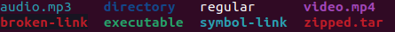

# 系统使用指南

这篇文档是为了记录我在这个操作系统（**Ubuntu** 22.04 Jammy Jellyfish）中的一些挣扎，用于备忘和吐槽。

## 基本设置

### 按键（预设）

首先是一些预设的快捷键。由于 **Ubuntu** 中需要频繁用到命令行，快捷键的用处非常大（事实上，即使在 Windows 上，快捷键依然非常有用；**MacOS** 的话可能触摸板太好用了）。下面提到的控制键中，Super 指的是键盘上的 **Windows** 徽标键（或者 Mac 上的 Command 键）。

- Alt + Tab：切换窗口。
- Super + Tab：切换应用。这和上一个在按住的时候可以通过鼠标来选择特定的窗口。
- Super + A：打开应用面板，此时上方的搜索栏是被激活的，可以直接输入内容搜索应用、文档等内容。从这个界面返回之前的地方只需要按两下 Esc。
- Ctrl + Alt + T：打开终端（命令行）。这个非常常用。我安装 **Ubuntu** 的时候遇到过一些问题，就是借这个快捷键直接打开终端操作的。==终端中的所有指令需要按 Enter 后才会执行==。
- Ctrl + Q：关闭窗口。

在终端中，也有一些便于操作的用法。==比如通过上下箭头键来回顾历史指令，用 Tab 自动补全指令和文件信息==，用 `!<prefix>` 来执行上一个带有相应前缀的指令。有些在终端执行的应用卡住的时候，可以尝试 Ctrl + C、Ctrl + Z 来发送中断指令。需要从终端复制/向终端粘贴文本时，要使用 Ctrl + Shift + C 和 Ctrl + Shift + V（或者如果你对自己的直觉不确定，那就通过右键来复制和粘贴好了）。

有小键盘的朋友可能会误触上面的 Insert 键（比如可能在数字 0 的地方），之后你可能会发现打的字会自动覆盖光标所在处的内容；这个时候只需要再点一下 Insert 键就好了，问题不大。我之前压根不了解这个功能，当时误触了非常迷惑。

原装系统和电脑厂商预设的顶上那一排功能键 **不一定** 在 **Ubuntu** 中好用，不过这点在 22.04 中支持比前面的版本好很多。我的体验是例如扬声器、麦克风、锁屏、飞行模式都是好用的（甚至计算器键都好用），但是！屏幕亮度是不好用的。我有点懒所以没有去设置；不过它可以在右上角显示电量的地方点击打开小窗口调节。此外，支持指纹解锁或人脸识别的朋友可以尝试在 **Ubuntu** 中也激活这些功能，但还需要不少的努力（我尝试适配指纹解锁，不过发现 Lenovo 和指纹检测设备供应商没有给相应的驱动，网络上有类似情况的也没有解决，所以最后也黄了）。

### 包管理

随时通过 `sudo apt update && sudo apt upgrade -y` 检查系统包的更新。

- 通过 `apt list --upgradable` 来检查待升级的包。
- 通过 `apt list --installed` 来检查已经安装的包。
- 通过 `sudo apt install <package>` 来安装某个包。
- 通过 `sudo apt remove <package>` 来卸载某个包。
- 通过 `sudo apt autoremove` 来卸载不再被依赖的包（这会出现在比如 A 包依赖 B 包，因此在下载前者时顺带下载了后者；之后我们卸载了 A 包，这时 B 包 **不会** 被卸载）。

我（毫不犹豫地）安装了下面这些包：

- `gcc`：**C** 编译器和相关组件。
- `g++`：**C++** 编译器和相关组件。（事实上 `gcc` 也可以编译 **C++**，但编译时需要加上 `-lstdc++` 的链接选项；此外，`g++` 将一切 **C** 和 **C++** 文件视为 **C++** 文件处理，而 `gcc` 会区分对待两者）
- `clang`：**C** 和 **C++** 编译器和相关组件。这是 `gcc` 以外的一个选择。

上面这些只需要 `sudo apt install` 就可以完全搞定。事实上，如果执行 `sudo apt install build-essential`，会将 `gcc`、`g++` 以及相关的头文件下载下来。下面开始的一些包稍稍复杂一些：

- `java`：**Java** 需要一个运行时环境（Java Runtime Environment, JRE）以及一个开发包（Java Development Kit, JDK），前者用于运行 **Java** 程序，后者用于开发和编译 **Java** 程序。我运行了下面的指令：

  ```bash
  sudo apt install -y openjdk-17-jre-headless
  sudo apt install -y openjdk-17-jdk-headless
  ```

  当然，也可以不指定版本，用下面的指令：

  ```bash
  sudo apt install -y default-jre
  sudo apt install -y default-jdk
  ```

- **C#** 和 **Java** 类似，也需要一个运行时和开发包。根据微软官网的提示（[链接](https://docs.microsoft.com/en-us/dotnet/core/install/linux-ubuntu)），使用下面的指令：

  ```bash
  wget https://packages.microsoft.com/config/ubuntu/21.04/packages-microsoft-prod.deb -O packages-microsoft-prod.deb
  sudo dpkg -i packages-microsoft-prod.deb
  rm packages-microsoft-prod.deb
  ```

  上面这段指令把微软的包加到我们系统的包仓库中了（这样就可以通过 `apt` 抓取了）；不过这里提供的是其对 **Ubuntu** 21.04 的支持，对 22.04 的支持可能还需要等一段时间，但目前来看没有什么不兼容。随后（记得 `sudo apt update`）：

  ```bash
  sudo apt update
  sudo apt install -y apt-transport-https
  sudo apt update
  sudo apt install -y dotnet-sdk-6.0
  ```

  这里我们只需要安装开发包即可，因为 **C#** 的开发包中包含运行时。

- **Haskell** 的安装可以直接用 `sudo apt install ghc` 仅安装编译器~~（随后再陷入究竟安装哪一个包管理器， `haskell-stack` 还是 `cabal-intsall` 的苦恼当中）~~，不过一个更好的方法是安装一个 `ghcup` 作为顶层的安装器。根据官网的提示（[链接](https://www.haskell.org/ghcup/)），使用下面的命令：

  ```bash
  curl --proto '=https' --tlsv1.2 -sSf https://get-ghcup.haskell.org | sh
  ```

  其中的 `curl` 似乎在 **Ubuntu** 中不是自带的，不过依旧，`sudo apt install curl` 搞定。安装过程中会问你要不要把它放在 `PATH` 当中（而且可以选择放在开头还是结尾），相比某个流氓（我马上就会提到）简直太温柔；此外还会问装不装 `stack` 和 **HLS（Haskell Language Server）**，这里建议都装了（`cabal-install` 似乎是默认装的）

- **Rust** 的安装和 **Haskel** 非常相似（什么叫做精神继承者啊）可以直接用 `sudo apt install rustc` 仅安装编译器（随后再安装包管理工具 `cargo`），但更优的做法是安装一个 `rustup` 作为最顶层的安装器。根据官网的提示（[链接](https://rustup.rs/)），使用下面的命令：

  ```bash
  curl --proto '=https' --tlsv1.2 -sSf https://sh.rustup.rs | sh
  ```

  这之后 `rustc` 和 `cargo` 都已经准备好了。

- 

### 输入法

利用 `sudo apt install ibus-pinyin` 安装拼音输入法，然后在 Settings-Keyboard-Input Source 中添加汉语并选择指定的输入法（在此之前可能还需要在 Settings-Regions&Languages-Language 中下载中文的包）。

### 应用

**Ubuntu** 内置了文本编辑器 `gedit`、浏览器 `firefox`、Office 软件 `libreoffice`，以及其它多媒体应用。不过只有这些还不够。我安装了下面这些软件：

- `code`：Visual Studio Code，非常通用的编辑器，可以在 Ubuntu Store 中找到并下载。注意，在商店中下载的软件都是通过 `snap` 下载的；`snap` 是一个软件打包和布置系统，由 **Ubuntu** 的母公司 **Canonical** 开发（所以 **Ubuntu** 将应用强制通过 `snap` 来管理），它和 `apt` 之间的区别可以参考这篇文章（[链接](https://phoenixnap.com/kb/snap-vs-apt)）。
- `typora`：一个 **Markdown** 编辑器，非常简约高效（1.0 及之后的版本需要收费，可以从[这里](https://typora.io/releases/all)找到所有历史版本）。
- `telegram`：一个通讯聊天软件，界面简洁但功能意外地丰富；单纯用作聊天软件吊打微信。唯一的缺点是查找消息时对中文支持较差（它是按照空格区分词语的）。
- `vlc`：一个视频和音频播放器。

### 自设快捷键

在 Settings-Keyboard-Keyboard Shortcuts 中可以浏览和修改一些快捷键绑定，并自定义快捷键。我看到这个可就睡不着了，立马好好研究了一番。

- 第一组是 Accessibility，主要是字体和页面放大缩小这种，我觉得自己用的不多，所以跳过。
- 第二组是 Launchers，对某些页面的快速访问，我的设置如下：
  - Super + H：打开 Home 文件夹。
  - Super + Shift + ?：打开帮助界面。
  - Super + T：打开终端。
  - Super + B：打开浏览器。
  - Super + /：搜索（实际上这个可以直接按 Super，效果是一样的）。
  - Super + S：打开设置界面。
- 第三组是 Navigation，对界面的控制，我的设置如下：
  - Super + Shift + !：隐藏所有窗口。
  - Super + Num4：向左移动一个 Workspace（有点类似于 MacOS 中的一个桌面，可以通过触摸板左右滑动切换）。
  - Super + Num6：向右移动一个 Workspace。
  - Super + Tab：切换应用。
  - Alt + Tab：切换窗口。
  - Alt + Escape：即时切换窗口（即直接显示切换后的效果）。
  - Super + Enter：在同一应用中切换窗口。
- 第四组是 Screenshots，截屏，我的设置如下：
  - Ctrl + Alt + R：交互式录屏（所谓交互式就是会给你一个可选录屏范围的窗口，然后 Enter 开始录屏，下面同理）。
  - Fn + PrtSc：截图（最普通最古老的截图），存储到 `/home/<username>/Pictures/Screeshots` 文件夹并放到剪切版。
  - Ctrl + Alt + S：交互式截屏。
  - Alt + Fn + PrtSc：对当前（顶部的）窗口截图。
- 第五组是 Sound and Media，跳过。
- 第六组是 System，系统的控制，我的设置如下：
  - Super + L：锁屏。
  - Ctrl + Alt + Delete：登出账号。
  - Super + A：应用面板。
- 第七组是 Typing，输入法相关，我的设置如下：
  - Super + Space：切换到下一个输入法。
  - Super + Shift + Space：切换到上一个输入法。
- 第七组是 Windows，窗口控制，我的设置如下：
  - Ctrl + Q：关闭窗口。
  - Ctrl + H：隐藏窗口（也就是 Windows 中的最小化）。
  - Ctrl + Down：将窗口移动到其它窗口后面。
  - Ctrl + Up：将窗口移动到最前面。
  - Ctrl + Escape：切换全屏模式。
  - Ctrl + M：切换最大化模式。
  - Ctrl + Left：将窗口移动到左半边（再次按下会返回原来状态）。这个快捷键和下面一个可以用于分屏操作（虽然和 **Windows** 类似，这不是真正意义上的分屏，只是强行调整大小到一个 Workspace 中）。
  - Ctrl + Right：将窗口移动到右半边（再次按下会返回原来状态）。

最后一个选项是自己定义快捷键，你可以指定某个键位组合执行的指令（这里的指令就是在命令行执行的指令）。我目前设置了下面这些自定义指令：

- Ctrl + Shift + Alt + S：不影响屏幕显示的交互式截屏。系统自带的截屏会固定住当前的画面；我这个不会固定。此时鼠标会变为十字形状，按住鼠标框选需要的区域后松开鼠标就可以完成截图。如果初始位置选择不合适，可以按 Esc 退出截屏然后重新来过……总体上没有系统自带的好用但是比较随意一点。对应的终端指令如下（需要安装 `gnome-screenshot`，这是一个命令行的截屏程序）：

  ```bash
  #!/bin/bash
  filepath="/home/<username>/Pictures/Screenshots/Screenshot from $(date '+%Y-%m-%d') $(date '+%H-%M-%S').png"
  gnome-screenshot -acf "${filepath}" && cat "${filepath}" | xclip -i -selection clipboard -target image/png
  unset filepath
  ```
  
  这个玩意我写得可费劲了（**Bash** 的字符串简直令人迷惑，尤其是对空格的处理）。

## 终端

我觉得在正式介绍终端使用之前，需要了解 **Linux** 中一些即基本设定：

- ==一切都是文件==，即使文件夹、压缩文件、链接（类似于 **Windows** 中的快捷方式）都是文件（尽管我们会看到，文件夹和文件还是不太一样）。
- 应用程序是一个可执行文件，我们可以在终端中使用指令调用它们。事实上，这些指令就是它们的文件名（比如 `code` 就是 Visual Studio Code）。
- 文件的拓展名（如 `rar`、`jpg` 等） **没有实际意义**。==拓展名只是提示用户其文件类型，但并不能代表它的真实类型==。比如我们可以将一个文件夹命名为 `dir.txt`，也可以将 PDF 文档命名为 `doc.png`。换种角度理解，`.` 只是其名字的一部分而已。（事实上 **Windows** 也是如此，只不过很多软件在打开文件的时候只寻找有特定拓展名的；我们依然可以右击文件并用特定方式打开。

终端是 **Linux** 使用的一个重要组成部分。我们打开的黑色窗口本身也是一个应用程序，我们称这类通过命令行和系统“沟通” 的程序为 **Shell**。我们可以在终端中输入 `sh` 来再次调用终端。它实际上指向一个 Shell 程序，**Bash**，这也是 **Ubuntu** 默认的 Shell。系统中同时也内置了另一个 Shell，**Dash**，我们可以通过 `dash` 调用它。两者各有优劣：简单来说，**Bash** 对 **可移植操作系统接口（Portable Operating System Interface based on UniX）** 的支持更加全面，而 **Dash** 更加快（约四倍的效率）。我们可以使用 `chsh` 指令修改默认的 Shell 程序。

### 基础

用快捷键打开终端后，会看到类似于下面的提示：

```bash
<username>@<devicename>:~$
```

这里的 `<usrname>` 是当前登录的用户名。冒号 `:` 之后，`$` 之前是文件路径信息，其显示你当前的目录。`~` 表示 Home 路径，即 `/home/<username>` ，可以随时通过 `cd ~` 回到这个路径（这里的 `~` 可以省略，因此 `cd` 可以直接回到 Home）。这里的 `cd` 是一个内置的指令（少数不是程序的指令），它会从命令行中访问给定的相对路径或绝对路径。两者的差别如下：

- 相对路径就是形如 `a/b/c` 这样的路径，它会从你当前路径开始搜索名为 `a` 的文件夹，然后搜索 `a` 中名为 `b` 的文件夹，随后搜索 `b` 中名为 `c` 的文件夹，最后进入这个文件夹。如果这些文件夹都存在，那么从 Home 输入 `cd a/b/c` 后命令行上会显示如下的内容：

  ```bash
  <username>@<devicename>:~/a/b/c$
  ```

  如果这个路径中任何一步存在问题，这个指令就不会执行。

- 绝对路径是以 `/` 开头的路径，它指引到系统的根目录。所有系统目录都可以从这里逐层访问到。比如前面我们介绍的 Home 就位于 `/home/<username>`，这就是一个绝对路径。

除此之外，存在一些特殊的“路径”：

- 当前路径，用小数点 `.` 表示。这在指定执行当前目录中的可执行文件时很有用，我们很快就会提到。
- 上级路径，用两个小数点 `..` 表示。我们可以通过 `cd ..` 返回到上级路径。用过 **Windows** 的朋友可能也见到过这个（比如一些压缩文件弹出的文件管理 GUI 中可能就有 `..` 这个文件夹）。

我们可以用 `ls` 指令得到当前目录下的文件，其默认行为甚至会将不同文件类型以不同颜色展示出来（感谢这个[颜色提取网站](https://imagecolorpicker.com/en)）：

- <span style="background-color: #183b76">   </span>（深蓝色）：文件夹。
- <span style="background-color: #2aa0b3">   </span>（深青色）：符号链接。
- <span style="background-color: #27a168">   </span>（深绿色）：可执行文件。
- <span style="background-color: #b81b28">   </span>（深红色）：压缩文件。
- <span style="background-color: #9b46ba">   </span>（深品红色）：图片和视频文件。
- <span style="background-color: #2596be">   </span>（青色）：音频文件。
- <span style="background-color: #c01c26">   </span>（深红色）：破损的链接。
- <span style="background-color: #e3eaf4">   </span>（白色）：多数文本文件。

下面是我从命令行截的图（可以看到还是非常五彩缤纷的，何况这甚至不是默认颜色的全部，我上面只列出了一些常见文件类型的颜色）：



当然，颜色不是唯一辨别文件的方法，我们可以通过 `ls -l` 显示当前路径下的文件详细信息。其中每一行的第一个字母代表了文件的类型，有下面几个分类：

- `d`：表示文件夹。
- `l`：符号连接。
- `-`：普通文件。

这个字母后面还跟着九个字母，我们可以等分为三个部分。第一个部分中的第三个字母如果是 `x`，且该文件不是一个文件夹，那么它就是一个可执行文件。一个比较通用的显示所有文件详细信息的指令是 `ls -lah`。它会显示隐藏文件（`-a`），并以“人类可读”（`-h`）的形式显示信息（其实就是把文件大小从字节数变为我们熟悉的 `K`、`M`、`G` 等单位了）。我们可以发现，==所有以 `.` 开头的文件都是隐藏文件==，包括 `.` 和 `..`（这也暗示我们，如果想要默认隐藏某个文件，只需将其开头加上一个 `.` 就可以了。

如果要创造一个文件，可以使用 `touch <filename>` 指令，其内容为空。不过对于文件夹，我们需要使用 `mkdir <dirname>` 了。如果要创建一连串（嵌套）的文件夹，可以使用 `-p` 选项：`mkdir -p a/long/dir/chain`。

相应的，可以使用 `rm <filename>` 来（永久）移除一个文件，**这个操作是不可逆的**！对应的，使用 `rmdir <dirname>` 来（永久）移除一个空文件夹（某种程度上这防止你移除有内容的文件夹）。如果需要移除文件夹以及其中的所有内容，可以使用 `rm -r <dirname>`，它会递归地将该文件夹中所有内容都移除（这个命令非常危险！）。一个安全的习惯是为所有 `rm` 指令使用 `-i` 选项，它会对每个要移除的文件进行询问，得到确认后才进行移除。

文件的拷贝和移动（也就是剪切）使用 `cp` 和 `mv` 两个指令，它们对文件和文件夹都能生效。不过需要注意的是，这两个指令要求给出文件的路径（而不是其所在文件夹的路径），因此我们需要将文件的路径完整写出来。举个例子，如果要把当前目录下的 `test.txt` 文件移动到 Home 目录中的 `dir` 文件夹中，需要这么写：

```bash
mv text.txt ~/dir/text.txt
```

事实上这也是 **Linux** 中==文件重命名的方式：`mv original new`==。

执行可执行文件只需要输入指令 `./<exec-filename>` 即可。理论上我们只需要输入可执行文件的名字，但系统会首先从你的系统路径 `PATH` 中寻找这个名字的文件，均无果后才会到当前文件夹中寻找它。为了防止系统中同名的文件将其隐藏，我们推荐一律使用 `./` 来显式指明为当前文件夹。

上面提到的 `PATH` 是一个重要的概念。之所以我们能在任何路径下都能直接输入指令执行，就是因为这些指令的路径被添加到了 `PATH` 中。`PATH` 是一个系统的 **环境变量（Environment Variable）**，其由多个路径通过冒号 `:` 分割。比如 `/usr/sbin:/usr/bin:/sbin:/bin:/snap/bin` 就是一个合法的 `PATH`。当我们输入某个指令时，系统会首先从前到后逐个路径寻找。如果想要知道当前的系统变量，可以使用 `echo $PATH` 指令（`echo` 用于输出一段字符串的内容，==环境变量除了定义时，其它情况下必须使用 `$` 作为前缀==，~~**PHP** 不会学的就是你吧~~）。

可以使用 `env` 指令来浏览所有的环境变量。

我们可以轻易地定义或修改环境变量，使用下面的语句（注意等号两边不能带有空格）：

```bash
export VAR="Some script"
```

我们当然也可以修改 `PATH`，比如直接让它变成空：`export PATH=""`。好了，现在我们不再会受到系统指令的烦扰，可以开始沉浸于自己的世界了…… 等下，好像连 `ls` 都没法用了，这可怎么办？毋须担心，因为所有对环境变量的修改都是临时的，在终端加载的时候会重新从系统的特定文件中读取（确切来说是 `/etc/environment`）；只要你不修改这个文件，我们就不会丢失预设的系统变量。遇到上面的情况，只需要重新开一个终端就恢复原状了。

这很好…… 但是！那不就意味着我们如果真的想要修改系统变量（并让它在每次开启都生效），只能修改 `/etc/environment` 呢？要知道，这是一个系统文件（所有不在 Home 目录下的，我们都没有权限修改），如果修改必须使用 `sudo` 指令，即使你是该电脑的唯一用户（且是管理员），这样修改也有点让人膈应。解决方法其实意料之中：写一个打开终端时自动执行的脚本，它是位于 Home 路径下的 `.bashrc`。在最后一行加上我们自定义的 `export PATH=$PATH:"Some Path"` 即可。

最后总结以下本小节中遇到的一些指令：

- `cd <path>`：移动到给定的路径。
- `echo <strings>`：在终端中打印字符串。
- `cat <filename>`：以文本格式读取文件。
- `env`：在终端中打印所有环境变量。

### 一些应用

我们现在已经知道，只要应用（可执行文件）位于系统目录下，就可以随地使用指令调用程序。下面列举一些或许在你意料之外的程序名称：

- `nautilus`：文件管理器，也就是任务栏中的 Files。我们可以在终端中一顿操作后直接 `nautilus .` 来打开当前文件夹。
- `gedit`：默认的文本编辑器。如果你不需要 `code` 这样的开发工具，又不想用 Vim 这样系统自带的瑞士军刀（讲个笑话，新手如何从 Vim 中退出），你可以使用 `gedit`。只需 `gedit <filename>` 就可以打开对应的文件的文本格式了。只不过不像 `code`，`gedit` 无法打开一个文件目录。
- `hardinfo`：系统和硬件的信息浏览器。在上面还可以对 **CPU** 和 **GPU** 等进行跑分并输出 **HTML** 格式的报告。这个默认没有安装，需要使用 `sudo apt install hardinfo`。

