# Git

**Git** 是一个强大的 **版本控制（Version Control）** 软件，它能够记录一系列文件的任何变化，且支持分布式、非线性的工作流。它由 **Linux** 之父 *Linus Torvalds* 创造出来，最初是为了协助开发 **Linux** 内核。现在，**Git** 已经广泛用于多人协作的项目中，每个人都可以在本地创建远程仓库的克隆，并可以在不同的 **分支（Branch）** 中修改代码，最后 **合并（Merge）** 到主分支中。

**Git** 可以说是我 **CS** 实践中的两个头疼点之一，大学里面 **CS** 的大小项目都需要通过 **Git** 管理，但是自己从来没有系统学过，导致出现过很多奇怪的问题。比如合并冲突、**Vim** 乱入等，有时可能要删掉本地仓库再克隆才解决，还因为 **Git** 丢过作业分。如今考虑到之后管理项目时，不应当在这种工具上屡屡出错，所以让我们把它给一举攻下吧！

[TOC]

## 基础

首先，**Git** 是一个软件，也就是可执行文件。如果我们将它所在路径添加到了系统路径中，我们就可以直接在命令行（**Shell**、**Terminal**、**Cmd** 等）里面使用 `git` 指令了：

```bash
$ git
```

上面的 `$` 是一个命令行提示符，我们只是想用这个说明现在是在命令行中操作。输入 `git` 并回车后，会发现显示了 **Git** 的用法说明：

```bash
usage: git [--version] [--help] [-C <path>] [-c <name>=<value>]
           [--exec-path[=<path>]] [--html-path] [--man-path] [--info-path]
           [-p | --paginate | -P | --no-pager] [--no-replace-objects] [--bare]
           [--git-dir=<path>] [--work-tree=<path>] [--namespace=<name>]
           <command> [<args>]
#... 这里还有许多其它内容，恕不在此列出
```

如果使用 `git --help` 也能显示上面这段内容。特别地，使用 `git help <cmd>` 可以查询 **Git** 支持的特定指令的用法：

```bash
$ git help clone
```

比如上面这段内容会让 **Git** 显示 `git clone` 指令的用法手册，结果中的一小部分如下图所示：

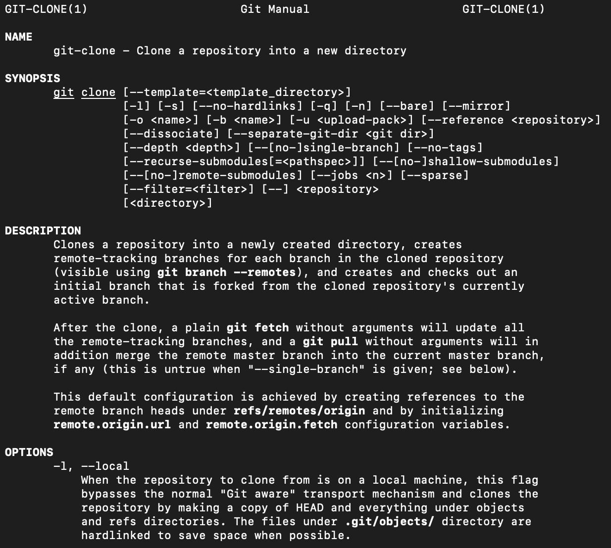

如果用过 **Linux Man Page** 的会发现它们风格完全一致，会告诉你指令的语法、描述、可选参数等，还可能有示例。如果想要退出手册界面，只需按下 `Q` 键（顺带一提，手册界面中也可以使用上下键、翻页键等进行操作）。学会了打开 **Git** 用法手册，就已经开了个好头。我们遇到任何不确定的指令，都可以来这里寻找说明。

在着手开始建立项目之前，建议告诉 **Git** 你的一些基本信息，即名字和邮箱，这有助于标记代码 **提交（Commit）** 时的作者信息。

```bash
$ git config --global user.name "Yiming Yu"
$ git config --global user.email "yu.yiming.self@gmail.com"
```

## 创建本地仓库

在你的项目路径下，你可以使用 `git init` 来创建一个空 **仓库（Repository）**：

```bash
(path/to/your/project) $ git init
```

这会在你的当前目录下创建 `.git` 文件夹，之后所有的仓库信息都将在这个文件夹中存储。由于它是用 `.` 开头的文件，系统可能默认不会显示它们，我们可以通过在命令行中输入 `ls -a`（**Linux** 及 **MacOS**）或在文件资源管理器（**Windows**）中上方的设置里让其显示隐藏的文件即可看到它们。如下图所示：

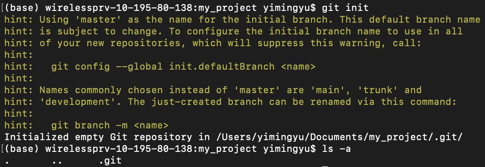

这之后，我们就可以填充自己的项目了。不过 **Git** 并不会自动提交任何文件改动，我们需要使用 `git add` 命令来将特定文件的状态放到 **暂存区（Staging Area）**。暂存区存在的目的在于，我们有时不希望将所有对项目的修改都进行保存（即提交），所以需要手动指出准备保存的文件。

假设我们创建了一个空的文本文件 `empty.txt`，可以通过 `git status` 指令来检查本地仓库中没有放到暂存区或没有提交的文件：

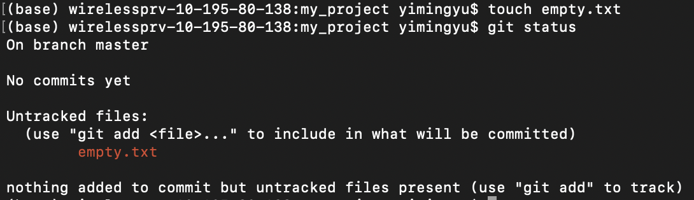

第一句 `touch empty.txt` 创建了一个文本文件，此时对本地仓库检查时，发现它并没有放到暂存区中（甚至没有经过 **追踪（Track）**，即从来没有通过 **Git** 管理过）。此时这个文件会以红色进行列出，并提示我们使用 `git add <file>...` 暂存这个文件。暂存后，再次检查如下：

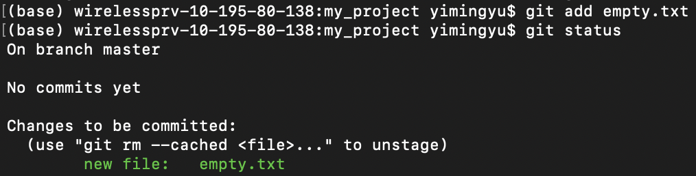

此时我们就可以通过 `git commit` 指令来真正地保存这个文件的所有更新信息了。建议直接使用 `-m <msg>` 参数，否则会需要在 **Vim** 环境下给出这个提交信息，我们暂时还不想做 **Vim** 教学。

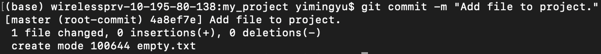

执行 `git commit` 后会给出当前的分支、提交信息、（相比上次提交）修改的文件数量、增减的行数，这些可以作为参考。此时再进行 `git status` 会显示当前仓库中没有尚未保存的文件：

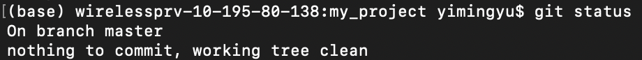

如果我们修改了本地的文件，我们依然可以通过 `git add` 来保存修改：

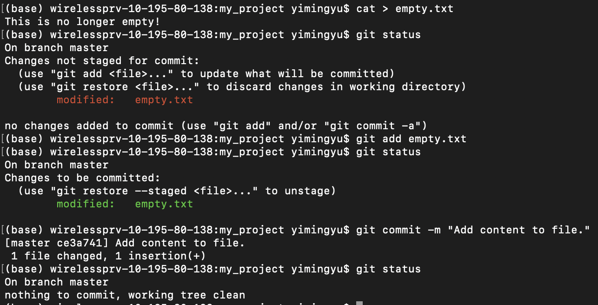

第一句的 `cat > empty.txt` 让我们向命令行输入想要覆盖到 `empty.txt` 的内容，以 `Ctrl-D` 结束。随后通过 `git status` 我们发现这个文件被标记为修改过的，因此我们依旧通过 `git add` 和 `git commit` 将其保存起来。

如果存在多个需要暂存的文件，我们可以将其一个个排列到 `git add` 指令后，像下面这样：

```bash
$ git add file_1 file_2 file_3
```

如果有需要添加一整个文件夹的文件，可以直接使用 `git add <dir>` 来暂存其中的所有文件。`git add .` 则会将当前路径下 *所有* 修改过的文件、文件夹中的文件（层层递归）加入暂存区，这常用于为已有的项目设置仓库，此时只需 `git init` 后 `git add .` 并 `git commit` 即可。

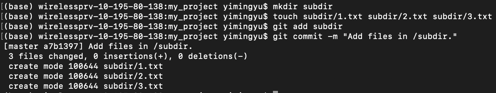

此外还有两个常用的，用于批量暂存文件的指令，`git add -A` 和 `git add -u`。前者会将仓库中所有修改过或未追踪的文件 `git add` 进来，同时也对已经删除的此前追踪的文件停止追踪；后者则不会增加未追踪的文件。为了对比这几个常见的指令，下面让我们用图表简单说明：

| 指令             | 操作对象         | 暂存未追踪文件 | 暂存修改的文件 | 停止追踪已经删除的文件 |
| ---------------- | ---------------- | -------------- | -------------- | ---------------------- |
| `git add <file>` | 单个文件         | 是             | 是             | 否                     |
| `git add <dir>`  | 单个文件夹       | 是             | 是             | 否                     |
| `git add .`      | 当前目录所有文件 | 是             | 是             | 否                     |
| `git add -A`     | 当前仓库所有文件 | 是             | 是             | 是                     |
| `git add -u`     | 当前仓库所有文件 | 否             | 是             | 是                     |

如果对 `git add` 后再 `git commit` 的操作有些厌烦，可以直接使用 `git commit -a` 一步提交所有被修改的文件。

以上我们就简单浏览了 **Git** 保存本地仓库文件的基本步骤。但至此，我们还没有感受到它和更加常见的网盘或其它存档方式有什么本质区别，而且可能还有些笨拙：保存特定文件需要首先 `git add`，然后再 `git commit`，其中还需要给出提交信息。不过，后文中我们会渐渐领略 **Git** 的强大之处。

作为本章结尾，我们来看看之前那些提交在 `.git` 文件夹中都记录下了什么信息吧。使用 `git log` 指令可以回顾当前仓库的所有提交记录：

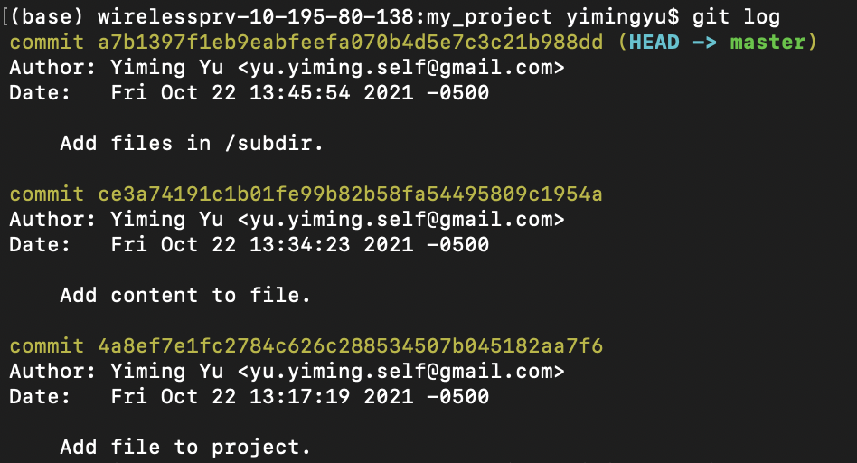

上面记录了每次提交的作者信息，时间信息和提交信息。如果需要每次提交时前后的对比信息，可以使用 `git log -p` 指令：

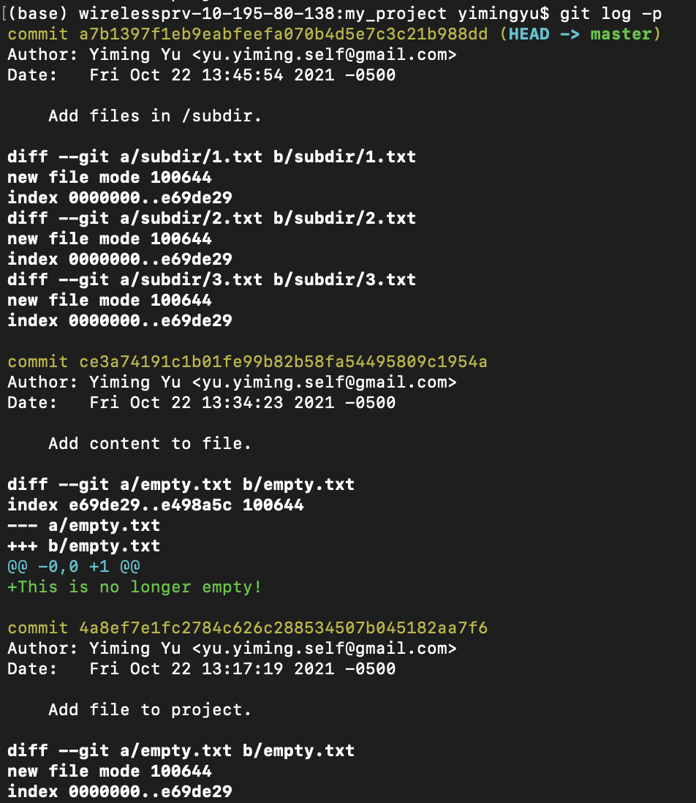

可以看到中间甚至列出了我们对文件修改的具体内容。对于一个大型的项目，使用 `git log -p` 可能会产生巨量的信息。更常用的提交信息总结可以使用 `git log --stat --summary` 指令：

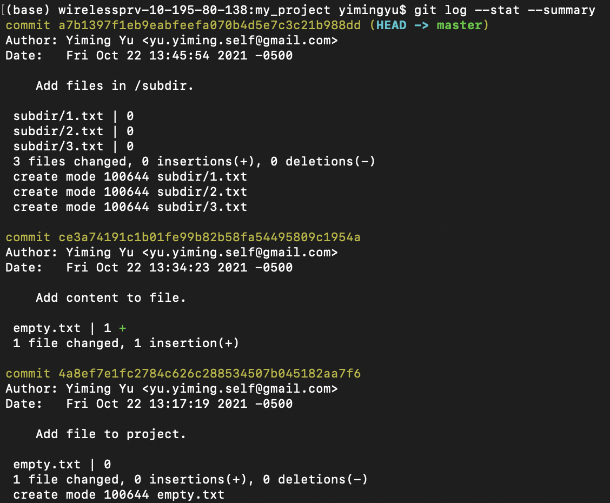

它将每次提交时的变化项用字节数量和绿色的加号或红色的减号，非常简洁直观。

## 分支

**Git** 相比网盘的一大特色就是 **分支（Branch）** 的设计。一个仓库中存在多个并行的分支，我们可以将项目的不同部分在不同分支上提交，待合适时机再 **合并（Merge）** 到主分支中。`git branch <branch>` 可以为仓库创建新的分支，随后使用 `git switch <branch>` 指令就能切换环境到这个新分支中。顺便，可以通过 `git branch` 指令检查当前所在分支：

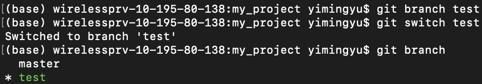

需要注意的是，新分支会以创建分支时所在分支的进度为起点，随后在这个分支上的提交 *均不会* 影响到原来的分支；其它的分支上的提交也不会影响到这个分支。因此分支一旦产生，当前仓库就好像真的延伸出不同的发展方向一样，非常形象。

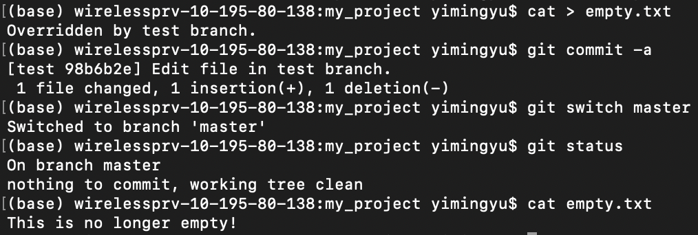

上面的图示中，我们在 `test` 分支中对 `empty.txt` 进行修改，随后提交。然而当我们切换到 `master` 分支后，本地的 `empty.txt` 居然和之前保持相同。