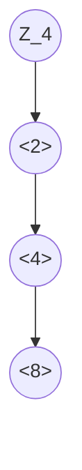

# Abstract Algebra I

本篇是 *UIUC MATH 417 Introduction to Abstract Algebra I* 的学习笔记。参考书籍是 *Abstract Algebra, 3rd Edition: Dummit & Foote*。

[TOC]

$$
\newcommand{\nrmsubeq}[0]{\mathrel{\unlhd}}
\newcommand{\im}[1]{\operatorname{im}#1}
$$

## 群论

**群（Group）** 是一个代数结构，其定义为一个二元组 $(G, \star)$，其中 $G$ 是一个集合，而 $\star: G\times G \to G$ 是一个二元函数。习惯上我们将其写成中缀的形式，即 $a\star b \equiv \star(a, b)$。群上的二元函数需要满足：

- **结合性（Associativity）**：$a\star(b\star c) = (a\star b)\star c$。
- 存在 **单位元（Identity）** $e$ 满足 $e\star a = a\star e = a$ 对任意 $a \in G$ 都成立。
- 对任意 $a \in G$ 都存在 $b \in G$ 令 $a\star b = b\star a = e$，称其为 $a$ 的 **逆元（Inverse）**。

虽然在定义中没有指出，但任何群上的单位元都是唯一的。不然，设 $e_1 \ne e_2$ 都是单位元，此时有 $e_1 = e_1e_2 = e_2$ 矛盾。同时，任意元素 $a$ 的逆元 $b$ 也是唯一的。不然，设 $b_1 \ne b_2$ 都是 $a$ 的逆元，此时有 $b_1 = b_1e = b_1(ab_2) = (b_1a)b_2 = eb_2 = b_2$ 矛盾。

> 惯用：在明确二元函数的情况下，我们通常使用 $G$ 直接指代某个群。二元函数类似于加法时，我们将其记为 $+$，否则会经常省略（类似于乘法）。同一个元素重复运算时，对加法群我们采用标量乘法的记号，如 $2a = a + a$；乘法群则采用指数的记号，如 $a^3 = aaa$。
>
> 单位元有时也会写成 $0$（加法运算）或 $1$（乘法运算）。由于逆元是唯一的，我们在加法群中将其记为 $-a$；乘法群中记为 $a^{-1}$。逆元的记号可以和标量乘法或指数记号完美结合，比如两个 $-a$ 的运算记为 $-2a$，而三个 $a^{-1}$ 的运算记为 $a^{-3}$。

逆元的运算有下面的一些性质：

- $(a^{-1})^{-1} = a$。这本质上说明了 $a^{-1}$ 的逆元是 $a$ 本身，这是显然的。
- $(a\star b)^{-1} = b^{-1}\star a^{-1}$。由 $(a\star b)\star(b^{-1}\star a^{-1}) = a\star(b\star b^{-1})\star a^{-1} = a\star a^{-1} = e$ 以及逆元的唯一性可以得到。

借助逆元，我们可以推导出群上的 **消去律（Cancellation Law）**：

- 由 $au = av$ 可以得到 $u = v$。只需对等式两侧同时用 $a^{-1}$ 操作即可。
- 由 $au = bu$ 可以得到 $a = b$。只需对等式两侧同时用 $u^{-1}$ 操作即可。

> 举例：在初等数学中我们就大量接触群了，如 $\mathbb{Z}$、$\mathbb{Q}$、$\mathbb{R}$、$\mathbb{C}$ 都是加法群。对于乘法群，我们需要将危险因素（零）剔除，$\mathbb{R}^+$、$\mathbb{Q} - \{0\}$ 等都是乘法群。加法群中的单位元是 $0$，而乘法群的单位元是 $1$。值得注意的是两种群中元素的逆元记号和代数中使用的完全一致：$-2$ 是 $2$ 在加法群 $\mathbb{Z}$ 中的逆元，而 $2^{-1}$ 是 $2$ 在乘法群 $\mathbb{Q}$ 中的逆元。

群并不要求 **交换性（Commutativity）**，即 $a\star b = b\star a$。如果群上的二元函数满足交换律，则称其为 **阿贝尔群（Abelian Group）**。

***

一些群可以通过其某个子集张成整个集合。比如 $\mathbb{Z}$ 中我们可以通过 $1$ 与自身有限次相加或取逆元得到任意整数；我们将这样的子集称为群的 **生成元（Generator）**，记作 $G = \langle A\rangle$。

> 惯用：我们会使用类似于集合的表示方式将群展示为其生成元和一些约束条件作用的产物，形如 $G = \langle a_1, \dots, a_n \mid R_1, \dots, R_k\rangle$。这也被称为 **群展示（Group Presentation）**。

因此整数加法群可以写成 $\langle 1 \rangle$。生成元不一定是唯一的，比如整数加法群也可以写成 $\langle -1\rangle$。

如果一个群的生成元只有一个元素，我们称其为 **循环群（Cyclic Group）**。此时所有元素都可以写成 $a^n$（或 $na$）的形式。循环群一定是阿贝尔群。

***

由于群的简单性，我们很容易在不同的群中找到类似的地方。比如。可以通过一些函数将一个群中的元素映射到另一个群上，且前后具有相同的结构。比如考虑 $(G, \star)$ 和 $(H, \diamond)$ 及 $\varphi: G\to H$ 满足：
$$
\varphi(a\star b) = \varphi(a)\diamond \varphi(b)
$$
此时我们称 $\varphi$ 是一个定义从 $G$ 映射到 $H$ 的 **同态（Homomorphism）**。特别地，若 $\varphi$ 是一个双射，此时 $G$ 和 $H$ 具有相同的基数，两者被称为相互 **同构（Isomorphic）**，记作 $G \cong H$。这种情况下，所有适用于 $G$ 的性质可以稍经修改作用于 $H$，反之亦然。实际上，同构的群之间的差异仅限于记号，其结构是完全相同的。

> 举例：$G\cong G$，这是显然的。对于加法群 $\mathbb{R}$ 和乘法群 $\mathbb{R}^+$，我们可以让指数函数 $\text{exp}$ 成为两者的同构。

同态的 **核（Kernel）** 定义为群中被映射到单位元的子集：
$$
\ker{\varphi} = \{g \in G \mid \varphi(g) = e \}
$$
定义同态的 **纤维（Fiber）** 是一个映射到相同元素的集合，因此 $\ker{\varphi}$ 是 $\varphi$ 的映射到单位元的纤维。取某个纤维 $A = \varphi^{-1}(h)$，有：

- $A = \{ak \mid k \in \ker{\varphi}\}$ 对任意 $a \in A$ 成立。
- $A = \{ka \mid k \in \ker{\varphi}\}$ 对任意 $a \in A$ 成立。

设 $g \in A$，则 $\varphi(g) = h$。记 $K = \ker{\varphi}$ 及 $gK = \{gk \mid k \in K\}$，则对于任意 $k \in K$：
$$
\varphi(gk) = \varphi(g)\varphi(k) = \varphi(g)e = \varphi(g) = h
$$
因此 $gk \in A$，推出 $gK \subseteq A$。现在考虑 $k = g^{-1}x$，其中 $x \in A$（此时有 $x \in gK$）：
$$
\varphi(k) = \varphi(g^{-1})\varphi(x) = \varphi(g)^{-1}\varphi(x) = h^{-1}h = e
$$
因此 $k \in K$，推出  $A \subseteq gK$，综合就得到 $A = \{ak \mid k \in \ker{\varphi}\}$。第二个命题证明方法非常类似。

***

群的一个常用之处是将其作用于某个集合之上，并得到新的集合。群 $G$ 对集合 $A$ 的 **群作用（Group Action）** 指的是函数 $\cdot: G\times A \to A$。比如 $g\cdot a$ 就是特定的元素 $g\in G$ 作用于 $a \in A$ 得到的结果。群作用需要满足下面两个性质：

- $g_1\cdot(g_2\cdot a) = (g_1g_2)\cdot a$。注意这里我们采用了乘法群的惯用写法，省略了 $g_1$ 和 $g_2$ 之间的乘号。
- $e\cdot a = a$。

> 惯用：如果群作用和群的二元函数相同，我们会同样省略群作用的乘号。比如 $ga$ 代表 $g\cdot a$。对于加法群，也常将乘号写为加号，比如 $g + a$ 代表 $g\cdot a$。

只观察群中特定元素 $g$ 时，它对集合 $A$ 的作用可以通过函数 $\sigma_g: a \mapsto g\cdot a$ 来表示。这个函数是一个双射：考虑 $\sigma_{g^{-1}}$，不难发现：
$$
(\sigma_{g^{-1}}\circ \sigma_g)(a) = \sigma_{g^{-1}}(\sigma_g(a)) = g^{-1}\cdot(g\cdot a) = (g^{-1}g)\cdot a = a
$$
因此 $\sigma_{g^{-1}}$ 是 $\sigma_g$ 的逆。

> 举例：向量空间 $V$ 上的标量乘法 $\cdot : F\times V \to V$ 可以看成乘法群 $F$ 对 $V$ 的群作用。具体写出来是：
> $$
> \lambda(v_1, \dots, v_n) = (\lambda v_1, \dots, \lambda v_n)
> $$

至此我们已经对群有了一个初步的了解，下面正式开始群论的学习。

### 常见的群

为了后面易于举例，让我们先了解一些常见的群。由于目前的知识储备非常有限，下面可能只会给出不正式的定义。

- 有限循环群 $Z_n$。

  我们可以通过整数和余数运算来定义有限循环群 $Z_n = \{0, 1, \dots, n-1\}$。定义二元运算 $+$：
  $$
  x + y = x + y\ (\text{mod}\ n)
  $$
  比如 $Z_3$ 中，$1 + 2 = 0$。不难看出单位元是 $0$，而任意元素 $x$ 的逆元是 $-x = n - x$。

  在有限循环群中，所有元素对自身重复运算数次后都会得到单位元 $0$，比如 $Z_4$ 中 $4\cdot 1 = 0$、$2\cdot 2 = 0$、$4\cdot 3 = 0$ 等。对于任意群中的元素 $g$，其最小满足 $g^k = e$ 的正整数 $k$ 称为它的 **阶（Order）**，记作 $|g|$。特别地，$Z_n$ 生成元的阶数等于 $n$，即元素的个数；反过来说，如果 $g \in Z_n$ 的阶是 $n$，则它一定是 $Z_n$ 的生成元。

  有限循环群中元素的阶可以通过下面的公式得到：
  $$
  |x^a| = \frac{n}{(n, a)}
  $$
  其中 $(x, a)$ 是 $x$ 和 $a$ 的最大公约数。因此只要 $a$ 和 $n$ 互素，$x^a$ 就能称为 $Z_n$ 的生成元。特别地，对于 $Z_p$（$p$ 是素数），其单位元以外的所有元素都是生成元。

  虽然我们使用整数的加法余数群来代表有限循环群，但实际上基数相同的任意两个有限循环群都同构，考虑 $\langle x\rangle$ 和 $\langle y\rangle$：
  $$
  \varphi: x^k \mapsto y^k
  $$
  不难证明这是一个同构。

- 二面体群 $D_{2n}$。

  考虑一个 正 $n$ 边形，以顺时针顺序为其顶点依次标上 $1, \dots, n$。此时我们可以利用旋转（$\pi/n$）或指定轴（顶点 $1$ 和中心的连线）镜像翻转使其依然和原来的图形重叠。注意到一次翻转后顶点的标记顺序变成逆时针；两次翻转之后再次回到顺时针。因此我们可以将二面体群抽象为 $D_{2n} = \{1, r, \dots, r^{n-1}, s, sr, \dots, sr^{n-1}\}$，其中 $r$ 表示旋转操作，而 $s$ 表示翻转操作。其中的 $2n$ 个元素正好对应了顺时针 $n$ 种和逆时针 $n$ 种排序。

  下面让我们探索 $D_{2n}$ 中元素的运算规律。当只存在 $r$ 时，其行为和 $Z_n$ 相似：$r^n=1$，$r^{-i} = r^{n-i}$；当只存在 $s$ 时，其行为和 $Z_2$ 相似：$s^2 = 1$，$s = s^{-1}$。同时，我们可以证明 $r^is = sr^{-i}$：
  $$
  (r^is)(sr^{-i})^{-1} = r^is(r^is^{-1})
  $$
  这个过程相当于顺时针转 $i\pi/n$，镜像翻转，随后顺时针再转 $i\pi/n$（转回初始位置，只不过处于翻转状态），最后再镜像翻转回来，因此最后得到的是 $1$。这证明了 $r^is$ 和 $sr^{-i}$ 相同。

  综合其运算性质，我们可以将二面体群表示为：
  $$
  D_{2n} = \langle r, s \mid r^n = s^2 = 1, rs = sr^{-1}\rangle
  $$
  这里的约束 $rs = sr^{-1}$ 可以通过归纳推出此前我们讨论的性质：
  $$
  r^{k+1}s = r(r^ks) = r(sr^{-k}) = (rs)r^{-k} = (sr^{-1})r^{-k} = sr^{-(k+1)}
  $$

- 对称群 $S_n$。

  对任意非空集合 $\Omega$，定义 $S_\Omega$ 为所有定义在 $\Omega$ 上的 **置换（Permutation）**，即 $\Omega \to \Omega$ 的双射。定义二元运算 $\circ$ 为 $S_\Omega$ 上的函数复合运算，即：
  $$
  (\sigma_1\circ\sigma_2)(s) = \sigma_1(\sigma_2(s))
  $$
  设 $S_\Omega$ 上的单位元 $1$ 满足 $s \mapsto s$。由于置换是一个双射，我们总能找到 $\sigma$ 的逆 $\sigma^{-1}$。至此我们成功构造了 $\Omega$ 上的对称群 $S_\Omega$。特别地，当 $\Omega$ 是序数集 $\{1, 2, \dots, n\}$ 时，我们将置换群写作 $S_n$。

  由基础的组合知识，我们不难得到 $S_n$ 的基数为 $n!$（$1$ 能映射到的数有 $n$ 种选择，之后 $2$ 能映射到的数有 $n-1$ 种选择，以此类推）。

  > 惯用：我们通常用 **循环分解（Cycle Decomposition）** 的形式表示一个置换，这个表示法基于一个事实：对任意的置换 $\sigma$，从一个初始元素 $a$ 开始，不断重复通过 $\sigma$ 映射，最后一定会回到 $a$（这是因为集合 $\Omega$ 的大小是有限的）。因此，我们可以将映射路径上的元素按照顺序写在一起，并将映射记为多个类似的循环组的形式。
  >
  > 以下面的 $\sigma \in S_7$ 为例：
  > $$
  > \begin{align*}
  > 	\sigma(1) &= 4 & \sigma(2) &= 3 & \sigma(3) &= 2 & \sigma(4) &= 7 \\
  > 	\sigma(5) &= 5 & \sigma(6) &= 6 & \sigma(7) &= 1
  > \end{align*}
  > $$
  > 可以看到 $1$、$4$、$7$ 是一个循环，$2$、$3$ 是一个循环，而 $5$、$6$ 分别和自己形成一组。因此循环分解的形式如下：
  > $$
  > (1\ 4\ 7)(2\ 3)
  > $$
  > 自己单独一组的情况会被省略。

  对于 $n \ge 3$，对称群都不是阿贝尔群。比如：
  $$
  (1\ 2)\circ(1\ 3) = (1\ 3\ 2) \qquad (1\ 3)\circ(1\ 2) = (1\ 2\ 3)
  $$

- 广义线性群 $GL_n(F)$。

  **域（Field）** 是满足四则运算封闭性的集合（除了 $0$ 不能作为除数），如 $\mathbb{Q}$、$\mathbb{C}$ 等。

  > 惯用：我们常将域记作 $F$。

  不难判断 $F$ 是加法阿贝尔群，而 $F-\{0\}$ 是乘法阿贝尔群。有关域的性质我们会在后文仔细讨论。

  $GL_n(F)$ 中的元素是存储 $F$ 的 $n\times n$ 非奇异矩阵。此时它形成一个矩阵乘法群，其单位元是单位矩阵 $I_n$，矩阵 $A$ 的逆元就是 $A^{-1}$。
  
- Klein 四元群 $V_4$。

  如果用群展示定义 Klein 四元群：
  $$
  V_4 = \langle a, b \mid a^2 = b^2 = (ab)^2 = e \rangle
  $$
  用表展示可能会更加直观：

  | $\cdot$ | $1$  | $a$  | $b$  | $c=ab$ |
  | ------- | ---- | ---- | ---- | ---- |
  | $1$     | $1$   | $a$  | $b$  | $c$  |
  | $a$     | $a$  | $1$  | $c$  | $b$  |
  | $b$     | $b$   | $c$  | $1$  | $a$  |
  | $c=ab$  | $c$ | $b$ | $a$ | $1$ |

  可见 $V_4$ 是一个阿贝尔群。
  
- 四元数群 $Q_8$。

  四元数的四个基与其逆元和它们的乘积组成的群：
  $$
  Q_8 = \{\pm 1, \pm i, \pm j, \pm k \}
  $$
  其满足运算规律：
  $$
  i^2 = j^2 = k^2 = -1 \\
  \begin{align*}
  	ij &= k & ji &= -k \\
  	jk &= i & kj &= -i \\
  	ki &= j & ik &= -j
  \end{align*}
  $$
  这里可以注意到的特别之处在于，虽然 $Q_8$ 看起来是一个乘法群，但出于习惯还是将 $1, i, j, k$ 的逆元写成 $-1, -i, -j, -k$。

### 子群

对于群 $G$，如果其子集 $H \subseteq G$ 通过相同的二元函数也构成群，则称 $H$ 是 $G$ 的子群，记作 $H \le G$。

> 子群推断：对于 $G$ 的非空子集 $H$，如果对于任意 $x, y \in H$ 都满足 $xy^{-1} \in H$，则 $H \le G$。

> 举例：加法群 $\mathbb{Z} \le \mathbb{Q} \le \mathbb{R}$。设 $G = \{1, r, \dots, r^{n-1}\} \cong Z_n$，则 $G \le D_{2n}$。

#### 特殊的子群

在任意群中有一些重要的子群。

- 子集 $A$ 在群 $G$ 上的 **中心化子（Centralizer）** 定义为：
  $$
  C_G(A) = \{g\in G \mid gag^{-1} = a, \forall a \in A \}
  $$
  让我们证明它是 $G$ 的子群：首先显然 $e \in C_G(A)$，因此中心化子非空。随后对于任意 $g_1, g_2 \in C_G(A)$，考虑 $g_1g_2^{-1}$：
  $$
  g_1g_2^{-1}a(g_1g_2^{-1})^{-1} = g_1(g_2^{-1}ag_2)g_1^{-1} = g_1ag_1^{-1} = a
  $$
  因此 $g_1g_2^{-1} \in C_G(A)$。根据子群推断规则便有 $C_G(A) \le G$。

  > 惯用：如果选取的子集 $A$ 只有一个元素 $a$，则将中心化子写作 $C_G(a)$。

  中心化子在群中选取了和特定子集互易的子群（观察条件 $gag^{-1} = a$ 实际上等价于 $ga = ag$）。对于阿贝尔群，其任意中心化子都是其自身。

- 群 $G$ 的 **中心（Center）** 定义为：
  $$
  Z(G) = \{g \in G \mid gx = xg, \forall x \in G\}
  $$
  实际上，$Z(G) = C_G(G)$，因此自然有 $Z(G) \le G$。

- 定义 $gAg^{-1} = \{gag^{-1} \mid a \in A\}$，则子集 $A$ 在群 $G$ 中的 **正规化子（Normalizer）** 定义为：
  $$
  N_G(A) = \{g \in G \mid gAg^{-1} = A\}
  $$
  注意到中心化子是正规化子的子集。不难证明 $N_G(A)$ 是 $G$ 的子群，因此综合前两条我们得到：
  $$
  Z(G) \le C_G(A) \le N_G(A)
  $$
  
- 考虑群 $G$ 对集合 $A$ 的群作用，$a \in A$ 在 $G$ 中的 **稳定化子（Stabilizer）** 定义为：
  $$
  G_a = \{g \in G \mid g\cdot a = a \}
  $$
  让我们证明它是 $G$ 的子群：首先显然 $e \in G_a$，因此稳定化子非空。随后对于任意 $g_1, g_2 \in G_a$，考虑 $g_1g_2^{-1}$：
  $$
  (g_1g_2^{-1})\cdot a = g_1\cdot(g_2^{-1}\cdot a) = g_1\cdot(g_2^{-1}\cdot (g_2\cdot a)) = g_1\cdot((g_2^{-1}g_2)\cdot a) = g_1\cdot(e\cdot a) = g_1\cdot a = a
  $$
  因此 $g_1g_2^{-1} \in G_a$。根据子群推断规则便有 $G_a \le G$。

- 同样考虑 $G$ 对 $A$ 的群作用，其 **核（Kernel）** 定义为：
  $$
  \{g\in G \mid g\cdot a = a, \forall a \in A \}
  $$

> 惯用：我们称正规化子 $N_G(A)$ 的任一个子集 $B$ **正规化（Normalize）** 了集合 $A$。类似地，任中心化子 $C_G(A)$ 的任一个子集 $B$ **中心化（Centralize）** 了集合 $A$。

上面的这些子群之间有微妙的联系。考虑群作用 $g: B \mapsto gBg^{-1}$。此时集合 $A$ 在 $G$ 中的稳定化子等于其在 $G$ 中的正规化子，而这个群作用的核是 $A$ 在 $G$ 中的中心化子。

> 举例：取 $D_{2n}$ 的子集 $A = \{1, r, \dots, r^{n-1}\}$，其在 $D_{2n}$ 中的中心化子与正规化子都是其自身。$D_{2n}$ 的中心则是 $\{1\}$（$n$ 为奇数）或 $\{1, r^{n/2}\}$（$n$ 为偶数）。

值得一提的是，对于子群 $N$，我们称 $gN$ 为 $N$ 的 **左陪集（Left Coset）**，而 $Ng$ 是 $N$ 的 **右陪集（Right Coset）**。对于加法群，我们会使用 $g + N$ 和 $N + g$。陪集中的任一个元素都可以称为该陪集的 **代表（Representative）**。比如 $g$ 一定是 $gN$ 的一个代表。子群 $H$ 在 $G$ 中的左陪集个数称为  $H$ 在 $G$ 中的 **指数（Index）**，记作 $|G : H|$。

> 惯用：在本篇笔记中如果没有特别说明，我们会直接用 **陪集（Coset）** 代指左陪集，包括定理中出现的陪集。不过这个选定是不失一般性的：所有关于左陪集的命题都可以修改成右陪集的形式，且结论不变。

#### 子集生成的子群

在代数结构的研究中（包括群、环、向量空间等），我们时常想要得到某个空间中包含特定集合的最小空间；显然，该集合生成的空间就是我们所需的最小空间（在线性代数中这是给定基的张成空间，而在群论中这是生成元生成的子群）。

下面让我们详细说明这一点。首先，对于 $G$ 的某个子群族 $\mathcal{A}$ 且 $\mathcal{A} \ne \empty$，其所有元素的交一定是 $G$ 的子群，这几乎是不证自明的。随即，定义 $A$ 生成的子群为：
$$
\langle A\rangle = \bigcap_{H \in \mathcal{A}} H
$$
其中 $\mathcal{A} = \{H \le G \mid A \subseteq H\}$。由于 $\langle A\rangle$ 同时也满足 $\mathcal{A}$ 的要求，因此它是 $\mathcal{A}$ 中最小的子群。

> 惯用：如果是通过两个集合 $A$、$B$ 生成的子群，我们写成 $\langle A, B \rangle$，以此类推。

这里让我们再介绍一个展示群的子群结构的一个工具：利用节点图列出子群以及子群的子群。让我们以 $Z_4$ 为例：

#### 正规子群

对于某个子集 $N$ 中任一个元素 $n$，定义其关于 $g \in G$ 的 **共轭（Conjugate）** 为 $gng^{-1}$。类似地，定义 $N$ 关于 $g$ 的共轭为：
$$
gNg^{-1} = \{gng^{-1} \mid n \in N\}
$$
如果 $N$ 关于 $g$ 的共轭是其自身，则称 $g$ **正规化（Normalize）** 了子集 $N$。定义 $G$ 的 **正规子群（Normal Subgroup）** 为能被其任意元素正规化的子群 $N$，记作 $N \nrmsubeq{} G$。正规子群有下面的特征：

- $N_G(N) = G$。这从正规子群的定义可以直接得到。
- $gN = Ng$。这从 $gNg^{-1} = N$ 不难推出。
- $gN \le G$。考虑 $gn_1,  gn_2 \in gN$，$gn_1(gn_2)^{-1} = gn_1n_2^{-1}g^{-1}$
- $gNg^{-1} \subseteq N$。

事实上， $N \nrmsubeq G$ 和上面任一条都等价。

正规子群的重要性在于，它一定是某个同态的核，反之亦然。换句话说，对任意的正规子群 $N$ 我们总能找到 $\varphi: G\to H$ 使得 $N = \ker{\varphi}$；同样对于任意的同态 $\varphi: G \to H$，其核 $\ker{\varphi}$ 都是正规子群。下面证明这一点。

设 $N = \ker{\varphi}$，它的左右陪集总是相等（我们在最开始介绍核的地方就证明了），即 $gN = Ng$，因此 $N$ 是正规子群。反之，若 $N \nrmsubeq G$，定义映射 $\pi: g\mapsto gN$，接下来我们将证明 $\operatorname{im}\pi$ 是一个群，且 $\pi$ 是 $G \to \im{\pi}$ 的同态。对于 $g_1N$ 和 $g_2N$，定义二元运算 $\circ$：$g_1N\circ g_2N = (g_1g_2)N$。显然 $eN$ 是单位元，且 $gN$ 的逆元是 $g^{-1}N$。随后，考虑 $g_1N$、$g_2N$：
$$
\pi(g_1g_2) = (g_1g_2)N = g_1N\circ g_2N = \pi(g_1)\circ\pi(g_2)
$$
由此可以得出 $\pi$ 是一个同态。它的核是：
$$
\ker{\pi} = \{g \in G \mid \pi(g) = eN\} = \{g \in G \mid gN = N \} = \{g \in G \mid g \in N \} = N
$$
因此 $N$ 是 $\pi$ 的核，这样就证明了此前的命题。

> 举例：阿贝尔群的任何子群都是正规子群，这是因为 $gng^{-1} = gg^{-1}n = n$。比如 $\mathbb{Z}$ 的子群 $n\mathbb{Z}$ 是一个正规子群。群的中心的子群一定是正规子群，同样也是因为 $gng^{-1} = n$。

### 商群

在上一节中我们看到正规子群的陪集构成一个群，实际上这正是 **商群（Quotient Group）** 的定义：对于核为 $N$ 的同态 $\varphi: G \to H$，商群 $G/N$ 定义为 $\varphi$ 的纤维构成的群，上面的二元函数定义为 $\varphi^{-1}(h_1)\circ\varphi^{-1}(h_2) = \varphi(h_1h_2)$；每个纤维都是 $N$ 的一个陪集。

商群利用一个正规子群 $N$ 将群分成了类似的多个部分。每个部分都可以通过 $N$ 的一个“平移”得到，形如 $gN$。诸如此类将群 $G$ 映射到其正规子群 $N$ 的同态称为 $G$ 到 $G/N$ 的 **自然同态（Natural Homomorphism）**。

>  举例：一个典型的例子是余数加法群 $\mathbb{Z}/n\mathbb{Z}$，其中的元素包含 $n\mathbb{Z}, 1 + n\mathbb{Z}, \dots, n-1 + \mathbb{Z}$。它们对应了余数算术中的 $\overline{0}, \overline{1}, \dots, \overline{n-1}$。同时，不难证明 $\mathbb{Z}/n\mathbb{Z}$ 与 $Z_n$ 同构（同态且一一对应）。
>
>  当 $N=\{e\}$ 时，$G/N \cong G$，此时 $\varphi$ 是一个同构；当 $N = G$ 时，$G/G \cong \{e\}$。
>
>  考虑 $\varphi: Q_8 \to V_4$：
>  $$
>  \varphi(\pm 1) = 1 \qquad \varphi(\pm i) = a \qquad \varphi(\pm j) = b \qquad \varphi(\pm k) = c
>  $$
>  它是一个同态；因此 $Q_8/\{\pm 1\}$ 是一个商群，其中的元素是 $V_4$ 和 $-V_4$。
>
>  对于循环群 $G = \langle x \rangle$ 和某个正规子群 $N$，$G/N = \langle xN \rangle$ 是一个商群。下面是一个简单的说明。首先，循环群的非平凡子群一定是 $\{x^\alpha\}$ 的形式。此时有 $G/N = \{gN \mid g \in G \} = \{x^kN \mid k \in \mathbb{Z}\}$。根据陪集的运算规律我们有 $x^kN = (xN)^k$，因此 $xN$ 是 $G/N$ 的生成元。

#### 拉格朗日定理

**拉格朗日定理（Lagrange's Theorem）**：对于有限群 $G$ 和其子群 $H$，$H$ 在 $G$ 中的指数等于 $G$ 和 $H$ 的基数之比，即：
$$
|G: H| = \frac{|G|}{|H|}
$$

这个定理符合我们的直觉：对于平凡子群，其陪集的个数相当于自身能把群等分为多少部分。对任意的子群 $H$，定义映射 $h \mapsto gh$。这是一个从 $H$ 到 $gH$ 的满射，同时根据消去律 $gh_1 = gh_2 \implies h_1 = h_2$，因此这是一个双射，是故 $|H| = |gH|$。由于每个陪集都是同样的大小，且互不相交，它们的并的基数应该是 $|G:H||H|$，这也就是 $|G|$。

从拉格朗日定理可以得到一些推论：

- 对于有限群 $G$，其任意元素的阶一定能整除 $|G|$。这是因为任意元素 $x$ 都能生成一个 $G$ 的子群 $\langle x\rangle$，再根据 $|x| = |\langle x \rangle|$ 和拉格朗日定理易得。

- 素数基数 $p$ 的有限群 $G$ 一定是循环群，且此时 $G \cong Z_p$。这是因为它只能有两个子群 $\{e\}$ 和 $G$。考虑 $x \in G$ 且 $x \ne e$，由于循环群 $\langle x \rangle \le G$，因此它只能是 $G$。

- 设 $H$ 和 $K$ 均为 $G$ 的子群，且定义 $HK = \{hk \mid h\ \in H, k \in K\}$，则其基数为：
  $$
  |HK| = \frac{|H||K|}{|H\cap K|}
  $$
  注意到 $HK$ 实际上是 $K$ 所有陪集的并，因此其元素个数应该是 $|K|$ 乘以互不相同的陪集数量。考虑 $h_1, h_2 \in H$，令 $h_1K = h_2K$ （此时两者在同一个等价集中）且 $h_1, h_2 \in K$ 则有 $h_2^{-1}h_1K = K$ ，此时也有 $h_1(H\cap K) = h_2(H\cap K)$。因此，每个 $K$ 的陪集都相当于一个 $H\cap K$ 的陪集。因为 $H \cap K \le H$，根据拉格朗日定理有 $|H : H\cap K| = \dfrac{|H|}{|H\cap K|}$。最后乘上 $K$ 的基数就得到了结论。

- 和上面相同的设置，$HK \le G$ 当且仅当 $HK = KH$。当 $HK$ 是子群时，有 $H \le HK$，$K \le HK$。此时 $KH \subseteq{HK}$。再令任意 $hk \in HK$，考虑其逆 $k^{-1}h^{-1}$，由于 $k^{-1} \in K$ 且 $h^{-1} \in H$，因此 $k^{-1}h^{-1} \in KH$，故 $hk \in KH$，$HK \subseteq KH$。综上就得到了 $HK = KH$。反过来看，如果 $HK = KH$，考虑 $a, b \in HK$，设 $a = h_1k_1$ 且 $b = h_2k_2$，此时：
  $$
  ab^{-1} = h_1k_1(h_2k_2)^{-1} = h_1k_1k_2^{-1}h_2^{-1} \xlongequal{k_3=k_1k_2^{-1}} h_1k_3h_2^{-1} \xlongequal{k_3h_2^{-1} = h_3k_4} h_1h_3k_4 \xlongequal{h_1h_3 = h_4} h_4k_4 \in HK
  $$
  是故 $HK$ 是一个子群。

- 若 $H$ 和 $K$ 均为 $G$ 的子群，且 $H \le N_G(K)$，则 $HK \le G$。根据正规化子的定义，对于 $h \in H$，$k \in K$ 有 $hk = (hkh^{-1})h \in KH$。故 $HK \subseteq KH$。反过来的证明也是类似的，因此有 $HK= KH$。根据上条的结论可以得到 $HK \le G$。回忆正规子群的正规化子是整个群，因此当 $K \nrmsubeq G$ 且 $H \le G$ 时总有 $HK \le G$。

- 一句话总结 $HK$ 成为子群的条件：当且仅当子群 $H$ 和 $K$ 互相正规化。

拉格朗日的逆命题并不成立：对于基数能被 $n$ 整除的群 $G$ 并不一定有基数为 $n$ 的子群。后面的小节中我们会给出一个最接近于这个结论的定理。

#### 同构定理

**第一同构定理**：若 $\varphi: G \to H$ 是一个同态，则 $\ker\varphi \nrmsubeq G$ 且 $G/\ker\varphi \cong \im\varphi$。这个结论我们在介绍正规子群时已经推导过了。

**第二同构定理**：若子群 $A$、$B$ 满足 $A \le N_G(B)$，则 $AB \le G$ 且 $B \nrmsubeq AB$、$A\cap B \nrmsubeq A$、$AB/B \cong A/A\cap B$。前半段我们在上一节中证明了。由于 $A\le N_G(B)$ 且显然 $B \le N_G(B)$，我们有 $AB \le N_G(B)$，即 $AB$ 中任意元素都能正规化 $B$，也就是 $B \nrmsubeq AB$。此时我们能定义出商群 $AB/B$。设 $\varphi: A \to AB/B$，$\varphi(a) = aB$；它显然是一个同态，将 $A$ 映射到 $B$ 的陪集族上。考虑 $\ker \varphi$ 应该是集合 $\{a \in A \mid aB = B \}$，不难判断出 $\ker\varphi = A \cap B$。根据第一同构定理，$A\cap B \nrmsubeq A$ 且 $A/A\cap B \cong \im\varphi = AB/B$，这也就是我们想要证明的结论。

**第三同构定理**：若 $G$ 的正规子群 $H, K$ 满足 $H \le K$，则 $K/H \nrmsubeq G/H$ 且 $(G/H)/(K/H) \cong G/K$。首先由于 $H \le K$，对任意 $h \in H \subseteq K$ 和 $k \in K$ 都有 $(kH)(hH) = Hk(hH) = H(hH)k = (Hh)(Hk) = (hH)(kH)$，因此 $kH(K/H) = (K/H)kH$，从而 $K/H \nrmsubeq G/H$。设同态 $\varphi: gH \mapsto gK$。首先证明这是一个良定义的函数。设 $g_1H = g_2H$，可以找到 $h \in H$ 令 $g_1 = g_2h$。由于 $H \le K$，这里也有 $h \in K$，故 $g_1K = g_2K$。最后让我们观察 $\varphi$ 的核 $\ker\varphi = \{gH \mid gK = K \} = \{gH \mid g \in K\} = K/H$。根据第一同构定理，我们就得到了结论。

> 惯用：当共同的子群 $H$ 确定时，我们会将商群 $G/H$ 简写为 $\overline{G}$。因此第三同构定理可以写成 $\overline{G}/\overline{K} \cong G/K$。

上面我们遇到了从商群中构建同态的情形，此时需要验证同态是良定义的。比如定义 $\varphi: G/N \to H$，

**第四同构定理**：对于 $G$ 的正规子群 $N$，考虑 $G$ 中所有包含 $N$ 的子群族 $\{A \le G \mid N \subseteq A\}$ 和它们以 $N$ 作为核形成的商群族 $\{\overline{A}\}$，两者间可以定义一个双射。下面设 $A, B \le G$，且 $N \le A, B$。

- $A \le B$ 当且仅当 $\overline{A} \le \overline{B}$。
- 若 $A \le B$，则 $|B : A| = |\overline{B} : \overline{A}|$。
- $\overline{\langle A, B \rangle} = \langle \overline{A}, \overline{B}\rangle$。
- $\overline{A\cap B} = \overline{A}\cap\overline{B}$。
- $A \nrmsubeq G$ 当且仅当 $\overline{A} \nrmsubeq \overline{G}$。

