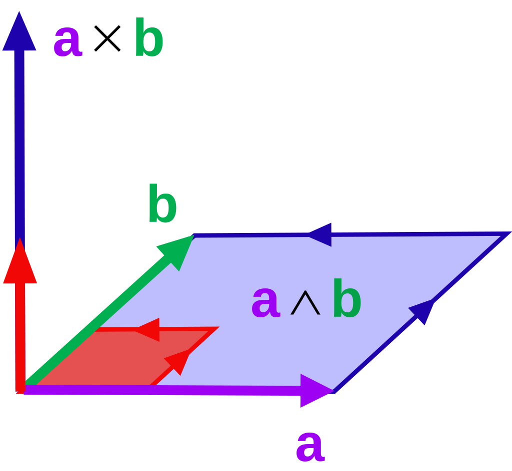
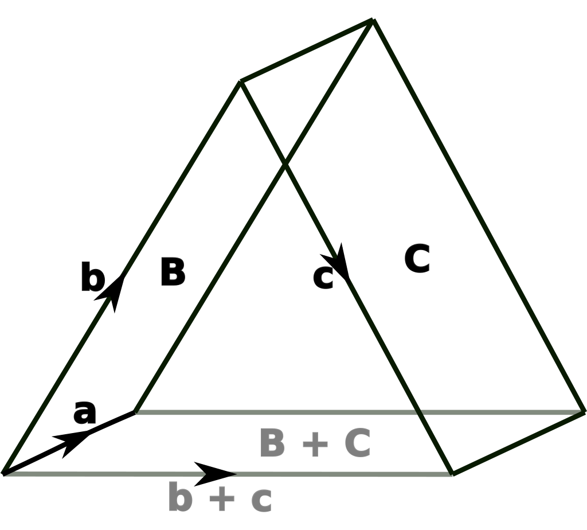

# Geometric Algebra

本篇是 *Geometric Algebra for Physicists, Chris Doran, Anthony Lasenby* 的阅读笔记。我对矩阵代数已经快产生心理阴影了，因此急需一个数学上更加谐和优美的等价物来苦中作乐；几何代数就是这样的一个存在。

[TOC]

$$
\newcommand{\bf}[1]{\boldsymbol{#1}}
\newcommand{\inner}[2]{\bf{#1}\cdot\bf{#2}}
\newcommand{\outer}[2]{\bf{#1}\wedge\bf{#2}}
$$

**几何代数（Geometric Algebra）** 是通过代数研究几何关系的一门学科。

## 基础

### 向量空间

几何代数的基础是 **向量空间（Vector Space）**，或 **线性空间（Linear Space）**，其作为线性代数的核心内容，在数学和自然科学的诸多领域中已经立下汗马功劳。**矩阵（Matrices）** 以及相关内容实际上也是向量空间的重要延伸之一。本篇中除本节外，将仅使用 *线性空间* 代指这个概念；这是因为几何代数中的向量一词意思非常狭窄（只是由一系列数组成的多元组）。

这一节中，我们会将向量空间的所有基本概念过一遍，如向量、基、点积、叉积等（事实上其中大多数已经在线性代数中熟悉过了，这里只是温习一下记号），并介绍一个几何代数中引入的新概念，外积。

#### 向量的基本性质

**向量（Vector）** 是向量空间中的元素，我们可以直观地将其理解为带有方向的量，因为常见的向量空间，如 $\mathbb{R}^3$ 中的向量就可以理解为空间中以原点为起点的箭头。我们用 $\bf{a}$、$\bf{b}$ 这样的粗体字母来表示向量，其满足下面的一些基本性质（其中所有的字母表示的量都是任取的）：

- 加法交换律：$\bf{a} + \bf{b} = \bf{b} + \bf{a}$。
- 加法结合律：$\bf{a} + (\bf{b} + \bf{c}) = (\bf{a} + \bf{b}) + \bf{c}$。
- 存在一个单位向量 $\bf{0}$，使得 $\bf{a} + \bf{0} = \bf{a}$。
- 每一个向量 $\bf{a}$ 都存在一个逆向量，记为 $-\bf{a}$，使得 $\bf{a} + (-\bf{a}) = 0$。

向量可以和 **标量（Scalar）** 相乘，后者就是我们熟悉的数（原则上可以是任何数域，但我们可以先用实数来理解）。下面是标量乘法满足的性质：

- $\lambda(\bf{a} + \bf{b}) = \lambda \bf{a} + \lambda \bf{b}$。
- $(\lambda + \mu)\bf{a} = \lambda\bf{a} + \lambda\bf{b}$。
- $(\lambda \mu)\bf{a} = \lambda(\mu\bf{a})$。
- 标量数域中的乘法单位元 $1$（即满足 $1\lambda = \lambda$）满足 $1\bf{a} = \bf{a}$。

向量空间的 **子空间（Subspace** 是指其同为向量空间的子集。

#### 基与维度

如果我们能将向量 $\bf{b}$ 写为一集向量 $\{\bf{a}_j\}$ 的加权和，就称前者为这些向量的 **线性组合（Linear Combination）**：
$$
\bf{b} = \sum_{j=1}^n \lambda_j\bf{a}_j
$$
如果存在不全为零的标量集 $\{\lambda_j\}$ 使得一集向量 $\{\bf{a}_j\}$ 满足：
$$
\sum_{j=1}^n\lambda_j\bf{a}_j = \bf{0}
$$
我们称这集向量 **线性相关（Linearly Dependent）**。否则就称它们 **线性无关（Linearly Independent）**。一集向量所有可能的线性组合组成的空间称为其 **扩张成（Span）** 的空间：
$$
\mathcal{V} = \left\{\sum_{j=1}^n \lambda_j\bf{a}_j \bigg| \bf{a}_j \in \mathcal{A}\right\}
$$
当一个线性相关的向量集 $\mathcal{B}$ 扩张成一个线性空间时，我们称其为这个线性空间的 **基（Basis）**。一个线性空间中可以找到无数个基，但其中的元素总是相同的；我们称这个数量为线性空间的 **维度（Dimension）**。

以上这些内容非常基本，如果以常见的线性空间，如 $\mathbb{R}^3$ 为例，很容易举出对应的例子：

- $\{(1, 0, 0), (0, 1, 0), (0, 0, 1)\}$ 是 $\mathbb{R}^3$ 的一个基；不难发现这三个向量在空间中相互垂直，我们称这样的基为 **标准正交基（Orthonormal Basis）**。

- $\mathbb{R}^3$ 中的任意向量 $(x, y, z)$ 都可以写成上面给出的基的线性组合，即：
  $$
  (x, y, z) = x(1, 0, 0) + y(0, 1, 0) + z(0, 0, 1)
  $$

- $\mathbb{R}^3$ 的维度是 $3$，这从它的记号中就能立刻看出。

#### 点积

**点积（Dot Product）** 或 **标量积（Scalar Product）** 也是在线性代数中就接触过的重要内容。当时可能是通过内积空间介绍的，它和我们这里要介绍的点积略有差别（前者范围更加广泛，我们在后续也会讨论到）。点积用来计算两个向量的投影积：
$$
\bf{a}\cdot\bf{b} = |\bf{a}||\bf{b}|\cos\theta
$$
其中 $|\bf{a}|$ 用于表示向量的长度；$\theta$ 则是两个向量间的夹角。不难验证点积满足的一些性质：

- $\bf{a}\cdot\bf{b} = \bf{b}\cdot\bf{a}$。
- $\bf{a}\cdot(\lambda \bf{b}) = \lambda (\bf{a}\cdot\bf{b})$。
- $\bf{a}\cdot(\bf{b} + \bf{c}) = \bf{a}\cdot\bf{b} + \bf{a}\cdot\bf{c}$。
- $\bf{a}\cdot\bf{a} \ge 0$，等号当且仅当 $\bf{a} = \bf{0}$ 时成立。

事实上，仅凭这四个定律，以及记 $|\bf{a}| = \sqrt{\bf{a}\cdot\bf{a}}$ 我们能反过来构建出点积的定义（这也是原书的思路），不过我觉得那样反而不够直接。

内积让我们能更清晰地表示出向量间的夹角；此前介绍过的标准正交基，其中的元素 $\bf{e}_j$ 需要满足的要求即：
$$
\bf{e}_i\bf{e}_j = \delta_{ij}
$$
这里的 $\delta_{ij}$ 是物理中常用的 **克罗内克 $\delta$ 函数（Kronecker Delta Function）**，其定义为：
$$
\delta_{ij} = 
\begin{cases}
	1 & i = j \\
	0 & i \ne j
\end{cases}
$$
我们再引入一个记法上的惯例，即 **爱因斯坦记号（Einstein Notation）** ，其将等式中的下标”自动扩展“成求和。比如向量 $\bf{a}$ 可以等价记为 $a_i\bf{e}_i$。两个向量的点积因此可以定义为：
$$
\bf{a}\cdot\bf{b} = (a_i\bf{e}_i)(b_j\bf{e}_j) = (a_ib_j)\bf{e}_i\cdot\bf{e}_j = a_ib_j\delta_{ij} = a_ib_i
$$

#### 叉积

**叉积（Cross Product）** 或 **向量积（Vector Product）** 是一个对点积的自然补充。在线性代数中不会讲到这个（因为叉积的数学性质太差了），但向量分析中它是绝对的主角之一。叉积计算了两个向量的正交积：
$$
\bf{a}\times\bf{b} = |\bf{a}||\bf{b}|\bf{n}\sin\theta
$$
这里出现的向量 $\bf{n}$ 是和 $\bf{a}$ 与 $\bf{b}$ 同时垂直的一个单位向量，使得 $\bf{a}$、$\bf{b}$、$\bf{n}$ 形成一个右手集，如下图所示：

叉积满足下面这些运算性质：

- $\bf{a}\times\bf{b} = -\bf{b}\times\bf{a}$。
- $\bf{a}\times(\lambda\bf{b}) = \lambda(\bf{a}\times\bf{b})$。
- $\bf{a}\times(\bf{b} + \bf{c}) = \bf{a}\times\bf{b} + \bf{a}\times\bf{c}$。
- $\bf{a}\times\bf{a} = \bf{0}$。

叉积使得标准正交基中的不同基向量间可以相互转换，确切来说：
$$
\bf{e}_i\bf{e}_j = \epsilon_{ijk}\bf{e}_k
$$
这里的 $\epsilon_{ijk}$ 是 **交错张量（Alternating Tensor）**，定义为：
$$
\epsilon_{ijk} = 
\begin{cases}
	1 & \text{若 $ijk$ 形成一个 $123$ 的循环置换，如 $312$} \\
	-1 & \text{若 $ijk$ 形成一个 $132$ 的循环置换，如 $321$} \\
	0 & \text{其余情形，如 $112$}
\end{cases}
$$
如果对向量分析比较熟悉的同学，至此为止都是已经学过的内容。那么接下来，就要正式引入几何代数中独有的概念了。

### 外积

叉积的局限性让其只能在三维空间中绽放光彩：如果在二维中，我们找不到和两个向量都垂直的向量；如果在四维或以上，与两个向量同时垂直的向量有无穷多个。

因此，我们引入了更加泛用的 **外积（Outer Product）** 或 **楔积（Wedge Product）**，记为 $\bf{a} \wedge \bf{b}$。其定义为两个向量围成的有向平面，方向为令 $\bf{a}, \bf{b}, -\bf{a}$ 形成逆时针的平面方向（三维情况下它和叉积的方向是一致的），如下图所示：

你或许会疑惑，两个向量的积怎么会是一个平面呢？但不要忘记，这是一个 *有向平面*。回忆向量的一个别名”有向线段“，两者之间的联系或许更加清晰一些。有向平面的正式称呼是 **二重向量（Bivector）**。

二重向量的加法和向量的加法非常类似，符合三角形法则。可以参考下面的图示：

其中的 $\bf{B} = \bf{a}\wedge\bf{b}$，$\bf{C} = \bf{a}\wedge\bf{c}$，$\bf{B} + \bf{C} = \bf{a}\wedge(\bf{b} + \bf{c})$。这也是外积的重要性质之一。事实上，此前我们列出的叉积性质，对于外积依然成立。

需要额外强调的是，二重向量的定义是一个有向平面，也就是一个面积和一个方向。这意味着我们可以通过多种方式构建同样的二重向量。比如对于 $\bf{a}' = \bf{a} + \lambda\bf{b}$，我们有：
$$
\bf{a}'\wedge\bf{b} = (\bf{a} + \lambda\bf{b})\wedge\bf{b} = \bf{a}\wedge\bf{b} + \lambda\bf{b}\wedge\bf{b} = \bf{a}\wedge\bf{b}
$$
外积在一维空间没有意义；但我们可以构建二维空间中的外积：
$$
\begin{align*}
	\bf{a}\wedge\bf{b} 
	&= (a_1\bf{e}_1 + a_2\bf{e}_2)(b_1\bf{e}_1 + b_2\bf{e}_2) \\
	&= a_1b_1\bf{e}_1\wedge\bf{e}_2 + a_1b_2\bf{e}_1\wedge\bf{e}_2 + a_2b_1\bf{e}_2\wedge\bf{e}_1 + a_2b_2\bf{e}_2\wedge{e}_2 \\
	&= (a_1b_2 - a_2b_1)\bf{e}_1\wedge\bf{e}_2
\end{align*}
$$
敏锐的同学或许已经发现，这正巧和复数的乘法的虚部一致！如果将上式等价切换为复数，形式如下：
$$
\begin{align*}
	z_1^*z_2 
	&= (x_1 - iy_1)(x_2 + iy_2) \\
	&= x_1x_2 + ix_1y_2 - iy_1x_2 + y_1y_2 \\
	&= x_1x_2 + y_1y_2 + i(x_1y_2 - x_2y_1)
\end{align*}
$$
可以看到复数的乘法等同于同时求复数的内积和外积；这种奇特却似乎相当合拍的组合会在下一节中再次提到。

三维空间中的外积可以得到熟悉的结果（与叉积无异）：
$$
\begin{align*}
	\outer{a}{b} 
	&= (a_i\bf{e}_i)\wedge(a_j\bf{e}_j) \\
	&= (a_1b_2 - b_1a_2)\bf{e}_1\wedge\bf{e}_2 + (a_2b_3 - b_3a_2)\bf{e}_2\wedge\bf{e}_3 + (a_3b_1 - b_3a_1)\bf{e}_3\wedge\bf{e}_1
\end{align*}
$$
对于多余两个向量的外积（如 $\bf{a}\wedge\bf{b}\wedge\bf{c}$），我们可以简单地认为其产生了三重、四重乃至更多重的向量；其性质我们会在后续的章节中详细讨论，不过有一点可以率先明确：外积满足结合律。

### 几何积

受到复数乘法的启发，我们可以定义一个新的乘积，**几何积（Geometric Product）**：
$$
\bf{a}\bf{b} = \inner{a}{b} + \outer{a}{b}
$$
这个等式乍一看非常怪异，因为（就我们目前的经验而言）其中一项返回一个标量，而另一项返回一个二重向量，这两者怎么能加到一起？理解这一点并不难，只需要用复数进行类比即可。这个结果既不是一个纯标量，也不是一个纯向量，而是两者的组合；就好像 $1 + i$ 既不是实数，也不是纯虚数，而是一个”复数“。

从几何积的定义，我们不难得到一些等式：

- $\bf{b}\bf{a} = \inner{a}{b} - \outer{a}{b}$。
- $\inner{a}{b} = \frac{1}{2}(\bf{a}\bf{b} + \bf{b}\bf{a})$。
- $\outer{a}{b} = \frac{1}{2}(\bf{a}\bf{b} - \bf{b}\bf{a})$。

几何代数中，我们研究的依然是一个线性空间；只不过这次，其中的元素是 **多重向量（Multivector）**；此处的多重可以指从零到任意大的整数，这也就意味着，标量也被涵盖其中。这就是为什么几何积是合理的：在多重向量的线性空间中，我们可以随意地加减标量和任意重的向量。为了注明一个元素中不同重数（我们称其为 **等级（Grade）**）的向量”分量“，我们会使用这样的记号：$\langle\rangle_r$。作为举例：

- $\langle \bf{a}\bf{b} \rangle_2 = \outer{a}{b}$。
- $\langle \bf{a}\bf{b} \rangle_0 = \inner{a}{b}$。

多重向量空间中有两种量最为特殊，一个是标量，另一种则是拥有最高等级的向量，我们称为 **伪标量（Pseudoscalar）**，不难看出它们都不能进行几何积，因为前者的内积没有定义，而后者的外积没有定义。

#### 平面

让我们用一个简单的例子来总结我们刚刚接触到的新知识。考虑一个平面，其标准正交基为 $\bf{e}_1$、$\bf{e}_2$。此时为了构建与该空间对应的线性空间，我们还应该引入标量和二重向量。下面是一个基：
$$
\underset{标量}{1} \qquad \underset{（一重）向量}{\bf{e}_1, \bf{e_2}} \qquad \underset{二重向量}{\bf{e}_1\wedge\bf{e}_2}
$$
这个基非常典型，我们将其记为 $\mathcal{G}_2$。显然，平面上所有几何代数意义上的量都可以通过这几个元素的线性组合得到。

在这样的标准正交基中，几何积有下面的性质：
$$
\begin{align*}
	\bf{e}_1\bf{e}_2 
	&= \bf{e}_1\cdot\bf{e}_2 + \bf{e}_1\wedge\bf{e}_2 \\
	&= \bf{e}_1\wedge\bf{e}_2 \\
	\bf{e}_1(\bf{e}_1\wedge\bf{e}_2) 
	&= \bf{e}_1(\bf{e}_1\bf{e}_2) \\
	&= (\bf{e}_1\bf{e}_1)\bf{e}_2 \\
	&= \bf{e}_2 \\
	\bf{e}_2(\bf{e}_1\wedge\bf{e}_2) 
	&= \bf{e}_2(-\bf{e}_2\bf{e}_1) \\
	&= -(\bf{e}_2\bf{e}_2)\bf{e}_1 \\
	&= -\bf{e}_1 \\
	(\bf{e}_1\wedge\bf{e}_2)(\bf{e}_1\wedge\bf{e}_2)
	&= (\bf{e}_1\bf{e}_2)(\bf{e}_1\bf{e}_2) \\
	&= -(\bf{e}_1\bf{e}_1)(\bf{e}_2\bf{e}_2) \\
	&= -1
\end{align*}
$$
有了上面这些等式，就不难给出任意两个多重向量 $\bf{a}$ 和 $\bf{b}$ 的几何积：
$$
\begin{align*}
	\bf{a}\bf{b}
		&= (\alpha_0 + \alpha_1\bf{e}_1 + \alpha_2\bf{e}_2 + \alpha_3\bf{e}_1\bf{e}_2)
		   (\beta_0  + \beta_1\bf{e}_1  + \beta_2\bf{e}_2  + \beta_3\bf{e}_1\bf{e}_2) \\
		&= (\alpha_0\beta_0 + \alpha_1\beta_1 + \alpha_2\beta_2 - \alpha_3\beta_3) \qquad+ \\
		&\phantom{xx|}
			(\alpha_0\beta_1 + \alpha_1\beta_0 + \alpha_3\beta_2 - \alpha_2\beta_3)\bf{e}_1 \quad+ \\
		&\phantom{xx|}
		   (\alpha_0\beta_2 + \alpha_2\beta_0 + \alpha_1\beta_3 - \alpha_3\beta_1)\bf{e}_2 \quad+ \\
		&\phantom{xx|}
			(\alpha_0\beta_3 + \alpha_3\beta_0 + \alpha_1\beta_2 - \alpha_2\beta_1)\bf{e}_1\bf{e}_2
\end{align*}
$$
不过大概没有人会真的用这个公式……

#### 和复数的联系

敏锐的同学可能看到我们通过对二重向量取几何积平方得到了 $-1$，而联想到复数。没错，我们可以从几何代数的角度构建复数；记 $I = \bf{e}_1\bf{e}_2$，则：
$$
Z = u + Iv \qquad \text{其中 $u, v \in \mathbb{R}$}
$$
代表了复平面中的一个点。本篇笔记中（和原书一致）从此之后一律将虚数单位记为 $I$，原书给出的理由是 $i$ 看起来和其它元素是互易的（这是标量的通用特点），然而对于像 $I$ 这样的伪向量来说并不一定。

我们可以尝试探索上面这种新的表示形式和传统的”复数等于二维向量“观点的联系。此前我们会将复数写成下面的形式：
$$
x = u\bf{e}_1 + v\bf{e}_2
$$
考虑它在 $\bf{e}_1$，即实数轴上的几何积：
$$
\bf{e}_1x = u + v\bf{e}_1\bf{e}_2 = u + Iv = Z
$$
发现完全一致！此外，如果我们考虑复数 $Z$ 的共轭 $Z^\dagger$，其满足：
$$
Z^\dagger = u - Iv = u - v\bf{e}_2\bf{e}_1 = x\bf{e}_1
$$
可以看到我们将 $x$ 与 $\bf{e}_1$ 的顺序逆过来，就能得到复数的共轭。