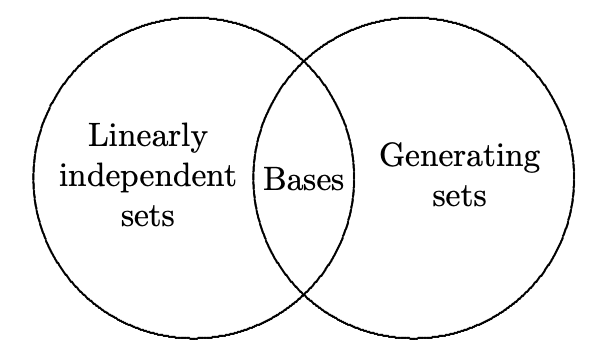

# Linear Algebra

本篇是对应 *UIUC MATH 416 Abstract Linear Algebra* 的学习笔记。参考教材 *Linear Algebra Done Right, 3rd Edition: Sheldon Axler* 以及 *Linear Algebra: Stephen Friedberg*。

[TOC]

**线性代数（Linear Algebra）** 研究的是在有限维度向量空间上的线性变换。本篇中，我们假定大家对基本的线性代数知识，包括欧几里得空间和矩阵已经有了基本的了解。以此为基础，我们将研究更为抽象的向量空间和线性变换理论。
$$
\newcommand{\null}[0]{\operatorname{null}}
\newcommand{\range}[0]{\operatorname{range}}
$$

## 向量空间

### 实数与复数

为了确保下一节中向量空间定义的清晰度，我们在此对 **实数（Real Number）** 和 **复数（Complex Number）** 的性质进行简单描述。实数集 $\R$ 和复数集 $\C$ 被称为 **域（Field）**，在本篇中我们常以 $F$ 代指。域有下面这样的性质：

- $F$ 中定义了两种运算 $+$、$*$，即加法和乘法（乘号常常被省略）。其中：
  - 加法和乘法均满足 **交换律（Commutativity）** 和 **结合律（Associativity）**：
    - 一个 $F$ 上的运算符 $\circ$ 满足交换律，如果对于任意 $a, b \in F$ 都有 $a \circ b = b \circ a$。
    - 一个 $F$ 上的运算符 $\circ$ 满足结合律，如果对于任意 $a, b \in F$ 都有 $a \circ (b \circ c) = (a \circ b) \circ c$。
  - 加法有单位元 $0$，乘法有单位元 $1$：
    - 一个 $F$ 上的运算符 $\circ$ 的单位元 $\varepsilon$ 是指对任意 $a \in F$ 都使得 $\varepsilon \circ a = a \circ \varepsilon$ 成立的 $\varepsilon \in F$。
  - 加法和乘法都有逆元：
    - 一个 $F$ 上的运算符 $\circ$ 定义了任意 $a \in F$ 的逆元 $b \in F$ 使得 $a \circ b = b \circ a = \varepsilon$。
  - 加法和乘法满足 **分配律（Distributivity）**，即对任意 $\lambda, a, b \in F$ 有 $\lambda(a + b) = \lambda a + \lambda b$。
- 对 $a \in F$，记它的 **加法逆元（Additive Inverse）** 为 $-a$，并由此定义减法 $-$：$a - b = a + (-b)$。
- 对 $a \in F$，$a \ne 0$，记它的 **乘法逆元（Multiplicative Inverse）** 为 $1/a$，并由此定义除法 $/$：$a / b = a(1/b)$。
- 将 $aa...a$（重复 $n$ 次）记作 $a^n$，并不难发现 $a^{-n} = 1/(aa...a)$（重复 $n$ 次），且 $a^0 = 1$（$a \ne 0$）。

我们称域中的元素为 **标量（Scalar）**，这是为了和后面的 **向量** 相对。为给向量的定义做铺垫，让我们定义 **$n$ 元组（n-Tuple）** 的概念：

> **定义**：**$n$ 元组** 是一个由 $n \ge 0$ 个元素组成的有序列表。记为 $(x_1,...,x_n)$。我们将 $n$ 称为 $n$ 元组的 **长度**。两个 $n$ 元组 $(x_1,...,x_n)$ 和 $(y_1,...,y_n)$ 相同当且仅当：
> $$
> x_i = y_i\quad \forall i \in \{1,...,n\}\nonumber
> $$

我们也将二元组称为 **有序数对（Ordered Pair）**。通过定义，我们不难认识到 $n$ 元组一定是有限长度的，即使它可以任意大。长度为 0 的元组被称为空元组，记作 $()$，不过通常我们对它不感兴趣。有了 $n$ 元组的概念，我们就可以定义 $F^n$ 了：

> **定义**：$F^n$ 是由 $F$ 中元素组成的全体 $n$ 元组组成的集合。数学定义如下：
> $$
> F^n = \{(x_1,...,x_n) | x_i \in F \ \text{for}\ i = 1,...,n\}
> $$
> 作为例子，$\R^3$ 是由实数组成的全体三元组的集合；$\C^5$ 是由复数组成的全体五元组的集合。

$F^n$ 中的加法定律在我们意料之中：
$$
(x_1,...,x_n) + (y_1,...,y_n) = (x_1+y_1,...,x_n+y_n)
$$
不难发现 $F^n$ 中的加法满足交换律和结合律，且存在单位元 $\varepsilon$ 使得 $\varepsilon + x = x + \varepsilon = x$ 对任意 $x \in F^n$ 都成立。这个单位元就是：
$$
\varepsilon = (0,...,0)
$$
本篇中我们会用 $0$ 表示这个单位元。我们也可以定义 $F^n$ 中的加法逆元，对于任意 $x \in F^n$，都有逆元 $-x$ 满足 $x + (-x) = 0$。实际上这个逆元满足：
$$
-x = (-x_1,...,-x_n)
$$
最后，让我们定义 $F^n$ 中的标量积。 对于 $\lambda \in F, x \in F^n$，有：
$$
\lambda x = (\lambda x_1,...,\lambda x_n)
$$

### 向量空间的定义

我们将类似 $F^n$ 的集合定义为 **向量空间（Vector Space）**，或 **线性空间（Linear Space）**。其需要满足下面的条件：

- $F^n$ 定义了两种运算 $+$、$*$，即向量加法和标量乘法（乘号常常被省略）。其中：
  - $F$ 是一个域，因此其满足我们前面介绍的域运算的所有性质。
  - 向量加法满足交换律、结合律，拥有单位元和逆元。
  - 标量乘法拥有单位元 $1$，使得  $1v = v$。
  - 向量加法和标量乘法满足分配律，即对于 $a \in F, u, v \in F^n$，总有 $a(u + v) = au + av$。

此后，我们会将 $F^n$ 中的元素称为 **向量（Vector）** 或 **点（Point）**。下面我们举一些向量空间的例子：

> **例**：（向量空间）
>
> 1. 定义 $F^\infty$ 为 $F$ 中所有元素排列的集合，即：
>    $$
>    F^\infty = \{(x_1,x_2,...)\mid x_i \in F\ \text{for}\ i = 1,2,...\}
>    $$
>    注意这里面虽然利用了元组的标记，但这些向量并不是元组。$F^\infty$ 中的运算并不难定义：
>    $$
>    \begin{align}
>    \begin{split}
>    (x_1,x_2,...) + (y_1,y_2,...) &= (x_1+x_2,y_1+y_2,...) \\
>    \lambda(x_1,x_2,...) &= (\lambda x_1,\lambda x_2,...)
>    \end{split}
>    \end{align}
>    $$
>
> 2. 定义 $F^S$ 为所有满足 $f : S \to F$ 的函数的集合，即：
>    $$
>    F^S = \{f \mid f : S\to F\}
>    $$
>    $F^S$ 上的运算定义如下：
>    $$
>    \begin{align}
>    \begin{split}
>    	(f + g)(x) &= f(x) + g(x) \\
>    	(\lambda f)(x) &= \lambda f(x)
>    \end{split}
>    \end{align}
>    $$
>    $F^S$ 上的单位元 $0$ 是满足下面条件的函数：
>    $$
>    0 : S\to F, 0(x) = 0
>    $$
>    且逆元定义为：
>    $$
>    (-f)(x) = -f(x)
>    $$

当将 $F^n$ 引用为向量空间时，我们常将其记为 $V$。后文中不加说明时，默认 $V = F^n$。下面让我们给出一些从向量空间定义能够轻易得到的性质：

- 单位元是唯一的。设 $0'$ 满足单位元性质，此时有 $0' = 0' + 0 = 0$。
- 对任意 $v \in V$，其都有唯一的逆元 $w$。假设 $w'$ 也是 $v$ 的逆元，有 $w' = 0 + w' = (w + v) + w' = w + (v + w') = w + 0 = w$。
- 对任意 $v \in V$，都有 $0v = 0$。这是因为 $0v = (0 + 0)v = 0v + 0v$，根据单位元的唯一性可以得到结论。
- 对任意 $a \in F$，都有 $a0 = 0$。这是因为 $a0 = a(0 + 0) = a0 + a0$，根据单位元的唯一性可以得到结论。
- 对任意 $v \in V$，都有 $(-1)v = -v$。这是因为 $v + (-1)v = 1v + (-1)v = (1 + (-1))v = 0v = 0$。根据逆元的唯一性可以得到结论。
- 对任意 $v \in V$，都有 $-(-v) = v$。这是因为 $-(-v)$ 是 $-v$ 的逆元，而 $v$ 也是 $-v$ 的逆元。根据逆元的唯一性可以得到结论。
- 对于 $a \in F, v \in V$，若 $av = 0$，则或者 $a = 0$，或者 $v = 0$。当 $a \ne 0$ 时，我们一定能找到 $F$ 中 $a$ 的乘法逆元 $1/a$ ，此时有 $(1/a)(av) = (1/a a)v = 1v = v = 0$，否则有 $a = 0$。

### 子空间

如果向量空间 $V$ 的子集 $U$ 也是一个向量空间（运算符保持一致），我们就称 $U$ 是 $V$ 的 **子空间（Subspace）**，或 **线性子空间（Linear Subspace）**，记作 $U \le V$。为了证明一个子集是向量空间，我们只需要证明下面几点：

- 向量加法单位元在子集中，即 $0 \in U$。
- 子集中的向量加法和标量乘法是 **封闭的（Closed）**：
  - 一个 $F$ 上的运算符 $\circ$ 是封闭的，如果对于任意 $a, b \in F$ 都有 $a \circ b \in F$。

我们可以简单说明一下为什么上面两点就可以证明子集 $U$ 是一个向量空间。由于 $U$ 沿用了 $V$ 中的运算符，加上这些运算在 $U$ 中封闭，它们自动满足了向量空间中对运算符定律的要求；$0 \in U$ 满足了单位元的要求；$-u = (-1)u \in U$ 满足了逆元的要求。这样，我们就得到 $U \le V$ 了。下面举一些子空间的例子：

> **例**：（子空间）
>
> 1. 设 $a, b \in F$，则下面的集合只有在 $b = 0$ 时是 $F^4$ 的子空间：
>    $$
>    \{(x_1, x_2, x_3, x_4) \in F^4 \mid x_3 = ax_4 + b\}
>    $$
>
> 2. 所有定义在区间 $[0, 1]$ 上的连续实函数组成的集合是 $\R^{[0, 1]}$ 的子空间。
>
> 3. 所有定义在 $\R$ 上的可微实函数组成的集合是 $\R^\R$ 的子空间。
>
> 4. 所有极限是 $0$ 的复数列组成的集合是 $\C^\infty$ 的子空间。

从几何意义上来看，$\R^2$ 的子空间是 $\{0\}$，$\R^2$ 以及所有穿过原点的 $\R^2$ 中的直线。类似地，$\R^3$  子空间是 $\{0\}$、$\R^3$、穿过原点的 $\R^3$ 中的直线和平面。我们会在后续的学习中了解到它们是这些向量空间中仅有的子空间。

对于子空间 $U_1, ...,U_m \le V$，我们定义一个特别的运算 $+$ 来表示 **子空间的和（Sum of Subspaces）**：
$$
U_1+ ... + U_m = \{u_1 + ... + u_m\mid u_1 \in U_1,...,u_m \in U_m\}
$$
它的特殊意义在于，这个和是 $V$ 的子空间中，最小的包含 $U_1, ..., U_m$ 的向量空间。证明如下：

> **证**：$U_1 + ...  + U_m$ 显然是 $V$ 的子空间，因为 $0$ 是它的元素且其运算都是封闭的。此外显然也有 $U_1, .... U_m \le U_1 + ... + U_m$，因为这些子空间都是它们和的子集。最后，所有包含 $U_1, ..., U_m$ 的 $V$ 的子空间必然包含 $U_1 + ... + U_m$，因为其必然包含前者所有的有限和。因此 $U_1 + ... + U_m$ 是 $V$ 中最小的包含 $U_1, ..., U_m$ 的子空间。

现在让我们探索子空间的和的一种特殊情况。我们称子空间 $U_1,...,U_m$ 的和为 **直和（Direct Sum）**，如果对于任意 $u \in U_1 + ... + U_m$，都有唯一的 $u_1 \in U_1, ... u_m \in U_m$ 使得 $u = u_1 + ... + u_m$ 成立。此时我们也将子空间的和记为 $U_1\oplus ... \oplus U_m$。这里需要注意的是直和 *并不是* 新的运算符，它和子空间的和没有区别，只是隐含了额外的条件。举个例子，设 $U_1 = \{(1, 0,...,0)\}, U_2 = \{(0, 1, ...,0\}$，以此类推。则 $F^n = U_1\oplus ... \oplus U_n$。

那么如何判断子空间的和是否是直和呢？一种方式是只需要判断是否有唯一的选择 $u_1 \in U_1,...,u_m \in U_m$ 使得 $u_1 + ... + u_m = 0$ 成立。证明如下：

> **证**：现在从题设出发，假设存在两种方式表示某个元素 $w = u_1 + ... + u_m = v_1 + ... + v_m$。此时将右侧两式相减，我们得到：
> $$
> 0 = (u_1 - v_1) + ... + (u_m - v_m)
> $$
> 由于 $0$ 的表示形式是唯一的，我们也就得到 $u_1 = v_1, ..., u_m = v_m$。

我们还有一种更简单的方式判断子空间的和是否是直和。$U + W$ 是直和当且仅当 $U \cap W = \{0\}$。证明如下：

> **证**：当 $U + W$ 是直和时，如果 $v \in U \cap W$，总有 $0 = v + (-v)$。此时为了让 $0$ 有唯一的表示方式，我们只能有 $v = 0$。反过来，当 $U \cap W = \{0\}$ 时，假设有 $u \in U, w \in W$ 使得 $0 = u + w$ 成立。此时可知 $u = -w$，因此 $u \in W$，$u \in U \cap W$。所以 $u$ 只能是 $0$。同理可证 $w$ 也是 $0$。这样 $0$ 就有唯一的表示方式，$U + W$ 是一个直和。

## 有限维度向量空间

### 扩张空间和线性相关

上节中定义的向量空间，其维度可能是无穷的。相比无穷维度的向量空间，线性代数中更感兴趣于 **有限维度向量空间（Finite-Dimensional Vector Space）**。我们很快会用更严格的方式证明这个概念。

首先让我们引入向量的 **线性组合（Linear Combination）** 的概念：

> **定义**：向量的 **线性组合** 是指一组向量 $v_1, ..., v_m$ 的加权和：
> $$
> a_1v_1 + ... + a_mv_m
> $$
> 其中 $a_1, ..., a_m \in F$。

向量的线性组合能够表示出许多新的向量。例如 $(0, 1), (1, 0)$ 两个向量的线性组合能够表示整个 $\R^2$，这是因为对于任意的 $(x, y) \in \R^2$ 都有 $(x, y) = x(1, 0) + y(0, 1)$。让我们用 **扩张空间（Span）** 的概念来引入线性组合能够表示的向量空间：

> **定义**：一组向量的所有线性组合组成的集合被称为它们的 **扩张空间**，或 **线性扩张空间（Linear Span）**：
> $$
> \operatorname{span}(v_1, ..., v_m) = \{a_1v_1 + ... + a_mv_m \mid a_1, ..., a_m \in F\}
> $$
> 定义空元组的扩张空间是 $\{0\}$。

一组 $V$ 中向量的扩张空间 $U$ 是包含这些向量的最小的 $V$ 的子空间。

> **证**：我们首先来证明扩张空间 $U$ 是 $V$ 的子空间。$0 \in U$，因为只需让 $a_1, ..., a_m = 0$ 即可。$U$ 中的运算显然封闭，因为组中每个向量的系数所在域 $F$ 是封闭的。因此 $U \le V$。然后，由于 $v_1, ..., v_m \in U$，所有包含这些向量的子空间都应该包含它们所有的线性组合（因为运算的封闭性），因此包含 $U$。这样就得到 $U$ 是 $V$ 中包含 $v_1, ..., v_m$ 的最小子空间。

当 $\operatorname{span} (v_1, ..., v_m) = V$ 时，我们称 $v_1, ..., v_m$ **扩张成（Spans）** $V$，有时我们也会称这些向量组成的集合 $S$ 扩张成 $V$，此处 $S$ 也被称为 $V$ 的 **生成集（Generating Set）**。显然前面我们举的 $(0, 1), (1, 0)$ 就可以扩张成 $\R^2$。

> **定理**：一个向量空间 $V$ 的任意子集 $S$ 都可以扩张成 $V$ 的子空间。所有包括 $S$ 的子空间一定包括 $S$ 的扩张。即 $T \le V, S \subseteq T \implies \operatorname{span}S \subseteq T$。

> **证**：如果 $S = \emptyset$，这是显然的。设 $T \le V$ 包含 $S$。假设 $w \in \operatorname{span} S$，则 $w = a_1w_1 + ... + a_nw_n$。由于 $S \subseteq T$，因此 $w_1, ..., w_n$ 均属于 $W$。$W$ 是一个子空间，因此其运算封闭，我们得到 $w \in W$。这样就得到 $\operatorname{span} S \subseteq W$。

一个 **有限维度向量空间** 是指存在一组向量 $v_1, ..., v_m$ 能扩张成该空间。由于元组的长度总是有限的，我们通过扩张得到的空间也总是有限的。反之，如果不存在一组向量能够扩张成向量空间 $V$，我们就称该空间为 **无限维度向量空间（Infinite-Dimensional Vector Space）**。

> **例**：（有限维度与无限维度向量空间）
>
> - $\mathcal{P}(F)$ 是所有 $F$ 上的 **多项式（Polynomial）** 组成的向量空间。其中多项式定义为函数 $p : F \to F$，存在 $a_0,...,a_m \in F$ 使得对任意 $z \in F$：
>   $$
>   p(z) = a_0 + a_1z + ... + a_mz^m
>   $$
>   当我们限定 $m$ 为特定值，且要求 $a_m \ne 0$ 时，形成的向量空间 $\mathcal{P}_m(F)$ 是一个有限维度向量空间（显然它可以通过 $1, z, ..., z^m$ 扩张得到），我们称它的 **维度（Degree）** 为 $m$，记作 $\operatorname{deg} \mathcal{P}_m(F) = m$。特别地，我们将 $0$ 的维度记作 $-\infty$。$\mathcal{P}(F)$ 则是无限维度向量空间。

现在让我们考虑某个线性组合 $v = a_1v_1 + ... + a_mv_m$，是否存在另一组标量 $c_1, ..., c_m \in F$ 使得 $v = c_1v_1 + ... + c_mv_m$ 呢？这当然是可能的。让我们将两个式子相减：
$$
0 = (a_1 - c_1)v_1 + ... + (a_m - c_m)v_m
$$
我们不难发现，如果 $a_i = c_i$，则上面的等式直接成立；但我们无法确定其它的解是否存在。如果不存在，就可以证明对于扩张空间中任意的 $v$ 都有唯一的表示方法。这是非常重要的结论，我们也由此定义 **线性无关（Linear Independent）** 的概念：

> **定义**：一组向量 $v_1, ..., v_m$ 被称为 **线性无关** 的，如果对于方程 $a_1v_1 + ... + a_mv_m = 0$ 只有 $a_1 = ... = a_m = 0$ 时成立。我们同时也声明空元组是线性无关的。

反之，**线性相关（Linear Dependent）** 的定义如下：

> **定义**：一组向量 $v_1, ..., v_m$ 被称为 **线性相关** 的，如果对于方程 $a_1v_1 + ... +a_mv_m = 0$ 存在不全为零的 $a_1, ..., a_m$ 作为解。

关于线性相关，我们可以给出下面几个简单迅速的判定方式：

- 如果一组向量中某一个可以表示为另外几个得分线性组合，那么这组向量是线性相关的。
- 如果一组向量中存在零向量，那么这组向量是线性相关的。
- **线性相关引理（Linear Dependence Lemma）**：如果 $v_1, ..., v_m$ 线性相关，则一定能找到 $j \in \{1, ..., m\}$ 使得：
  - $v_j \in \operatorname{span}(v_1, ..., v_{j-1})$。
  - 若将 $v_j$ 从这些向量中移除，剩余向量的扩张空间等于原来向量的扩张空间。

上面这个引理非常好理解，这里不作证明。它产生的结论是，线性相关的向量中又一些是“多余”的，我们将它删去之后不会影响这组向量的扩张。不难发现，一个有限维度向量空间 $V$ 中，线性无关的向量组合的大小总是小于扩张成 $V$ 的向量组合大小。

### 基与维度

向量空间 $V$ 的 **基（Basis）** 是指扩张成 $V$ 的一组线性无关向量。这里的要求只有扩张成 $V$ 且线性无关，因此一个向量空间中可能存在很多个基。

> **例**：（基）
>
> - $\emptyset$ 是 $\{0\}$ 的基，这是因为 $\operatorname{span}(\emptyset) = \{0\}$。
> - $(1, 0,...,0), (0, 1, 0,...,0), ..., (0,..., 0, 1)$ 是 $F^n$ 的基。我们也将其称为  $F^n$ 的 **标准基（Standard Basis）**。
> - $(1, x, x^2, ..., x^n)$ 是 $\mathcal{P}^n$ 的基，我们也将其称为 $\mathcal{P}^n$ 的标准基。

为了证明 $v_1,...,v_n$ 是向量空间 $V$ 的基，我们只需证明：

- 对任意 $v \in V$，我们都能唯一地将其写作下面的形式：
  $$
  v = a_1v_1 + ... + a_nv_n
  $$
  其中 $a_1, ..., a_n \in F$。

> **证**：由于 $v_1, ..., v_n$ 扩张成 $v$，显然存在 $a_1,...,a_n$ 使得上式成立，我们只需证明它们的唯一性即可。假设有不完全与 $a_i$ 一一相等的 $c_1,...,c_n$ 使得 $v = c_1v_1 + ... + c_nv_n$ 成立，此时我们有：
> $$
> (a_1 - c_1)v_1 + ... + (a_n - c_n)v_n = 0 \nonumber
> $$
> 由于 $v_1, ..., v_n$ 是线性无关的，因此上式成立的唯一情形便是 $a_i = c_i$。以此我们就证明了 $a_1,..., a_n$ 的唯一性。

任何扩张成向量空间的一组向量都存在基（这暗示着有限维度向量空间一定有基）。这是因为我们可以根据线性相关引理将多余的向量一个个移除，当剩下的向量线性无关时，就得到了基。类似地，任何线性无关的向量组可以通过加入新的向量变为一个基。这可以通过将一个基加入该向量组，随后利用线性相关引理从这个基中删除多余的向量。剩下的向量就是包含原线性无关向量组的基。下面的定理叙述了类似的事情：

> **替换定理（Replacement Theorem）**：假设向量空间 $V = \operatorname{span}(G)$，且 $G$ 中有 $n$ 个元素，则对于任意由 $m$ 个线性无关向量组成的集合 $L \subseteq V$，存在一个拥有 $n - m$ 个向量的集合 $H \subseteq G$ 使得 $V = \operatorname{span}(H\cup L)$。

> **证**：我们可以对 $m$ 使用数学归纳法。
>
> - 当 $m = 0$ 时，$L = \emptyset$，此时只需令 $H = G$，我们显然有 $V = \operatorname{span}(G) = \operatorname{span}(H\cup L)$。
>
> - 假设当 $m = k$ 时，对任意线性无关向量组成的 $L = \{v_1, ..., v_k\}$，均存在 $H = \{u_1, ..., u_{n - k}\}\subseteq G$ 使得 $V = \operatorname{span}(H\cup L)$。
>
> - 当 $m = k+1$ 时，我们再次按照要求任意找到 $L = \{v_1, ..., v_k, v_{k+1}\}$。根据归纳假设，我们可以将多出来的 $v_{k+1}$ 表示为：
>   $$
>   v_{k+1} = a_1v_1 + ... + a_kv_k + b_1u_1 + ... + b_{n-k}u_{n-k} \nonumber
>   $$
>   由于 $v_{k + 1} \ne 0$，且 $v_1, ..., v_k$ 线性无挂件，显然我们可以从 $b_1,...b_{n-k}$ 中找到非 $0$ 的一项，不失一般性地，让我们令 $b_{n-k} \ne 0$。此时我们可以反过来将它用 $v_1,...,v_{k+1}, u_1, ..., u_{n-k-1}$ 表示，即：
>   $$
>   u_{n-k} = -\frac{a_1}{b_{n-k}}v_1 - ... - \frac{a_k}{b_{n-k}}v_k + \frac{1}{b_{n-k}}v_{k+1} - \frac{b_1}{b_{n-k}}u_1 + ... - \frac{b_{n-k-1}}{b_{n-k}}u_{n-k-1} \nonumber
>   $$
>   由于此前我们有 $V = \operatorname{span}(v_1, ..., v_k, u_1, ...u_{n-k})$，因此我们现在也可以断定 $V = \operatorname{span}(H\cup L)$。

替换定理有两个重要的推论：

- 有限维度向量空间中的任意基都有相同数量的向量，我们将其称为向量空间的 **维度（Dimension）**（这其实也是此前的“有限维度向量空间”名字的由来）。
- 对于维度为 $n$ 的向量空间，其生成集大小至少为 $n$。且当其大小为 $n$ 时成为该向量空间的基。
- 对于维度为 $n$ 的向量空间，其线性无关的子集大小为 $n$ 时成为该向量空间的基。

用一张图来表示生成集、线性无关向量和基的关系：

还有一个有意思的结论，回忆我们上一章介绍过的直和，是指两个子空间任取一个元素的和组成的子空间，且满足任一个和空间的元素有且仅有一种取和方式。我们现在给出结论：任意有限维度向量空间都能表示为它的两个子空间的直和。

> **证**：假设有限维度向量空间的 $V$ 的子空间 $U$。由于 $U$ 显然也是有限维度向量空间，我们可以找到它的一个基 $u_1,...,u_m$。我们可以从它们出发构建出 $V$ 的一个基 $u_1,...,u_m,w_1,...,w_n$。令 $W = \operatorname{span}(w_1,...,w_n)$。为了证明 $V = U \oplus W$，我们只需证明 $V = U + W$ 且 $U\cap W = \{0\}$。第一条由基的定义可以轻易得到。对于第二条，我们可以假设 $v \in U\cap W$，则存在 $a_1,...,a_m, b_1,...,b_m$ 使得：
> $$
> v = a_1u_1 + ... + a_mu_m = b_1w_1 + ... + b_nw_n \nonumber
> $$
> 这使得：
> $$
> a_1 u_1 + ... + a_mu_m - b_1w_1 - ... - b_nw_n = 0 \nonumber
> $$
> 由于 $u_1,...,u_m,w_1,...w_n$ 是线性无关的，上面这个方程的解只有 $a_i = b_j = 0$。因此得到 $U\cap W = \{0\}$。

前文中我们提到的维度记作 $\operatorname{dim} V$。

> **例**：（向量空间的维度）
>
> - $\operatorname{dim} F^n = n$，这是显然的。
> - $\operatorname{dim} \mathcal{P}_m(F) = m + 1$，因为它的基是 $1, x, ..., x^m$ 有 $m + 1$ 个。

维度满足下面的一些性质：

- 有限维度向量空间 $U, V$ 满足 $U \le V$ 时，有 $\operatorname{dim} U \le \operatorname{dim} V$。我们从之前证明的直和性质可以轻易认识到这个结论。

- 设 $U_1, U_2$ 都是有限维度向量空间的子空间，则：
  $$
  \operatorname{dim}(U_1 + U_2) = \operatorname{dim} U_1 + \operatorname{dim}U_2 - \operatorname{dim}(U_1\cap U_2)
  $$

下面我们证明第二条性质：

> **证**：设 $u_1,...,u_k$ 是 $U_1 \cap U_2$ 的基，根据基的性质我们知道它们同时也分别在 $U_1$ 和 $U_2$ 中线性无关。因此我们可以将其拓展为 $u_1,...,u_k, v_1,...,v_i$ 作为 $U_1$ 的基，以及 $u_1,...,u_k,w_1,...w_j$ 作为 $U_2$ 的基。此时有 $\operatorname{dim} U_1 = k + i$ 而 $\operatorname{U_2} = k + j$。下面我们只需证明 $u_1,...,u_k,v_1,...,v_i,w_1,...,w_j$ 是 $U_1 + U_2$ 的基即可，因为此时我们要证明的式子成立。
>
> 显然 $u_1,...,u_k,v_1,...,v_i,w_1,...,w_j$ 可以扩张成 $U_1 + U_2$，接下来我们证明它们是线性无关的。考察：
> $$
> a_1u_1 + ... + a_ku_k + b_1v_1 + ... + b_iv_i + c_1w_1 + ... + c_jw_j = 0 \nonumber
> $$
> 由于 $u_1, ..., u_k, v_1,...v_i \in U_1$，我们可以断定 $w_1, ..., w_j \in U_1 \cap U_2$，此时可以将它们表示为 $u_1,...,u_k$ 的线性多项式。然而，$u_1,...u_k,w_1,...w_j$ 线性无关，因此只能令 $c_1 = ... =  c_j = 0$。剩下来的：
> $$
> a_1u_1 + ... + a_ku_k + b_1v_1 + ... b_iv_i = 0 \nonumber
> $$
> 其中的向量本来就是线性无关，因此我们得到 $a_1 = ... = a_k = b_1 = ... = b_i = 0$。这也是我们需要的结论。

### 最大线性无关子集*

本节是拓展内容，目标是证明所有向量空间（包括无限维度向量空间）都能找到一组基。首先让我们定义一些术语：

> 一个集族 $\mathcal{F}$ 中的集合 $M$ 被称为 **最大集（Maximal）**，如果不存在任何 $F \in \mathcal{F}$ 使得 $M \subset F$。

> **例**：（最大集）
>
> - 对于任意非空集 $S$，它都是 $\mathcal{F} = \mathbb{P}(S)$ 的最大集。
> - 对于不相交非空集 $S$ 和 $T$，它们都是 $\mathcal{F} = \mathbb{P}(S) \cup \mathbb{P}(T)$ 的最大集。
> - 无限集 $S$ 的有限子集族中不存在最大集。

> 一个集族 $\mathcal{C}$ 中如果满足全序关系则被称为 **链（Chain）**。此处的全序关系是指对于任意 $A, B \in \mathcal{C}$ 都有 $A \subseteq{B}$ 或 $B \subseteq{A}$。

> **例**：（链）
>
> - 令 $A_n = \{1, ..., n\}$，则 $\mathcal{C} = \{A_i \mid i = 1, 2, ...\}$ 是一个链。

有了上面这些铺垫后，我们可以给出下列定理：

> **最大集原理（Maximal Principle）**：如果集族 $\mathcal{F}$ 的任意链 $\mathcal{C} \subseteq \mathcal{F}$ 都有 $M \in \mathcal{F}$ 使得对于任意 $S \in \mathcal{C}$ 都有 $S \subseteq M$，则此时 $\mathcal{F}$ 中存在最大集。

下面我们仿照有限维度向量空间中对基的定义，来构建更加宽泛的 **最大线性无关子集**：

> **定义**：向量空间 $V$ 的子集 $S$ 拥有 **最大线性无关子集（Maximal Linearly Independent Subset）** $B$，其满足下面的要求：
>
> - $B$ 线性无关。
> - $S$ 中唯一包含 $B$ 的线性无关子集就是 $B$。

显然，向量空间的基满足最大线性无关子集的定义。事实上反过来依然成立，即：

> **定理**：$V$ 是一个向量空间且为一个子集 $S$ 的扩张，如果 $\beta$ 是 $S$ 的最大线性无关子集，则 $\beta$ 是 $V$ 的一个基。

> **证**：为了证明 $\beta$ 是一个基，我们只需证明 $\beta$ 能生成 $V$。由于 $\beta$ 是 $S$ 的最大线性无关子集，不存在 $s \in S$ 使得 $s \notin \operatorname{span} \beta$。因此我们断定 $S \subseteq \operatorname{span}\beta$。由于 $V = \operatorname{span} S$，我们就能得到 $V = \operatorname{span} \beta$，也就证明了 $\beta$ 是 $V$ 的一个基。

至此我们只需找到向量空间中任意生成集的最大线性无关子集，就找到了它的基。下面的定理断言这样的子集一定存在：

> **定理**：$S$ 是向量空间 $V$ 的一个线性无关子集，则在 $V$ 中一定存在包含 $S$ 的最大线性无关子集。

> **证**：设 $\mathcal{F}$ 是 $V$ 中所有包含 $S$ 的线性无关子集组成的集族。为了证明其中存在最大集，我们需要证明对于任意链 $\mathcal{C} \subseteq \mathcal{F}$，总能找到 $U \in \mathcal{F}$ 使得对于任意 $C \in \mathcal{C}$ 都有 $C \subseteq U$。此处让我们断言：
> $$
> U = \bigcup_{C \in \mathcal{C}, \mathcal{C} \subseteq \mathcal{F}}C
> $$
> 上面这个集合满足我们的要求。由于 $U$ 只包含 $\mathcal{C}$ 中的所有元素，所以我们只需证明 $ U \in \mathcal{F}$（也即 $U$ 是一个包含 $S$ 的线性无关子集）。由于任意 $\mathcal{C}$ 都包含 $S$，我们同时有 $S\subseteq U \subseteq{V}$。此时我们只需证明 $U$ 是线性无关的即可。设 $u_1, ..., u_n \in U$，考察 $a_1u_1 + ... + a_nu_n = 0$。对于任意 $u_i$ 我们总能在 $\mathcal{C}$ 中找到 $A_i$ 使得 $u_i \in A_i$。 另一方面，由于 $\mathcal{C}$ 是一个链，我们可以找到其中最大的一个 $A_m$ 令所有其它的 $A_i \subseteq A_m$。故 $u_1, ..., u_n \in A_m$。因为 $A_m$ 是线性无关的，我们也就得到 $a_1 = ... = a_n = 0$，因此 $U$ 也是线性无关的。

> **推论**：所有向量空间都有一个基。

## 线性变换和矩阵

### 线性变换

**线性变换（Linear Transformation）**，或 **线性映射（Linear Map）** 是从一个向量空间映射到另一个向量空间的函数：

> **定义**：对于向量空间 $V, W$，函数 $T: V \to W$ 是一个线性变换，如果它满足：
>
> - $T(u + v) = T(u) + T(v)$。其中 $u, v \in V$。
> - $T(cv) = cT(v)$。其中 $v \in V$，$c \in F$。

对于线性变换，我们时常会省略函数的括号，即将 $T(v)$ 记作 $Tv$。所有从 $V$ 到 $W$ 的线性变换组成的集合记作 $\mathcal{L}(V, W)$，这是一个向量空间，只需我们定义下列概念：

- 对于 $S, T \in \mathcal{L}(V, W)$，它们的和 $S + T$ 定义为 $V \to W$ 的映射，满足 $(S + T)(v) = Sv + Tv$。
- 对于 $c \in F$ 以及 $T \in \mathcal{L}(V, W)$，它们的标量积 $cT$ 定义为 $V \to W$ 的映射，满足 $(cT)(v) = c(Tv)$。
- 定义 $0 \in \mathcal{L}(V, W)$ 为单位元，对任意 $v \in V$ 满足 $0v = 0$。

我们将这样的空间称为线性变换空间。下面我们列举一些线性变换空间和在它们上定义的线性变换。

> **例**：（线性变换）
>
> - $\mathcal{L}(V, V)$ 上定义了 **单位变换（Identity Transformation）** $I$，也记作 $1$，满足 $Iv = v$。
> - $\mathcal{L}(\mathcal{P}(\mathbb{R}), \mathcal{P}(\mathbb{R}))$ 上定义了微分变换 $D$，满足 $Dp = p'$。
> - $\mathcal{L}(\mathcal{P}(\mathbb{R}), \mathbb{R})$ 上定义了变换 $T$，满足 $Tp = \int_0^1p(x)\,dx$。
> - $\mathcal{L}(F^\infty, F^\infty)$ 上定义了变换 $T$，满足 $T(x_1, x_2, ...) = (x_2, ...)$。
> - $\mathcal{L}(\R^2, \R^2)$ 上定义了旋转变换 $T_\theta$，满足 $T(x, y) = (x\cos\theta - y\sin\theta, x\sin\theta + y\cos\theta)$。
> - $\mathcal{L}(F^n, F^m)$ 上定义了变换 $T$，满足 $T(x_1, ..., x_n) = (A_{11}x_1 + ... + A_{1n}x_n, ..., A_{m1}x_1 + ... + A_{mn}x_n)$，其中 $A_{ij}, i = 1,...,m, j = 1,...,n$ 是某些常数。

线性变换有一个非常重要的性质：

> **命题**：对于任意向量空间 $V$ 及其基 $v_1, ..., v_n$ 和另一个向量空间 $W$ 和任选的 $w_1,...,w_n \in W$，总能找到一个线性变换 $T$ 使得对任意 $i = 1,...,n$ 都有 $Tv_i = w_i$。这个线性变换是唯一的。

> **证**：让我们首先证明 $T$ 的存在性。定义 $T: V \to W$ 为：
> $$
> T(c_1v_1 + ... + c_nv_n) = c_1w_1 + ... + c_nw_n \nonumber
> $$
> 其中 $c_1, ..., c_n \in F$ 是任选的。这是一个明确的定义，因为使得 $v = c_1v_1 + ... + c_nv_n$ 的 $c_1, ..., c_n$ 是唯一的。为了证明这个变换是线性的，我们只需要考察 $T(cu + v)$：
> $$
> \begin{align*}
> T(cu + v) &= T(c(a_1v_1 + ... + a_nv_n) + (b_1v_1 + ... + b_nv_n)) \\
> &= T((ca_1 + b_1)v_1 + ... + (ca_n + b_n)v_n) \\
> &= (ca_1 + b_1)w_1 + ... + (ca_n + b_n)w_n \\
> &= c(a_1w_1 + ... + a_nw_n) + (b_1 + ... + b_n)w_n \\
> &= cT(u) + T(v)
> \end{align*}
> $$
> 这样我们就得到 $T$ 是满足要求的一个线性变换。最后为了证明其唯一性，我们从 $Tv_i = w_i$ 出发。由 $T$ 的线性可以得到 $T(c_iv_i) = c_iw_i$，从而 $T(c_1v_1 + ... + c_nv_n) = c_1w_1 + ... + c_nv_n$，这和我们的定义正好相符。

线性变换可以进行函数复合运算，我们称其为线性变换的 **积（Product）**：

- 对于 $T \in \mathcal{L}(U, V), S \in \mathcal{L}(V, W)$，定义 $ST \in \mathcal{L}(U, W)$ 为：
  $$
  (ST)(u) = S(Tu), \quad u \in U
  $$

我们可以理解为在线性空间中，记 $S\circ T$ 为 $ST$。线性变换的积有下列运算性质：

- 结合性，即 $(T_1T_2)T_3 = T_1(T_2T_3)$。其中 $T_1, T_2, T_3$ 是使得积有定义的线性空间。
- 单位元 $I$ 定义为 $TI = IT = T$。实际上对于 $T \in \mathcal{L}(U, V)$，$I$ 就是线性空间 $V$ 中的单位变换。
- 分配性，即 $(S_1 + S_2)T = S_1T + S_2T$ 和 $S(T_1 + T_2) = ST_1 + ST_2$。其中 $T, T_1, T_2 \in \mathcal{L}(U, V)$，$S, S_1, S_2 \in \mathcal{L}(V, W)$。

### 零空间与值域

任何线性空间都有两个特殊的子空间。首先是所有向量都会被变换为 $0$ 的零空间：

> **定义**：线性变换 $T \in \mathcal{L}(V, W)$ 的 **零空间（Null Space）** 是 $V$ 的一个子集，记作 $\null T$，满足：
> $$
> \null T = \{v \in V \mid Tv = 0 \}
> $$

> **例**：（零空间）
>
> - 若 $T\in \mathcal{L}(V, W)$ 是一个零变换，即对于任意 $v \in V$ 都有 $Tv  = 0$，则 $\null T = V$。
> - 设 $D \in \mathcal{L}(\mathcal{P}(\mathbb{R}), \mathcal{P}(\mathbb{R}))$ 是微分变换，即 $Dp = p'$，则 $\null T = \mathcal{P}_0(\mathbb{R})$，也即全体常量函数。

线性空间的零空间有下面两个性质：

- $\null T$ 是 $V$ 的子空间，这证明起来并不难（只需证明 $T$ 在 $\null T$ 中封闭即可）。
- 当且仅当 $T$ 是一个单射时，有 $\null T = \{0\}$。

线性变换作为一个函数，显然有它的值域。

> **定义**：线性变换 $T \in \mathcal{L}(V, W)$ 的 **值域（Range）** 是 $W$ 的一个子集，记作 $\range T$，满足：
> $$
> \range T = \{Tv \mid v \in V \}
> $$

> **例**：（值域）
>
> - 若 $T \in \mathcal{L}(V, W)$ 是一个零变换，即对于任意 $v \in V$ 都有 $Tv = 0$，则 $\range T = \{0\}$。
> - 设 $D \in \mathcal{L}(\mathcal{P}(\mathbb{R}), \mathcal{P}(\mathbb{R}))$ 是微分变换，即 $Dp = p'$，则 $\range T = \mathcal{P}(\mathbb{R})$。

线性空间的值域有下面的性质：

- $\range T$ 是 $W$ 的子空间。这证明起来并不难（只需证明 $T$ 在 $\range T$ 中封闭即可）。

介绍完零空间和值域，接下来有一个重要的定理：

> **线性变换基本定理（Fundamental Theorem of Linear Maps）**：对于有限维度线性空间 $V$ 和线性变换 $T \in \mathcal{L}(V, W)$，其值域 $\range T$ 也是有限维度线性空间，且：
> $$
> \dim V = \dim\null T + \dim\range T
> $$

> **证**：设 $u_1, ..., u_m$ 是 $\null T$ 的基，此时有 $\dim\null T = m$。我们可以将这个基扩展为 $V$ 的基 $u_1, ..., u_m, v_1, ..., v_n$，故 $\dim V = m + n$。我们接下来只需证明 $\dim \range V = n$ 即可。设 $v \in V$，由于 $u_1, ..., u_m, v_1, ..., v_n$ 扩张成 $V$，我们可以将 $v$ 写成：
> $$
> v = a_1u_1 + ... + a_mu_m + b_1v_1 + ... + b_nv_n
> $$
> 对 $v$ 进行 $T$ 变换则有：
> $$
> Tv = Ta_1v_1 + ... + Ta_mu_m + Tb_1v_1 + ... Tb_nv_n = b_1Tv_1 + ... + b_nTv_n
> $$
> 由于 $v$ 的选取是任意的，这个式子告诉我们 $Tv_1, ..., Tv_n$ 扩张成 $\range T$，同时它也是有限维度的。为了验证 $Tv_1, ..., Tv_n$ 线性无关，令：
> $$
> c_1Tv_1 + ... + c_nTv_n = 0 \implies T(c_1v_1 + ... + c_nv_n) = 0
> $$
> 因此有：
> $$
> c_1v_1 + ... + c_nv_n \in \null T
> $$
> 由于 $u_1, ..., u_m$ 扩张成 $\null T$，且 $u_1, ...u_m, v_1, ...v_m$ 是线性无关的，因此上式中的 $c_1, ..., c_n = 0$。因此 $Tv_1, ..., Tv_n$ 线性无关，并构成 $\range T$ 的基，这也就有 $\dim \range V = n$ 了。
