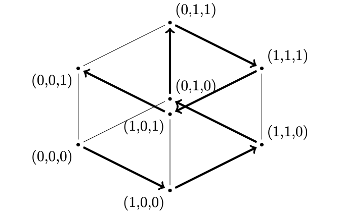

# Linear Programming

本笔记是对应 *UIUC MATH 482 Linear Programming* 的学习笔记，其中包含了线性优化相关的算法设计与证明。参考资料主要是讲师 *Sean English* 提供的讲座笔记，大部分图形和例子都来自于该笔记。本课的前置课程是线性代数。

[TOC]

## 线性优化概述

**线性优化（Linear Programming）** 指的是让计算机对一个线性的系统进行优化求值，下面是一个 **线性优化问题（Linear Program）**的例子：
$$
\begin{align*}
	\underset{x, y \in \R}{\text{maximize}} \quad & x - y \\
	\text{subject to} \quad & y \le 3\\
	& y \ge 2x - 5 \\
	& x + y \ge 1
\end{align*}
$$
上面的问题中，出现了两个重要的部分。其一是 **目标函数（Object Function）**，即我们需要优化的线性多项式；另一个是 **约束（Constraint）**，即下面列出的多个不等式（约束也可以包含等式）。经过重排列，我们可以将上面的约束记为矩阵的形式：
$$
A\mathbf{x} \le \mathbf{b} \\
\text{其中}\quad A = \begin{bmatrix} 0 & 1 \\ 2 & -1 \\ -1 & -1 \end{bmatrix}, 
\mathbf{x} = \begin{bmatrix} x \\ y \end{bmatrix}, \nonumber
\mathbf{b} = \begin{bmatrix} 3 \\ 5 \\ 1 \end{bmatrix}
$$
我们将所有满足上面式子的点集 $\{ \mathbf{x} \mid A\mathbf{x} \le \mathbf{b}\}$ 称为 **可行域（Feasible Region）**。可行域中每一个点都被称为 **可行解（Feasible Solution）**。如果将目标函数也改写成矩阵的形式，我们就得到了一个比较通用的线性优化问题：
$$
\begin{align*}
\underset{x, y \in \R}{\text{maximize}}& \quad \mathbf{c}^T\mathbf{x} \\
\text{subject to}& \quad A\mathbf{x} \le \mathbf{b} \\\\
\text{其中} \quad &\mathbf{c} = \begin{bmatrix} 1 \\ -1 \end{bmatrix}
\end{align*}
$$
如果我们找到了这个最大值（或最小值）$\mathbf{x}$，我们称其为这个线性优化问题的 **最优解（Optimized Solution）**。在上面的例子中，最优解是 $(x, y) = (2, -1)$。我们暂时不给出它的证明。需要注意的是，*不是所有* 线性优化问题都有唯一的最优解。在一些情况中，我们可能会遇到比较特殊的解。

### 异常的线性优化问题

**异常的线性优化问题（Misbehaving Linear Program）** 存在下面几种情况：

1. 最优解并非唯一解
2. 最优解不存在，因为目标函数可以是任意大（任意小）的
3. 最优解不存在，因为可行域为空

下面给出例子：
$$
\begin{align*}
	\underset{x, y \in \R}{\text{maximize}} \quad & y \\
	\text{subject to} \quad & y \le 3\\
	& y \ge 2x - 5 \\
	& x + y \ge 1
\end{align*}
$$
此时不难发现， $y$ 只要等于 $3$，就能够得到最优解，$x$ 可以是 $[-2, 4]$ 中的任意实数。此时有无穷多的最优解。
$$
\begin{align*}
	\underset{x, y \in \R}{\text{maximize}} \quad & x - y \\
	\text{subject to} \quad & y \le 3\\
	& x + y \ge 1
\end{align*}
$$
此时甚至不存在最优解，因为 $x$ 可以任意大，导致目标函数上不有界。
$$
\begin{align*}
	\underset{x, y \in \R}{\text{maximize}} \quad & x - y \\
	\text{subject to} \quad & y \le -3\\
	& y \ge 2x - 5 \\
	& x + y \ge 1
\end{align*}
$$
此时找不到任何满足约束的点，因此可行域为空，不存在最优解。当一个线性优化问题出现上面这些异常时，我们称其为 **不一致的（Inconsistent）** 的线性优化问题。

### 简单的线性优化算法

让我们介绍一个初等的线性优化问题解法。注意到所有的图像都对应了一条直线（两个变量时）和一个区域。因此我们可以通过函数图像来得到线性优化问题的可行域。对于开头给出的：
$$
\begin{align*}
	\underset{x, y \in \R}{\text{maximize}} \quad & x - y \\
	\text{subject to} \quad & y \le 3\\
	& y \ge 2x - 5 \\
	& x + y \ge 1
\end{align*}
$$
我们可以得到以下的图像：

这三个点包围的区域就是我们要求的可行域了。如果把目标函数也视作直线，那就是 $x - y = C$ 这样的无数条直线的集，它和上面给出的可行域需要拥有交集且满足 $C$ 最大。这里我们直接给出要点：线性优化问题的最优解一定出现在 **顶点（Vertex）** 集当中，即所有直线交集的集合。因此我们只需要将这些交点代入目标函数就能得到最优解了。上例中 $2 - (-1) = 3$ 是最大值，因此 $(2, -1)$ 是最优解。

对于多个变量多个方程的线性优化问题，我们都可以通过这个方式得到最优解。但是之所以称其为 **简单的（Naive）** 线性优化算法，是因为它过于低效。考虑一个拥有 50 个变量、100 个不等式组成的约束，我们需要计算 $C_{50}^{100}\approx 10^{29}$ 次目标函数才能比较出最优解，这个数量级甚至不能被超级计算机承受，因此现实中我们不会用这种方法考虑较为复杂的线性优化问题。本篇的重点也即是，如何用更高效的方法解决线性优化问题。

### 线性优化问题的诸多公式化表示

在深入开始讨论线性优化问题之前，让我们先明确一些共识：

#### 非负数的约束变量

我们总是默认所有的约束变量（约束中出现的变量）都是非负的，也即 $\mathbf{x} \ge 0$。其原因主要是：

- 现实生活中很多约束变量本来就不会出现负数情形。
- 在数学上非负数一些美好的性质（比如其拥有下确界 $0$）。
- 当所有约束变量都为正数时，我们可以保证所有最优解都出现在顶点中（这一点我们不作更多解释）。

因此，我们在此可以给出线性优化问题的 **标准形式（Canonical Form）**：
$$
\underset{\mathbf{x} \in \R^n}{\text{maximize}} \quad & \mathbf{c}^T\mathbf{x} \\
	\text{subject to} \quad & A\mathbf{x} \le \mathbf{b} \\
	& \mathbf{x} \ge 0
$$
这里虽然最优解要求目标函数取最大值，但其实对于要求最小值的情形，只需令 $\mathbf{c}' = -\mathbf{c}$，就可以将问题转换为求最大值的线性优化问题。

如果题目没有给出标准形式，并不要求约束变量都为非负数，我们可以对每一个约束变量 $x_i$ 引入变量 $x_i^+, x_i^- \ge 0$ 使得 $x = x_i^+ - x_i^-$，然后将问题转换为：
$$
\underset{\mathbf{x}' \in \R^{2n}}{\text{maximize}} \quad & \mathbf{c}^T\mathbf{x}' \\
	\text{subject to} \quad & A\mathbf{x}' \le \mathbf{b} \\
	& \mathbf{x}' \ge 0
$$
此时可能会出现有无数组最优解的情形，但我们依然能够从中得到原问题的最优解。

举个例子：
$$
\begin{align*}
	\underset{x, y \in \R}{\text{maximize}} \quad & x - y \\
	\text{subject to} \quad & y \le 3\\
	& y \ge 2x - 5 \\
	& x + y \ge 1
\end{align*}
$$
我们可以引入 $x^+, x^-, y^+, y^-$ 四个变量，然后将问题转换为：
$$
\begin{align*}
	\underset{x, y \in \R}{\text{maximize}} \quad & x^+ - x^- - y^+ + y^- \\
	\text{subject to} \quad & y^+ - y^- \le 3\\
	& 2x^+ - 2x^- - y^+ + y^- \le 5 \\
	& -x^+ + x^- - y^+ + y^- \le -1 \\
	& x^+, x^-, y^+, y^- \ge 0
\end{align*}
$$

#### 线性优化问题的等式形式

不等式问题解决起来并不是那么方便。实际上，我们可以通过引入 **松弛变量（Slack Variable）** 来将约束中的不等式变为等式：
$$
\underset{\mathbf{x} \in \R^n}{\text{maximize}} \quad & \mathbf{c}^T\mathbf{x} \\
	\text{subject to} \quad & A\mathbf{x} = \mathbf{b} \\
	& \mathbf{x} \ge 0 \\
	\text{其中} \quad &\mathbf{x}^T = \begin{bmatrix} x_1,...,x_n,s_1,...s_m \end{bmatrix}
$$
还是前面那个例子，我们可以引入松弛变量 $s_1, s_2, s_3$ 使其变为：
$$
\begin{align*}
	\underset{x, y \in \R}{\text{maximize}} \quad & x^+ - x^- - y^+ + y^- \\
	\text{subject to} \quad & y^+ - y^- + s_1 = 3\\
	& 2x^+ - 2x^- - y^+ + y^- + s_2 = 5 \\
	& -x^+ + x^- - y^+ + y^-  + s_3 = -1 \\
	& x^+, x^-, y^+, y^- \ge 0
\end{align*}
$$
这也是我们下文马上要介绍的 **简单形法（Simplex Method）** 采用的线性优化问题的最初形式。

## 简单形法

**简单形法（Simplex Method）** 可以描述为：从线性优化问题的一个可行解线性变换为另一个可行解，每次都使其得到优化，直到达到最优解。这个变换过程遵循了中矩阵的 **行运算（Row Operation）**以及 **高斯消元法（Gaussian Elimination）**，比如下面的方程：
$$
\begin{cases}
3x + y = 6 \\
x - y = -2
\end{cases}\nonumber
$$
可以写成矩阵的形式：
$$
A\mathbf{x} = \mathbf{b} \\
A = \begin{bmatrix} 3 & 1 \\ 1 & -1 \end{bmatrix}, \
\mathbf{x} = \begin{bmatrix} x \\ y \end{bmatrix}, \
\mathbf{b} = \begin{bmatrix} 6 \\ -2 \end{bmatrix}\nonumber
$$
我们将 $A$ 和 $\mathbf{b}$ 合并为一个 **增广矩阵（Augmented Matrix）**，并对其进行行运算：
$$
\begin{bmatrix}
	3 & 1 & 6 \\
	1 & -1 & -2
\end{bmatrix} \leadsto
\begin{bmatrix}
	1 & 0 & 1 \\
	0 & 1 & 3
\end{bmatrix}\nonumber
$$
当增广矩阵变为右侧这样每一行都有特殊的一项值为 $1$，且其所在列的所有其它元素都为 $0$ 的形式时，我们不难发现其给出了方程的一组解：$x = 1, y = 3$。在线性优化问题中，我们通常不能得到所有约束变量的解。考虑下面这个方程组：
$$
\begin{cases}
	3x + y + 5z = 6 \\
	x - y + 3z = -2
\end{cases}\nonumber
$$
我们同样通过行运算得到：
$$
\begin{bmatrix}
	1 & 0 & 2 & 1 \\
	0 & 1 & -1 & 3
\end{bmatrix}\nonumber
$$
这个方程没有唯一解，因为其中 $z$ 的值可能是任意的，而 $x, y$ 的值依赖于 $z$。我们可以将上面的矩阵写成方程的形式：
$$
\begin{cases}
	x = -2z + 1 \\
	y = -z + 3
\end{cases} \nonumber
$$
此时 $x, y$ 仿佛得到了唯一解，我们称它们为 **基本变量（Basic Variable）**，而 $z$ 被称为 **非基本变量（Non-Basic Variable）**。显然，如果设 $z = 0$，就能得到一组解 $x = 1, y = 3$，我们它们为方程的  **基本解（Basic Solution）**。当我们选取不同基本变量时，可以得到不同的基本解。比如上面的方程中将 $y, z$ 作为基本变量时，我们可以得到基本解 $y = \frac{7}{2}, z = \frac{1}{2}$。

### 规则简述

简单形法就是从一组基本变量开始，每次尝试改变基本变量以提升基本解，直到达到最优解。这个方法给予下面两个规则：

- 可行域的顶点均为线性方程的基本解，在线性优化问题中也被称为 **基本可行解（Basic Feasible Solution）**。
- 可行域的顶点中一定存在线性优化问题的一个最优解。

整体来看，简单形法的步骤包括下面几步：

- 从一个基本可行解开始。
- 让一个非基本变量进入 **基（Basis）**，即成为基本变量。这个变量的选择基于某种 **基准规则（Pivoting Rule）**。
- 让一个基本变量离开基，其选择保证 $\text{初始值}/\text{减少率}$ 在所有可选项中最小且为正数。如果有多个最小比值，则可能需要基准规则来指定让某个候选的变量离开。

这里讲的东西让人有点云里雾里。马上我们会用例子来展示简单形法的使用方法，并在之后解释这个方法的原理。

### 简单形表和规则阐述

在对简单形法举例说明之前，我们先引入 **简单形表（Simplex Tableau）** 这个方便于记录方程组、基本变量以及目标函数信息的工具。比如下面这个已经得到一组基本可行解的线性优化问题：
$$
\begin{align*}
\underset{x \in \R^5}{\text{maximize}} \quad & x_1 + x_2 + x_3 + x_4 + x_5 \\
\text{subject to} \quad & x_1 + 2x_4 + x+5 = 1 \\
& x_2 - 3x_4 + x_5 = 2 \\
& x_3 + x_4 - 3x_5 = 3 \\
& x_1, x_2, x_3, x_4, x_5 \ge 0
\end{align*}
$$
我们可以将其等价写成以下的简单形表：
$$
\begin{array}{cccccc|c}
	 & x_1 & x_2 & x_3 & x_4 & x_5 & \\\hline
	 x_1 & 1 & 0 & 0 & 2 & 1 & 1 \\
	 x_2 & 0 & 1 & 0 & -3 & 1 & 2 \\
	 x_3 & 0 & 0 & 1 & 1 & -3 & 3 \\\hline
	 -z & 0 & 0 & 0 & 1 & 2 & -6
\end{array} \nonumber
$$
可以看到，这个表格中中间的五列给出了首行中每个变量对应的系数，最左侧一列则是给出了每个方程中的基本变量。最右侧一列（除去最后一行）则是基本变量的取值，它们总是一个正数。最下面一行是方程的目标函数，满足 $-z +x_4 + 2x_5 = -6$。这点可以通过设 $z = x_1 + x_2 + x_3 + x_4 + x_5$ 并进行简单的行变换得到。不难发现令非基本变量为 $0$ 后就能得到这个表对应的基本可行解 $6$，因此每个简单形表右下角取负即是一个基本可行解，我们的目标就是每次进行行变换都让这个数变得更小，以达到最大值。

不过我们看到 $z = 6 + x_4 + 2x_5$ 时，显然 $z$ 不应该止步于 $6$。当 $x_4, x_5$ 取某个整数时，都能得到更大的值。因此我们需要进行行变换，直到 $-z$ 列中 $x_1, x_2, x_3, x_4, x_5$ 列中不存在任何正数，此时 $z = n - ax_i - bx_j$。由于 $x_i, x_j \ge 0$，我们就得到了最大值 $n$。

此时我们先不管基准规则，假设我们需要让 $x_4$ 进入基，也就是让 $x_4$ 这一列中除了某一行为 $1$，其它都需要变为 $0$。接下来需要让 $x_1, x_2, x_3$ 中一个变量离开基。对比发现 $x_1$ 行相比 $x_3$ 行有 $1/2 < 3/1$，因此应该让 $x_1$ 离开（$x_2$ 不适用，因为它在 $x_4$ 这一列的系数为负）。这样我们就能得到一个新的简单形表：
$$
\begin{array}{cccccc|c}
	 & x_1 & x_2 & x_3 & x_4 & x_5 & \\\hline
	 x_4 & 1/2 & 0 & 0 & 1 & 1/2 & 1/2 \\
	 x_2 & 3/2 & 1 & 0 & 0 & 5/2 & 7/2 \\
	 x_3 & -1/2 & 0 & 1 & 0 & -7/2 & 5/2 \\\hline
	 -z & -1/2 & 0 & 0 & 0 & 3/2 & -13/2
\end{array} \nonumber
$$
可以看到我们确实让目标函数的值更加优化了，不过它还可以更好。让 $x_5$ 进入基，然后让 $x_4$ 离开：
$$
\begin{array}{cccccc|c}
	 & x_1 & x_2 & x_3 & x_4 & x_5 & \\\hline
	 x_5 & 1 & 0 & 0 & 2 & 1 & 1 \\
	 x_2 & -1 & 1 & 0 & -5 & 0 & 1 \\
	 x_3 & 3 & 0 & 1 & 7 & 0 & 6 \\\hline
	 -z & -2 & 0 & 0 & -3 & 0 & -8
\end{array} \nonumber
$$
这样我们就得到了目标函数的最大值 $z = 8$，因为此时目标函数中所有非基本变量的系数都是负数，我们不可能进一步优化这个表了。此时我们知道最优解为：$x_1 = 0, x_2 = 1, x_3 = 6, x_4 = 0, x_5 = 1$。这样我们就完成了简单形法。

等下，我们似乎还没有解释为什么每次都让比值最低且为正的基本变量离开基。这其实一切都是为了让表中右下角的值越小越好（为了达到最优解）。当基本变量 $x_i$ 在准备进入基的 $x_j$ 这列的系数为负数时，我们需要加上 $-z$ 行的值（注意这行我们选的总是正数）才能让这一项变为 $0$；因为 $x_i$ 的基本解总是正数，我们会对右下角这一项加上一个正数，也就是让基本可行解变得更小了，这是违背我们的期望的。当 $x_i$ 在 $x_j$ 这列的系数是正数时，我们希望 $b_i/x_i$ 的比值更低，这是因为为了保证满足给定的约束，我们不能让 $x_i$ 从基中退出（变为 $0$）时，$x_j$ 的基本解让其它的基本变量小于零。比如上面这个例子在最开始的状态，我们有（设 $x_5 = 0$ 因为它是和这次变换无关的非基本变量）：
$$
\begin{cases}
	x_1 = 1 - 2x_4 \\
	x_2 = 2 + 3x_4 \\
	x_3 = 3 - x_4
\end{cases} \nonumber
$$
抛开 $x_2$ 不谈（因为它在表中 $x_4$ 这一列的系数是负数），如果我们选择比值更大的 $x_3$ 离开基，其值将变为 $0$。此时 $x_4 = 3$，而代入第一个等式我们得到 $x_1 = -5$，这违反了所有约束变量都是非负数的规则。因此我们始终需要让比值最小的基本变量（此处为 $x_1$）离开基，这样其它基本变量的取值不会出现问题。

上面的例子是求最大值。如果求最小值，则需要让 $-z$ 行中所有正数列都进入基，最后得到 $z = n + \sum a_ix_i$ 的形式。因为 $x_i \ge 0$，所以我们得到最小值 $n$。

### 更多的例子

让我们再演示一个需要引入松弛变量的例子：
$$
\begin{align*}
\underset{x, y \in \R}{\text{maximize}} \quad & 2x + 3y \\
\text{subject to} \quad & -x + y \le 3 \\
&  x - 2y \le 2 \\
& x + y \le 7 \\
& x, y \ge 0
\end{align*}
$$
之前我们介绍了松弛变量将不等式组变为等式方程组，因此我们可以将线性优化问题变为下面的形式：
$$
\begin{align*}
\underset{x, y \in \R}{\text{maximize}} \quad & 2x + 3y \\
\text{subject to} \quad & -x + y + s_1 = 3 \\
&  x - 2y + s_2 =  2 \\
& x + y + s_3 =  7 \\
& x, y, s_1, s_2, s_3 \ge 0
\end{align*}
$$
它可以立即转换为简单形表：
$$
\begin{array}{cccccc|c}
	& x & y & s_1 & s_2 & s_3 & \\\hline
	s_1 & -1 & 1 & 1 & 0 & 0 & 3 \\
	s_2 & 1 & -2 & 0 & 1 & 0 & 2 \\
	s_3 & 1 & 1 & 0 & 0 & 1 & 7 \\\hline
	-z & 2 & 3 & 0 & 0 & 0 & 0 
\end{array}\nonumber
$$
可以看到，引入松弛变量的一个好处在于，方程一上来就能得到基本可行解 $(3, 2, 7)$，不过显然这并不是优解，因为 $-z$ 行中还有正数。首先可以引入 $y$ 到基中，然后令 $s_1$ 离开：
$$
\begin{array}{cccccc|c}
	& x & y & s_1 & s_2 & s_3 & \\\hline
	y & -1 & 1 & 1 & 0 & 0 & 3 \\
	s_2 & -1 & 0 & 2 & 1 & 0 & 8 \\
	s_3 & 2 & 0 & -1 & 0 & 1 & 4 \\\hline
	-z & 5 & 0 & -3 & 0 & 0 & -9 
\end{array}\nonumber
$$
接下来将 $x$ 引入并让 $s_3$ 离开：
$$
\begin{array}{cccccc|c}
	& x & y & s_1 & s_2 & s_3 & \\\hline
	y & 0 & 1 & 1/2 & 0 & 1/2 & 5 \\
	s_2 & 0 & 0 & 3/2 & 1 & 1/2 & 10 \\
	x & 1 & 0 & -1/2 & 0 & 1/2 & 2 \\\hline
	-z & 0 & 0 & -1/2 & 0 & -5/2 & -19 
\end{array}\nonumber
$$
这样我们就得到了最优解 $x = 2, y  = 5$，此时目标函数为 $19$。

### 简单形法的几何意义

现在让我们将上面这个例子的几何图形展示出来。最一开始时，我们的基本可行解是 $x = 0, y = 0$，也即原点：

当我们决定将 $y$ 变为基本变量时，我们相当于沿着 $y$ 轴向上出发，直到 $s_1 = 0$（图中并没有显示出 $s_1, s_2, s_3$ 的数轴，这是因为我们没有办法画出五维的图形；但是它们取 $0$ 的区域在图中可行域的边界展示出来了）：

此时经过检查发现目标函数并不是最大值，因此我们决定将 $x$ 引入基，并让 $s_3$ 离开。沿着可行域的边界向右上走，直到 $s_3 = 0$：

这里我们就得到了最优解 $(2, 5)$。至此可以看到，简单形法实际上就是从可行域的一个顶点出发，经历边到达一个又一个其它的顶点，直到得到最优解。因此，每次选取的方向比较重要：比如本例中，如果一开始我们决定引入 $x$ 而不是 $y$，就不得不经历三次简单形表的变换才能到达最优解 $(2, 5)$。有没有什么方法能够提前知道最好的选取方式，防止走远路呢？

坏消息是，没有。更坏的消息是，在一些例子中，可能会出现原地打转的情况（多次变换之后回到了遍历过的某个可行解）。唯一的好消息是我们有方法避免原地打转，这个方法就是之前提到过的 **基准规则**。我们将在之后详细介绍它。

#### 无界的线性优化问题

上面的例子中，如果我们去除最后一个约束，也即将问题变为如下：
$$
\begin{align*}
\underset{x, y \in \R}{\text{maximize}} \quad & 2x + 3y \\
\text{subject to} \quad & -x + y \le 3 \\
&  x - 2y \le 2 \\
& x, y \ge 0
\end{align*}
$$
我们在引入 $y$ 后，简单形表会变为下面的样子：
$$
\begin{array}{ccccc|c}
	& x & y & s_1 & s_2 & \\\hline
	y & -1 & 1 & 1 & 0 & 3 \\
	s_2 & -1 & 0 & 2 & 1 & 8 \\\hline
	-z & 5 & 0 & -3 & 0 & -9
\end{array}\nonumber
$$
此时毫无疑问没有达到最优解，但是理应作为下一个引入基的变量 $x$ 这列的所有系数都是负数。根据我们之前的分析，此时的 $x$ 是不受控制的，目标函数可以变得任意大。下面是这个情况对应的几何图形：

可以看到在 $(0, 3)$ 处我们下一步的路径是无界的。沿着这条线我们可以得到任意大的 $x, y$。

#### 基准退化现象

让我们再来看一个异常的优化问题。考虑下面这个线性优化问题：
$$
\begin{align*}
\underset{x, y \in \R}{\text{maximize}} \quad & 2x + 3y \\
\text{subject to} \quad & -x + y \le 3 \\
&  x - 2y \le 2 \\
& x + 2y \le 6 \\
& x, y \ge 0
\end{align*}
$$
我们依旧引入松弛变量，并将其化为简单形表：
$$
\begin{array}{cccccc|c}
	& x & y & s_1 & s_2 & s_3 & \\\hline
	s_1 & -1 & 1 & 1 & 0 & 0 & 3 \\
	s_2 & 1 & -2 & 0 & 1 & 0 & 2 \\
	s_3 & 1 & 2 & 0 & 0 & 1 & 6 \\\hline
	-z & 2 & 3 & 0 & 0 & 0 & 0
\end{array}\nonumber
$$
我们依旧选择 $y$ 进入基，不过这个时候我们发现 $s_1, s_2$ 的比值是相同的，因此它们中任一个都可以离开。假设让 $s_1$ 离开，我们就得到新的表：
$$
\begin{array}{cccccc|c}
	& x & y & s_1 & s_2 & s_3 & \\\hline
	y & -1 & 1 & 1 & 0 & 0 & 3 \\
	s_2 & -1 & 0 & 2 & 1 & 0 & 8 \\
	s_3 & 3 & 0 & -2 & 0 & 1 & 0 \\\hline
	-z & 5 & 0 & -3 & 0 & 0 & -9
\end{array}\nonumber
$$
此时出现了一件奇异的事情。按照规则我们应该让 $x$ 进入，$s_3$ 离开。但此时 $s_3$ 的基本解为 $0$，我们在这一步根本不能够提升目标函数。事实上如果求得下一张表：
$$
\begin{array}{cccccc|c}
	& x & y & s_1 & s_2 & s_3 & \\\hline
	y & 0 & 1 & 1/3 & 0 & 1/3 & 3 \\
	s_2 & 0 & 0 & 4/3 & 1 & 1/3 & 8 \\
	s_3 & 1 & 0 & -2/3 & 0 & 1/3 & 0 \\\hline
	-z & 0 & 0 & -1/3 & 0 & -5/3 & -9
\end{array}\nonumber
$$
目标函数的值确实没有任何进步。我们可以通过几何图形来解释这种情况：

可以看到，$(0, 3)$ 是三条直线的交点。斜着的那条直线是我们引入 $x$ 时的路线，但是显然它和可行域的交集只有 $(0, 3)$ 这一点。所以我们在下一步得到的可行解依然是 $(0, 3)$，而它实际上就是最优解。我们把这种情况称为 **基准退化（Degenerate Pivoting）**。出现基准退化时，我们有可能在同一个顶点上不必要地变换很多次，而实际上没有提升目标函数。我们急需一个方法避免这种情形。没错，依然是 **基准规则**，我们很快就会提到这个知识点。

### 两阶段的简单形法

在前面的论述中，我们总是从一个基本可行解开始的。但是线性优化问题可能根本没有可行域，此时我们甚至没法进行简单形法。为了判断一个线性优化问题是否有基本可行解，我们可以设置一个辅助问题，其中引入了 **虚构变量（Artificial Variable）** 并假定它们拥有可行解；之后将它们的和优化为最小值，如果这个最小值是 $0$，就说明原线性优化问题存在可行域。让我们用一个例子说明：
$$
\begin{align*}
\underset{\mathbf{x} \in \R^4}{\text{minimize}} \quad & x_1 + x_2 - x_3 - x_4 \\
\text{subject to} \quad & -3x_1 + x_2 + x_3 + x_4 = 7 \\
& -2x_1 + x_2 + x_3 + 3x_4 = 1 \\
& x_1, x_2, x_3, x_4 \ge 0
\end{align*}
$$
引入虚构变量 $x_1^\alpha, x_2^\alpha$ 并将原问题化为：
$$
\begin{align*}
\underset{\mathbf{x} \in \R^4, \mathbf{x}^\alpha \in \R^2}{\text{minimize}} \quad & x_1^\alpha + x_2^\alpha \\
\text{subject to} \quad & -3x_1 + x_2 + x_3 + x_4 + x_1^\alpha = 7 \\
& -2x_1 + x_2 + x_3 + 3x_4 + x_2^\alpha = 1 \\
& x_1, x_2, x_3, x_4, x_1^\alpha, x_2^\alpha \ge 0
\end{align*}
$$
为了解决这个问题，我们依然使用简单形表只不过加了新的一行 $-z^\alpha$ 用来存储辅助问题的目标函数信息：
$$
\begin{array}{ccccccc|c}
	& x_1 & x_2 & x_3 & x_4 & x_1^\alpha & x_2^\alpha & \\\hline
	x_1^\alpha & -3 & 2 & 1 & 1 & 1 & 0 & 7 \\
	x_2^\alpha & -2 & 1 & 1 & 3 & 0 & 1 & 1 \\\hline
	-z & 1 & 1 & -1 & -1 & 0 & 0 & 0 \\\hline
	-z^\alpha & 5 & -3 & -2 & -4 & 0 & 0 & -8
\end{array}\nonumber
$$
注意这里目标函数在填表前就进行了行运算，使得 $x_1^\alpha, x_2^\alpha$ 两列为 $0$。接下来就是枯燥无味的表变换。顺次引入 $x_2, x_1$ 后我们得到：
$$
\begin{array}{ccccccc|c}
	& x_1 & x_2 & x_3 & x_4 & x_1^\alpha & x_2^\alpha & \\\hline
	x_1 & 1 & 0 & -1 & -5 & 1 & -2 & 5 \\
	x_2 & 0 & 1 & -1 & -7 & 2 & -3 & 11 \\\hline
	-z & 0 & 0 & 1 & 16 & -3 & 5 & -16 \\\hline
	-z^\alpha & 0 & 0 & 0 & 0 & 1 & 1 & 0
\end{array}\nonumber
$$
至此我们就得到了辅助问题的最优解。此时目标函数为 $0$，正合期望。所以原问题存在可行域，我们可以令 $x_1^\alpha = x_2^\alpha = 0$，然后就得到：
$$
\begin{array}{ccccc|c}
	& x_1 & x_2 & x_3 & x_4 & \\\hline
	x_1 & 1 & 0 & -1 & -5 & 5 \\
	x_2 & 0 & 1 & -1 & -7 & 11 \\\hline
	-z & 0 & 0 & 1 & 16 & -16
\end{array}\nonumber
$$
凑巧，我们也得到了原问题的最优解 $(5, 11, 0, 0)$，此时目标函数有最小值 $16$。

需要注意的是，我们得到辅助问题的最优解时，基本变量有可能包含虚构变量。比如下面这种情形：
$$
\begin{array}{ccccccc|c}
	& x_1 & x_2 & x_3 & x_4 & x_1^\alpha & x_2^\alpha & \\\hline
	x_1^\alpha & 1 & 0 & -1 & -5 & 1 & -2 & 0 \\
	x_2 & 0 & 1 & -1 & -7 & 2 & -3 & 1 \\\hline
	-z & 0 & 0 & 1 & 16 & -3 & 5 & -1 \\\hline
	-z^\alpha & 0 & 0 & 0 & 0 & 1 & 1 & 0
\end{array}\nonumber
$$
消除所有虚构变量我们得到：
$$
\begin{array}{ccccc|c}
	& x_1 & x_2 & x_3 & x_4 & \\\hline
	 & 1 & 0 & -1 & -5 & 0 \\
	x_2 & 0 & 1 & -1 & -7 & 1 \\\hline
	-z & 0 & 0 & 1 & 16 & -1
\end{array}\nonumber
$$
呃，第一行是什么东西呢？一个简单的解决方法是让出了 $x_2$ 外任一个变量成为基本变量，比如 $x_3$，然后进行行变换得到：
$$
\begin{array}{ccccc|c}
	& x_1 & x_2 & x_3 & x_4 & \\\hline
	x_3 & -1 & 0 & 1 & 5 & 0 \\
	x_2 & -1 & 1 & 0 & -2 & 1 \\\hline
	-z & 1 & 0 & 0 & 11 & -1
\end{array}\nonumber
$$
这样我们就得到了最优解 $(0, 1, 0, 0)$，对应目标函数最小值 $1$。

### 简单形表退化现象

如果一个简单形表中的简单可行解存在 $0$，我们就成这个简单形表是 **退化的（Degenerate）**。比如下面的例子：
$$
\begin{align*}
\underset{x_1, x_2 \in \R}{\text{maximize}} \quad & x_1 + 4x_2 \\
\text{subject to} \quad & x_1 + x_2 \le 0 \\
& x_1 - 3x_2 \le 0 \\
& -2x_1 + x_2 \le 0 \\
& x_1, x_2 \ge 0
\end{align*}
$$
一般来说，形如 $A\mathbf{x} \le \mathbf{0}$ 或 $A\mathbf{x} \ge \mathbf{0}$ 的线性优化问题或者最优解在 $(0, 0)$ ，或者其可行域无界因而不存在最优解。我们引入松弛变量并将方程变为简单形表：
$$
\begin{array}{cccccc|c}
	& x_1 & x_2 & s_1 & s_2 & s_3 & \\\hline
	s_1 & 1 & 1 & 1 & 0 & 0 & 0 \\
	s_2 & 1 & -3 & 0 & 1 & 0 & 0 \\
	s_3 & -2 & 1 & 0 & 0 & 1 & 0 \\\hline
	-z & 1 & 4 & 0 & 0 & 0 & 0
\end{array}\nonumber
$$
现在我们可以按照简单形法继续进行化简，但由于所有基本可行解都是 $0$，我们每次引入新的基本变量时无法通过右下角得知是否对目标函数进行了优化，只能不断尝试直到 $-z$ 这行都变为负数。这个过程我们并不知道是否出现原地打转的情况。因此再一次地，我们需要一个 **基准规则** 来保证我们一定能到达最优解。

### 基准规则

正如简单形法的 [规则简述](# 规则简述) 中提到的，在选择进入基的变量，以及出现比值相同的离开基的候选变量时，我们有选择的空间。为了防止我们的选择导致无限循环，需要特定的 **基准规则（Pivoting Rule）** 保证不会出现无限循环：

- Bland 基准规则：给所有约束变量（$x_1,...,x_n,s_1,...,s_m$）一个序号。在每次选择时，优先选择序号低的。
- 随机基准规则：每次选择时随机进行。
- 词典基准规则：为每个方程设置 $\epsilon_1,...,\epsilon_m$ 使得 $1 \gg \epsilon_1 \gg \epsilon_2 \gg ... \gg \epsilon_m > 0$，然后将 $\mathbf{b}$ 全体加上 $[\epsilon_1,....,\epsilon_m]^T$，再继续进行简单形法。此时可以保证不会因为简单形表的退化而出现循环。

我们将详细描述 **词典基准规则（Lexicographic Pivoting Rule）**，其基于一个简单的思考：简单形表变换中出现循环的原因通常是多个基本可行解描述的是同一个点。如果我们对约束右侧加上一系列很小且不同的值，那样就不会出现多条线重合的情形了。让我们以上一节中遇到的问题为例，展示词典基准规则的使用：
$$
\begin{align*}
\underset{x_1, x_2 \in \R}{\text{maximize}} \quad & x_1 + 4x_2 \\
\text{subject to} \quad & x_1 + x_2 \le \epsilon_1 \\
& x_1 - 3x_2 \le \epsilon_2 \\
& -2x_1 + x_2 \le \epsilon_3 \\
& x_1, x_2 \ge 0
\end{align*}
$$
其可以写为以下的简单形表：
$$
\begin{array}{cccccc|c|cccc}
	& x_1 & x_2 & s_1 & s_2 & s_3 & & 1 & \epsilon_1 & \epsilon_2 & \epsilon_3 \\\hline
	s_1 & 1 & 1 & 1 & 0 & 0 & \epsilon_1 & 0 & 1 & 0 & 0 \\
	s_2 & 1 & -3 & 0 & 1 & 0 & \epsilon_2 & 0 & 0 & 1 & 0 \\
	s_3 & -2 & 1 & 0 & 0 & 1 & \epsilon_3 & 0 & 0 & 0 & 1 \\\hline
	-z & 1 & 4 & 0 & 0 & 0 & 0 & 0 & 0 & 0 & 0
\end{array}\nonumber
$$
这里可以选择有最大 **差额成本（Reduced Cost）** 的 $x_2$ 进入基，然后由于 $\epsilon_3 < \epsilon_1$，我们选择 $s_3$ 退出：
$$
\begin{array}{cccccc|c|cccc}
	& x_1 & x_2 & s_1 & s_2 & s_3 & & 1 & \epsilon_1 & \epsilon_2 & \epsilon_3 \\\hline
	s_1 & 3 & 0 & 1 & 0 & -1 & \epsilon_1 - \epsilon_3 & 0 & 1 & 0 & -1 \\
	s_2 & -5 & 0 & 0 & 1 & 3 & \epsilon_2 + 3\epsilon_3 & 0 & 0 & 1 & 3 \\
	x_2 & -2 & 1 & 0 & 0 & 1 & \epsilon_3 & 0 & 0 & 0 & 1 \\\hline
	-z & 9 & 0 & 0 & 0 & -4 & -4\epsilon_3 & 0 & 0 & 0 & -4
\end{array}\nonumber
$$
引入 $x_1$ 并让 $s_1$ 退出：
$$
\begin{array}{cccccc|c|cccc}
	& x_1 & x_2 & s_1 & s_2 & s_3 & & 1 & \epsilon_1 & \epsilon_2 & \epsilon_3 \\\hline
	x_1 & 1 & 0 & 1/3 & 0 & -1/3 & \epsilon_1/3 - \epsilon_3/3 & 0 & 1/3 & 0 & -1/3 \\
	s_2 & 0 & 0 & 5/3 & 1 & 4/3 & 5\epsilon_2/3 + \epsilon_2 + 4\epsilon_3/3 & 0 & 5/3 & 1 & 4/3 \\
	x_2 & 0 & 1 & 2/3 & 0 & 1/3 & 2\epsilon_1/3  + \epsilon_3/3 & 0 & 2/3 & 0 & 1/3 \\\hline
	-z & 0 & 0 & -3 & 0 & -1 & -3\epsilon_1 - \epsilon_3 & 0 & -3 & 0 & -1
\end{array}\nonumber
$$
至此所有的差额成本都为非正数了，我们得到了最优解 $(0, 0, 0)$，此时目标函数为 $0$。

细心的同学可能会发现，每次操作时，$\epsilon_i$ 的系数总是和 $s_i$ 的系数一致，因此存在松弛变量的情况下我们只需要按照它们的系数来判断即可。即使是没有松弛变量的方程，我们也可以对一开始的基本变量所在列作出标记 $C_1,...,C_k$，然后每次判断离开的基本变量出现选择时，选择 $C_1$ 列最小的，不然顺次比较 $C_2$、$C_3$…… 这和使用 $\epsilon_i$ 是完全等价的。

## 矩阵法

### 基本可行解

现在让我们用矩阵构建更为严格的线性优化问题算法。考虑一个等式形式的线性优化问题：
$$
\begin{align}
\begin{split}
	\underset{\mathbf{x} \in \R^n}{\text{maximize}} \quad & \mathbf{c}^T\mathbf{x} \\
	\text{subject to} \quad & A\mathbf{x} = \mathbf{b} \\
	& \mathbf{x} \ge \mathbf{0}
\end{split}
\end{align}
$$
此处 $A$ 是一个 $m\times n$ 的矩阵，$\mathbf{c} \in \R^n, \mathbf{b} \in \R^m$（这个设定将贯穿下面全文；当没有特别给出这些矩阵和向量的类型时，都以此处的声明为准）。为了方便讨论，我们假设 $A$ 中的各行是线性无关的。下面让我们来正式地定义 **基本可行解** ：从 $A$ 中选取不重复且按顺序排列的某 $m$ 列序号记为 $\mathcal{B}$，其代表我们将选取的基本变量的序号。其余的 $n - m$ 个序号按顺序排列记为 $\mathcal{N}$。定义 $\mathbf{x}_\mathcal{B} = (x_{k_1}, x_{k_2},..., x_{k_m})$，其中 $k_1, k_2,..., k_m \in \mathcal{B}$ 且 $k_1 < k_2 <. ..< k_m$。类似地我们可以定义 $\mathbf{x}_\mathcal{N}$。这样我们就可以将目标函数写为：
$$
\mathbf{c}^T\mathbf{x} = \mathbf{c}_\mathcal{B}^T\mathbf{x}_\mathcal{B} + \mathbf{c}_\mathcal{N}^T\mathbf{x}_\mathcal{N}
$$
而约束条件也可以写为：
$$
A_\mathcal{B}\mathbf{x}_\mathcal{B} + A_\mathcal{N}\mathbf{x}_\mathcal{N} = \mathbf{b}
$$
为了得到基本可行解，我们需要 $A_\mathcal{B}$ 是可逆的，此时设 $\mathbf{x}_\mathcal{N} = 0$，我们就有 $\mathbf{x}_\mathcal{B} = A_\mathcal{B}^{-1}\mathbf{b}$。如果此时同时有 $\mathbf{x}_\mathcal{B} \ge \mathbf{0}$，我们就称其是一个基本可行解。

此外，让我们再定义 $\R^n$ 子集的 **顶点（Vertex）** 与 **极值点（Extreme Point）** 的概念。对于 $S \subseteq \R^n$，顶点是指令某个线性函数 $\boldsymbol{\alpha}^T\mathbf{x}$ 严达到格最小值的点 $\mathbf{y} \in S$。极值点则是指在不在任意两个点 $\mathbf{x}, \mathbf{y} \in S$ 之间的点 $\mathbf{z} \in S$。最后，定义 **可行域** $F = \{x \in \R^n \mid A\mathbf{x} = \mathbf{b}\}$。现在我们要证明在可行域中，基本可行解、顶点与极值点是等价的：

> **命题**：任何基本可行解都是可行域的一个顶点。

> **证明**：首先任意选择一个基本可行解及其对应的 $\mathcal{B}, \mathcal{N}$。设 $\alpha_i = \begin{cases}1\quad i \in \mathcal{N} \\ 0 \quad i \in \mathcal{B}\end{cases}$，则 $\boldsymbol{\alpha}^T\mathbf{x}$ 就是所有非基本变量的和。显然当且仅当 $\mathbf{x}_\mathcal{N} = \mathbf{0}$ 时才有最小值 $\mathbf{0}$，因此基本可行解对应了可行域的一个顶点。

> **命题**：$S \subseteq \R^n$ 的顶点同时也是它的极值点。

> **证明**：设 $\mathbf{x} \in S$ 是 $S$ 的一个顶点，$\boldsymbol{\alpha}$ 是令 $\boldsymbol{\alpha}^T\mathbf{x} < \boldsymbol{\alpha}^T\mathbf{y}$ 对任意 $\mathbf{y} \ne \mathbf{x} \in S$ 成立的向量。假设 $\mathbf{x}$ 并不是极值点，则存在 $\mathbf{y}, \mathbf{y}'$ 使得 $\mathbf{x} = t\mathbf{y} + (1-t)\mathbf{y}'$。此时有：
> $$
> \begin{equation*}
> 	\boldsymbol{\alpha}^T\mathbf{x} = t\boldsymbol{\alpha}^T\mathbf{y} + (1-t)\boldsymbol{\alpha}^T\mathbf{y}' < t\boldsymbol{\alpha}^T\mathbf{x} + (1-t)\boldsymbol{\alpha}^T\mathbf{x} = \boldsymbol{\alpha}^T\mathbf{x}
> \end{equation*}
> $$
> 矛盾！因此 $\mathbf{x}$ 必然是一个极值点。

> **命题**：任何可行域的极值点都是它的一个基本可行解。

> **证明**：暂略。

### 行运算

我们在介绍简单形法时没有介绍行运算，这里详细讲一下。行运算包括下面三种：

- 将某一行乘以任一个非零的数。
- 将某一行乘以任一个数并加到另一行上。
- 交换两行。

矩阵的行运算不会改变其对应的线性方程组的解，因此非常有用。实际上，我们可以将行运算视为一个 **线性变换（Linear Transformation）**，对 $A\mathbf{x} = \mathbf{b}$ 的行变换可以写为 $(EA)\mathbf{x} = E\mathbf{b}$ 的形式，其中 $E$ 是一个 **基本矩阵（Elementary Matrix）**，即和单位矩阵只差一次行运算的矩阵。作为举例，下面的基本矩阵 $E$ 将第一行乘上 $-2$ 后加到第三行中：
$$
E = \begin{bmatrix}
	1 & 0 & 0 \\
	0 & 1 & 0 \\
	-2 & 0 & 1
\end{bmatrix}, A = 
\begin{bmatrix}
	1 & 4 \\
	2 & 5 \\
	3 & 6
\end{bmatrix}, \mathbf{b} =
\begin{bmatrix}
	7 \\ 8 \\ 9
\end{bmatrix}, \\ A\mathbf{x} = \mathbf{b} \quad\leadsto\quad
(EA)\mathbf{x} = Eb \Leftrightarrow 
\begin{bmatrix}
	1 & 4 \\
	2 & 5 \\
	1 & -2 
\end{bmatrix}
\begin{bmatrix}
	x_1 \\ x_2 \\ x_3
\end{bmatrix}
= \begin{bmatrix}
	7 \\ 8 \\ -5
\end{bmatrix}
\nonumber
$$
这样，我们就可以将经过一系列行运算的等式写作 $MA\mathbf{x} = M\mathbf{b}$ 的形式。实际上 $M = A_\mathcal{B}^{-1}$，这是因为 $(MA)_\mathcal{B} = I$。因此对于方程 (6)，我们可以找到它的解：
$$
\mathbf{x}_\mathcal{B} = A_\mathcal{B}^{-1}\mathbf{b} - A_\mathcal{B}^{-1}A_\mathcal{N}\mathbf{x}_\mathcal{N}
$$
当令 $\mathbf{x}_\mathcal{N} = \mathbf{0}$ 时我们就得到了 $\mathbf{x}_\mathcal{B} = A_\mathcal{B}^{-1}\mathbf{b}$。这个结论在线性代数中应该已经讨论过，这里只是进行重温。

### 简单形表的公式

现在让我们把上面的一些结论代入到简单形表中。对于 (4) 描述的线性优化问题，我们在简单形法中每次选择 $\mathcal{B}$ 时要确保：

- $A_\mathcal{B}$ 是可逆的，此时令 $\mathbf{x}_\mathcal{N} = 0$，我们就得到了一个基本解 $\mathbf{x}_\mathcal{B} = A_\mathcal{B}^{-1}\mathbf{b}$。
- $\mathbf{x}_\mathcal{B} \ge \mathbf{0}$，此时这个基本解就是可行的。

简单形表的模式如下：
$$
\begin{array}{cccccc|c}
	& & \mathbf{x}_\mathcal{B} & & \mathbf{x}_\mathcal{N} & & \\\hline
	\\
	\mathbf{x}_\mathcal{B} & & I & & Q & & \mathbf{p} \\
	\\\hline
	-z & & \mathbf{0}^T & & \mathbf{r}^T & & -z_0
\end{array}
$$
这里 $Q$ 是一个矩阵，而 $\mathbf{p}, \mathbf{r}$ 是两个向量。需要注意的是我们要求表的左上角是单位矩阵 $I$，因此可能需要列之间的交换。下面举一个例子说明：
$$
\begin{align*}
\underset{x, y \in \R}{\text{maximize}} \quad & 2x + 3y \\
\text{subject to} \quad & -x + y + s_1 = 3 \\
& x - 2y + s_2 = 2 \\
& x + y + s_3 = 7 \\
& x, y, s_1, s_2, s_3 \ge 0
\end{align*}
$$
让我们把它写成 (8) 式的形式（这是我们期望的最终成果）：
$$
\begin{array}{cccccc|c}
	& y & s_2 & x & s_1 & s_3 & \\\hline
	y & 1 & 0 & 0 & 1/2 & 1/2 & 5 \\
	s_2 & 0 & 1 & 0 & 3/2 & 1/2 & 10 \\
	x & 0 & 0 & 1 & -1/2 & 1/2 & 2 \\\hline
	-z & 0 & 0 & 0 & -1/2 & -5/2 & -19
\end{array}\nonumber
$$
如果使用上表的顺序重写最一开始的方程，应该是下面这样的：
$$
\begin{array}{cccccc|c}
	& y & s_2 & x & s_1 & s_3 & \\\hline
	s_1 & 1 & 0 & -1 & 1 & 0 & 3 \\
	s_2 & -2 & 1 & 1 & 0 & 0 & 2 \\
	s_3 & 1 & 0 & 1 & 0 & 1 & 7 \\\hline
	-z & 3 & 0 & 2 & 0 & 0 & 0
\end{array}\nonumber
$$
我们的目标是通过这个表尝试得出基为 $(y, s_2, x)$ 的新表中的 $\mathbf{p}, Q, \mathbf{r}, z_0$ 这些新数据。目前已知的是我们选取的基 $\mathcal{B}$ 满足：
$$
A_\mathcal{B} = \begin{bmatrix}
	1 & 0 & -1 \\
	-2 & 1 & 1 \\
	1 & 0 & 1
\end{bmatrix}\nonumber
$$
首先让我们看看 $\mathbf{p}$。它存储的是经过行运算后得到的新基本可行解。因此不难猜测有：
$$
A_\mathcal{B}^{-1}\mathbf{b} = \begin{bmatrix}
	1 & 0 & -1 \\
	-2 & 1 & 1 \\
	1 & 0 & 1
\end{bmatrix} \begin{bmatrix}
	3 \\ 2 \\ 7
\end{bmatrix}
= \begin{bmatrix}
	5 \\ 10 \\ 2
\end{bmatrix}
= \mathbf{p}
$$
然后 $A_\mathcal{N}$ 在等式左侧其实经历了和 $\mathbf{b}$ 相同的运算过程，因此也有：
$$
A_\mathcal{B}^{-1}A_\mathcal{N} = \begin{bmatrix}
	1 & 0 & -1 \\
	-2 & 1 & 1 \\
	1 & 0 & 1
\end{bmatrix} \begin{bmatrix}
	1 & 0 \\
	0 & 0 \\
	0 & 1
\end{bmatrix}
= \begin{bmatrix}
	1/2 & 1/2 \\
	3/2 & 1/2 \\
	-1/2 & 1/2
\end{bmatrix}
= Q
$$
目标函数 $z_0$ 也比较直白，正是 $z = \mathbf{c}^T\mathbf{x} = \mathbf{c}_\mathcal{B}^T\mathbf{x}_\mathcal{B} + \mathbf{c}_\mathcal{N}^T\mathbf{x}_\mathcal{N}$，且此时 $\mathbf{x}_\mathcal{B} = A_\mathcal{B}^{-1}\mathbf{b}$ 。最后让我们尝试得到 $\mathbf{r}$。实际上我们可以完全让 $-z$ 行保持不变，然后得到 $I$ 与 $Q$ 后（它们合起来即是 $A_\mathcal{B}^{-1}A$），为了让基本变量所在的列能够被清空，我们需要从 $\mathbf{c}^T$ 中减去 $\mathbf{c}_\mathcal{B}^TA_\mathcal{B}^{-1}A$，其过程如下：
$$
\mathbf{c}_\mathcal{B}^TA_\mathcal{B}^{-1}A = 
\begin{bmatrix}
	3 & 0 & 2
\end{bmatrix}
\begin{bmatrix}
	1 & 0 & 0 & 1/2 & 1/2 \\
	0 & 1 & 0 & 3/2 & 1/2 \\
	0 & 0 & 1 & -1/2 & 1/2
\end{bmatrix}
= \begin{bmatrix}
	3 & 0 & 2 & 1/2 & 5/2
\end{bmatrix} \\
\mathbf{c}^T - \mathbf{c}_\mathcal{B}^TA_\mathcal{B}^{-1}A =
\begin{bmatrix}
	0 & 0 & 0 & -1/2 & -5/2
\end{bmatrix}
$$
只要取它序数为 $\mathcal{N}$ 中的项，就得到了 $\mathbf{r}^T$。

最后我们总结如下：

- $\mathbf{p} = A_\mathcal{B}^{-1}\mathbf{b}$
- $Q = A_\mathcal{B}^{-1}A_\mathcal{N}$
- $\mathbf{r}^T = \mathbf{c}_\mathcal{N}^T - \mathbf{c}_\mathcal{B}^TA_\mathcal{B}^{-1}A_\mathcal{N}$
- $z_0 = \mathbf{c}_\mathcal{B}^TA_\mathcal{B}^{-1}\mathbf{b}$ 

### 修改后的简单形法

通过上面这些公式的启发，我们意识到并不需要计算矩阵中的每一项，而只需每次计算关键的数据即可推进。理论上，我们只需要一个 $A_\mathcal{B}$，因为它在每个公式都出现了，且决定了基本变量的取舍。不过，$\mathbf{p}$ 也同样重要，因为我们需要随时更新基本变量当前的解。

下面是修改的简单形法的全部步骤：

- **计价（Pricing）**：决定新的基 $\mathcal{B}$。此前使用简单形表时，这步只需要选择一个差额成本符号正确（求最大值时寻找正数，反之找负数）的基本变量即可。现在我们并不打算将整个差额成本向量 $\mathbf{r}^T$ 算出来，只需对 $\mathcal{N}$ 中每个变量 $x_j$，计算 $r_j = c_i - \mathbf{c}_\mathcal{B}^TA_\mathcal{B}^{-1}A_j$，只要其满足符号要求，就选择其为新的基本变量。这里我们使用 Bland 基准规则，因此 $j$ 将从 $\mathcal{N}$ 中最小的开始直到最大。$r_j$ 的计算细节也值得讨论。由于 $\mathbf{c}_\mathcal{B}^TA_\mathcal{B}^{-1}$ 和 $j$ 无关且可能多次重复计算，我们应该首先计算这个乘积。这个乘积在目标函数 $z_0$ 的公式中也出现了，我们记其为 $\mathbf{u}^T$。

- 列生成：为了找到离开的变量，我们应该计算 $Q_j$。它可以通过公式 $Q_j = (A_\mathcal{B}^{-1}A_\mathcal{N})_j = A_\mathcal{B}^{-1}A_j$ 得到。

- 寻找基准：我们应该对 $Q_j$ 和 $\mathbf{p}$ 中的每项（要求 $Q_j$ 的该项为正数）计算 $p_i/Q_{ij}$。使得这个比值最小的 $i$ 将成为离开的变量。

- 更新 $A_\mathcal{B}^{-1}$ 和 $\mathbf{p}$：通过前面的步骤我们知道如何从 $\mathcal{B}$ 得到 $\mathcal{B}'$，该过程实际上就是寻找一个进入基和一个离开基的变量。现在我们尝试从 $A_\mathcal{B}^{-1}$ 得到 $A_{\mathcal{B}'}^{-1}$，并将 $\mathbf{p}$ 变为 $A_{\mathcal{B}'}^{-1}\mathbf{b}$。之前我们提到过，$A_\mathcal{B}^{-1}$ 的实质就是对使 $A$ 变为 $[I|Q]$ 的基本矩阵之积。因此：
  $$
  A\mathbf{x} = \mathbf{b} \quad\leadsto\quad A_\mathcal{B}^{-1}A\mathbf{x} = A_\mathcal{B}^{-1}\mathbf{b}
  $$
  现在假设我们还需要一系列行变换，$M$ 来从 $\mathcal{B}$ 切换到 $\mathcal{B}'$，则有：
  $$
  A_\mathcal{B}^{-1}A\mathbf{x} = A_\mathcal{B}^{-1}\mathbf{b} \quad\leadsto\quad MA_\mathcal{B}^{-1}A\mathbf{x} = MA_\mathcal{B}^{-1}\mathbf{b}
  $$
  另一方面，如果一开始就从将基设为 $\mathcal{B}'$，则有：
  $$
  A\mathbf{x} = \mathbf{b} \quad\leadsto\quad A_{\mathcal{B}'}^{-1}A\mathbf{x} = A_{\mathcal{B}'}^{-1}\mathbf{x}
  $$
  经过对比我们有：
  $$
  A_{\mathcal{B}'} = MA_\mathcal{B}^{-1}
  $$
  因此，每次进行额外的行变换时，只需要将其乘上一步的基变量的逆矩阵 $A_\mathcal{B}^{-1}$ 就可以得到新的逆矩阵。为了方便计算，我们可以借用一个迷你的简单形表：
  $$
  \begin{array}{|c|c|c|}
  	A_\mathcal{B}^{-1} & Q_j &\mathbf{p}
  \end{array}
  \nonumber
  $$
  当我们将 $Q_j$ 中的第 $i$ 行（离开的基本变量）为基准，将该列其它项都清为 $0$ 时（且该项变为 $1$ 时），$A_\mathcal{B}^{-1}$ 便自然地变成 $A_{\mathcal{B}'}$，且 $\mathbf{p}$ 变为 $\mathbf{p}'$ 了。

现举例说明：
$$
\begin{align*}
	\underset{x_1, x_2, x_3, x_4 \in \R}{\text{maximize}}\quad & x_1 + x_2 + x_3 + 2x_4 \\
	\text{subject to} \quad & 3x_1 - x_2 + 4x_3 - x_4 \le 4 \\
	& 2x_2 + x_4 \le 5 \\
	& x_1, x_2, x_3, x_4 \ge 0
\end{align*}
$$
引入松弛变量后，我们可以写出如下的简单形表：
$$
\begin{array}{ccccccc|c}
	& x_1 & x_2 & x_3 & x_4 & s_1 & s_2 & \\\hline
	s_1 & 3 & -1 & 4 & -1 & 1 & 0 & 4 \\
	s_2 & 0 & 1 & 0 & 1 & 0 & 1 & 5 \\\hline
	-z & 1 & 1 & 1 & 2 & 0 & 0 & 0
\end{array}\nonumber
$$
此时有 $\mathcal{B} = (s_1, s_2)$。易知 $A_\mathcal{B}^{-1} = \begin{bmatrix} 1 & 0 \\ 0 & 1 \end{bmatrix}$，$\mathbf{p} = \begin{bmatrix} 4 \\ 5 \end{bmatrix}$。依此我们可以得到 $\mathbf{u}^T = \mathbf{c}_\mathcal{B}^TA_\mathcal{B}^{-1} = \begin{bmatrix} 0 & 0 \end{bmatrix}$。简单形表的核心信息如下：
$$
\begin{array}{ccc|c}
	\mathcal{B} & A_\mathcal{B}^{-1} & x_1 & \mathbf{p} \\\hline
	s_1 & 1\quad 0 & 3 & 4 \\
	s_2 & 0\quad 1 & 0 & 5
\end{array}\nonumber
\quad\leadsto\quad
\begin{array}{ccc|c}
	\mathcal{B} & A_\mathcal{B}^{-1} & x_1 & \mathbf{p} \\\hline
	x_1 & 1/3\quad 0 & 1 & 4/3 \\
	s_2 & 0\quad 1 & 0 & 5
\end{array}\nonumber
$$
我们在上面的变换中选择让 $x_3$ 进入基，$s_1$ 离开。随后我们得到 $\mathbf{u}^T = \mathbf{c}_\mathcal{B}^TA_\mathcal{B}^{-1} = \begin{bmatrix} 1 & 0 \end{bmatrix} \begin{bmatrix} 1/3 & 0 \\ 0 & 1 \end{bmatrix} = \begin{bmatrix} 1/3 & 0 \end{bmatrix}$。计算得到 $x_2$ 的差额成本为：$1 - \begin{bmatrix} 1/3 & 0 \end{bmatrix}\begin{bmatrix} -1 \\ 2 \end{bmatrix} = \frac{4}{3} > 0$。因此 $x_2$ 可以进入基。经过计算可以得到 $Q_{x_2} = A_\mathcal{B}^{-1}A_{x_2} = \begin{bmatrix} 1/3 & 0 \\ 0 & 1 \end{bmatrix}\begin{bmatrix} -1 \\ 2 \end{bmatrix} = \begin{bmatrix} -1/3 \\ 2 \end{bmatrix}$。现在简单形表为：
$$
\begin{array}{ccc|c}
	\mathcal{B} & A_\mathcal{B}^{-1} & x_2 & \mathbf{p} \\\hline
	x_1 & 1/3\quad 0 & -1/3 & 4/3 \\
	s_2 & 0\quad 1 & 2 & 5
\end{array}\nonumber
\quad\leadsto\quad
\begin{array}{ccc|c}
	\mathcal{B} & A_\mathcal{B}^{-1} & x_2 & \mathbf{p} \\\hline
	x_1 & 1/3\quad 1/6 & 0 & 13/6 \\
	x_2 & 0\quad 1/2 & 1 & 5/2
\end{array}
$$
在此计算 $\mathbf{u}^T = \mathbf{c}_\mathcal{B}^TA_\mathcal{B}^{-1} = \begin{bmatrix} 1 & 1 \end{bmatrix}\begin{bmatrix} 1/3 & 1/6 \\ 0 & 1/2 \end{bmatrix} = \begin{bmatrix} 1/3 & 2/3 \end{bmatrix}$。接下来通过 $r_j = c_j - \mathbf{u}^TA_j$ 来寻找合适的新的基本变量。$x_3$ 的差额成本为：$1 - \begin{bmatrix} 1/3 & 2/3 \end{bmatrix}\begin{bmatrix} 4 \\ 0 \end{bmatrix} = -\frac{1}{3} < 0$，因此并不合适。$x_4$ 的差额成本为：$2 - \begin{bmatrix} 1/3 & 2/3 \end{bmatrix}\begin{bmatrix} -1 \\ 1 \end{bmatrix} = \frac{5}{3} > 0$，因此 $x_4$ 可以进入基。计算得到 $Q_{x_4} = A_\mathcal{B}^{-1}A_{x_4} = \begin{bmatrix} 1/3 & 1/6 \\ 0 & 1/2 \end{bmatrix}\begin{bmatrix} -1 \\ 1 \end{bmatrix} = \begin{bmatrix} -1/6 \\ 1/2 \end{bmatrix}$。简单形表如下：
$$
\begin{array}{ccc|c}
	\mathcal{B} & A_\mathcal{B}^{-1} & x_2 & \mathbf{p} \\\hline
	x_1 & 1/3\quad 1/6 & -1/6 & 13/6 \\
	x_2 & 0\quad 1/2 & 1/2 & 5/2
\end{array}
\quad\leadsto\quad
\begin{array}{ccc|c}
	\mathcal{B} & A_\mathcal{B}^{-1} & x_2 & \mathbf{p} \\\hline
	x_1 & 1/3\quad 1/3 & 0 & 3 \\
	x_4 & 0\quad 1 & 1 & 5
\end{array}\nonumber
$$
$\mathbf{u}^T = \mathbf{c}_\mathcal{B}^TA_\mathcal{B}^{-1} = \begin{bmatrix} 1 & 2 \end{bmatrix} \begin{bmatrix} 1/3 & 1/3 \\ 0 & 1 \end{bmatrix} = \begin{bmatrix} 1/3 & 7/3 \end{bmatrix}$。似乎我们已经走完了所有变量，检查一下差额成本：
$$
\begin{align*}
\mathbf{r}^T &= \mathbf{c}_\mathcal{N}^T - \mathbf{u}^TA_\mathcal{N} \\
&= \begin{bmatrix} 1 & 1 & 0 & 0 \end{bmatrix} - 
\begin{bmatrix} 1/3 & 7/3 \end{bmatrix}
\begin{bmatrix} -1 & 4 & 1 & 0 \\ 2 & 0 & 0 & 1 \end{bmatrix} \\
&= \begin{bmatrix} -10/3 & -1/3 & -1/3 & -7/3 \end{bmatrix}
\end{align*}
$$
差额成本都是负数，因此我们已经得到了最优解 $(3, 0, 0, 5)$。

### 最差情形

现在让我们尝试得到上面介绍的简单形法的最差时间复杂度。考虑一个有 $d$ 个变量和 $2d$ 个约束的线性优化问题。此时我们最多经过 $\begin{pmatrix} 2d \\ d \end{pmatrix} < 4^d$ 次变化才能得到最优解。考虑下面这个问题：
$$
\begin{align*}
\underset{x \in \R^d}{\text{maximize}} \quad & x_d \\
\text{subject to} \quad & 0 \le x_1 \le 1 \\
& 0 \le x_2 \le 1 \\
&... \\
& 0 \le x_d \le 1
\end{align*}
$$
最优解显然是 $(0, ..., 1)$，不过根据 Bland 基准规则，我们需要遍历所有可能后才能达到这个最优解。我们将 $d=3$ 的情形用下图展示出来：

我们将这样的路径称为 **可怕轨迹（Terrible Trajectory）**（这并不是一个正式的术语）。其特征在于，除了最后一段轨迹，其它的所有变化都不会提升目标函数的值。如果我们能够设计一种方式，保证每次转换时都能提升目标函数，这样我们至少不会失去方向。

#### 欺骗 Bland 规则

一种方式是将约束条件改为等价的形式：
$$
\begin{align*}
\underset{x\in\R^d}{\text{maximize}}\quad &x_d \\
\text{subject to} \quad &\epsilon \le x_1 \le 1 + \epsilon \\
&\epsilon x_1 \le x_2 \le 1 + \epsilon x_1 \\
&... \\
& \epsilon x_{d-1} \le x_d \le 1 + \epsilon x_{d-1}
\end{align*}
$$
这里 $\epsilon$ 是任取的一个很小的正数。只要我们使 $\epsilon \to 0$，上面的线性优化问题的解就无限趋近于原问题。正是这个 $\epsilon$ 让我们的求解出现了一些决定性的不同，我们依然来看 $d=3$ 的示意图，假设 $\epsilon=0.1$：

可以看到我们的目标函数经历了 $0.001 \to 0.009 \to 0.091 \to ... \to 0.999$ 这样逐渐优化的变化。

#### Klee-Monty 正方体

前面我们展示的例子展现了 Bland 基准规则的弱点。但其它规则，比如选取最大差额成本的基准规则依然有致命的弱点。考虑下面的线性优化问题：
$$
\begin{align*}
\underset{x\in\R^d}{\text{maximize}}\quad & 2^{d-1}x_1 + 2^{d-2}x_2 + ... + x_d \\
\text{subject to}\quad & 5 \ge x_1 \\
& 25 \ge 4x_1 + x_2 \\
& ... \\
& 5^d \ge 2^dx_1 + 2^{d-1}x_2 + ... + x_d \\
& x_1, ..., x_d \ge 0
\end{align*}
$$
我们依然可以将其图形化。考虑 $d=3$，此时可以画出下面的（非正常比例）图形：

Klee-Monty 问题成功让我们堕入陷阱，又走了一遍可怕轨迹。

#### 其它的基准规则下的最差情形

还有一些其它的基准规则，但是即使上面提到的优化问题不会产生可怕轨迹，也可能存在其它的构造使得其复杂度呈指数。一些聪明（但复杂很多）的基准规则可以达到更好的最差复杂度，$C^{\sqrt{d}\log{n}}$，这里 $C$ 是一个常数。但我们的理想状态是能够有一个多项式时间（由 $n$ 和 $d$ 组成的多项式）的算法。这个理想状态至今还没有找到答案。

## 对偶性

接下来让我们先不考虑如何解一个线性优化问题，而是缩小它目标函数的上下界。比如下面的优化问题：
$$
\begin{align*}
\underset{x_1, x_2, x_3 \in \R}{\text{maximize}} \quad &x_1 + x_2 \\
\text{subject to} \quad & 2x_1 + x_2 + 4x_3 \le 3 \\
& x_1 + x_2 - 3x_3 \le 1 \\
& x_1, x_2, x_3 \ge 0
\end{align*}
$$
首先寻找它的下界：

- 如果令 $x_1 = x_2 = x_3 = 0$，那么显然约束都是符合的，此时目标函数是 $0$。这是最宽泛的下界。
- 假设 $x_1 = 1$ 且 $x_2 = x_3 = 0$，此时目标函数是 $1$。
- 所有的可行解都可以给出一个下界，不过这就得开始解问题了，因此我们在此打住。

随后寻找它的上界：

- 显然目标函数 $x_1 + x_2 \le 2x_1 + x_2 + 4x_3$，根据第一个约束条件我们有 $x_1 + x_2 \le 3$，也即上界为 $3$。
- 对两个约束求和并取均值后，我们得到 $\frac{3}{2}x_1 + x_2 + \frac{1}{2}x_3 \le 2$，由于 $x_1 + x_2 \le \frac{3}{2}x_1 + x_2 + \frac{1}{2}x_3$，此时得到了更好的上界 $2$。

受上面寻找上界的启发，我们发现可以尝试引入 $u_1, u_2$ 得到：$u_1(2x_1 + x_2 + 4x_3) + u_2(x_1 + x_2 - 3x_3) \le 3u_1 + u_2$。经过重排列得到：$(2u_1 + u_2)x_1 + (u_1 + u_2)x_2 + (4u_1 - 3u_2)x_3 \le 3u_1 + u_2$。为了让 $3u_1 + u_1$ 成为 $x_1 + x_2$ 的上界，它需要满足：
$$
2u_1 + u_2 \ge 1 \qquad u_1 + u_2 \ge 1
$$
所以不经意间，我们构造了一个新的线性优化问题：
$$
\begin{align*}
\underset{u_1, u_2 \in \R}{\text{minimize}}\quad & 3u_1 + u_2 \\
\text{subject to}\quad & 2u_1 + u_2 \ge 1 \\
& u_1 + u_2 \ge 1 \\
& 4u_1 - 3u_2 \ge 0 \\
& u_1, u_2 \ge 0
\end{align*}
$$
找到这个问题的解，我们就能找到原题目标函数的最小上界。

### 弱与强对偶性

现在让我们考虑通用的情况，一个如下的线性优化问题（称为 **原始线性优化问题（Primal Linear Program）**）：
$$
\begin{align*}
\underset{\mathbf{x} \in \R^n}{\text{maximize}}\quad & \mathbf{c}^T\mathbf{x} \\
\text{subject to}\quad & A\mathbf{x} \le \mathbf{b} \\
& \mathbf{x} \ge \mathbf{0}
\end{align*}
$$
它存在一个 **对偶线性优化问题（Dual Linear Program）** 如下：
$$
\begin{align*}
\underset{\mathbf{x} \in \R^m}{\text{minimize}} \quad & \mathbf{u}^T\mathbf{b} \\
\text{subject to}\quad & \mathbf{u}^TA \ge \mathbf{c}^T \\
& \mathbf{u} \ge \mathbf{0}
\end{align*}
$$
该问题和下面的等价，我们更通常采取下面的形式：
$$
\begin{align*}
\underset{\mathbf{x} \in \R^m}{\text{minimize}}\quad & \mathbf{b}^T\mathbf{u} \\
\text{subject to} \quad & A^T\mathbf{u} \ge \mathbf{c} \\
& \mathbf{u} \ge 0
\end{align*}
$$
下面给出两个定理：

> **线性优化问题的弱对偶性（Weak Duality of Linear Program)**：对于原始问题的任何可行解 $\mathbf{x}$ 和该原始问题对应的对偶问题的任何可行解 $\mathbf{u}$ 都有 $\mathbf{c}^T\mathbf{x} \le \mathbf{b}^T\mathbf{u}$。特别地，对偶问题最优解下的目标函数是原始问题最优解下的目标函数的上界。
>
> **线性优化问题的强对偶性（Strong Duality of Linear Program）**：如果原始问题和对偶问题都有最优解，那么它们最优解时的目标函数值是一样的。

我们暂时不对强对偶性进行证明。但通过这个结论，我们知道寻找线性优化问题的上界是一个有意义的操作，这个上界的最小值就是原始问题的目标函数最大值。不过，原始问题中的一些细节可能和我们这里设置的不太一样：

- 比如此前的例子中，我们不再要求 $x_2 \ge 0$。
- 比如此前的例子中，我们将第一个约束的两侧交换（即将符号取反），得到 $2x_1 + x_2 + 4x_3 \ge 3$。此时为了保持符号一致，我们应该为两侧都乘上 $-1$。
- 比如我们需要 *最小化* 而不是最大化目标函数。此时所有过程都反过来了。我们需要找到目标函数的最小下界，因此在对偶问题中我们应该尝试得到最大值。

下文中，除了矩阵 $A$ 的列 $A_1, ..., A_n$，我们还会用到它的行 $\mathbf{a}_1^T, ..., \mathbf{a}_m^T$。

### 互补松弛性

现在让我们进一步探索对偶性相关的一些性质。根据线性代数中的一些运算性质，我们在原问题中通过 $A \mathbf{x} \le \mathbf{b}$ 及 $\mathbf{u}^T \ge \mathbf{0}^T$ 可以得到 $\mathbf{u}^TA\mathbf{x} \le \mathbf{u}^T\mathbf{b}$；然后在对偶问题中通过 $\mathbf{u}^TA \ge \mathbf{c}^T$ 和 $\mathbf{x} \ge 0$ 得到 $\mathbf{u}^TA\mathbf{x} \ge \mathbf{c}^T\mathbf{x}$。根据强对偶性，我们有：
$$
\mathbf{u}^T\mathbf{b} = \mathbf{u}^TA\mathbf{x} = \mathbf{c}^T \mathbf{x}
$$
从这个连等式我们可以得到：
$$
\begin{align*}
	\sum_{i=1}^n(\mathbf{u}^TA_i - c_i)x_i = 0 &&
	\sum_{i=1}^mu_i(b_i - \mathbf{a}_i^T\mathbf{x}) = 0
\end{align*}
$$
注意到我们在原始问题和对偶问题中的约束条件 $\mathbf{a}_i^T\mathbf{x} \le b_i$ 和 $\mathbf{u}^TA_i - c_i \ge 0$，因此上面的求和公式中，要么 $u_i = 0$，要么 $\mathbf{a}_i^T = b_i$；且要么 $\mathbf{u}^TA_i = c_i$，要么 $x_i = 0$。这就让我们得到了下面的定理：

> **互补松弛性（Complementary Slackness）**：假设 $\mathbf{x}$ 是原始问题的最优解，而 $\mathbf{u}$ 是对偶问题最优解。此时：
>
> - 对于任意 $i = 1, ..., m$，或者原始问题中第 $i$ 个约束条件中的等号成立，或者 $u_i = 0$。
> - 对于任意 $i = 1, ..., n$，或者对偶问题中第 $i$ 个约束条件中的的等号成立，或者 $x_i = 0$。

上面定理得名于这样的术语：一个 $\le$ 或 $\ge$ 约束在等号成立时被称为 **紧致的（Tight）**，否则就称为 **松弛的（Slack）**。由于对于每一对 $u_i$ 和 $\mathbf{a}_i^T - b_i$ 或 $\mathbf{u}^TA_i - c_i$ 和 $c_i$ 中必定至少有一个是松弛的，我们将其称为”互补” 松弛性。虽然这个结论只是通过上一节给出的两种情形下推出的，其它情况下可以得到相同的结论。下面有一个更强的结论：

> - 设 $\mathbf{x}$ 是原始问题的一个可行解，$\mathbf{u}$ 是对偶问题的一个可行解。如果 $\mathbf{x}$ 和 $\mathbf{u}$ 均满足互补松弛性，则它们都是最优解。

该结论是显然成立的，因为互补松弛性暗示了可行解与每个约束的乘积都是 $0$。进行逆推后很容易得到 (17) 式，这也就证明了可行解最优。

互补松弛性启示我们的是，$u_i$ 本身表示了原始问题中第 $i$ 个约束条件对最优解的意义大小。当 $\mathbf{a}_i^T - b_i \le 0$ （约束是松弛的）时，这个约束条件是没有意义的，因此 $u_i = 0$。反过来，当对偶问题中的约束是松弛的时候，它对应的 $c_i = 0$。

下面举一个例子进行说明：
$$
\begin{align*}
	\underset{x_1, x_2, x_3 \in \R}{\text{maximize}} \quad & 3x_1 + 2x_3 \\
	\text{subject to} \quad & x_1 + x_2 + x_3 \le 6 \\
	& 2x_1 - x_2 + x_3 \le 3 \\
	& 3x_1 + x_2 - x_3 \le 3 \\
	& x_1, x_2, x_3 \ge 0 
\end{align*}
$$
假设我们得到了这个线性优化问题的一个可行解 $(0, 1.5, 4.5)$，现在需要验证该可行解是一个最优解。我们首先寻找到它的对偶问题：
$$
\begin{align*}
	\underset{u_1, u_2, u_3 \in \R}{\text{minimize}}\quad & 6u_1 + 3u_2 + 3u_3 \\
	\text{subject to} \quad & u_1 + 2u_2 + 3u_3 \ge 3 \\
	& u_1 - u_2 + u_3 \ge 0 \\
	& u_1 + u_2 - u_3 \ge 2 \\
	& u_1, u_2, u_3 \ge 0 
\end{align*}
$$
将原始问题可行解代入原始问题的约束条件后，我们发现前两个都是紧致的，而第三个是松弛的。因此我们有 $u_3 = 0$。另一方面，由于 $x_2, x_3 \ge 0$，对偶问题中的第二和第三个约束条件必然不松弛，因此我们将对偶问题转化为：
$$
\begin{align*}
	u_1 - u_2 + u_3 = 0 \\
	u_1 + u_2 - u_3 = 2 \\
	u_3 = 0
\end{align*}
$$
这样我们就得到了解 $(1, 1, 0)$。经过检验发现这个解确实是可行解。此时根据互补松弛性的第三条，我们知道 $(0, 1.5, 4.5)$ 确实是原始问题的最优解。
