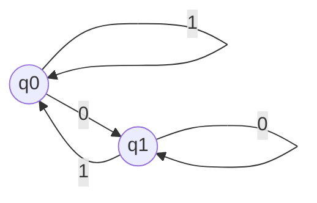

# Formal Languages and Automata

本篇是 *UIUC CS 374 Introduction to Algorithms and Models of Computation* 的学习笔记，其中包括了正则语言、有限自动机、上下文无关语言和图灵机等知识。参考书籍是 *An Introduction to Formal Languages and Automata, 6th Deition: Peter Linz*。

[TOC]

## 计算理论简介

**计算理论（Theory of Computation）**，包括 **自动机理论（Automata Theory）**、**形式语言（Formal Language）**、**可计算性（Computability）** 和 **复杂度（Complexity）** 这些计算机的基础理论。我们可以认为这些理论决定了计算机理论能够做到的事情，以及现实情况下能完成的事情（由算法的复杂度决定）。本篇笔记将着重学习复杂度以外的理论，复杂度将放到算法笔记中具体讨论。下面是这几个理论的简单介绍：

- 自动机理论：**自动机（Automaton）** 是一个虚构的机器，其接受输入，可能进行一些存储，并输出结果。
- 形式语言：由一个字符集和构建规则组成，形成一个所有有效字符组合的集合。所有的编程语言（甚至自然语言）都可以通过一个相对应的形式语言描述。
- 算法：是一些可解决问题的解决方法。本篇笔记并不详细讨论算法的设计（请参见算法笔记），但会讨论问题的可计算性等性质。

计算理论设计数学的构建和严格证明，因此我们有必要为大家复习一些基本的数学概念，这些概念理应在计算机科学必修的基础数学课（如离散数学）中学习过。

### 数学基础

#### 集合

**集合（Set）** 是一系列元素的组合，如果某个元素 $a$ 在集合 $S$ 中，我们记作 $a \in S$。集合可以通过大括号罗列所有元素来定义，也可以通过谓词来定义：
$$
S_1 = \{0, 1, 2 \} \qquad S_2 = \{i \in \mathbb{Z} \mid i \text{ 是偶数} \}
$$
集合的大小用绝对值符号表示：
$$
|S| = S \text{ 中元素的数量}
$$
一个集合可能是另一个集合的 **子集（Subset）**，子集中的所有元素都是 **超集（Superset）** 的元素：
$$
\begin{equation*}
	S_1 \subseteq S_2 \Leftrightarrow \forall s \in S_1 \implies s \in S_2
\end{equation*}
$$
一个集合的所有子集组成的集合被称为该集合的 **幂集（Power Set）**，这是一个集合的集合：
$$
\begin{equation*}
	2^{S} = \{S' \subseteq S\}
\end{equation*}
$$
记没有任何元素的集合，即 **空集（Empty Set）** 为 $\emptyset$。空集是所有集合的子集，它的幂集是 $\{\emptyset\}$（注意这不是空集！）。事实上不难发现幂集元素数量和原集合元素数量的关系：
$$
\left|2^S\right| = 2^{|S|}
$$
集合之间常见的操作有 **并集（Union）**、**交集（Intersection）** 和 **差集（Difference）**，分别定义为：
$$
\begin{align*}
	S_1 \cup S_2 = \{x \mid x \in S_1 \text{ 或 } x \in S_2 \} \\
	S_1 \cap S_2 = \{x \mid x \in S_1 \text{ 且 } x \in S_2 \} \\
	S_1 \backslash S_2  = \{x \mid x \in S_1 \text{ 且 } x \notin S_2 \}
\end{align*}
$$
如果两个集合的交集是空集，我们称它们是 **不相交（Disjoint）** 的。给定一个 **全集（Universal Set）** 的情况下，定义集合的 **补集（Complement）** 为：
$$
\overline{S} = \{x \mid x \in U \text{ 且 } x \notin S\}
$$
一个重要的运算性质是 **迪摩根定律（DeMorgan's Law）**：
$$
\begin{equation*}
	\overline{S_1 \cup S_2} = \overline{S}_1 \cap \overline{S}_2 \qquad
	\overline{S_1 \cap S_2} = \overline{S}_1 \cup \overline{S}_2
\end{equation*}
$$
两个集合的 **笛卡尔积（Cartesian Product）** 定义为：
$$
\begin{equation*}
	S_1 \times S_2 = \{(x, y) \mid x \in S_1 \text{ 且 } y \in S_2 \}
\end{equation*}
$$
我们不难验证，无论是并、交，还是笛卡尔积都满足结合律和交换律。

最后，如果一个集合可以表示为一系列非空不相交集的并，即：

- $S = \bigcup_i^n S_i$。
- $S_i \cap S_j = \empty$，其中 $i \ne j$。
- $S_i \ne \empty$。

则我们称 $S_1, ..., S_n$ 是 $S$ 的一个 **分划（Partition）**。

#### 函数和关系

### 计算理论基础

本节中我们将简单介绍计算理论中频繁出现的三个概念，**语言**、**语法** 和 **自动机**。

#### 语言

设一个有限非空的 **字母表（Alphabet）** $\Sigma$，我们可以定义 **字符串（String）** 为字母表中字符的序列。比如对于 $\Sigma = \{a, b\}$，$abaab$ 和 $aaa$ 都是定义在 $\Sigma$ 上的字符串。习惯上，我们用 $a, b, c, ...$ 来表示字母表中的字符，而用 $u, v, w, ...$ 来表示这些字符组成的字符串。比如 $w = abaab$ 就描述了一个由 $abaab$ 定义的字符串 $w$。

两个字符串可以通过拼接运算符 $\bullet$ 进行 **拼接（Concatenation）**。设 $w = a_1...a_n$ 而 $x = b_1...b_m$，则：
$$
w \bullet x = a_1...a_nb_1...b_m
$$
不难发现拼接运算满足结合律，但不满足交换律。出于简略，我们总是会省略拼接运算符，即 $wx \equiv w \bullet x$。除了上面的定义方式，我们还可以用递归的方式定义拼接运算：
$$
w \bullet x = \begin{cases}
	x & \text{若 $w = \epsilon$} \\
	a(u \bullet x) & \text{若 $w = au$}
\end{cases}
$$
这种方式在数学上更加方便，后续的一些定理更易于通过数学归纳法证明。

字符串的 **逆（Reverse）** 为其序列的逆序，记作 $w^R$：
$$
w^R = a_n...a_1
$$
其等价的递归定义是：
$$
w^R = \begin{cases}
	\epsilon & \text{若 $w = \epsilon$} \\
	ax^R & \text{若 $w = xa$}
\end{cases}
$$

字符串的 **长度（Length）** 记作 $|w|$，其表示字符串中字符的个数。其递归的定义方式是：
$$
|w| = \begin{cases}
	0 & \text{若 $w = \epsilon$} \\
	1 + |x| & \text{若 $w = ax$}
\end{cases}
$$
长度为零的字符串，即 **空字符串（Empty String）** 用记号 $\epsilon$ 表示，其满足：
$$
|\epsilon| = 0 \qquad \epsilon w = w\epsilon = w
$$
有关字符串长度有个显然的结论：$|wx| = |w| + |x|$，这可以通过数学归纳法证明。一个字符串 $w$ 的 **子字符串（Substring）** $x$ 满足下面的要求：
$$
w = uxv
$$
上式中 $u = \epsilon$ 时我们称 $x$ 是 $w$ 的 **前缀（Prefix）**；若 $v = \epsilon$ 则称 $x$ 是 $w$ 的 **后缀（Suffix）**。作为举例，字符串 $aba$ 的子字符串组成了集合 $\{\epsilon, a, ab, ba, aba\}$，其中 $\{\epsilon, a, ab, aba\}$ 是前缀的集合，$\{\epsilon, a, ba, aba\}$ 是后缀的集合。

字符串重复 $n$ 次的结果即为 $w^n$。特别地，定义 $w^0 = \epsilon$。我们可以称其为字符串的 **幂（Power）**。

记 $\Sigma^*$ 为所有有限长的 $\Sigma$ 上字符串组成的集合，一个 **形式语言（Formal Language）**，或 **语言（Language）** 定义为 $\Sigma^*$ 的某个子集 $L$，即 $L \subseteq \Sigma^*$。由于语言是一个集合，我们用大写字母（通常是 $L$）来表示一个语言。作为例子，下面列出的集合都是语言（我会给出其字符集）：

- 空集 $\emptyset$。其字符集可以是任意非空有限集。
- $\{\epsilon\}$。其字符集可以是任意非空有限集。
- $\Sigma$。即字符集本身。
- $\{0, 1\}^*$，其字符集是 $\{0, 1\}$ 的超集。这个语言包含了所有 $0$ 和 $1$ 组成的有限序列。
- $\{康, 熙, 字, 典\}$。其字符集是其本身的超集。这个语言只包含了四个字符串。
- $\{x \mid x \in \text{康熙字典全文的所有条目}\}$。其字符集是康熙字典中的所有字符的集合的超集。
- $\{x \mid x \in \text{所有能打印出 Hello World 的 C++ 程序}\}$。其字符集可以是 **UTF-8**。

语言继承了集合的所有运算，同时我们额外定义一些运算。两个语言的 **拼接（Concatenation）** 定义如下：
$$
L_1L_2 = \{w_1w_2 \mid w_1 \in L_1, w_2 \in L_2\}
$$
和字符串类似地，记语言和自己拼接 $n$ 次为 $L^n$（$n$ 次幂），并特别定义 $L^0 = \{\epsilon\}$。同时，定义语言的 **Kleene 闭包（Kleene Closure）** 为其所有有限幂的并集：
$$
L^* = \bigcup_{i = 0} L^i
$$
这个记法和我们此前就介绍过的 $\Sigma^*$ 是一致的。定义语言的 **正闭包（Positive Closure）** 为除去空字符串的 Kleene 闭包：
$$
L^+ = \bigcup_{i = 1}L^i = L^*\backslash L^0
$$
语言的逆是其中所有字符串的逆组成的集合，即：
$$
\begin{equation*}
	L^R = \{w^R \mid w \in L\}
\end{equation*}
$$

#### 语法

单凭语言的概念，我们还不能构建出任意的语言系统，因为集合的表达能力非常有限。例如，$L = \{a^nb^n \mid n \in \mathbb{N}\}$ 描述了例如 $ab$、$aaabbb$ 这样的字符串，但如果我们希望描述例如 $L^*$，就很难通过集合的方式来定义了（Kleene 闭包的定义式确实是一种方式，但是它不是一个谓词形式的集合定义）。

**语法（Grammar）** 定义为一个四元组：
$$
G = (V, T, S, P)
$$
其中的 $V$、$T$、$S$、$P$ 是四个集合，定义如下：

- $V$ 称为 **变量（Variable）**，是一个字符组成的有限集。
- $T$ 称为 **终结符（Terminal）**，是一个有限集，其包含了语言中所有可能出现的字符，也可以记为 $\Sigma$。$T \cap V = \emptyset$，否则表达上会有歧义。
- $S \in V$ 称为 **起始变量（Start Variable）**，是一个字符，其代表了语言的整体结构。
- $P$ 称为 **生成规则（Production Rule）**，是一个有限集，其描述了语法的结构。

语法中最核心的成分是生成规则，即 $P$。里面的每一个元素都定义了如何从一个语法转化为另一个语法，设其记为 $\alpha \to \beta$ 的形式，其中 $\alpha \in (V \cup T)^+$，$\beta \in (V \cup T)^*$。如果字符串可以表示成 $w = u\alpha v$ 的形式，我们就能通过这个语法规则将其转化为 $x = u\beta v$。记作 $w \Rightarrow x$，即 $w$ **派生（Derive）** 出 $x$。根据 $P$ 中的诸多规则，我们可以从某个字符串 $w_1$ 得到许多如下的派生链：
$$
w_1 \Rightarrow w_2 \Rightarrow \dots \Rightarrow w_n
$$
一个语法 $G$ 中起始变量 $S$ 中所有字符串通过生成规则 $P$ 中的规则进行有限次派生得到的语言称为 $G$ 生成的语言，记为 $L(G)$。正式定义为：
$$
\begin{equation*}
	L(G) = \{w \in T \mid S \overset{*}{\Rightarrow} w \}
\end{equation*}
$$
作为例子，考虑语法 $G = (\{S\}, \{a, b\}, S, P)$，其中 $P$ 定义如下：
$$
\begin{align*}
	S &\to aSb \\
	S &\to \epsilon
\end{align*}
$$
我们可以找一些可以通过该语法派生得到的字符串。比如 $aabb$：
$$
S \Rightarrow aSb \Rightarrow aaSbb \Rightarrow aabb
$$
因此有 $S \overset{*}{\Rightarrow} aabb$。然后让我们尝试找到 $L(G)$ 的通俗意义。观察 $P$ 后不难发现 $S$ 派生得到的字符串中 $a$ 和 $b$ 的数量相同且 $a$ 在其前半部分，$b$ 在其后半部分。因此我们可以猜测：
$$
L(G) = \{a^nb^n \mid n \in \mathbb{N}\}
$$
为了证明这一点，我们首先可以展示所有形如 $a^nb^n$ 的字符串都可以通过 $S$ 派生得到。这可以通过数学归纳法轻易证明：
$$
S \Rightarrow aSb \Rightarrow \dots \Rightarrow a^{n}Sb^n \Rightarrow a^nb^n
$$
反过来，我们应证明所有从 $S$ 派生得到的字符串总是满足 $a^nSb^n$ 的形式。为了最终得到一个只由 $a$、$b$ 组成的字符串，一定会在有限的地方使用规则 $S \to \epsilon$，此时就得到了 $a^nb^n$。因此照应本节开头，我们找到了描述 $\{a^nb^n \mid n \in \mathbb{N}\}$ 的方式。

值得一提的是，一个语言可以由多种语法生成。如果两个语法 $G_1$ 和 $G_2$ 满足 $L(G_1) = L(G_2)$，我们就称它们是 **等价的（Equivalent）**。比如下面的派生规则：
$$
\begin{align*}
	S \to aAb \mid \epsilon \\
	A \to aAb \mid \epsilon
\end{align*}
$$
和我们此前给出的 $S \to aSb \mid \epsilon$ 可以生成同样的语言 $\{a^nb^n \mid n \in \mathbb{N}\}$。

#### 自动机

自动机是对计算机的一种抽象。我们可以想像一个控制单元逐字符地接收一条纸带上的输入，可能还有一个存储单元来记录字符信息（其大小没有上限）。控制单元任意时刻都拥有一个 **内部状态（Internal State）**，其可能的内部状态数量是有限的。每当从纸带上读取一个字符后，控制单元会根据当前状态和存储单元中的信息决定输出什么字符，并调整自身的状态；这个状态的变化规律可以通过一个 **转换函数（Transition Function）** 来描述。就这样，自动机不断接收输入，直到纸带上没有更多字符，或自动机达到预定的 **接受状态（Accepted State）** 为止。注意，纸带可能是无限长的。

上面这种自动机模型可以适配本篇笔记中将要介绍的所有自动机。自动机可以根据转换函数的性质分为两种：返回一种状态的转换函数用于定义 **确定性自动机（Deterministic Automaton）**；如果转换函数返回一集状态，也即相同设定下自动机可能进入多种新的状态之一，我们称该自动机为 **非确定性自动机（Non-Deterministic Automaton）**。

根据自动机能够输出的信息，我们也可以从另一个角度划分不同的自动机：只能返回真值的自动机被称为 **接受器（Accepter）**，而能够返回字符串的自动机被称为 **变换器（Transducer）**。

## 自动机

本章我们将学习一个简单的自动机，**有限自动机（Finite Automaton）**，其内部状态有限且不存在存储单元，因此我们甚至可以枚举其所有合法状态。根据其确定性，我们将其分为两类，**确定性有限自动机（Deterministic Finite Automaton, DFA）** 或 **确定性有限接受器（Deterministic Finite Accepter）**，以及 **非确定性有限自动机（Non-Deterministic Finite Automaton）**。

### 确定性有限自动机

确定性有限自动机是一个五元组：
$$
M = (Q, \Sigma, \delta, q_0, A)
$$
其中：

- $Q = \{q_0, q_1,\dots,q_k\}$ 是 DFA 的所有内部状态的集合。
- $\Sigma$ 是 DFA 可以接受的字符集。
- $\delta$ 是 DFA 的转换函数，可以记为 $\delta : Q \times \Sigma \to Q$。
- $q_0 \in Q$ 是 DFA 的初始状态。
- $A \subseteq Q$ 是 DFA 的接受状态。

对于一个字符串 $w = w_1...w_n \in \Sigma^*$，其在 DFA 中的接受路径如下：
$$
q_0 \overset{w_1}{\longrightarrow} q_1' = \delta(q_0, w_1) \overset{w_2}{\longrightarrow} \dots \overset{w_n}{\longrightarrow} q_n' = \delta(q_{n-1}', w_n) \in A
$$
（这里并不要求 $q_i \ne q_j$，$i, j \in 0, 1, \dots, n$）此时我们称这个 DFA **接受（Accept）** 了字符串 $w$；如果最后的状态 $q_n' \notin A$，我们称这个 DFA **拒绝（Reject）** 了 $w$。DFA 的转换函数可以通过有向图来表示，其中每一个结点表示一个内部状态，每条边代表一个转换方式。下面是一个图例：

这个 DFA 的字符集是 $\{0, 1\}$，并有两个状态，$q_0$ 和 $q_1$，其转换函数为：
$$
\delta(q_0, 0) = q_1 \qquad \delta(q_0, 1) = q_0 \qquad \delta(q_1, 0) = q_1, \qquad \delta(q_1, 1) = q_0
$$
其初始状态为 $q_0$，可接受状态集 $A = \{q_1\}$。DFA 能接受的字符串集形成了一个语言：
$$
L(M) = \{w \in \Sigma^* \mid \delta^*(q_0, w) \in A\}
$$
其中 $\delta^*$ 是一个辅助的转换函数，其通过一个字符串将 DFA 从一个状态转换为另一个状态，正式定义为：
$$
\begin{align*}
	\delta^*(q, w) = \begin{cases}
		q & \text{若 $w = \epsilon$} \\
		\delta^*(\delta(q, a), x) & \text{若 $w = ax$}
	\end{cases}
\end{align*}
$$
以上面画出来的 DFA 为例，我们不难发现接受的语言都是以 $0$ 结尾的字符串，即：
$$
L(M)  = \{w0 \mid w \in \Sigma^*\}
$$
可以举例如 $1101010$、$111000$、$00110$ 为例来验证。

