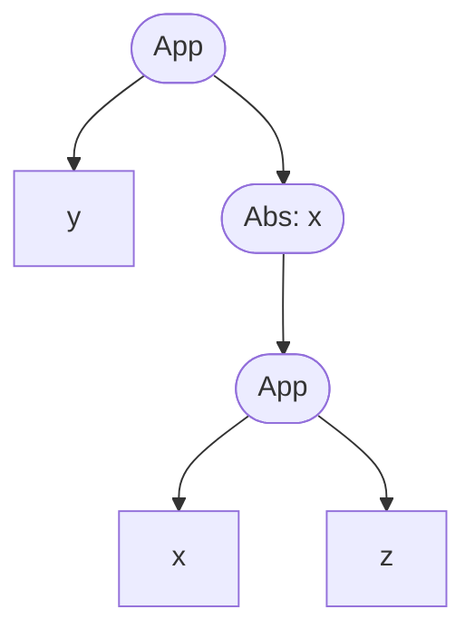

# Type Theory

本篇是 *Type Theory And Formal Proof: An Introduction, Rob Nederpelt, Herman Geuvers* 的阅读笔记。笔记中会包含一些计算机语言相关的延伸，用于更好理解类型论在计算机科学中的应用。

[TOC]

$$
\newcommand{\_}[1]{\lambda #1 .\ }
\newcommand{\bto}{\twoheadrightarrow_\beta}
$$

## 无类型 $\lambda$ 演算

本章暂时不引入类型的概念，而是先介绍一个重要的系统，**$\lambda$ 演算（Lambda Calculus）**。它描述了函数的基本性质和构建规则。通过 $\lambda$ 演算描述的函数可以做到所有计算机能够完成的事情（即图灵完备），这也是函数式编程语言建立的根本。

### 函数和 $\lambda$ 项

我们已经熟悉了诸如下面的函数形式：
$$
f(x) = x^2 + 1
$$
对于变量 $x$ 任意的取值，我们都能得到一个唯一的结果：比如通过 $3$ 可以得到 $10$。注意到这里的 $x$ 和我们平时见到的 $1$, $a$ 等常数不一样，它需要一个“绑定”才能让函数得到具体的输出。为了显示出其特殊性，我们此后会采用下面的记法：
$$
\begin{equation*}
	\_{x} x^2 + 1
\end{equation*}
$$
对于多元函数，比如 $f(x, y) = x^2y$，可以写成 $\_{(x, y)} x^2y$ 的形式（我很快会介绍一个更通用的形式），此时需要绑定到两个常数才能得到具体的值：比如通过 $1, 2$ 得到 $2$。

现在让我们给出 $\lambda$ 演算的基本构造。存在两个构造操作：抽象和应用，定义如下：

- **抽象（Abstraction）**：一个表达式 $M$ 和变量 $x$ 可以组成结构 $\_{x} M$，我们称其为 $x$ 在 $M$ 上的抽象。
- **应用（Application）**：两个表达式 $M$ 和 $N$ 可以组成结构 $M\ N$，我们称其为 $M$ 对 $N$ 的应用。

如果从通俗的方式理解这两个构造，前一个是将表达式抽象为函数（将表达式中的某个量设为变量），而后一个是设置函数变量的绑定对象。下面是一些例子：

- $y$ 对 $\_{x} x - y$ 的抽象是 $\_{y}\_{x} x - y$，注意到此时 $y$ 也变成变量了。
- $x$ 对 $5$ 的抽象是 $\_{x} 5$。注意到这是一个常值函数，但其和常数 $5$ 是不同的结构。
- $\_{x} x^2 + 1$ 对 $3$ 的应用是 $(\_{x} x^2 + 1)\ 3$ 。注意此处并没有对这个表达式进行求值，因此不能直接写出结果 $10$。
- $\_{x} x$ 对 $\_{y} y$ 的应用是 $(\_{x} x)\ (\_{y} y)$。其求值结果显然是 $(\_y y)$，但应用构造不包括这个求值过程。后面我们会看到，$(\_x x)\ (\_y y)$ 和 $(\_y y)$ 是不同两个结构。

$\lambda$ 演算中的括号只表示结合性，不包含在表达式定义当中，这和算术中括号的作用是一致的。事实上，如果将抽象和应用视为运算，前者是右结合的，后者是左结合的，且应用的优先级大于抽象。可以通过下面的例子熟悉：

- $\_x\_y x + y$ 等同于 $\_x (\_y x + y)$。
- $x\ y\ z$ 等同于 $(x\ y)\ z$。
- $\_x x\ y$ 等同于 $\_x (x\ y)$。

因此我会在不容易引起迷惑的情况下省略大多数的括号（防止像 **Lisp** 那样满页的括号）。

当某个变量对函数进行抽象时，我们会得到一个多元函数，比如 $\_x\_y x + y$。此时我们可以将其简记为：
$$
\begin{equation*}
	\_{x\ y} x + y
\end{equation*}
$$
注意到它和 $\_{(x, y)} x + y$ 之间的微妙区别：前者可以只接受一个参数，让 $x$ 变成确定的数，此时函数返回了另一个函数。举例来说，如果令 $x = 1$，则上面的函数会返回：
$$
\_{y} 1 + y
$$
此时再次输入一个参数，就能得到确定的数值；相比之下，后者必须接受正好两个参数以得到确定的数值。你或许认为这并没有什么意义，但这个被称为 **柯里化（Currying）** 的形式在许多函数式编程语言中都大放光彩。本篇笔记并不是计算机语言课，所以不作展开了。

通过 $\lambda$ 演算的构造方法，我们可以得到相对复杂的表达式，比如：
$$
(\_{f} (\_{x\ y} x^2 + f\ z\ y))\ (\_{x}\_{y} x - y^3)
$$
我们需要解析这样的表达式的结构。定义 $\lambda$ 演算中的表达式为 **$\lambda$ 项（Lambda Term）**，如果设所有 **变量（Variable）** 的集合为 $V = \{x, y, z, \dots\}$，那么 $\lambda$ 项集 $\Lambda$ 可以通过下面的递归定义得到：

- 若 $u \in V$，则 $u \in \Lambda$。即所有变量本身也是 $\lambda$ 项。
- 若 $u \in V$ 且 $M \in \Lambda$，则 $(\_{u} M) \in \Lambda$。即变量对 $\lambda$ 项的抽象是封闭的。
- 若 $M, N \in \Lambda$，则 $(M\ N) \in \Lambda$。即 $\lambda$ 项间的应用是封闭的。

熟悉形式语言的同学可以通过下面的语法更加清晰地理解 $\Lambda$ 的规则（此时 $\lambda$ 项为所有满足下面规则的字符串，而 $\Lambda$ 是这些字符串形成的语言）：
$$
\Lambda = V \mid \_{V} \Lambda \mid \Lambda\ \Lambda
$$
作为例子，下面的表达式都是 $\lambda$ 项：

- $x$、$y$、 $z$。
- $\_{x} x^2 + 1$、$\_{x\ y} y$。
- $x\ x$、$(x\ (y\ z)$。

相反，下面的表达式不是 $\lambda$ 项。可以看到，它们无法通过抽象和应用构造出来：

- $\lambda$、$\lambda x^2$、$y + \_{2} u$。

$\lambda$ 项之间可以比较相等关系（通过 $\equiv$ 符号表示），$M \equiv N$ 当且仅当 $M$ 的结构与 $N$ 的结构以及变量的使用完全一致。作为例子，$(x\ y) \equiv (x\ y)$ 但 $(x\ y) \not\equiv (x\ z)$，以及 $\_{x} x^2 \not\equiv \_{y} y^2$。一种简单的理解方式就是表示它们的字符串相等。定义 $\lambda$ 项的 **子项（Subterm）** 为其同为 $\lambda$ 项的子字符串。记 $\lambda$ 项的子项集（设为多重集，即允许存在多个相等的元素）符号为 $\text{Sub}$，则下面的递归定义给出了子项的特征：

- $\text{Sub}(x) = \{x\}$，其中 $x \in V$。
- $\text{Sub}(\_{x} M) = \text{Sub}(M) \cup \{\_{x} M\}$
- $\text{Sub}(M\ N) = \text{Sub}(M) \cup \text{Sub}(N) \cup \{M\ N\}$，其中 $M, N \in \Lambda$。

因此，$M$ 的子项也可以定义为 $\text{Sub}(M)$ 的元素。下面是一些子项的例子：

- $x$ 是 $\_{x} x + 1$ 的子项。
- $(\_{x} (x\ x))\ (x\ x)$ 的子项有 $x$（第一个 $x$）、$x$（第二个 $x$）、$x$（第三个 $x$）、$x$（第四个 $x$）、$x\ x$（第一个 $x\ x$、$x\ x$（第二个 $x\ x$）、$\_{x} (x\ x)$，以及该 $\lambda$ 项本身 $(\_{x} (x\ x))\ (x\ x)$。

如果用树状图（语法树）来表示一个 $\lambda$ 项，其子项会更加清晰。以 $y\ (\_{x} (x\ z))$ 为例：

这里的方形结点都是变量，而圆形结点 `App` 代表应用，`Abs` 代表抽象。这个 $\lambda$ 项的子项就是其任意的子树。

有关 $\lambda$ 项的组成，还有最后一个漏洞没有填补上，那就是“未经抽象”的变量。比如在表达式 $\_x x + y$ 中，$y$ 没有在任何地方“声明”，我们称这样的变量为 **自由变量（Free Variable）**，与之相对的例如 $x$ 这样的变量称为 **约束变量（Bound Variable）**。记 $\lambda$ 项的自由变量集符号为 $FV$，则其递归定义如下：

- $FV(x) = \{x\}$。
- $FV(\_{x} M) = FV(M) \backslash\{x\}$。
- $FV(M\ N) = FV(M) \cup FV(N)$。

敏锐的同学可能会发现其中的一个“漏洞”：应用结构的自由变量集定义为其两个部分的自由变量集之并，但如果在其中一个里面某些变量（比如 $x$）是自由变量，在另一个里面却不是怎么办？比如 $(\_x xy)\ (\_y xy)$ 中，按照上面的定义 $x$、$y$ 都是自由变量。事实上这正是我们想要的结果。只要一个变量 $x$ 在 $\lambda$ 项的 *某处* 不受抽象的约束，它就是自由变量（效果体现为“外部”定义的变量会影响该 $\lambda$ 项的结果）。当然，如果细究 $x$ 在某个地方是否为自由变量还是约束变量，就得看所有包含此处 $x$ 的子项中，$x$ 是否都出现为自由变量了；但凡有一个包含此处 $x$ 的子项的自由变量集不包含 $x$，它在这里就是约束变量。还是以上面的 $(\_x xy)\ (\_y xy)$ 为例，第一个 $x$ 和第二个 $y$ 都是约束的，但第二个 $x$ 和第一个 $y$ 是自由的。

最后，让我们给出 $\lambda$ 项的一个重要的子项集，**封闭 $\lambda$ 项（Closed Lambda Term）**，也成为 **结合子（Combinator）**：如果 $\lambda$ 项 $M$ 的自由变量集为空，我们称其为 **封闭的（Closed）**。所有封闭 $\lambda$ 项的集合记为 $\Lambda^0$。这些表达式不受外部设置变化而改变性质。举个例子，$\_{xyz} xy^2$ 是封闭的，而 $\_x xy^2$ 不是封闭的；后者会根据自由变量 $y$ 的值改变可能的输出。

### $\lambda$ 项之间的转换

本节中我们将探索 $\lambda$ 之间的等价关系。此前我们介绍的相等关系 $\equiv$ 非常严格，$M \equiv N$ 当且仅当两者完全一致。我们显然需要一些更加“灵活”的等价关系。

#### $\alpha$ 转换

一个显然的相等关系是“同构”。比如 $\_x x$ 和 $\_y y$ 除了变量的名称不同，拥有完全一致的结构。为了表示这种关系，定义 **$\alpha$ 转换（Alpha Conversion）** 为在 $\_x M$ 里将 $M$ 中所有的自由变量 $x$ 转换为另一个（不和现有自由变量重复的）变量 $y$，记为 $M^{x\to y}$。此时称 $\_x M$ 被重命名为 $\_y M^{x\to y}$。这个关系记为 $=_\alpha$，即 $\_x M =_\alpha \_y M^{x\to y}$。

关于 $\alpha$ 转换，有一些特殊要求值得细说：

- 原始变量 $x$ 只能在其不受约束的地方转换为目标变量，否则该受约束的地方会脱离原有的绑定。比如 $\_x y\ (\_x x)$ 不能转换为 $\_u y\ (\_x u)$，因为 $y\ (\_x x)$ 中的 $x$ 并不是自由的。
- 转换的目标 $y$ 不能是 $M$ 中已有的自由变量，否则在新的表达式 $\_y M^{x\to y}$ 中 $y$ 就变成了约束变量，和原来的含义就不同了。作为例子，$\_x y$ 不能将 $x$ 转换为 $y$，即得到 $\_y y$，此时显然和原表达式含义不同。
- 转换的目标 $y$ 也不能是 $M$ 中的约束变量，否则它可能会意外地绑定变量。比如 $\_x \_y x$ 不能转换为 $\_y \_y y$。后者中的 $y$ 会受到子项中抽象的绑定影响。

上面提到的三点看起来比较抽象，但实际上在实例中还是很好避免错误的。

$\alpha$ 转换满足下面的一些性质：

- $M =_\alpha M$。自反性。
- 若 $M =_\alpha N$ 则 $N =_\alpha M$。
- 若 $M =_\alpha N$ 且 $N =_\alpha L$，则 $M =_\alpha L$。
- 若 $M =_\alpha N$，则 $M\ L = N\ L$ 且 $L\ M = L\ N$；同时对任意 $x \in V$ 都有 $\_x M = \_x N$。即局部的重命名不影响其它地方的定义。这也被称为 **兼容性（Compatibility）**。

前三条性质证明了这是一个等价关系，因为我们也将其称为 **$\alpha$ 等价（Alpha Equivalence）**。

#### 替代

另一种相等关系是将设置好的参数绑定到变量上，这也是我们传统理解中函数所做的事情。比如 $(\_x x)\ 1$ 是 $\_x x$ 对 $1$ 的应用，我们在定义应用时已经说过，其对应的正是“为函数准备参数”这一行为。因此我们只需将左侧抽象结构中，相对应的变量 $x$ 出现的合适地方替代为 $1$，得到 $1$ 即可。

为了正式地定义这一操作，让我们先做一些铺垫，定义 $\alpha$ 转换的一种更通用形式，即 **替代（Substitution）**。其记号是用方括号包围的绑定声明，如 $[x := 1]$。如果将 $M$ 中的变量 $x$ 替代为 $N$，其结果可以写为 $M[x := N]$。

- $x[x := N] \equiv N$。
- $y[x := N] \equiv y$，若 $y \not\equiv x$。
- $(\_y P)[x := N] \equiv \_z P^{y\to z}[x := N]$，其中 $z \not\in FV(N)$。这里进行了一次 $\alpha$ 转换： $\_z P^{y\to z} =_\alpha \_y P$。之所以进行这个转换，是为了防止 $N$ 中的自由变量 $y$ 被原表达式 $\_y P$ 中的 $y$ 绑定。当然，如果 $x \notin FV(P)$（根本没有可以替换的地方） 或 $y \notin FV(N)$（根本没有会被影响的自由变量），我们可以不进行 $\alpha$ 转换。
- $(P\ Q)[x := N] \equiv (P[x := N])\ (Q[x := N])$。

值得一提的是，和抽象与应用两种基本构造不同，替代所用的记号 $[V := \Lambda]$ 并不属于 $\lambda$ 项的组成部分（$\lambda$ 项可能的所有形式我们都已经在前面小节中介绍了）。因此它是一个 **元记号（Meta-Notation）**，用于简略表示 $\lambda$ 项真实的结构。这颇像编程语言中标识符和其绑定的对象之间的关系。

既然可以替代一个变量，我们当然可以替代多个变量，称其为 **顺序替代（Sequential Substitution）**。它会按照顺序一个个执行替代操作。比如 $M[x := N][y := L]$ 可以理解为 $(M[x := N])[y := L]$。如果将 $[...]$ 看作运算符，它应该是左结合的。

顺序替代的一个显著特征就是其中每一个替代之间不能交换，即通常来讲：
$$
M[x := N][y := L] \not\equiv M[y := L][x := N]
$$
不过我们可以尝试对比左式和右式的区别。左式在进行第一次替代之后，可能会给式子中带来一些 $y \in FV(N)$，其和原有的自由变量 $y \in FV(M)$ 一同参与了第二次替代；右式在一开始就替代了原有的自由变量，随后由 $N$ 补充引入的就没办法替代为 $L$ 了。同时，$L$ 可能会引入 $x \in FV(L)$，导致在第二次替代中出现“多余”的替代。

因此，如果假设 $x \notin FV(L)$，且 $x \not\equiv y$，则下面的等式成立：
$$
M[x := N][y := L] \equiv M[y := L][x := N[y := L]]
$$

#### 一些习惯

我们已经提到过 $\alpha$ 转换关系是一个等价关系，并给出了其兼容性。这里将其一般化并补充替代参与的情形。假设 $M_1 =_\alpha M_2$ 且 $N_1 =_\alpha N_2$，此时有：

- $\_x M_1 =_\alpha \_x M_2$。
- $M_1\ N_1 =_\alpha M_2\ N_2$。
- $M_1[x := N_1] =_\alpha M_2[x := N_2]$。

因此对于 $\alpha$ 等价类中的不同元素，其参与抽象、应用和替代操作时相互之间没有任何差别。因此自此之后，我们将不区分两个 $\alpha$ 等价的 $\lambda$ 项。尽管在等式推导中我们可能还会标记出 $\alpha$ 等价，但不作特别说明时，$\equiv$ 也代表 $\alpha$ 等价。

最后介绍一个命名规范，**Barendregt 习惯（Barendregt Convention）**，其要求 $\lambda$ 项中所有的变量名都有唯一的意义。约束变量和自由变量名称不得重复，且所有约束变量的名称只被一个抽象绑定。举例来说，$x\ \_x x$ 就不符合这个规范，因为第一个 $x$ 是自由变量，而第二个是约束变量。同样地，$(\_x x)\ (\_x\ x)$ 也不符合这个规范，因为 $x$ 被绑定在两个不同的抽象中。同时，遵循书中的要求，我们将 Barendregt 习惯扩张到替代操作中，要求方括号中出现的 $\lambda$ 项也满足这个约束。因此 $x[x := (\_x x)]$ 不满足规范。

上面三个例子经过恰当修改后，变为下面等价的规范形式：

- $x\ \_y y$。
- $(\_x x)\ (\_y y)$。
- $x[x := (\_y y)]$。

自此之后，我们都将遵守这个规范。

#### $\beta$ 简化和 $\beta$ 转换

我们已经学习了替代，只需再前进一步就可以定义 **$\beta$ 简化（Beta Reduction）**。首先是单步的 $\beta$ 简化，其记号为 $\to_\beta$：

- $(\_x M)\ N \to_\beta M[x := N]$。
- 若 $M \to_\beta N$，则对于任意 $x \in V$ 都有 $\_x M \to_\beta \_x N$，同时 $M\ L \to_\beta N\ L$ 且 $L\ M \to_\beta L\ N$。这也即是替代的兼容性。

为了方便今后的表述，我们称 $(\_x M)\ N$ 结构为 **可简化表达式（Reducible Expression, Redex）**，而其经过 $\beta$ 简化后得到的 $M[x := N]$ 称为 **缩减表达式（Contractum）**。

下面是一些单步 $\beta$ 简化的例子：

- $(\_x x\ (x\ y))\ N \to_\beta N\ (N\ y)$。
- $(\_x x\ x)\ (\_y y\ y) \to_\beta (\_y y\ y)$。
- $(\_f f\ x)\ (\_y y^2) \to_\beta (\_y y^2)\ x \to_\beta x^2$。

既然有单步 $\beta$ 简化，也就自然有多步的简化，即进行多次单步操作。实际上，我们将零至多步的 $\beta$ 简化统称为 $\beta$ 简化，其记号为 $\bto$。$M \bto N$ 当且仅当存在 $n \ge 0$，使得下面的 $\beta$ 简化链成立：
$$
M \equiv M_0 \to_\beta M_1 \to_\beta \dots \to_\beta M_n \equiv N
$$
$\beta$ 简化有下面的性质：

- 若 $M \to_\beta N$，则 $M \bto N$。
- $M \bto M$。自反性。
- 若 $M \bto N$ 且 $N \bto L$，则 $M \bto L$。传递性。

我们看到，$\beta$ 简化并不满足对称性，这导致它不能定义一个等价关系。因此我们需要扩展其定义，引入 **$\beta$ 转换（Beta Conversion）** 的概念，其记号为 $=_\beta$。$M =_\beta N$ 当且仅当存在 $n \ge 0$，使得下面的不定向 $\beta$ 简化链成立：
$$
M \equiv M_0 \xleftrightarrow{?}_\beta M_1 \xleftrightarrow{?}_\beta \dots \xleftrightarrow{?}_\beta M_n \equiv N
$$
其中的 $\xleftrightarrow{?}_\beta$ 表明箭头可能是 $\to_\beta$ 或 $\leftarrow_\beta$ 中的一个。举例来说，$(\_y y\ v)\ z \to_\beta z\ v$ 且 $(\_x z\ x)\ v \to_\beta z\ v$，因此有 $(\_y y\ v)\ z =_\beta (\_x z\ x)\ v$，但两者之间没有 $\beta$ 简化关系。

$\beta$ 转换有下面的性质：

- 若 $M \bto N$ 或 $N \bto M$，则 $M =_\beta N$。
- $M =_\beta M$。自反性。
- 若 $M =_\beta N$，则 $N =_\beta M$。对称性。
- 若 $M =_\beta N$ 且 $N =_\beta L$，则 $M =_\beta L$。传递性。

因此和 $\alpha$ 一样地，$\beta$ 转换也是等价关系。

### 正规形式

正如我们上一节中看到的，$\beta$ 转化模仿的是函数的求值。一个 $\lambda$ 项经过 $\beta$ 转化得到的形式，应该比原来的表达式更“精简”。不过精简的定义颇为微妙。比如二次多项式 $ax^2 + bx + c$，它可以通过 $\beta$ 转化变为：
$$
ax^2 + bx + c =_\beta a\left(x + \frac{b}{2a}\right)^2 - \frac{b^2}{4a} + c
$$
（如果你不能理解为什么这也是 $\beta$ 转化，试着将加减乘除想象成二元函数对两个数的应用，比如加法 $a + b$ 就是 $(\_{xy} x + y)\ a\ b$。）虽然左式从通常意义上更加简单，但右式可以用于计算二次函数的极值，更加有用。本节将讨论什么样的结果才是 $\beta$ 转化想要的。

定义 $M$ 为 **$\beta$ 正规形式**，若其不包含任何可简化表达式。若 $M$ 可以 $\beta$ 转化为某个 $\beta$ 正规形式 $N$，则其 **可 $\beta$ 正规化的（Beta-Normalizing）**，此时称 $N$ 为 $M$ 的一个 $\beta$ 正规形式。

上面的 $\beta$ 正规形式就是我们进行 $\beta$ 转化的目标，即不包含任何可简化表达式。注意到不是所有 $\lambda$ 项都是可 $\beta$ 正规化的，下面举出一些巧妙的例子（这里我们为了更简单的形式，违背了 Barendregt 习惯）：

- $(\_x x\ x)\ (\_x x\ x)$。该式是可简化的，但无论进行多少次简化，其始终得到自身。
- 令 $\Delta = \_x x\ x\ x$，则 $\Delta\ \Delta =_\beta \Delta\ \Delta\ \Delta =_\beta \Delta\ \Delta\ \Delta\ \Delta =_\beta \dots$。显然其越来越“复杂”了。
- 依然取上例的 $\Delta$，注意到 $(\_x y)\ \Delta$ 是可 $\beta$ 正规化的，因为 $(\_x y)\ \Delta =_\beta y$。
- 对于 $(\_x y)\ ((\_x x\ x)\ (\_x x\ x))$，其简化方向会影响结果：如果像第一个例子一样对后面的 $\lambda$ 子项进行 $\beta$ 转化，会陷入无限循环。但如果将该子项直接作为参数受应用于前面的抽象，就得到了原式的正规形式 $y$。

我们将无穷延伸的 $\beta$ 简化链称为 **无限简化路径（Infinite Reduction Path）**。如果 $M$ 能 $\beta$ 转化到正规形式，称其为 **弱可正规化的（Weakly Normalizing）**；如果其不存在任何无限简化路径，就称其为 **强可正规化的（Strong Normalizing）** 的（注意到所有强可正规化的 $\lambda$ 项同时也是弱可正规化的）。因此上面四个例子中，前两个不可正规化，第三个是强可正规化的，而第四个是弱可正规化的。

下面介绍一个非常重要的定理，其阐述了弱可正规化和正规形式的关系：

> **Church-Rosser 定理；汇流定理**：
>
> 如果对于 $\lambda$ 项 $M$，有 $M \bto N_1$ 且 $M \bto N_2$，则一定存在 $N_3$ 使得 $N_1 \bto N_3$ 且 $N_2 \bto N_3$。

该定理证明了 $\lambda$ 项简化的顺序不影响最终的结果。这看似显然，但证明起来并不简单（原书中未给出证明，但可以参考 Barendgret 的证明）。

下面是一些例子：

- $(1 + 1)\cdot(1 + 1)$ 可以先简化为 $2 \cdot (1 + 1)$，也可以先简化为 $(1 + 1)\cdot 2$，但其最终都可以简化为 $4$。
- $(\_f f\ x)\ ((\_{yz} y + z)\ u)$ 可以先简化为 $(\_f f\ x)\ (\_z u + z)$，也可以先简化为 $(\_{yz} y + z)\ u\ x$，但最终都可以简化为 $u + x$。

从 Church-Rosser 定理可以得到下面的推理：

> 若 $M =_\beta N$，则存在 $L$ 使得 $M \bto L$ 且 $N \bto L$。

我们可以通过数学归纳法证明该推理，此处省略证明（详见原书）。

同时下面的两个引理也可以通过 Church-Rosser 定理简单推出：

- 若 $N$ 是 $M$ 的 $\beta$ 正规形式，则 $M \bto N$。这是 $\beta$ 正规形式定义的逆命题。
- 任一个 $\lambda$ 项拥有至多一个 $\beta$ 正规形式；即若 $N$ 是 $M$ 的 $\beta$ 正规形式，则它是唯一的。

### 不动点定理

无类型 $\lambda$ 演算的一个特别的性质是，对于任意的 $\lambda$ 项中都存在“不动点”。即任意 $\lambda$ 项 $L$ 都存在一个 $\lambda$ 项 $M$ 使得：
$$
L\ M =_\beta M
$$
和 $f(a) = a$ 作对比就能知道上面式子的意思；只有和 $f(x) = x$ 有交点的函数才有不动点。为了证明上面的结论，我们只需找到一个通用的形式即可。这里只需令 $M := (\_x L\ (x\ x))\ (\_x L\ (x\ x))$，此时：
$$
\begin{align*}
	M &= (\_x L\ (x\ x))\ (\_x L\ (x\ x)) \\
	&= L\ ((\_x L\ (x\ x))\ (\_x L\ (x\ x))) \\
	&= L\ M
\end{align*}
$$
因此，我们可以定义一个 $\lambda$ 项，其能够计算出任何 $\lambda$ 项的不动点，定义为：
$$
\begin{equation*}
	Y \equiv \_y (\_x y\ (x\ x))\ (\_x y\ (x\ x))
\end{equation*}
$$
这就是著名的 **Y 结合子（Y Combinator）**（回顾结合子，即封闭 $\lambda$ 项的定义为自由变量集为空的 $\lambda$ 项）。其作用于 $\lambda$ 项 $L$ 的结果是：
$$
\begin{align*}
	Y\ L &\to_\beta (\_x L\ (x\ x))\ (\_x L\ (x\ x)) \\
		&\to_\beta L\ ((\_x L\ (x\ x))\ (\_x L\ (x\ x))) \\
		&=_\beta L\ (Y\ L)
\end{align*}
$$
利用 Y 结合子，下面这样的“方程”始终能找到解：
$$
M =_\beta \dots M \dots
$$
其中等式右侧是一个包含一至多个 $M$ 的 $\lambda$ 项。首先考虑：
$$
L \equiv \_x \dots x \dots \implies L\ M = M
$$
由于我们已经知道了 $M$ 的隐式表达式（就是上面那个 $\beta$ 转化方程），我们只需将等式右侧所有 $M$ 替换为 $x$ 就能构建出 $L$。此时 $M$ 就成为了 $L$ 的一个不动点，其解显然是 $Y\ L$。举个例子，为了找到方程 $M =_\beta x\ M\ x$ 的解，只需令 $L \equiv \_y x\ y\ x$，然后让其受 Y 结合子应用，得到：
$$
\begin{align*}
	Y\ L 
		&\equiv (\_y (\_x y\ (x\ x))\ (\_x y\ (x\ x)))\ (\_y x\ y\ x) \\
		&=_\alpha (\_y (\_z y\ (z\ z))\ (\_z y\ (z\ z)))\ (\_y x\ y\ x) \\
		&\to_\beta (\_z (\_y x\ y\ x)\ (z\ z))\ (\_z (\_y x\ y\ x)\ (z\ z)) \\
		&\to_\beta (\_z x\ (z\ z)\ x)\ (\_z x\ (z\ z)\ x) \\
		&=_\beta M
\end{align*}
$$
等价变换到此为止，因为接下去会陷入无限循环。感兴趣的同学可以验证是否能从 $x\ M\ x$ 变换到 $M$。

### 无类型 $\lambda$ 演算的应用

#### 组合逻辑

我们假设大家此前已经熟悉了逻辑代数的基本知识。本节将使用 $\lambda$ 演算为基础构建等价的概念。首先，我们可以定义布尔代数的基本概念：
$$
true := \_{xy} x \qquad false := \_{xy} y
$$
这里我们为了更好的表示其含义，使用了自然语言 true 和 false。至此其意义似乎还不明朗，让我们先观察下面关于非运算的定义：
$$
not := \_z z\ false\ true
$$
检验 $not\ true =_\beta false$：
$$
\begin{align*}
	not\ true
		&\equiv (\_z z\ false\ true)\ true \\
		&\to_\beta true\ false\ true \\
		&\equiv (\_{xy} x)\ (\_{xy} y)\ (\_{xy} x) \\
		&=_\alpha (\_{xy} x)\ (\_{xz} z)(\_{xy} x) \\
		&\to_\beta (\_y (\_{xz} z))\ (\_{xy} y) \\
		&\to_\beta (\_{xz} z) \\
		&\equiv false
\end{align*}
$$
我们也可以类似地证明 $not\ false =_\beta true$。

接下来引入两个重要的结合子：
$$
K \equiv \_{xy} x \qquad S \equiv \_{xyz} x\ z\ (y\ z)
$$
对于任意的 $\lambda$ 项 $M$、$N$、$L$，下面的性质都满足：

- $S\ K\ K =_\beta \_x x \equiv I$。
- $S\ (\_x M)\ (\_x N) =_\beta \_x M\ N$。
- $S\ (K\ S)\ K =_\beta \_{xyz} x\ (y\ z)$。

#### 自然数

定义下面的符号为 $0$、$1$、$2$……：
$$
\begin{align*}
	zero &:= \_{fx} x \\
	one &:= \_{fx} f\ x \\
	two &:= \_{fx} f\ (f\ x)
\end{align*}
$$
定义加法和乘法如下：

$$
\begin{align*}
	add &:= \_{mnfx} m\ f\ (n\ f\ x) \\
	mult &:= \_{mnfx} m\ (n\ f)\ x
\end{align*}
$$
下面我们将尝试证明 $1 + 2 = 3$ 和 $1 \cdot 2 = 2$：
$$
\begin{align*}
	add\ one\ two
		&\equiv (\_{mnfx} m\ f\ (n\ f\ x))\ (\_{fx} f\ x)\ (\_{fx} f\ (f\ x)) \\
		&\equiv 
\end{align*}
$$

## 简单类型的 $\lambda$ 演算

通过上一章的学习，我们已经认识到 $\lambda$ 演算的强大性。不过由于其“太过自由”，存在下面的一些问题：

- 有一些无意义的 $\lambda$ 项，比如 $x\ x$，$M\ M$ 等。
- 不是所有 $\lambda$ 项都存在正规形式，即一些 $\lambda$ 项在 $\beta$ 简化时会遇到无限循环。对于不是强可正规化的 $\lambda$ 项，我们需要谨慎地选择简化路径才能得到期望的结果。
- 不动点定理。虽然这引出了 Y 结合子这个在理论上很有价值的结果，但现实生活中多数情况下的函数都不存在不动点。因此我们得到的不动点很有可能是无意义的 $\lambda$ 项。

因此，我们有必要以 $\lambda$ 演算为基础，引入 **类型（Type）** 的概念。比如，一个定义在 $\mathbb{N}$ 上的函数，其只能接受例如 $1$、$42$ 这样的输入。这里的 $\mathbb{N}$ 就规定了该函数的输入类型。

### 简单类型

首先记所有类型变量组成的集合为 $\mathbb{V}$，其中的元素由希腊字母表示，如 $\alpha, \beta, \gamma$。接下来引入 **简单类型（Simple Type）** 的概念：如果记所有简单类型组成的集合为 $\mathbb{T}$，则该集合的递归定义为：

- 若 $\alpha \in \mathbb{V}$，则 $\alpha \in \mathbb{T}$。这种类型称为 **基本类型（Basic Type）**。
- 若 $\sigma, \tau \in \mathbb{T}$，则 $\sigma \to \tau \in \mathbb{T}$。这种类型称为 **箭头类型（Arrow Type）**。我们可以将其理解为函数的类型。

以上定义等价的语法为：
$$
\mathbb{T} = \mathbb{V} \mid \mathbb{T} \to \mathbb{T}
$$
一些简单类型的例子如 $\gamma$、$((\alpha \to \beta) \to \gamma) \to (\gamma \to \alpha)$。如果将 $\to$ 视为运算符，规定其为右结合，如 $\alpha \to \beta \to \gamma$ 等价于 $\alpha \to (\beta \to \gamma)$。这个结合性是和应用的左结合性相互印证的：比如 $f : \rho \to \sigma \to \tau$，且令 $x \in \rho$、$y \in \sigma$。不难发现在 $f\ x\ y$ 中优先运算的 $f\ x$ 的类型是 $\sigma \to \tau$，因此 $f$ 可以认为是一个接受 $\rho$ 类型的函数，返回类型为 $\sigma \to \tau$，这也就证明了 $\to$ 的右结合性。

值得注意的是，基本类型中包括例如自然数、列表等类型，我们分别记为 $\mathbb{N}$ 和 $\mathbb{L}$。

为了表示某个 $\lambda$ 项 $M$ 有类型 $\sigma$，可以记为 $M : \sigma$。我们规定一个 $\lambda$ 项只能拥有一个类型，因此如果 $M : \sigma$ 且 $M : \tau$，则有 $\sigma \equiv \tau$。接下来，我们将构建 $\lambda$ 演算中两种构建得到的类型：

- 抽象：若 $M : \tau$，则 $\_x M$ 的类型为 $\sigma \to \tau$（如果限定 $x$ 的类型为 $\sigma$）。
- 应用：若 $M : \sigma \to \tau$，且 $N : \sigma$，则 $M\ N$ 的类型为 $\tau$。

从上面的规则可以看出，抽象对子项的类型没有任何要求，但应用 $M\ N$ 要求 $M$ 的类型和 $N$ 的类型有一个前缀相同：
$$
M : \dots_1 \to \dots_2 \qquad N : \dots_1
$$
此处的 $\dots_1， \dots_2 \in \mathbb{T}$。因此，$M$ 必须是一个函数；同时，$x\ x$ 没有合法的类型，不然设 $x : \sigma \to \tau$，为了让应用成立即有 $x : \sigma$，因而得到 $\sigma \to \tau \equiv \sigma$，这是不可能的。

如果存在 $\sigma \in \mathbb{T}$ 使得 $\lambda$ 项 $M$ 满足 $M : \sigma$，就称 $M$ 是 **有类型的（Typable）**。

### Church 类型和 Curry 类型

一个 $\lambda$ 项中各个变量的类型的决定方式有两种，其一是在每个变量引入的时候就声明其类型，这被称为 **Church 类型** 或 **显式类型（Explicit Typing）**。此时我们可以通过上一节介绍的类型构建方式，根据每个变量的类型判断 $\lambda$ 项中各子项的类型。另一种类型决定方式是“不决定”，也即让类型的判断取决于 $\lambda$ 项的结构，通过猜测的方式得到具体的类型，我们称其为 **Curry 类型** 或 **隐式类型（Implicit Typing）**。

**Church 类型（Typing à la Church）** 的逻辑非常简单，也符合我们对类型推导的理解：如果 $x : \alpha \to \alpha$ 且 $y : (\alpha \to \alpha) \to \beta$，则 $y\ x$ 的类型就是 $\beta$。

**Curry 类型（Typing à la Curry）** 的思考方式会比较独特。对于诸如 $M \equiv (\_{xy} x)\ (z\ u)$ 的 $\lambda$ 项，我们没有任何有关 $x$、$y$、$z$、$u$ 的类型信息，但我们可以通过 $M$ 的结构推测出其类型的结构：

- $\_{xy} x$ 是一个抽象，我们对 $x$ 和 $y$ 没有任何类型要求，可以令 $x : A$、$y : B$。此时有 $(\_{xy} x) : A \to B \to A$。
- $z\ u$ 是一个应用，因此如果令 $u : C$，则 $z : C \to D$。此时有 $(z\ u) : D$。
- 为了让 $(\_{xy} x)$ 能应用于 $(z\ u)$，我们需要找到 $A \to B \to A$ 和 $D$ 的共同前缀，此时最简单的情形就是 $A \equiv D$。

因此，我们可以将上面的变量的类型列为下面的形式：
$$
(*) \quad x : A,\quad y : B, \quad z : C \to A, \quad u : C
$$
其中 $(*)$ 表示这里的类型是 **通用格式（General Scheme）**，$A, B, C$ 都是虚构的类型。我们可以用任意的实际类型来代入，比如令 $x : \alpha \to \beta$，$y : \beta \to \gamma$，$z : \delta \to (\alpha \to \beta), u : \delta$。显然，只要我们使用的类型满足上面列出的通用格式，得到的 $M$ 一定是有类型的。

本篇笔记中将专注于 Curch 类型，因此所有变量的类型都会在引入的地方给出。标注 $\lambda$ 项中变量类型时会用到符号 $\vdash$，比如前面的例子可以写成：
$$
z : \delta \to (\alpha \to \beta), u : \delta \quad \vdash \quad (\_{x : \alpha \to \beta}\_{y : \beta \to \gamma} x)\ (z\ u)
$$
可以看到，$\vdash$ 左侧标注了自由变量的类型，而右侧是附带类型标注的 $\lambda$ 项。值得注意的是，所有约束变量都在引入该变量（即 $\lambda$ 符号后面）时直接注明了类型。

### $\lambda \to$ 演算

#### 类型推导

参考上节最后给出的标注类型的 $\lambda$ 项，我们可以将此前对 $\lambda$ 项的语法定义更新为 $\Lambda_\mathbb{T}$：
$$
\Lambda_\mathbb{T} = V \mid \Lambda_\mathbb{T} \mid \_{V : \mathbb{T}} \Lambda_\mathbb{T}
$$
我们将这个新集合中的元素称为 **预设类型的 $\lambda$ 项（Pre-typed Lambda Terms）**。这个新的演算系统称为 $\lambda \to$，因此也可以将其其中的 $\lambda$ 项称为 $\lambda\to$ 项 。为了方便此后的叙述，定义下列名词：

- **语句（Statement）**：形如 $M : \sigma$ 的式子，其中 $M \in \Lambda_\mathbb{T}$ 且 $\sigma \in \mathbb{T}$，前者在该语句中称为 **对象（Subject）**，而后者称为 **类型（Type）**。
- **声明（Declaration）**：对象为变量的语句。
- **语境（Context）**：一列不同对象的声明。这个列表可以是空的，此时称其为 **空语境（Empty Context）**。
- **判断（Judgment）**：形如 $\Gamma \vdash M : \sigma$ 的式子，其中 $\Gamma$ 是语境、$M : \sigma$ 是语句。

因此作为例子，$x : \alpha \to \beta$ 是声明，$x : \alpha, y : \beta \to \gamma$ 是语境。如果将 $:$ 视作运算符，其拥有最低的优先级，如 $\_{x : \alpha} x\ y : \alpha \to \beta$ 中，$\alpha \to \beta$ 修饰的对象为 $\_{x : \alpha} x\ y$。

下面让我们介绍 **推导系统（Derivation System）**，其用于证明某个判断 $\Gamma \vdash M : \sigma$ 是 **可推导的（Derivable）**，即 $M$ 在 $\Gamma$ 语境下拥有 $\sigma$ 类型。这个系统基于下面的 **前提-结论格式（Premise-Conclusion Format）**：
$$
{\text{premise 1} \quad \text{premise 2} \quad \dots \text{premise n}}\over{\text{conclusion}}
$$
这里的 **前提（Premise）** 是已知的条件，而 **结论（Conclusion）** 是从前提推出的结论。有了这个格式，我们可以将 $\lambda \to$ 中的类型推导规则列出：

- （变量规则）：
  $$
  \Gamma \vdash x : \sigma \quad (x : \sigma  \in \Gamma)
  $$
  

- （抽象规则）：
  $$
  \dfrac{\Gamma, x : \sigma \vdash M : \tau}{\Gamma \vdash \_{x : \sigma} M : \sigma \to \tau}
  $$
  

- （应用规则）：
  $$
  \dfrac{\Gamma \vdash M : \sigma \to \tau \qquad \Gamma \vdash N : \sigma}{\Gamma \vdash M\ N : \tau}
  $$

我们可以用一个例子来学习如何使用上面的推导规则书写正式的类型推导（上节作为举例的 $\lambda$ 项）：
$$
\dfrac{
	z : \delta \to (\alpha \to \beta), u : \delta \ \vdash \ z : \delta \to (\alpha \to \beta) \qquad z : \delta \to (\alpha \to \beta), u : \delta \ \vdash \ u : \delta
}{\dfrac{
	z : \delta \to (\alpha \to \beta), u : \delta \ \vdash \ z\ u : \alpha \to \beta
}{\dfrac{
	z : \delta \to (\alpha \to \beta), u : \delta \ \vdash \ \_{y : \beta \to \gamma} z\ u : (\beta \to \gamma) \to \alpha \to \beta
}{
	\emptyset \ \vdash \ \_{z : \delta \to (\alpha \to \beta)} \_{y : \beta \to \gamma} z\ u : (\delta \to (\alpha \to \beta)) \to (\beta \to \gamma) \to \alpha \to \beta
}}}
$$
可以看到，在最后一个结论中，语境是一个空集，但这并不是必须的。只要 $\vdash$ 右侧预设类型的 $\lambda$ 项中，不存在任何自由变量即可。

在集合论和逻辑中，我们也能找到类似的判断过程，比如：

- 函数抽象：
  $$
  \frac{\text{若 $f : A \to B$ 且 $c \in A$}}{f(c) \in B}
  $$
  

- 函数应用：
  $$
  \frac{\text{若对于任意 $x \in A$ 都有 $f(x) \in B$}}{f : A \to B}
  $$

- 逻辑消除：
  $$
  \frac{A \implies B \qquad A}{B}
  $$

- 逻辑引入：
  $$
  \frac{\text{假设 $A$ 成立的情况下，能够通过逻辑推理得到 $B$}}{A \implies B}
  $$

如果对于 $\lambda\to$ 项 $M$ 存在某个语境 $\Gamma$ 和类型 $\rho$ 构成判断 $\Gamma \vdash M : \rho$，则称其为 **合法的（Legal）**。

最后，值得介绍另一种类型推导的格式：**旗帜记号（Flag Notation）**：
$$
\begin{align*}
	&\fbox{$x : (\alpha \to \beta) \to \gamma$} \\
	&\left|\begin{split}
		&\quad \fbox{$y : \alpha \to \beta$} \\
		&\quad \left|\begin{split}
			&\quad x : (\alpha \to \beta) \to \gamma & \text{（变量规则）} \\
			&\quad y : \alpha \to \beta & \text{（变量规则）} \\
			&\quad x\ y : \gamma & \text{（应用规则）}
		\end{split}\right. \\
		&\quad \_{y : \alpha \to \beta} x\ y : (\alpha \to \beta) \to \gamma & \text{（抽象规则）}
	\end{split}\right. \\
	&\_{x : (\alpha \to \beta) \to \gamma} \_{y : \alpha \to \beta} : ((\alpha \to \beta) \to \gamma) \to (\alpha \to \beta) \to \gamma & \text{（抽象规则）}
\end{align*}
$$

#### 主要问题研究

类型论中有关判断，主要研究的有三种问题：

- **合法类型存在性（Well-Typedness）**：对于某个 $\lambda\to$ 项，决定其是否合法，可以不正式地写成：
  $$
  ? \ \vdash \ \Lambda_\mathbb{T} : \ ?
  $$

- **类型检查（Type Checking）**：对于给定的 $\lambda\to$ 项、语境和类型，某个判断是否成立。即：
  $$
  \Gamma \ \overset{?}{\vdash} \ \Lambda_\mathbb{T} : \mathbb{T}
  $$

- **项寻找（Term Finding）**：对于给定的语境和类型，寻找是否有满足某个判断的 $\lambda\to$ 项：
  $$
  \Gamma \ \vdash \ ? : \mathbb{T}
  $$

