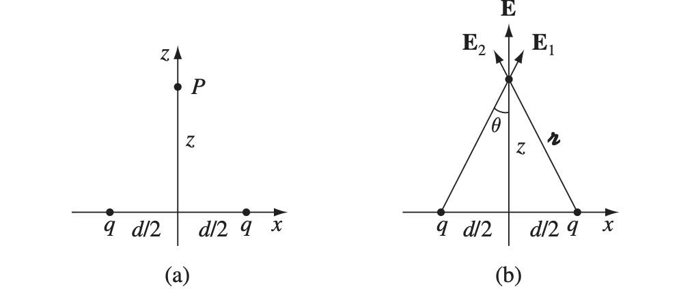
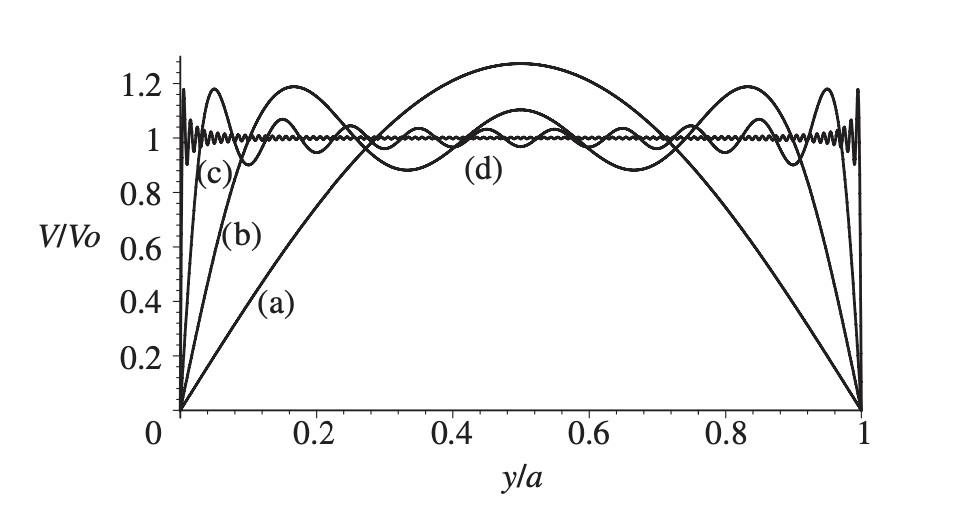
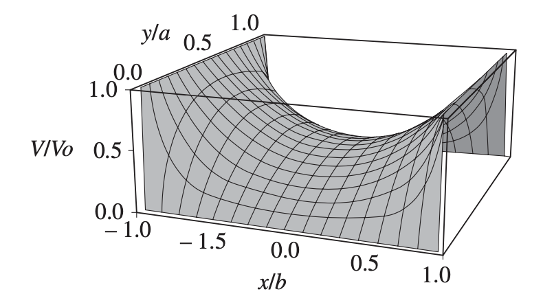

# Electrodynamics I

本笔记是对应 *UIUC PHYS 435 Electromagnetic Fields I* 的学习笔记，其中包括了矢量微积分、偏微分方程、静电学、静磁学相关的知识点。由于本篇是物理笔记，其中的数学定理并不一定提供证明，即使有证明也不一定是严格的。主要参考了 *Introduction to Electrodynamics, 4th Edition: David J. Griffiths*，文中大量的例题、图片都来自该教材，章节的编排也基本按照这本书的设计。

[TOC]

$$
\newcommand{\marginbox}[1]{\fbox{$\hphantom{1} {#1} \vphantom{1\over1} \hphantom{1}$}}\nonumber
\newcommand{\rcur}[0]{\mathscr{r}}
\newcommand{\brcur}[0]{\boldsymbol{\mathscr{r}}}
\newcommand{\unit}[1]{\hat{\boldsymbol{#1}}}
$$

**电动力学（Electrodynamics）** 研究的核心问题就是已知一系列 **源电荷（Source Charge）**，它们对另一个 **测试电荷（Test Charge）** 的作用是怎么样的。其中源电荷和测试电荷的初始状态（位置，速度）给定时，我们需要尝试计算出测试电荷的运动轨迹。这个问题可以通过 **叠加原理（Principle of Superposition）** 显著简化：由于电磁力和电荷的电量成线性比例，我们可以将一个个源电荷孤立出来处理。如果源电荷 $q_i$ 对测试电荷 $Q$ 的力为 $\mathbf{F}_i$，则所有源电荷都存在的情况下 $Q$ 受到的力就是 $\sum \mathbf{F}_i$。实验表明，一个源电荷 $q$ 对测试电荷 $Q$ 的电磁力通常与它们的电量、速度、 $q$ 的加速度以及两者的距离 $\mathscr{r}$ 相关。由于两者可能都在运动，考虑所有因素的分析会异常复杂。所以，我们将一步步构建电动力学中影响作用力的因素，从简单的问题中理解电磁场的性质。

## 矢量分析

在开始电动力学的学习之前，我们首先应该熟悉 **矢量微积分（Vector Calculus）**，它在本文的公式中占有极大的篇幅。许多物理量除了大小，还有方向的性质，比如一段位移 **r**，我们不仅关心它的大小（距离），也关心它的起点和终点。我们将这样的物理量称为称为 **矢量（Vector）**，而其它的物理量（比如温度、质量等）被称为 **标量（Scalar）**。

让我们做符号格式的约定。本篇全文中，所有的符号如果没有经过粗体处理，如 $x, \alpha, B$，都是标量；相反如果经过粗体处理，如 $\mathbf{z}, \mathbf{A}$ 则视为矢量。和矢量有关的概念和记号如下：

- 一个矢量 $\mathbf{A}$ 的大小 $|\mathbf{A}|$ 会被简记为 $A$。
- 与矢量 $\mathbf{A}$ 大小相同，方向相反的矢量记为 $-\mathbf{A}$。
- 与矢量 $\mathbf{A}$ 方向相同，长度为其 $k$ 倍的矢量记为 $k\mathbf{A}$。
- 与矢量 $\mathbf{A}$ 方向相同，单位长度的矢量记为 $\hat{\mathbf{A}}$。
- 大小为 $0$ 的矢量记为 $\mathbf{0}$，注意它和 $0$ 的区别。

### 矢量的运算

矢量的加减法可以参考下面的图片。这个法则是基于一个公理：只要两个矢量拥有相同的大小和方向，它们就是相等的矢量。因此我们可以通过平移矢量得到期望的图形：

可以看到，矢量的加减法非常符合我们的直觉：只需要将两个矢量的头尾相连就可以得到它们的和；而两个矢量的差等于一个矢量加上另一个矢量的逆。

矢量的 **点乘（Dot Product）** 描述了两个矢量在同一方向共同的作用效果，大小为两个矢量大小之积乘以它们夹角的余弦，即：
$$
\marginbox{\mathbf{A}\cdot \mathbf{B} = AB\cos\theta}
$$
可以参考下图：

特别地有 $\mathbf{A}\cdot\mathbf{A} = A^2$。从几何角度理解，点乘是将一个矢量投影到另一个矢量的方向上之后两者的乘积。物理学中的功 $W = \int\mathbf{F}\cdot\,d\mathbf{l}$ 是比较典型的使用点乘的例子。通过点乘的定义我们可以轻易地得到余弦定理：
$$
c^2 = \mathbf{c}\cdot\mathbf{c} = (\mathbf{a} - \mathbf{b})\cdot(\mathbf{a} - \mathbf{b}) = \mathbf{a}\cdot\mathbf{a} - 2\mathbf{a}\cdot\mathbf{b} + \mathbf{b}\cdot\mathbf{b} = a^2 + b^2 -2ab\cos\theta
$$
矢量的 **叉乘（Cross Product）** 定义为垂直于两个矢量所在平面的矢量，大小为两个矢量大小之积乘以它们夹角的正弦，方向则满足 **右手定则（Right-Hand Rule）**：
$$
\marginbox{\mathbf{A}\times\mathbf{B} = AB\sin\theta\hat{\mathbf{n}}}
$$
其中 $\hat{\mathbf{n}}$ 是满足右手定则的法向量，该定则描述如下：将四指指向第一个矢量的方向，大拇指处于同一平面并垂直于它们，然后使得四指能通过较小角度转到第二个矢量的方向时，大拇指的方向就是 $\hat{\mathbf{n}}$ 的方向。为了更好说明这个方向，我们以笛卡尔坐标系为例：

上图中，通过叉乘定义有：
$$
\begin{align}
	\hat{\mathbf{x}}\times\hat{\mathbf{y}} = \hat{\mathbf{z}} && \hat{\mathbf{y}}\times\hat{\mathbf{z}} = \hat{\mathbf{x}} && \hat{\mathbf{z}}\times\hat{\mathbf{x}} = \hat{\mathbf{y}}
\end{align}
$$
特别地有 $\mathbf{A}\times\mathbf{A} = \mathbf{0}$。此外，通过右手定则不难发现叉乘不满足交换律，即 $\mathbf{A}\times\mathbf{B} = -\mathbf{B}\times\mathbf{A}$。

### 矢量的分量表示

在 $n$ 维空间中，对于线性无关的 $n$ 个矢量 $\hat{\mathbf{e}}_1,...,\hat{\mathbf{e}}_n$，对给定的 $n$ 维矢量 $\mathbf{A}$ 总能找到唯一的 $n$ 元组 $(A_1,...,A_n)$ 使得下式成立：
$$
\mathbf{A} = \sum_{i=1}^n A_i\hat{\mathbf{e}}_i
$$
因此，我们对笛卡尔坐标系中的向量 $\mathbf{A}$ 总能写成下面的形式：
$$
\mathbf{A} = A_x\hat{\mathbf{x}} + A_y\hat{\mathbf{y}} + A_z\hat{\mathbf{z}}
$$
我们可以根据此定义给出向量加减法、点乘和叉乘在笛卡尔坐标系中的计算公式：
$$
\begin{align}
\begin{split}
	\mathbf{A} + \mathbf{B} &= (A_x + B_x)\hat{\mathbf{x}} + (A_y + B_y)\hat{\mathbf{y}} + (A_z + B_z)\hat{\mathbf{z}} \\
	\mathbf{A} \cdot \mathbf{B} &= A_xB_x + A_yB_y + A_zB_z \\
	\mathbf{A} \times \mathbf{B} &= (A_yB_z - A_zB_y)\hat{\mathbf{x}} + (A_zB_x - A_xB_z)\hat{\mathbf{y}} + (A_xB_y - A_yB_x)\hat{\mathbf{z}}
\end{split}
\end{align}
$$
其中叉乘的公式可以通过行列式变得更加优雅：
$$
\mathbf{A}\times\mathbf{B} = 
\begin{vmatrix}
	\hat{\mathbf{x}} & \hat{\mathbf{y}} & \hat{\mathbf{z}} \\
	A_x & A_y & A_z \\
	B_x & B_y & B_z
\end{vmatrix}
$$
现在计算点乘变得如此简单，我们可以利用点乘的定义得到两个向量之间的夹角：
$$
\cos{\theta} = \frac{\mathbf{A}\cdot\mathbf{B}}{AB} = \frac{A_xB_x + A_yB_y + A_zB_z}{\sqrt{(A_x^2 + A_y^2 + A_z^2)(B_x^2 + B_y^2 + B_z^2)}}
$$
最后让我们介绍两种常见的矢量连乘公式：$\mathbf{A}\cdot(\mathbf{B}\times\mathbf{C})$ 和 $\mathbf{A}\times(\mathbf{B}\times\mathbf{C})$。其中第一个式子的结果是一个标量，$\mathbf{B}\times\mathbf{C}$ 得到了垂直于 $\mathbf{B}$、$\mathbf{C}$ 所在平面的矢量 $BC\sin\theta\hat{\mathbf{n}}$，随后它与 $\mathbf{A}$ 的点乘正好得到了 $\mathbf{A}$ 到 $\mathbf{B}$、$\mathbf{C}$ 所在平面的距离。通过下面的图片来理解，我们不难发现这个结果就是所示平行六面体的体积：

另一个 $\mathbf{A}\times(\mathbf{B}\times\mathbf{C})$ 可以通过叉乘在笛卡尔坐标系的计算方式强行得到下面的结果：
$$
\mathbf{A}\times(\mathbf{B}\times\mathbf{C}) = \mathbf{B}(\mathbf{A}\cdot\mathbf{C}) - \mathbf{C}(\mathbf{A}\cdot\mathbf{B})
$$
 类似地也有：
$$
(\mathbf{A}\times\mathbf{B})\times\mathbf{C} = -\mathbf{A}(\mathbf{B}\cdot\mathbf{C}) + \mathbf{B}(\mathbf{A}\cdot\mathbf{C})
$$
通过上面两个公式，我们就可以得到任意的矢量点乘叉乘混合的结果了。

在进入更深层次的矢量分析之前，让我们确立物理学中的 **位置（Position）**、**位移（Displacement）** 和 **分离矢量（Separation Vector）** 等概念和它们的记号。位置矢量指的是空间中从原点指向某一点的矢量，通常记为 $\mathbf{r}$。电动力学中通常关心两个位置矢量，它们是 **场源点（Source Point）**，记为 $\mathbf{r}'$ 和 **场点（Field Point）**，记为 $\mathbf{r}$。从场源点指向场点的矢量则被称为分离矢量，记为 $\boldsymbol{\mathscr{r}}$，它可以定义为：
$$
\boldsymbol{\mathscr{r}} = \mathbf{r} - \mathbf{r}'
$$
位移是指表明位置移动的矢量 $\Delta\mathbf{r} = \mathbf{r}_1 - \mathbf{r}_0$。当这个量取无穷小时我们就得到了无穷小位移矢量 $d\mathbf{l}$：
$$
d\mathbf{l} = d\mathbf{r} = dx\,\hat{\mathbf{x}} + dy\,\hat{\mathbf{y}} + dz\,\hat{\mathbf{z}}
$$

### 矢量微分

#### 梯度

我们默认已经对标量的函数与微分比较熟悉了。对于函数 $f(x)$，它的导数 $\frac{df}{dx}$ 表明其 **斜率（Slope）** 的特征。现在假设函数 $T(x, y, z)$ ，它的“斜率”显得不是那么明显，我们需要考虑它所有方向上单位长度引起的变化：
$$
dT = \frac{\partial T}{\partial x}\,dx + \frac{\partial T}{\partial y}\,dy + \frac{\partial T}{\partial z}\,dz
$$
我们只需要考虑 $x, y, z$ 三个方向即可，因为所有其他方向的变化率都可以通过它们三个的线性组合得到。注意到上面的公式和点乘的相似性。将它重写为向量点乘的形式：
$$
dT = \left(\frac{\partial T}{dx}\hat{\mathbf{x}} + \frac{\partial T}{dx}\hat{\mathbf{y}} + \frac{\partial T}{dx}\hat{\mathbf{z}}\right)\cdot(dx\,\hat{\mathbf{x}} + dy\,\hat{\mathbf{y}} + dz\,\hat{\mathbf{z}}) = \nabla T\cdot d\mathbf{l}
$$
 $\nabla$ 是引入的新记号，我们称其为 **Del 算子（Del Operator）**，其定义如下：
$$
\marginbox{\nabla = \hat{\mathbf{x}}\frac{\partial}{\partial x} + \hat{\mathbf{y}}\frac{\partial}{\partial y} + \hat{\mathbf{z}}\frac{\partial}{\partial z}}
$$
可以看到 del 算子和微分算子 $\frac{d}{dx}$ 非常相似。后文中我们将利用 del 算子重新建立微积分中的一些定理，可以时常将其和微分算子对比。

当 $\nabla$ 使用在标量函数前时，会遵循类似于乘法分配律的规则得到：
$$
\nabla T = \left(\hat{\mathbf{x}}\frac{\partial}{\partial x} + \hat{\mathbf{y}}\frac{\partial}{\partial y} + \hat{\mathbf{z}}\frac{\partial}{\partial z}\right)T = \frac{\partial T}{dx}\hat{\mathbf{x}} + \frac{\partial T}{dx}\hat{\mathbf{y}} + \frac{\partial T}{dx}\hat{\mathbf{z}}
$$
我们将这个矢量函数称为 $T$ 的 **梯度（Gradient）**。根据 (15) 式我们也可以发现，梯度是使得 $dT$ 最大的 $d\mathbf{l}$ 方向。如果更加生动地说明，梯度就是站在某点时最陡的（向高处的）方向，而梯度的大小就是这个方向上的斜率。

#### 散度

由于 Del 算子的矢量性质，我们可以尝试得到它和矢量函数的点乘和叉乘。点乘得到的是矢量函数的 **散度（Divergence）**：
$$
\nabla\cdot\mathbf{v} = \left(\hat{\mathbf{x}}\frac{\partial}{\partial x} + \hat{\mathbf{y}}\frac{\partial}{\partial y} + \hat{\mathbf{z}}\frac{\partial}{\partial z}\right)\cdot(v_x\hat{\mathbf{x}} + v_y\hat{\mathbf{y}} + v_z\hat{\mathbf{z}}) = \frac{\partial v_x}{\partial x} + \frac{\partial v_y}{\partial y} + \frac{\partial v_z}{\partial z}
$$
散度的几何意义是某点上一个向量函数的发散程度。我们不加证明地给出其等价的定义：
$$
\marginbox{\nabla\cdot\mathbf{v} = \lim_{V\to 0}\frac{1}{|V|}\oint_{S(V)}\mathbf{v}\cdot\hat{\mathbf{n}}\,dS}
$$
也即一个闭合曲面中矢量场的通量（穿过该曲面的积分）与闭合曲面形成体积 $V$ 之比在 $V\to 0$ 的极限。在静电场的章节中我们会再一次看到类似的定义。

#### 旋度

**旋度（Curl）** 则描述了一个矢量函数的旋转程度：
$$
\nabla\times\mathbf{v} = \left(\hat{\mathbf{x}}\frac{\partial}{\partial x} + \hat{\mathbf{y}}\frac{\partial}{\partial y} + \hat{\mathbf{z}}\frac{\partial}{\partial z}\right)\times(v_x\hat{\mathbf{x}} + v_y\hat{\mathbf{y}} + v_z\hat{\mathbf{z}}) =
\begin{vmatrix}
	\hat{\mathbf{x}} & \hat{\mathbf{y}} & \hat{\mathbf{z}} \\
	\partial_x & \partial_y & \partial_z \\
	v_x & v_y & v_z
\end{vmatrix}  \\
= \left(\frac{\partial v_z}{\partial y} - \frac{\partial v_y}{\partial z}\right)\hat{\mathbf{x}} + \left(\frac{\partial v_x}{\partial z} - \frac{\partial v_z}{\partial x}\right)\hat{\mathbf{y}} + \left(\frac{\partial v_y}{\partial x} - \frac{\partial v_x}{\partial y}\right)\hat{\mathbf{z}}
$$

#### 矢量微分的运算定律

现在让我们探索矢量微分的运算规律。标量函数的微分定律可以简单总结如下：
$$
\begin{align}
\begin{split}
	\frac{d}{dx}(f + g) &= \frac{df}{dx} + \frac{dg}{dx} \\
	\frac{d}{dx}(kf) &= k\frac{df}{dx} \\
	\frac{d}{dx}(fg) &= f\frac{dg}{dx} + g\frac{df}{dx} \\
	\frac{d}{dx}\left(\frac{f}{g}\right) &= \frac{g\frac{df}{dx} - f\frac{dg}{dx}}{g^2}
\end{split}
\end{align}
$$
在矢量微分中，也有相当类似的定律，比如加法定律：
$$
\begin{align}
\begin{split}
	\nabla(f + g) &= \nabla f + \nabla g \\
	\nabla\cdot(\mathbf{A} + \mathbf{B}) &= \nabla\cdot\mathbf{A} + \nabla\cdot\mathbf{B} \\
	\nabla\times(\mathbf{A} + \mathbf{B}) &= \nabla\times\mathbf{A} + \nabla\times\mathbf{B}
\end{split}
\end{align}
$$
标量乘法定律：
$$
\begin{align}
\begin{split}
\nabla(kf) &= k\nabla f \\
\nabla\cdot(k\mathbf{A}) &= k(\nabla\cdot\mathbf{A}) \\
\nabla\times(k\mathbf{A}) &= k(\nabla\times\mathbf{A})
\end{split}
\end{align}
$$
梯度定律：
$$
\begin{align}
\begin{split}
	\nabla(fg) &= f\nabla g + g\nabla f \\
	\nabla(\mathbf{A}\cdot\mathbf{B}) &= \mathbf{A}\times(\nabla\times\mathbf{B}) + \mathbf{B}\times(\nabla\times\mathbf{A}) + (\mathbf{A}\cdot\nabla)\mathbf{B} + (\mathbf{B}\cdot\nabla)\mathbf{A} \end{split}
\end{align}
$$
以及矢量乘法定律：
$$
\begin{align}
\begin{split}
	\nabla\cdot(f\mathbf{A}) &= f(\nabla\cdot A) + \mathbf{A}\cdot(\nabla f) \\
	\nabla\cdot(\mathbf{A}\times\mathbf{B}) &= \mathbf{B}\cdot(\nabla\times\mathbf{A}) - \mathbf{A}\cdot(\nabla\times\mathbf{B}) \\
	\nabla\times(f\mathbf{A}) &= f(\nabla\times \mathbf{A}) - \mathbf{A}\times(\nabla f) \\
	\nabla\times(\mathbf{A}\times\mathbf{B}) &= (\mathbf{B}\cdot\nabla)\mathbf{A} - (\mathbf{A}\cdot\nabla)\mathbf{B} + \mathbf{A}(\nabla\cdot{B}) - \mathbf{B}(\nabla\cdot\mathbf{A})
\end{split}
\end{align}
$$
上面这一系列定律都可以通过矢量的运算定律以及梯度、散度和旋度的定义得到。

#### 二阶导数

我们可以使用两次 del 算子以得到函数的二阶导数。其中最常用的是梯度的散度，我们称其为 **拉普拉斯（Laplacian）**：
$$
\nabla\cdot(\nabla T) = \left(\hat{\mathbf{x}}\frac{\partial}{\partial x} + \hat{\mathbf{y}}\frac{\partial}{\partial y} + \hat{\mathbf{z}}\frac{\partial}{\partial z}\right)\cdot\left(\frac{\partial T}{dx}\hat{\mathbf{x}} + \frac{\partial T}{dx}\hat{\mathbf{y}} + \frac{\partial T}{dx}\hat{\mathbf{z}}\right) = \frac{\partial^2T}{\partial x^2} + \frac{\partial^2 T}{\partial y^2} + \frac{\partial^2 T}{\partial z^2}
$$
我们经常将上面式子简写为 $\nabla^2 T$，其中 $\nabla^2$ 是一个新定义的算子，称为 **拉普拉斯算子（Laplacian Operator）**：
$$
\marginbox{\nabla^2 = \frac{\partial^2}{\partial x^2} + \frac{\partial^2}{\partial y^2} + \frac{\partial^2}{\partial z^2}}
$$
偶尔我们也会对矢量使用拉普拉斯算子，此时它代表对矢量的不同分量分别进行不同方向的求拉普拉斯：
$$
\nabla^2\mathbf{v} = (\nabla^2v_x)\hat{\mathbf{x}} + (\nabla^2v_y)\hat{\mathbf{y}} + (\nabla^2v_z)\hat{\mathbf{z}}
$$
除了梯度的散度，我们还可能得到：

- 梯度的旋度。我们可以通过其定义证明：
  $$
  \nabla\times(\nabla T) = \mathbf{0}
  $$
  这是一个很重要的结论。通常被用来判断一个矢量场 $\nabla T$ 是否是某个标量场 $T$ 的梯度。

- 散度的梯度，即 $\nabla(\nabla\cdot \mathbf{v})$。遗憾的是，在物理学中这个表达式很少被用到，因此对它的兴趣寥寥。但注意散度的梯度 *不等于* 梯度的散度！

- 旋度的散度。我们可以通过其定义证明：
  $$
  \nabla\cdot(\nabla\times\mathbf{v}) = 0
  $$

- 旋度的旋度。其计算可以参考矢量连乘公式：
  $$
  \nabla\times(\nabla\times \mathbf{v}) = \nabla(\nabla\cdot\mathbf{v}) - \nabla^2\mathbf{v}
  $$
  此式也常作为矢量的拉普拉斯定义式。

### 矢量积分

在电动力学中，我们最常见到的几种积分即是 **线积分（Line Integral）**、**面积分（Surface Integral）** 和 **体积分（Volume Integral）**。我们下面进行简单的展示说明：

- 线积分：沿着一个路径的积分，定义如下：
  $$
  \int_\mathbf{a}^\mathbf{b}\mathbf{v}\cdot d\mathbf{l}
  $$
  其中 $\mathbf{v}$ 是一个矢量函数，$d\mathbf{l}$ 则是无穷小位移矢量，描述了积分路径的方向，可以参考下图：

  

  当线积分的初始点 $\mathbf{a}$ 和终止点 $\mathbf{b}$ 重合时，这就变成了一个闭合曲线，此时我们将线积分记为下面的形式：
  $$
  \oint \mathbf{v}\cdot d\mathbf{l}
  $$
  
- 面积分：垂直作用于一个曲面的积分：
  $$
  \int_\mathcal{S}\mathbf{v}\cdot d\mathbf{a}
  $$
  其中 $\mathcal{S}$ 是积分针对的曲面，$d \mathbf{a}$ 则是一个无穷小面积的法向量。显然一块面积的法向量有两个，因此此处可能会产生歧义，在积分时应该明确说明面积的方向。如果 $\mathcal{S}$ 是闭合的，我们就可以将面积分记为：
  $$
  \oint \mathbf{v}\cdot d\mathbf{a}
  $$
  我们对面积分还有一个常用的称呼。考虑将 $\mathbf{v}$ 视为单位时间单位截面上某个流体的质量时，那么 $\int\mathbf{v}\cdot d\mathbf{a}$ 能够描述单位时间通过某个面的流体质量。我们因此也将其称为 **通量（Flux）**。

- 体积分：对某个体积的积分：
  $$
  \int_\mathcal{V}T\,d\tau
  $$
  这里 $T$ 是一个标量函数，而 $d\tau$ 是一个无穷小体积。在笛卡尔坐标系中可以轻易得到：
  $$
  d\tau = dx\,dy\,dz
  $$
  偶尔我们也会遇到矢量函数的体积分：
  $$
  \int\mathbf{v}\,d\tau = \hat{\mathbf{x}}\int v_x\,d\tau + \hat{\mathbf{y}}\int v_y\,d\tau + \hat{\mathbf{z}}\int v_z\,d\tau
  $$

#### 微积分基本定理

虽然大家它可能已经很熟悉了，但是为了和后面将要提到的其它基本定理比较，这里还是将 **微积分基本定理（The Fundamental Theorem of Calculus）** 写出来：
$$
\int_a^b\left(\frac{df}{dx}\right)\,dx = f(b) - f(a)
$$
其几何意义是显然的。下面让我们对矢量微积分中导数的三种变形：梯度、散度和旋度分别给出类似的基本定理：

#### 梯度基本定理

在一个线积分中，任取一段无穷小的路径 $d\mathbf{l}$ 都有 $dT = \nabla T \cdot d\mathbf{l}$（我们此前在 (15) 式中已经给出）。因此对于完整的线积分：
$$
\int_\mathbf{a}^\mathbf{b}(\nabla T)\cdot d\mathbf{l} = T(\mathbf{b}) - T(\mathbf{a})
$$
这也即是 **梯度基本定理（The Fundamental Theorem for Gradients）**。其几何意义在于，空间中任意两点的“高度差”等价于连接它们的路径上每个“高度”变化的和。和微积分基本定理对比我们可以发现，它们的特征都在于，一个积分的结果只取决于边界点，和中间过程（路径）无关。物理学中，如果一个矢量场的线积分和路径无关，我们就称其为 **保守的（Conservative）**。从梯度基本定理来看，一个矢量场保守的充分条件是这个场是某个标量场的梯度。我们可以从该定理迅速得到一个推论 ：
$$
\oint (\nabla T)\cdot d\mathbf{l} = 0
$$

#### 散度基本定理

**散度基本定理（The Fundamental Theorem for Divergences）** 将面积分和散度的体积分联系到了一起：
$$
\label{divergence-theorem}
\underset{\mathcal{V}}{\int}(\nabla\cdot\mathbf{v})\,d\tau = \underset{\mathcal{S}}{\oint}\mathbf{v}\cdot d\mathbf{a}
$$
它也被称为 **高斯定理（Gauss's Theorem）**、**格林定理（Green's Theorem）** 或 **散度定理（Divergence Theorem）**。其几何意义在于，一个闭合曲面的通量等于该曲面包围的面积内总量的变化值。同样地，这也将一个积分（等式左侧）的结果取决于其边界区域（等式右侧的曲面）。

#### 旋度基本定理

**旋度基本定理（The Fundamental Theorem for Curls）** 将旋度对某曲面的通量和该曲面边界的线积分联系到了一起：
$$
\underset{\mathcal{S}}{\int}(\nabla\times \mathbf{v})\cdot d\mathbf{a} = \underset{\mathcal{P}}{\oint}\mathbf{v}\cdot d\mathbf{l}
$$
这也被称为 **斯托克斯定理（Stokes' Theorem）**。其几何意义在于，一个曲面内旋度的总量等于其边界处一圈的变化之和。通过图片能够更好理解这一点：

和梯度基本定理类似，我们发现旋度的通量和所选曲面无关，只和曲面边界有关；对于闭合曲面，我们总有：
$$
\oint(\nabla \times\mathbf{v}) \cdot d\mathbf{a} = 0
$$

#### 分部积分

通过对微分乘法定律 $(fg)' = fg' + gf'$ 的应用，我们可以得到 **分部积分（Integration by Parts）**的积分方法：
$$
\int_a^b f\left(\frac{dg}{dx}\right)\,dx = -\left.\int_a^b g\left(\frac{df}{dx}\right)\,dx + fg\right|_a^b
$$
类似地，我们也可以将矢量微分中介绍的乘法定律变为积分的形式，比如：
$$
\int\nabla\cdot(f\mathbf{A})\,d\tau = \int f(\nabla\cdot\mathbf{A})\,d\tau + \int\mathbf{A}\cdot(\nabla f)\,d\tau\nonumber
$$
根据散度定理我们可以进一步得到：
$$
\label{partial-integration}
\int_\mathcal{V} f(\nabla\cdot\mathbf{A})\,d\tau = -\int_\mathcal{V}\mathbf{A}\cdot(\nabla f)\,d\tau + \oint_\mathcal{S} f\mathbf{A}\cdot d\mathbf{a}
$$
看起来非常抽象，但分部积分确实是一个非常强大的积分工具，我们会时常用到。

### 曲线坐标系

此前我们没有着重强调微积分所用的坐标系，对 del 算子的定义则只使用了笛卡尔坐标系。对于笛卡尔坐标系，多数公式可以很轻松地进行变形（比如 $da = dx\,dy$ 等），这是因为它的三个坐标方向是始终不变的，我们不再展开说明。**曲线坐标系（Curvilinear Coordinates）** 与其不同，它的坐标网格中存在曲线。这里我们将详细介绍两种物理学中极为常用的曲线坐标系。

#### 球坐标系

我们可以通过空间中某点和原点的距离 $r$、和 $z$ 轴的夹角 $\theta$，以及其径矢 $\mathbf{r}$ 对 $x$-$y$ 平面投影与 $x$ 轴的夹角 $\phi$ 来唯一确定这个点，使得下面和笛卡尔坐标系的关系式成立：
$$
\begin{align}
	x = r\sin{\theta}\cos{\theta} && y = r\sin{\theta}\sin{\theta} && z = r\cos\theta
\end{align}
$$
如下图所示：

图中也给出了这三个量的单位矢量方向，都是使其增长的方向且相互垂直，这样就能够将任一个空间中的矢量 $\mathbf{A}$ 表示为 $A_r\hat{\mathbf{r}} + A_\theta\hat{\mathbf{\theta}} + A_\phi\hat{\mathbf{\phi}}$  的形式。和笛卡尔坐标系对比后可以发现，球坐标系中的单位矢量是不固定的（即不是常量）。它们每一个都取决于 $r, \theta, \phi$ 的值，具体关系如下：
$$
\begin{align}
\begin{split}
	\hat{\mathbf{r}} &= \sin\theta\cos\phi\hat{\mathbf{x}} + \sin\theta\sin\phi\hat{\mathbf{y}} + \cos\theta\hat{\mathbf{z}} \\
	\hat{\boldsymbol{\theta}} &= \cos\theta\cos\phi\hat{\mathbf{x}} + \cos\theta\sin\phi\hat{\mathbf{y}} - \sin\theta\hat{\mathbf{z}} \\
	\hat{\boldsymbol{\phi}} &= -\sin\phi \hat{\mathbf{x}} + \cos\phi\hat{\mathbf{y}}
\end{split}
\end{align}
$$
因此进行微分时我们要考虑它们的偏导数，实际上就是下面这些：
$$
\begin{align}
	\frac{\partial \hat{\mathbf{r}}}{\partial \theta} = \hat{\boldsymbol{\theta}} && \frac{\partial \hat{\boldsymbol{\theta}}}{\partial \theta} = -\hat{\mathbf{r}} 
\end{align}
$$
接下来，让我们给出所有球坐标系中所有和微积分相关的公式。首先我们尝试得到 $d\mathbf{l}$，也即无穷小的位移。这可以通过对三个方向 $\hat{\mathbf{r}}$ 、$\hat{\boldsymbol{\theta}}$、$\hat{\boldsymbol{\phi}}$ 上的分量求和得到。我们可以通过下图理解这三个方向上的分量：

因此我们有：
$$
d\mathbf{l} = dr\hat{\mathbf{r}} + r\,d\theta\hat{\boldsymbol{\theta}} + r\sin\theta\,d\phi\hat{\boldsymbol{\phi}}
$$
通过这三个分量我们还可以得到 $d\tau$，也即它们的乘积：
$$
d\tau = r^2\sin\theta\,dr\,d\theta\,d\phi
$$
对于面积 $da$ 则取决于它的方向。如果 $r$ 保持不变，则它是 $\hat{\boldsymbol{\theta}}$ 与 $\hat{\boldsymbol{\phi}}$ 方向的两个分量的乘积（这种情况比较常见）：
$$
d\mathbf{a} = r^2\sin\theta\,d\theta\,d\phi\hat{\mathbf{r}}
$$
如果 $\theta$ 保持不变，则公式如下：
$$
d\mathbf{a} = r\,dr\,d\phi\hat{\boldsymbol{\theta}}
$$
然后让我们尝试得到球坐标系下的 del 算子。我们从笛卡尔坐标系中 del 算子的定义开始：
$$
\begin{align*}
	\nabla T &= \frac{\partial T}{\partial x}\hat{\mathbf{x}} + \frac{\partial T}{\partial y}\hat{\mathbf{y}} + \frac{\partial T}{\partial z}\hat{\mathbf{z}} \\
	&= \left[\frac{\partial T}{\partial r}\left(\frac{\partial r}{\partial x}\right) + \frac{\partial T}{\partial \theta}\left(\frac{\partial \theta}{\partial x}\right) + \frac{\partial T}{\partial \phi}\left(\frac{\partial \phi}{\partial x}\right)\right]\hat{\mathbf{x}} + ... \\
\end{align*}
$$
第二步中我们省略了 $\hat{\mathbf{y}}$ 和 $\hat{\mathbf{z}}$ 的项，但是它们和第一项是类似的，都是对某一分量分解为球坐标系下三个分量的和。通过代入前面介绍过的公式，我们可以得到 del 算子相关的所有公式：
$$
\begin{align}
\nabla T &= \frac{\partial T}{\partial r}\hat{\mathbf{r}} + \frac{1}{r}\frac{\partial T}{\partial \theta}\hat{\boldsymbol{\theta}} + \frac{1}{r\sin\theta}\frac{\partial T}{\partial \phi}\hat{\boldsymbol{\phi}} \\
\nabla \cdot \mathbf{v} &= \frac{1}{r^2}\frac{\partial}{\partial r}(r^2v_r) + \frac{1}{r\sin\theta}\frac{\partial}{\partial \theta}(\sin\theta v_\theta) + \frac{1}{r\sin\theta}\frac{\partial v_\phi}{\partial \phi} \\
\nabla\times \mathbf{v} &= \frac{1}{r\sin\theta}\left(\frac{\partial}{\partial \theta}(\sin\theta v_\phi) - \frac{\partial v_\theta}{\partial \phi}\right)\hat{\mathbf{r}} + \frac{1}{r}\left(\frac{1}{\sin\theta}\frac{\partial v_r}{\partial \phi} - \frac{\partial }{\partial r}(rv_\phi) \right)\hat{\boldsymbol{\theta}} + \frac{1}{r}\left(\frac{\partial}{\partial r}(rv_\theta) - \frac{\partial v_r}{\partial \theta}\right)\hat{\boldsymbol{\phi}}
\end{align}
$$

#### 柱坐标系

## 静电场概述

**静电学（Electrostatics）** 研究静止源电荷的电场问题，换句话说，这是研究与时间 *无关* 的电场性质。这种情况下我们可以立刻给出源电荷对测试电荷的力。通过 **库仑定律（Coulomb's Law）** 描述，即静电荷吸引另一个电荷产生的力正比于两电荷的乘积并反比于两电荷距离的平方，公式是：
$$
\mathbf{F} = \frac{1}{4\pi\epsilon_0}\frac{qQ}{\mathscr{r}^2}\hat{\boldsymbol{\mathscr{r}}}
$$
其中 $\epsilon_0$ 是一个常数，称为 **真空介电常数（Permittivity of Free Space）**，值是 $8.85\times10^{-12}\text{C}^2\cdot\text{N}^{-1}\cdot\text{m}^{-2}$。本篇中，记源电荷的位置为 $\mathbf{r}'$，测试电荷的位置为 $\mathbf{r}$，而两者之间的矢量（从源电荷指向测试电荷）为 $\boldsymbol{\mathscr{r}} = \mathbf{r} - \mathbf{r}'$。库仑定律和叠加原理组成了静电学的全部核心内容。之后我们引入的概念和公式都是它们的数学延伸。

### 电场强度

考虑有 $n$ 个源电荷 $q_1,...,q_n$ 距离测试电荷 $\mathscr{r}_1,...,\mathscr{r}_n$。此时对测试电荷 $Q$ 的静电力为：
$$
\begin{align}
\begin{split}
\mathbf{F} &= \sum_{i=1}^n \mathbf{F}_i \\
&= \sum_{i=1}^n\frac{1}{4\pi\epsilon_0}\frac{q_iQ}{\mathscr{r}_i^2}\hat{\boldsymbol{\mathscr{r}_i}} \\
&= \frac{Q}{4\pi\epsilon_0}\sum_{i=1}^n\frac{q_i}{\mathscr{r}_i^2}\hat{\boldsymbol{\mathscr{r}_i}} 
\end{split}
\end{align}
$$
可以看到其中有一个和测试电荷无关的量，我们定义其为源电荷的 **电场强度（Electric Field）**：
$$
\begin{align}
\mathbf{F} &= Q\mathbf{E} \\
\mathbf{E} &= \frac{1}{4\pi\epsilon_0}\sum_{i=1}^n\frac{q_i}{\mathscr{r}_i^2}\hat{\boldsymbol{\mathscr{r}_i}}
\end{align}
$$
通过第一个定义式我们可以认识到，电场强度的值就是静电场中某点上，单位电荷受到源电荷的力的大小。让我们用一个例子来熟悉电场强度的求解：

> **例**：有两个距离为 $d$ 的电荷，电量都为 $q$，求它们连线的中垂线上的电场强度分布，见下图 (a)。
>
> 

> **解**：可以通过库仑定律推导出的电场强度计算式得到 $\mathbf{E} = \frac{1}{4\pi\epsilon_0}\frac{q}{\mathscr{r}^2}(\hat{\boldsymbol{\mathscr{r}_1}} + \hat{\boldsymbol{\mathscr{r}_2}})$。由于两个源电荷的对称性，最后形成的电场强度只有 $z$ 方向分量，所以我们可以得到答案：
> $$
> \begin{align*}
> \mathbf{E} &= E_z\hat{\mathbf{z}} = \frac{1}{4\pi\epsilon_0}\frac{2q}{\mathscr{r}^2}\cos\theta \\
> &= \frac{1}{2\pi\epsilon_0}\frac{qz}{[z^2 + (d/2)^2]^{3/2}}\hat{\mathbf{z}}
> \end{align*}
> $$

当源电荷连续分布时，(4) 式中的求和符号就应该换成积分符号：
$$
\mathbf{E} = \frac{1}{4\pi\epsilon_0}\int\frac{1}{\mathscr{r}^2}\hat{\boldsymbol{\mathscr{r}}}\,dq
$$
这里的 $dq$ 在实际计算时，要根据电荷分布的具体情况来代换成对线、对面、对体的积分，可以参考下面的图：

在 (b)、(c)、(d) 的情况下，$dq$ 分别可以写为 $\lambda\,dl$、$\sigma\,da$、$\rho\,d\tau$，其中 $\lambda$、$\sigma$、$\rho$ 分别是电荷的线密度、面密度和体密度。其中最常用的就是体密度。我们有时会把下面这个公式称为库仑定律：
$$
\label{coulomb's-law}
\mathbf{E}(\mathbf{r}) = \frac{1}{4\pi\epsilon_0}\int\frac{\rho(\mathbf{r}')}{\mathscr{r}^2}\hat{\boldsymbol{\mathscr{r}}}\,d\tau
$$
让我们同样通过一个例子来理解连续分布的电荷产生的电场强度：

> **例**：有一条电荷均匀分布的直线段，长度为 $2L$，电荷密度为 $\lambda$，求其中垂线上的电场强度分布。

> **解**：我们可以借用前文中的例子的结论，即距离为 $d$ 的两个电荷 $q$ 在其连线中垂线上产生的电场强度为：
> $$
> \mathbf{E} = \frac{1}{2\pi\epsilon_0}\frac{qz}{[z^2 + (d/2)^2]^{3/2}}\hat{\mathbf{z}}\nonumber
> $$
> 因此，对于长度为 $2L$ 的电荷均匀分布的直线，我们可以将其看作很多对 $\lambda dl$：
> $$
> \begin{align*}
> \mathbf{E} &= \int_0^L \frac{1}{2\pi\epsilon_0}\frac{\lambda z}{(z^2 + l^2)^{3/2}}\,dl \\
> &= \frac{1}{2\pi\epsilon_0}\frac{\lambda L}{z\sqrt{z^2 + L^2}}\hat{\mathbf{z}}
> \end{align*}
> $$
> 当 $L \to \infty$ 时，我们可以得到：
> $$
> \mathbf{E} = \frac{\lambda}{2\pi\epsilon_0 z}
> $$

### 静电场的散度和旋度

#### 静电场的散度

考虑一个曲面 $\mathcal{S}$，静电场 $\mathbf{E}$ 对其的通量是：
$$
\Phi_\mathbf{E} = \int_\mathcal{S}\mathbf{E}\cdot d\mathbf{a}
$$
从某种方式来理解，这个公式计算的是穿过 $\mathcal{S}$ 的磁感线数量。当 $\mathcal{S}$ 是闭合的时候可以得到：
$$
\oint_\mathcal{S}\mathbf{E}\cdot d\mathbf{a} = \int\frac{1}{4\pi\epsilon_0}\left(\frac{q}{r^2}\hat{\mathbf{r}}\right)\cdot(r^2\sin\theta\,d\theta\,d\phi\hat{\mathbf{r}}) = \frac{q}{4\pi\epsilon_0}\int_0^{2\pi}d\phi\int_0^\pi\sin{\theta}\,d\theta = \frac{1}{\epsilon_0}q\nonumber
$$
当 $\mathcal{S}$ 中存在多个源电荷时，我们可以利用叠加原理得到更为通用的结论，这就是 **高斯定理（Gauss's Law）**：
$$
\oint \mathbf{E}\cdot d\mathbf{a} = \frac{Q_\text{enc}}{\epsilon_0}
$$
其中 $Q_\text{enc}$ 是曲面内所有电荷的总量。这个美妙的结论充分显示了数学的美感（以及大自然的美感）。事实上，所有满足距离平方反比的矢量场都能够得到类似的结论，我们这里不展开说明了。

现在利用散度定理，即 (42) 式，此时有：
$$
\int_\mathcal{V}(\nabla\cdot\mathbf{E})\,d\tau = \oint_S\mathbf{E}\cdot d\mathbf{a} = \frac{1}{\epsilon_0}\int_\mathcal{V}\rho\,d\tau
$$
右边这个等式就是我们之前得到的高斯定理，其中 $\rho$ 是曲面内的电荷体密度。将最左侧和最右侧的积分号去掉，我们就得到了**微分形式的高斯定理（Gauss's Law in Differential Form）**：
$$
\nabla\cdot \mathbf{E} = \frac{\rho}{\epsilon_0}
$$
这个公式是 **麦克斯韦方程组** 的一部分，且在 $\mathbf{E}$ 与 $\rho$ 和时间有关时依然有效。上面的结论其实可以从纯数学角度得到。根据和库仑定律等价的 (62) 式，我们可以在左侧乘上 del 算子得到其散度：
$$
\nabla\cdot \mathbf{E} = \frac{1}{4\pi\epsilon_0}\int\nabla\cdot\left(\frac{\hat{\boldsymbol{\mathscr{r}}}}{\mathscr{r}^2}\right)\rho(\mathbf{r}')\,d\tau\nonumber
$$
我们可以利用散度定义和狄拉克函数得到：
$$
\nabla\cdot\left(\frac{\hat{\boldsymbol{\mathscr{r}}}}{\mathscr{r}^2}\right) = 4\pi\delta^2(\hat{\boldsymbol{\mathscr{r}}})
$$
代入前面的式子我们就能轻易地得到微分形式的高斯定理。

#### 静电场的旋度

## 电势

静电学所感兴趣的就是求出一个静止的电荷分布产生的电场。我们已经介绍过下面这个公式了：
$$
\def\rcurs{{\mbox{$\resizebox{.09in}{.08in}{\includegraphics[trim= 1em 0 14em 0,clip]{ScriptR}}$}}}
\def\brcurs{{\mbox{$\resizebox{.09in}{.08in}{\includegraphics[trim= 1em 0 14em 0,clip]{BoldR}}$}}}
\begin{equation*}
	\mathbf{E}(\mathbf{r}) = \frac{1}{4\pi\epsilon_0}\int\frac{\boldsymbol{\hat{\mathscr{r}}}}{\mathscr{r}}\rho(\mathbf{r}')\,d\tau'
\end{equation*}
$$
不过这个积分通常解起来比较困难。更流行的做法是先求出电势，然后再逆推回电场：
$$
\begin{align*}
	V(\mathbf{r}) &= \frac{1}{4\pi\epsilon_0}\int\frac{1}{\mathscr{r}}\rho(\mathbf{r}')\,d\tau \\
	\mathbf{E}(\mathbf{r}) &= -\nabla V
\end{align*}
$$
坏消息是，即使是这个积分也不见得好算。等式右侧的 $\rho$ 本身可能比较复杂，因为我们能够控制的往往只是总电荷。所以，下面这个微分形式的公式，即 **泊松方程（Poisson's Equation)** 可能更加有用：
$$
\nabla^2V = -\frac{\rho}{\epsilon_0}
$$
这个公式配合一些边界条件时和积分形式的公式是等价的。通常，我们对电荷密度为 $0$ 的地方更感兴趣。换句话说，虽然某些地方周围存在电荷，但我们只关注于不存在电荷的地方。此时等式右侧为 $0$，我们也就将公式化为了更加友好的形式：
$$
\nabla^2V = 0
$$
这便是 **拉普拉斯方程（Laplace's Equation）**。本节中将用一些篇幅，首先介绍这个偏微分方程的性质和求解。

### 拉普拉斯方程

拉普拉斯方程在物理学中非常常见，它的解被称为 **调和函数（Harmonic Function）**。接下来我们会发现它的两个重要性质：

- 在其中某个点的解等于其周围等距离边界上的解的平均值。
- 不会出现局部极值。换句话说，方程解的极值只会出现在边界。

为了方便类比和阐述，让我们从一维中的拉普拉斯方程开始，一步步介绍到三维。

#### 一维的拉普拉斯方程

$$
\frac{d^2 V}{dx^2} = 0
$$

这甚至只是一个常微分方程。其通解是显然的：
$$
V(x) = mx + b
$$
其几何意义是一条直线。对照之前我们提到的方程性质，不难发现其都被满足了。

#### 二维的拉普拉斯方程

$$
\frac{\partial^2 V}{\partial x^2} + \frac{\partial^2 V}{\partial y^2} = 0
$$

这次我们就没办法得到一个简单的通解了（具体的解我们会在后面讨论）。不过其依然遵守方程的两个性质：
$$
V(x, y) = \frac{1}{2\pi R}\underset{\text{circle}}{\oint}V\,dl
$$
（这不是 $V$ 的解！）可以看到任一点的解都是其周围以之为中心任取的圆边界上解的平均值。受这个特性启发，我们可以设计出一个计算电势的算法：首先确定边界上所有点的电势，并对内部特定网格上的点上的电势进行合理猜测。之后，根据这些值更新周围点的平均电势。多次迭代后就能够得到确定的电势。

有趣的事实：二维中的调和函数是最小化通过给定边界线曲面面积的曲面。

#### 三维的拉普拉斯方程

$$
\label{laplace-equation-3d}
\frac{\partial^2 V}{\partial x^2} + \frac{\partial^2 V}{\partial y^2} + \frac{\partial^2 V}{\partial z^2} = 0
$$

同样地，三维中的拉普拉斯方程满足下面的性质：
$$
V(\mathbf{r}) = \frac{1}{4\pi R^2}\underset{\text{sphere}}{\oint}V\,da
$$

#### 边界条件、导体和唯一性定理

我们至今都没有给出拉普拉斯方程的通解（除了一维的情形），实际上我们甚至不知道在给定多少边界条件时能够确定一个方程的解。通过之前介绍的调和函数性质，我们猜测如果确定了一个闭合范围边界上的值，就能够确定这个闭合区域中所有的解：

> **第一唯一性定理**：某个不包含电荷的体积 $\mathcal{V}$ 中的电势由这个体积的边界 $\mathcal{S}$ 上的电势唯一地确定。

> **证**：
>
> 假设在定理的条件下有两个 *不同的* 解 $V_1, V_2$ 使得 $\nabla^2 V_1 = \nabla^2 V_2 = 0$ 在 $\mathcal{V}$ 中成立，令 $V_3 \equiv V_1 - V_2$，此时有 $\nabla^2 V_3 = \nabla^2 V_1 - \nabla^2 V_2 = 0$，因此 $V_3$ 也是拉普拉斯方程的解。然而由于在 $\mathcal{S}$ 上恒有 $V_3 = V_1 - V_2 = 0$，由于拉普拉斯方程没有局部极值的性质，我们得到 $V_3 \equiv 0$。这也即是 $V_1 = V_2$，得证。

事实上，利用第一唯一性定理的证明可以得到更强的结论。前面的讨论都是基于不存在任何电荷的 $\mathcal{V}$ 进行的（为了满足拉普拉斯方程）。但是对于包含任意电荷的体积 $\mathcal{V}$，此时 $\nabla^2 V = -\frac{\rho}{\epsilon_0}$，我们都能得到一样的结果。最终结论如下：

> **推论**：某个体积 $\mathcal{V}$ 的电势由其中的电荷密度 $\rho$ 以及边界 $\mathcal{S}$ 上的电势唯一地确定。

现在让我们考虑一些导体。对于带电的导体来说，我们通常只知道其电量而非电势。如果我们确定每个导体上的电量，以及这些导体之间区域的电荷密度，此时我们能否得到确定的电场？事实上，只需要知道总电量和电荷密度，就可以得到确定的电场：

> **第二唯一性定理**：某个被导体包围的，电荷密度为 $\rho$ 的体积 $\mathcal{V}$ 中的电势由 $\mathcal{V}$ 中所有导体的总电量唯一地确定。

> **证**：
>
> 假设在定理的条件下有两个 *不同的* 解 $\mathbf{E}_1, \mathbf{E}_2$ 使得 $\nabla\cdot \mathbf{E}_1 = \nabla\cdot\mathbf{E}_2 = \frac{\rho}{\epsilon_0}$ 在 $\mathcal{V}$ 中不包括导体的部分成立。此时对于任一个包围的导体表面 $\mathcal{S}_i$，根据高斯定理有 $\oint_{\mathcal{S}_i}\mathbf{E}_1\cdot d\mathbf{a} = \oint_{\mathcal{S}_i}\mathbf{E}_2\cdot d\mathbf{a} = \frac{Q_i}{\epsilon_0}$。令 $\mathbf{E}_3 = \mathbf{E}_1 - \mathbf{E}_2$，则有 $\oint_{\mathcal{S}_i}\mathbf{E}_3\cdot d\mathbf{a} = 0$。由于每个导体表面都是等势面，$V_3$ 应该是一个常数。根据散度定理同时有：$\int_{\mathbf{V}_i}\nabla\cdot(V_3\mathbf{E}_3)\,d\tau = 0$。由 $del$ 算子和矢量的运算性质可以最终得到 $-\int_{\mathcal{V}_3}(E_3)^2\,d\tau = 0$。这个积分显然是非负的，因此我们得到 $E_3 = 0$。这也即是 $\mathbf{E}_1 = \mathbf{E}_2$，得证。

### 图像法

**图像法（Method of Image）** 是通过对称性解决静电场问题的方法，它通过引入电荷关于某个平面镜面对称的相反电荷来得到某个问题的等效情景。但是前者明显更容易解决，因为在平面上的电势总为零。下面我们就从一个图像法的经典应用来展示其奇妙之处。

#### 经典图像问题

考虑一个电荷 $q$ 举例一个接地的无限导体平面，求在有电荷这半边空间的电势。如果只是从直觉分析这个问题，可能会觉得非常棘手，因为电荷 $q$ 会吸引导体中的异性电荷，而我们甚至不知道会有多少电荷被吸引，并在导体平面上呈现什么分布。不过数学上，我们的目标是当 $q$ 在 $(0, 0, d)$ 时 ，求解 $z > 0$ 时的泊松方程，边界条件如下：

- $z = 0$ 时  $V = 0$，因为导体接地。
- 远离 $q$ 时，也即 $x^2 + y^2 + z^2 \gg d^2$ 时， $V \to 0$。

根据第一唯一性定理，我们可以根据这些边界条件确定唯一的电势。不过即使如此，我们也需要想办法得到一个解。考虑一个完全不同的题设，导体平面根本不存在，并且在 $(0, 0, -d)$ 处存在另一个 $-q$ 电荷。此时我们可以轻松地写出空间中任一点的电势：
$$
V(x, y, z) = \frac{q}{4\pi\epsilon_0}\left(\frac{1}{\sqrt{x^2 + y^2 + (z - d)^2}} + \frac{1}{\sqrt{x^2 + y^2 + (z + d)^2}}\right)
$$
呃，但这和我们想要解决的问题有什么关系呢？事实上，当 $z > 0$ 时这碰巧也是无限导体平面问题的解！因为在后面的这种设定下，之前的边界条件依然成立，而第一唯一性定理并不关心边界条件以外的任何信息（电荷分布等），所以可以肯定这就是该问题的解。

#### 感应表面电荷

在已经知道电势的情况下，我们可以轻易地得到导体平面上的电荷密度：
$$
\sigma = -\nabla V = \left.-\epsilon_0\frac{\partial V}{\partial z}\right|_{z=0} = \frac{-qd}{2\pi(x^2 + y^2 + d^2)^{3/2}}
$$
不出所料，感应电荷是负值且在原点处最大。我们可以利用这个结果计算总的感应电荷：
$$
Q = \int\sigma\,da = \int_0^{2\pi}\int_0^\infty \frac{-qd}{2\pi(x^2 + y^2 + d^2)^{3/2}}r\,dr\,d\phi = -q
$$
这点也不出所料。

#### 力与能量

现在让我们看看这个电荷如何被导体平面的感应电荷吸引。计算电场力并没有什么复杂的：
$$
\mathbf{F} = -\frac{1}{4\pi\epsilon_0}\frac{q^2}{(2d)^2}\hat{\mathbf{z}}
$$
这个电场的能量可以通过计算将一个电荷 $q$ 从无限远处拉到 $d$ 所做的功来得到：
$$
W = \int_\infty^d \mathbf{F}\cdot d\mathbf{l} = \frac{1}{4\pi\epsilon_0}\int_\infty^d\frac{q^2}{4z^2}\,dz = -\frac{1}{4\pi\epsilon_0}\frac{q^2}{4d^2}
$$

#### 接地球形导体

我们再来看一个利用图像法解决静电场问题的例子。有一个接地的球形导体半径为 $R$，距离球心 $a$ 处有一个电荷 $q$，求导体外部的电势分布。

同样地，让我们考虑另一个情景，在球心和 $q$ 中间距离球心 $\frac{R^2}{a}$ 处放置一个电量为 $q' = -\frac{R}{a}q$ 的电荷。此时球外的电势可以写成：
$$
V = \frac{1}{4\pi\epsilon_0}\left(\frac{q}{\mathscr{r}} + \frac{q'}{\mathscr{r}'}\right) = \frac{q}{4\pi\epsilon_0}\left(\frac{1}{\sqrt{r^2 + a^2 - 2ra\cos{\theta}}} - \frac{1}{\sqrt{R^2 + (ra/R)^2 - 2ra\cos{\theta}}}\right)
$$
在球面上，即 $r = R$ 时，显然也有 $V = 0$，因此和原题设的边界条件一致。此时电荷受力为：
$$
\mathbf{F} = -\frac{1}{4\pi\epsilon_0}\frac{q^2Ra}{(a^2 - R^2)^2}\hat{\mathbf{r}}
$$

 ### 分离变量法

#### 笛卡尔坐标系

现在介绍一种直接解决拉普拉斯方程的方式，它基于一个简单的假设：调和函数能够表示成一系列一元函数的积，即如下形式（我们先从二维中的拉普拉斯方程讲起）：
$$
V(x, y) = X(x)Y(y)
$$
这当然不是拉普拉斯方程的通解；但是根据这个假设我们可以轻松地进一步求解：将 (84) 式插入原方程：
$$
Y\frac{d^2X}{dx^2} + X\frac{d^2Y}{dY^2} = 0 \implies \frac{X''(x)}{X(x)} = -\frac{Y''(y)}{Y(y)} = k^2
$$
这里的 $k$ 是某个常数。这样我们就将一个偏微分方程转化为两个常微分方程。它们的解是：
$$
\begin{align}
	X(x) = Ae^{kx} + Be^{-kx} && Y(y) = C\sin{ky} + D\sin{ky}
\end{align}
$$
因此原方程的解是：
$$
V(x, y) = (Ae^{kx} + Be^{-kx})(C\sin{ky} + D\sin{ky})
$$
为了能进一步求解这个方程，我们设定四个边界条件（这只是某一种特殊情形，后面根据问题的不同设置我们需要不同的边界条件）：

- $y = 0$ 时 $V = 0$。
- $y = a$ 时 $V = 0$。
- $x = 0$ 时  $V = V_0(y)$。
- $x \to \infty$ 时 $V \to 0$。

这实际上是一个非常基本的情形，图示如下：

我们将边界条件中的前两条代入 (87) 式，可以得到：
$$
V(x, y) = Ce^{-kx}\sin{ky}, \quad k = \frac{n\pi}{a}, \quad n = 1, 2, ...
$$
过程中可以意识到上面的边界条件是为了贴合之前 (85) 式，将 $x$ 设计为指数函数、$y$ 设计为三角函数。因为上面的 $n$ 是任取的正整数，也就是说我们得到了无穷多个解 $V_1, V_2, ...$。由于原方程是线性的（可以简单证明），我们可以写出分离变量法得到的通解：
$$
V(x, y) = \sum_{n=1}^\infty C_ne^{-\frac{n\pi x}{a}}\sin{\frac{n\pi y}{a}}
$$
边界条件的第三条要求 $V(0, y) = V_0(y)$。我们可以根据傅立叶级数的知识对 *任意* 的 $V_0(y)$ 进行例如 (89) 式（取 $x = 0$ ）的构造（这和函数的 **完备性（Completeness）** 有关，具体证明比较复杂，我们这里不进行说明）。最后一个问题是 $C_n$ 的求解，这用到了一个小技巧。我们将 (89) 式稍稍改写一下，引入 $n' \in \Z^+$：
$$
\sum_{n=1}^\infty C_n\int_0^a\sin{\frac{n\pi y}{a}}\sin{\frac{n'\pi y}{a}}\,dy = \int_0^aV_0(y)\sin{\frac{n'\pi y}{a}}\,dy
$$
左式的值惊人地简单，在 $n' \ne n$ 时均为 $0$。在 $n' = n$ 时则是 $\frac{a}{2}C_n$（这被称为函数的 **正交性（Orthogonality）**）。这样我们就得到了 $C_n$ 的计算式：
$$
C_n = \frac{2}{a}\int_0^aV_0(y)\sin{\frac{n\pi y}{a}}\,dy
$$
让我们举例子来说明：

> **例**：用分离变量法解拉普拉斯方程，边界条件和前文中列出的一致，除了 $V(0, y) = V_0$ 是一个常数。

> **解**：因为边界条件 $V(0, y) = V_0$，我们可以进一步化简 (91) 式：
> $$
> C_n = \frac{2V_0}{a}\int_0^a\sin{\frac{n\pi y}{a}}\,dy = \frac{2V_0}{n\pi}(1 - \cos{n\pi})
> = \begin{cases}
> 0, \quad \text{if $n$ is even} \\\\
> \dfrac{4V_0}{n\pi}, \quad \text{if $n$ is odd}
> \end{cases}
> $$
> 代入 (89) 式我们得到：
> $$
> V(x, y) = \frac{4V_0}{\pi}\sum_{n = 1, 3,...}\frac{1}{n}e^{-\frac{n\pi x}{a}}\sin{\frac{n\pi y}{a}}
> $$
> 这个级数实际上可以进一步简化为：
> $$
> V(x, y) = \frac{2V_0}{\pi}\arctan{\frac{\sin{\frac{\pi y}{a}}}{\sinh{\frac{\pi x}{a}}}}
> $$
> 图示如下：
>
> 
>
> 右图中，(a), (b), (c), (d) 分别对应着 $n = 1, 5, 10, 100$ 的情形。可以看到随着 $n$ 变大，$V$ 越来越贴近于 $V_0$。

> **例**：用分离变量法解拉普拉斯方程，边界条件如下：
>
> - $y = 0$ 及 $y = a$ 时 $V = 0$。
> - $x = \pm b$ 时 $V = V_0$ 为一个常数。

> **解**：虽然边界条件不同，我们同样可以得到 (87) 式。之后代入边界条件化简为：
> $$
> V(x, y) = C\cosh{\frac{n \pi x}{a}}\sin{\frac{n \pi y}{a}}
> $$
> 线性组合后得到：
> $$
> V(x, y) = \sum_{n = 1}^\infty C_n\cosh{\frac{n\pi x}{a}}\sin{\frac{n \pi y}{a}}
> $$
> 其中 $C_n$ 的求解步骤和之前介绍的类似，最后我们得到：
> $$
> V(x, y) = \frac{4V_0}{\pi}\sum_{n=1,3,...}\frac{1}{n}\frac{\cosh{\frac{n\pi x}{a}}}{\cosh{\frac{n\pi b}{a}}}\sin{\frac{n\pi y}{a}}
> $$
> 如下图所示：
>
> 

> **例**：一个无限长的接地金属管道（长宽分别为 $a, b$），在某一个截面处的电势为 $V_0(y, z)$。求该管道的电势分布。图示如下：
>
> 

> **解**：这里我们需要解一个三维的拉普拉斯方程，即 $(\ref{laplace-equation-3d})$ 式。利用分离变量法，我们假设 $V(x, y, z) = X(x)Y(y)Z(z)$。代入原方程后得到：
> $$
> \frac{1}{X}\frac{d^2 X}{dx^2} + \frac{1}{Y}\frac{d^2 Y}{dy^2} + \frac{1}{Z}\frac{d^2 Z}{dz^2} = 0
> $$
> 设：
> $$
> \begin{align}
> 	\frac{d^2 X}{dx^2} = (k^2+l^2)X\quad \frac{d^2 Y}{dy^2} = -k^2Y \quad \frac{d^2Z}{dz^2} = -l^2Z
> \end{align}
> $$
> 对于这三个常微分方程，我们可以轻易地得到下面的解：
> $$
> \begin{align}
> 	X(x) = Ae^{\sqrt{k^2+l^2}x} + Be^{-\sqrt{k^2+l^2}x} && Y(y) = C\sin{ky} + D\cos{ky} && Z(z) = E\sin{lz} + F\cos{lz}
> \end{align}
> $$
> 代入边界条件，我们可以得到下面的解：
> $$
> 	V(x, y, z) = Ce^{-\pi\sqrt{(n/a)^2 + (m/b)^2}x}\sin{\frac{n\pi y}{a}}\sin{\frac{m\pi z}{b}}
> $$
> 由于 $m, n$ 都是任取的正整数，根据拉普拉斯方程的线性，通解可以写成级数的形式：
> $$
> V(x, y, z) = \sum_{n=1}^\infty\sum_{m=1}^\infty C_{n, m}e^{-\pi\sqrt{(n/a)^2+(m/b)^2}x}\sin{\frac{n\pi y}{a}}\sin{\frac{m\pi z}{b}}
> $$
> 同时，边界条件 $V(0, y, z) = V_0(y, z)$，可以帮助我们得到 $C_{n, m}$ 的算式：
> $$
> C_{n, m} = \frac{4}{ab}\int_0^a\int_0^bV_0(y, z)\sin{\frac{n\pi y}{a}}\sin{\frac{m\pi z}{b}}\,dy\,dz
> = \begin{cases}
> 0 \quad \text{if $n$ or $m$ is even} \\\\
> \dfrac{16V_0}{\pi^2nm} \quad \text{if $n$ and $m$ are odd}
> \end{cases}
> $$
> 最后的式子是：
> $$
> V(x, y, z) = \frac{16V_0}{\pi^2}\sum_{n, m = 1, 3, ...}\frac{1}{nm}e^{-\pi\sqrt{(n/a)^2 + (m/b)^2}x}\sin{\frac{n\pi y}{a}}\sin{\frac{m\pi z}{b}}
> $$

#### 球坐标系

此前的边界都是平行于坐标轴的平面，因此使用笛卡尔坐标系非常合适。但是我们同样对以球面为边界的电势问题感兴趣。球坐标系中，拉普拉斯方程是以下的形式：
$$
\frac{1}{r^2}\frac{\partial}{\partial r}\left(r^2\frac{\partial V}{\partial r}\right) + \frac{1}{r^2\sin{\theta}}\frac{\partial }{\partial \theta}\left(\sin{\theta}\frac{\partial V}{\partial \theta}\right) + \frac{1}{r^2\sin^2\theta}\frac{\partial^2 V}{\partial \phi^2} = 0
$$
这个式子令人望而却步。我们假设这个式子和 $\phi$ 无关，这样我们可以将其简化为：
$$
\label{laplace-3d-spherical-reduced}
\frac{\partial }{\partial r}\left(r^2\frac{\partial V}{\partial r}\right) + \frac{1}{\sin{\theta}}\frac{\partial}{\partial \theta}\left(\sin{\theta}\frac{\partial V}{\partial \theta}\right) = 0
$$
利用分离变量法，我们假设：
$$
V(r, \theta) = R(r)\Theta(\theta)
$$
插入 $(\ref{laplace-3d-spherical-reduced})$ 式，我们可以得到：
$$
\frac{1}{R}\frac{d}{dr}\left(r^2\frac{dR}{dr}\right) + \frac{1}{\Theta\sin{\theta}}\frac{d}{d\theta}\left(\sin{\theta}\frac{d\Theta}{d\theta}\right) = 0
$$
我们同样用一个常数来代替每一项：
$$
\frac{1}{R}\frac{d}{dr}\left(r^2\frac{dR}{dr}\right) = -\frac{1}{\Theta\sin{\theta}}\frac{d}{d\theta}\left(\sin{\theta}\frac{d\Theta}{d\theta}\right) = l(l + 1)
$$
这里，常数 $l(l + 1)$ 是为了之后答案简洁而故意设成这样。下面是这两个常微分方程的解：
$$
\begin{align}
	R(r) = Ar^l + \frac{B}{r^{l+1}} && \Theta(\theta) = P_l(\cos{\theta})
\end{align}
$$
其中 $P_l(x)$ 被称为 **勒让德多项式（Legendre Polynomial）**，其通常可以通过 **罗德里格公式（Rodrigues Formula）** 计算得到：
$$
\label{rodrigues-formula}
P_l(x) = \frac{1}{2^ll!}\left(\frac{d}{dx}\right)^l(x^2 - l)^l
$$
作为举例，下面是前几个勒让德多项式：
$$
\begin{align*}
	P_0(x) &= 1 \\
	P_1(x) &= x \\
	P_2(x) &= \frac{1}{2}(3x^2 - 1) \\
	P_3(x) &= \frac{1}{2}(5x^3 - 3x) \\
	P_4(x) &= \frac{1}{8}(35^4 - 30x^2 + 3)
\end{align*}
$$
其典型的性质是：

- $P_l(1) = 1$，这也是它的系数 $\frac{1}{2^ll!}$ 的功劳。
- 第奇数个勒让德多项式只有 $x$ 的奇数次幂；第偶数个勒让德多项式只有 $x$ 的偶数次幂。这对函数的奇偶性会有一定启示。

这样我们就得到了球坐标系下不考虑方位角 $\phi$ 的拉普拉斯方程的通解：
$$
V(r, \theta) = \sum_{l = 0}^\infty\left(A_lr^l + \frac{B_l}{r^{l+1}}\right)P_l(\cos\theta)
$$
这里需要注意的是，勒让德多项式并不是 $\Theta(\theta)$ 唯一的解（原方程是二阶的偏微分方程），但它们在 $\theta = 0$ 或 $\theta = \pi$ 时会得到物理中不成立的值，因此我们不考虑。作为例子，$l = 0$ 时另外有一个解 $\Theta(\theta) = \ln\left(\tan{\frac{\theta}{2}}\right)$。

下面举一些例子说明：

> **例**：求解球坐标系中的拉普拉斯方程，其中在球表面处的电势为 $V_0(\theta)$。

> **解**：为了不让电势在原点爆掉，$B_l$ 应该是 $0$。因此通解是：
> $$
> V(r, \theta) = \sum_{l=0}^\infty A_lr^lP_l(\cos{\theta})
> $$
> 同时为了满足边界条件 $V(R, \theta) = V_0(\theta)$，根据勒让德多项式在 $-1 \le x \le 1$ 的完备性和正交性（不作证明），我们有：
> $$
> \int_{-1}^1P_l(x)P_{l'}(x)\,dx = \int_0^\pi P_l(\cos{\theta})P_{l'}(\cos{\theta})\sin{\theta}\,d\theta
> = \begin{cases}
> 0, \quad \text{if $l' \ne l$} \\\\
> \dfrac{2}{2l + 1}, \quad \text{if $l' = l$}
> \end{cases}
> $$
> 因此对前式（取 $r = R$）两侧都乘上 $P_{l'}(\cos{\theta})$ 并积分后，可以得到：
> $$
> A_l = \frac{2l + 1}{2R^l}\int_0^\pi V_0(\theta)P_l(\cos{\theta})\sin\theta\,d\theta
> $$
> 这个式子显然没有解析解。事实上我们习惯的解法是直接通过边界条件的式子得到通用解。以 $V_0(\theta) = k\sin^2(\frac{\theta}{2})$ 为例（$k$ 是一个常数）。通过半角公式我们可以得到：
> $$
> V_0(\theta) = \frac{k}{2}(1 - \cos\theta) = \frac{k}{2}[P_0(\cos\theta) - P_1(\cos\theta)]\nonumber
> $$
> 把这个式子和 $V(R, \theta) = \sum_{l=0}^\infty A_lR^lP_l(\cos\theta) = V_0(\theta)$ 对比，就可以得到 $A_0 = \frac{k}{2}, A_1 = -\frac{k}{2R}$，再代入通解：
> $$
> V(r, \theta) = \frac{k}{2}\left(1 - \frac{r}{R}\cos\theta\right)
> $$

### 多极展开

#### 远距离的电势估计

在一个电荷分布的很远处，我们可以将这个电荷分布看作一个点电荷来计算电势，这没有问题（我们时常也用这个来检查计算出来的电势）；此外，如果 $Q \approx 0$ ，我们大可将电势估计为 $0$，因为在电荷分布的很远处，通常电势都会非常小。下面我们构建一个常见的模型来深入探讨这个情景。

一个 **电偶极子（Electric Dipole）** 由一对距离为 $d$ 的正负电荷构成，电量为 $\pm q$。图片描述如下：

下面我们尝试得到在电偶极子远处的电势：
$$
V(\mathbf{r}) = \frac{1}{4\pi \epsilon_0}\left(\frac{q}{\mathscr{r}_+} - \frac{q}{\mathscr{r}_-}\right)\nonumber
$$
根据余弦定理，并考虑 $d \gg r$ 我们有：
$$
\mathscr{r}_{\pm} = r^2 + \left(\frac{d}{2}\right)^2 \mp rd\cos\theta = r^2\left(1 \mp \frac{d}{r}\cos\theta + \frac{d^2}{4r^2}\right) \approx r^2\left(1 \mp \frac{d}{r}\cos\theta\right)\nonumber
$$
取倒数后相减得到：
$$
\frac{1}{\mathscr{r}_+} - \frac{1}{\mathscr{r}_-} \approx \frac{d}{r^2}\cos\theta\nonumber
$$
这样就得到了电偶极子在远处的电势分布：
$$
V(\mathbf{r}) = \frac{1}{4\pi\epsilon_0}\frac{qd\cos\theta}{r^2}
$$
这个结果可能还有些出乎意料，因为电势的衰减速度居然和距离成平方反比。实际上，如果对于类似设置的 **四极子（Quadrupole）**、**八极子（Octopole）** 进行分析，它们的电势衰减速度分别为立方反比和四次方反比。

现在让我们考虑一个更加通用的场景。对于一个电荷分布，取原点到源和场的径矢 $\mathbf{r}'$ 和 $\mathbf{r}$，源到场的矢量为 $\mathscr{r}$（这正是我们一直以来的设置）。设 $\mathbf{r}$ 和 $\mathbf{r}'$ 的夹角为 $\alpha$。根据余弦定理有：
$$
\mathscr{r}^2 = r^2 + r'^2 - 2rr'\cos\alpha = r^2\left[1 + \left(\frac{r'}{r}\right)^2 - 2\left(\frac{r'}{r}\right)\cos\alpha\right]\nonumber
$$
我们记：
$$
\epsilon = \left(\frac{r'}{r}\right)\left(\frac{r'}{r} - 2\cos\alpha\right)\nonumber
$$
这样原始就可以写为 $\mathscr{r} = r\sqrt{1 + \epsilon}$ 的形式了。根据二项式定理我们可以将其展开为多项式：
$$
\begin{align}
\frac{1}{\mathscr{r}} &= \frac{1}{r}\left(1 - \frac{1}{2}\epsilon + \frac{3}{8}\epsilon^2 - \frac{5}{16}\epsilon^3 + ... \right) \nonumber\\
&= \frac{1}{r}\left[1 - \frac{1}{2}\left(\frac{r'}{r}\right)\left(\frac{r'}{r} - 2\cos\alpha\right) + \frac{3}{8}\left(\frac{r'}{r}\right)^2\left(\frac{r'}{r} - 2\cos\alpha\right)^2 - \frac{5}{16}\left(\frac{r'}{r}\right)^3\left(\frac{r'}{r} - 2\cos\alpha\right)^3 + ...\right] \nonumber\\
&= \frac{1}{r}\left[1 + \left(\frac{r'}{r}\right)\cos\alpha + \left(\frac{r'}{r}\right)^2\left(\frac{3\cos^2\alpha - 1}{2}\right) + \left(\frac{r'}{r}\right)^3\left(\frac{5\cos^3\alpha - 3\cos\alpha}{2}\right) + ...\right] \nonumber\\
&= \frac{1}{r}\sum_{n=0}^\infty \left(\frac{r'}{r}\right)^nP_n(\cos\alpha)
\end{align}
$$
中间真的非常巧合，每一项的系数正好是勒让德多项式（事实上，我们也将 $\frac{1}{r}$ 称为勒让德多项式的生成函数）。这样，我们就得到了任意电荷分布在远处的产生的电势，我们也将其称为电势 $\frac{1}{r}$ 的 **多极展开（Multipole Expansion）**：
$$
\label{multipole-expansion}
V(\mathbf{r}) = \frac{1}{4\pi\epsilon_0}\sum_{n=0}^\infty \frac{1}{r^{n+1}}\int r'^nP_n(\cos\alpha)\rho(\mathbf{r}')\,d\tau'
$$

#### 单极子和偶极子

在 $r \gg 0$ 时，多极展开公式被第一项主导，也就是单极子的电势近似（当 $r' = 0$ 时，这个式子就是准确的电势公式）：
$$
V_\text{mon}(\mathbf{r}) = \frac{1}{4\pi \epsilon_0}\frac{Q}{r}\nonumber
$$
当总电荷 $Q \to 0$ 时，主导的就是第二项了（因为第一项趋于 $0$）：
$$
V_\text{dip}(\mathbf{r}) = \frac{1}{4\pi\epsilon_0}\frac{1}{r^2}\int r'\cos\alpha\rho(\mathbf{r}')\,d\tau'\nonumber
$$
由于 $r'\cos\alpha = \hat{\mathbf{r}}\cdot\mathbf{r}'$，我们可以将上式写得更为简洁：
$$
V_\text{dip}(\mathbf{r}) = \frac{1}{4\pi\epsilon_0}\frac{1}{r^2}\hat{\mathbf{r}}\cdot\int\mathbf{r}'\rho(\mathbf{r}')\,d\tau'\nonumber
$$
其中和 $\mathbf{r}$ 无关的项称为 **偶极矩（Dipole Moment）**：
$$
\label{def-dipole-moment}
\marginbox{\mathbf{p} = \int\mathbf{r}'\rho(\mathbf{r}')\,d\tau'}
$$
这样，也可以将满足偶极子分布的电势写成：
$$
\label{dipole-potential}
V_\text{dip}(\mathbf{r}) = \frac{1}{4\pi\epsilon_0}\frac{\mathbf{p}\cdot\hat{\mathbf{r}}}{r^2}
$$
偶极矩取决于电荷分布的集合特性（比如说形状、大小和密度）。如果考虑离散的电荷分布，偶极矩的定义如下式：
$$
\mathbf{p} = \sum_{i=1}^nq_i\mathbf{r}_i'
$$
特别地，只有正负两个电荷存在时（此时我们称其为 **物理偶极子（Physical Dipole）**，它们产生的偶极矩将只和它们之间的距离有关：
$$
\label{physical-dipole}
\mathbf{p} = q\mathbf{r}_+' - q\mathbf{r}_-' = q\mathbf{d}
$$
结合 $(\ref{dipole-potential})$，我们可以得到与上一节相同的结论。注意这里是一个估计值；当 $r$ 变大或者 $d$ 变小时，这个估计会更加精确。当 $d \to 0$ 时，我们可以得到一个 **完美偶极子（Perfect Dipole）**。此时为了不让偶极矩削减至零，我们还应该让 $q \to \infty$，保证 $qd$ 是一个固定的值。此时我们可以放心地使用 $(\ref{dipole-potential})$ 式了。

#### 电偶极子的电场

现在我们假设偶极矩在原点沿 $z$ 方向。此时电势可以在球坐标系中简化为：
$$
V_\text{dip}(r, \theta) = \frac{p\cos\theta}{4\pi\epsilon_0r^2}
$$
求它每个方向的梯度的负数即是该方向的电场，综合起来就是：
$$
\textbf{E}_\text{dip}(r, \theta) = \frac{p}{4\pi\epsilon_0}(2\cos\theta\hat{\mathbf{r}} + \sin\theta\hat{\boldsymbol{\theta}})
$$
可以看到偶极子场和距离的三次方成反比；类似地我们能得到四极子场和距离的四次方、八极子场和距离的五次方……成反比。这和我们此前得到的结论（电偶极子的电势和平方成反比，四极子和八极子则是平方反比和立方反比）互洽。

下面是偶极子场的示意图，可以看到它非常相似于磁场：

左侧是一个完美偶极子的电场，右侧是一个物理偶极子的电场。

## 物质中的电场

这一章，让我们研究物质中的电场。我们将物质分为两种，**导体（Conductor）** 和 **绝缘体（Insulator）**（或称为 **电介质（Dielectric）**。前者充斥了可以自由移动的电子，它们不依附于任一个原子核；后者中的电子则紧紧关联于一个原子核，只能在原子范围内适量移动。虽然电介质中的电子并不容易移动，但它 *依然* 会受电场影响运动，主要以两种形式，**伸展** 和 **旋转**，我们很快就会提到它们。

### 极化

当把一个中性的粒子放到电场 $\mathbf{E}$ 中时，会发生什么？你可能会下意识认为无事发生。但由于原子中存在电子以及带正电的原子核，它们受到电场影响会以相反的方向运动：电子逆着电场方向，而原子核顺着电场方向。电场足够强的情况下，一些电子会完全脱离原子核，使其成为离子；其余的时候，电子和原子核会达到一个微妙的平衡：电场 $\mathbf{E}$ 虽然让它们相互分开，但是它们之间的电荷力会互相吸引。此时我们称这个原子被 **极化（Polarize）** 了。回忆我们上一章介绍的概念，这就形成了一个偶极矩，其方向和 $\mathbf{E}$ 一致。这个偶极矩在电场不足以 **离子化（Ionize）** 原子前，和电场强度成正比：
$$
\label{polarizability}
\mathbf{p} = \alpha \mathbf{E}
$$
其中常数 $\alpha$ 被称为 **原子极化度（Atomic Polarizability）**，它和原子类型相关。下表给出了一些常见的原子的极化度：
$$
\fbox{
$\begin{array}{cccccccccc}
\text{H} & \text{He} & \text{Li} & \text{Be} & \text{C} & \text{Ne} & \text{Na} & \text{Ar} & \text{K} & \text{Cs} \\
0.667 & 0.205 & 24.3 & 5.60 & 1.67 & 0.396 & 24.1 & 1.64 & 43.4 & 59.4
\end{array}
$
}
$$
如果你对化学有一定了解，可以同时联系这些原子的化学性质。

对于分子，极化就变得复杂了。分子中的每个原子都会发生极化且在极化程度和方向相关。以 $\text{CO}_2$ 为例，如果沿着它的轴施加电场，极化度就是 $4.5\times 10^{-40} \,\text{C}^2\cdot\text{m}/\text{N}$。而垂直于这个方向的电场则会使其拥有 $2.0\times 10^{-40}\,\text{C}^2\cdot\text{m}/\text{N}$ 的极化度。对于其它方向的极化度可以通过叠加原理得到：
$$
\mathbf{p} = \alpha_{\perp}\mathbf{E}_\perp + \alpha_{\parallel}\mathbf{E}_\parallel \nonumber
$$
$\text{CO}_2$ 的分子模型还算简单（因为它的三个原子成一条直线），如果是最通用的情况，就会形成下面这样的 **极化度张量（Polarizabiliy Tensor）**：
$$
\begin{cases}
	p_x = \alpha_{xx}E_x + \alpha_{xy}E_y + \alpha_{xz}E_z \\
	p_y = \alpha_{yx}E_x + \alpha_{yy}E_y + \alpha_{yz}E_z \\
	p_z = \alpha_{zx}E_x + \alpha_{zy}E_y + \alpha_{zz}E_z
\end{cases}
$$

#### 极化分子的对齐

现在考虑一个没有那么对称的情况，水分子 $\text{H}_2\text{O}$。它的结构大致如下：

我们不给出具体的计算过程，但水分子的偶极矩大概为 $6.1\times 10^{-30}\ \text{C}\cdot\text{m}$，这是相当大的，也因此使水成为优秀的溶剂。另一方面，由于水分子在图示的方向上并不对称，在匀强电场下会产生一个力矩。将两个氢原子的质心与氧原子质心连线的中点视作原点，可以列出下面的等式：
$$
\begin{align}
\begin{split}
\boldsymbol{\tau} &= (\mathbf{r}_+\times\mathbf{F}_+) + (\mathbf{r}_-\times\mathbf{F}_-) \\
&= \frac{1}{2}\mathbf{d}\times q\mathbf{E} + (-\frac{1}{2}\mathbf{d})\times (-q\mathbf{E}) \\
&= q\mathbf{d}\times\mathbf{E}
\end{split}
\end{align}
$$
结合物理偶极子偶极矩的计算式 $(\ref{physical-dipole})$，我们有：
$$
\label{dipole-torque}
\boldsymbol{\tau} = \mathbf{p}\times\mathbf{E}
$$
当电场不是匀强的时候，偶极子会受到一个非零的合外力 $\mathbf{F} = q\Delta \mathbf{E}$。 $\Delta \mathbf{E} = (\nabla E_x)\cdot\mathbf{d} + (\nabla E_y)\cdot\mathbf{d} + (\nabla E_z)\cdot\mathbf{d}$，故：
$$
\mathbf{F} = (\mathbf{p}\cdot\nabla)\mathbf{E}
$$
此时，如果依然将偶极子的质心作为原点，我们得到的力矩依然是 $(\ref{dipole-torque})$ 这个式子；如果以其它点为原点，就要考虑合外力，最终的力矩是 $\mathbf{N} = (\mathbf{p}\times \mathbf{E}) + (\mathbf{r}\times\mathbf{F})$。

综上，我们考察了原子或分子在电场下产生的极化现象。无论是原子的“趋离子化”，还是分子受到的力矩，都让它们朝着某个方向进行变化。我们用 **极化强度（Polarization）** 来量化这个变化，它表示单位体积内偶极矩的大小，记作 $\mathbf{P}$。随后我们将利用这个物理量研究一个极化物体内的电场，

### 极化物体内的电场

#### 束缚电荷

根据电势的定义 $()$ 和极化强度定义，我们可以给出极化物体产生的电势：
$$
V(\mathbf{r}) = \frac{1}{4\pi\epsilon_0}\underset{\mathcal{V}}{\int}\frac{\mathbf{P}(\mathbf{r}')\cdot\hat{\boldsymbol{\mathscr{r}}}}{\mathscr{r}^2}\,d\tau'
$$
注意到 $\dfrac{\hat{\boldsymbol{\mathscr{r}}}}{\mathscr{r}^2} =\nabla'\left(\dfrac{1}{\mathscr{r}}\right)$，其中 $\nabla'$ 指的是对源坐标求梯度，因此上面的式子可以写成：
$$
V(\mathbf{r}) = \frac{1}{4\pi\epsilon_0}\underset{\mathcal{V}}{\int}\mathbf{P}(\mathbf{r}')\nabla'\left(\frac{1}{r}\right)\,d\tau'
$$
利用分部积分法和散度定理，即公式 $(\ref{partial-integration})$，我们可以得到：
$$
V(\mathbf{r}) = \frac{1}{4\pi\epsilon_0}\underset{\mathcal{S}}{\oint}\frac{1}{\mathscr{r}}\mathbf{P}(\mathbf{r}')\cdot\,d\mathbf{a}' - \frac{1}{4\pi\epsilon_0}\underset{\mathcal{V}}{\int}\frac{1}{\mathscr{r}}(\nabla'\cdot\mathbf{P}(\mathbf{r}'))\,d\tau
$$
可以看到左侧比较像一个电荷分布的面积分，右侧则比较像一个体积分。对比电势的计算公式 $()$，我们设出两个虚拟的电荷密度：
$$
\begin{align}
\begin{split}
	\sigma_b &= \mathbf{P}\cdot\hat{\mathbf{n}} \\
	\rho_b &= -\nabla\cdot\mathbf{P}
\end{split}
\end{align}
$$
此时我们可以将公式写为更加简洁的形式：
$$
V(\mathbf{r}) = \frac{1}{4\pi\epsilon_0}\underset{\mathcal{S}}{\oint}\frac{1}{\mathscr{r}}\sigma_b\,da' + \frac{1}{4\pi\epsilon_0}\underset{\mathcal{V}}{\int}\frac{1}{\mathscr{r}}\rho_b\,d\tau'
$$
这个结论告诉我们，一个极化物体的电势分布等价于一个拥有特定电荷密度的面积分和特定电荷密度的体积分之和。我们将这些“虚拟”的电荷称为 **束缚电荷（Bound Charge）**。不过事实上，这些电荷并非完全抽象；它们就来自于极化物体中的一个个极化分子。让我们假设一个特殊的情形：一系列偶极子首尾相连在一条直线上，此时中间的所有电荷可以认为都互相抵消，只剩下首尾两个电荷。因此这个奇怪的结构等价于其仅在头部有一个正电荷而结尾有一个负电荷，如下图所示：

我们将这样的两个电荷称为束缚电荷，因为它们距离相对较远，不能相互抵消。受这个结构启发，我们可以考察一个平行于 $\mathbf{P}$ 的管道（对于任一个极化物体，我们都能将其分为许多个这样的管道）。对其中的一个横截面为 $A$，长度为 $d \to 0$ 的小块（体积就是 $Ad$），它的偶极矩就是 $P(Ad)$。再根据物理偶极矩的公式 $(\ref{physical-dipole})$，有 $q = PA$。由于中间的电荷都互相抵消了，最后剩下的就是管道最外部的面上的电荷。考虑到这个面可能不垂直于 $\mathbf{P}$，我们需要乘上 $\cos\theta$ 作为参数，也即 $q = PA_\text{end}\cos\theta = \mathbf{P}\cdot\hat{\mathbf{n}}A$。所以单位面积上的电荷就是 $\sigma_b = \mathbf{P}\cdot\hat{\mathbf{n}}$。示意图如下：

当电场并非是匀强的时候，$\mathbf{P}$ 会产生非零的散度。此时任取的一个体积 $\mathcal{V}$ 内的净电荷等于被“推出”其边界 $\mathcal{S}$ 的电荷总量取负（回忆前面我们得到的 $q = PA$），因此我们可以列出：
$$
\underset{\mathcal{V}}{\int}\rho_b\,d\tau = -\underset{\mathcal{S}}{\oint}\mathbf{P}\cdot d\mathbf{a}\nonumber
$$
再根据散度定理 $(\ref{divergence-theorem})$，我们得到：
$$
\underset{\mathcal{V}}{\int}\rho_b\,d\tau = -\underset{\mathcal{V}}{\int}(\nabla\cdot\mathbf{P})\,d\tau\nonumber
$$
由于 $\mathcal{V}$ 是任取的，我们可以将积分符号摘掉，这样也就得到了 $\rho_b = -\nabla\cdot\mathbf{P}$。

> **例**：求一个匀强电场下被极化的球产生的电势。

> **解**：不失一般性，假设极化强度 $\mathbf{P} = P\hat{\mathbf{z}}$。此时束缚电荷的面密度是 $\sigma = \mathbf{P}\cdot\hat{\mathbf{n}} = P\cos\theta$。利用之前（上一章）我们的结论，有：
> $$
> V(r, \theta) = \begin{cases}
> 	\dfrac{P}{3\epsilon_0}r\cos\theta\quad\quad \text{for $r \le R$} \\
> 	\dfrac{P}{3\epsilon_0}\dfrac{R^3}{r^2}\cos\theta\quad\, \text{for $r \ge R$}
> \end{cases}\nonumber
> $$
> 此时在球内的电场是：
> $$
> \mathbf{E} = -\nabla V = -\frac{P}{3\epsilon_0}\hat{\mathbf{z}} = -\frac{1}{3\epsilon_0}\mathbf{P}
> $$
> 可以看到这是一个匀强的电场。另一方面，在球外，产生的电势等价于球心的一个完美偶极子产生的电势，即：
> $$
> V = \frac{1}{4\pi\epsilon_0}\frac{\mathbf{p}\cdot\hat{\mathbf{r}}}{r^2}
> $$
> 这里的 $\mathbf{p}$ 等于整个球体产生的偶极矩：
> $$
> \mathbf{p} = \frac{4}{3}\pi R^3\mathbf{P}
> $$
> 下面是一个示意图。可以参考上一章结尾给出的图：
>
> 

### 电位移

如果我们综合考虑一个电介质中的电荷，它可能包括束缚电荷和之前我们已经熟悉的 **自由电荷（Free Charge）**：
$$
\rho = \rho_b + \rho_f
$$
根据高斯定律和束缚电荷密度的计算公式，我们有：
$$
\epsilon_0\nabla\cdot\mathbf{E} = -\nabla\cdot\mathbf{P} + \rho_f\nonumber
$$
将 del 算子移到同一边，我们可以得到：
$$
\nabla\cdot(\epsilon_0\mathbf{E} + \mathbf{P}) = \rho_f \nonumber
$$
这样就可以引入 **电位移（Electric Displacement）**的概念了：
$$
\marginbox{\mathbf{D} = \epsilon_0\mathbf{E} + \mathbf{P}}
$$
之前的式子也可以写为高斯定律的微分形式：
$$
\nabla\cdot \mathbf{D} = \rho_f
$$
其对应的积分形式便是：
$$
\oint\mathbf{D}\cdot\,d\mathbf{a} = Q_{f_\text{enc}}
$$
虽然电位移 $\mathbf{D}$ 和电场强度 $\mathbf{E}$ 从公式上来看非常相似，它们多数情况下有完全不同的性质。首先，不存在关于电位移的库仑定律 $(\ref{coulomb's-law})$，即电位移不能通过对距离平方反比求体积分得到。此外，它也不存在与电势相等的概念，这是因为电位移的旋度不恒等于 $\mathbf{0}$：
$$
\nabla\times\mathbf{D} = \epsilon_0(\nabla\times\mathbf{E}) + (\nabla\times\mathbf{P}) = \nabla\times\mathbf{P}
$$
因此通常情况下，它不是任何物理量的梯度，因此也就不存在类似于电势的概念了。

#### 线性电介质

让我们回顾 $(\ref{polarizability})$，探究极化产生的原因。大多数情况下，我们可以将这个式子写成：
$$
\label{susceptibility}
\mathbf{P} = \epsilon_0\chi_e\mathbf{E}
$$
其中 $\chi_e$ 是介质的 **电极化率（Electric Susceptibility）**，它取决于物质的微观结构，以及温度等环境因素。 $\mathbf{E}$ 是考虑了极化产生的电场之后的总电场强度。我们将所有满足 $(\ref{susceptibility})$ 的物质称为 **线性电介质（Linear Dielectric）**。我们可以进一步得到电位移和总电场强度的关系：
$$
\mathbf{D} = \epsilon_0E + \mathbf{P} = \epsilon_0(1 + \chi_e)\mathbf{E} = \epsilon\mathbf{E}
$$
其中将 $1 + \chi_e$ 记为 $\epsilon$，称为 **介电率（Permittivity）**。和 $\epsilon_0$ 对比就能知道真空中 $\chi_0 = 0$，这很符合直觉。我们也将物质的介电率和真空介电率的比值记作 $\epsilon_r$，称为 **相对介电率（Relative Permittivity）**，或 **电介质常数（Dielectric Constant）**。下面是一些常见物质的电介质常数：

| 物质     | 电介质常数 | 物质                 | 电介质常数 | 物质             | 电介质常数 |
| :------- | :--------- | -------------------- | ---------- | ---------------- | ---------- |
| 真空     | 1          | 氦气                 | 1.000065   | 氢气             | 1.000254   |
| 干燥空气 | 1.000536   | 水蒸气（100 摄氏度） | 1.00589    | 苯               | 2.28       |
| 钻石     | 5.7-5.9    | 盐                   | 5.9        | 硅               | 11.7       |
| 甲醇     | 33.0       | 水                   | 80.1       | 冰（-30 摄氏度） | 104        |
| 钽铌酸钾 | 34000      |                      |            |                  |            |

由于电位移现在和电场强度成正比，我们可以做出合理猜测：此时电位移的旋度为 $\mathbf{0}$。

## 静磁场概览

让我们回忆一下电动力学研究的问题，即一个测试电荷 $Q$ 在一系列源电荷 $q_i$ 的作用下的运动规律。在前面几章静电场的学习中，我们大概了解了源电荷均为静止时，其激发的场的性质。接下来的两章中，我们将探索特定分布的 $q_i$ 在匀速直线运动状态下， $Q$ 收到的影响，而这就是 **静磁场（Magetostatics）** 主要研究的内容。

### 洛伦兹力

#### 磁场力和磁场

通过实验发现，两端通电导线在电流方向相同时会相吸，反之则相斥，究竟是什么导致这种现象呢？如果将测试电荷静止放在通电导线附近，则不会发生任何现象。这说明这种未知的相互作用只发生在都进行相对运动的电荷之间，我们称其为 **磁场力（Magnetic Force）**。正如静止电荷四周会分布电场 $\mathbf{E}$，运动的电荷四周会分布磁场 $\mathbf{B}$。分布情况如下图所示：

​                               

右图清晰地解释了两条通电导线磁力的示意图。需要注意 **磁感应强度（Magnetic Field）** 是为了描述矢量 $\mathbf{v}$ 和 $\mathbf{F}$ 而“捏造出来的矢量。事实上，它是一个 **伪矢量（Pseudovector）**，其表现为，将其它设定进行镜像变换后，$\mathbf{B}$ 并不一定是原来的镜像变换，如下图所示：

**洛伦兹定律** 声称，速度为 $\mathbf{v}$ 的测试电荷 $Q$ 受到的磁场力和 $Q$、$\mathbf{v}$ 以及磁场强度 $\mathbf{B}$ 成正比，方向和 $\mathbf{v}\times\mathbf{B}$ 相同：
$$
\marginbox{\mathbf{F} = Q(\mathbf{v}\times \mathbf{B})}
$$
这可以认为是静磁学的一个公理（类似于库仑定律），我们无需证明。如果同时考虑电场 $\mathbf{E}$，上式就变为：
$$
\mathbf{F} = Q(\mathbf{E} + \mathbf{v}\times\mathbf{B})
$$
我们接下来的任务就是研究如何求得其中的 $\mathbf{E}$ 和 $\mathbf{B}$。

> **例**：下面我们以 **回旋加速器（Cyclotron）** 为例，展示电磁场同时存在的情形。其中的带电粒子会进行螺旋前进的运动，其中向心力由磁场提供。示意图如下：
>
> 
>
> 假设磁场强度为 $\mathbf{B}$, 带电粒子电荷为 $Q$, 回旋加速器的半径是 $R$，粒子的速度与磁场垂直的分量为 $v$ （注意到平行方向的速度并不会影响磁场力），求粒子的动量。

> **解**：这个本质就是一个向心问题：
> $$
> \begin{align*}
> 	QvB = m\frac{v^2}{R} \implies p = QBR
> \end{align*}
> $$

> **例**：**摆线运动（Cycloid Motion）**，考虑两个相互垂直的电场 $\mathbf{E} = E\hat{\mathbf{z}}$ 和磁场 $\mathbf{B} = B\hat{\mathbf{x}}$，以及一个初始静止在原点的正电荷。求它的运动轨迹。

> **解**：该电荷只会受到 $y, z$ 方向的力，可以列出下面的式子：
> $$
> \mathbf{v}\times\mathbf{B} = 
> \begin{vmatrix}
> 	\hat{\mathbf{x}} & \hat{\mathbf{y}} & \hat{\mathbf{z}} \\
> 	0 & \dot{x} & \dot{z} \\
> 	B & 0 & 0
> \end{vmatrix} 
> = B\dot{z}\hat{\mathbf{y}} - B\dot{y}\hat{\mathbf{z}}
> \nonumber
> $$
> 将电场的影响考虑上去，则有：
> $$
> \begin{align*}
>     \mathbf{F} &= Q(\mathbf{E} + \mathbf{v} \times \mathbf{B}) = Q((E - B\dot{y})\hat{\mathbf{z}} - B\dot{y}\hat{\mathbf{z}}) \\
>     &= m\mathbf{a} = m(\ddot{y}\hat{\mathbf{y}} + \ddot{z}\hat{\mathbf{z}})
> \end{align*}
> $$
> 这样就列出了运动方程：
> $$
> \begin{align*}
> 	QB\dot{z} = m\ddot{y} && Q(E - B\dot{y}) = m\ddot{z}
> \end{align*}
> $$
> 设 **摆线频率（Cyclotron Frequency）** 为：
> $$
> \omega = \frac{QB}{m}
> $$
> 我们就得到了简化的运动方程：
> $$
> \begin{align*}
> 	\ddot{y} = \omega\dot{z} && \ddot{z} = \omega\left(\frac{E}{B} - \dot{y}\right)
> \end{align*}
> $$
> 这个方程的通解是：
> $$
> \begin{cases}
> 	y(t) = C_1\cos{\omega t} + C_2\sin{\omega t} + \dfrac{E}{B}t + C_3 \\
> 	z(t) = C_2\cos{\omega t} - C_2\sin{\omega t} + C_4
> \end{cases}
> $$
> 根据边界条件 $y(0) = z(0) = 0, \dot{y}(0) = \dot{z}(0) = 0$，我们最终得到：
> $$
> \begin{cases}
> 	y(t) = \dfrac{E}{\omega B}(\omega t - \sin{\omega t}) \\
> 	z(t) = \dfrac{E}{\omega B}(1 - \cos{\omega t})
> \end{cases}
> $$
> 为了更好理解这个答案，令：
> $$
> R = \frac{E}{\omega B}
> $$
> 则下面的等式成立：
> $$
> (y - R\omega t)^2 + (z - R)^2 = R^2
> $$
> 因此它的轨迹是一个以 $(0, R\omega t, R)$ 为圆心，半径为 $R$ 的圆。由于 $y = R\omega t = \dfrac{E}{B}t$ 随时间变化而移动，因此可以理解为这个圆沿着 $\hat{\mathbf{y}}$ 以 $\dfrac{E}{B}$ 的速度移动。示意图如下：
>
> 

#### 电流

**电流（Current）** 是指单位时间内通过某点的电荷数量，单位是 **安培（Amperes, $\text{A}$）**，满足 $1\ \text{A} = 1\ \text{C}/\text{s}$。需要注意的是，电流的方向和电荷类型有关；负电荷（比如电子）移动方向和电流方向是相反的。对于电荷线密度为 $\lambda$ 的电线，它的电流可以通过下式计算：
$$
\mathbf{I} = \lambda\mathbf{v}
$$
我们可以由此推出洛伦兹力公式和电流的关系：
$$
\begin{align}
\mathbf{F} &= \int(\mathbf{v}\times\mathbf{B})\,dq = \int(\mathbf{v}\times\mathbf{B})\lambda\,dl = \int(\mathbf{I}\times\mathbf{B})\,dl \nonumber \\
&= \int I(d\mathbf{l}\times\mathbf{B})
\end{align}
$$
当电流从平面中通过时（如下图所示），我们可以类似地定义 **平面电流密度（Surface Current Density）**，记为 $\mathbf{K}$：

计算公式是：
$$
\mathbf{K} = \sigma\mathbf{v} = \frac{\mathbf{dI}}{dl_\perp}
$$
洛伦兹力为：
$$
\mathbf{F} = \int(\mathbf{K}\times\mathbf{B})\,da
$$
三维空间中，可以定义 **体积电流密度（Volume Current Density）**，记为 $\mathbf{J}$，图示如下：

类似地我们有：
$$
\begin{align*}
	\mathbf{J} &= \rho \mathbf{v} = \frac{d\mathbf{I}}{da_\perp} \\
	\mathbf{F} &= \int(\mathbf{J}\times\mathbf{B})\,d\tau
\end{align*}
$$
我们可以通过电流密度计算通过截面 $\mathcal{S}$ 的电流：
$$
I = \int_\mathcal{S}\mathbf{J}\cdot\,d\mathbf{a}
$$
根据散度定理我们有：
$$
\int_\mathcal{S}\mathbf{J}\cdot\,d\mathbf{a} = \int_\mathcal{V}(\nabla\cdot\mathbf{J})\,d\tau \nonumber
$$
这是单位时间内从体积 $\mathcal{V}$ 中 *离开* 的电荷量。它应该和单位时间进入 $\mathcal{V}$ 的电荷量相同，因此：
$$
\int_\mathcal{V}(\nabla\cdot\mathbf{J})\,d\tau = -\frac{d}{dt}\int_\mathcal{V}\rho\,d\tau = -\int_\mathcal{V}\frac{\partial \rho}{\partial t}\,d\tau \nonumber
$$
因此我们得到下面的重要结论：
$$
\label{continuity-equation}
\marginbox{\nabla\cdot\mathbf{J} = -\frac{\partial \rho}{\partial t}}
$$
我们也将其称为 **连续性方程（Continuity Equation）**，其描述了局部电荷的守恒性。

最后让我们总结一下计算电流时几个等价的式子：
$$
\sum_i Nq_i\mathbf{v}_i = \int_\mathcal{L}N\mathbf{I}\,dl = \int_\mathcal{S}N\mathbf{K}\,da = \int_\mathcal{V}N\mathbf{J}\,d\tau
$$
这个和我们之前讨论电荷分布时，$dq = \lambda\,dl = \sigma\,da = \rho\,d\tau$ 是类似的。

### 毕奥·萨伐尔定律

我们至今一直将 $\mathbf{B}$ 当作已知的量，然而它究竟是多大呢？我们暂时只关注静磁场中 $\mathbf{B}$ 的大小。我们感兴趣的是会产生静磁场 **恒定电流（Steady Current）**，即电流方向和大小均保持不变。使得静磁场成立的重要一点是导线的任一处的电荷密度变化率为 $0$：
$$
\frac{\partial \rho}{\partial t} = 0
$$
需要注意单独的电荷 $q$ 匀速直线运动时 *不会* 产生静磁场，因为每当它移动到另一点，都会改变它运动轨迹上的电荷分布。一个理想的产生静磁场的模型是通恒定电流的无限长直导线。导线中任意一处的电流都是常数 $I$。此外，根据连续性方程 $(\ref{continuity-equation})$，我们能知道静磁场中：
$$
\nabla \cdot \mathbf{J} = 0
$$
**毕奥·萨伐尔定律（Biot-Savart Law）** 定义静磁场的磁感应强度 $\mathbf{B}$ 为：
$$
\mathbf{B}(\mathbf{r}) = \frac{\mu_0}{4\pi}\int\frac{\mathbf{I}\times\boldsymbol{\mathscr{r}}}{\mathscr{r}^2} = \frac{\mu_0I}{4\pi}\int\frac{d\mathbf{l}'\times\unit{\rcur}}{\rcur^2}
$$
其中 $\mu_0$ 被称为 **真空磁导率（Permeability of Free Space）**，其值为精确的：
$$
\mu_0 = 4\pi\times 10^{-7}\ \text{N}/\text{A}^2
$$
这是因为这个值使用来定义电流单位安培的（真空中两条恒定电流通过的长直导线，其相互之间的磁场力就是 $1\times 10^{-7}\ \text{N}$），随后再用来定义电荷单位库仑，以及真空介电率。磁感应强度本身的单位则是 **特斯拉（Tesla, $\text{T}$）**，其等价于 $\text{N}/(\text{A}\cdot\text{m})$。

