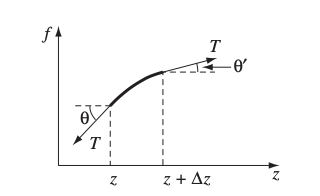

# Electrodynamics II

本笔记是对应 *UIUC PHYS 436 Electromagnetic Fields II*，以及 *UIUC PHYS 435 Electromagnetic Fields I* 最后一部分的学习笔记，其中包括了麦克斯韦方程组、守恒定律、电磁波、辐射以及狭义相对论相关的知识点。由于本篇是物理笔记，其中的数学定理并不一定提供证明，即使有证明也不一定是严格的。主要参考了 *Introduction to Electrodynamics, 4th Edition: David J. Griffiths*，文中大量的例题、图片都来自该教材，章节的编排也基本按照这本书的设计。

[TOC]

$$
\newcommand{\marginbox}[1]{\fbox{$\hphantom{1} {#1} \vphantom{1\over1} \hphantom{1}$}}\nonumber
\newcommand{\rcur}[0]{\mathscr{r}}
\newcommand{\brcur}[0]{\boldsymbol{\mathscr{r}}}
\newcommand{\unit}[1]{\hat{\boldsymbol{#1}}}
\newcommand{\tensor}[1]{\overleftrightarrow{\boldsymbol{#1}}}
$$

## 电动力学

### 欧姆定律

为了让电荷移动产生电流，我们需要对其施加力。假设对单位电荷的力是 $\mathbf{f}$，它产生的电流密度则是：
$$
\begin{equation*}
	\mathbf{J} = \sigma \mathbf{f}
\end{equation*} \tag{7.1} \label{current-density-by-force}
$$
其中 $\sigma$ 是 **电导率（Conductivity）**，和媒介的类型有关。一个相关的概念是 **电阻率（Resistivity）**，记为 $\rho$，定义为电导率的倒数。下面是一些常见媒介的电阻率：

| 材料     | 电阻率（$\ohm\cdot\text{m}$） | 材料                 | 电阻率（$\ohm\cdot\text{m}$） |
| -------- | ----------------------------- | -------------------- | ----------------------------- |
| 银       | $1.59\times 10^{-8}$          | 海水                 | $0.2$                         |
| 铜       | $1.68\times10^{-8}$           | 锗                   | $0.46$                        |
| 金       | $2.21\times10^{-8}$           | 钻石                 | $2.7$                         |
| 铝       | $2.65\times10^{-8}$           | 硅                   | $2500$                        |
| 铁       | $9.61\times10^{-8}$           | 纯水                 | $8.3\times10^3$               |
| 汞       | $9.61\times10^{-7}$           | 玻璃                 | $10^9 - 10^{14}$              |
| 镍铬合金 | $1.08\times10^{-6}$           | 橡胶                 | $10^{13} - 10^{15}$           |
| 锰       | $1.44\times10^{-6}$           | 特富龙（聚四氟乙烯） | $10^{22} - 10^{24}$           |
| 石墨     | $1.6\times10^{-5}$            | 完美导体（不存在）   | $0$                           |

电荷受到力的来源可能是多样的，比如重力、化学力等。本篇中我们只对电磁力感兴趣，所以根据洛伦兹定律有：
$$
\begin{equation*}
	\mathbf{J} = \sigma(\mathbf{E} + \mathbf{v}\times\mathbf{B})
\end{equation*} \tag{7.2} \label{current-density-by-em-field}
$$
由于多数情况下磁场都要远小于电场（反例如等离子体），因此我们省略磁场这一项：
$$
\begin{equation*}
	\marginbox{\mathbf{J} = \sigma \mathbf{E}}
\end{equation*} \tag{7.3} \label{current-density-by-electric-field}
$$
这就是 **欧姆定律（Ohm's Law）**，即电流密度和电导率及施加电场成正比。回忆在前一篇（*Electrodynamics I*）中学到的内容，在导体中的电场处处为零，彼时我们假定没有电流存在，因此 $\mathbf{J} = \mathbf{0}$。现在我们可以断定，对于完美导体（$\sigma = \infty$），即使有电流存在，其内部电场依然处处为零（因为 $\mathbf{E} = \mathbf{J}/\sigma$）。在现实情况下可以理解为，由于导体的电导率非常大，我们只需要近乎为零的电场就能产生一定的电流。

对于恒稳电流和电导率不变的情况下，我们有：
$$
\nabla\cdot \mathbf{E} = \frac{1}{\sigma}\nabla\cdot\mathbf{J} = 0
$$
根据高斯定律，电流媒介内部不存在任何净电荷，所以如果有电荷就一定出现在表面。这个式子也暗示在恒稳电流下，拉普拉斯方程依然有效（$\nabla^2 V = 0$）。

> **例**：一个长度为 $L$ 的圆柱体电阻截面积为 $A$，且其材料的电导率是 $\sigma$。现在假设沿着轴方向施加了一个电场 $\mathbf{E}$，其在圆柱体两端产生的电势差为 $V$。求产生的电流。

> **解**：电阻内部的电场应当是匀强的（我们将马上给出证明），因此电流密度也是匀强的：
> $$
> I = JA = \sigma EA = \frac{\sigma A}{L}V
> $$

实际上，对于任意的 **电极（Electrode）** 对，从一端流向另一端的电流都正比于两端的电势差。这也被称为欧姆定律，其形式是我们在中学阶段就已经见过的：
$$
\begin{equation*}
	\marginbox{V = IR}
\end{equation*} \tag{7.4} \label{ohm's-law}
$$
此处的 $R$ 称为电极之间媒介的 **电阻（Resistance）**，单位为 **欧姆（Ohm）**，记作 $\Omega$。它和媒介的类型、几何性质有关。

如果我们冷静下来仔细考虑欧姆定律的合理性，会发现它有些荒谬。电荷受到电场作用开始加速移动；它产生的电流密度也因此增加，这样下去最终的电流应该是无穷大才对？然而根据欧姆定律，这会产生一个恒定的电流（也就意味着电荷的速度是恒定的），这似乎并不合理。

实际上这是合理的，因为我们需要考虑电荷移动路径上的其他粒子，它们会对电荷造成阻力（发生“碰撞”）。一个类比就是沿着一条路加速行驶，却在每个十字路口停下来。虽然你确实一直在加速，但是每过一段距离就要重复这个从零加速的过程，因此你的 *平均速度* 是恒定的。欧姆定律中的 $I$ 正是反映了这个平均速度。让我们尝试建模计算这个平均速度。假设每段从零加速到特定速度的时间是 $t$，长度是 $\lambda$，加速度为 $a$，那么根据牛顿运动定律，下面的式子应该成立：
$$
t = \sqrt{\frac{2\lambda}{a}}
$$
由于电荷进行的是匀加速，我们有：
$$
v_\text{ave} = \frac{1}{2}at = \sqrt{\frac{\lambda a}{2}}
$$
呃，这和我们预料的可能也不太一样，因为欧姆定律任何电流应该和电势差（也即电场）大小成正比，但这里却是和电场（也即加速度）的平方根大小成正比。事实上，如果考虑热力学性质，我们应该使用下面的公式：
$$
t = \frac{\lambda}{v_\text{thermal}}
$$
此时得到的平均速度就是：
$$
v_\text{ave} = \frac{1}{2}at = \frac{a\lambda}{2v_\text{thermal}}
$$
如果假设单位体积的分子数量为 $n$，单个分子中自由电子个数为 $f$，质量为 $m$，则电流密度是：
$$
\begin{equation*}
	\mathbf{J} = nfe\mathbf{v}_\text{ave} = nfe\frac{\lambda}{2v_\text{thermal}}\frac{\mathbf{F}}{m} = \frac{nf\lambda e^2}{2mv_\text{thermal}}\mathbf{E} \tag{7.5}
\end{equation*}
$$
这是一个描述电导率的模型，其正确描述了导体电导率与移动的电荷个数以及温度的相关性，但并不是精准的公式。

此外，由于电荷运动时经历的碰撞，一部分能量会变为热能，其功率可以通过 **焦耳热定律（Joule Heating Law）** 给出：
$$
\begin{equation*}
	P = VI = I^2R
\end{equation*} \tag{7.6} \label{joule-heating-law}
$$

### 电动势

电路中，电流是由两种力产生的，一个是来自电源的力 $\mathbf{f}_s$，另一个则是用于调节电流的静电力，其依然来源于电源的力。故：
$$
\begin{equation*}
	\mathbf{f} = \mathbf{f}_s + \mathbf{E}
\end{equation*} \tag{7.7}
$$
电源中的力可能来源于化学中的作用力（电池）、光（光电池）、机械压力（压电晶体）等等。无论机制如何，围绕电路一圈的环路积分始终是：
$$
\begin{equation*}
	\marginbox{\mathcal{E} = \oint \mathbf{f}\cdot d\mathbf{l} = \oint \mathbf{f}_s\cdot d\mathbf{l}}
\end{equation*} \tag{7.8} \label{emp}
$$
其中 $\oint\mathbf{E}\cdot d\mathbf{l} = 0$ 被约去了。我们将 $\mathcal{E}$ 称为 **电动势（Electromotive Force, emf）**。最理想的情况，当电源处不存在阻力时（理想电动势源，此时有 $\sigma = \infty$），对电势的净力是 $\mathbf{f} = 0$，我们得到 $\mathbf{E} = -\mathbf{f}_s$。因此电源两端的电势差是：
$$
\begin{equation*}
	V = -\int_a^b\mathbf{E}\cdot d\mathbf{l} = \int_a^b\mathbf{f}_s\cdot d\mathbf{l} = \oint\mathbf{f}_s\cdot d\mathbf{l} = \mathcal{E}
\end{equation*} \tag{7.9}
$$
因此电路中，电源提供的电势差等于电池的电动势。我们也可以理解成，电源对单位电荷做功的大小为 $\mathcal{E}$，这样从负极到负极能够达到 $V = \mathcal{E}$ 的电势差。

#### 动生电动势

一个极为常见的电源是 **发电机（Generator）**，其中用到了 **动生电动势（Motional Emf）**的机制。下面这个非常简单的模型中，阴影部分是方向指入屏幕的磁场 $\mathbf{B}$，一个宽为 $h$ 的环形电路正在向右方以 $v$ 匀速移动，$R$ 是一个电阻为防止无穷大的电流。

此时在切割磁感线的 $a-b$ 端会产生电动势：
$$
\begin{equation*}
	\mathcal{E} = \oint\mathbf{f}_\text{mag}\cdot d\mathbf{l} = vBh
\end{equation*} \tag{7.10} \label{emf-simple}
$$
这个电动势的方向是沿着电路顺时针的，可以使用右手定则来确认：如果用四根手指蜷曲的方向表示产生的电流在环路中的方向，那么大拇指方向和磁场一致。看起来磁场力就是电动势的来源。不过这并不准确，因为磁场从来不可能做功。实际上做功的是拉着电路运动的力，这个力用来抵消磁场对 $a-b$ 段上运动的电荷（方向为右上，同时考虑电动势的作用以及 $v$）的磁力，后者方向为左上。如果我们设 $a-b$ 段电荷竖直方向移动速度为 $\mathbf{u}$，实际移动速度为 $\mathbf{w}$，两者的夹角为 $\theta$，则单位电荷做功为：
$$
\int\mathbf{f}_\text{pull}\cdot d\mathbf{l} = (uB)\left(\frac{h}{\cos\theta}\right)\sin\theta = vBh = \mathcal{E}
$$
现在，让我们推导一个相比 $(\ref{emf-simple})$ 更加普适的电动势推导方式。首先让我们定义 **磁通量（Magnetic Flux）** 的概念：
$$
\begin{equation*}
	\marginbox{\Phi = \int\mathbf{B}\cdot d\mathbf{a}}
\end{equation*} \tag{7.11} \label{magnetic-flux}
$$
对于前面描述的简单模型，我们有 $\Phi = Bhx$，而它和电动势的关系似乎是：
$$
\begin{equation*}
	\marginbox{\mathcal{E} = -\frac{d\Phi}{dt}}
\end{equation*} \tag{7.12} \label{flux-rule}
$$
事实上，对于任意的发电机模型，上面的公式都是成立的。我们将在下面证明这一点：

> **证**：请看下面的参考图：
>
> 
>
> 我们将 $dt$ 间隔的两个磁通量之差近似为对导线上每一点前后连线组成的无数个微小面积 $da$ 的磁通量之和：
> $$
> d\Phi = \Phi_\text{ribbon} = \int_\text{ribbon}\mathbf{B}\cdot d\mathbf{a} \nonumber
> $$
> 现在先着手考虑上面某一点 $P$ 和 $dt$ 事件后的 $P'$，参考上图左侧列出的 $da$ 分析图，我们有：
> $$
> d\mathbf{a} = (\mathbf{v}\times d\mathbf{l})\,dt \nonumber
> $$
> 由磁通量定义 $(\ref{magnetic-flux})$ 有：
> $$
> \frac{d\Phi}{dt} = \oint\mathbf{B}\cdot(\mathbf{v}\times d\mathbf{l}) \nonumber
> $$
> 按照我们此前对 $\mathbf{u}$ 和 $\mathbf{w}$ 的定义，有：
> $$
> \frac{d\Phi}{dt} = \oint\mathbf{B}\cdot(\mathbf{w}\times d\mathbf{l}) = -\oint(\mathbf{w}\times\mathbf{B})\cdot d\mathbf{l} = -\oint\mathbf{f}_\text{mag}\cdot d\mathbf{l} \nonumber
> $$
> 最后一项恰好是电动势的定义。

### 电磁感应

#### 法拉第定律

1831 年，法拉第做了包括下面三个实验在内的多个实验

- 将一个导线环路拉出匀强磁场，后者保持不变。
- 令匀强磁场离开导线环路，后者保持静止。
- 改变匀强磁场大小，其和导线环路的相对位置不变。

上面三种情形下，导线中都会产生电流。因此法拉第认为：*变化的磁场会产生电场*。在狭义相对论的启示下，前两种情况的确是等价的，而第一种情况正是我们此前提到的动生电动势。不过当时并没有相对论的概念，因此法拉第认为第一个实验表明磁场产生了电动势（因为导线环路在运动，而磁场作用于运动的电荷），而第二个实验则表明磁场在运动时会产生电场（因为导体环路是 *静止的*，因此只可能是电场的作用）。第三个实验则证实了他的猜测。

根据法拉第的实验，电动势应该等于磁通量的变化率（这里的电动势是通过电场的环路积分定义的），即：
$$
\begin{equation*}
	\mathcal{E} = \oint \mathbf{E}\cdot d\mathbf{l} = -\frac{d\Phi}{dt} = -\int\frac{\partial \mathbf{B}}{\partial t}\cdot d\mathbf{a}
\end{equation*} \tag{7.13}
$$
这便是 **法拉第定律（Faraday's Law）**。如果利用斯托克斯定理，我们可以将其写为微分的形式：
$$
\begin{equation*}
	\nabla\times\mathbf{E} = -\frac{\partial \mathbf{B}}{\partial t}
\end{equation*} \tag{7.14} \label{faraday's-law-differential}
$$
在匀强磁场中，可以看到 $\oint \mathbf{E}\cdot d\mathbf{l} = 0$，这正是我们此前在静电学中的结论。

我们可以用 **广义通量定律（Universal Flux Rule）** 来概括上面三个实验中出现的现象，其和 $(\ref{flux-rule})$ 形式完全一致：
$$
\begin{equation*}
	\mathcal{E} = -\frac{d\Phi}{dt}
\end{equation*} \tag{7.15} \label{universal-flux-rule}
$$
即无论因为任何原因，当通过某个环路的磁通量变化时，就会在该环路上产生大小为 $\mathcal{E}$ 的电动势。这个定律在上面的三个实验中体现的方式不尽相同。第一个实验只包含磁场和洛伦兹力（此时这个电动势是“磁生”的），而后两个是通过法拉第定律得到的“电生”的电动势。两者的等价性其实相当巧合——这些都会在狭义相对论中得到解释，我们这里只要注意在经典电磁学中它们的区别即可。

如果我们观察感应电流产生的磁通量，会发现它们总是和磁通量变化量相反。比如一个减小的磁通量 $\Phi$（假定某个方向为正向），其感应产生电流的磁通量 $\Phi_i$ 总是大于 $0$ 的。这可以通过 **楞次定律（Lenz's Law）** 概括： *感应产生的磁通量总是尝试抵消改变的磁通量*。

#### 感应电场

根据我们此前的讨论，对于纯粹的法拉第电场（即完全通过磁场产生的电场），下面的等式成立：
$$
\nabla \cdot \mathbf{E} = 0 \qquad \nabla \times \mathbf{E} = -\frac{\partial \mathbf{B}}{\partial t}
$$
它们和下面的等式形式上是等价的：
$$
\nabla \cdot \mathbf{B} = 0 \qquad \nabla\times\mathbf{B} = \mu_0\mathbf{J}
$$
因此我们可以令 $\mathbf{E}, -\frac{\partial \mathbf{B}}{\partial t}$ 分别代替 $\mathbf{B}, \mu_0\mathbf{J}$，并利用毕奥·萨伐特定律得到下面等式：
$$
\begin{equation*}
	\mathbf{E} = -\frac{1}{4\pi}\int\frac{(\partial \mathbf{B}/\partial t)\times\unit{\rcur}}{\rcur^2}\,d\tau = -\frac{1}{4\pi}\frac{\partial}{\partial t}\int\frac{\mathbf{B}\times\unit{\rcur}}{\rcur^2}\,d\tau
\end{equation*} \tag{7.16} \label{biot-savart-law-electric-field}
$$
同时，类比安培定律 $\oint\mathbf{B}\cdot d\mathbf{l} = \mu_0I_\text{enc}$，我们也有积分形式的法拉第定律：
$$
\begin{equation*}
	\oint\mathbf{E}\cdot d\mathbf{l} = -\frac{d\Phi}{d t}
\end{equation*} \tag{7.17} \label{faraday's-law-integral}
$$
最后值得一题的是，在法拉第定律应用的情形总是存在一个 *变化的* 磁场，此时静磁学中我们常用的定律，如毕奥·萨伐特定律、安培定律等都不再准确。幸运的是，在磁场不剧烈震荡，或我们关心无限远处的电磁场时，利用静磁场公式得到的结果误差并不大。我们称这些可以将磁场公式在法拉第定律右侧使用的情形称为 **准静态（Quasistatic）**。通常来讲，只有在考虑电磁波和辐射时我们才不得不仔细考虑如何处理巨大的误差。

> **例**：无限长直导线上有随时间细微变化的电流 $I(t)$。求其产生的感应电场。

> **解**：按照准静态情形分析，磁场强度应为：
> $$
> \mathbf{B} = \frac{\mu_0I}{2\pi s}\unit{s}
> $$
> 再次类比磁场与电流，我们可以得到：
> $$
> \begin{align*}
> \oint\mathbf{E}\cdot d\mathbf{l} = E(s_0)l - E(s)l &= -\frac{d}{dt}\int\mathbf{B}\cdot d\mathbf{a} \\
> &= -\frac{\mu_0I}{2\pi}\frac{dI}{dt}\int_{s_0}^s\frac{1}{s'}\,ds' = -\frac{\mu_0I}{2\pi}\frac{dI}{dt}(\ln{s} - \ln{s_0})
> \end{align*}
> $$
> 因此有：
> $$
> \begin{equation*}
> 	\mathbf{E}(s) = \left(\frac{\mu_0}{2\pi}\frac{dI}{dt}\ln{s} + K\right)\unit{z}
> \end{equation*} \tag{7.18}
> $$
> 此处 $K$ 是一个和 $s$ 无关的常数，不过它还是应该和 $t$ 有关。
>
> 稍等，这个答案并不合理，难不成在无穷远处感应电场无穷大？这个结论是我们“滥用”准静态导致的。由于电磁场以光速 $c$ 运动， 因此每一时刻传递到某点 $s$ 的并不是现在的，而是一段时间以前的磁场（更确切来说，是在某个时间段内，从导线的许多不同位置传过来的磁场）。因此当 $s$ 很大时，此前我们的计算就不准确了。假设 $\tau$ 是令 $I$ 发生“大量”变化的时间，则当：
> $$
> s \ll c\tau \tag{7.19}
> $$
> 成立时，我们可以放心地假设准静态。

#### 电感

假设有两个闭合导线，其中一根导线通恒温电流 $I_1$，其产生的磁场是 $\mathbf{B}_1$。由于通电导线的形状非常复杂，我们难以求出具体的 $\mathbf{B}$，但根据毕奥·萨伐特定律可以得到：
$$
\mathbf{B}_1 = \frac{\mu_0}{4\pi}I_1\oint\frac{d\mathbf{l}_1\times\unit{\rcur}}{\rcur^2}
$$
这是和 $I_1$ 成正比的一个量。此时对于通过另一个导线形成曲面的磁通量：
$$
\begin{equation*}
	\Phi_2 = \int\mathbf{B}_1\cdot d\mathbf{a}_2 = M_{21}I_1
\end{equation*} \tag{7.20}
$$
将 $I_1$ 提出来，剩下的项 $M_{21}$ 只和导线的性质有关，我们称其为两个导线的 **互感（Mutual Inductance）**。这个称呼让我们不禁猜测 $M_{21} = M_{12}$。下面尝试推导出互感的计算公式：
$$
\begin{align*}
	\Phi_2 = \int\mathbf{B}_1\cdot d\mathbf{a}_2 = \int(\nabla\times\mathbf{A}_1)\cdot d\mathbf{a}_2 &= \oint \mathbf{A}_1\cdot d\mathbf{l}_2 \\
	&= \frac{\mu_0}{4\pi}I_1\oint\left(\oint\frac{d \mathbf{l}_1}{\rcur}\right)\cdot d\mathbf{l}_2 \\
	&= \frac{\mu_0}{4\pi}I_1\oint\oint\frac{d\mathbf{l}_1\cdot d\mathbf{l}_2}{\rcur}
\end{align*}
$$
因此互感可以表示为下面的双重积分：
$$
\begin{equation*}
	M = \frac{\mu_0}{4\pi}\oint\oint\frac{d\mathbf{l}_1 \cdot d\mathbf{l}_2}{\rcur} \tag{7.21} \label{neumann-formula}
\end{equation*}
$$
这个公式也被称为 **纽曼公式（Neumann Formula）**。虽然其应用得很少，但证实了我们前面所提到的两点：

- 互感是一个几何性质，只和导线的大小、形状和相对位置等相关。
- 互感是对称的，也即 $M_{21} = M_{12}$。也即，当任一导线通恒温电流电流 $I$ 时，其在另一根导线围成的曲面产生的磁通量等于另一根导线同样通电流 $I$ 时，在该导线围成曲面产生的磁通量。这是一个很神奇的结论。

依然是上面的设置，假设通电导线上的电流发生变化，根据法拉第定律，另一根导线应该相应产生一个感应电动势：
$$
\begin{equation*}
	\mathcal{E}_2 = -\frac{d\Phi_2}{dt} = -M\frac{dI_1}{dt} \tag{7.22}
\end{equation*}
$$
这里假设准静态，因此用到了 $(7.20)$。这个结论颇有意思：任何时候某个电流环路的变化都会在其它导线上产生电动势。事实上它自身也会受到这个变化影响，我们可以仿照之前的推理给出下面的公式：
$$
\begin{equation*}
	\Phi = LI
\end{equation*} \tag{7.23} \label{self-inductance}
$$
此处 $L$ 称为 **自感（Self Inductance）**，或 **电感（Inductance）**，其单位是 **亨利（Henry, H）**，$\text{H} = \text{V}\cdot \text{s}/\text{A}$。对于任何导线环路，在电流产生变化时，其对自己都会产生一个感应电动势，也被称为 **反电动势（Back Emf）**：
$$
\begin{equation*}
	\mathcal{E} = -L\frac{dI}{dt}
\end{equation*} \tag{7.24} \label{emf-by-self-inductance}
$$
电感是改变电流的“阻碍”，某种程度上，我们可以将其与力学中的质量相对照（后者是改变速度的“阻碍”）。

#### 磁场能量

由于反电动势的存在，我们需要一定能量才能让一个导线环路拥有一定的电流。这里我们不考虑流失的热能。由于这个功等同于对抗反电动势，因此有：
$$
\frac{dW}{dt} = -\mathcal{E}I = -LI\frac{dI}{dt}
$$
两边进行积分后得到：
$$
\begin{equation*}
	W = \frac{1}{2}LI^2
\end{equation*} \tag{7.25} \label{magnetic-field-energy}
$$
可见一个电路的能量无关于给其充能的过程，只和几何性质（电感）及最终的电流有关。和电学中得到全空间的电场能量类似，我们也可以尝试通过微积分的方法得到只和磁场强度有关的公式：
$$
LI = \Phi = \int \mathbf{B}\cdot d \mathbf{a} = \int(\nabla\times \mathbf{A})\cdot d\mathbf{a} = \oint \mathbf{A}\cdot d \mathbf{l}
$$
然后将 $LI$ 代入 $(\ref{magnetic-field-energy})$ 中：
$$
W = \frac{1}{2}I\oint\mathbf{A}\cdot d \mathbf{l} = \frac{1}{2}\oint \mathbf{A}\cdot\mathbf{I}\,dl
$$
可以将这个公式扩展到电流体密度的形式：
$$
\begin{equation*}
	W = \frac{1}{2}\int_\mathcal{V}\mathbf{A}\cdot\mathbf{J}\,d\tau
\end{equation*} \tag{7.26}
$$
下面我们将尝试用 $\mathbf{B}$ 代替 $\mathbf{A}$ 和 $\mathbf{J}$。首先根据安培定律可以进行一步化简：
$$
W = \frac{1}{2\mu_0}\int \mathbf{A}\cdot(\nabla\times \mathbf{B})\,d\tau
$$
其中的 $\mathbf{A}\cdot(\nabla\times \mathbf{B})$ 可以参考下面的乘法定律：
$$
\nabla\cdot(\mathbf{A}\times\mathbf{B}) = \mathbf{B}\cdot(\nabla\times\mathbf{A}) - \mathbf{A}\cdot(\nabla\times \mathbf{B})
$$
再根据磁矢势定理，最终有：
$$
W = \frac{1}{2\mu_0}\left(\int_\mathcal{V} B^2\,d\tau - \oint_\mathcal{S}(\mathbf{A}\times\mathbf{B})\cdot d\mathbf{a}\right)
$$
其中 $\mathcal{S}$ 是 $\mathcal{V}$ 周围的曲面。这里我们还是采用和分析电场能量时一样的方法，将 $\mathcal{V}$ 取全空间，此时第二项会无限趋近于 $0$（道理是一样的，面积增长不如势和场之积下跌的速度快），因此第一项就是全空间的磁场能量：
$$
\begin{equation*}
	W = \frac{1}{2\mu_0}\int B^2\,d\tau
\end{equation*} \tag{7.27} \label{magnetic-field-energy-all-space}
$$
看到这里可能会有一个疑问，磁场并不做功，那么构建磁场为什么需要能量呢？答案就在我们推导的过程当中：尽管磁场不做功，但是变化的磁场会产生电场，而电场会做功 *抵抗* 我们构建磁场的行为。

### 麦克斯韦方程组

#### 麦克斯韦对安培定律的修正

至此，我们已经几乎引入了麦克斯韦方程组的所有内容。事实上这正是麦克斯韦之前的电磁场方程，其描述了电场和磁场的散度与梯度：
$$
\begin{align*}
	\text{(i)}& \quad \nabla\cdot \mathbf{E} = \frac{1}{\epsilon_0}\rho & & \text{（高斯定律）}\\
	\text{(ii)}& \quad \nabla\cdot \mathbf{B} = 0 \\
	\text{(iii)}& \quad \nabla\times \mathbf{E} = -\frac{\partial \mathbf{B}}{\partial t} & &\text{（法拉第定律）} \\
	\text{(iv)}& \quad \nabla\times \mathbf{B} = \mu_0\mathbf{J} & & \text{（安培定律）}
\end{align*}
$$
然而，这几个公式之间有不一致的地方：它们理应满足矢量微积分中的运算规律（如旋度的散度恒为 $0$），但考虑安培定律在非恒稳电流的情形（实际上此时该定律是失效的）：
$$
\nabla\cdot(\nabla\times\mathbf{B}) = \mu_0(\nabla\cdot \mathbf{J})
$$
左侧恒为 $0$，但右侧确不恒为 $0$。为了解决这一点，我们可以先将电流密度的散度求出来：
$$
\nabla\cdot \mathbf{J} = -\frac{\partial \rho}{\partial t} = -\frac{\partial}{\partial t}(\epsilon_0\nabla\cdot \mathbf{E}) = -\nabla\cdot\left(\epsilon_0\frac{\partial \mathbf{E}}{\partial t}\right)
$$
因此，安培定律可以被修正为 **安培-麦克斯韦定律（Ampere-Maxwell's Law）**：
$$
\begin{equation*}
	\marginbox{\nabla\times\mathbf{B} = \mu_0\mathbf{J} + \mu_0\epsilon_0\frac{\partial \mathbf{E}}{\partial t}}
\end{equation*} \tag{7.28} \label{revised-ampere's-law}
$$
这个谜一样的辅助项是符合事实的（毕竟谁都不能违背数学定律），但在法拉第的时代始终没有被发现。这是因为它在通常的电磁学实验中很难检测出来。不过涉及电磁波的传播时，这一项会变得至关重要。同时，这一项和法拉第定律有对称的美感：它暗示变化的电场同样也能产生磁场。

我们定义 **位移电流（Displacement Current）** 为：
$$
\begin{equation*}
	\marginbox{\mathbf{J}_d = \epsilon_0\frac{\partial \mathbf{E}}{\partial t}}
\end{equation*} \tag{7.29} \label{displacement-current}
$$
它大体可以理解成某一时刻电流偏移量的微元（更合适的名字或许是位移电流密度，毕竟它并不是电流），在安培定律理应适用却得出不合理结果时可以作为辅助。作为例子，可以参考一个闭合电路上的一个电容。被导线穿过的长方形安培环路上总有：
$$
\oint \mathbf{B}\cdot d\mathbf{l} = \mu_0I_\text{enc}
$$
然而如果考虑一个从电容之间通过的平面，其边缘和之前我们选择的环路一样，此时穿过该平面的电流为 $0$，电场也应该是$0$ 才对，按照静电学中的安培定律，这似乎是一个悖论。不过现在我们有位移电流的帮助，便有：
$$
\begin{equation*}
	\oint\mathbf{B}\cdot d\mathbf{l} = \mu_0I_\text{enc} + \mu_0\epsilon_0\int\left(\frac{\partial \mathbf{E}}{\partial t}\right)\cdot d\mathbf{a}
\end{equation*} \tag{7.30}
$$
即使选择的平面令 $I_\text{enc} = 0$，位移电流这一项依然可以积分出正确的结果。

#### 麦克斯韦方程组

现在我们得到了麦克斯韦方程的完整清单：
$$
\begin{split}
	\text{(i)}& \quad \nabla\cdot \mathbf{E} = \frac{1}{\epsilon_0}\rho & \text{（高斯定律）}\\
	\text{(ii)}& \quad \nabla\cdot \mathbf{B} = 0 \\
	\text{(iii)}& \quad \nabla\times \mathbf{E} = -\frac{\partial \mathbf{B}}{\partial t} &  \text{（法拉第定律）} \\
	\text{(iv)}& \quad \nabla\times \mathbf{B} = \mu_0\mathbf{J} + \mu_0\epsilon_0\frac{\partial \mathbf{E}}{\partial t} \qquad & \text{（安培-麦克斯韦定律）}
\end{split} \tag{7.31} \label{maxwell's-equations}
$$
再加上运动方程，即洛伦兹力定律：
$$
\begin{equation*}
	\mathbf{F} = q(\mathbf{E} + \mathbf{v}\times\mathbf{B})
\end{equation*} \tag{7.32} \label{lorentz-force-law}
$$
我们至此便总结了经典电动力学中的所有公式。所有其它公式都可以从上面的公式推出。下面我们将给出该方程组的一些变形。首先，电磁场的来源 *只可能* 是电荷或电流。因此如果将“源”统一写在右侧，其它项（电磁场的梯度、散度和变化率）写在左侧，麦克斯韦方程组是下面的形式：
$$
\begin{matrix}
	\text{(i)} \quad \nabla\cdot \mathbf{E} = \dfrac{1}{\epsilon_0}\rho & \quad &
	\text{(iii)}  \quad \nabla\times\mathbf{E} + \dfrac{\partial \mathbf{B}}{\partial t} = \mathbf{0} \phantom{xxxxx} \\
	\text{(ii)} \quad \nabla\cdot \mathbf{B} = 0 \phantom{xx} & \quad & \text{(iv)} \quad \nabla\times\mathbf{B} - \mu_0\epsilon_0\dfrac{\partial \mathbf{E}}{\partial t} = \mu_0\mathbf{J}
\end{matrix} \tag{7.33}
$$
总得来说，麦克斯韦方程组描述了电磁场是如何由电荷产生的，而洛伦兹力公式描述了电磁场如何反过来作用于电荷。

#### 磁荷

当考虑 $\rho = 0$ 且 $\mathbf{J} = \mathbf{0}$ 时，麦克斯韦方程组会变为高度对称的形式：
$$
\begin{matrix}
	\nabla \cdot \mathbf{E} = 0 & \quad\quad & \nabla\times\mathbf{E} = -\dfrac{\partial \mathbf{B}}{\partial t} \phantom{xx} \\
	\nabla \cdot \mathbf{B} = 0 & \quad\quad & \nabla\times\mathbf{B} = \mu_0\epsilon_0\dfrac{\partial \mathbf{E}}{\partial t}
\end{matrix}
$$
此时如果将 $\mathbf{E}$ 用 $\mathbf{B}$ 代替，将 $\mathbf{B}$ 用 $-\mu_0\epsilon_0\mathbf{E}$ 代替，我们会发现上下两组方程对换了。然而这个对称性在引入非零的 $\rho$ 与 $\mathbf{J}$ 就会被轻易破坏。这让我们不禁希望在麦克斯韦方程组中加上虚拟的“磁荷”与“磁流“项：
$$
\begin{matrix}
	\text{(i)} \quad \nabla\cdot\mathbf{E} = \dfrac{1}{\epsilon_0}\rho_e & \quad\quad\quad &
	\text{(iii)} \quad \nabla\times\mathbf{E} = -\mu_0\mathbf{J}_m - \dfrac{\partial \mathbf{B}}{\partial t} \phantom{xx}\\
	\text{(ii)} \quad \nabla\cdot\mathbf{B} = \mu_0\rho_m & \quad\quad\quad & \text{(iv)} \quad \nabla\times \mathbf{B} = \mu_0\mathbf{J}_e + \mu_0\epsilon_0\dfrac{\partial \mathbf{E}}{\partial t}
\end{matrix} \tag{7.34} \label{maxwell's-equations-with-magnetic-charge}
$$
其中 $\rho_e$ 与 $\mathbf{J}_e$ 则等同于此前的 $\rho$ 和 $\mathbf{J}$，而 $\rho_m$ 和 $\mathbf{J}_m$ 是我们新引入的量。然而，迄今为止没有任何一项物理实验中得到非零的磁荷与磁流，磁矢势多极展开的单极子项始终是 $0$。这或许暗示我们自然界中，*的确* 不存在与电荷相对应的磁荷。

#### 物质中的麦克斯韦方程组

当考虑到物质中的电极化和磁极化现象时，我们需要使用束缚电荷和束缚电流这两个概念，这是我们在静电学和静磁学中就熟悉的内容：
$$
\begin{align*}
	\rho_b = -\nabla\cdot\mathbf{P} && \mathbf{J}_b = \nabla\times \mathbf{M}
\end{align*} \tag{7.35}
$$
但在非静态情形下，束缚电荷也会产生电流。考虑一个极小的极化物体，其携带的束缚电荷面密度 $\sigma_b = P$，方向在两边完全相反。此时如果 $P$ 进行了微小变化，两边的电流变化等价于：
$$
dI = \frac{\partial \sigma_b}{\partial t}da_\perp = \frac{\partial P}{\partial t}da_\perp
$$
将 $da_\perp$ 移到左侧，我们就得到了电极化产生的电流体密度：
$$
\begin{equation*}
	\mathbf{J}_p = \frac{\partial \mathbf{P}}{\partial t}
\end{equation*} \tag{7.36} \label{polarization-current}
$$
注意 $\mathbf{J}_p$ 和束缚电流 $\mathbf{J}_b$ 没有任何关系。前者是电极化变化时，电荷的运动导致的；后者则通常和带电物体的旋转相关。不难验证极化电流满足守恒性：
$$
\nabla\cdot\mathbf{J}_p = \nabla\cdot\frac{\partial \mathbf{P}}{\partial t} = \frac{\partial}{\partial t}(\nabla\cdot\mathbf{P}) = -\frac{\partial \rho_b}{\partial t}
$$
可见极化电流保证了束缚电荷的守恒性。

另一边，磁极化发生变化时，并不会产生额外的”极化磁流“（诸如此类的东西），而是会直接影响 $\mathbf{J}_b$。至此，我们得到了完整的电荷密度与电流密度公式：
$$
\begin{align*}
\begin{split}
	\rho &= \rho_f + \rho_b = \rho_f - \nabla\cdot\mathbf{P} \\
	\mathbf{J} &= \mathbf{J}_f + \mathbf{J}_b + \mathbf{J}_p = \mathbf{J}_f + \nabla\times\mathbf{M} + \frac{\partial \mathbf{P}}{\partial t}
\end{split}
\end{align*} \tag{7.37}
$$
将它们代入原始的麦克斯韦方程组，我们得到：
$$
\begin{matrix}
	\text{(i)} \quad \nabla\cdot\mathbf{D} = \rho_f & \quad\quad & 
	\text{(iii)} \quad \nabla\times\mathbf{E} = - \dfrac{\partial \mathbf{B}}{\partial t} \phantom{xxx} \\
	\text{(ii)} \quad \nabla\cdot\mathbf{B} = 0 \phantom{x}& \quad\quad & 
	\text{(iv)} \quad \nabla\times\mathbf{H} = \mathbf{J}_f + \dfrac{\partial \mathbf{D}}{\partial t}
\end{matrix} \tag{7.38} \label{maxwell's-equations-in-matter}
$$
相比原来的方程组，常数的噪声消失了（$\epsilon_0$ 和 $\mu_0$），但也因此引入了两个新的场，某种程度上让公式成分更加复杂。对于线性介质，我们有：
$$
\begin{align*}
	\mathbf{D} = \epsilon\mathbf{E} && \mathbf{H} = \frac{1}{\mu}\mathbf{B}
\end{align*} \tag{7.39}
$$
其中 $\epsilon = \epsilon_0(1 + \chi_e)$，$\mu = \mu_0(1 + \chi_m)$，而 $\chi_e, \chi_m$ 和介质特性有关。

#### 边界条件

这一章中，我们似乎一直没有提到边界条件。但边界条件对求解电磁场是必须的，因为所有电磁场都符合 $(\ref{maxwell's-equations-in-matter})$，只有边界条件将它们区分开。为了更好理解，我们首先列出麦克斯韦方程组的积分形式：
$$
\begin{matrix}
	\displaystyle \text{(i)} \quad \oint_\mathcal{S} \mathbf{D}\cdot d\mathbf{a} = Q_\text{enc} & \quad\quad &
	\displaystyle \text{(iii)} \quad \oint_\mathcal{P} \mathbf{E}\cdot d\mathbf{l} = -\frac{d}{dt}\int_\mathcal{S}\mathbf{B}\cdot d\mathbf{a} \phantom{xxxxx} \\
	\displaystyle \text{(ii)} \quad \oint_\mathcal{S}\mathbf{B}\cdot d\mathbf{a} = 0 \phantom{xxx} & \quad\quad &
	\displaystyle \text{(iv)} \quad \oint_\mathcal{P} \mathbf{H}\cdot d\mathbf{l} = I_{f\text{enc}} + \frac{d}{dt}\int_\mathcal{S}\mathbf{D}\cdot d\mathbf{a}
\end{matrix} \tag{7.40} \label{maxwell's-equations-integral}
$$
考虑一个极薄的包围带电平面的立方体，则根据高斯定律有：
$$
\mathbf{D}_\text{top}\cdot\mathbf{a} - \mathbf{D}_\text{bottom}\cdot\mathbf{a} = \sigma_fa
$$
因此：
$$
D_\text{top}^\perp - D_\text{bottom}^\perp = \sigma_f \tag{7.41}
$$
类似地，我们可以轻松得到：
$$
B_\text{top}^\perp - B_\text{bottom}^\perp = 0 \tag{7.42}
$$
接着，考虑一个极小的通过通电平面的环路，我们有：
$$
\mathbf{E}_\text{top}\cdot\mathbf{l} - \mathbf{E}_\text{bottom}\cdot\mathbf{l} = -\frac{d}{dt}\int_\mathcal{S}\mathbf{B}\cdot d\mathbf{a}
$$
右边项在 $\mathcal{S}\to 0$ 时也趋于 $0$，因此我们有：
$$
\mathbf{E}_\text{top}^\parallel - \mathbf{E}_\text{bottom}^\parallel = \mathbf{0} \tag{7.43}
$$
类似地，对于 $\mathbf{H}$ 右侧非零的只有：
$$
I_{f\text{enc}} = \mathbf{K}_f\cdot(\unit{n}\times\mathbf{l}) = (\mathbf{K}_f\times\unit{n})\cdot\mathbf{l}
$$
因此：
$$
\mathbf{H}_\text{top}^\parallel - \mathbf{H}_\text{bottom}^\parallel = \mathbf{K}_f\times\unit{n} \tag{7.44}
$$
特别地，当线性介质中且不存在自由电荷或自由电流时，所有场都是连续的。

## 守恒律

本章我们将探索电动力学中守恒的量，即能量、动量和角动量。我们在此前应该已经见识过电荷的守恒性，这里再推导一遍。首先，单位时间内通过体积 $\mathcal{V}$ 的边界 $\mathcal{S}$ 的电荷量是：
$$
\begin{equation*}
	\frac{dQ}{dt} = -\oint_\mathcal{S}\mathbf{J}\cdot d\mathbf{a}
\end{equation*} \tag{8.1}
$$
利用 $dQ = \rho\,d\tau$ 以及散度定理，我们可以得到：
$$
\begin{equation*}
	\int_\mathcal{V}\frac{\partial \rho}{\partial t}\,d\tau = -\int_\mathcal{V}\nabla\cdot\mathbf{J}\cdot d\tau
\end{equation*} \tag{8.2}
$$
去掉两遍的积分，就有了电荷守恒定律：
$$
\begin{equation*}
	\marginbox{\frac{\partial \rho}{\partial t} = -\nabla \cdot\mathbf{J}}
\end{equation*} \tag{8.3} \label{conservation-of-charge}
$$
尽管我们是通过常识推出的这个结论，它也可以通过麦克斯韦方程推出（上一章中有提到过）。接下来，我们将使用类似地方法描述能量、动量和角动量的守恒性，因此需要建立例如“能量密度”、“动量密度”和“角动量密度”，以及“能量流”、“动量流”、“角动量流”这样的物理量来对应电荷和电流。

### 能量守恒

#### 坡印廷定理

在静电场的能量这一节中（参见上一篇笔记），我们推导出了静电荷分布在全空间的能量：
$$
W_e = \frac{\epsilon_0}{2}\int E^2\,d\tau
$$
我们也通过电磁感应推出了磁场在全空间的能量：
$$
W_m = \frac{1}{2\mu_0}\int B^2\,d\tau
$$
因此将两个公式综合起来就是电磁场在全空间的能量密度：
$$
\begin{equation*}
	\marginbox{u = \frac{1}{2}\left(\epsilon_0E^2 + \frac{1}{\mu_0}B^2\right)}
\end{equation*} \tag{8.4} \label{electromagnetic-energy-density}
$$
接下来我们将验证这个公式，并给出能量在电动力学的守恒律。假设给定一个电荷和电流的设置使得电磁场可以由两个时间相关的函数 $\mathbf{E}$ 和 $\mathbf{B}$ 描述。根据洛伦兹力定律，我们可以给出一个微元时间内电磁场对其中一个电荷 $q$ 的做功：
$$
dW = \mathbf{F}\cdot d\mathbf{l} = q(\mathbf{E} + \mathbf{v}\times\mathbf{B})\cdot \mathbf{v}\,dt = q\mathbf{E}\cdot\mathbf{v}\,dt
$$
这里再次展现出磁场力不做功的特性。对于电荷的微元，我们有 $dq = \rho\,d\tau$，且 $\rho\mathbf{v} = \mathbf{J}$。因此在体积 $\mathcal{V}$ 中的电荷受到做功的功率是：
$$
\begin{equation*}
	\frac{dW}{dt} = \int_\mathcal{V}\mathbf{E}\cdot\mathbf{J}\,d\tau
\end{equation*} \tag{8.5}
$$
从这个式子我们也可以看出单位时间内电磁场对单位体积中电荷的做功是 $\mathbf{E}\cdot\mathbf{J}$。利用安培-麦克斯韦定律 $(\ref{revised-ampere's-law})$，我们可以将 $\mathbf{J}$ 换为 $\mathbf{E}$ 和 $\mathbf{B}$：
$$
\mathbf{E}\cdot\mathbf{J} = \frac{1}{\mu_0}\mathbf{E}\cdot(\nabla\times\mathbf{B}) - \epsilon_0\mathbf{E}\cdot\frac{\partial \mathbf{E}}{\partial t} \tag{8.6}
$$
再由矢量微分的乘法定律：
$$
\nabla\times(\mathbf{E}\times\mathbf{B}) = \mathbf{B}\cdot(\nabla\times\mathbf{E}) - \mathbf{E}\cdot(\nabla\times\mathbf{B})
$$
利用法拉第定律 $(\ref{faraday's-law-differential})$，可以得到：
$$
\mathbf{E}\cdot(\nabla\times\mathbf{B}) = -\mathbf{B}\cdot\frac{\partial \mathbf{B}}{\partial t} - \nabla\cdot(\mathbf{E}\times\mathbf{B})
$$
注意到下面这个有趣的微分规则：
$$
\mathbf{F}\cdot\frac{\partial \mathbf{F}}{\partial t} = \frac{1}{2}\frac{\partial }{\partial t}(F^2)
$$
因此将我们可以将 $(8.6)$ 代换为：
$$
\begin{equation*}
	\mathbf{E}\cdot\mathbf{J} = -\frac{1}{2}\frac{\partial}{\partial t}\left(\epsilon_0 E^2 + \frac{1}{\mu_0}B^2\right) - \frac{1}{\mu_0}\nabla\cdot(\mathbf{E}\times\mathbf{B})
\end{equation*} \tag{8.7}
$$
从这个式子的形式我们就能意识到离最终结果很近了。对两边进行积分可以得到：
$$
\begin{equation*}
	\frac{dW}{dt} = -\frac{d}{dt}\int_\mathcal{V}\frac{1}{2}\left(\epsilon_0 E^2 + \frac{1}{\mu_0}B^2\right) \,d\tau - \frac{1}{\mu_0}\oint_\mathcal{S}(\mathbf{E}\times\mathbf{B})\cdot d\mathbf{a}
\end{equation*} \tag{8.8} \label{poynting's-theorem}
$$
这就是 **坡印廷定理（Poynting's Theorem）**，是电动力学中的功能原理。其中第一项就是体积 $\mathcal{V}$ 中电磁场的能量的变化率，而第二项（根据能量守恒的思想）显然应该反映了能量运出这个体积边界 $\mathcal{S}$ 的速率。我们将它的微分，也即单位时间内被电磁场从单位面积传送出去的能量称为 **坡印廷矢量（Poynting Vector）**：
$$
\begin{equation*}
	\marginbox{\mathbf{S} \equiv \frac{1}{\mu_0}(\mathbf{E}\times\mathbf{B})}
\end{equation*} \tag{8.9} \label{poynting-vector}
$$
因此 $\mathbf{S}\cdot d\mathbf{a}$ 就是通过某个微元面积的法矢量，即“能量通量”。所以我们也可以将 $\mathbf{S}$ 称为 **能量通量密度（Energy Flux Density）**。至此，电磁场的功率可以写成下面的形式：
$$
\begin{equation*}
	\frac{dW}{dt} = -\frac{d}{dt}\int_\mathcal{V}u\,d\tau - \oint_\mathcal{S}\mathbf{S}\cdot d\mathbf{a}
\end{equation*} \tag{8.10}
$$
当 $\mathcal{V}$ 以内不受功的影响，比如它除了边界之外不存在任何电荷时，我们实际上没有做任何功。此时：
$$
\int\frac{\partial u}{\partial t}\,d\tau = -\oint\mathbf{S}\cdot d\mathbf{a} = -\int\nabla\cdot \mathbf{S}\,d\tau
$$
去掉两边的积分，得到：
$$
\begin{equation*}
	\marginbox{\frac{\partial u}{\partial t} = -\nabla\cdot \mathbf{S}}
\end{equation*} \tag{8.12} \label{conservation-of-energy}
$$
这就是电磁场中的能量守恒定律。如果和电荷守恒定律进行对比，不难发现能量密度 $u$ 和电荷密度 $\rho$ 以及能量通量密度 $\mathbf{S}$ 和电流密度 $\mathbf{J}$ 之间的联系。

当然，在大部分情况下，电磁能是没办法守恒的：只要存在任何电荷，就会对其做功，发生能量转换。我们可以用更通用的形式表示能量守恒：
$$
\frac{\partial}{\partial t}(u_\text{em} + u_\text{mech}) = -\nabla\cdot \mathbf{S}
$$

### 动量守恒

#### 电动力学中的牛顿第三定律

如果你有过尝试构建简单的电动力学模型，就会发现磁场力似乎不满足牛顿第三定律：假设两个在某一时刻分别沿着 $x$ 和 $y$ 轴向原点移动的电荷 $q_1$ 和 $q_2$，它们受到对方产生的电场和磁场如下：

电场力之间是方向相反的，但是磁场力并非如此……难道要抛弃牛顿第三定律？这就意味着我们也要抛弃动量守恒！我们不可能做出这样的妥协。为了让电动力学中的动量守恒，我们需要定义电磁场的动量（乍一想可能有些怪异）。经历了电磁场的能量之后，这可能也没有多令人惊讶了。

#### 麦克斯韦应力张量

下面让我们从数学上推导电磁场对其中电荷的力，首先从洛伦兹力定律开始：
$$
\mathbf{F} = \int_\mathcal{V}(\mathbf{E} + \mathbf{v}\times\mathbf{B})\rho\,d\tau = \int_\mathcal{V}(\rho\mathbf{E} + \mathbf{J}\times\mathbf{B})\,d\tau \tag{8.13}
$$
我们将其中单位体积的力单独提出来分析。根据高斯定律和安培-麦克斯韦定律可以得到：
$$
\mathbf{f} = \epsilon_0(\nabla\cdot\mathbf{E})\mathbf{E} + \left(\frac{1}{\mu_0}\nabla\times\mathbf{B} - \epsilon_0\frac{\partial \mathbf{E}}{\partial t}\right)\times \mathbf{B}
$$
我们完全可以至此打住，因为我们可以根据电荷与电流的分布得到电磁场 $\mathbf{E}$ 和 $\mathbf{B}$，然后算出 $\mathbf{f}$。不过麦克斯韦显然对此很不满意：这个式子中出现了电场的散度、磁场的旋度、还有电场的变化率……完全没有对称性。所以他尝试将其规整为高度对称的式子。首先，根据下面的等式：
$$
\frac{\partial}{\partial t}(\mathbf{E}\times\mathbf{B}) = \frac{\partial \mathbf{E}}{\partial t}\times\mathbf{B} + \mathbf{E}\times\frac{\partial \mathbf{B}}{\partial t}
$$
以及法拉第定律 $(\ref{faraday's-law-differential})$，我们有：
$$
\frac{\partial \mathbf{E}}{\partial t}\times\mathbf{B} = \frac{\partial }{\partial t}(\mathbf{E}\times\mathbf{B}) + \mathbf{E}\times(\nabla\times\mathbf{E})
$$
根据下面的等式：
$$
\mathbf{F}\times(\nabla\times\mathbf{F}) = \frac{1}{2}\nabla(F^2) - (\mathbf{F}\cdot\nabla)\mathbf{F}
$$
我们可以将 $\mathbf{E}$ 和 $\mathbf{B}$ 都代入里面的 $\mathbf{F}$。这样就得到了最后的等式：
$$
\mathbf{f} = \epsilon_0 [(\nabla\cdot\mathbf{E})\mathbf{E} + (\mathbf{E}\cdot\nabla)\mathbf{E}] + \frac{1}{\mu_0}[(\nabla\cdot\mathbf{B})\mathbf{B} + (\mathbf{B}\cdot\nabla)\mathbf{B}] - \frac{1}{2}\nabla\left(\epsilon_0 E^2 + \frac{1}{\mu_0}B^2\right) - \epsilon_0\frac{\partial}{\partial t}(\mathbf{E}\times\mathbf{B}) \tag{8.14}
$$
这也太复杂了……好在我们可以引入 **麦克斯韦应力张量（Maxwell Stress Tensor）** 来显著简化上面的式子。记：
$$
\begin{equation*}
	T_{ij} \equiv \epsilon_0\left(E_iE_j - \frac{1}{2}\delta_{ij} E^2\right) + \frac{1}{\mu_0}\left(B_iB_j - \frac{1}{2}\delta_{ij} B^2\right)
\end{equation*} \tag{8.15} \label{maxwell-stress-tensor}
$$
其中 $\delta_{ij}$ 被称为 **克罗内克符号（Kronecker Delta）**，它仅在 $i = j$ 时取 $1$，也即 $\delta_{xx} = \delta_{yy} = \delta_{zz} = 1$。是故：
$$
T_{xx} = \frac{1}{2}\epsilon_0(E_x^2 - E_y^2 - E_z^2) + \frac{1}{2\mu_0}(B_x^2 - B_y^2 - B_z^2) \\
T_{xy} = \epsilon_0(E_xE_y) + \frac{1}{\mu_0}(B_xB_y)
$$
由于 $T_{ij}$ 有两个下标，相当于描述了两个方向（对比矢量只描述一个方向），我们将其称为二阶张量，并记为 $\tensor{T}$。二阶张量可以和矢量进行点积，但是两个方向得到的结果不同：
$$
\left(\mathbf{a}\cdot\tensor{T}\right)_j = \sum_{i = x, y, z} a_{i}T_{ij} \qquad \left(\tensor{T}\cdot\mathbf{a}\right)_j = \sum_{i = x, y, z}T_{ji}a_i \tag{8.16}
$$
从这个运算规则我们可以得到：
$$
\left(\nabla\cdot\tensor{T}\right)_j = \epsilon_0\left[(\nabla\cdot\mathbf{E})E_j + (\mathbf{E}\cdot\nabla)E_j - \frac{1}{2}\nabla_jE^2\right] + \frac{1}{\mu_0}\left[(\nabla\cdot\mathbf{B})B_j + (\mathbf{B}\cdot\nabla)B_j - \frac{1}{2}\nabla_jB^2\right]
$$
我们再和 $(8.14)$ 结合，得到：
$$
\begin{equation*}
	\mathbf{f} = \nabla\cdot\tensor{T} - \epsilon_0\mu_0\frac{\partial \mathbf{S}}{\partial t}
\end{equation*} \tag{8.17}
$$
对两边进行积分，回到我们一开始的洛伦兹力：
$$
\begin{equation*}
	\mathbf{F} = \oint_\mathcal{S}\tensor{T}\cdot d\mathbf{a} - \epsilon_0\mu_0\frac{d}{dt}\int_\mathcal{V}\mathbf{S}\,d\tau
\end{equation*} \tag{8.18}
$$
在静态情况下第二项（变化率）为零，此时力可以表示为体积 $\mathcal{V}$ 的边界 $\mathcal{S}$ 处张量 $\tensor{T}$ 的环面积分：
$$
\begin{equation*}
	\mathbf{F} = \oint_\mathcal{S}\tensor{T}\cdot d\mathbf{a}
\end{equation*} \tag{8.19}
$$
因此张量 $\tensor{T}$ 在物理上的意义是在某个平面上单位面积的力，即 **应力（Stress）**。$T_{ij}$ 代表的是在 $i$ 方向单位面积的作用力对 $j$ 方向的平面分量的作用。因此 $T_{xx}, T_{yy}, T_{zz}$ 代表的是 $x, y, z$ 方向上的 **压强（Pressure）**，而 $T_{xy}, T_{yz}$ 等则代表了不同方向上的 **剪应力（Shear）**。

#### 动量守恒

牛顿第二定律将作用在某物体上的力描述为其动量的变化率，即：
$$
\mathbf{F} = \frac{d\mathbf{p_\text{mech}}}{dt} = -\epsilon_0\mu_0\frac{d}{dt}\int_\mathcal{V}\mathbf{S}\,d\tau + \oint_\mathcal{S}\tensor{T}\cdot d\mathbf{a} \tag{8.20}
$$
这里的 $\mathbf{p}_\text{mech}$ 指的是粒子在体积 $\mathcal{V}$ 中的机械动量。我们不难注意到它和坡印廷定理 $(\ref{poynting's-theorem})$ 的相似性，因此也可以进行类似的解释：第一个积分项代表了体积  $\mathcal{V}$ 中电磁场携带的动量：
$$
\begin{equation*}
	\mathbf{p} = \mu_0\epsilon_0\int_\mathcal{V}\mathbf{S}\,d\tau
\end{equation*} \tag{8.21}
$$
第二个积分项则是单位时间从边界 $\mathcal{S}$ 流出的动量。如果我们将单位体积电磁场的动量记为：
$$
\begin{equation*}
	\mathbf{g} = \epsilon_0\mu_0\mathbf{S} = \epsilon_0(\mathbf{E}\times\mathbf{B})
\end{equation*} \tag{8.22} \label{electromagnetic-momentum}
$$
随后不难得到：
$$
\begin{equation*}
	\marginbox{\frac{\partial \mathbf{g}}{\partial t} = \nabla\cdot\tensor{T}}
\end{equation*} \tag{8.23} \label{conservation-of-momentum}
$$
这就是电磁场中的动量守恒定律。如果探究这个式子左右的含义，就会发现 $\epsilon_0\mu_0\mathbf{S}$ 可以理解为单位体积电磁场的动量，同时 $\mathbf{S}$ 也是单位面积流出的能量（根据能量守恒式）；$-\tensor{T}$ 可以理解为单位面积流出的动量，但 $\tensor{T}$ 也是作用于某平面的应力（根据其定义）。

#### 角动量

至此我们已经得到了电磁场的能量公式 $(\ref{electromagnetic-energy-density})$ 以及动量公式 $(\ref{electromagnetic-momentum})$。角动量可以从动量计算得到：
$$
\begin{equation*}
	\boldsymbol{\ell} = \mathbf{r}\times\mathbf{g} = \epsilon_0\mathbf{r}\times(\mathbf{E}\times\mathbf{B})
\end{equation*} \tag{8.24} \label{electromagnetic-anguar-momentum}
$$
不难发现即使是静态的电磁场依然有动量和角动量（因为 $\mathbf{E}\times\mathbf{B}$ 不为零）。因此只有将电磁场的这些量考虑进来，系统的总动量和总角动量才能守恒。这多少也解释了本节开头牛顿第三定律在电磁场中“不成立”的原因。

## 电磁波

### 波方程

在经典力学中，我们通过弹簧对波已经有了一些认识。**波（Wave）** 是一个连续介质在空间中以特定形状和速度传播形成的分布。考虑到波的传播中存在损耗，其会在移动过程中逐渐变小（体现为振幅变小）；在 **色散介质（Dispersive Medium）** 中，不同频率的波传播速度不同；**驻波（Standing Wave）** 则是不会传播的波（经由多个波的干涉得到的速度为 $0$ 的波）。

现在，我们专注于形状固定速度固定的波，并尝试用一个通用的方程式描述它。考虑到波在空间中的分布以及其与时间相关，我们将用 $f(z, t)$ 来表示一个波。由于任意时刻的波都相当于其在 $t=0$ 时的平移，因此有：
$$
f(z, t) = f(z - vt, 0) = g(z - vt)
$$
因此，形如下面这样的函数是合理的波方程：

- $f(z, t) = Ae^{-b(z-vt)^2}$
- $A\sin[b(z - vt)]$

任何 $z$ 和 $t$ 不能只以 $z - vt$ 形式组合的方程都不是我们要的波方程。

下面，让我们尝试得到所有波都能满足的偏微分方程。让我们用一段绳子的波动模型来模拟任意波的特征，参考下面的示意图：

对于一段绳子上的一点，其附近受到的拉力和该点受到的拉力可以近似为相同的 $T$。此时，绳子横向上变化的力是：
$$
\Delta F = T\sin\theta' - T\sin\theta
$$
这里假设 $\theta$ 是一个很小的量，此时 $\sin\theta \sim \tan\theta$，因此有：
$$
\Delta F \approx T\tan\theta' - T\tan\theta = T\left(\left.\frac{\partial f}{\partial z}\right|_{z + \Delta z} - \left.\frac{\partial f}{\partial z}\right|_z\right) = T\frac{\partial^2 f}{\partial z^2}\Delta z
$$
假设单位长度绳子的质量是 $\mu$，则根据牛顿第二定律：
$$
\Delta F = \mu\Delta z\frac{\partial^2 f}{\partial t^2}
$$
将前面两个式子结合，我们就得到了 **波方程（Wave Equation）**：
$$
\begin{equation*}
	\frac{\partial^2 f}{\partial z^2} = \frac{1}{v^2}\frac{\partial^2 f}{\partial t^2}
\end{equation*}
$$
其中 $v$ 是波的 **传播速度（Speed of Propagation）**，随后我们还有另一个称呼它的名字：
$$
\begin{equation*}
	v = \sqrt{\frac{T}{\mu}}
\end{equation*}
$$
解决这个方程的方法是我们在前一篇笔记中就用到的 **分离变量法（Separation of Variables）**：假设波方程的解可以表示为 $f(z, t) = g(z)h(t)$ 的形式，将 $g(z)$ 和 $h(t)$ 代入方程后得到：
$$
\frac{1}{g}\frac{d^2 g}{dz^2} = \frac{1}{v^2}\frac{1}{h}\frac{d^2 h}{dt^2} = -k^2
$$
其中 $k \in \mathbb{R}$ 是一个常数。此时可以分别解得两个常微分方程的解：
$$
\begin{align*}
	g(z) &= Ae^{ikz} \\
	h(t) &= Be^{i\omega t} + Ce^{-i\omega t}
\end{align*}
$$
其中 **角频率（Angular Frequency）** $\omega = v|k|$，这个等式也被称为 **色散关系（Dispersion Relation）**。上面的两个解看起来并不对称。这是因为 $k$ 可以取正或负数，所以指数项只需要 $ikz$ 而不需要 $-ikz$；然而习惯上 $\omega$ 一定是正数，因此需要两项表示。将两者结合，我们就得到了一个通解：
$$
\begin{equation*}
	f(z, t) = De^{i(kz + \omega t)} + Ee^{i(kz - \omega t)}
\end{equation*}
$$
不难看出第一项是一个向 $-z$ 方向运动的波，而第二项是向 $z$ 方向运动的波。由于 $k$ 可以取 *任意的* 实数，波方程真正的通解应该是所有上面这样的 $f$ 的线性组合，也即下面这个形式：
$$
\begin{equation*}
	f(z, t) = \int_{-\infty}^{\infty}\left( D(k)e^{i(kz - \omega(k)t)} + E(k)e^{i(kz + \omega(k)t)}\right)\,dk
\end{equation*}
$$
至此我们对“常数” $D$ 和 $E$ 尚一无所知。不要忘记，我们的波函数一定是一个实数解！虚数解在当前没有任何意义。因此有一个很重要的限制：
$$
E(k) = D^*(-k)
$$
此条件成立时，前式中积分里的第二项就变成了第一项的共轭，此时有：
$$
\begin{align*}
	f(z, t) &= \int_{-\infty}^\infty \left(D(k)e^{i(kz - \omega(k) t)} + D^*(k)e^{-i(kz - \omega(k)t)}\right)\,dk \\
	&= 2\Re \int_{-\infty}^\infty D(k)e^{i(kz - \omega(k)t)}\,dk
\end{align*}
$$
其中 $\Re$ 表示取复数的实数部分。在一些情况下，复数更易于操作，因此我们定义下面这个辅助波函数：
$$
\begin{equation*}
	\tilde{f}(z, t) = \int_{-\infty}^{\infty}A(k)e^{i(kz - \omega(k)t)}\,dk
\end{equation*}
$$
此处 $A(k) = 2D(k)$。这个定义下，有物理意义的波函数可以写为：
$$
\begin{equation*}
	f(z, t) = \Re \tilde{f}(z, t)
\end{equation*}
$$
在线性变换下，复数形式的波函数和实数形式是等价的，但计算到最后要记得取实数部分。特别地，下面这个波函数的复数解非常常见：
$$
\begin{equation*}
	f(z, t) = Ae^{i(kz - \omega t)}
\end{equation*}
$$
上面讨论的是一维空间的波方程和它的解，但是我们不难将其扩展到三维空间。这里不再深入说明。三维空间的波方程如下：
$$
\begin{equation*}
	\nabla^2 f = \frac{1}{v^2}\frac{\partial^2 f}{\partial t^2}
\end{equation*}
$$
它的复数解如下：
$$
\begin{equation*}
	f(\mathbf{r}, t) = A(\mathbf{k})e^{i(\mathbf{k}\cdot\mathbf{r} - \omega t)}
\end{equation*}
$$
其中，$\mathbf{k}$ 是描述波传播方向的向量，$\omega$ 依然满足之前定义的色散关系。

### 真空中的电磁波

现在让我们回到电磁场。回忆真空中的麦克斯韦方程组在 $\rho = 0$ 且 $\mathbf{J} = \mathbf{0}$ 的情形，此时 $\mathbf{E}$ 和 $\mathbf{B}$ 两个场的散度均为 $0$，但它们的旋度满足：
$$
\nabla \times \mathbf{E} = -\frac{\partial \mathbf{B}}{\partial t} \qquad \nabla \times \mathbf{B} = \mu_0\epsilon_0\frac{\partial \mathbf{E}}{\partial t}
$$
对它们分别再此求旋度，可以得到：
$$
\begin{equation*}
	\nabla^2\mathbf{E} = \mu_0\epsilon_0\frac{\partial^2 \mathbf{E}}{\partial t^2} \qquad \nabla^2 \mathbf{B} = \mu_0\epsilon_0 \frac{\partial^2 \mathbf{B}}{\partial t^2}
\end{equation*}
$$
它们完全满足波方程的定义；这里我们也见识到了位移电流的重要性（否则根本无法化到这样的形式）。特别地，这里的常数 $\mu_0\epsilon_0$ 满足下面的关系：
$$
\begin{equation*}
	c = \frac{1}{\sqrt{\mu_0\epsilon_0}}
\end{equation*}
$$
其中 $c$ 是光速。至此，我们得到了一个难以相信的巧合：电磁场在真空中以光速传播。要知道，$\epsilon_0$ 和 $\mu_0$ 是分别单独从实验中测试得出的，但是它们积居然是光速平方的倒数！这不禁暗示我们光也是某种形式的电磁波。

值得注意的是，上面得到的两个波方程的解都是向量，因此在三维空间中每个都相当于是三个波方程。

#### 单色平面波

由上面的电磁波方程我们可以得到复数解：
$$
\begin{equation*}
	\tilde{\mathbf{E}}(\mathbf{r}, t) = \tilde{\mathbf{E}}_0e^{i(\mathbf{k}\cdot\mathbf{r} - \omega t)} \qquad \tilde{\mathbf{B}}(\mathbf{r}, t) = \tilde{\mathbf{B}}_0e^{i(\mathbf{k}\cdot\mathbf{r} - \omega t)}
\end{equation*}
$$
这里的常数 $\tilde{\mathbf{E}}_0$ 和 $\tilde{\mathbf{B}}_0$ 也是复数。一个将他们变成实数的常用方式是写成如下的形式：
$$
\begin{equation*}
	\tilde{\mathbf{E}}_0 = \mathbf{E}_0e^{i\delta} \qquad \tilde{\mathbf{B}}_0 = \mathbf{B}_0e^{i\delta}
\end{equation*}
$$
后面我们会再谈论这一点。现在为了找到电磁波的更多性质，让我们尝试将解再次代入麦克斯韦方程组。首先是测试它们的散度：
$$
\begin{align*}
	\nabla \cdot \tilde{\mathbf{E}}
	&= \nabla \cdot \tilde{\mathbf{E}}_0e^{i(\mathbf{k}\cdot\mathbf{r} - \omega t)} \\
	&= \left(\tilde{\mathbf{E}}_0^x\frac{\partial}{\partial x} + \tilde{\mathbf{E}}_0^y\frac{\partial}{\partial y} + \tilde{\mathbf{E}}_0^z\frac{\partial}{\partial z} \right) e^{i(k_x\unit{x} + k_y\unit{y} + k_z\unit{z} - \omega t)} \\
	&= \left(ik_x\tilde{\mathbf{E}}_0^x + ik_y\tilde{\mathbf{E}}_0^y + ik_z\tilde{\mathbf{E}}_0^z\right) e^{i(\mathbf{k}\cdot\mathbf{r} - \omega t)} \\
	&= i\mathbf{k}\cdot \tilde{\mathbf{E}}_0 e^{i(\mathbf{k}\cdot\mathbf{r} - \omega t)}
\end{align*}
$$
由于等式左侧一定是 $0$，因此我们得到 $\mathbf{k}\cdot\mathbf{E} = 0$。类似地，$\mathbf{B}$ 也和电磁波传播方向垂直。然后，我们再测试它的旋度：
$$
\begin{align*}
	\nabla\times\tilde{\mathbf{E}}
	&= \nabla \times \tilde{\mathbf{E}}_0e^{i(\mathbf{k}\cdot\mathbf{r} - \omega t)} \\
	&= i\mathbf{k}\times\tilde{\mathbf{E}}_0e^{i(\mathbf{k}\cdot\mathbf{r} - \omega t)} \\
	-\frac{\partial \tilde{\mathbf{B}}_0}{\partial t} &= \omega\tilde{\mathbf{B}}_0
\end{align*}
$$
两个等式相等，因此有：
$$
\tilde{\mathbf{B}}_0 = i\frac{\mathbf{k}}{\omega}\times\tilde{\mathbf{E}}_0e^{i(\mathbf{k}\cdot\mathbf{r} - \omega t)}
$$
回忆此前利用相位差将复数写成实数乘以 $e^{i\delta}$ 的形式，对式子两边求绝对值并去掉所有 $e$ 的指数项（因为它们不影响绝对值大小），有：
$$
|\mathbf{B}_0| = \left|\frac{\mathbf{k}}{\omega}\times\mathbf{E}_0\right| = \frac{1}{c}|\mathbf{E}_0|
$$
如果设 $\mathbf{E}$ 方向的单位矢量为 $\unit{n}$，$\mathbf{B}$ 的方向就可以写成 $\unit{k}\times\unit{n}$。这样我们就得到下面的关系式：
$$
\begin{align*}
	\tilde{\mathbf{E}}_0 &= \tilde{E}_0\unit{n} \qquad \tilde{\mathbf{B}}_0 = \frac{1}{c}\tilde{E}_0(\unit{k}\times\unit{n})
\end{align*}
$$
从上面不难看出电磁波的传播方向、电场方向和磁场方向是相互垂直的，下图是这个结论的直观展示：

最后，我们需要电磁场的实数解，因此要取解的实部：
$$
\mathbf{E} = E_0\unit{n}\cos(\mathbf{k}\cdot\mathbf{r} - \omega t + \delta) \qquad \mathbf{B} = \frac{1}{c}E_0(\unit{k}\times\unit{n})\cos(\mathbf{k}\cdot\mathbf{r} - \omega t + \delta)
$$
我们称上面这种形式的电磁波为 **单色平面波（Monochromatic Plane Wave）**，单色是因为其 $\omega$ 是一个（由 $\mathbf{k}$ 决定的）常数，其对应了固定的频率，在可见光中就是单种颜色。平面波则描述了其“每个垂直于其传播方向的平面上电磁场都处处匀强”这一特点。

#### 电磁波的能量和动量

回忆电磁场的能量密度 $u$ 和动量密度 $\mathbf{g}$。我们可以根据其定义迅速计算出电磁波的能量密度和动量密度：
$$
\begin{align*}
	u &= \frac{1}{2}\left(\epsilon_0 E^2 + \frac{1}{\mu_0} B^2 \right) = \epsilon_0E^2 \\
	\mathbf{g} &= \epsilon_0(\mathbf{E}\times\mathbf{B}) = \frac{1}{c}\epsilon_0E^2\unit{k} = \frac{1}{c}u\unit{k} \\
	\mathbf{S} &= \frac{1}{\mu_0}(\mathbf{E}\times\mathbf{B}) = c\epsilon_0E^2\unit{k} = cu\unit{k}
\end{align*}
$$
第三个式子可以写成 $\mathbf{S} = u\mathbf{c}$ 的形式，可以将其类比 $\mathbf{J} = \rho\mathbf{v}$。不过在现实问题中，由于光的波长极小（约数百纳米），我们通常不关心某一点，而是一段空间的能量和动量，此时我们需要的是它们的平均值。对于函数 $\cos^2 x$，我们可以简单估计其在多个周期的平均值为 $1/2$。因此：
$$
\begin{align*}
	\langle u \rangle &= \frac{1}{2}\epsilon_0E^2 \\
	\langle \mathbf{g} \rangle &= \frac{1}{2c}\epsilon_0E_0^2\unit{k} \\
	\langle \mathbf{S} \rangle &= \frac{1}{2}c\epsilon_0E_0^2\unit{k} 
\end{align*}
$$
特别地，记：
$$
\begin{equation*}
	I = \langle S \rangle = \frac{1}{2}c\epsilon_0 E_0^2
\end{equation*}
$$
为电磁波的 **强度（Intensity）**。值得一提的是光强度产生的 **辐射压（Radiation Pressure）**：当光线被平面 *完全* 吸收时，其动量会转换为对平面的压强：
$$
P = \frac{1}{A}\frac{\Delta p}{\Delta t} = \frac{1}{A}\frac{\langle \mathbf{g}\rangle A c\Delta t}{\Delta t} = \frac{1}{2}\epsilon_0E_0^2 = \frac{I}{c}
$$
如果光线被 *完全* 反射回去，则这个压强会翻倍（因为相当于动量被等量反向了）。如果单纯从电磁场受力的角度分析，可以认为电场让物体表面的电荷移动（方向为 $\unit{n}$），然后磁场对其产生方向为 $\mathbf{k}$ 的作用力。这就是压强的来源。

### 物质中的电磁波

#### 线性介质

在线性介质中，我们有下面的本构关系：
$$
\mathbf{D} = \epsilon\mathbf{E} \qquad \mathbf{H} = \frac{1}{\mu}\mathbf{B}
$$
可以得到基本相同的波方程：
$$
\nabla^2\mathbf{E} = \mu\epsilon\frac{\partial^2 \mathbf{E}}{\partial t^2} \qquad \nabla^2\mathbf{B} = \mu\epsilon\frac{\partial \mathbf{B}}{\partial t^2}
$$
此时，电磁波的速度变成：
$$
\begin{equation*}
	v = \frac{1}{\sqrt{\mu\epsilon}} = \frac{c}{n}
\end{equation*}
$$
其中 **折射率（Index of Refraction）** 定义为：
$$
\begin{equation*}
	n = \sqrt{\frac{\mu\epsilon}{\mu_0\epsilon_0}}
\end{equation*}
$$
值得一提的是，由于在大多数介质中 $\mu \approx \mu_0$，因此 $n \approx \sqrt{\epsilon_r}$。通常 $\epsilon_r > 1$ ，此时 $v < c$。但在 X 射线范围的多数介质 $\epsilon_r < 1$，此时会得到 $v > c$！甚至有一些 **超材料（Meta Material）** 在微波范围内有 $n < 0$。这些“荒谬”的结论似乎违反了相对论，其实不然。我们在后文介绍吸收和色散时会再讲到这一点。

在线性介质中，单色平面波的能量密度是：
$$
\begin{align*}
	u &= \frac{1}{2}(\mathbf{D}\cdot\mathbf{E} + \mathbf{H}\cdot\mathbf{B}) \\
	&= \frac{1}{2}\left(\epsilon E^2 + \frac{1}{\mu}B^2\right) \\
	&= \epsilon E^2
\end{align*}
$$
需要注意上面这种能量的计算方式没有考虑束缚电荷。此时得到的坡印廷矢量是：
$$
\begin{equation*}
	\mathbf{S} = \frac{1}{\mu}\mathbf{E}\times\mathbf{B} = v\epsilon E^2\unit{k} = \frac{1}{n}cu\unit{k}
\end{equation*}
$$
强度是：
$$
\begin{equation*}
	I = \langle \mathbf{S} \rangle = \frac{1}{2n}cu\unit{k}
\end{equation*}
$$

#### 电磁波的反射和透射

现在让我们考虑电磁波在两种介质边界处的行为。假设一条电磁波在 $\epsilon_1$、$\mu_1$ 的介质中以一定角度射向 $\epsilon_2$、$\mu_2$ 的另一种介质。按照我们的常识，可以推测电磁波会发生反射，即以一定角度折回第一种介质；同时，也会有一部分电磁波透射到第二种介质中。让我们将 **入射波（Incident Wave）** 下标记为 $I$，**反射波（Reflected Wave）** 下标记为 $R$，**透射波（Transmissive Wave）** 下标记为 $T$。我们首先假设两种介质边界和 $z$ 轴垂直，参考下图：

此时我们可以列出下面的波方程解：
$$
\begin{align*}
	\text{(I)}
	\begin{cases}
		\displaystyle
		\tilde{\mathbf{E}}_I = \tilde{\mathbf{E}}_{I0}e^{i(\mathbf{k}_I\cdot\mathbf{r} - \omega t)} \\
		\tilde{\mathbf{B}}_I = \dfrac{1}{v_1}\tilde{E}_{I0}\unit{y}e^{i(\mathbf{k}_I\cdot\mathbf{r} - \omega t)}
	\end{cases} &&
	\text{(R)}
	\begin{cases}
		\tilde{\mathbf{E}}_R = \tilde{\mathbf{E}}_{R0}e^{i(\mathbf{k}_R\cdot\mathbf{r} - \omega t)} \\
		\tilde{\mathbf{B}}_R = -\dfrac{1}{v_1}\tilde{{E}}_{R0}\unit{y}e^{i(\mathbf{k}_R\cdot\mathbf{r} - \omega t)}
	\end{cases} &&
	\text{(T)}
	\begin{cases}
		\tilde{\mathbf{E}}_T = \tilde{\mathbf{E}}_{T0}e^{i(\mathbf{k}_T\cdot\mathbf{r} - \omega t)} \\
		\tilde{\mathbf{B}}_T = \dfrac{1}{v_2}\tilde{{E}}_{T0}\unit{y}e^{i(\mathbf{k}_T\cdot\mathbf{r} - \omega t)}
	\end{cases}
\end{align*}
$$
其中入射和反射波满足 $|\mathbf{k}_I| = |\mathbf{k}_R| = \dfrac{\omega}{v_1}$。考虑介质中的边界条件：
$$
\begin{align*}
	& \text{(i)} \quad \epsilon_1E_1^\perp - \epsilon_2E_2^\perp = \sigma_f = 0 \\
	& \text{(ii)} \quad B_1^\perp - B_2^\perp = 0 \\
	& \text{(iii)} \quad E_1^\parallel - E_2^\parallel = 0 \\
	& \text{(iv)} \quad \frac{1}{\mu_1}\mathbf{B}_1^\parallel - \frac{1}{\mu_2}\mathbf{B}_2^\parallel = \mathbf{K}_f\times \unit{n} = \mathbf{0}
\end{align*}
$$
代入第一条可以得到：
$$
\left.\epsilon_1\left(\tilde{E}_{I0}^z e^{i\mathbf{k}_I\cdot \mathbf{r}} + \tilde{E}_{R0}^z e^{i\mathbf{k}_R\cdot\mathbf{r}}\right)\right|_{z=0} = \left.\epsilon_2\tilde{E}_{T0^z}e^{i\mathbf{k}_T\cdot\mathbf{r}}\right|_{z=0}
$$
此处我们可以断言当 $z = 0$ 时有 $\mathbf{k}_I\cdot\mathbf{r} = \mathbf{k}_R\cdot\mathbf{r} = \mathbf{k}_T\cdot\mathbf{r}$；由于 $x$、$y$ 取值可以是任意的，因此我们得到：
$$
k_I^x = k_R^x = k_T^x \qquad k_I^y = k_R^y = k_T^y
$$
因此我们可以假设 $k_I^y = k_R^y = k_T^y = 0$，此时三条波都正好在 $x$-$z$ 平面上，我们称其为 **入射平面（Incidence Plane）**。此时如果让电场的方向在此平面上，我们称此为 **P 极化（P-Polarization）**，磁场方向就正好也在 $y$ 轴平行的方向。对于 $x$ 方向我们可以写出等价的式子：
$$
k_I\sin\theta_I = k_R\sin\theta_R = k_T\sin\theta_T
$$
由此可以得到两个重要的结论，即反射角等于入射角：
$$
\theta_I = \theta_R
$$
以及著名的 **斯涅耳定律（Snell's Law）**：
$$
n_1\sin\theta_I = n_2\sin\theta_T
$$
其暗示了电磁波平行于介质边界平面的速度分量在穿过边界前后不变。

接下来让我们确定 $\tilde{E}_{I0}$ 和 $\tilde{E}_{R0}$ 与 $\tilde{E}_{T0}$ 之间的关系。将波方程解再次代入边界条件：
$$
\begin{align*}
    \text{(i)} &\implies -\epsilon_1\tilde{E}_{I0}\sin\theta_I + \epsilon_1\tilde{E}_{R0}\sin\theta_I = -\epsilon_2\tilde{E}_{T0}\sin\theta_T \\
    &\implies \tilde{E}_{I0} - \tilde{E}_{R0} = \beta\tilde{E}_{T0} \\
    \text{(iii)} &\implies \tilde{E}_{I0}\cos\theta_I + \tilde{E}_{R0}\cos\theta_I = \tilde{E}_{T0}\cos\theta_T \\
    &\implies \tilde{E}_{I0} + \tilde{E}_{R0} = \alpha\tilde{E}_{T0} \\
\end{align*}
$$
其中 $\alpha$ 和 $\beta$ 是和设置相关的常数：
$$
\begin{align*}
	\alpha = \frac{\cos\theta_T}{\cos\theta_I} \qquad \beta = \frac{\epsilon_2n_1}{\epsilon_1n_2} = \frac{\mu_1v_1}{\mu_2v_2}
\end{align*}
$$
这样就可以得到下面的 **菲涅耳公式（Fresnel Formulae）**：
$$
\begin{align*}
	\tilde{E}_{R0} = \frac{\alpha - \beta}{\alpha + \beta}\tilde{E}_{I0} \\
	\tilde{E}_{T0} = \frac{2}{\alpha + \beta}\tilde{E}_{I0}
\end{align*}
$$
需要注意的是，至此我们的结论都是以 P 极化作为前提，在 **S 极化（S-Polarization）**，即电场和入射平面垂直的时候，得到结果略有不同。注意到：
$$
\alpha = \frac{\sqrt{1 - \sin^2\theta_T}}{\cos\theta_I} = \frac{1}{\cos\theta_I}\sqrt{1 - \left(\frac{n_1}{n_2}\sin\theta_I\right)^2}
$$
当 $n_2 > n_1$ 时，如果 $\theta_I \to \pi/2$，我们得到 $\alpha \to \infty$，此时入射波几乎完全反射回去，$\tilde{E}_{R0} \gg \tilde{E}_{T0}$。此外，当 $\alpha = \beta$ 时，所有入射光都会转化为透射光，此时的入射角满足：
$$
\sin^2\theta_I = \frac{1 - \beta^2}{(n_1/n_2)^2 - \beta^2}
$$
我们称这个角度 $\theta_I = \theta_B$ 为 **布鲁斯特角（Brewster Angle）**。如之前所提到的，多数情况下 $\mu_1 \approx \mu_2 \approx \mu_0$，此时可以近似得到：
$$
\tan\theta_B = \frac{n_2}{n_1}
$$
最后，让我们观察三条波的强度关系。$z$ 方向上的强度是：
$$
\begin{align*}
	I_I = \frac{1}{2}\epsilon_1v_1E_{I0}^2\cos\theta_I \\
	I_R = \frac{1}{2}\epsilon_1v_1E_{R0}^2\cos\theta_I \\
	I_T = \frac{1}{2}\epsilon_2v_2E_{T0}^2\cos\theta_T
\end{align*}
$$
它们的比值是：
$$
R = \frac{I_R}{I_I} = \left(\frac{\alpha - \beta}{\alpha + \beta}\right)^2 \\
T = \frac{I_T}{I_I} = \alpha\beta\left(\frac{2}{\alpha + \beta}\right)^2
$$
其中 $R$ 是 **反射系数（Reflection Coefficient）**，$T$ 是 **透射系数（Transmission Coefficient）**。不难观察得到：
$$
R + T = 1
$$
下面是这两个系数关于入射角的函数示意图：

#### 导体中的电磁波

现在让我们考虑物质中存在自由电荷或电流的情形。事实上，当物质是导体时，电磁波中的电场会让其中立刻产生自由电流 $\mathbf{J}_f = \sigma\mathbf{E}$。麦克斯韦方程告诉我们（假设导体是线性介质）：
$$
\begin{align*}
	&\text{(i)}\quad \nabla\cdot\mathbf{E} = \frac{1}{\epsilon}\rho_f & &\text{(iii)} \quad \nabla\times\mathbf{E} = -\frac{\partial \mathbf{B}}{\partial t} \\
	&\text{(ii)}\quad \nabla\cdot\mathbf{B} = 0 & &\text{(iv)}\quad \nabla\times\mathbf{B} = \mu\sigma\mathbf{E} + \mu\epsilon\frac{\partial \mathbf{E}}{\partial t}
\end{align*}
$$
同时由电荷的守恒定律有：
$$
\frac{\partial \rho_f}{\partial t} = -\nabla\cdot\mathbf{J}_f = -\sigma(\nabla\cdot\mathbf{E}) = -\frac{\sigma}{\epsilon}\rho_f
$$
这就能得到自由电荷随时间的变化式：
$$
\rho_f(t) = e^{-(\sigma/\epsilon) t}\rho_f(0)
$$
不难发现无论系统中开始时的自由电荷有多少，其都会随时间衰减。这符合我们的直觉，因为导体中的自由电荷都应该流向其边界。导体的导电性越强（即 $\sigma$ 越大），自由电荷衰减的速度就越快。对于“足够好”的导体，使得自由电荷衰减至可以忽略的时间应该足够小到可以忽略（比如在一个振动系统中，应该满足 $\epsilon/\sigma \ll 1/\omega$）。我们这里假设导体中不存在自由电荷（因为总是可以“快进”到自由电荷衰减到足够小的时刻），此时两个场的散度再次均为 $0$，其旋度则是：
$$
\nabla\times\mathbf{E} = -\frac{\partial \mathbf{B}}{\partial t} \qquad \nabla\times\mathbf{B} = \mu\epsilon\frac{\partial \mathbf{E}}{\partial t} + \mu\sigma\mathbf{E}
$$
对两式再次求旋度可以得到：
$$
\begin{equation*}
	\nabla^2\mathbf{E} = \mu\epsilon\frac{\partial^2\mathbf{E}}{\partial t^2} + \mu\sigma\frac{\partial \mathbf{E}}{\partial t} \qquad \nabla^2\mathbf{B} = \mu\epsilon\frac{\partial^2\mathbf{B}}{\partial t^2} + \mu\sigma\frac{\partial \mathbf{B}}{\partial t}
\end{equation*}
$$
我们在前几节中得到的平面波方程依然满足这个式子：
$$
\begin{equation*}
	\tilde{\mathbf{E}}(z, t) = \tilde{\mathbf{E}}_0e^{i(\tilde{k}z - \omega t)} \qquad
	\tilde{\mathbf{B}}(z, t) = \tilde{\mathbf{B}}_0e^{i(\tilde{k}z - \omega t)}
\end{equation*}
$$
其中 $\tilde{k}^2 = \mu\epsilon\omega^2 + i\mu\sigma\omega$ 是一个复数。为了得到 $\tilde{k}$，我们可以设 $\tilde{k} = k + i\kappa$，通过解方程可以得到：
$$
\begin{align*}
	k = \omega\sqrt{\frac{\epsilon\mu}{2}}\sqrt{\sqrt{1 + \left(\frac{\sigma}{\epsilon\omega}\right)^2} + 1} \qquad
	\kappa = \omega\sqrt{\frac{\epsilon\mu}{2}}\sqrt{\sqrt{1 + \left(\frac{\sigma}{\epsilon\omega}\right)^2} - 1}
\end{align*}
$$
其中的 $k$ 项依然代表了电磁波传播的性质，和它相关的量，比如波长、速度以及折射率都保持不变：
$$
\lambda = \frac{2\pi}{k} \quad v = \frac{\omega}{k} \quad n = \frac{ck}{\omega}
$$
至于 $\kappa$，注意到我们可以将前面的解写成：
$$
\begin{equation*}
	\tilde{\mathbf{E}}(z, t) = \tilde{\mathbf{E}}_0e^{-\kappa z}e^{i(kz - \omega t)} \qquad
	\tilde{\mathbf{B}}(z, t) = \tilde{\mathbf{B}}_0e^{-\kappa z}e^{i(kz - \omega t)}
\end{equation*}
$$
因此 $\kappa$ 项会使得电磁波发生衰减。其衰减的速率（每衰减 $e^{-1}$ 所需的距离）被称为 **趋肤深度（Skin Depth）**：
$$
\begin{equation*}
	d = \frac{1}{\kappa}
\end{equation*}
$$
它描述了电磁波“穿透”到导体中的深度。

随后，和之前分析真空中电磁波类似，我们也可以得到 $\mathbf{E}$、$\mathbf{B}$ 与 $\unit{z}$ 相互垂直的结论，给出下面的式子：
$$
\begin{equation*}
	\tilde{\mathbf{E}}(z, t) = \tilde{E}_0e^{-\kappa z}e^{i(kz - \omega t)}\unit{x} \qquad
	\tilde{\mathbf{B}}(z, t) = \frac{\tilde{k}}{\omega}\tilde{E}_0e^{-\kappa z}e^{i(kz - \omega t)}\unit{y}
\end{equation*}
$$
我们还可以将 $\tilde{k}$ 变成实数 $K$ 乘以一个相位变换，即令 $\tilde{k} = Ke^{i\phi}$，其中 $\phi = \tan^{-1}(\kappa/k)$。此时有：
$$
K = |\tilde{k}| = \sqrt{k^2 + \kappa^2} = \omega\sqrt{\epsilon\mu\sqrt{1 + \left(\frac{\sigma}{\epsilon\omega}\right)^2}}
$$
如果再将 $\tilde{E}_0$ 和 $\tilde{B}_0$ 变为类似的形式，就有：
$$
B_0e^{i\delta_B} = \frac{Ke^{i\phi}}{\omega}E_0e^{i\delta_E} \implies \delta_B - \delta_E = \phi
$$
由此我们可以得到 $\mathbf{E}$ 和 $\mathbf{B}$ 的数量关系：
$$
\frac{B_0}{E_0} = \frac{K}{\omega} = \sqrt{\epsilon\mu\sqrt{1 + \left(\frac{\sigma}{\epsilon\omega}\right)^2}}
$$
我们最终的结论便是：
$$
\begin{align*}
	\mathbf{E}(z, t) &= \phantom{xx|}E_0e^{-\kappa z}\unit{x}\cos(kz - \omega t + \delta_E) \\
	\mathbf{B}(z, t) &= \frac{K}{\omega}E_0e^{-\kappa z}\unit{y}\cos(kz - \omega t + \delta_E + \phi)
\end{align*}
$$
下面是一个示意图：

可以看到导体会自发地（以指数级）削弱其中传播的电磁波。

#### 导体面上的反射

#### 波吸收与色散

现在让我们假设介电系数 $\epsilon$ （以及磁导率 $\mu$）不再是常数，而是一个和电磁波角频率 $\omega$ 相关的函数：
$$
\epsilon = \epsilon(\omega) \qquad \mu = \mu(\omega)
$$
这样的介质我们称为 **色散的（Dispersive）**；当 $\omega$ 不同时，波的传播速度 $v = \omega/|k|$ 是不同的，这也就导致不同颜色的光会分散开来（这也是 **色散（Dispersion）** 得名原因）。同时，回忆我们曾将角频率、速度和波数的关系称为色散关系，其来源也于此。

我们前面提到过，$\mu$ 由于常常和 $\mu_0$ 相当，因此可以被忽略；$\epsilon$ 的来源则是电极化率 $\chi_e$：后者则用于描述物质被极化的能力，它可以用于描述电偶极矩：
$$
\mathbf{p} = \epsilon_0\chi_e\mathbf{E}
$$
当用于描述一个原子的被极化能力时，这里的 $\epsilon_0\chi_e$ 也可以记为 $\alpha$，被称为原子极性（可以回顾上一篇笔记的第四章）。我们可以将其理解为一个原子受到特定电场时被“拉伸”的程度。为了计算这个系数（在我们的假设下它不再是一个常数），我们需要分析原子的势能 $U = U(x)$。量子力学中对于氢原子的分析非常透彻，但相对（过于）繁琐；这里我们依然采用经典力学的分析方法，它可以得到完全一样的结论。首先，利用泰勒级数展开势能：
$$
U(x) = U(0) + xU'(0) + \frac{1}{2}x^2U''(x) + \dots
$$
第一项是一个可以刻意忽略的常数，因为我们可以取任一点为零势能点。第二项则在平衡点附近为零（因为势能的梯度是力）。第三项现在成为了势能中显著的一项；让我们记 $k = m\omega_0^2 = U''(x)$，则：
$$
U(x) \approx \frac{1}kx^2 = \frac{1}{2}m\omega_0^2x^2
$$
注意到这个分析方法其实就是经典力学中对弹簧的分析；它隐含了一个回复力 $F = -kx = -m\omega_0^2x^2$。

考虑存在阻尼力（原因可能是辐射，我们后面章节中会提到）：
$$
F_\text{damping} = -m\gamma\frac{dx}{dt}
$$
同时也考虑存在源于电磁场的驱动力：
$$
F_\text{driving} = qE_0\cos(\omega t)
$$
可以看到我们特地用 $\omega_0$ 来区分这里电磁场的频率 $\omega$。至此我们得到了所有的外力，根据牛顿第二定律：
$$
m\frac{d^2x}{dt^2} = -m\omega_0^2x^2 - m\gamma\frac{dx}{dt} + qE_0\cos(\omega t)
$$
为了便于计算，我们将这个方程拓展到复数域：
$$
m\frac{d^2\tilde{x}}{dt^2} + m\gamma\frac{d\tilde{x}}{dt} + m\omega_0\tilde{x}^2 = qE_0e^{-i\omega t}
$$
该方程的通解是：
$$
\tilde{x}(t) = \tilde{x}_0e^{-i\omega t}
$$
将这个解代入原方程后可以得到 $\tilde{x}_0$：
$$
\tilde{x}_0 = \frac{q/m}{\omega_0^2 - \omega^2 - i\omega\gamma}E_0
$$
回到开头的原子极性，我们最终可以算出电偶极矩为：
$$
\tilde{p}(t) = \frac{q^2/m}{\omega_0^2 - \omega^2 - i\omega\gamma}E_0e^{-i\omega t}
$$
这里，分母中的复数项暗示了 $p$ 和 $\mathbf{E}$ 之间的相位差，这个值确切来说是：
$$
\Delta \phi = \tan^{-1}\frac{\gamma\omega}{\omega_0^2 - \omega^2}
$$
当 $\omega \ll \omega_0$ 时，这个角度可以忽略不计；反之，如果 $\omega \gg \omega_0$，这个角度就约等于 $\pi$。

现在对于单位体积中原子数量为 $N$ 的物质，我们可以粗略估计其极化为：
$$
\tilde{\mathbf{P}} = n\tilde{\mathbf{p}} = \frac{Nq^2/m}{\omega_0^2 - \omega^2 - i\omega\gamma}\tilde{E}(t)
$$
此外，电极化率满足：
$$
\tilde{\chi}_e = \frac{Nq^2/(\epsilon_0m)}{\omega_0^2 - \omega^2 - i\omega\gamma}
$$
同时有介电常数：
$$
\tilde{\epsilon}_r = 1 + \tilde{\chi}_e
$$
现在考虑色散介质中的波方程：
$$
\nabla^2\tilde{\mathbf{E}} = \tilde{\epsilon}\mu_0\frac{\partial^2 \tilde{\mathbf{E}}}{\partial t^2}
$$
得到的解依然是平面波：
$$
\tilde{\mathbf{E}}(z, t) = \tilde{\mathbf{E}}_0e^{i(\tilde{k}z - \omega t)}
$$
其中的波数 $\tilde{k}$ 依然可以写成实部加虚部的形式 $\tilde{k} = k + i\kappa$。此时可以得到类似导体中电磁波的方程：
$$
\tilde{E}(z, t) = \tilde{E}_0e^{-\kappa z}e^{i(kz - \omega t)}
$$
考虑到波的强度正比于电场的平方，因此取：
$$
\alpha = 2\kappa
$$
作为 **吸收系数（Absorption Coefficient）**，其描述了电磁波在某介质中强度衰减的程度。此外，根据色散关系有：
$$
\tilde{k} = \sqrt{\tilde{\epsilon}\mu_0}\omega
$$
回忆折射率满足 $n = c/v$，因此有：
$$
\tilde{n} = c\sqrt{\tilde{\epsilon}\mu_0}\omega = \sqrt{\tilde{\epsilon}_r} = \sqrt{1 + \tilde{\chi}_e} = \sqrt{1 + \frac{Nq^2/(\epsilon_0m)}{\omega_0^2 - \omega^2 -i\omega\gamma}}
$$
值得注意的是，在很多情况下 $\Re{\tilde{n}} < 1$，这意味着 $v > c$。不过这并不违反狭义相对论；电磁波中的能量和信息并不是以 $v$ 传播的；波的正弦曲线上的点可能有很高的传播速度 $v$，称为 **相速（Phase Velocity）**，但其中波包，即波的形状的传播速度 $v_g$ ，称为 **群速（Group Velocity）** 会慢一些。[维基](https://en.wikipedia.org/wiki/Group_velocity)上有非常清晰的动态图演示以对比两者。群速的定义如下：
$$
v_g = \frac{d\omega}{dk}
$$
不过即使是群速，在特殊情况下也可能超越光速，这依然不违反狭义相对论：无论是相速还是群速都不描述实际物体或信息的传播速度，它们都是某种“特征”的速度，其依然限制于电磁波的传播速度 $c$；类似这种人为定义的速度取到多高都是有可能的。

### 导波

#### 波导

此前我们研究的都是无限空间中电磁波的传播；现在让我们考虑一个“管道”中的电磁波，称为 **波导（Wave Guide）**。它由完美导体制成，因此在其内部 $\mathbf{E}$ 和 $\mathbf{B}$ 均为零（后者实际上仅在超导体中成立，不过传统情形下我们可以这么假设）。因此在波导附近有（根据边界条件）：
$$
\mathbf{E}^\parallel = \mathbf{0} \qquad B^\perp = 0
$$
假设波导的延伸方向为 $\unit{z}$，则电磁场的通用解为：
$$
\tilde{\mathbf{E}}(x, y, t) = \tilde{\mathbf{E}}_0(x, y) e^{i(kz - \omega t)} \\
\tilde{\mathbf{B}}(x, y, t) = \tilde{\mathbf{B}}_0(x, y) e^{i(kz - \omega t)}
$$
本节中我们只考虑 $k$ 为实数的情形，因此上面我没有加波浪号。$\tilde{\mathbf{E}}_0$ 和 $\tilde{\mathbf{B}}_0$ 是和 $x$、$y$ 有关的值：
$$
\tilde{\mathbf{E}}_0(x, y) = \tilde{E}_x(x, y)\unit{x} + \tilde{E}_y(x, y)\unit{y} + \tilde{E}_z(x, y)\unit{z} \\
\tilde{\mathbf{B}}_0(x, y) = \tilde{B}_x(x, y)\unit{x} + \tilde{B}_y(x, y)\unit{y} + \tilde{B}_z(x, y)\unit{z}
$$
根据法拉第定律和安培-麦克斯韦定律，可以得到关于这些分量的方程组：
$$
\begin{cases}
	\dfrac{\partial \tilde{E}_y}{\partial x} - \dfrac{\partial \tilde{E}_x}{\partial y} = i\omega \tilde{B}_z \\
	\dfrac{\partial \tilde{E}_z}{\partial y} - ik\tilde{E}_y = i\omega \tilde{B}_x \\
	ik\tilde{E}_x - \dfrac{\partial \tilde{E}_z}{\partial x} = i\omega \tilde{B}_y
\end{cases} \qquad
\begin{cases}
	\dfrac{\partial \tilde{B}_y}{\partial x} - \dfrac{\partial \tilde{B}_x}{\partial y} = -\dfrac{i\omega}{c^2}\tilde{E}_z \\
	\dfrac{\partial \tilde{B}_z}{\partial y} - ik\tilde{B}_y = -\dfrac{i\omega}{c^2}\tilde{E}_x \\
	ik\tilde{B}_x - \dfrac{\partial \tilde{B}_z}{\partial x} = -\dfrac{i\omega}{c^2}\tilde{E}_y
\end{cases}
$$
得到的解是 $\tilde{E}_z$ 和 $\tilde{B}_z$ 相关的式子：
$$
\tilde{E}_x = \frac{i}{(\omega/c)^2 - k^2}\left(k\frac{\partial \tilde{E}_z}{\partial x} + \omega\frac{\partial \tilde{B}_z}{\partial y}\right) \\
\tilde{E}_y = \frac{i}{(\omega/c)^2 - k^2}\left(k\frac{\partial \tilde{E}_z}{\partial y} - \omega\frac{\partial \tilde{B}_z}{\partial y}\right) \\
\tilde{B}_x = \frac{i}{(\omega/c)^2 - k^2}\left(k\frac{\partial \tilde{B}_z}{\partial x} - \frac{\omega}{c^2}\frac{\partial \tilde{E}_z}{\partial y}\right) \\
\tilde{B}_y = \frac{i}{(\omega/c)^2 - k^2}\left(k\frac{\partial \tilde{B}_z}{\partial z} + \frac{\omega}{c^2}\frac{\partial \tilde{E}_z}{\partial x}\right)
$$

将这些等式代入波方程中，可以得到：
$$
\left[\frac{\partial^2}{\partial x^2} + \frac{\partial^2}{\partial y^2} + \frac{\omega^2}{c^2} - k^2\right]E_z(x, y) = 0 \\
\left[\frac{\partial^2}{\partial x^2} + \frac{\partial^2}{\partial y^2} + \frac{\omega^2}{c^2} - k^2\right]B_z(x, y) = 0 \\
$$
特别地，当 $E_z = 0$ 时，我们称其为 **横电波（Traverse Electric Wave, TE Wave）**，如果 $B_z = 0$ 则称为 **横磁波（Traverse Magnetic Wave, TM Wave）**，两者都为零则称为 **横电磁波（Traverse EM Wave, TEM Wave）**。在空腔波导中 **TEM** 波不会出现。

#### 长方形波导中的 **TE** 波

此时只需解磁场的方程。根据分离变量法，设：
$$
B_z(x, y) = X(x)Y(y)
$$
则有：
$$
Y\frac{d^2X}{dx^2} + X\frac{d^2Y}{dy^2} + \left[\frac{\omega^2}{c^2} - k^2\right]XY = 0
$$
令：
$$
\frac{1}{X}\frac{d^2X}{dx^2} = -k_x^2 \qquad \frac{1}{Y}\frac{d^2Y}{dy^2} = -k_y^2
$$
其中 $k_x, k_y$ 满足 $-k_x^2 + k_y^2 +(\omega/c)^2 - k^2 = 0$。不难得到这两个常微分方程的解：
$$
X(x) = A\sin(k_xx) + B\cos(k_xx) \\
Y(y) = C\sin(k_yy) + B\cos(k_yy)
$$
根据边界条件，即 $x = 0$ 或 $x = a$ 时 $B^\perp = B_x = B_y = 0$，因此根据前面的等式关系有：
$$
\left.\frac{\partial B_z}{\partial x}\right|_{x=0} = \left.\frac{\partial B_z}{\partial y}\right|_{y=0} = 0 \implies
\begin{cases}
	\left.(Ak_x\cos(k_xx) - Bk_x\sin(k_xx))\right|_{x=0} = 0 \\\\
	\left.(Ck_x\cos(k_yy) - Dk_y\sin(k_yy))\right|_{y=0} = 0
\end{cases} \implies
A = C = 0
$$
同时：
$$
\left.\frac{\partial B_z}{\partial x}\right|_{x=a} = \left.\frac{\partial B_z}{\partial y}\right|_{y=a} = 0 \implies
\begin{cases}
	-k_xB\sin(k_xa) = 0 \\\\
	-k_yD\sin(k_ya) = 0
\end{cases} \implies
\begin{cases}
	k_x = \dfrac{m\pi}{a} \\\\
	k_y = \dfrac{n\pi}{b}
\end{cases}
$$
其中 $m, n$ 都是整数，且习惯上有 $a \ge b$。至此我们就得到了 TE 波的通解：
$$
B_z(x, y) = B_0\cos\left(\frac{m\pi x}{a}\right)\cos\left(\frac{n\pi y}{b}\right)
$$
对于特定的 $m, n$，我们称这个解为一个 **横电模（TE Mode）**。它还有一个比较复杂的色散关系：
$$
k = \sqrt{\left(\frac{\omega}{c}\right)^2 - \left(\frac{m\pi}{a}\right)^2 - \left(\frac{n\pi}{b}\right)^2}
$$
为了让 $k$ 保持为实数，我们需要让 $\omega > \omega_{mn}$，其中 $\omega_{mn}$ 称为模 $m, n$ 的 **截止频率（Cutoff Frequency）**：
$$
\omega_{mn} = c\pi\sqrt{\left(\frac{m}{a}\right)^2 + \left(\frac{n}{b}\right)^2}
$$
如果 $\omega$ 小于这个频率，我们就没法得到一个稳定传播的波，而是（像之前遇到的一些那样）变成一个指数衰减的波。我们因此可以将色散关系写成：
$$
k = \frac{1}{c}\sqrt{\omega^2 - \omega_{mn}^2}
$$
可以看到，和之前我们见到的许多色散关系不同，导波的色散方程是非线性的，因此它具有很强的色散特征。

TE 波的最小截止频率来自于模 $(1, 0)$：
$$
\omega_{10} = \frac{c\pi}{a}
$$
也就是说，所有比这个频率小的横电波根本不会传播。你或许会疑惑为什么最小截止频率不是 $0$，即模 $(0, 0)$；事实上，此时由于 $k = \omega/c$，我们在[上一节](#波导)推出的公式根本不成立（分母为零）。

最后让我们计算 TE 波的传播速度
$$
v = \frac{\omega}{k} = \frac{c}{\sqrt{1 - (\omega_{mn}/\omega)^2}} > c \\
v_g = \frac{d\omega}{dk} = c\sqrt{1 - \left(\frac{\omega_{mn}}{\omega}\right)^2} < c
$$
这里相速再一次超越了光速，看来已经不是稀事了。

#### 长方形波导中的 **TM** 波

我们采用和上一节中完全一致的方程解法，得到下面的通解：
$$
E_z(x, y) = E_0\sin\left(\frac{m\pi x}{a}\right)\sin\left(\frac{n\pi y}{b}\right)
$$
类似地，我们称其为 $m, n$ 的 **横磁模（TM Model）**，它的截止频率和 TE 波完全一致。不过在这里，最小的截止频率出现在 $(1, 1)$：
$$
\omega_{11} = c\pi\sqrt{\left(\frac{1}{a}\right)^2 + \left(\frac{1}{b}\right)^2}
$$
值得一提的是最小横磁频率和最小横电频率之比：
$$
\frac{\omega_{\text{TM}, 11}}{\omega_{\text{TE}, 10}} = \frac{c\pi\sqrt{(1/a)^2 + (1/b)^2}}{c\pi/a} = \sqrt{1 + \left(\frac{a}{b}\right)^2}
$$

#### 共鸣腔

一个 **共鸣腔（Resonant Cavity）**是一个固定体积的波导（也就是将延伸方向截断了），此时不存在所谓的传播方向，三个方向拥有相同的权重：
$$
\tilde{\mathbf{E}}(x, y, z, t) = \mathbf{E}(x, y, z)e^{-i\omega t} \\
\tilde{\mathbf{B}}(x, y, z, t) = \mathbf{B}(x, y, z)e^{-i\omega t}
$$
将这两个等式代入波方程，可以得到：
$$
\nabla^2 \mathbf{E} = -k^2\mathbf{E} \qquad \nabla^2\mathbf{B} = -k^2\mathbf{B}
$$
其中色散关系为 $k = \omega/c$。上面这两个式子实际上表示了六个方程，每个方程都包含电磁场的一个分量（如 $E_x$）在三个方向上的极化情况。我们可以先解决其中一个分量。和往常一样，利用分离变量法，设 $E_x = X(x)Y(y)Z(z)$，此时有：
$$
\frac{1}{X}\frac{d^2X}{dx^2} = -k_x^2 \qquad \frac{1}{Y}\frac{d^2Y}{dy^2} = -k_y^2 \qquad \frac{1}{Z}\frac{d^2Z}{dz^2} = -k_z^2
$$
其中 $k_x, k_y, k_z$ 满足：
$$
k_x^2 + k_y^2 + k_z^2 = k^2
$$
通解是下面的形式：
$$
X(x) = A\cos(k_xx) + B\sin(k_xx) \\
Y(y) = C\cos(k_yy) + D\sin(k_yy) \\
Z(z) = E\cos(k_zz) + F\sin(k_zz)
$$
根据边界条件，即 $y = 0, y = b$ 或 $z = 0, z = c$ 时 $E_x = 0$，我们可以得到 $C = E = 0$。

## 势与场

本章将探索麦克斯韦方程组的通解。此前在静电场与静磁场中，我们通过引入电势和磁矢势，以解泊松方程的方式变相得到电磁场的解；现在我们需要时间相关的方程解，此时我们的电势和磁矢势不再和时间无关了。

### 势的数学形式

#### 标量势与矢量势

给定了电荷分布 $\rho(\mathbf{r}, t)$ 与电流分布 $\mathbf{J}(\mathbf{r}, t)$，究竟如何得到 $\mathbf{E}(\mathbf{r}, t)$ 和 $\mathbf{B}(\mathbf{r}, t)$？当设定为静电场或静磁场时，我们可以通过库仑定律和毕奥·萨伐特定律得到结果，但这并不适用于麦克斯韦方程组。

我们依然从数学规律中找到突破点。静电场旋度为零，因而我们把它设置为一个梯度场；静磁场散度为零，因而我们把它设置为一个旋度场。现在在一般的情形下，电场的旋度并不为零，但磁场散度依然是零，所以突破口就在这里：
$$
\mathbf{B} = \nabla\times\mathbf{A} \tag{10.1} \label{magnetic-field-from-potential}
$$
这和我们之前定义的磁矢势一致。将其代入法拉第定律：
$$
\nabla\times\mathbf{E} = -\frac{\partial}{\partial t}(\nabla\times\mathbf{A})
$$
这样就得到了一个旋度为零的场：
$$
\nabla\times\left(\mathbf{E} + \frac{\partial \mathbf{A}}{\partial t}\right) = \mathbf{0}
$$
我们将它设为一个梯度场 $-\nabla V$，就得到电场的表达式了：
$$
\mathbf{E} = -\nabla V - \frac{\partial \mathbf{A}}{\partial t} \tag{10.2} \label{electric-field-from-potential}
$$
现在，让我们把用 $\mathbf{A}$ 和 $V$ 表示的 $\mathbf{E}$ 与 $\mathbf{B}$ 代入高斯定律和安培-麦克斯韦定律中，可以分别得到：
$$
\begin{align*}
	\nabla^2V + \frac{\partial }{\partial t}(\nabla\cdot \mathbf{A}) &= -\frac{1}{\epsilon_0}\rho \tag{10.3} \\
	\left(\nabla^2\mathbf{A} - \mu_0\epsilon_0\frac{\partial^2\mathbf{A}}{\partial t^2}\right) - \nabla\left(\nabla\cdot\mathbf{A} + \mu_0\epsilon_0\frac{\partial V}{\partial t}\right) &= -\mu_0\mathbf{J} \tag{10.4}
\end{align*}
$$
（注意这里我们不再假设 $\nabla\cdot\mathbf{A} = 0$）可以说是丑到极致了。我们依稀还能从中看到一些泊松方程的影子，但依然难以想象能够得到这种东西的通解。好在，我们某种程度上确实简化了原来的方程：$\mathbf{E}$ 和 $\mathbf{B}$ 需要解六个方程（因为每个分量都需要），但现在只需要解四个（标量 $V$ 和矢量 $\mathbf{A}$ 的三个方向）。

#### 规范变换

根据 $V$ 和 $\mathbf{A}$ 定义上的特点，我们可以为 $V$ 加上任意的常数，为 $\mathbf{A}$ 加上任何旋度为零的场，上面两个方程依然可能成立（正如我们在电势和磁矢势章节中提到过的）。这就让我们有一些操作空间了。

设 $\boldsymbol{\alpha}$ 和 $\beta$ 是我们对两个势场 $\mathbf{A}$ 和 $V$ 的平移量：
$$
\mathbf{A}' = \mathbf{A} + \boldsymbol{\alpha} \qquad V' = V + \beta \tag{10.5}
$$
这两个平移量满足：
$$
\nabla \times \boldsymbol{\alpha} = \mathbf{0} \implies \boldsymbol{\alpha} = \nabla\lambda
$$
其中 $\lambda$ 是某个标量场。为了让 $\mathbf{E}$ 保持不变，还有一个重要的约束：
$$
\nabla\beta + \frac{\partial \boldsymbol{\alpha}}{\partial t} = \mathbf{0} \implies \nabla\left(\beta + \frac{\partial \lambda}{\partial t}\right) = \mathbf{0}
$$
不难看出括号内的量是和位置无关的，但它可以和时间相关，因此设：
$$
\beta = -\frac{\partial \lambda}{\partial t} + k(t) \tag{10.6}
$$
为了保持公式的简洁，我们可以将 $k$ 并入 $\lambda$ 中，也即为 $\lambda$ 加上 $\int_0^t k(t')\,dt'$。最后得到的式子是：
$$
\left\{
\begin{align*}
	\mathbf{A}' &= \mathbf{A} + \nabla \lambda \\
	V' &= V - \frac{\partial \lambda}{\partial t}
\end{align*}\right. \tag{10.7}
$$
其中 $\lambda(\mathbf{r}, t)$ 是 *任选的* 标量场。任何时候如果为 $\mathbf{A}$ 加上 $\nabla \lambda$，只需同时为 $V$ 减去 $\partial_t \lambda$ 就能保证电磁场的前后一致。我们将这个变换称为 **规范变换（Gauge Transformation）**。接下来，我们会介绍两种重要的规范，它们对前面的两个丑陋不堪的公式进行了显著的美化。

#### 库仑规范与洛伦茨规范

**库仑规范（The Coulomb Gauge）** 中假定：
$$
\nabla\cdot\mathbf{A} = 0 \tag{10.8}
$$
这也是我们在上一篇笔记中磁矢势章节里面假设的。此时 $V$ 会变得非常简洁：
$$
\nabla^2 V = -\frac{1}{\epsilon_0}\rho \tag{10.9}
$$
这就是我们已经熟悉的泊松方程。当假设 $V$ 在无穷远处为 $0$ 时，它的解是：
$$
V(\mathbf{r}, t) = \frac{1}{4\pi\epsilon_0}\int\frac{\rho(\mathbf{r}', t)}{\mathscr{r}}\,d\tau' \tag{10.10}
$$
相对地，$\mathbf{A}$ 的表达式依然丑陋：
$$
\nabla^2\mathbf{A} - \mu_0\epsilon_0\frac{\partial \mathbf{A}}{\partial t^2} = -\mu_0\mathbf{J} + \mu_0\epsilon_0\nabla\left(\frac{\partial V}{\partial t}\right) \tag{10.11}
$$
此外，由于 $V$ 可以被电荷分布直接影响，它不能很好地适应相对论；当我们移动电荷时，即使是远处的电势都仿佛在一瞬间产生了变化一样，这是不合理的。讲到底，$V$ 并不是一个可测量的物理量，真正有效的物理量是 $\mathbf{E}$，它在电荷分布变化时会以电磁波的形式（不超过光速）传递这个变化到远处；但它需要 $\mathbf{A}$ 的同时参与（而 $\mathbf{A}$ 在库仑规范中非常复杂）。

**洛伦茨规范（The Lorenz Gauge）** 中假定：
$$
\nabla\cdot \mathbf{A} = -\mu_0\epsilon_0\frac{\partial V}{\partial t} \tag{10.12}
$$
此时关于 $V$ 和 $\mathbf{A}$ 的公式可以写成：
$$
\left\{
\begin{align*}
	\nabla^2V - \mu_0\epsilon_0\frac{\partial^2 V}{\partial t^2} = -\frac{1}{\epsilon_0}\rho \\
	\nabla^2\mathbf{A} - \mu_0\epsilon_0\frac{\partial^2 \mathbf{A}}{\partial t^2} = -\mu_0\mathbf{J}
\end{align*}\right. \tag{10.13}
$$
这个规律是显而易见的，我们可以定义一个微分算符来简化等式左侧：
$$
\square^2 = \nabla^2 - \mu_0\epsilon_0\frac{\partial^2}{\partial t^2} \tag{10.14}
$$
我们称其为 **达朗贝尔算符（d'Alembertian）**。上面的公式变为：
$$
\left\{
\begin{align*}
	\operatorname{\square^2}V &= -\frac{1}{\epsilon_0}\rho \\
	\operatorname{\square^2}\mathbf{A} &= -\mu_0\mathbf{J}
\end{align*}\right. \tag{10.15}
$$
至此，我们成功将电磁场求解问题完全转化为泊松方程的求解问题，从中我们也能看出电磁场数学上的高度对称性。后文中我们几乎只会使用洛伦茨规范，因此除非特殊说明，均假设 $(10.12)$ 为已知条件。

值得一提的是，库仑规范与洛伦茨规范并非是互斥的；在一些设定中，两者可能同时成立，或同时不成立。

#### 洛伦兹力

我们可以顺便了解洛伦兹力在势场的形式下变成什么样：
$$
\mathbf{F} = q(\mathbf{E} + \mathbf{v}\times\mathbf{B}) = q\left(-\nabla V - \frac{\partial \mathbf{A}}{\partial t} + \mathbf{v}\times(\nabla\times\mathbf{A})\right) \tag{10.16}
$$
回忆 $\nabla(\mathbf{v}\cdot\mathbf{A}) = \mathbf{v}\times(\nabla\times\mathbf{A}) + (\mathbf{v}\cdot\nabla)\mathbf{A}$，因此：
$$
\frac{d\mathbf{p}}{dt} = -q\left(\frac{\partial \mathbf{A}}{\partial t} + (\mathbf{v}\cdot\nabla)\mathbf{A} + \nabla(V - \mathbf{v}\cdot\mathbf{A})\right)
$$
考虑 $\mathbf{A}$ 在时间微元 $dt$ 内的变化：
$$
\begin{align*}
	d\mathbf{A} &= \mathbf{A}(\mathbf{r} + \mathbf{v}\,dt, t + dt) - \mathbf{A}(\mathbf{r}, t) \\
	&= \nabla\mathbf{A}\cdot \mathbf{v}\,dt + \frac{\partial \mathbf{A}}{\partial t}\,dt
\end{align*}
$$
因此：
$$
\frac{d\mathbf{A}}{dt} = \nabla\mathbf{A}\cdot\mathbf{v} + \frac{\partial \mathbf{A}}{\partial t} \tag{10.17}
$$
代入到上面的式子中，就得到了：
$$
\frac{d}{dt}(\mathbf{p} + q\mathbf{A}) = -\nabla[q(V - \mathbf{v}\cdot\mathbf{A})] \tag{10.18}
$$
如果仿照经典力学中，将动量的变化率（力）写作势能的梯度：
$$
\frac{d\mathbf{p}}{dt} = -\nabla U
$$
我们就可以得到 **正则动量（Canonical Momentum）** 的式子：
$$
\mathbf{p}_\text{can} = \mathbf{p} + q\mathbf{A} \tag{10.19} \label{canonical-momentum}
$$
其中 $U$ 取的是速度相关量：
$$
U_\text{vel} = q(V - \mathbf{v}\cdot\mathbf{A}) \tag{10.20}
$$
如果再加上动能，例子的总能量变化率满足：
$$
\frac{d}{dt}(T + qV) = \frac{\partial}{\partial t}[q(V - \mathbf{v}\cdot\mathbf{A})] \tag{10.21}
$$

如果把该式和 $(10.18)$ 对比，可以看到动能与动量、势能与 $\mathbf{A}$ 的对应；从这个角度，我们可以将 $\mathbf{A}$ 理解为单位电荷的“势动量”。

### 连续分布

#### 推迟势

在静态系统中，$(10.15)$ 会转化为四个维度的泊松方程：
$$
\nabla^2 V = -\frac{1}{\epsilon_0}\rho \qquad \nabla^2\mathbf{A} = -\mu_0\mathbf{J}
$$
其解如下：
$$
V(\mathbf{r}) = \frac{1}{4\pi\epsilon_0}\int\frac{\rho(\mathbf{r}')}{\mathscr{r}}\,d\tau' \qquad \mathbf{A}(\mathbf{r}) = \frac{\mu_0}{4\pi}\int\frac{\mathbf{J}(\mathbf{r}')}{\mathscr{r}}\,d\tau'
$$
对于时间有关的系统，现在假设 $V$ 和 $\mathbf{A}$ 都以光速 $c$ 传播，则在 $\mathscr{r}$ 处某一时刻 $t$ 时，受到的其实是之前的一个时刻 $t_r$ 时场的影响，我们称其为 **推迟时间（Retarded Time）**：
$$
t_r = t - \frac{\mathscr{r}}{c}
$$
此时得到的解理应是下面的形式：
$$
V(\mathbf{r}, t) = \frac{1}{4\pi\epsilon_0}\int\frac{\rho(\mathbf{r}', t_r)}{\mathscr{r}}\,d\tau' \qquad \mathbf{A}(\mathbf{r}, t) = \frac{\mu_0}{4\pi}\int\frac{\mathbf{J}(\mathbf{r}', t_r)}{\mathscr{r}}\,d\tau'
$$
我们称其为 **推迟势（Retarded Potential）**。不过我们需要把这两个解代入原方程 $(10.15)$ 以验证其正确性（我们的逻辑推断数学上实际上非常不严谨，同样的逻辑无法应用于 $\mathbf{E}$ 和 $\mathbf{B}$ 场）。此处省略这个略冗长的证明。

数学上，我们也可以定义 **提前时间（Advanced Potential）** 和 **提前势（Advanced Potential）**，虽然它们依然满足洛伦茨规范的势能方程，但它们违反了相对论中重要的 **因果（Causality）** 原理，因此没有物理意义。

#### 杰斐缅柯方程组

本节中让我们给出考虑推迟时间的电磁场方程。回忆由势场给出的电场方程 $(\ref{electric-field-from-potential})$ 和磁场方程 $(\ref{magnetic-field-from-potential})$，时间相关的电场方程不难给出：
$$
\begin{equation*}
	\mathbf{E}(\mathbf{r}, t) 
	= \frac{1}{4\pi\epsilon_0}\int\left[
		\frac{\rho(\mathbf{r}', t_r)}{\mathscr{r}^2}\unit{\mathscr{r}} + 
		\frac{\dot{\rho}(\mathbf{r}', t_r)}{c\mathscr{r}}\unit{\mathscr{r}} - 
		\frac{\dot{\mathbf{J}}(\mathbf{r}', t_r)}{c^2\mathscr{r}}
	\right]\,d\tau'
\end{equation*}
$$
对于磁场，我们可以将其分成两个项：
$$
\nabla\times\mathbf{A} = \frac{\mu_0}{4\pi}\int\left[
	\frac{1}{\mathscr{r}}\nabla\times\mathbf{J} -
	\mathbf{J}\times\nabla\frac{1}{\mathscr{r}}
\right]\,d\tau'
$$
其中的 $\nabla\times\mathbf{J}$ 可以进一步变化：
$$
\begin{align*}
	(\nabla\times\mathbf{J})_x 
	&= \frac{\partial J_z}{\partial y} - \frac{\partial J_y}{\partial z}  \\
	&= \dot{J}_z\frac{\partial t_r}{\partial y} - \dot{J}_y\frac{\partial t_r}{\partial z} \\
	&= \left(-\frac{1}{c}\dot{J}_z\frac{\partial \mathscr{r}}{\partial y}\right) - \left(-\frac{1}{c}\dot{J}_y\frac{\partial \mathscr{r}}{\partial z}\right) \\
	&= \frac{1}{c}(\dot{J}_y\frac{\partial}{\partial z} - \dot{J}_z\frac{\partial}{\partial y})\mathscr{r} \\
	\implies \nabla\times\mathbf{J} 
	&= \frac{1}{c}\dot{\mathbf{J}}\times\unit{\mathscr{r}}
\end{align*}
$$
由此我们得到时间相关的磁场方程：
$$
\begin{equation*}
	\mathbf{B}(\mathbf{r}, t) = \frac{\mu_0}{4\pi}\int\left[
		\frac{\mathbf{J}(\mathbf{r}', t_r)}{\mathscr{r}^2} + \frac{\dot{\mathbf{J}}(\mathbf{r}', t_r)}{c\mathscr{r}}
	\right]\times\unit{\mathscr{r}}\,d\tau'
\end{equation*}
$$
上面这两个式子是麦克斯韦方程组的通解，我们称其为 **杰斐缅柯方程组（Jefimenko's Equations）**，其让麦克斯韦的电磁学理论得到了完善。不过现实中这两个方程很少被应用，因为更方便的方式还是计算推迟势，然后通过它们的微分得到电磁场。

### 点电荷

#### Lienard-Wiechert 势

本节分析单个点电荷以特定路径移动时产生的推迟势。首先，我们不能想当然地认为单个点电荷产生的势就是：
$$
\frac{1}{4\pi\epsilon_0}\frac{q}{\mathscr{r}}
$$
因为我们依然要考虑推迟时间的影响（考虑一个运动的点电荷，其电荷量虽然不变，但是全空间中的电荷密度 $\rho$ 是随时间变化的，此时我们需要调整 $\mathscr{r}$）：
$$
\int\rho(\mathbf{r}', t_r)\,d\tau' = \frac{q}{1 - \unit{\mathscr{r}}\cdot\mathbf{v}/c}
$$
这一点的论证其实非常初等（熟悉狭义相对论的话可能会联想到那里，不过此处和它没有关系），首先考虑一个以速度 $v$ 移动的长棍：

由于光传递的速度有限，长棍在远处反射的光相比近处需要更多的时间才能传到观测者处。因此观测者看到的长棍要比实际上要长。下面等式成立：
$$
\frac{L'\cos\theta}{c} = \frac{L' - L}{v} \implies L' = \frac{1}{1 - v\cos\theta/c}L
$$
特别地，如果将 $\unit{\mathscr{r}}$ 设为观察者的注视方向，我们就得到了和前面一样的系数。需要注意 *只有* 和速度方向一样的维度才会受这个效应影响，因此观测到的体积依然满足这个系数关系：
$$
\tau' = \frac{\tau}{1 - \unit{\mathscr{r}}\cdot\mathbf{v}/c}
$$
这也就推出了我们此前的结论。

现在假设点电荷的运动轨迹为 $\mathbf{w}(t)$，则我们可以通过下式确定对某点 $\mathbf{r}$ 的推迟时间：
$$
|\mathbf{r} - \mathbf{w}(t_r)| = c(t - t_r)
$$
让我们记 $\boldsymbol{\mathscr{r}} = \mathbf{r} - \mathbf{w}(t_r)$。需要注意的是对于任意时刻 $t$，$\mathbf{w}(t_r)$（我们可以称为 **推迟点（Retarded Point）**) 都是唯一的；否则，可以假设有两个对应的点和两个推迟时间：
$$
\mathscr{r}_1 = c(t - t_1) \qquad \mathscr{r}_2 = c(t - t_2)
$$
此时我们有 $\mathscr{r}_1 - \mathscr{r}_2 = c(t_2 - t_1)$，可以发现无论点电荷实际运动方向如何，在 $\mathbf{r}$ 方向的速度分量都是 $c$，这在一般情形下是不可能的。因此我们只能得到 $t_1 = t_2$。

随即我们得到了点电荷的标量势：
$$
\begin{equation*}
	V(\mathbf{r}, t) = \frac{1}{4\pi\epsilon_0}\frac{qc}{\mathscr{r}c - \boldsymbol{\mathscr{r}}\cdot\mathbf{v}}
\end{equation*}
$$
以及矢量势：
$$
\begin{equation*}
	\mathbf{A}(\mathbf{r}, t) = \frac{\mu_0}{4\pi}\frac{qc\mathbf{v}}{\mathscr{r}c - \boldsymbol{\mathscr{r}}\cdot\mathbf{v}} = \frac{\mathbf{v}}{c^2}V(\mathbf{r}, t)
\end{equation*}
$$
我们将上面两个方程给出的物理量称为 **Lienard-Wiechert 势（Lienard-Wiechert Potentials）**。

#### 运动电荷的电磁场

现在，我们可以通过 Lienard-Wiechert 势求解点电荷的电磁场。回忆 $\mathbf{E}$ 和 $\mathbf{B}$ 场满足的等式：
$$
\mathbf{E} = -\nabla V - \frac{\partial \mathbf{A}}{\partial t} \qquad \mathbf{B} = \nabla \times \mathbf{A}
$$
让我们首先计算 $\nabla V$：
$$
\begin{align*}
	\nabla V
		&= \frac{qc}{4\pi\epsilon_0}\frac{-1}{(\rcur c - \brcur\cdot\mathbf{v})^2}\nabla(\rcur c - \brcur\cdot\mathbf{v}) \\
	\nabla \rcur
		&= -c\nabla t_r \\
	\nabla (\brcur\cdot\mathbf{v})
		&= (\brcur\cdot\nabla)\mathbf{v} + (\mathbf{v}\cdot\nabla)\brcur + \brcur\times(\nabla\times\mathbf{v}) + \mathbf{v}\times(\nabla\times\brcur) \\
		&= \underbrace{\left(\rcur_x\frac{\partial}{\partial x} + \rcur_y\frac{\partial}{\partial y} + \rcur_z\frac{\partial}{\partial z}\right)\mathbf{v}(t_r)}_{(\brcur\cdot\nabla)\mathbf{v}}	 + \underbrace{\left(v_x\frac{\partial}{\partial x} + v_y\frac{\partial}{\partial y} + v_z\frac{\partial}{\partial z}\right)\left(v_x\unit{x} + v_y\unit{y} + v_z\unit{z}\right)}_{(\mathbf{v}\cdot\nabla)\mathbf{r}}  - \\
		&\phantom{xx} \underbrace{\left(v_x\frac{\partial}{\partial x} + v_y\frac{\partial}{\partial y} + v_z\frac{\partial}{\partial z}\right)\mathbf{w}}_{(\mathbf{v}\cdot\nabla)\mathbf{w}} + \underbrace{\brcur\times\left[\left(\frac{\partial v_z}{\partial y} - \frac{\partial v_y}{\partial z}\right)\unit{x} + \left(\frac{\partial v_x}{\partial z} - \frac{\partial v_z}{\partial x}\right)\unit{y} + \left(\frac{\partial v_y}{\partial x} + \frac{\partial v_x}{\partial y}\right)\unit{z}\right]}_{\brcur\times(\nabla\times\mathbf{v})} + \\
		&\phantom{xxx} \mathbf{v}\times(\nabla\times\mathbf{r}) - \underbrace{\mathbf{v}\times\left[\left(\frac{\partial w_z}{\partial y} - \frac{\partial w_y}{\partial z}\right)\unit{x} + \left(\frac{\partial w_x}{\partial z} - \frac{\partial w_z}{\partial x}\right)\unit{y} + \left(\frac{\partial w_y}{\partial x} - \frac{\partial w_x}{\partial y}\right)\unit{z}\right]}_{\mathbf{v}\times(\nabla\times\mathbf{w})} \\
		
		&= \underbrace{\rcur_x\frac{d\mathbf{v}}{dt_r}\frac{\partial t_r}{\partial x} + \rcur_y\frac{d\mathbf{v}}{dt}\frac{\partial t_r}{\partial y} + \rcur_z\frac{d\mathbf{v}}{dt_r}\frac{\partial t_r}{\partial z}}_{(\brcur\cdot\nabla)\mathbf{v}} + \underbrace{v_x\unit{x} + v_y\unit{y} + v_z\unit{z}}_{(\mathbf{v}\cdot\nabla)\mathbf{r}} + \underbrace{v_x\frac{d\mathbf{w}}{dt_r}\frac{\partial t_r}{\partial x} + v_y\frac{d\mathbf{w}}{dt_r}\frac{\partial t_r}{\partial y} + v_z\frac{d\mathbf{w}}{dt_r}\frac{\partial t_r}{\partial z}}_{(\mathbf{v}\cdot\nabla)\mathbf{w}} + \\
		&\phantom{xxx} \underbrace{\brcur\times\left[\left(\frac{dv_z}{dt_r}\frac{\partial t_r}{\partial y} - \frac{\partial v_y}{\partial t_r}{\partial z}\right)\unit{x} + \left(\frac{dv_x}{dt_r}\frac{\partial t_r}{\partial z} - \frac{dv_z}{dt_r}\frac{\partial t_r}{\partial x}\right)\unit{y} + \left(\frac{dv_z}{dt_r}\frac{\partial t_r}{\partial x} - \frac{dv_x}{dt_r}\frac{\partial t_r}{\partial y}\right)\unit{z}\right]}_{\brcur\times(\nabla\times\mathbf{v})} + \mathbf{0} + \\
		&\phantom{xxx} \underbrace{\mathbf{v}\times\left[\left(\frac{d\rcur_z}{dt_r}\frac{\partial t_r}{\partial y} - \frac{\partial \rcur_y}{\partial t_r}{\partial z}\right)\unit{x} + \left(\frac{d\rcur_x}{dt_r}\frac{\partial t_r}{\partial z} - \frac{d\rcur_z}{dt_r}\frac{\partial t_r}{\partial x}\right)\unit{y} + \left(\frac{d\rcur_z}{dt_r}\frac{\partial t_r}{\partial x} - \frac{d\rcur_x}{dt_r}\frac{\partial t_r}{\partial y}\right)\unit{z}\right]}_{\mathbf{v}\times(\nabla\times\brcur)} \\
		
		&= \dot{\mathbf{v}}(\brcur\cdot\nabla t_r) + \mathbf{v} + \mathbf{v}(\mathbf{v}\cdot\nabla t_r) - \brcur\times(\dot{\mathbf{v}}\times\nabla t_r) - \mathbf{v}\times(\mathbf{v}\times\nabla t_r) \\
		
		&= \mathbf{v} + (\brcur\cdot\dot{\mathbf{v}} - v^2)\nabla t_r \\
	-c\nabla t_r
		&= \nabla \rcur = \nabla\sqrt{\brcur\cdot\brcur} = \frac{2\sqrt{\brcur\cdot\brcur}}\nabla(\brcur\cdot\brcur) \\
		&= \frac{1}{\rcur}[(\brcur\cdot\nabla)\brcur + \brcur\times(\nabla\times\brcur)] \\
		&= \frac{1}{\rcur}[\brcur - (\brcur\cdot\mathbf{v})\nabla t_r] \qquad \text{（这一步参考了前面对 $(\brcur\cdot\nabla)\mathbf{v}$ 和 $\brcur\times(\nabla\times\mathbf{v})$ 的简化）} \\
	\nabla t_r
		&= -\frac{\brcur}{\rcur c - \brcur\cdot\mathbf{v}}
\end{align*}
$$
最终我们得到的等式是：
$$
\nabla V = \frac{1}{4\pi\epsilon_0}\frac{qc}{(\rcur c - \brcur\cdot\mathbf{v})^3}\left[(\rcur c - \brcur\cdot\mathbf{v})\mathbf{v} - (c^2 - v^2 + \brcur\cdot\dot{\mathbf{v}})\brcur\right]
$$
经过类似（极度繁琐）的约化过程，我们也可以得到 $\mathbf{A}$ 的变化率：
$$
\frac{\partial \mathbf{A}}{\partial t} = \frac{1}{4\pi\epsilon_0}\frac{qc}{\rcur c - \brcur\cdot\mathbf{v})^3}\left[(\rcur c - \brcur\cdot\mathbf{v})(-\mathbf{v} + \rcur\dot{\mathbf{v}}/c) + \rcur(c^2 - v^2 + \brcur\cdot\dot{\mathbf{v}})\mathbf{v}/c\right]
$$
如果记 $\mathbf{a} = \dot{\mathbf{v}}$，且 $\mathbf{u} = c\unit{\rcur} - \mathbf{v}$，就可以得到 $\mathbf{E}$ 场如下的表达式：
$$
\mathbf{E}(\mathbf{r}, t) = \frac{q}{4\pi\epsilon_0}\frac{\rcur}{(\brcur\cdot\mathbf{u})^3}\left[(c^2 - v^2)\mathbf{u} + \brcur\times(\mathbf{u}\times\mathbf{a})\right]
$$
对这个式子求旋度，再经过一些化简可以得到：
$$
\mathbf{B}(\mathbf{r}, t) = \frac{1}{c}\unit{\rcur}\times\mathbf{E}(\mathbf{r}, t)
$$
我们将这个新得到的 $\mathbf{E}$ 场拆分开来，其中第一项称为 **广义库仑场（Generalized Coulomb Field）**：
$$
\mathbf{E} = \frac{1}{4\pi\epsilon_0}\frac{\rcur}{(\brcur\cdot\mathbf{u})^3}(c^2 - v^2)\mathbf{u}
$$
我们也将其称为 **速度场（Velocity Field）**，和等式中第二项相对：其称为 **加速度场（Acceleration Field）**，因为它和加速度有关：
$$
\mathbf{E} = \frac{1}{4\pi\epsilon_0}\frac{\rcur}{(\brcur\cdot\mathbf{u})^3}\brcur\times(\mathbf{u}\times\mathbf{a})
$$
这一项由于多乘了一个距离 $\rcur$，因此在远距的情况下会成为 $\mathbf{E}$ 场的主要部分。它对电磁辐射有较大意义，因此我们也称其为 **辐射场（Radiation Field）**。

最后，让我们用洛伦兹力结束这一节：
$$
\mathbf{F} = \frac{qQ}{4\pi\epsilon_0}\frac{\rcur}{(\brcur\cdot\mathbf{u})^3}\bigg\{
	\underbrace{(c^2 - v^2)\mathbf{u} + \brcur\times(\mathbf{u}\times\mathbf{a})}_{\mathbf{E} 相关项} + \frac{\mathbf{V}}{c}\times\underbrace{\left[\brcur\times[(c^2 - v^2)\mathbf{u} + \brcur\times(\mathbf{u}\times\mathbf{a})]\right]}_{\mathbf{B} 相关项}
\bigg\}
$$
其中 $\mathbf{V}$ 是测试电荷 $Q$ 的速度，而 $\brcur$、$\mathbf{u}$、$\mathbf{v}$ 和 $\mathbf{a}$ 都是在推迟时间处测量的量。至此，我们已经将电动力学的经典理论介绍完毕。回忆第一篇笔记开头时，我们说过电动力学是研究不同运动状态的电荷之间作用的学科；上面的公式就是不考虑相对论效应的终极描述。

## 辐射

电动力学中的 **辐射（Radiation）** 描述了电磁场传递能量（这个能量假定为不可逆地传递到无穷远处，否则就不称为辐射）的性质；所有坡印廷矢量不为零的场中都存在电磁辐射：
$$
P(r, t) = \oint \mathbf{S}\cdot d\mathbf{a} = \frac{1}{\mu_0}\oint(\mathbf{E}\times\mathbf{B})\cdot d\mathbf{a}
$$
由于能量传递的速度受束于光速，某一时刻 $t$ 某一点的能量其实来自于 $t_0 = t - r/c$ 时刻的源，即：
$$
P_\text{rad}(t_0) = \lim_{r\to\infty} P\left(r, t_0 + \frac{r}{c}\right)
$$
注意到对于离源点等距的曲面（即球面）的面积正比与 $r^2$，因此辐射的强度必须以 $1/r^2$（或更慢的速度）衰减，否则 $P_\text{rad}$ 很快就会跌为 $0$，此时不存在辐射。我们可以首先考虑静态的情形；由于 $\mathbf{E}$ 和 $\mathbf{B}$ 都正比于 $1/r^2$，坡印廷矢量正比于 $1/r^4$，因此静态系统中无辐射。相比之下，时间相关的系统中（根据杰斐缅柯方程组）电磁场存在与 $1/r$ 成正比的项，此时很有可能存在电磁辐射。

本章中，我们会研究一些时间相关的电磁场分布，得到坡印廷矢量后在无穷远处对一个球面积分，最终的结果就是这个系统的辐射。

### 偶极子辐射

