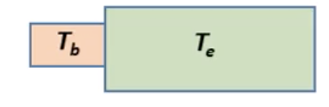

# Thermal Physics

本篇是 *UIUC PHYS 213 Univ Physics: Thermal Physics* 的学习笔记。

[TOC]

**热动力学（Thermodynamics）** 是对经典力学的一个补充。在后者的学习中，我们时常会忽略物体内部分子能量的变化，而物体的多个平衡状态之间往往和能量有关。热动力学考虑了微观尺度下的能量，并用一些宏观尺度的物理量（比如温度）来概括它们的特性，阐释能量流向的规律，使得之前我们学到过的能量守恒定律更加完善。

现举一个经典力学中的一个不会考虑的例子。如下图所示，一个力 $\mathbf{F}$ 拖着两根连着小球的线向前移动：

根据能量守恒定律，这个系统的总能量变化等于 $\mathbf{F}$ 做的功，它也等于两个小球的动能之和。我们可以用下面的式子概括：
$$
\begin{equation*}
	K_\text{system} = K_\text{CM} + K_\text{REL} \implies FD = Fd_\text{CM} + K_\text{REL}
\end{equation*}
$$
其中 $K_\text{CM}$ 是两个小球质心的动能，$K_\text{REL}$ 是两个小球相对于质心的动能。然而，当两个小球因为力的作用最终碰撞时（如下图所示），它们相对于质心的动能“消失”了：

根据能量守恒，一定有某个能量代替了失去的动能：
$$
\begin{equation*}
	K_\text{system} = FD = Fd_\text{CM} + ???
\end{equation*}
$$
实际上，由于两个小球的非弹性碰撞，组成它们的分子会产生更剧烈的运动，这样我们就可以引入 **内能（Internal Energy）** 的概念：
$$
\begin{equation*}
	\Delta E_\text{internal} = W_\text{net} - \Delta K_\text{CM} 
\end{equation*} \label{internal-energy} \tag{1}
$$
内能中的一部分反应了分子的动能。当小球进行碰撞时，机械能转化为内能。这是对经典力学里能量守恒定律中缺失的部分的概括，即对系统的做功等于系统质心的动能变化和它的内能变化之和。后面我们会更加深入地了解其中的量化信息。

## 平衡状态

### 熵与系统状态

让我们接着前面的内容，引入 **热力学第一定律（First Law of Thermodynamics）**：
$$
\begin{equation*}
	\Delta U = W_\text{net} + Q
\end{equation*} \label{first-law-thermodynamics} \tag{2}
$$

上面的公式描述了系统质心的动能不改变时，对内能造成影响的因素。其中 $\Delta U$ 是内能的变化值（更常用的写法），$Q$ 是外界直接提供的热能。由此可见，我们可以通过做功或者加热的方式提高系统的内能。

即使有这样的守恒公式，我们也发现它们并不像过去接触到的动能和势能那样可以轻松地相互转化；相反有些能量的转化似乎是 **不可逆（Irreversible）** 的。比如在粗糙地面上运动的小块动能会变为 $0$，全部转化为内能，但是我们似乎从来不会看到一个静止的小块自发地开始运动并消耗内能（比如开始降温）。类似地，夏天经太阳照射的冰块会融化为水，再变为水蒸气；但是反过来的情形我们从来没有经历过。这给我们一个重要的启示：

> 不可逆现象的原因是，能量流动总朝向使得系统拥有更多状态数量的状态移动。达到最多状态数量时，我们称系统处于 **平衡（Equilibrium）** 状态。

这句话可能比较难以理解。我们可以先将其中的 *状态数量* 理解成分子分布的可能性。在太阳融化冰块的例子中，冰块中的分子排布地非常紧密，而水其次；排布最自由的水蒸气可以自由地移动在空气中。因此我们看到，经过太阳照射后，冰块会变为液态，然后是气态。

为了更好地理解，请看下面的例子。一个封闭的盒子中有一个隔板将盒子相等地分成两个部分。一开始所有的分子都在隔板左侧。此时分子系统的状态数量是每个分子分布状态数量的乘积。假设每个分子分布状态数量为 $\Omega$，而一共有 $N$ 个分子，则总的状态数量为：
$$
\begin{equation*}
	\mathcal{N}_\text{total} = \prod_{i=1}^N\mathcal{N}_i = \Omega^N
\end{equation*} \tag{3}
$$
当隔板被移除时，每个分子分布的状态数量变成了 $2\Omega$（这是因为它们能够到达地体积翻倍了），此时总的状态数量就变成了：
$$
\begin{equation*}
	\mathcal{N}_\text{total}' = \prod_{i=1}^N\mathcal{N}_i' = (2\Omega)^N = 2^N\mathcal{N}_\text{total}
\end{equation*}
$$
可以看到此时系统的状态数量以指数级增长。为了方便地记录这个变化，我们引入 **熵（Entropy）** 的概念，它正比于系统状态数量的自然对数，即：
$$
\begin{equation*}
	S = k\ln{\mathcal{N}}
\end{equation*} \label{entropy} \tag{4}
$$
上面的情形中，我们可以计算出隔板拿掉前后，熵的变化值：
$$
\begin{equation}
	\Delta S = k\ln{\mathcal{N}_\text{total}'} - k\ln{\mathcal{N}_\text{total}} = kN\ln{2}
\end{equation}
$$
现在让我们假设隔板两边分别有 $N_L, N_R$ 个分子，且隔板可以自由移动。此时隔板处于什么样的位置时才能达到平衡呢？我们首先可以设 $\Omega_L, \Omega_R$ 是隔板两侧的每个分子的状态数量，它们应该分别和两侧的体积 $V_L, V_R$ 成正比。因此，就可以得到总的状态数量：
$$
\begin{equation*}
	\Omega_\text{total} = \Omega_L\Omega_R \propto V_L^{N_L}V_R^{N_R}
\end{equation*}
$$
系统最终应该有最多的状态数量。由于它正比于系统的熵，我们可以通过熵来研究：
$$
\begin{equation}
	S_\text{total} = k\ln\Omega_\text{total} = kN_L\ln{V_L} + kN_R\ln{V_R}
\end{equation}
$$
为了让系统的熵达到最大值，我们应该计算它关于其中一部分体积的导数，即 $\frac{dS}{dV_L} = 0$：
$$
\begin{equation*}
	\frac{dS}{dV_L} = \frac{kN_L}{V_L} - \frac{kN_R}{V_R} = 0 \implies \frac{N_L}{V_L} = \frac{N_R}{V_R}
\end{equation*}
$$
上面的例子中，体积和分子具体的状态数量存在对应关系。我们将它们分别成为 **宏观状态（Macrostate）** 和 **微观状态（Microstate）**。微观状态往往会极为复杂且难以预测，相比之下宏观状态更容易通过统计规律计算得到，这也是热动力学中研究的方向。日常生活中，其它的一些和统计相关的活动也可以用宏观和微观状态来描述。比如连续翻 10 次硬币，微观状态就是它每次翻出来的正反性，而宏观状态则是 10 次中正面（或反面）朝上的次数。不难发现 $5$ 次正面朝上的机率最高，因为它反应了最多可能性的微观状态。

利用这两个术语，我们可以这样总结系统的平衡状态：它在宏观状态拥有最多的微观状态时出现。对于合并的系统，它的微观状态数量是每个系统微观状态的积；它的熵则是每个系统的和（这里就可以看到设定熵这个概念的好处了）。

最后让我们用 **热力学第二定律（Second Law of Thermodynamics）** 来重述这个过程。对于一个孤立的系统，始终满足：
$$
\begin{equation*}
	\Delta S \ge 0
\end{equation*} \label{second-law-thermodynamics} \tag{5}
$$
且当且仅当其中进行的过程都是可逆的时候，$\Delta S = 0$。

### 温度和热量

现在让我们看另一个系统的平衡状态。有一个隔热容器和一个活塞，活塞和容器中间存在气体（即大量气体分子）。它们的平衡状态是怎样的呢？如果初始时气体温度较高，气体的温度就会向活塞传递，直到两者的总熵达到最大值时出现。假设下面是系统的熵的示意图：

开始时气体拥有较高的内能（因为温度更高），随后内能逐渐变小；活塞则刚好相反。平衡点应该恰好是两者斜率相等的时候，也即 $\dfrac{\partial S_\text{gas}}{\partial U_\text{gas}} = \dfrac{\partial S_\text{piston}}{\partial U_\text{piston}}$。我们发现这个偏导数和常识中定义的温度性质类似，因此在热力学中如下定义 **温度（Temperature）**：
$$
\begin{equation*}
	\frac{1}{T} = \left(\frac{dS}{dU}\right)_{V, N}
\end{equation*} \label{temperature} \tag{6}
$$
需要注意，这个定义假设系统的体积和分子数量不变；当体积会发生变化时，系统和外界就会发生做功，此时温度应该和 $dQ$（热能变化） 而非 $dU$（系统内能变化）相关 。温度的单位是 **开尔文（$\text{K}$）**。除了开尔文外，常用的温度单位还有 **摄氏度（Celsius）** 和 **华氏度（Fahrenheit）**。开尔文和摄氏度都是根据水的 **三相点（Triple Point）** 来定义的；华氏度是根据水的凝固点和沸点定义的，我们不具体展开。

此前我们通过 $U-S$ 曲线定义了温度。如果我们将 $S$ 换作 $T$，新的曲线可以定义另一个物理量，**热容（Heat Capacity）**：
$$
\begin{equation*}
	C = \frac{dQ}{dT} \implies C_V = \left(\frac{dU}{dT}\right)_{V, N}
\end{equation*} \label{heat-capacity} \tag{7}
$$
此处 $C_V$ 暗示系统的体积不变。对于特定的物质，我们可以定义 **比热容（Specific Heat Capacity）** 为热容和质量的比值：
$$
\begin{equation*}
	c_V = \frac{C_V}{m} = \frac{1}{m}\frac{\Delta U}{\Delta T}
\end{equation*} \label{specific-heat-capacity} \tag{8}
$$
类似地，我们也可以定义单位物质的量的热容，即 **摩尔热容（Molar Heat Capacity）**：
$$
\begin{equation*}
	c_m = \frac{C}{n} = \frac{1}{n}\frac{\Delta U}{\Delta T}
\end{equation*} \label{molar-heat-capacity} \tag{9}
$$
下面是一些气体的比热容和摩尔热容：

|      | 原子质量 | 比热容（$\text{kJ}/(\text{kg}\cdot\text{K})$） | 摩尔热容（$\text{J}/(\text{mol}\cdot\text{K})$） |
| ---- | -------- | ---------------------------------------------- | ------------------------------------------------ |
| 氦气 | 4.003    | 3.12                                           | 12.5                                             |
| 氖气 | 20.1797  | 0.618                                          | 12.5                                             |
| 氩气 | 39.948   | 0.312                                          | 12.5                                             |
| 氪气 | 83.80    | 0.15                                           | 12.5                                             |
| 氙气 | 131.29   | 0.095                                          | 12.5                                             |
| 氢气 | 2.016    | 10.16                                          | 20.5                                             |
| 氮气 | 28.02    | 0.743                                          | 20.8                                             |

稀有气体的摩尔热容居然惊人地保持一致！这实际上和这些物质的分子结构有关。稀有气体微观上毫无例外地都是单原子分子，因此它们的宏观性质相似。

在一些情况下，系统的温度并不和内能变化成正比，这是因为遇到了相态变化，比如水在凝固点和沸点时，一定程度内减少或增加内能都不会改变温度。这是因为变化的内能用于形成和破坏分子之间的作用力。此时，我们用 **潜热（Latent Heat）** 来描述内能变化的效率：
$$
\begin{equation*}
	L_v = \frac{\Delta Q_\text{liquid $\to$ gas}}{m_\text{liquid}} \qquad L_f = \frac{\Delta Q_\text{solid $\to$ liquid}}{m_\text{solid}}
\end{equation*} \label{latent-heat} \tag{10}
$$
上面的 $L_v, L_f$ 分别对应了单位质量液体汽化为气体以及单位质量固体熔化为液体所需要的热量。下表列举了一些物质的熔点沸点以及潜热：

| 物质 | 熔点（$\text{K}$） | 熔化热（$\text{kJ}/\text{kg}$） | 沸点（$\text{K}$） | 汽化热（$\text{kJ}/\text{kg}$） |
| ---- | ------------------ | ------------------------------- | ------------------ | ------------------------------- |
| 铜   | 1356               | 205                             | 2839               | 4726                            |
| 金   | 1336               | 62.8                            | 3081               | 1701                            |
| 铅   | 600                | 24.7                            | 2023               | 858                             |
| 汞   | 234                | 11.3                            | 630                | 296                             |
| 氮气 | 63                 | 25.7                            | 77.35              | 199                             |
| 氧气 | 54.4               | 13.8                            | 90.2               | 213                             |
| 水   | 273.15             | 333.5                           | 373.15             | 2257                            |

类似地，气体液化为液体、液体凝固为固体时，单位质量释放的热量和 $(\ref{latent-heat})$ 给出的相等。

此前我们假设系统的体积不变。如果体积会发生变化，我们就需要利用热力学第一定律 $(\ref{first-law-thermodynamics})$ 的公式了：
$$
\Delta U = W_\text{net} + Q = -\int p\,dV + Q
$$
有了上面的公式，我们可以通过物体变化的温度得到其内能和熵的变化：
$$
\begin{equation*}
	\Delta U = \int_{T_i}^{T_f} C_V\,dT \qquad \Delta S = \int_{T_i}^{T_f}\frac{C_V}{T}\,dT
\end{equation*} \tag{11}
$$
现在考察两个系统（拥有不同的体积、内能）进行混合时能够达到怎样的平衡状态。我们可以根据热力学第一和第二定律列出下面的式子：
$$
\begin{align*}
	&U_1 + U_2 = U_\text{tot} \quad \text{is constant} \\
	&S_1 + S_2 = S_\text{tot} \quad \text{is maximized}
\end{align*}
$$
由于 $U_\text{tot}$ 是常数，我们可以将 $U_2$ 写成 $U_\text{tot} - U_1$。由于 $S$ 是关于 $U$ 的函数，为了得到 $S$ 的最大值，我们应该令它的导数为 $0$：
$$
\begin{align}
\frac{\partial S}{\partial U_1} &= \frac{\partial S_1}{\partial U_1} + \frac{\partial S_2}{\partial U_1} \nonumber \\
&= \frac{\partial S_1}{\partial U_1} + \frac{\partial S_2}{\partial U_2}\frac{\partial U_2}{\partial U_1} \nonumber\\
&= \frac{\partial S_1}{\partial U_1} - \frac{\partial S_2}{\partial U_2} = 0 \nonumber\\
&\implies \frac{\partial S_1}{\partial U_1} = \frac{\partial S_2}{\partial U_2}
\end{align}
$$
根据温度的定义，我们就得到了平衡时，两个系统需要满足：
$$
\begin{equation*}
	T_1 = T_2
\end{equation*} \tag{12}
$$

这和我们的常识相符。

### 理想气体

前面我们看到，稀有气体拥有非常美妙的热力学性质。物理学中，我们将原子间不存在相互作用且能够自由运动的气体成为 **理想气体（Ideal Gas）**。稀有气体非常接近于理想气体模型。正如我们前面讨论过的，分子数为 $N$、体积为 $V$ 的气体的熵是 $kN\ln{V}$。事实上我们还需要加上一个和 $U, N$ 有关的常数补正：
$$
S = kN\ln{V} + f(U, N)
$$
以上就是理想气体的熵与 $U, N, V$ 的关系式。在平衡状态下，$S$ 达到最大值，因此有：
$$
\begin{align*}
    \frac{dS}{dV} = 0 &\implies \left(\frac{\partial S}{\partial V}\right)_U + \left(\frac{\partial S}{\partial U}\right)_V\frac{d U}{d V} = 0  \\
    &\text{（下面用到了温度定义、热力学第一定律以及 $Q = 0$）} \\
    &\implies kN\frac{1}{V} + \frac{1}{T}(-p) \\
    &\implies \frac{kN}{V} - \frac{p}{T} = 0 \\
    &\implies pV = NkT \label{ideal-gas-law} \tag{13}
\end{align*}
$$
我们将上式称为 **理想气体定律（Ideal Gas Law）**。

下面我们利用这个定律来探究压强的微观含义。考虑一个边长为 $L$ （$L \to 0$）的正方体箱子，其中有一个气体分子以一定速度移动。为了方便理解，我们只关心它一个方向上的分量 $v_x$。在这个分子碰撞到箱壁时会受到一个力 $F$，且由于这是弹性碰撞，初始的 $v_x$ 会变为 $-v_x$，两次碰撞之间的时间是 $\Delta t = \frac{2L}{v_x}$（每两次碰撞才能碰到一次同样的墙壁）。根据牛顿第二定律：
$$
F_x = \frac{dp}{dt} = \frac{2mv_x}{\frac{2L}{v_x}} = \frac{mv_x^2}{L}\nonumber
$$
这样，单位面积箱壁受到的力（也即压强）是：
$$
p_x = \frac{dF}{dA} = \frac{mv_x^2}{L^3} = \frac{mv_x^2}{V}\nonumber
$$
当考虑 $N$ 个分子时，它们的平均动能就是：
$$
p_x = N\frac{m\langle v_x^2\rangle}{V}\nonumber
$$
当我们考虑三个方向时，可以认为 $\langle v_x^2\rangle = \langle v_y^2\rangle = \langle v_z^2\rangle = \frac{1}{3}\langle v^2 \rangle$，因此：
$$
p = \frac{N}{3V}m\langle v^2\rangle = \frac{2N}{3V}\langle K\rangle_\text{trans}
$$
其中 $K_\text{trans}$ 是气体分子的平均平动动能。反过来，我们也可以通过压强和体积计算分子的平均动能。这里再代入理想气体方程 $(\ref{ideal-gas-law})$ 就可以得到：
$$
\langle K\rangle_\text{trans} = \frac{3}{2}kT
$$
这是一个很重要的结论，即理想气体的单个分子平均动能只和温度正相关（反之亦然），这将分子的围观性质与系统的宏观性质联系了起来。下面从这个公式出发，尝试计算常温（$T = 20^\circ C$ ）下氦原子的平均速度：

> **解**：平均动能可以从温度直接得到，$20^\circ C = 293.15\ \text{K}$，因此：
> $$
> \langle K\rangle_\text{trans} = \frac{3}{2}\cdot 1.381\times 10^{-23}\ \text{J}/\text{K}\cdot 293.15\ \text{K} = 6.07\times 10^{-21}\ \text{J} \nonumber
> $$
> 氦原子的质量是 $6.64\times10^{-27}\ \text{kg}$，因此它的平均速度是：
> $$
> \langle v\rangle = \sqrt{\frac{2\cdot 6.07\times 10^{-21}\ \text{J}}{6.64\times 10^{-27}\ \text{kg}}} = 1352\ \text{m}/\text{s} \nonumber
> $$

我们现在可以用这个结论计算出等容状态下理想气体的摩尔热容（回忆之前我们看到的那张数据整齐的表格）：
$$
\begin{align*}
c_V &= \frac{C_V}{n} = \left(\frac{dQ}{dT}\right)_V\frac{1}{n} = \frac{dU}{dT}\frac{1}{n} = \frac{3kN}{2n} = \frac{3}{2}kN_A \\ &= \frac{3}{2}\cdot 1.381\times 10^{-23}\ \text{J}/\text{K}\cdot 6.022\times 10^{23}\ \text{mol}^{-1} \\ &= 12.47\ \text{J}/(\text{mol}\cdot\text{K})
\end{align*}
$$
那么如果是等压状态呢？等压状态下，我们需要考虑气体和外界之间的做功关系（参考热力学第一定律）。此时有：
$$
C_p = \left(\frac{dQ}{dT}\right)_p = \frac{dU}{dT} + p\frac{dV}{dT} \nonumber
$$
利用理想气体定律 $(\ref{ideal-gas-law})$：
$$
pV = NkT \implies p\frac{dV}{dT} = Nk \nonumber
$$
因此：
$$
C_p = \frac{dU}{dT} + p\frac{dV}{dT} = C_V + Nk
$$
比热容则满足：
$$
c_p = c_V + N_Ak
$$
因此稀有气体的摩尔热容在等容和等压下都是定值。

如果是 $N$ 个分子，那么系统的平均动能就是 $\langle K\rangle_\text{total} = \frac{3}{2}NkT$。从上面这个结论出发，我们对气体的分布模型作出了一个假设，即 **均分（Equipartition）** 模型。每个分子的热量都会平均地向各个方向传递；三维空间中，“各个方向”可以被三个独特的方向概括（我们称这样独特的方向个数为 **自由度（Degree of Freedom）**，因此我们将能量进行三等分，每一份就是自由度为 $1$ 时的平均能量大小；自由度为 $N_\text{DOF}$ 时，单个分子的能量就是：
$$
U = \frac{N_\text{DOF}}{2}NkT
$$

## 非平衡状态

### 玻尔兹曼因子

### 亥姆霍兹自由能

**亥姆霍兹自由能（Helmholtz Free Energy）** 用来描述一个允许和外界环境自由交换热量，但体积和粒子数量保持不变的系统。它的定义如下：
$$
\begin{equation*}
	F = U - T_\text{env}S 
\end{equation*} \label{helmholtz-free-energy}
$$
满足上述条件的系统，其平衡在 $F$ 取最小值时达到；该系统任意状态下，对外界做功的最大值即是当前 $F$ 和 $F_\text{min}$ 的差值。让我们下面尝试证明这一点。

上面是一个温度为 $T_b$ 的砖块接触温度为 $T_e$ 的环境的图示。由于两者温度不同，会发生热量交换。环境温度会一直保持稳定，但砖块最终的温度会达到 $T_e$。环境的熵变是：
$$
\Delta S_e = -\frac{\Delta Q}{T_e}
$$
其中 $\Delta Q$ 是从环境流向砖块的热量。由于整个过程不存在做功，根据热力学第一定律有：
$$
\Delta S_e = -\frac{\Delta U_b}{T_e}
$$
这样，系统的熵变是：
$$
\Delta S_{TOT} = \Delta S_e + \Delta S_b = -\frac{\Delta U_b}{T_e} + \Delta S_b = -\frac{1}{T_e}(\Delta U_b - T_e\Delta S_b)
$$
现在再利用亥姆霍兹自由能的定义，得到：
$$
\Delta F_b = \Delta U_b - T_e\Delta S_b = -\Delta S_{TOT}T_e
$$
因此为达到平衡状态，$F_b$ 应该是最小值。

为了将 $F$ 和做功联系起来，让我们尝试将上面的情形套入热机模型中。回忆热机的热池和冷池温度总是能保持不变，此时其做功最多为：
$$
W_\text{max} = Q_H\left(1 - \frac{T_C}{T_H}\right)
$$
现在假设，热池是我们的砖块，冷池是环境。这样我们得到了一个热池温度不断下降的热机，我们需要用微积分来得到这种情况下的做功：
$$
\begin{align*}
	dW_\text{max} &= dQ\left(1 - \frac{T_e}{T_b}\right) = -dU_b\left(1 - \frac{T_e}{T_b}\right) \\
	&= -dU_b + T_e\frac{dU_b}{T_b} \\
	&= -dU_b + T_edS_b \\
	&= -dF_b
\end{align*}
$$
之后两边进行积分，就可以得到此前提到的结论，即 $W_\text{max} = F_H - F_\text{min}$。砖块作为冷池时，推导过程是类似的，最后会得到相同的结果，这里不再赘述。不过如果需要具体计算 $\Delta F = F_H - F_\text{min}$，我们需要首先算出内能和熵的变化量，其公式我们应该已经熟悉了：
$$
\begin{equation*}
	\Delta U = \int_{T_H}^{T_C}C\,dT \qquad \Delta S = \int_{T_H}^{T_C}\frac{C}{T}\,dT
\end{equation*}
$$
其中 $C$ 是砖块的热容。

下面让我们利用亥姆霍兹自由能计算系统内气体做功。本篇开头时我们提到过一个封闭系统和隔板的模型，在平衡状态时有 $\frac{N_L}{V_L} = \frac{N_R}{V_R}$。为了计算从开始到最后气体究竟做了多少功，我们可以计算两种状态下 $F$ 的差值：
$$
\begin{align*}
	\Delta F &= \Delta U - T\Delta S = -T(\Delta S_L + \Delta S_R) \\
	&= -kT\left(N_L\ln\frac{V_L}{V_{L0}} + N_R\frac{V_R}{V_{R0}}\right) \\
	&= -kT\left(N_L\ln\left(\frac{V}{V_{L0}}\cdot\frac{N_L}{N_L + N_R}\right) + N_R\ln\left(\frac{V}{V - V_{L0}}\cdot\frac{N_R}{N_L + N_R}\right)\right)
\end{align*}
$$
其中 $V_{L0}$ 是开始时左侧气体的体积，$V$ 是系统的总体积。

### 化学平衡

下面让我们探究亥姆霍兹自由能的一个应用情景：判断化学反应的平衡条件。首先，定义 **化学势（Chemical Potential）** 为：
$$
\mu = \left(\frac{\partial F}{\partial N}\right)_{V, T}
$$
也即系统体积和温度不变时，亥姆霍兹自由能对粒子数量的偏导数。这是一个和体积类似的概念。在两个允许交换物质但体积不变的系统之间，其平衡会在 $\mu_L = \mu_R$ 时达到。
