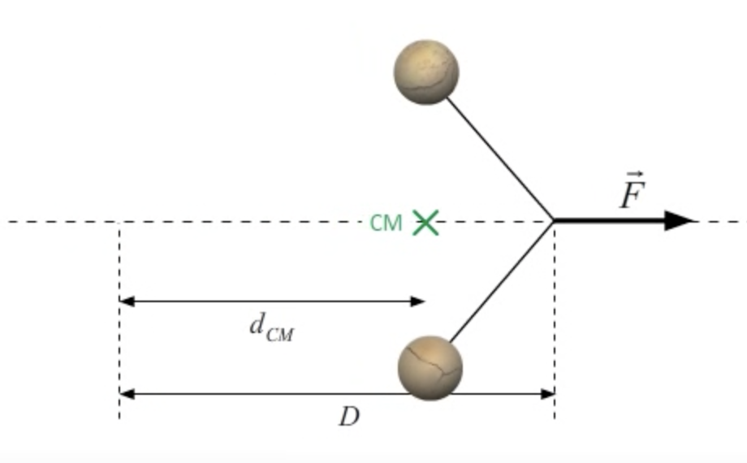
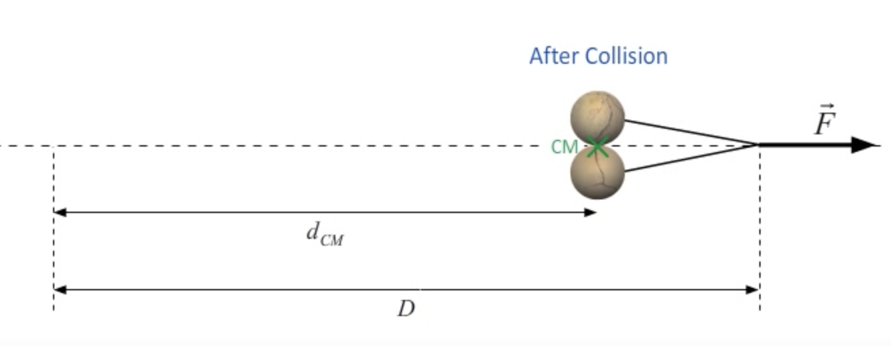

# Thermal Physics

本篇是 *UIUC PHYS 213 Univ Physics: Thermal Physics* 的学习笔记。

[TOC]

**热动力学（Thermaldynamics）** 是对经典力学的一个补充。在后者的学习中，我们时常会忽略物体内部分子能量的变化。比如考虑一个在摩擦力作用下停止运动的小块，它的动能就全部转化为了热。一个稍微复杂的例子中（如下图所示），一个力 $\mathbf{F}$ 拖着两根连着小球的线向前移动：

根据能量守恒定律，这个系统的总能量变化等于 $\mathbf{F}$ 做的功，它也等于两个小球的动能之和。我们可以用下面的式子概括：
$$
K_\text{system} = K_\text{CM} + K_\text{REL} \implies FD = Fd_\text{CM} + K_\text{REL}\nonumber
$$
其中 $K_\text{CM}$ 是两个小球质心的动能，$K_\text{REL}$ 是两个小球相对于质心的动能。然而，当两个小球因为力的作用最终碰撞时（如下图所示），它们相对于质心的动能“消失”了：

根据能量守恒，一定有某个能量代替了失去的动能：
$$
K_\text{system} = Fd_\text{CM} + ???\nonumber
$$
实际上，由于两个小球的非弹性碰撞，组成它们的分子会产生更剧烈的运动，这样我们就可以引入 **内能（Internal Energy）** 的变化概念：
$$
\Delta E_\text{internal} = W_\text{net} - \Delta K_\text{CM}
$$
下面，我们会引入更多分子层面的能量，并考虑它们对系统的影响。

## 熵与平衡

让我们接着前面的内容，引入 **热力学第一定律（First Law of Thermodynamics）**：
$$
\Delta U = W_\text{net} + Q
$$

