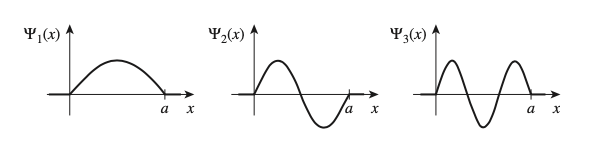
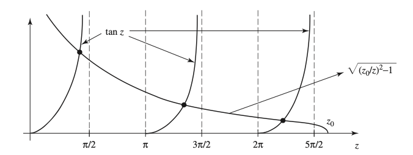
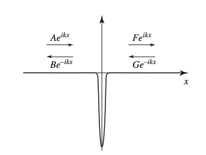
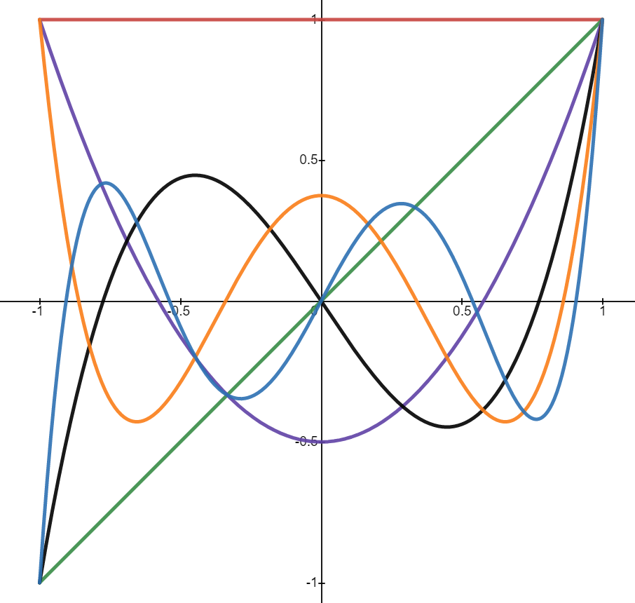

# Intro to Quantum Mechanics I

本篇是对应 *UIUC PHYS 486 Quantum Physics I* 的学习笔记，其中包括了波函数等知识。参考书籍是 *Introduction to Quantum Mechanics, 3rd Edition: David J. Griffiths*。

[TOC]

$$
\newcommand{\marginbox}[1]{\fbox{$\hphantom{1} {#1} \vphantom{1\over1} \hphantom{1}$}}\nonumber
\newcommand{\unit}[1]{\hat{\boldsymbol{#1}}}
\newcommand{\bracket}[1]{\left\langle {#1} \right\rangle}
$$

## 波函数与统计基础

### 薛定谔方程

经典力学中，我们用函数 $F(x, t)$ 来描述一维空间中粒子的受力。通过牛顿第二定律 $F = m\ddot{x}$ 解出其运动方程 $x(t)$ 后，我们可以进一步得到速度 $v = \dot{x}$，动量 $p = m\dot{x}$，以及动能 $T = \frac{1}{2}m\dot{x}^2$。如果 $F$ 是一个保守力（我们通常只对它们感兴趣），那就可以定义势能 $V = -\int F\,dx$。因此牛顿第二定律等效于：
$$
\begin{equation*}
	\frac{d^2x}{dt^2} = -\frac{\partial V}{\partial x}
\end{equation*} \tag{1.1} \label{newton's-law}
$$
在量子力学中，我们处理一维粒子的方式会“怪异”许多。波函数 $\Psi(x, t)$ 代替 $x(t)$ 成为描述粒子运动性质的方程，其满足的方程即是 **薛定谔方程（Schrodinger Equation）**：
$$
\begin{equation*}
	i\hbar\frac{\partial \Psi}{\partial t} = -\frac{\hbar^2}{2m}\frac{\partial^2\Psi}{\partial x^2} + V\Psi
\end{equation*} \tag{1.2} \label{schrodinger-equation}
$$
本章的主要内容就是探究波函数的意义，并和经典力学类似，从波函数逐渐得到量子力学中速度、动量以及动能等概念的定义。

### 波函数的统计理解

按照经典力学的诠释，粒子在某一时刻一定出现在某个位置，这也是为什么通过运动方程 $x(t)$ 就能通晓某个粒子任意时刻的状态。然而量子力学中，粒子是分布在全空间中的（在一维情况下就是整条数轴上），波函数模的平方 $|\Psi(x, t)|^2$ 描述的是粒子某一时刻在某点出现的概率。之所以使用模，是因为波函数可能是一个复变函数。因此，在给定范围内粒子出现的概率是：
$$
P(a < x < b) = \int_a^b |\Psi(x, t)|^2\,dx
$$
从图像上来看，这个概率就是 $|\Psi|^2$ 曲线下方围成的面积。为了让波函数定义有效，我们需要令：
$$
\begin{equation*}
	\int_{-\infty}^{+\infty} |\Psi(x, t)|^2\,dx = 1
\end{equation*} \tag{1.3} \label{normalization-of-schrodinger-equation}
$$
有这样的限制也在意料之中，因为如果 $\Psi$ 是薛定谔方程 $(\ref{schrodinger-equation})$ 的解，那么对任意常数 $k$，$k\Psi$ 也是该方程的解。所以只要找到了某个薛定谔方程的解，就可以找到某个常数 $k$ 满足上面的式子。我们将这个过程称为 **归一化（Normalization）**。还有一件事情需要确定，那就是上面这个积分似乎是和 $t$ 无关的，但显然 $t$ 理应对 $|\Psi(x, t)|^2$ 产生影响。如果我们在某个时刻（比如 $t = 0$）归一化 $\Psi$，如何保证在其它时刻波函数依然满足上面的式子呢？我们只需要证明下面这个式子：
$$
\frac{d}{dt}\int_{-\infty}^{+\infty} |\Psi(x, t)|^2\,dx = \int_{-\infty}^{+\infty}\frac{\partial}{\partial t}|\Psi(x, t)|^2\,dx = 0
$$
由 $|\Psi| = \Psi\Psi^*$，我们得到：
$$
\begin{align*}
	\frac{\partial }{\partial t}|\Psi|^2 = \frac{\partial}{\partial t}(\Psi^*\Psi) &= \Psi^*\frac{\partial \Psi}{\partial t} + \frac{\partial \Psi^*}{\partial t}\Psi \\
	&= \Psi^*\left(\frac{i\hbar}{2m}\frac{\partial^2\Psi}{\partial x^2} - \frac{i}{\hbar}V\Psi\right) + \left(-\frac{i\hbar}{2m}\frac{\partial^2\Psi^*}{\partial x^2} + \frac{i}{h}V\Psi^*\right)\Psi \\
	&= \frac{i\hbar}{2m}\left(\Psi^*\frac{\partial \Psi}{\partial x^2} - \frac{\partial \Psi^*}{\partial x^2}\Psi\right) \\
	&= \frac{\partial}{\partial x}\left[\frac{i\hbar}{2m}\left(\Psi^*\frac{\partial \Psi}{\partial x} - \frac{\partial \Psi^*}{\partial x}\Psi\right)\right]
\end{align*}
$$
因此，原始的积分为：
$$
\frac{d}{dt}\int_{-\infty}^{+\infty}|\Psi(x, t)|^2\,dx = \frac{i\hbar}{2m}\left.\left(\Psi^*\frac{\partial \Psi}{\partial x} - \frac{\partial \Psi^*}{\partial x}\Psi\right)\right|_{-\infty}^{+\infty}
$$
这里我们可以简单地认为 $\Psi$ 和 $\Psi^*$ 在无穷远处一定是 $0$（否则它们不可能满足归一化条件），因此这个积分的结果就是 $0$。一些数学家可能会找到病态函数作为反例，不过那些情况在物理中不存在。至此我们就证明了归一化的波函数对于任一时刻都有效。

波函数的出现为量子力学加入了很大的 **非决定性（Indeterminacy）**；即使我们得到了粒子的全部信息（即波函数 $\Psi$），也没法准确预测它的精确位置（尽管在进行实验测量时 *一定* 会得到精确的位置）。我们能得到的只有其统计学信息。自上世纪量子力学诞生以来，物理学家和哲学家对这种现象始终抱有迷惑，不知道是自然界的真相还是理论上的瑕疵。他们关于“测量粒子并发现它在点 $C$ ，那么在测量的前一刻（很短时间之前）它究竟在哪里”问题的合理解答大致有三种，让我们了解一下：

- **现实主义**：这个粒子就应该在 $C$ 点。这是爱因斯坦的观点，也是最符合直觉的观点。然而如果这是真实情况，量子力学就是一个不完整的理论，因为波函数没法告诉我们粒子的真实位置。现实主义的观点在于，虽然实验上无法得到粒子的准确位置，但是理论上它们位置一定是确定的。因此 $\Psi$ 并不能完整地表示粒子的状态，一定有一个“隐藏变量”。
- **保守主义**：这个粒子不在任何地方。测量的动作让粒子不得不出现在一个位置（虽然我们没法解释它为什么出现在这里）。这也被称为 **哥本哈根解释（Copenhagen Interpretation）**，由波尔和海森堡提出。这也是从提出至今最多物理学家支持的解释。不过如果这个观点是正确的，那么 *测量* 这个动作就会拥有非常诡异的意义；过去一个世纪的争论中，都没有为其作出清楚的解释。
- **不可知论**：拒绝做出回答。这个观点并非看上去那么愚蠢：我们应该如何验证粒子在测量前一刻的位置？唯一的验证方法就是进行一次测量，但这就不再符合“测量之前”了。上世纪的几十年间，这是大多数物理学家的”退却形态“：如果你问我粒子在测量前究竟在哪里，我会使用哥本哈根解释；如果你要刨根问底，那我就以不可知论应对，并结束回答。

1964 年是一个重要的时间点，约翰·贝尔的实验揭示了粒子在测量前位置的确定与否会造成可观测的区别，因此不可知论瞬间失去了市场。因此这变成了前两种解释的战场。尽管没有实验否定第一种观点，但多数实验肯定了第二种观点。因此本篇也假设哥本哈根解释是正确的理解：粒子在测量前没有准确的位置；测量发生时才会产生确切的结果。

还有一个另一个非常类似的问题，即在进行一次观测后，如果立即再进行一次观测，粒子的位置应该在哪里？这回所有人的观点都是一样的：和第一次测量的位置一样。保守主义对此的解释是，第一次测量会导致粒子的波函数 **坍缩（Collapse）**，此时波函数除了某一点上的概率为 $1$ 外，其余位置概率均为零。

值得一提的是，量子力学假设的均是低速情形，也即忽略相对论效应；这也让它的理论显得不够完整。但批判量子力学的不足绝不是我们在此的原因：经典力学的局限性也不妨碍它在宏观低速条件下的简洁有效；同样地，量子力学在微观低速条件下可以准确描述粒子的运动，因此值得我们去思考与学习。作为拓展，**量子场论（Quantum Field Theory, QFT）** 将经典场论、量子力学、狭义相对论结合到一起，是更加“一统”的学说；但这超出本篇笔记涵盖的内容了。

### 概率论

#### 离散变量

让我们首先来考虑 **离散变量（Discrete Variable）** 情况下的概率问题。离散指的是，变量的分布是不连续的。比如一群人的年龄分布、生日分布等。对于一个离散的随机分布，样本总数等于离散随机变量每一个可能取值的样本数量总和：
$$
\begin{equation*}
	N = \sum_{j=0}^\infty N(j)
\end{equation*} \tag{1.4}
$$
某一点的 **概率（Probability）** 是：
$$
\begin{equation*}
	P(j) = \frac{N(j)}{N}
\end{equation*} \tag{1.5}
$$
其中 $j$ 是随机变量的一个取值。如果要计算随机变量的平均值，可以使用加权平均：
$$
\begin{equation*}
	\langle j \rangle = \frac{\sum jN(j)}{N} = \sum_{j=0}^\infty jP(j)
\end{equation*} \tag{1.6} \label{expectation-value}
$$
我们将其称为 **期望值（Expectation Value）**。类似地，随机变量平方的期望是它们加权平方和的平均值：
$$
\begin{equation*}
	\bracket{j^2} = \sum_{j=0} j^2P(j)
\end{equation*} \tag{1.7}
$$
统计学中，我们希望用一个值表示数据的分散程度；比如 $1, 1, 1$ 就要比 $1, 2, 3$ 要更加集中。第一个能想到的方式是求出每一个变量和平均值的差：
$$
\begin{equation*}
	\Delta j = j - \bracket{j}
\end{equation*} \tag{1.8}
$$
不过如果尝试求差值的期望，会发现其恒等于零：
$$
\bracket{\Delta j} = \sum_{j=0}^\infty (j - \bracket{j})P(j) = \sum_{j=0}^\infty jP(j) - \bracket{j}\sum_{j=0}^\infty P(j) = \bracket{j} - \bracket{j} = 0
$$
这一点不难理解。一个解决方法是求 $|\Delta j|$ 的期望，但是很少有人喜欢处理大量的绝对值。因此我们使用的是差值平方的期望，我们将其称为 **方差（Variance）**，记为 $\sigma^2$：
$$
\begin{equation*}
	\sigma^2 = \bracket{(\Delta j)^2}
\end{equation*} \tag{1.9} \label{variance}
$$
至于 $\sigma$ 则被称为 **标准差（Standard Deviation）**。方差的计算式如下：
$$
\begin{align*}
	\sigma^2 &= \bracket{(\Delta j)^2} = \sum (j - \bracket{j})^2P(j) \\
	&= \sum \left(j^2 - 2j\bracket{j}\right)P(j) \\
	&= \sum \left(j^2 - 2j\bracket{j} + \bracket{j}^2\right)P(j) \\
	&= \sum j^2P(j) - 2\bracket{j}\sum jP(j) + \bracket{j}^2\sum P(j) \\
	&= \bracket{j^2} - 2\bracket{j}\bracket{j} + \bracket{j}^2 \\
	&= \bracket{j^2} - \bracket{j}^2
\end{align*}
$$
进行平方根运算后得到：
$$
\begin{equation*}
	\sigma = \sqrt{\bracket{j^2} - \bracket{j}^2}
\end{equation*} \tag{1.10} \label{standard-deviation}
$$
这个结论也暗示了平方的期望值总是不小于期望值的平方：
$$
\begin{equation*}
	\bracket{j^2} \ge \bracket{j}^2
\end{equation*} \tag{1.11}
$$
等号当且仅当所有样本的值都一样的时候才成立。

#### 连续变量

现在，让我们扩展到 **连续变量（Continuous Variable）** 的情形。通常，离散公式到连续公式只需要将求和符号转换为积分符号，这是因为积分本来就是求和的一个极限。首先，让我们定义 **概率密度（Probability Density）** 为极小段区间的概率，即：
$$
\begin{equation*}
	\rho(x) = \lim_{\Delta x \to 0}\frac{P(x + \Delta x) - P(x)}{\Delta x}
\end{equation*} \tag{1.12} \label{probability-density}
$$
因此，在概率密度的图像中，曲线在一个区间中围成的面积就是变量出现在该区间中的概率：
$$
\begin{equation*}
	P(a < x < b) = \int_a^b \rho(x)\,dx
\end{equation*}
$$
有了概率的定义，我们不难给出其它相应的公式：
$$
\begin{align*}
\begin{split}
	\int_{-\infty}^{+\infty}\rho(x)\,dx &= 1 \\
	\bracket{x} &= \int_{-\infty}^{+\infty} x\rho(x)\,dx \\
	\bracket{f(x)} &= \int_{-\infty}^{+\infty} f(x)\rho(x)\,dx \\
	\sigma^2 &= \bracket{x^2} - \bracket{x}^2
\end{split} \tag{1.13}
\end{align*}
$$
在量子力学中，波函数模的平方就是一个概率密度函数，也即我们令：
$$
\begin{equation*}
	\rho(x) = |\Psi(x, t)|^2
\end{equation*} \tag{1.14}
$$

### 算符

从此前得到的公式中我们可以得到波函数描述的位置期望值：
$$
\begin{equation*}
	\bracket{x} = \int_{-\infty}^{+\infty} x|\Psi(x, t)|^2\,dx
\end{equation*} \tag{1.15}
$$
这里计算出来的值并不是某一时刻粒子所处的位置，而是此时刻这个粒子位置的期望值。换句话说，这是 *无数个* 处于 $\Psi$ 状态的粒子（即可以被这个波函数描述的粒子）在被观测后所在位置的平均值。注意，这和一个粒子被观测多次时位置的平均值是不同的：第一次观测后，粒子的波函数就会坍缩。此后观测的时间点如果相距非常小，我们会得到相同的位置。

为了计算出这个期望值的变化率，我们可以对上面的式子求导，过程颇似于之前对归一化时间无关的证明，因此不表：
$$
\begin{equation*}
	\bracket{v} = \frac{d\bracket{x}}{dt} = -\frac{i\hbar}{2m}\int\left(\Psi^*\frac{\partial \Psi}{\partial x} - \frac{\partial \Psi^*}{\partial x}\Psi\right)\,dx = -\frac{i\hbar}{m}\int\Psi^*\frac{\partial \Psi}{\partial x}\,dx
\end{equation*} \tag{1.16}
$$
这个式子的含义是粒子速度的期望值。不过，粒子的速度在量子力学中似乎并没有意义，毕竟我们甚至不知道它上一秒在哪里！之后我们会讲解如何从波函数构建速度的概率密度，但现在我们先将上面的公式当作粒子速度的期望值。

动量可以简单通过 $\bracket{p} = m\bracket{v}$ 得到：
$$
\begin{equation*}
	\bracket{p} = m\frac{d\bracket{x}}{dt} = -i\hbar \int\left(\Psi^*\frac{\partial \Psi}{\partial x}\right)\,dx
\end{equation*} \tag{1.17}
$$
可以看到相比经典力学中的公式，量子力学里相同的概念表示起来要复杂不少。不过我们观察到它们之间有相似的部分，因此我们采用了全新的记法：
$$
\begin{align*}
\begin{split}
	\bracket{x} &= \int\Psi^*[x]\Psi\,dx \\
	\bracket{p} &= \int\Psi^*[-i\hbar\ (\partial/\partial x)]\Psi\,dx
\end{split} \tag{1.18}
\end{align*}
$$
此时，方括号包括的是一个 **算符（Operator）**，它会将后面的函数转换为另一个函数。这些公式除了算符以外的部分是完全相同的。因此我们可以通过算符来表示量子力学中的物理量。这里，我们不加证明地给出一个数学公式（可以将其看作公理）：
$$
\begin{equation*}
	\bracket{Q(x, p)} = \int\Psi^*\left[Q\left(x, -i\hbar\frac{\partial}{\partial x}\right)\right]\Psi\,dx
\end{equation*} \tag{1.19}
$$
也即将其原始公式中的 $p$ 全部替换为 $-i\hbar\ (\partial/\partial x)$ 即可。举个例子就是动能：
$$
\begin{equation*}
	\bracket{T} = -\frac{\hbar^2}{2m}\int\Psi^*\frac{\partial^2 \Psi}{\partial x^2}\,dx
\end{equation*} \tag{1.20}
$$

### 测不准原理

假设你拿着一根非常长的绳子的一端并不断抖动，绳子应该会呈现出某种”运动状态“，就好像一个波一样。此时如果有人问题”绳子的波具体在哪里“，你可能没法回答，因为绳子上波无处不在（极端情况下）！但如果他问你的是”绳子的波长是多少“，你或许可以给出一个合理的答案。另一种情况，假设你对一根非常长的静止绳子突然施加一段力，它会形成一个”鼓包“，此时你或许可以回答”波在哪里“，但它的波长是没有定义的（极端情况下）。所以我们面临一个抉择：如果想要知道波长，我们就得接受波在一个范围，而不是一个点；如果想要知道位置，那就得认识到”波“并不存在，因此没有波长的概念。任何中间情况，两者都没法得到确切的值。

**德布罗意公式（De Broglie Formula）** 描述了粒子动量与波长的关系：
$$
\begin{equation*}
	p = \frac{h}{\lambda} = \frac{2\pi\hbar}{\lambda}
\end{equation*} \tag{1.21}
$$
因此前面描述的波长和动量相关；测出的波长越准确，得到的动量也就越准确。**测不准原理（The Uncertainty Principle）** 定量叙述如下：
$$
\begin{equation*}
	\sigma_x\sigma_p \ge \frac{\hbar}{2}
\end{equation*} \tag{1.22}
$$
其中 $\sigma_x$ 和 $\sigma_p$ 分别是位置和动量分布的标准差。我们会在后续章节证明这个公式。

## 时间无关的薛定谔方程

### 静止状态

本节中，让我们尝试得到薛定谔方程的解。首先回顾薛定谔方程：
$$
\begin{equation*}
	i\hbar\frac{\partial \Psi}{\partial t} = -\frac{\hbar^2}{2m}\frac{\partial^2\Psi}{\partial x^2} + V\Psi
\end{equation*} \tag{2.1}
$$
我们如果不加说明，通篇都假设 $V = V(x)$，即势能与时间无关。一个典型的偏微分方程解法是 **分离变量法（Separation of Variables）**，假设 $\Psi$ 可以表示成两个分别是 $x$ 和 $t$ 的函数的积：
$$
\begin{equation*}
	\Psi(x, t) = \psi(x)\varphi(t)
\end{equation*} \tag{2.2}
$$
将其代入原方程后得到：
$$
\begin{equation*}
	i\hbar\frac{1}{\varphi}\frac{d\varphi}{dt} = -\frac{\hbar^2}{2m}\frac{1}{\psi}\frac{d^2\psi}{dx^2} + V
\end{equation*} \tag{2.3}
$$
此时令等式两边相等的唯一可能性是左侧和右侧都等于某个常数。设：
$$
\begin{equation*}
	E = i\hbar\frac{1}{\varphi}\frac{d\varphi}{dt} \implies \frac{d\varphi}{dt} = -\frac{iE}{\hbar}\varphi
\end{equation*} \tag{2.4}
$$
将 $d\varphi/dt$ 用 $E$ 代替后得到：
$$
\begin{equation*}
	-\frac{\hbar^2}{2m}\frac{d^2\psi}{dx^2} + V\psi = E\psi
\end{equation*} \tag{2.5} \label{time-independent-schrodinger-equation}
$$
至此，我们将一个偏微分方程转化为了两个常微分方程 $(2.4)$ 和 $(2.5)$。其中第一个方程非常好解，我们可以轻松地得到：
$$
\begin{equation*}
	\varphi(t) = e^{-iEt/\hbar}
\end{equation*} \tag{2.6}
$$
这里我们省略了常数，这个常数会在 $\psi(x)$ 中补偿回来。第二个方程称为 **时间无关的薛定谔方程（Time-Independent Schrodinger Equation）**，我们需要其给出具体的势能函数 $V(x)$ 才能进一步求解。本章接下来的内容便是如何解不同设置下的时间无关的薛定谔方程。

首先，让我们回顾一下分离变量法。为什么我们用这种方式来解薛定谔方程？答案可以是：这是我们最简单的方法；不过更重要的是，通过这种方式得到的解有更好的性质。下面来分析一二：

- 它们代表了 **静止状态（Stationary State）**。尽管最后得到的波函数 $\Psi(x, t) = \psi(x)\exp(-iEt/\hbar)$ 是时间相关的，但是它的概率密度不是：
  $$
  |\Psi(x, t)|^2 = \Psi^*\Psi = \psi^*e^{iEt/\hbar}\psi e^{-iEt/\hbar} = |\psi(x)|^2 \tag{2.7}
  $$
  类似地，任意变量的期望值都是时间无关的：
  $$
  \bracket{Q(x, p)} = \int \psi^*\left[Q\left(x, -i\hbar\frac{d}{dx}\right)\right]\psi\,dx \tag{2.8}
  $$
  特别地，由于 $\bracket{x}$ 是常数，动量 $\bracket{p} = 0$。此外不难发现，这些情况下我们可以直接用 $\psi(x)$ 代替 $\Psi(x, t)$。
  
- 它们是总能量确定的状态。经典力学中，我们用 **哈密顿量（Hamiltonian）** 来表示总能量：
  $$
  H(x, p) = \frac{p^2}{2m} + V(x) \tag{2.10}
  $$
  我们可以得到其对应的算符，即 **哈密顿算符（Hamiltonian Operator）**：
  $$
  \hat{H} = -\frac{\hbar^2}{2m}\frac{\partial^2}{\partial x^2} + V(x)
  $$
  因此，我们得到了时间无关的薛定谔方程的最简形式：
  $$
  \begin{equation*}
  	\hat{H}\psi = E\psi
  \end{equation*} \tag{2.11}
  $$
  注意到总能量的期望值是：
  $$
  \bracket{H} = \int\psi^*\hat{H}\psi\,dx = E\int|\psi|^2\,dx = E\int|\Psi|^2\,dx = E
  $$
  且总能量平方的期望值是：
  $$
  \bracket{H^2} = \int\psi^*\hat{H}^2\psi\,dx = \int\psi^*\hat{H}(E\psi)\,dx = E\int\psi^*\hat{H}\psi\,dx = E^2\int|\psi|^2\,dx = E^2
  $$
  发现总能量的标准差是 $0$，因此分离变量法得到的解，在每次测量其总能量时，得到的结果都是相同的：
  $$
  \sigma_H = \sqrt{\bracket{H^2} - \bracket{H}^2} = 0 \tag{2.12}
  $$

- 它们的线性组合依然是原方程的解。事实上，对于 $(\ref{time-independent-schrodinger-equation})$，我们可以得到无数个解 $\psi_1(x), \psi_2(x), ...$，简记为 $\{\psi_n(x)\}$。它们对应的总能量是 $\{E_n\} = E_1, E_2, ...$。所以每个解可以写为：
  $$
  \Psi_i(x, t) = \psi_i(x)e^{-iE_it/\hbar}
  $$
  它们的线性组合就是方程的通解：
  $$
  \begin{equation*}
  	\Psi(x, t) = \sum_{n=1}^\infty c_n\psi_n(x)e^{-iE_nt/\hbar}
  \end{equation*} \tag{2.13} \label{general-solution-to-time-independent-schrodinger-equation}
  $$
  其中 $\{c_n\}$ 是一系列任意常数。 

将这一节的内容总结起来，就是对于已知势能函数 $V(x)$ 以及初始状态 $\Psi(x, 0)$ 的薛定谔方程，我们可以首先尝试解时间无关的薛定谔方程；在得到无限个解 $\{\psi_n(x)\}$ 以及它们对应的总能量 $\{E_n\}$ 后，将 $t = 0$ 代入通解以对应初始条件 $\Psi(x, 0)$，即令：
$$
\Psi(x, 0) = \sum_{n=1}^\infty c_n\psi_n(x) \tag{2.14}
$$
最后，将 $\varphi(t)$ 放回式子，就得到：
$$
\begin{equation*}
	\Psi(x, t) = \sum_{n=1}^\infty c_n\psi_n(x)e^{-iE_nt/\hbar} = \sum_{n=1}^\infty c_n\Psi_n(x, t)
\end{equation*} \tag{2.15}
$$
其中：
$$
\begin{equation*}
	\Psi_n(x, t) = \psi_n(x)e^{-iE_nt/\hbar}
\end{equation*} \tag{2.16}
$$
需要注意的是，此前介绍的，概率密度和期望值的时间无关性只对每个 $\Psi_n(x, t)$ 有效；通解形式并不一定满足时间无关。在通解中，$|c_n|^2$ 的含义是对应总能量出现的概率（下一章再进行解释），因此它们的和应该是 $1$：
$$
\begin{equation*}
	\sum_{n=1}^\infty |c_n|^2 = 1
\end{equation*} \tag{2.17}
$$
此外，总能量的期望值满足：
$$
\begin{equation*}
	\bracket{H} = \sum_{n=1}^\infty |c_n|^2E_n
\end{equation*} \tag{2.18}
$$
由于 $c_n$ 是与时间无关的常数，因此每一种能量的概率，以及总能量的期望值和时间都无关。这是 **能量守恒（Energy Conservation）** 在量子力学中的体现。

### 无限方井

让我们考虑一种势能分布：
$$
\begin{equation*}
	V(x) = \begin{cases}
		0, & 0 \le x \le a \\
		\infty & x < 0\ \text{或}\ x > a
	\end{cases}
\end{equation*} \tag{2.19}
$$
这种情况下，除了 $x = 0$ 或 $x = a$ 两个地方，其余位置的粒子受力均为零，而两个边界处受力为无穷大。如果类比成经典力学中的情形，就是空间中完全光滑轨道上有两个完全弹性的障碍物，物体只会在两个障碍物之间运动。

我们将这种设置称为 **无限方井（Infinite Square Well, ISW）**。正如其名，粒子仿佛被“困在”一个无限深的方井中无法出来。在方井中，由于势能为零，我们可以代入 $(\ref{time-independent-schrodinger-equation})$ 得到：
$$
\begin{equation*}
	-\frac{\hbar^2}{2m}\frac{d^2\psi}{dx^2} = E\psi
\end{equation*} \tag{2.20} \label{schrodinger-equation-of-infinite-square-well}
$$
这是一个典型的二阶常微分方程，其通解是：
$$
\begin{equation*}
	\psi(x) = A\sin kx + B\cos kx \qquad k = \frac{\sqrt{2mE}}{\hbar}
\end{equation*} \tag{2.21}
$$
为了确定上面的常数 $A, B$，我们需要给出一系列 **边界条件（Boundary Conditions）**。我们通常假定 $\psi$ 和 $d\psi/dx$ 是连续的，此处由于 $V$ 可能是 $\infty$，所以只有第一个条件是成立的。此时有：
$$
\psi(0) = \psi(a) = 0
$$
带入到原式中，可以得到 $B = 0$ 以及 $ka = \pm n\pi$，所以以下形式的 $k$ 都可以满足要求：
$$
\begin{equation*}
	k_n = \frac{n\pi}{a} \quad n = 1, 2, 3, ...
\end{equation*} \tag{2.22}
$$
这样我们也能确定总能量：
$$
\begin{equation*}
	E_n = \frac{\hbar^2k_n^2}{2m} = \frac{n^2\pi^2\hbar^2}{2ma^2}
\end{equation*} \tag{2.23}
$$
为了得到 $A$ 的确定值，我们需要对 $\psi$ 进行归一化：
$$
\int_0^a |A|^2\sin^2 kx\,dx = |A|^2\frac{a}{2} = 1 \implies |A|^2 = \frac{2}{a}
$$
我们直接取 $A = \sqrt{2/a}$。这样就得到了无限方井内的解：
$$
\begin{equation*}
	\psi_n(x) = \sqrt{\frac{2}{a}}\sin\left(\frac{n\pi x}{a}\right)
\end{equation*}
$$
下面是在 $n = 1, 2, 3$ 时的图像：

可以看到，$n$ 对应着图像中波峰/波谷出现的数量。我们将 $n = 1$ 称为 **基态（Ground State）**，其它的情形则称为 **激发态（Excited State）**。这些状态之间有一些共同点：

- 它们关于方井中心交替呈现 **奇性** 与 **偶性**，也即镜面对称和中心对称。比如 $\psi_1, \psi_3, ...$ 为偶，$\psi_2, \psi_4, ...$ 为奇。

- 它们与 $0$ 的交点数量（称为 **结点**）逐个增加。

- 它们之间相互 **正交（Orthogonal）**，定义为：
  $$
  \begin{equation*}
  	\int\psi_m(x)^*\psi_n(x)\,dx = 0 \qquad (m \ne n)
  \end{equation*}
  $$
  证明如下：
  $$
  \begin{align*}
  	\int \psi_m(x)^*\psi_n(x)\,dx 
  	&= \frac{2}{a}\int_0^a\sin\left(\frac{m\pi x}{a}\right)\sin\left(\frac{n\pi x}{a}\right)\,dx \\
  	&= \frac{1}{a}\int_0^a\left[\cos\left(\frac{(m-n)\pi x}{a}\right) - \cos\left(\frac{(m+n)\pi x}{a}\right)\right]\,dx \\
  	&= \left.\left[\cos\left(\frac{(m-n)\pi x}{a}\right) - \frac{1}{(m+n)\pi}\sin\left(\frac{(m+n)\pi x}{a}\right)\right]\right|_0^a \quad\text{(Suppose $m\ne n$)}\\
  	&= \frac{1}{\pi}\left[\frac{\sin{[(m-n)\pi]}}{m-n} - \frac{\sin{[(m+n)\pi]}}{m+n}\right] \\
  	&= 0
  \end{align*}
  $$
  当 $m = n$ 时，上面的积分会得到 $1$。因此我们可以将其记为：
  $$
  \int \psi_m(x)^*\psi_n(x)\,dx = \delta_{mn}
  $$
  此处记号 $\delta_{mn}$ 是 **克罗内克函数**，定义为：
  $$
  \begin{equation*}
  	\delta_{mn} =
  	\begin{cases}
  		0 & m \ne n \\
  		1 & m = n
  	\end{cases}
  \end{equation*}
  $$

- 它们是 **完备的（Complete）**，即任何函数 $f(x)$ 都可以表示为它们的线性和（我们不在本篇笔记中证明这一点）：
  $$
  \begin{equation*}
  	f(x) = \sum_{n=1}^\infty c_n\psi_n(x) = \sqrt{\frac{2}{a}}\sum_{n=1}^\infty c_n\sin\left(\frac{n\pi x}{a}\right)
  \end{equation*}
  $$
  这种表示方式被称为 $f(x)$ 的 **傅立叶级数（Fourier Series）**。这个性质也被称为 **狄利克雷定理（Dirichlet's Theorem）**。为了确定这里的常数 $c_n$，我们需要用到一个小技巧：
  $$
  \int\psi_m(x)^*f(x)\,dx = \sum_{n=1}^\infty c_n\int\psi_m(x)^*\psi_n(x)\,dx = \sum_{n=1}^\infty c_n\delta_{mn} = c_m
  $$

上面这四个性质不仅对无限方井，对大多数的势能分布都满足。尤其是正交性和完备性非常有用，我们多数情况下会假设它们成立。

至此，我们得到了无限方井的单个状态的通解（时间相关）：
$$
\begin{equation*}
	\Psi_n(x, t) = \sqrt{\frac{2}{a}}\sin\left(\frac{n\pi x}{a}\right)\exp\left(-i\frac{n^2\pi^2\hbar}{2ma^2}t\right)
\end{equation*}
$$
所有状态叠加起来的通解（时间相关）则是：
$$
\begin{equation*}
	\Psi(x, t) = \sum_{n=1}^\infty c_n\sqrt{\frac{2}{a}}\sin\left(\frac{n\pi x}{a}\right)\exp\left(-i\frac{n^2\pi^2\hbar}{2ma^2}t\right)
\end{equation*}
$$
为了得到 $c_n$，我们可以令 $t = 0$，然后根据正交性得到：
$$
\begin{equation*}
	c_n = \sqrt{\frac{2}{a}}\int_0^a\sin\left(\frac{n\pi x}{a}\right)\Psi(x, 0)\,dx
\end{equation*}
$$
这里的 $c_n$ 满足模平方之和为 $1$，我们可以通过归一化条件得到该结论：
$$
\begin{align*}
	1 = \int |\Psi(x, 0)|^2\,dx
	&= \int \left[\sum_{m=1}^\infty c_m\psi_m(x)\right]^*\left[\sum_{n=1}^\infty c_n\psi_n(x)\right]\,dx \\
	&= \sum_{m=1}^\infty \sum_{n=1}^\infty c_m^*c_n\int\psi_m(x)^*\psi_n(x)\,dx \\
	&= \sum_{m=1}^\infty \sum_{n=1}^\infty c_m^*c_n\delta_{mn} \\
	&= \sum_{n=1}^\infty |c_n|^2
\end{align*}
$$
同时能量的期望是：
$$
\begin{align*}
	\langle H\rangle 
	&= \int \Psi^* \hat{H}\Psi\,dx \\
	&= \int \left(\sum c_m\psi_m\right)^*\hat{H}\left(\sum c_n\psi_n\right)\,dx \\
	&= \sum\sum c_m^*c_nE_n \int \psi_m^*\psi_n\,dx \\
	&= \sum|c_n|^2E_n
\end{align*}
$$

### 有限方井

一个类似无限方井的设定是 **有限方井（Finite Square Well）**，其势能分布如下：
$$
\begin{align*}
	V(x) = 
	\begin{cases}
		-V_0 & -a \le x \le a \\
		0 & |x| > a
	\end{cases}
\end{align*}
$$
此处 $V_0$ 是某个常数。针对 $E < 0$ 或 $E > 0$，我们可以将问题分为 **约束状态（Bound State）**和 **分散状态（Scattering State）**。我们先研究前一种情形。当 $x < -a$ 时，$V(x) = 0$，此时有：
$$
-\frac{\hbar^2}{2m}\frac{d^2\psi}{dx^2} = E\psi \implies \frac{d^2\psi}{dx^2} = \kappa^2\psi \quad \text{其中 $\kappa = \frac{\sqrt{-2mE}}{\hbar}$}
$$
它的通解是：
$$
\psi(x) = Ae^{-\kappa x} + Be^{\kappa x}
$$
由于第一项会在 $x \to \infty$ 时无意义，得到 $A = 0$。所以当 $x < -a$ 时有：
$$
\psi(x) = Be^{\kappa x}
$$
类似地，当 $x > a$ 时我们有：
$$
\psi(x) = Ce^{-\kappa x}
$$
在 $|x| \le a$ 时，$V(x) = -V_0$，此时有：
$$
-\frac{\hbar^2}{2m}\frac{d^2\psi}{dx^2} = (V_0 + E)\psi \implies \frac{d^2\psi}{dx^2} = -l^2\psi \quad \text{其中 $l = \frac{\sqrt{2m(E + V_0)}}{\hbar}$}
$$
它的通解是：
$$
\psi(x) = D\sin(lx) + E\cos(lx)
$$
考虑 $V$ 的对称性，为了让 $\psi$ 和 $\frac{d\psi}{dx}$ 在 $\pm a$ 处连续，我们最终得到的应该是类似于下面的结果（注意 $x$ 的范围和前面使用的不太一样）：
$$
\psi(x) = 
\begin{cases}
	Ce^{-\kappa x} & x > a \\
	E\cos(lx) & 0 < x < a \\
	\psi(-x) & x < 0
\end{cases}
$$
其中第二项取余弦而非正弦是因为它在 $x = 0$ 处的梯度是连续的。将边界条件代入，有：
$$
\begin{align*}
\begin{cases}
	Ce^{-\kappa a} = E\cos(la)  \\
	-\kappa Ce^{-\kappa a} = -lE\sin(la)
\end{cases}
\implies
\kappa = l\tan{la}
\end{align*}
$$
回忆 $l$ 是一个和 $E$ 相关的变量，因此这个公式给出了所有可能的 $E$。为了得到更好的形式，记 $z = la$，$z_0 = \frac{a}{\hbar}\sqrt{2mV_0}$。由我们对 $\kappa$ 和 $l$ 的定义，有 $\kappa^2 + l^2 = \frac{2mV_0}{\hbar^2}$，也即 $\kappa^2 + l^2 = (\frac{z_0}{a})^2$，将 $l = \frac{z}{a}$ 代入后得到：
$$
\tan{z} = \sqrt{\left(\frac{z_0}{z}\right)^2 - 1}
$$
再次回顾上式中变量的含义：$z_0$ 是和问题设置有关的常量，$z$ 是和 $E$ 相关的量。下面是当 $z_0 = 8$ 时的示意图：

可以看到，只有 $\tan{z} = \sqrt{(z_0/z)^2-1}$ 的地方，$z$ 对应的能量才是允许取的值。让我们针对 $z_0$ 的两种极端情形讨论有限方井的性质：

- 深且宽的方井：当 $z_0$ 很大时，上图中的 $\sqrt{(z_0/z)^2-1}$ 图像会向上移动到较高的地方，此时它与 $z$ 轴的交点也会大幅向右移动。观察 $\tan{z}$ 的图像，可以发现它和 $\sqrt{(z_0/z)^2 - 1}$ 的交点会在大约 $z_n = n\pi/2$ 的位置，此时对应的能量是：
  $$
  \begin{equation*}
  	E_n + V_0 \approx \frac{n^2\pi^2\hbar^2}{2m(2a)^2} \quad \text{其中 $n$ 是奇数}
  \end{equation*}
  $$
  等式右侧这个形式我们应该比较熟悉：它完美对应了宽度为 $2a$ 的无限方井中允许取的能量里一半的情形。这也符合我们的预期：当方井深度无限加大时（$V_0 \to \infty$），它就类似于一个无限方井。

- 浅且窄的方井：当 $z_0$ 变小时，能取得的状态会越来越少；当 $z_0 < \frac{\pi}{2}$ 时只有一个。有趣的事，无论 $z_0$ 多么小，始终至少有一个合法的状态。

现在研究 $E > 0$，即分散状态下的方井。此时对于 $x < -a$ 有：
$$
\begin{equation*}
	\psi(x) = Ae^{ikx} + B^{-ikx} \qquad \text{其中 $k = \frac{\sqrt{2mE}}{\hbar}$}
\end{equation*}
$$

### 自由粒子

这一节讨论没有任何约束的环境，即：
$$
V(x) = 0
$$
此时薛定谔方程变为：
$$
-\frac{\hbar^2}{2m}\frac{d^2\psi}{dx^2} = E\psi \implies \frac{d^2\psi}{dx^2} = -k^2\psi \qquad \text{其中 $k = \frac{\sqrt{2mE}}{\hbar}$}
$$
其通解为（值得一提的是，我们使用了指数形式而非三角函数形式，其原因很快就会说明）：
$$
\begin{equation*}
	\psi(x) = Ae^{ikx} + Be^{-ikx}
\end{equation*}
$$
至此，一切和无限方井的情况相同，但现在我们没有任何边界条件，所以不需要确定 $A$ 和 $B$ 的值。时间相关的波函数解即是：
$$
\begin{equation*}
	\Psi(x, t) = A^{ik\left(x - \frac{\hbar k}{2m}t\right)} + Be^{-ik\left(x + \frac{\hbar k}{2m}\right)}
\end{equation*}
$$
对这个方程进行简单分析，可以看出第一项是一个从左向右传播的波，第二项是从右向左传播的波，它们速度相同方向相反（大小和 $k$ 有关）。因此我们可以根据 $k$ 的值确定波函数：
$$
\begin{equation*}
	\Psi_k(x, t) = Ae^{i\left(kx - \frac{\hbar k^2}{2m}t\right)}
\end{equation*}
$$
这里的 $k$ 是任何满足下列的常数：
$$
\begin{equation*}
	k = \pm \frac{\sqrt{2mE}}{\hbar}
\end{equation*}
$$
根据德布罗意公式 $p = \frac{2\pi\hbar}{\lambda}$，我们可以计算出波的动量：
$$
\begin{equation*}
	p = \hbar k
\end{equation*}
$$
波的传递速度是（通过求波函数中 $x$ 和 $t$ 的系数比值得到）：
$$
\begin{equation*}
	v_\text{quantum} = \frac{\hbar |k|}{2m} = \sqrt{\frac{E}{2m}}
\end{equation*}
$$
我们注意到它和经典物理中速度的区别（通过动能公式 $E = \frac{1}{2}mv^2$ 得到）：
$$
\begin{equation*}
	v_\text{classical} = \sqrt{\frac{2E}{m}} = 2v_\text{quantum}
\end{equation*}
$$
这个差异究竟是为什么？此外，如果我们尝试对自由粒子的波函数归一化，会发现无法完成：
$$
\begin{equation*}
	\int_{-\infty}^\infty \Psi_k\Psi_k\,dx = |A|^2\int_{-\infty}^\infty\,dx = +\infty
\end{equation*}
$$
对此的解释是，$\Psi_k$ 无法代表自由粒子的一个合理状态：这和无限方井是不同的。我们需要将所有 $k$ 的情形都考虑在内才能得到合理的状态。由于 $k$ 不是离散的，我们需要求积分而非求和：
$$
\begin{equation*}
	\Psi(x, t) = \frac{1}{\sqrt{2\pi}}\int_{-\infty}^{\infty}\phi(k)e^{i(kx - \frac{\hbar k^2}{2m}t)}\,dk
\end{equation*}
$$
上式中凭空出现的 $\frac{1}{\sqrt{2\pi}}\phi(k)$ 是用来对这个积分归一化的参数。为了算出这个 $\phi(k)$，我们只需要尝试将 $\Psi(x, 0)$ 归一化。根据 **普朗歇尔定理（Plancherel's Theorem）**，有：
$$
f(x) = \frac{1}{\sqrt{2\pi}}\int_{-\infty}^\infty F(k)e^{ikx}\,dk \Longleftrightarrow F(k) = \frac{1}{\sqrt{2\pi}}\int_{-\infty}^\infty f(x)e^{-ikx}\,dx
$$
这里 $F(k)$ 是 $f(x)$ 的 **傅立叶变换（Fourier Transform）**，$f(x)$ 是 $F(k)$ 的 **逆傅立叶变换（Inverse Fourier Tranform）**。这样我们就得到了 $\phi(k)$ 的公式：
$$
\begin{equation*}
	\phi(k) = \frac{1}{\sqrt{2\pi}}\int_{-\infty}^\infty \Psi(x, 0)e^{-ikx}\,dx
\end{equation*}
$$

### 简谐振子

回忆在经典力学中，我们将满足力与位移成线性关系的运动称为简谐运动，可以用 **胡克定律（Hooke's Law）** 来描述：
$$
F = -kx = m\frac{d^2x}{dt}
$$
它的解是三角函数的线性组合：
$$
x(t) = A\sin(\omega t) + B\cos(\omega t)
$$
其中 $\omega$ 定义为：
$$
\omega = \sqrt{\frac{k}{m}}
$$
其势能和位移的平方成正比：
$$
V(x) = \frac{1}{2}kx^2
$$
实际上，对于大多数运动，如果将其势能通过幂级数展开，在局部的一个最小值 $x = x_0$ 处有：
$$
V(x) = V(x_0) + V'(x_0)(x - x_0) + \frac{1}{2}V''(x_0)(x - x_0)^2 + \dots
$$
由于势能的参照点是任选的，我们可以令 $V(x_0) = 0$。同时由于 $V'(x_0) = 0$，我们只需要考虑第三项，即：
$$
V(x) \approx \frac{1}{2}V''(x_0)(x - x_0)^2
$$
此处只需设 $k = V''(x_0) \ge 0$，就可以得到一个近似的简谐振子了。这在经典力学中是非常常用的近似。量子力学中，我们也有类似的假设；当势能满足下面的等式时，其描述的就是一个简谐振子：
$$
V(x) = \frac{1}{2}m\omega^2x^2
$$
此时薛定谔方程变为：
$$
-\frac{\hbar^2}{2m}\frac{d^2\psi}{dx^2} + \frac{1}{2}m\omega^2x^2\psi = E\psi
$$
其中的势能项让这个常微分方程变成非齐次方程，因此我们需要做一次换元：
$$
\xi = \sqrt{\frac{m\omega}{\hbar}}x
$$
这样就将原方程转化为：
$$
\frac{d^2\psi}{d\xi^2} = \left(\xi^2 - \frac{2E}{\hbar\omega}\right)\psi = (\xi^2 - K)\psi
$$
注意到当 $\xi$ 非常大（也即 $x$ 非常大）时，等式右侧约等于 $\xi^2\psi$，这就得到了一个近似的方程解：
$$
\psi(\xi) \approx h(\xi)e^{-\xi^2/2}
$$
注意，正常的通解应该包含一个 $e^{\xi^2/2}$ 项，不过它显然没法归一化，因此需要令其系数为零。为了求得 $h(\xi)$，让我们将 $\psi$ 的导数和二阶导数代换为 $h$ 的表达式：
$$
\frac{d\psi}{d\xi} = \left(\frac{dh}{d\xi} - \xi h\right)e^{-\xi^2/2} \\
\frac{d^2\psi}{d\xi^2} = \left(\frac{d^2h}{d\xi^2} - 2\xi\frac{dh}{d\xi} + (\xi^2 - 1)h\right)e^{-\xi^2/2}
$$
我们假定 $h(\xi)$ 的形式是多项式：
$$
h(\xi) = a_0 + a_1\xi + a_2\xi^2 + \dots = \sum_{j=0}^\infty a_j\xi^j
$$
它的导数非常好求：
$$
\frac{dh}{d\xi} = a_1 + 2a_2\xi + 3a_3\xi^2 + \dots = \sum_{j=0}^\infty ja_j\xi^{j-1} \\
\frac{d^h}{d\xi^2} = 2a^2 + 2\cdot 3a_3\xi + 3\cdot 4a_4\xi^2 + \dots = \sum_{j=0}^\infty(j+1)(j+2)a_{j+2}\xi^j
$$
现在将上面全部代入原方程中，得到：
$$
\sum_{j=0}^\infty [(j+1)(j+2)a_{j+2} - 2ja_j + (K - 1)a_j]\xi^j = 0
$$
为了保证对于任意 $\xi$ 都成立，级数中的系数一定是零，我们得到下面的递归关系：
$$
a_{j+2} = \frac{(2j + 1 - K)}{(j+1)(j+2)}a_j
$$
这样我们就可以通过两个常数 $a_0$ 和 $a_1$ 来推出所有其它系数。当 $j$ 很大时，上面这个关系约为：
$$
a_{j+2} \approx \frac{2}{j}a_j \implies a_j \approx \frac{C}{(j/2)!}
$$
需要注意的是，如果我们接纳所有 $j$，其结果是不可归一化的：
$$
h(\xi) \approx C\sum_j^\infty \frac{1}{(j/2)!}\xi^j \approx \sum_j^\infty \frac{1}{j!}\xi^{2j} \approx Ce^{\xi^2}
$$
因此我们需要 $a_j$ 在某一项之后“消失”，设此时 $j = n$，则从递推公式中不难推出：
$$
K = 2n + 1
$$
如果 $n$ 是偶数，我们还得要求 $a_0 = 0$；否则需要 $a_1 = 0$。最后，根据 $K$ 的定义我们可以得到不同 $n$ 下的能量：
$$
E_n = \left(n + \frac{1}{2}\right)\hbar\omega
$$
同时我们可以将 $a_j$ 的递推公式变为：
$$
a_{j+2} = -\frac{2(n - j)}{(j+1)(j+2)}a_j
$$
最后，我们可以将简谐振子静止状态的通解写出：
$$
\psi_n(x) = \left(\frac{m\omega}{\pi\hbar}\right)^{1/4}\frac{1}{\sqrt{2^nn!}}H_n(\xi)e^{-\xi^2/2}
$$
其中的 $H_n(\xi)$ 称为 **厄米特多项式（Hermite Polynomial）**，它可以通过 **罗德里格斯公式（Roderigues Formula）** 计算得到：
$$
H_n(\xi) = (-1)^ne^{\xi^2}\left(\frac{d}{d\xi}\right)^ne^{-\xi^2}
$$

### Delta 函数势能

截至此，我们已经遇到两大类薛定谔方程（根据不同势能分布），其一拥有离散的、可归一化的解，它们的线性组合是方程的通解；另一个拥有连续的、不可归一化的解，它们在全空间中的积分是方程的通解。这两者的区别有什么物理意义呢？

在经典力学中，考虑一维的情形，我们可以通过小车和斜坡的模型构建简单的势能模型。当总能量超过两边的势能时，小车会向无穷远处运动；当总能量小于两边的势能时，小车会在两个 **转向点（Turning Point）** 中移动；当总能量大于一边的势能时，小车可能会经过更高势能一边的转向点，并向另一边的无穷远处移动。

在量子力学中也有类似的结论。不过由于此时“小车”不再拥有确定的位置，它可以出现在任何能量大于势能的地方。因此，小车完全可能“穿过”斜坡到山坡另一侧的地方，我们称其为 **隧穿（Tunnelling）**。至于小车是否会跑到无穷远处，可以通过比较 $E$ 和 $V(\pm \infty)$ 确定。如果 $E$ 比两边都小，那么系统就处于 **束缚态（Bound State）**，否则处于 **散射态（Scattering State）**。

定义 **狄拉克 Delta 函数（Dirac Delta Function）** 为在原点处无穷大，其余点均为零的函数，即：
$$
\delta(x) = 
\begin{cases}
	0 & x \ne 0 \\
	\infty & x = 0
\end{cases}
$$
此外，它还要求：
$$
\int_{-\infty}^\infty\delta(x)\,dx = 1
$$
这个函数在理论物理中非常受欢迎，比如质点在空间中的密度分布，或点电荷在空间中的电荷密度分布都只能用 $\delta$ 函数描述。严格意义上来讲它是一个分布，而非常规的函数。至于对其积分的要求，下面这个定义或许更好理解：
$$
\delta(x) = \lim_{a\to0}
\begin{cases}
	\dfrac{1}{a} & |x| < \dfrac{a}{2} \\
	0 & |x| \ge \dfrac{a}{2}
\end{cases}
$$
$\delta$ 函数有一个非常重要的性质：
$$
f(x)\delta(x - a) = f(a)\delta(x - a)
$$
这点并不难理解，因为除了 $x = a$ 外的点都被 $\delta$ 函数置零了；这个性质的直接结论是：
$$
\int_{-\infty}^\infty f(x)\delta(x - a)\,dx = f(a)
$$
因此，$\delta$ 函数常用于从函数中“取出”特定点上的值。

现在，考虑势能分布如下的系统：
$$
V(x) = -\alpha \delta(x)
$$
其中 $\alpha$ 是一个正实数。此时，时间无关的薛定谔方程变为：
$$
-\frac{\hbar^2}{2m}\frac{d^2\psi}{dx^2} - \alpha\delta(x)\psi = E\psi
$$
对于束缚态（$E < 0$）的情形，在 $x \ne 0$ 的区域，设：
$$
\frac{d^2\psi}{dx^2} = -\frac{2mE}{\hbar^2}\psi = \kappa^2\psi \qquad \text{其中 $\kappa = \frac{\sqrt{-2mE}}{\hbar}$}
$$
上面这个方程的通解是（对于 $x <0$ 或 $x > 0$）：
$$
\psi(x) = Ae^{-\kappa x} + Be^{\kappa x}
$$
之后的过程和我们在[有限方井](#有限方井)中的非常相似，由于波函数的连续性和这个系统的对称性，不难得到：
$$
\psi(x) = Be^{-\kappa|x|}
$$
呃，我们似乎还没有利用 $\delta$ 函数这个条件；显然我们可以消除上面这个方程中的 $B$ 或者 $\kappa$。因此我们需要应用另一个波函数的性质：在 $V \ne \infty$ 的地方 $d\psi/dx$ 连续。为了更好处理 $\delta$ 函数，让我们首先考虑一个区间 $[-\epsilon, \epsilon]$。在此区间中对时间无关的薛定谔方程积分：
$$
-\frac{\hbar^2}{2m}\int_{-\epsilon}^\epsilon \frac{d^2\psi}{dx^2}\,dx + \int_{-\epsilon}^\epsilon V(x)\psi(x)\,dx = E\int_{-\epsilon}^\epsilon \psi(x)\,dx 
$$
第一个积分得到的就是 $d\psi/dx$，最后一个积分则应该得到 $0$。至于第二个积分，我们可以通过 $\delta$ 函数的性质得到 $\alpha\psi(0)$，综合起来就是：
$$
\lim_{\epsilon\to 0}\left(\left.\frac{\partial \psi}{\partial x}\right|_{+\epsilon} - \left.\frac{\partial \psi}{\partial x}\right|_{-\epsilon}\right) = -\frac{2m\alpha}{\hbar^2}\psi(0)
$$
将我们之前得到的解代入，就得到：
$$
B = \psi(0) \qquad \kappa = \frac{m\alpha}{\hbar^2}
$$
其对应的能量是：
$$
E = -\frac{m\alpha^2}{2\hbar^2}
$$
将波函数归一化：
$$
\int_{-\infty}^\infty |\psi(x)|^2\,dx = 2|B|^2\int_0^\infty e^{-2\kappa x}\,dx = \frac{|B|^2}{\kappa} = 1 \implies B = \sqrt{\kappa}
$$
最终得到波函数：
$$
\psi(x) = \frac{\sqrt{m\alpha}}{\hbar}e^{-m\alpha|x|/\hbar^2}
$$
对于散射态（$E > 0$）的情形，设（$x \ne 0$）：
$$
\frac{d^2\psi}{dx^2} = -\frac{2mE}{\hbar^2}\psi = -k^2\psi \qquad \text{其中 $k = \frac{\sqrt{2mE}}{\hbar}$}
$$
这个方程的通解是：
$$
\psi(x) = 
\begin{cases}
	Ae^{ikx} + Be^{-ikx} & x < 0 \\
	Fe^{ikx} + Ge^{-ikx} & x > 0
\end{cases}
$$
这里我们把他们分开是有特殊用处的。为了在 $x = 0$ 处连续，我们需要满足 $F + G = A + B$。至于 $d\psi/dx$，我们需要满足和束缚态类似的要求：
$$
\left.\frac{d\psi}{dx}\right|_{x=0^-} - \left.\frac{d\psi}{dx}\right|_{x=0^+} = -\frac{2m\alpha}{\hbar^2}(A + B) \\
\implies F - G= A(1 + 2i\beta) - B(1 - 2i\beta) \qquad \text{其中 $\beta = \frac{m\alpha}{\hbar^2k}$}
$$
如果将波函数的每个指数项都理解为一个波，则 $ikx$ 可以理解为向右的波，$-ikx$ 则是向左的波；$A$、$B$、$F$、$G$ 则是这些波的幅度。下图是一个直观的展示：

通常在散射实验中，粒子会从左侧射出，因此设 $G = 0$。这时我们就构建了一个类似于波经过不同介质边界的模型。将 $Ae^{ikx}$ 称为 **入射波（Incident Wave）**，$Be^{-ikx}$ 称为 **反射波（Reflected Wave）**，$Fe^{ikx}$ 称为 **透射波（Transmitted Wave）**，我们可以得到：
$$
B = \frac{i\beta}{1 - i\beta} A \qquad F = \frac{1}{1 - i\beta}A
$$
虽然我们得到的解并不能归一化，但是它依然能给出和概率相关的结论。考虑反射波和入射波的能量比：
$$
R = \frac{|B|^2}{|A|^2} = \frac{\beta^2}{1 + \beta^2}
$$
这反映了粒子被“反射”回来的概率。类似地，透射波和入射波的能量比：
$$
T = \frac{|F|^2}{|A|^2} = \frac{1}{1 + \beta^2}
$$
观察到 $R + T = 1$，这也是理所当然的。将 $\beta$ 用已知量代换，就得到：
$$
\begin{align*}
	R = \frac{1}{1 + 2\hbar^2E/(m\alpha^2)} \\
	T = \frac{1}{1 + m\alpha^2/(2\hbar^2E)}
\end{align*}
$$
因此能量 $E$ 越大，粒子越倾向于透射过去。

## 数学形式

前面两个章节中我们得到了一些在简单的量子系统中的有趣结论。其中有些可能比较巧合（比如简谐振子的能量均匀分布），但其它似乎可以一般化（比如测不准原理，还有静止状态的正交性）本章中我们会利用数学工具将这些结论拓展到更一般的形式。

### 希尔伯特空间

量子理论中的两个核心概念是波函数和算符。系统的 **状态（State）**由波函数描述，而 **可观测量（Observable）**由算符描述。数学上，我们可以将波函数通过 **矢量（Vector）**表示，算符则可以抽象为 **线性变换（Linear Transformation）**。因此，**线性代数（Linear Algebra）**是量子力学的“自然语言”。

不过量子力学有它自己的个性，比起我们已经熟悉的矢量形式，它选择使用下面这种记号：
$$
\ket{\alpha} = \mathbf{a} = 
\begin{pmatrix}
	a_1 \\ a_2 \\ \vdots \\ a_N
\end{pmatrix}
$$
其表示一个 $N$ 维空间的矢量，其中 $a_i \in \mathbb{C}$。矢量之间的 **内积（Inner Product）**定义为：
$$
\langle \alpha | \beta \rangle = a_1^*b_1 + a_2^*b_2 + \dots + a_N^*b_N
$$
矢量空间中的线性变换则（如前两章介绍过的）采用下面的记号：
$$
\ket{\alpha} = \hat{T}\ket{\alpha} \Leftrightarrow \mathbf{b} = T\mathbf{a} =
\begin{pmatrix}
	t_{11} & t_{12} & \dots & t_{1N} \\
	t_{21} & t_{22} & \dots & t_{2N} \\
	\vdots & \vdots & \ddots & \vdots \\
	t_{N1} & t_{N2} & \dots & t_{NN}
\end{pmatrix}
\begin{pmatrix}
	a_1 \\ a_2 \\ \vdots \\ a_N
\end{pmatrix}
$$
不过，在无限维度矢量空间中，这种表示方式似乎有局限性，尤其是矢量的内积（无限和对应了积分）有可能不收敛；因此我们需要特别注意一些情况。

理论上，所有关于 $x$ 的函数构成了一个矢量空间，但我们需要的仅仅是可以被归一化的函数空间，即：
$$
\left\{\Psi \mid \int|\Psi|^2\,dx = 1\right\}
$$
此外，所有在特定区间内 **平方可积（Square-Integrable）**的函数构成了一个更小的矢量空间：
$$
\left\{f(x) \mid\int_a^b |f(x)|^2\,dx < \infty \right\}
$$
我们将其称为 **希尔伯特空间（Hilbert Space）**，数学上记为 $L^2(a, b)$。所有的波函数都属于希尔伯特空间。两个函数的内积定义为：
$$
\begin{equation*}
	\langle f|g\rangle = \int_a^b f^*(x)g(x)\,dx
\end{equation*}
$$
通过 **施瓦尔兹不等式（Schwarz Inequality）**我们可以得到：
$$
\left|\int_a^b f^*(x)g(x)\,dx\right| \le \sqrt{\int_a^b |f(x)|^2\,dx \int_a^b|g(x)|^2\,dx}
$$
由于右式有限，我们可以保证希尔伯特空间中两个函数的内积一定存在。此外，不难观察到：
$$
\langle g|f \rangle = \langle f|g \rangle^*
$$
因此内积运算不可交换。函数和自己本身的内积是：
$$
\langle f|f \rangle = \int_a^b |f(x)|^2\,dx
$$
从物理角度来看，这个结果当且仅当 $f(x) = 0$ 时才为零（数学上我们可以构建仅在一系列特定点上不为零的病态函数，其积分也为零）。特别地，规定 $f = g$ 当且仅当 $\langle f - g|f - g\rangle = 0$。

如果一个函数和自身的内积为 $1$，我们就称其是 **归一化的（Normalized）**（这完全符合我们最开始的定义）；如果两个函数的内积为 $0$，我们就称其 **正交（Orthogonal）**；一集归一化函数 $\{f_n\}$ 如果两两正交，则称它们是 **标准正交的（Orthonormal）**，也即下面等式成立：
$$
\begin{equation*}
	\langle f_m|f_n \rangle = \delta_{mn}
\end{equation*}
$$
对于一集标准正交函数，如果其线性组合能够得到指定的希尔伯特空间中的所有函数，就称其在该空间中 **完备（Complete）**，数学表示如下：
$$
\begin{equation*}
	f(x) = \sum_{n=1}^\infty c_nf_n(x)
\end{equation*}
$$
其中系数 $c_n$ 可以通过下面得到：
$$
\begin{equation*}
	c_n = \langle f_n|f \rangle
\end{equation*}
$$
至此，我们将[无限方井](#无限方井)小节中引入的概念拓展到了希尔伯特空间。可以看到，在无限方井和简谐振子模型中得到的波函数解分别是 $(0, a)$ 区间和 $(-\infty, \infty)$ 区间的标准正交函数集。

### 可观测量

回忆我们在第一章引入算符时给出的公式，对于任何可观测物理量 $Q(x, p)$，其期望值都可以通过下面公式来计算：
$$
\begin{equation*}
	\langle Q \rangle = \int\Psi^*\hat{Q}\Psi\,dx
\end{equation*}
$$
现在可以写成量子力学的数学形式：
$$
\begin{equation*}
	\langle Q \rangle = \langle \Psi|\hat{Q}\Psi\rangle
\end{equation*}
$$
考虑到期望值一定是实数，我们不难得到：
$$
\langle \Psi|\hat{Q}\Psi\rangle = \langle Q\rangle = \langle Q\rangle^* = \langle \hat{Q}\Psi|\Psi\rangle
$$
我们将这样的算符称为 **厄米特算符（Hermitian Operator）**，后文中我们会简称为算符。量子力学中所有的可观测量都对应了一个算符。在有限维度矢量空间中，我们用 **厄米特矩阵（Hermitian Matrix）**来表示一个算符，其满足下面的特性：
$$
T = T^\dagger \equiv \tilde{T}^*
$$
更一般地，我们可以将算符 $\hat{Q}$ 的 **厄米特共轭（Hermitian Conjugate）**定义为满足下面要求的 $\unit{Q}^\dagger$：
$$
\begin{equation*}
	\langle f|\unit{Q}g\rangle = \langle \hat{Q}^\dagger f|g\rangle
\end{equation*}
$$
其中 $f$、$g$ 是希尔伯特空间中任意的函数。此时依然有：
$$
\hat{Q} = \hat{Q}^\dagger
$$

### 特征函数

在量子系统中，对于完全相同的设定和状态 $\Psi$，每次观测某个可观测量 $Q$ 很可能得到不同的结果，这是由波函数的性质（概率分布）特性导致的。但是在特殊的设定下，我们可以保证每次观测都得到相同的结果，我们称此为 $Q$ 的 **确定状态（Determinate State）**，此时 $Q$ 的标准差应该是零，即：
$$
\sigma_Q^2 = \left\langle(Q - \langle Q\rangle)^2\right\rangle = \left\langle\Psi\mid (\hat{Q} - \langle Q\rangle)^2\Psi\right\rangle = \left\langle(\hat{Q} - \langle Q\rangle)\Psi\mid(\hat{Q} - \langle Q\rangle)\Psi\right\rangle = 0
$$
此时一定有：
$$
\begin{equation*}
	\hat{Q}\Psi = \langle Q\rangle \Psi
\end{equation*}
$$
这个等式被称为算符 $\hat{Q}$ 的 **特征值方程（Eigenvalue Equation）**，其中 $\Psi$ 是 $\hat{Q}$ 的 **特征函数（Eigenfunction）**，而 $\langle Q\rangle$ 是对应的 **特征值（Eigenvalue）**。量子力学中每个可观测量的确定状态都对应了其算符的特征函数。

从上面的方程来看，特征函数的任意常数倍数依然是特征函数；$0$ 是平凡的特征值，也是平凡的特征函数，但我们决定将排除后者（否则在这种情况下任意实数都是特征值）。

给定一个算符，其所有特征值的集合被称为 **光谱（Spectrum）**。如果多个线性无关的特征函数有相同的特征值，我们称这个光谱是 **退化的（Degenerate）**。通常我们可以将算符的光谱分为两种：离散或连续。前一种情况的特征函数一定在希尔伯特空间中且拥有实际的物理意义；后一种情况下，特征函数并不是可归一的，此时需要至少选取一段区间后才能得到可归一的函数。一些算符只有离散的光谱（比如简谐振子的哈密顿算符），一些只有连续的光谱（比如自由粒子的哈密顿算符），也有两者都有的（比如有限方井的哈密顿算符）。

#### 离散光谱

哈密顿算符的可归一的特征函数有两个重要的性质：

> **定理**：它们对应的特征值是实数。

> **证明**：假设 $\hat{Q}f = qf$，则：
> $$
> \langle f|\hat{Q}f\rangle = \langle \hat{Q}f|f\rangle
> $$
> 将系数 $q$ 提出来，得到：
> $$
> q\langle f|f\rangle = q^*\langle f|f\rangle
> $$
> 由于 $f$ 是可归一的，因此他和自己的内积不可能为 $0$，这就证明了 $q$ 是一个实数。

这个性质意味着每次测量确定状态的例子时，总能得到一个实数。

> **定理**：不同特征值对应的特征函数是正交的。

> **证明**：假设 $\hat{Q}f = qf$，且存在 $q' \ne q$ 使得 $\hat{Q}g = q'g$。此时：
> $$
> \langle f|\hat{Q}g\rangle = \langle\hat{Q}f|g\rangle
> $$
> 将 $q$ 和 $q'$ 提出来，得到：
> $$
> q'\langle f|g\rangle = q^*\langle f|g\rangle
> $$
> 根据给定条件必有 $\langle f|g\rangle = 0$，因此两者正交。

这个性质总结了此前我们在无限方井和简谐振子中得到的函数正交性。

在退化的光谱中，即定理二中 $q = q'$ 时，我们可以用 **格拉姆-施密特正交化过程（Gram-Schmidt Orthogonalization Procedure）**来得到新的正交特征函数。因此即使在特征函数中存在退化现象，我们可以通过这个算法得到等价的标准正交函数集。所以我们总是可以假设这个过程已经完成了。这一点为我们此前“心安理得”使用函数正交性提供了更多保障。

最后，让我们给出一个公理：

> **公理**：可观测算符的特征函数集是完备的。即，希尔伯特空间中的任意函数都能表示成它们的线性组合。

在一些情况下（比如静止状态），这个公理可以被证明出来。不过因为没有通用的证明方法（尤其是对于连续光谱），我们还是将它视作公理。

#### 连续光谱

如果哈密顿算符的光谱是连续的，其特征函数不能够归一化。此时离散情况下两个定理的证明就不成立了。不过我们依然希望它在某种角度来看是成立的，下面通过一个例子来说明。

假设我们希望找到 $(-\infty, \infty)$ 区间动量算符的特征函数和特征值，设特征函数为 $f_p(x)$，$p$ 是特征值，则：
$$
-i\hbar\frac{d}{dx}f_p(x) = pf_p(x)
$$
其通解是：
$$
f_p(x) = Ae^{ipx/\hbar}
$$
显然对于任意 $p \in \mathbb{C}$ 它都不是可归一化的。不过我们可以探索稍差一些的结论：如果令 $p \in \mathbb{R}$，此时有：
$$
\langle f_{p'}|f_p\rangle = \int_{-\infty}^\infty f_{p'}^*(x)f_p(x)\,dx = |A|^2\int_{-\infty}^\infty e^{i(p - p')x/\hbar}\,dx = |A|2\pi\hbar\delta(p - p')
$$
取 $A = 1/\sqrt{2\pi \hbar}$，则：
$$
\begin{equation*}
	f_p(x) = \frac{1}{\sqrt{2\pi\hbar}}e^{ipx/\hbar}
\end{equation*}
$$
注意到这是一个周期函数，波长是：
$$
\lambda = \frac{2\pi\hbar}{p}
$$
这正是德布罗意公式！我们马上会对此做出解释，在此之前先注意下面的等式：
$$
\langle f_{p'}|f_p\rangle = \delta(p - p')
$$
这和我们前文中给出的标准正交性非常相似，我们可以称其为 **狄拉克标准正交性（Dirac Orthonormality）**。此时我们可以得到一种略有不同的完备性：任何平方可积的函数都能表示为上述特征函数的“线性积分”（把线性组合中的求和换为积分）：
$$
f(x) = \int_{-\infty}^\infty c(p)f_p(x)\,dp = \frac{1}{\sqrt{2\pi \hbar}}\int_{-\infty}^\infty c(p)e^{ipx/\hbar}\,dp
$$
我们使用与此前类似的方式计算和 $p$ 相关的常数 $c(p)$：
$$
\langle f_{p'}|f\rangle = \int_{-\infty}^\infty c(p)\langle f_{p'}|f_p\rangle\,dp = \int_{-\infty}^\infty c(p)\delta(p - p')\,dp = c(p')
$$
当然，敏锐的同学可能已经发现前面的式子就是一个逆傅里叶变换，因此只需要用一次傅里叶变换就可以变成 $c(p)$ 相关的函数：
$$
c(p) = \frac{1}{\sqrt{2\pi\hbar}}\int_{-\infty}^\infty e^{-ipx/\hbar}\,dx
$$
现在让我们回到德布罗意公式，现在可以知道，其描述的粒子（拥有确定动量的粒子）实际上不存在，但我们总可以选取一段范围内的动量形成的可归一化的 **波包（Wave Packet）** 来描述，这也是它们存在波长的原因。

作为总结，动量算符的特征函数不在希尔伯特空间中，但它们的集合（一个区间）拥有某种角度而言的可归一化性质。事实上，所有连续的哈密顿算子（即拥有连续光谱），其对应的特征函数集都是狄拉克标准正交，且在积分意义上完备的。

### 通用的统计解释

经过了前面诸多铺垫之后，我们终于可以给出一个对量子力学的完整统计解释。

> **量子力学的通用统计解释**：在测量一个状态为 $\Psi(x, t)$ 的粒子的某个可观测量 $Q(x, p)$ 时，一定会得到哈密顿算符
> $$
> \hat{Q} = \left(x, -i\hbar\frac{d}{dx}\right)
> $$
> 的*一个*特征值。如果 $\hat{Q}$ 的光谱，即特征值分布是离散的，则得到和标准正交特征函数 $f_n(x)$ 对应的某个特征值 $q_n$ 的概率是：
> $$
> |c_n|^2 \qquad \text{其中}\ c_n = \langle f_n|\Psi \rangle
> $$
> 相反，如果 $\hat{Q}$ 的光谱是连续的，则在区间 $dz$ 中得到和狄拉克标准正交的特征函数 $f_z(x)$ 对应的某个特征值 $q(z)$ 的概率是：
> $$
> |c(z)|^2\,dz \qquad \text{其中}\ c(z) = \langle f_z|\Psi\rangle
> $$
> 在观测发生时，波函数会坍缩为对应的特征状态。对于连续光谱，则根据测量仪器的精度坍缩为一段极小区间的叠加状态。

在离散光谱中，我们不难验证概率的归一性：
$$
\begin{align*}
	\sum_n |c_n|^2 
	&= \sum_n c_n^*c_n \\
	&= \sum_{m}\sum_nc_{m}^*c_n\delta_{mn} \\
	&= \sum_{m}\sum_nc_{m}^*c_n\langle f_{m}|f_{n}\rangle \\
	&= \left\langle\left.\left(\sum_mc_mf_m\right)\right|\left(\sum_nc_nf_n\right)\right\rangle 
	= \langle\Psi|\Psi\rangle = 1
\end{align*}
$$
此外，可观测量的期望值是：
$$
\begin{align*}
	\langle Q \rangle = \langle \Psi|\hat{Q}\Psi\rangle
	&= \left\langle\left.\left(\sum_mc_mf_m\right)\right|\hat{Q}\left(\sum_nc_nf_n\right)\right\rangle \\
	&= \sum_m\sum_nc_m^*c_n\langle f_m|\hat{Q}f_n\rangle \\ 
	&= \sum_m\sum_nc_m^*c_nq_n\langle f_m|f_n\rangle \\
	&= \sum_m\sum_nc_m^*c_nq_n\delta_{mn} \\
	&= \sum_nq_n|c_n|^2
\end{align*}
$$
至于连续光谱，我们可以特别地对 $x$ 和 $p$ 进行验证。在上一小节中我们已经认识到：
$$
\begin{align*}
	c(x) &= \langle g_x|\Psi\rangle = \int_{-\infty}^\infty \delta(y - x)\Psi(y, t)\,dy = \Psi(x, t) \\
	c(p) &= \langle f_p|\Psi\rangle = \frac{1}{\sqrt{2\pi\hbar}}\int_{-\infty}^\infty e^{-ipx/\hbar}\Psi(x, t)\,dx
\end{align*}
$$
我们将第二个式子称为 **动量空间波函数（Momentum Space Wave Function）**，其正好对应了“位置空间”波函数，也就是 $\Psi(x, t)$；两者可以通过傅里叶变换和逆傅里叶变换相互转化：
$$
\begin{align*}
	\Phi(p, t) = \frac{1}{\sqrt{2\pi\hbar}}\int_{-\infty}^\infty e^{-ipx/\hbar}\Psi(x, t)\,dx \\
	\Psi(x, t) = \frac{1}{\sqrt{2\pi\hbar}}\int_{-\infty}^\infty e^{-ipx/\hbar}\Phi(x, t)\,dp
\end{align*}
$$

### 测不准原理

#### 可对易性

不同算符之间有一个重要的关系，即 **可对易性（Commutability）**。首先，让我们定义 **对易子（Commutator）**：
$$
[\hat{A}, \hat{B}] = \hat{A}\hat{B} - \hat{B}\hat{A}
$$
当对易子为零时，我们就称这两个算符 **互易（Commutable）**。对易的算符之间有很好的性质，我们在下一节中就会讲到。现在，让我们给出一些对易子之间的运算规则：

- $[\hat{A}, \hat{A}] = 0$：可对易的自反性。
- $[\hat{A}, \hat{B}] = -[\hat{B}, \hat{A}]$：反交换律。
- $[\hat{A} + \hat{B}, \hat{C}] = [\hat{A}, \hat{C}] + [\hat{B}, \hat{C}]$：对加法的分配律。
- $[\hat{A}\hat{B}, \hat{C}] = \hat{A}[\hat{B}, \hat{C}] + [\hat{A}, \hat{C}]\hat{B}$：对乘法的分配律。
- $[\lambda\hat{A}, \hat{B}] = \lambda[\hat{A}, \hat{B}]$。
- $[\hat{A}, [\hat{B}, \hat{C}]] + [\hat{B}, [\hat{C}, \hat{A}]] + [\hat{C}, [\hat{A}, \hat{B}]] = 0$：雅可比等式。
- $[\hat{A}, f(\hat{A})] = 0$。

此外，一些常见的算符之间满足下面的对易关系，也被称为 **标准对易关系（Canonical Commutation Relation）**：

- $[r_i, p_j] = i\hbar\delta_{ij}$。
- $[r_i, r_j] = [p_i, p_j] = 0$。

#### 广义测不准原理

我们在第一章中提到过位置和动量的测不准原理，现在让我们尝试证明它。有了上一节完整的统计解释后，我们可以看向更一般的情形：对于任意可观测量 $A$，其方差为：
$$
\sigma_A^2 = \left\langle\left.\left(\hat{A} - \langle A\rangle\right)\Psi\right|\left(\hat{A} - \langle A\rangle\right)\Psi\right\rangle = \langle f|f\rangle
$$
其中记 $f \equiv \left(\hat{A} - \langle A\rangle\right)\Psi$。 类似地，对于另一个可观测量 $B$，以及 $g \equiv \left(\hat{B} - \langle B\rangle\right)\Psi$，我们有：
$$
\sigma_B = \langle g|g\rangle
$$
此时根据施瓦尔兹不等式：
$$
\sigma_A^2\sigma_B^2 = \langle f|f\rangle\langle g|g\rangle \ge |\langle f|g\rangle|^2
$$
对任意复数 $z$，我们都有：
$$
|z|^2 = \mathscr{R}^2z + \mathscr{I}^2z \ge \mathscr{I}^2z = \left[\frac{1}{2i}(z - z^*)\right]^2
$$
因此对于 $\langle f|g\rangle$：
$$
\sigma_A^2\sigma_B^2 \ge \left[\frac{1}{2i}(\langle f|g\rangle - \langle g|f\rangle)\right]^2
$$
同时：
$$
\begin{align*}
	\langle f|g\rangle
	&= \left\langle\left.\left(\hat{A} - \langle A\rangle\right)\Psi\right|\left(\hat{B} - \langle B\rangle\right)\Psi\right\rangle \\
	&= \left\langle\Psi\left|\left(\hat{A} - \langle A\rangle\right)\left(\hat{B} - \langle B\rangle\right)\Psi\right.\right\rangle \\
	&= \left\langle \Psi\left|\hat{A}\hat{B}\Psi\right.\right\rangle - \left\langle\Psi\left|\hat{A}\Psi\right.\right\rangle \langle B\rangle - \langle A\rangle \left\langle \Psi\left|\hat{B}\Psi\right.\right\rangle + \langle A\rangle\langle B\rangle \Big\langle \Psi\Big|\Psi\Big\rangle \\
	&= \langle \hat{A}\hat{B}\rangle - \langle A\rangle\langle B\rangle - \langle A\rangle\langle B\rangle + \langle A\rangle\langle B\rangle \\
	&= \langle\hat{A}\hat{B}\rangle - \langle A\rangle\langle B\rangle
\end{align*}
$$
类似地有：
$$
\langle g|f\rangle = \langle \hat{B}\hat{A}\rangle - \langle A\rangle\langle B\rangle
$$
因此两者的差是：
$$
\langle f|g\rangle - \langle g|f\rangle = \langle{\hat{A}\hat{B}}\rangle -  \langle\hat{B}\hat{A}\rangle = [\langle\hat{A}\hat{B}\rangle, \langle\hat{B}\hat{A}\rangle] = \langle[\hat{A}, \hat{B}]\rangle
$$
回忆其中的方括号是我们上节中引入的对易子。这样我们就得到了最终的结论：
$$
\sigma_A^2\sigma_B^2 \ge \left(\frac{1}{2i}\left\langle\left[\hat{A}, \hat{B}\right]\right\rangle\right)^2
$$
这也被称为一般化的 **测不准原理**。特别地，取 $A = x$，$B = p$ 时我们有：
$$
\sigma_x^2\sigma_p^2 \ge \left(\frac{1}{2i}[\hat{x}, \hat{p}]\right)^2 = \left(\frac{1}{2i}i\hbar\right)^2 = \frac{\hbar^2}{4}
$$
这也就是我们在第一章得到的结论：
$$
\sigma_x\sigma_p \ge \frac{\hbar}{2}
$$
不难发现在一般化的测不准原理中，右式在两个算符互易时是 $0$，此时我们称这两个可观测量是 **兼容的（Compatible）**。换句话说，所有 **不兼容的（Incompatible）**算符之间都存在测不准的现象。比如氢原子中的哈密顿量、角动量大小和角动量的 $z$ 方向分量是相互兼容的，因此它们三个拥有相同的特征状态（也即令这几个量都确定的特征状态）。

测不准原理是量子力学的统计解释推出的结论，它对实验中可观测量之间的不可兼容性做出了数学上的解释。每次观测都会导致波函数坍缩，但是只有两次测量的量可兼容时，它们才能对应一致的结果。作为例子，我们观测粒子位置时，波函数会坍缩为一个尖峰（其对应的波长有无数种，动量同理）；随后如果我们观测粒子动量，波函数会坍缩为一个正弦曲线，此时波长（以及对应的动量）是确定的，但粒子的位置不再是我们此前测量得到的了。相反，如果观测的两个量拥有相同的特征状态，第二次观测时波函数会坍缩成与之前完全相同的形状，因此上一次测量的结果依然有效。

#### 最小不确定性波包

我们此前已经遇到过波函数正好位于测不准原理的边界的情形（简谐振子），我们对于这种情况的普遍情况更加感兴趣：什么条件下这种 **最小不确定性波包（Minimum-Uncertainty Wave Packet）** 会成立？观察我们上一节对广义测不准原理的推导，会发现其中的不等号在两个式子中出现，其一是施瓦尔兹不等式，另外一个是将复数化为虚部。如果想要这两步的不等号写成等号，函数 $f$ 和 $g$ 需要满足：
$$
g(x) = iaf(x)
$$
其中 $a \in \mathbb{R}$。令 $f = (\hat{p} - \langle p\rangle)$ 及 $g = (\hat{x} - \langle x\rangle)$，有：
$$
\left(-i\hbar\frac{d}{dx} - \langle p\rangle\right)\Psi = ia(x - \langle x\rangle)\Psi
$$
它的通解是：
$$
\Psi(x) = Ae^{-a(x - \langle x\rangle)^2/(2\hbar)}e^{i\langle p\rangle x/\hbar}
$$
可以看出这个波包是一个高斯函数，我们此前在简谐振子处得到的结果也是一个高斯函数。

#### 能量-时间测不准原理

我们已经熟悉的位置-动量测不准原理实际上对于同等系统重复测量的描述有些不严谨。通常它会跟着另一个测不准原理一起出现，即 **能量-时间测不准原理（Energy-Time Uncertainty Principle）**：
$$
\Delta t\Delta E \ge \frac{\hbar}{2}
$$
从狭义相对论角度来看，这两个测不准原理是高度一致的，因为位置和时间（$\mathbf{x}$ 和 $ct$）形成了位置-时间四元矢量；动量和能量（$\mathbf{p}$ 和 $E/c$）则形成了动量-能量四元矢量。不过本篇笔记并不涉及相对论（注意到薛定谔方程中 $x$ 和 $t$ 的迥异地位），因此这两个式子不能混为一谈。事实上，我们接下来要尝试推导能量-时间测不准原理，从中会发现它们是非常不同的。

首先我们注意到，在非相对论的语境中，$t$ 和 $x$、$p$、$E$ 是完全不同的；我们可以测量某一时刻的其它物理量，但时间没有办法测量：它是一个独立存在的量。我们没有办法测量多次时间，然后取其标准差；反过来说，正是因为时间的变化，我们才能测量其它物理量并计算得到它们的标准差。

为了测量一个系统变化的速率，我们可以取某个物理量 $Q$ 的期望值的平均值：
$$
\begin{align*}
	\frac{d}{dt}\langle Q\rangle 
	= \frac{d}{dt}\left\langle \Psi\left|\hat{Q}\Psi\right.\right\rangle 
	&= \left\langle\left.\frac{\partial \Psi}{\partial t}\right|\hat{Q}\Psi\right\rangle +
	\left\langle\Psi\left|\frac{\partial \hat{Q}}{\partial t}\Psi\right.\right\rangle + 
	\left\langle\Psi\left|\hat{Q}\frac{\partial \Psi}{\partial t}\right.\right\rangle \\
	&= -\frac{1}{i\hbar}\left\langle \hat{H}\Psi\left|\hat{Q}\Psi\right.\right\rangle +
	\left\langle\frac{\partial \hat{Q}}{\partial t}\right\rangle + 
	\frac{1}{i\hbar}\left\langle\Psi\left|\hat{Q}\hat{H}\Psi\right.\right\rangle \\
	&= \frac{i}{\hbar}\left\langle\Psi\left|(\hat{H}\hat{Q} - \hat{Q}\hat{H})\Psi\right.\right\rangle + 
	\left\langle\frac{\partial \hat{Q}}{\partial t}\right\rangle \\&
	= \frac{i}{\hbar}\left\langle\left[\hat{H}, \hat{Q}\right]\right\rangle + \left\langle\frac{\partial \hat{Q}}{\partial t}\right\rangle
\end{align*}
$$
我们将其称为 **广义埃伦费斯特定理（Generalized Ehrenfest Theorem）**。当算符与时间无关时（我们通常假设这一点成立），其对应的物理量期望值的变化率只和该算符与哈密顿算符的交换子有关；特别地，当 $\hat{Q}$ 和 $\hat{H}$ 兼容时，$Q$ 是一个保守的物理量。如果我们将上面的公式代入广义测不准原理，有：
$$
\sigma_H^2\sigma_Q^2 \ge \left(\frac{1}{2i}\left\langle\left[\hat{H}, \hat{Q}\right]\right\rangle\right)^2 = \frac{\hbar^2}{4}\left(\frac{d\langle Q\rangle}{dt}\right)^2
\implies \sigma_H\sigma_Q \ge \frac{\hbar}{2}\left|\frac{d\langle Q\rangle}{dt}\right|
$$
现在记 $\Delta E = \sigma_H$，且如果设：
$$
\Delta t = \frac{\sigma_Q}{|d\langle Q\rangle/dt|}
$$
此时就有：
$$
\Delta E\Delta t \ge \frac{\hbar}{2}
$$
可以看到，我们的 $\Delta t$，其物理意义是 $\langle Q\rangle$ 变化一个标准差 $\sigma_Q$ 所需的时间，因此它依赖于 $Q$ ，对于不同的可观测量会有不同的大小。当 $\Delta E$ 非常大的时候，说明 $Q$ 的变化非常迅速，也就是所需时间很小；否则 $Q$ 就是缓慢变化，其对应的时间就很长。

### 矢量和算符

#### 希尔伯特空间的基矢量

在矢量分析中，我们学过将空间中的矢量拆分为某个基上基矢量的加权和。比如在三维空间中，任意矢量 $\mathbf{A}$ 都可以写作：
$$
\mathbf{A} = A_x\unit{x} + A_y\unit{y} + A_z\unit{z} = (\mathbf{A}\cdot\unit{x})\unit{x} + (\mathbf{A}\cdot\unit{y})\unit{y} + (\mathbf{A}\cdot\unit{z})\unit{z}
$$
（这里的 $\unit{x}$ 符号代表的是单位矢量）在量子力学中，我们有类似于 $\mathbf{A}\cdot\unit{x}$ 的写法：
$$
\Psi(x, t) = \langle x|\mathcal{S}(t)\rangle
$$
其中 $|\mathcal{S}(t)\rangle$ 表示希尔伯特空间中的一个矢量，而 $\Psi(x, t)$ 表示了其 $x$ 方向的分量。$|x\rangle$ 表示特征值为 $x$ 的位置特征函数。类似地，同一个矢量的特征值为 $p$ 的动量特征函数是：
$$
\Phi(p, t) = \langle p|\mathcal{S}(t)\rangle
$$
如果以能量特征函数为基，根据不同的 $n$ 可以得到：
$$
c_n(t) = \langle n|\mathcal{S}(t)\rangle
$$
需要意识到的是，上面这三种不同的分量表示方法描述的其实都是同一个矢量：
$$
|\mathcal{S}(t)\rangle = \int \Psi(y, t)\delta(x - y)\,dy = \int \Phi(p, t)\frac{1}{\sqrt{2\pi\hbar}}e^{ipx/\hbar}\,dp = \sum_n^\infty c_ne^{-iE_nt/\hbar}\psi_n(x)
$$
算符是希尔伯特空间中的线性变换，它将一个矢量变换为另一个矢量：
$$
|\beta\rangle = \hat{Q}|\alpha\rangle
$$
如果设 $|\alpha\rangle = \sum a_n|e_n\rangle$，$|\beta\rangle = \sum b_n|e_n\rangle$，其分量为：
$$
a_n = \langle e_n|\alpha \rangle \qquad b_n = \langle e_n|\beta\rangle
$$
此时我们可以将前面的式子写成：
$$
\sum_n b_n|e_n\rangle = \sum_n a_n\hat{Q}|e_n\rangle
$$
我们可以将算符 $\hat{Q}$ 表示为：
$$
Q_{mn} = \left\langle e_m\bigg|\ \hat{Q}\ \bigg|\ e_n\right\rangle
$$
这样就有：
$$
\sum_n b_n\langle e_m|e_n\rangle = \sum_na_n\left\langle e_m\bigg|\ \hat{Q}\ \bigg|\ e_n\right\rangle
$$
注意到 $\langle e_m|e_n \rangle = \delta_{mn}$，因此就有：
$$
b_m = \sum_nQ_{mn}a_n
$$
就好像矢量和矩阵在不同基中的形式不同一样，算符在不同分量表示中的形式也是不同的。回忆我们此前对 $\Phi(x, t)$ 和 $\Phi(p, t)$ 的称呼（位置空间波函数和动量动量空间波函数，我们可以将某个基扩张成的空间这样称呼），在这两种情况下的位置算符和动量算符是不一样的：
$$
\begin{align*}
	\hat{x} = \begin{cases} x & \text{（位置空间）} \\ i\hbar\partial_p & \text{（动量空间）} \end{cases} \qquad
	\hat{p} = \begin{cases} -i\hbar\partial_x & \text{（位置空间）} \\ p & \text{（动量空间）} \end{cases}
\end{align*}
$$
因此当提到某个算符时，最严谨的说法是“在某个空间”中的算符，不过由于我们主要只关注位置空间的波函数，也即 $\Psi(x, t)$，我们默认情况下讨论的均为位置空间。

最后值得提一下算符的运算。由于它们对应着矢量空间的矩阵，其运算规律和矩阵完全一致：
$$
\left(\hat{Q} + \hat{R}\right)|\alpha\rangle = \hat{Q}|\alpha\rangle + \hat{R}|\alpha\rangle \\
\left(\hat{Q}\hat{R}\right)|\alpha\rangle = \hat{Q}\left(\hat{R}|\alpha\rangle\right)
$$
有时我们会将函数作用于算符上，物理中这个等价于用其幂级数展开：
$$
e^{\hat{Q}} = \hat{I} + \hat{Q} + \frac{1}{2}\hat{Q}^2 + \frac{1}{3!}\hat{Q}^3 + \dots \\
\frac{1}{1 - \hat{Q}} = \hat{I} + \hat{Q} + \hat{Q}^2 + \hat{Q}^3 + \dots \\
\ln\left(1 + \hat{Q}\right) = \hat{Q} - \frac{1}{2}\hat{Q}^2 + \frac{1}{3}\hat{Q}^3 - \frac{1}{4}\hat{Q}^4 + \dots
$$

#### 一个二维系统

在一些简单的系统中，$n$ 能取的值是有限的，此时 $|S(t)\rangle$ 就是一个 $N$ 维矢量，$\hat{Q}$ 对应的就是一个 $N\times N$ 的矢量。最简单的情形是下面这个只有两个线性无关状态的系统：
$$
|0\rangle = \begin{pmatrix} 1 \\ 0 \end{pmatrix} \qquad |1\rangle = \begin{pmatrix} 0 \\ 1 \end{pmatrix}
$$
此时任意的状态 $|S\rangle$ 都可以表示为：
$$
|S\rangle = a|0\rangle + b|1\rangle = \begin{pmatrix} a \\ b \end{pmatrix}
$$
其中需要 $|a|^2 + |b|^2 = 1$，$a, b \in \mathbb{C}$。假设该系统中的哈密顿算符可以写成：
$$
\hat{H} = \begin{pmatrix} h & g \\ g & h \end{pmatrix}
$$
其中 $g, h \in \mathbb{R}$，此时它显然是一个厄米特矩阵。回忆时间相关的薛定谔方程：
$$
i\hbar\frac{d}{dt}|\mathcal{S}(t)\rangle = \hat{H}|\mathcal{S}(t)\rangle
$$
和此前使用的方法一样，我们先求解时间无关的薛定谔方程：
$$
\hat{H}|s\rangle = E|s\rangle
$$
这一步实际上在求解 $\hat{H}$ 的特征矢量和特征值：
$$
\det(h - EI) = 
\det\begin{pmatrix}
	h - E & g \\ g & h - E
\end{pmatrix}
= (h - E)^2 - g^2 = 0
$$
我们可以得到两个特征值：$E_\pm = h \pm g$。同时也就得到两个特征矢量（归一化后）：
$$
|s_\pm\rangle = \frac{1}{\sqrt{2}}\begin{pmatrix} 1 \\ \pm 1 \end{pmatrix}
$$
现在，我们可以将初始状态表示为这两个特征矢量的线性组合：
$$
|\mathcal{S}(0)\rangle = \begin{pmatrix} 1 \\ 0 \end{pmatrix} = \frac{1}{\sqrt{2}}(|s_+\rangle + |s_-\rangle)
$$
对于任意时刻 $t$，我们只需乘上一个 $\exp(-iE_n t/\hbar)$：
$$
\begin{align*}
	|\mathcal{S}(t)\rangle
	&= \frac{1}{\sqrt{2}}\left[e^{-i(h+g)t/\hbar}|s_+\rangle + e^{-i(h-g)t/\hbar}|s_-\rangle\right] \\
	&= \frac{1}{2}e^{-iht/\hbar}\left[e^{-igt/\hbar}\begin{pmatrix} 1 \\ 1 \end{pmatrix} + e^{igh/\hbar}\begin{pmatrix} 1 \\ -1 \end{pmatrix}\right] \\
	&= \frac{1}{2}e^{-iht/\hbar}\begin{pmatrix} e^{-igh/\hbar} + e^{igh\hbar} \\ e^{-igh/\hbar} - e^{igt/\hbar} \end{pmatrix} \\
	&= e^{-iht/\hbar}\begin{pmatrix} \cos(gt/\hbar) \\ -i\sin(gt/\hbar) \end{pmatrix}
\end{align*}
$$

#### 狄拉克符号

**狄拉克符号（Dirac Notation）** 是将内积符号 $\langle \alpha | \beta \rangle$ 拆开后的记法，即 **左矢（Bra）** $\langle \alpha|$ 和 **右矢（Ket）** $|\beta\rangle$。我们已经知道右矢是一个矢量：
$$
|\beta\rangle = \begin{pmatrix} b_1 \\ b_2 \\ \vdots \\ b_n \end{pmatrix}
$$
我们可以适当地定义左矢，使得它们的内积满足 $\langle \alpha |\beta\rangle = \langle \alpha| \cdot |\beta \rangle$：
$$
\langle\alpha| = \begin{pmatrix}
	a_1^* & a_2^* & \dots & a_n^*
\end{pmatrix}
$$
通过观察不难发现左矢的集合也能形成一个矢量空间，我们称其为 **对偶空间（Dual Space）**。当左矢和右矢的维度相同时，我们可以将它们交换顺序利用矩阵乘法得到一个方阵，特别地，我们将一个归一化的右矢乘其右矢称为 **投影算符（Projection Operator）**：
$$
\hat{P} = |\alpha\rangle\langle \alpha|
$$
观察下面的式子：
$$
\hat{P}|\beta\rangle = \langle \alpha|\beta\rangle|\alpha\rangle
$$
类比矢量分析中的 $(\mathbf{a}\cdot\mathbf{b})\mathbf{a}$，不难看出这是矢量 $|\beta\rangle$ 在 $|\alpha\rangle$ 方向上的投影，这也是 $\hat{P}$ 名称的由来。特别地，对于标准正交基 $\{|e_n\rangle\}$，有：
$$
\sum_n|e_n\rangle\langle e_n| = \hat{I}
$$
此处 $\hat{I}$ 是单位算符。为了认识到这一点，可以考虑一个任意的矢量 $|\alpha\rangle = \sum a_n|e_n\rangle$：
$$
\begin{align*}
	\left(\sum_n|e_n\rangle\langle e_n|\right)|\alpha\rangle
	&= \sum_m\sum_n a_m\langle e_n|e_m\rangle|e_n\rangle \\
	&= \sum_m\sum_n \delta_{mn}a_m|e_n\rangle \\
	&= \sum_na_n|e_n\rangle \\
	&= |\alpha\rangle
\end{align*}
$$
对狄拉克标准正交基也有类似的结论，对于 $\{|e_z\rangle\}$ 有：
$$
\int|e_z\rangle\langle e_z|\,dz = \hat{I}
$$
最后我们需要重新审视这个记号系统。$|\alpha\rangle$ 中的 $\alpha$ 只是一个名字，只有在利用狄拉克符号的时候才变成一个矢量。因此如果回顾此前给出的等式：
$$
\left\langle f\left|\hat{Q}f\right.\right\rangle = \left\langle\left. \hat{Q}f\right|f\right\rangle
$$
其中的 $\hat{Q}f$ 似乎没有任何意义，因为 $f$ 本身没有任何意义。我们可以将等式左侧写成熟悉的形式：
$$
\left\langle f\left|\hat{Q}f\right.\right\rangle \equiv \Big\langle f\ \Big| \hat{Q} \Big| f \Big\rangle
$$
右式则没有更好的简化形式；其含义是 $\hat{Q}|f\rangle$ 对应的左矢，我们之后就保持这样的写法。

#### 基变换

狄拉克符号的好处在于，其中不包含任何特定的基，且使我们能轻松地在不同基间切换。回忆我们对投影算符的定义，下面我们会着重考察位置特征状态、动量特征状态和能量特征状态间的变换。首先让我们回顾状态矢量 $|\mathcal{S}(t)\rangle$ 在这些空间中的表示：
$$
\begin{align*}
	|\mathcal{S}(t)\rangle 
	&= \int \Psi(x, t)|x\rangle\,dx = \int \langle x|\mathcal{S}(t)\rangle|x\rangle\,dx \\
	&= \int \Phi(p, t)|p\rangle\,dp = \int \langle p|\mathcal{S}(t)\rangle|p\rangle\,dp \\
	&= \sum_nc_n(t)|n\rangle = \sum_n\langle n|\mathcal{S}(t)\rangle|n\rangle
\end{align*}
$$
在不同空间中，我们只需要取相应的算符即可。比如在位置空间和动量空间中的位置算符：
$$
\big\langle x \big|\hat{x}\big|\mathcal{S}(t)\big\rangle = x\Psi(x, t) \\
\big\langle p \big|\hat{x}\big|\mathcal{S}(t)\big\rangle = i\hbar\frac{\partial \Psi(p, t)}{\partial t}
$$
动量算符则是：
$$
\begin{align*}
	\big\langle p \big|\hat{x}\big|\mathcal{S}(t)\big\rangle 
	&= \left\langle p \left|\hat{x}\int\,dx\right|x\right\rangle\langle x||\mathcal{S}(t)\rangle \\
	&= \int\langle p|x|x \rangle\langle x|\mathcal{S}(t)\rangle\,dx \\
	\big\langle p\big|\hat{x}\big|\mathcal{S}(t)\big\rangle
    &= \int x\langle p|x\rangle \Psi(x, t)\,dx \\
    &= \int x\frac{e^{-ipx/\hbar}}{\sqrt{2\pi\hbar}} \Psi(x, t)\,dx \\
    &= i\hbar\frac{\partial}{\partial p}\int \frac{e^{-ipx/\hbar}}{\sqrt{2\pi\hbar}}\Psi(x, t)\,dx
\end{align*}
$$
回忆此前我们给出的位置空间中的动量波函数，可以看到是一致的。

## 三维中的薛定谔方程

### 薛定谔方程

#### 笛卡尔坐标

我们此前研究的都是一维空间；如果在三维空间中，我们需要对动量做一些调整。回忆经典力学中的哈密顿量：
$$
H = \frac{1}{2}mv^2 + V = \frac{1}{2m}\left(p_x^2 + p_y^2 + p_z^2\right) + V
$$
我们同时考虑三个方向上的动量，因此三维中的动量算符是：
$$
\hat{\mathbf{p}} = -ih\unit{x}\frac{\partial}{\partial x} -ih\unit{y}\frac{\partial}{\partial y} -ih\unit{z}\frac{\partial}{\partial z} = -ih\nabla
$$
同时，薛定谔方程变为下面的形式：
$$
i\hbar\frac{\partial \Psi}{\partial t} = \hat{H}\Psi = -\frac{\hbar}{2m}\nabla^2\Psi + V\Psi
$$
三维中的归一化也要确保三个方向都顾及到：
$$
\int|\Psi|^2\,d^3\mathbf{r} = 1
$$
其中记号 $d^3\mathbf{r} = dx\,dy\,dz$ 代表一个体积微元。和此前类似地，我们可以通过分离变量法，将时间无关的薛定谔方程从原方程中提取出来：
$$
-\frac{\hbar^2}{2m}\nabla^2\psi + V\psi = E\psi
$$
这个方程的解 $\psi_n(\mathbf{r})$ 可以建立薛定谔方程的解：
$$
\Psi_n(\mathbf{r}, t) = \psi_n(\mathbf{r})e^{-iE_nt/\hbar}
$$
三维中薛定谔方程的通解是：
$$
\Psi(\mathbf{r}, t) = \sum_n c_n\psi_n(\mathbf{r})e^{-iE_nt/\hbar}
$$

#### 球坐标

球坐标中的拉普拉斯算子简直是梦魇：
$$
\nabla^2 = \frac{1}{r^2}\frac{\partial}{\partial r}\left(r^2\frac{\partial}{\partial r}\right) + \frac{1}{r^2\sin\theta}\frac{\partial}{\partial \theta}\left(\sin\theta\frac{\partial}{\partial \theta}\right) + \frac{1}{r^2\sin^2\theta}\left(\frac{\partial^2}{\partial \phi^2}\right)
$$
但我们依然可以通过分离变量法解决这个麻烦。假设所有时间无关解都可以分为两个部分：
$$
\psi(r, \theta, \phi) = R(r)Y(\theta, \phi)
$$
经过一些计算，我们可以得到一个等式：
$$
\frac{1}{R}\frac{d}{dr}\left(r^2\frac{dR}{dr}\right) - \frac{2mr^2}{\hbar^2}[V(r) - E] 
= -\frac{1}{Y}\left[\frac{1}{\sin\theta}\frac{\partial}{\partial \theta}\left(\sin\theta\frac{\partial Y}{\partial \theta}\right) + \frac{1}{\sin^2\theta}\frac{\partial^2 Y}{\partial \phi^2}\right]
= \ell(\ell + 1)
$$
这里的 $\ell \in \mathbb{C}$ 是任取的。下面我们将求解这两个常微分方程。

首先是角方程 $Y(\theta, \phi)$：
$$
\sin\theta\frac{\partial}{\partial \theta}\left(\sin\theta\frac{\partial Y}{\partial \theta}\right) + \frac{\partial^2 Y}{\partial \phi^2} = -\ell(\ell + 1)\sin^2\theta Y
$$
我们依然用分离变量法，设：
$$
Y(\theta, \phi) = \Theta(\theta)\Phi(\phi)
$$
再次经过一些计算，我们得到：
$$
\frac{1}{\Theta}\left[
	\sin\theta\frac{d}{d\theta}
	\left(
		\sin\theta\frac{d\Theta}{d\theta}
	\right)
\right]
+ \ell(\ell + 1)\sin^2\theta = -\frac{1}{\Phi}\frac{d^2\Phi}{d\phi^2} = m^2
$$
这里的 $m\in \mathbb{C}$ 是任取的。这里的 $\Phi$ 可以轻松送求解出来：
$$
\Psi(\phi) = e^{im\phi}
$$
这里其实还有另外一项 $e^{-im\phi}$，但只需让 $m$ 可以取负，两者就是等价的；常系数则可以让 $\Theta$ 吸收掉。在电动力学中我们求解电势的在球坐标系中的泊松方程时同样使用了分离变量法，不过彼时我们将角方程的解写成三角函数的形式，那是因为电动力学中不存在复数值。

由于 $\phi$ 的周期性，$\Phi$ 理应是一个周期函数，即：
$$
\Phi(\phi + 2\pi) = \Phi(\phi) \implies e^{im(\phi + 2\pi)} = e^{im\phi} \implies e^{2m\pi i} = 1
$$
所以 $m$ 必须是一个整数。另一边，$\Theta$ 的方程：
$$
\sin\theta\frac{d}{d\theta}\left(\sin\theta\frac{d\Theta}{d\theta}\right) + \left[\ell(\ell + 1) - m^2\right]\Theta = 0
$$
其解如下：
$$
\Theta(\theta) = AP_\ell^m(\cos\theta)
$$
其中 $P_\ell^m$ 是 **关联勒让德函数（Associated Legendre Function）**，$\ell \in \mathbb{Z}^+\cup\{0\}$，其定义如下：
$$
P_\ell^m(x) = (-1)^m(1 - x^2)^{m/2}\left(\frac{d}{dx}\right)^mP_\ell(x)
$$
其中 $P_\ell(x)$ 被称为 **勒让德多项式（Legendre Polynomial）**，我们可以通过 **罗德里格斯公式（Rodrigues Formula）** 计算得到它的定义：
$$
P_\ell(x) = \frac{1}{2^\ell \ell!}\left(\frac{d}{dx}\right)^\ell(x^2 - 1)^\ell
$$
下面罗列了 $\ell = 0$ 到 $\ell = 5$ 时勒让德多项式的定义：
$$
\begin{align*}
	P_0 &= 1 \\
	P_1 &= x \\
	P_2 &= \frac{1}{2}(3x^2 - 1) \\
	P_3 &= \frac{1}{3}(5x^3 - 3x) \\
	P_4 &= \frac{1}{8}(35x^4 - 30x^2 + 3) \\
	P_5 &= \frac{1}{8}(63x^5 - 70x^3 + 15x)
\end{align*}
$$
截取 $[-1, 1]$ 区间后，他们的图像如下：

至于关联勒让德函数，其形式不再是一个多项式，我们可以以 $\ell = 2$ 为例：
$$
\begin{align*}
	P_2^0(x) &= \frac{1}{2}(3x^2 - 1) \\
	P_2^1(x) &= -3x\sqrt{1 - x^2} \\
	P_2^2(x) &= 3(1 - x^2) 
\end{align*}
$$
在 $\Theta$ 的解中，我们需要对 $\cos\theta$ 调用这个函数，此时 $\sqrt{1 - \cos\theta}$ 会得到 $\sin\theta$。因此，$\Theta(\theta)$ 是一系列 $\sin\theta$ 和 $\cos\theta$ 组成的“多项式”。下面是更多的例子：
$$
\begin{align*}
	P_0^0 &= 1 & P_1^0 &= \cos\theta & P_3^0 &= \frac{1}{2}(5\cos^2\theta - 3\cos\theta) \\
	P_1^1 &= -\sin\theta & P_3^1 &= \frac{3}{2}\sin\theta(5\cos^2\theta - 1) & P_3^2 &= 15\sin^2\theta\cos\theta \\
	P_3^3 &= -15\sin\theta(1 - \cos\theta)
\end{align*}
$$
从定义中不难看出 $m > \ell$ 时 $P_\ell^m = 0$，因此对于任何 $\ell$，有效的 $m$ 只在下面的整数中取：
$$
m = 0, \pm 1, \pm 2, \dots, \pm (\ell - 1), \pm \ell
$$
需要注意，由于 $\Theta(\theta)$ 是一个二次常微分方程的解，因此理论上我们应该还有一个解；事实证明另一个解不满足我们需要的物理性质（它会在 $\theta = 0$ 或 $\theta = \pi$ 处无意义），因此我们只研究关联勒让德函数。

最后让我们确保这个解是归一化的，也就是确定系数 $A$ 的值：
$$
\int|\psi|^2r^2\sin\theta\,dr\,d\theta\,d\phi = 1 \implies \int|R|^2r\,dr\int|Y|^2\sin\theta\,d\theta\,d\phi = 1
$$
一个简单的处理方法是将两个积分都设为 $1$。我们最终得到的解是：
$$
Y_\ell^m(\theta, \phi) = \sqrt{\frac{(2\ell + 1)(\ell - m)!}{4\pi(\ell + m)!}}e^{im\phi}P_\ell^m(\cos\theta)
$$
它被称为 **球谐函数（Spherical Harmonics）**。我们随后会认识到，这个函数是正交的：
$$
\int_0^{2\pi}\int_0^\pi [Y_\ell^m(\theta, \phi)]^*[Y_{\ell'}^{m'}(\theta, \phi)]\sin\theta\,d\theta\,d\phi = \delta_{\ell\ell'}\delta_{mm'}
$$
当势能 $V$ 在球坐标中对称（角度上）时，它只会对 $R$ 的方程产生影响，此时我们的方程是：
$$
\frac{d}{dr}\left(r^2\frac{dR}{dr}\right) - \frac{2mr^2}{\hbar^2}(V(r) - E)R = \ell(\ell + 1)R
$$
这里令 $u(r) = rR(r)$，就可以将上面的方程变为等价的 **极性方程（Radical Equation）**：
$$
-\frac{\hbar^2}{2m}\frac{d^2u}{dr^2} + \left[V + \frac{\hbar^2}{2m}\frac{\ell(\ell + 1)}{r^2}\right]u = Eu
$$
可以看到它和时间无关的薛定谔方程几乎完全一致，只不过这里的势能是 **有效势能（Effective Potential）**：
$$
V_\text{eff} = V + \frac{\hbar^2}{2m}\frac{\ell(\ell + 1)}{r^2}
$$
这里的第二项称为 **离心项（Centrifugal Term）**，其可以类比经典力学中的离心力，它是一个伪力，让粒子倾向于远离原点。我们依然需要归一化成立：
$$
\int_0^\infty |u|^2\,dr = 1
$$

### 角动量

在经典力学中，角动量通过下面的公式得到：
$$
\mathbf{L} = \mathbf{r}\times\mathbf{p}
$$
我们可以将其写成等价的分量形式：
$$
L_x = yp_z - zp_y \qquad L_y = zp_x - xp_z \qquad L_z = xp_y - yp_x
$$
这样做的好处是我们可以将其直接理解为算符，比如：
$$
\hat{L}_x = \hat{y}\hat{p}_z - \hat{z}\hat{p}_y = -i\hbar\hat{y}\frac{\partial}{\partial z} - i\hbar\hat{z}\frac{\partial}{\partial y}
$$
本节中为了防止将算符（如 $\hat{x}$）和单位矢量（如 $\unit{x}$）弄混，我们将不再为算符加上头标（事实上，不少物理学者从来不会加这个符号）。下面，我们将探索角动量空间的特征值和特征矢量。

#### 特征值

注意到角动量的不同分量之间不互易：
$$
\begin{align*}
	[L_x, L_y] 
	&= [yp_z - zp_y, zp_x - xp_z] \\
	&= [yp_z, zp_x] - [yp_z, xp_z] - [zp_y, zp_x] + [zp_y, xp_z]
\end{align*}
$$
回忆在[前面章节](#可对易性)中介绍过的标准对易关系，上面所有方向不同的位置与动量都互易，因此剩下的是：
$$
[L_x, L_y] = yp_x[p_z, z] + xp_y[z, p_z] = i\hbar(xp_y - yp_x) = i\hbar L_z
$$
根据对称性，我们得到了下面这样简介的结论：
$$
[L_x, L_y] = i\hbar L_z \qquad [L_y, L_z] = i\hbar L_x \qquad [L_z, L_x] = i\hbar L_y
$$
这就是三维空间中角动量的基本对易关系；和 $\mathbf{r}$ 与 $\mathbf{p}$ 不同的是，它的不同分量之间并不对易。根据广义测不准原理，我们有下面的结论（以 $x$、$y$ 方向为例）：
$$
\sigma_{L_x}\sigma_{L_y} \ge \frac{\hbar}{2}|\langle L_z\rangle|
$$
同时也就不存在同时为不同方向上角动量的特征函数。不过，这些分量的平方和，$L^2 = L_x^2 + L_y^2 + L_z^2$ 和每个分量一一对易（以 $x$ 方向为例）：
$$
\begin{align*}
	[L^2, L_x]
	&= [L_x^2, L_x] + [L_y^2, L_x] + [L_z^2, L_x] \\
	&= L_y[L_y, L_x], [L_y, L_x]L_y + L_z[L_z, L_x] + [L_z, L_x]L_z \\
	&= L_y(-i\hbar L_z) + (-i\hbar L_z)L_y + L_z(i\hbar L_y) + (i\hbar L_y)L_z \\
	&= 0
\end{align*}
$$
这进一步告诉我们：
$$
[L^2, \mathbf{L}] = 0
$$
此外，可能存在同时为 $L^2$ 和 $L_z$ 的特征函数 $f$，即：
$$
L^2f = \lambda f \qquad L_zf = \mu f
$$
注意到 $L_z^2f = \mu^2f$，因此：
$$
(L_x^2 + L_y^2)f = (\lambda - \mu^2)f
$$
左侧是两个算符的平方和；为了便于分析，我们引入两个共轭的算符，从初等代数的角度来看其积为 $L_x^2 + L_y^2$（但作为算符时其积要加上和交换子相关的项，我们后面会再次提到）：
$$
L_\pm = L_x \pm iL_y
$$
我们称其为 **阶梯算符（Ladder Operator）**。它们和 $L_z$ 与 $L^2$ 的对易关系不难计算：
$$
\begin{align*}
	[L_z, L_\pm] 
	&= [L_z, L_x] \pm i[L_z, L_y] \\
	&= i\hbar(L_y \mp i\hbar L_x) \\
	&= \pm \hbar L_\pm \\
	[L^2, L_\pm]
	&= [L^2, L_x] \pm i[L^2, L_y] \\
	&= 0
\end{align*}
$$
观察到 $L_\pm f$ 函数满足：
$$
\begin{align*}
	L^2(L_\pm f) &= L_\pm (L^2f) \\
	&= L_\pm(\lambda f) \\
	&= \lambda (L_\pm f) \\
	L_z(L_\pm f) &= [L_z, L_\pm]f + L_\pm L_zf \\
	&= \pm \hbar L_\pm f + L_\pm (\mu f) \\
	&= (\mu\pm \hbar)L_\pm f
\end{align*}
$$
因此 $L_\pm f$ 也是 $L^2$ 和 $L_z$ 的特征函数，其对应的特征值分别为 $\lambda$（不变）和 $\mu \pm \hbar$（相差一个常数）。这个“增减”的特性让我们也将 $L_+$ 和 $L_-$ 分别称为 **上升算符（Raising Operator）** 和 **下降算符（Lowering Operator）**。对于任何已知的特征值 $\mu$，我们都可以得到一系列特征函数和特征值。需要注意的是，为了保证 $\lambda \ge \mu^2$，一定存在一个最大的特征值，设其为 $\ell\hbar$，对应的特征函数为 $f_t$，则有：
$$
L^2f_t = \lambda f_t \qquad L_zf_t = \hbar\ell f_t
$$
现在让我们分析两个阶梯函数的积：
$$
\begin{align*}
	L_\pm L_\mp
	&= (L_x \pm iL_y)(L_x \mp iL_y) \\
	&= L_x^2 + L_y^2 \mp i(L_xL_y - L_yL_x) \\
	&= L^2 - L_z^2 \pm \hbar L_z
\end{align*}
$$
因此我们可以将 $L^2$ 表示为阶梯函数的形式：
$$
L^2 = L_\pm L_\mp + L_z^2 \mp \hbar L_z
$$
对于 $f_t$，应有：
$$
\begin{align*}
	L^2f_t
	&= (L_-L_+ + L_z^2 + \hbar L_z)f_t \\
	&= L_-(L_+f_t) + \hbar^2\ell^2 f_t + \hbar^2\ell f_t \\
	&= \hbar^2\ell(\ell + 1)f_t
\end{align*}
$$
这里我们设 $L_+f_t = 0$（这只是一个假设，也可能有 $L_+f_t = \infty$，不过那是另一种情况了）。因此我们得到：
$$
\lambda = \hbar^2\ell(\ell+1)
$$
类似地（为了保证 $\lambda \ge \mu^2$），一定也存在一个最小的特征值 $\bar{\ell}\hbar$，对应了特征函数 $f_b$，则有：
$$
L^2f_b = \lambda f_b \qquad L_zf_b = \hbar\bar{\ell}f_b
$$
同样将 $L^2$ 替换为阶梯函数：
$$
\begin{align*}
	L^2f_b &= (L_+L_- + L_z^2 - \hbar L_z)f_b \\
	&= L_+(L_-f_b) + \hbar^2\bar{\ell}^2f_b - \hbar^2\bar{\ell}f_b \\
	&= \hbar^2\bar{\ell}(\ell - 1)f_b
\end{align*}
$$
因此：
$$
\lambda = \hbar\bar{\ell}(\bar{\ell} - 1)
$$
对比之前得到的等式，可以解得 $\bar{\ell} = -\ell$。至此，我们得到了一个高度对称的结果，即 $L_z$ 的特征值是从 $-\hbar\ell$ 到 $\hbar\ell$ 的一系列数。我们将其记为下面的形式：
$$
L^2f_\ell^m = \hbar^2\ell(\ell + 1)f_\ell^m \qquad L_zf_\ell^m = \hbar mf_\ell^m
$$
其中 $\ell$ 是一系列半正整数，即 $0, 1/2, 1, 3/2, 2, \dots$，而 $m$ 是夹在 $\pm \ell$ 中的半整数，即 $0, \pm 1, \dots, \pm (\ell -1), \pm \ell$。

听起来有些神奇，因为我们在对特征函数一无所知的情况下就解出了特征值；这也是阶梯算符的一个独特之处。事实上，我们下一节中将要求解的交动量的特征函数正是前面我们接触过的球谐函数 $Y_\ell^m$（实际上从上下标的使用就可以隐约猜到它们的联系）。

#### 特征函数

本节中我们将以解析形式构建上节中的算符。首先，球坐标系中的角动量是：
$$
\mathbf{L} = -i\hbar(\mathbf{r}\times\nabla)
$$
将球坐标系上的 Del 算符代入：
$$
\nabla = \unit{r}\frac{\partial}{\partial r} + \unit{\theta}\frac{1}{r}\frac{\partial}{\partial \theta} + \unit{\phi}\frac{1}{r\sin\theta}\frac{\partial}{\partial \phi}
$$
得到：
$$
\begin{align*}
	\mathbf{L}
	&= -i\hbar\left[r(\unit{r}\times\unit{r})\frac{\partial}{\partial r} + (\unit{r}\times\unit{\theta})\frac{\partial}{\partial \theta} + (\unit{r}\times\unit{\phi})\frac{\partial}{\partial \phi}\right] \\
	&= -i\hbar\left(\unit{\phi}\frac{\partial}{\partial \theta} - \unit{\theta}\frac{1}{\sin\theta}\frac{\partial}{\partial \phi}\right) \\
	&= -i\hbar\left[
		(-\unit{x}\sin\phi + \unit{y}\cos\phi)\frac{\partial}{\partial \theta} - (\unit{x}\cos\theta\cos\phi + \unit{y}\cos\theta\sin\phi - \unit{z}\sin\theta)\frac{1}{\sin\theta}\frac{\partial}{\partial\phi}
	\right] \\
	& \implies
	\begin{cases}
		L_x &= -i\hbar\left(-\sin\phi\dfrac{\partial}{\partial \theta} - \cos\phi\cot\theta\dfrac{\partial}{\partial\phi}\right) \\
		L_y &= -i\hbar\left(+\cos\phi\dfrac{\partial}{\partial \theta} - \sin\phi\cot\theta\dfrac{\partial}{\partial \phi}\right) \\
		L_z &= -i\hbar\dfrac{\partial}{\partial \phi}
	\end{cases}
\end{align*}
$$
随即就能得到阶梯算符的解析形式：
$$
\begin{align*}
	L_\pm
    &= -i\hbar\left[(-\sin\phi \pm i\cos\phi)\frac{\partial}{\partial} - (\cos\phi \pm i\sin\phi)\cot\theta\frac{\partial}{\partial \phi}\right] \\
	&= -\hbar e^{\pm i\phi}\left(\frac{\partial}{\partial \theta} \pm i\cot\theta\frac{\partial }{\partial \phi}\right)
\end{align*}
$$
它们
