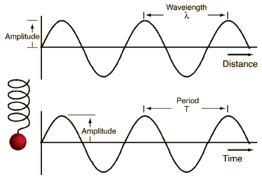
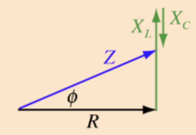
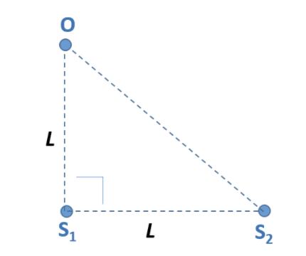
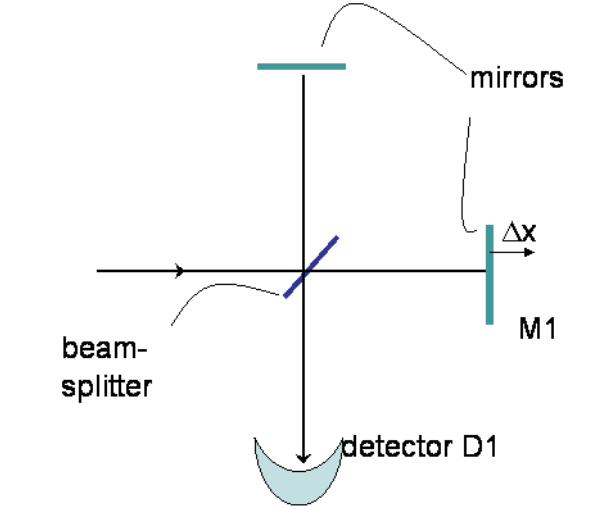

# Quantum Physics

本笔记是对应 *UIUC PHYS 214 Univ Physics: Quantum Physics* 的学习笔记，其包含了量子物理中比较基础的知识点。

[TOC]

## 波

量子力学的一个重要结论是，所有粒子都有波的性质，因此我们首先从波开始学习。一个波，比如声波，总会有一个 **波源（Source）**，并能够通过函数 $y(x, t)$ 来表示其在某一时间某一地点所处的强度。这里强度对应的是例如声波的大小、水波的高度等物理量，我们马上就会提到它的含义。

### 谐波

**谐波（Harmonic Waves）** 总能写成下面的函数形式：
$$
y(x, t) = A\cos(kx - \omega t + \phi)
$$
这里的 $\omega$ 是 **角频率（Angular Frequency）**，$k$ 是 **波数（Wavenumber）**。本篇中我们默认所有波都在三维空间的一条线（沿着 $x$ 轴方向）上运动。回忆三角函数的知识，我们知道余弦函数的周期是 $2\pi$，因此这里的 $k$ 和 $\omega$ 分别代表了波在空间和时间上的重复频率。我们因此反过来可以定义空间和时间上的周期：
$$
\begin{align}
\lambda = \frac{2\pi}{k} && T = \frac{2\pi}{\omega}
\end{align}
$$
我们将 $\lambda$ 称为 **波长（Wavelength）**，$T$ 称为 **周期（Period）**。此外我们定义 **频率（Frequency）** 为 $f = \frac{1}{T}$，以更好反映时间上波的重复频率，它和 $\omega$ 只有一个 $2\pi$  的倍数差距。$\phi$ 则称为 **相位（Phase）**。

现在让我们尝试从 $(1)$ 中推导出波的速度。我们可以着眼某个波的最高点，然后看它多长时间能够重复一次：
$$
\begin{align}
kx_\text{max} - \omega t + \phi = 2\pi n \implies x_\text{max} = \frac{\omega t - \phi}{k} \\
v = \frac{d x_\text{max}}{dt} = \frac{\omega}{k} = \lambda f
\end{align}
$$

有时候题目中会将 $(1)$ 写成其它的形式，比如：
$$
y(x, t) = A\sin(\frac{2\pi x}{\lambda} - 2\pi ft + \phi)
$$
即使和原式看起来差别很大，这依旧是谐波的公式。上面我们用正弦函数代替了余弦函数，将波数和角频率用波场和频率代替。这里多出来的系数 $2\pi$ 能方便我们估计一些关键点的值。

### 振幅和强度

上面我们还有一个没有提到的物理量，那就是 **振幅（Amplitude）** $A$，其单位是 $\sqrt{W/m^2}$，量纲为 $M^{1/2}\cdot T^{3/2}$。这个单位可能和大家想象的很不一样。实际上这是遵循 **SI** 对波的强度定义得到的单位。波的 **强度（Intensity）** 可以通过下面的式子得到：
$$
I_\text{average}(x) = \frac{1}{T}\int_0^T|A|^2|\cos(kx - \omega t + \phi)|^2\,dt = \frac{A^2}{2}
$$
其中的绝对值符号是因为这个式子中可能会出现复数（我们后面会介绍带有复数的波函数）。强度的单位是 $W/m^2$，即单位面积产生的功率，量纲为 $M\cdot T^3$。这样我们就大概可以理解为什么前面的振幅有那么奇怪的量纲了。

下面是一个谐波与位置和时间的[关系图][1]。

## 干涉

现在让我们考虑两个波在空间中同一点上相遇时，会产生什么影响。为了简化，我们假设这两个波拥有相同的角频率和波数，且在同一时刻离各个波源的相同距离的地方相遇：
$$
y_1(x, t) = A\cos(kx - \omega t + \phi_1) \qquad y_2(x, t) = A\cos(kx - \omega t + \phi_2)
$$
在它们相遇时，通常我们可以假设它们产生的效果就是两个式子相加：
$$
\begin{align}
y_\text{total} &= y_1(x, t) + y_2(x, t) \nonumber \\
&= 2A\cos\left(\frac{\phi_1 - \phi_2}{2}\right)\cos\left(kx - \omega + \frac{\phi_1 + \phi_2}{2}\right)
\end{align}
$$
可以看到 (7) 式依然是一个波，其中 $2A\cos(\frac{\phi_1 - \phi_2}{2})$ 是其新的振幅。因此发生干涉时，相位差是唯一决定最后振幅大小的因素。如果两个波的振幅不同，我们就需要用 **相量（Phasor）** 来绘图说明新波的振幅和相位。

### 相量

相量，或 **相位矢量（Phase Vector）** 是一个利用复数（也即二维空间的矢量）表示两个或多个波的叠加波的方法。当一个振幅为 $A_1$ 的波与振幅为 $A_2$ 的波进行叠加时，我们可以将其首尾相接，形成一个新的矢量。此时这个矢量的长度就反应了在特定相位下，叠加形成的波的振幅，图例[如下][2]：

上图本来描述的本来是一个 RLC 电路的相量图，但如果将其中的 $R, X_L, X_C$ 都理解为波，其相位分别为 $0, \frac{\pi}{2}, -\frac{\pi}{2}$。叠加成的波相位为 $\phi$，振幅为 $Z$。

### 两个发声器

作为例子，假设有两个音响发出声音，其声波的振幅相同，离声源分别 $r_1$ 和 $r_2$ 的一个人会听到怎样的声音呢？和上面类似地，我们可以列出下面的式子：
$$
y_\text{total} = 2A\cos\left(\frac{k(r_1 - kr_2) + \phi_1 - \phi_2}{2}\right)\cos\left(\frac{k(r_1 + r_2) + \phi_1 + \phi_2}{2} - \omega t\right)
$$
可以计算出平均强度为：
$$
I_\text{total} = 2A^2\cos^2\left(\frac{k(r_1 - r_2) + \phi_1 - \phi_2}{2}\right)
$$
如果假设相位差为 $0$，我们可以得到：
$$
I_\text{total} = 2A^2\cos^2\left(k\frac{r_1 - r_2}{2}\right) = 4I_1\cos^2\left(k\frac{r_1 - r_2}{2}\right)
$$
其最大值在 $r_1 - r_2 = m\lambda$ 时取得，为 $4I_1$。这里 $I_1$ 是仅考虑一个声源时的平均强度。下面是一个类似的情景：

> **例**：有两个平行于屏幕的光源。当只有 $A$ 光源照射屏幕时，屏幕的上的强度是 $I_A = 20\  \text{W}/\text{m}^2$；当只有 $B$ 光源照射时，屏幕上的强度是 $I_B = 7\ \text{W}/\text{m}^2$。求两个光源都开启的时候，屏幕上最小的强度和最大的强度的比值。这里假设光源和屏幕的距离足够大，从而光源在屏幕上任意位置的强度都是一样的。

> **解**：这里的一个问题在于两个波的振幅不同，因此需要使用相量解决。首先计算两者分别的振幅：
> $$
> A = \sqrt{2I} \implies A_1 = 2\sqrt{10}\ \text{W}/\text{m}^2 \qquad A_2 = \sqrt{14}\ \text{W}/\text{m}^2\nonumber
> $$
> 通过画相量图（其实这题求最大最小值根本不用画），我们可以知道最大值出现在 $\Delta \phi = 0$，而最小值出现在 $\Delta \phi = \pi$。也即是它们相互叠加和相互抵消的两种情况：
> $$
> A_\text{max} = A_1 + A_2 = 2\sqrt{10} + \sqrt{14}\ \text{W}/\text{m}^2 \\
> A_\text{min} = A_1 - A_2 = 2\sqrt{10} - \sqrt{14}\ \text{W}/\text{m}^2 \nonumber
> $$
> 再次回到强度：
> $$
> I_\text{max} = \frac{1}{2}A_\text{max}^2 = 50.66 \text{W}/\text{m}^2 \\
> I_\text{min} = \frac{1}{2}A_\text{min}^2 = 3.336 \text{W}/\text{m}^2 \nonumber
> $$
> 两者的比值是：
> $$
> I_\text{min} / I_\text{max} = 0.0658 \nonumber
> $$

再来一个相对复杂的问题：

> **例**：有两个声源 $S_1, S_2$，频率均为 $30\ \text{Hz}$。它们和观测者的距离关系如下图所示。假设任一个声源单独存在时，观测者测得的强度都是 $6\ \text{W}/\text{m}^2$。假设图中的 $L = 4\ \text{m}$，且声速是 $335\ \text{m}/\text{s}$。（1）两个声源同时存在时，观测者测得的强度。（2）假设声源的频率是波动的，求使得两个声波在观测处叠加产生 $kI_\text{max}$ 的频率，其中$I_\text{max}$ 是叠加波的最大的强度，$k$ 是一个常数。
>
> 

> **解**：通过已知的条件，我们不难得到声波的波长 $\lambda = v/f = 11.17\ \text{m}/\text{s}$，相位差：
> $$
> \Delta \phi = k(r_1 - r_2) = \frac{2\pi}{\lambda}(\sqrt{2} - 1)L = 0.932 \nonumber
> $$
> 单独一个声源存在时，强度为 $6\ \text{W}/\text{m}^2$，因此它的振幅 $A = \sqrt{2I} = 3.46\ \sqrt{\text{W}}/\text{m}$。通过画相量图，我们利用余弦定理可以得到叠加声波的振幅（需要注意这里的夹角实际上是 $\pi - \Delta \phi$，因此等同于 $+\cos\Delta\phi$）：
> $$
> A_\text{tot} = \sqrt{2A^2(1 + \cos \Delta \phi)} = 6.19\ \sqrt{\text{W}}/\text{m}\nonumber
> $$
> 此时对应的强度是：
> $$
> I_\text{tot} = \frac{1}{2}A_\text{tot}^2 = 19.15\ \text{W}/\text{m}^2 \nonumber
> $$
> 两个声波能够叠加成的波的最大强度是：
> $$
> I_\text{max} = \frac{1}{2}A_\text{max}^2 = \frac{1}{2}(2A)^2 = 4I\nonumber
> $$
> 其中 $I = 6\ \text{W}/\text{m}^2$ 是单独声源产生的强度。结合两个相同强度的波叠加的强度公式有：
> $$
> I' = 2A^2\cos^2\left(\frac{2\pi}{\lambda}\frac{\Delta\phi}{2}\right)\nonumber = 4I\cos^2\left(\frac{\pi\Delta \phi f}{v}\right) = kI_\text{max} = 4kI \implies \cos^2\left(\frac{\pi\Delta\phi f}{v}\right) = k
> $$
> 特别地，当 $k = 0$ 时，有 $\dfrac{\pi\Delta\phi f}{v} = \dfrac{\pi}{2}, \dfrac{3\pi}{2}, ...$，因此 $f = \dfrac{v}{2\Delta \phi}, \dfrac{3v}{2\Delta \phi}, ...$。$k = 1$ 时，有 $\dfrac{\pi\Delta\phi f}{v} = \pi, 2\pi, ...$，因此 $f = \dfrac{v}{\Delta \phi}, \dfrac{2v}{\Delta \phi},...$。

### 双缝干涉

假设有一束平行光穿过距离为 $d$（非常小）的两个小缝，然后打在离小缝 $L$ 的屏幕上。此时屏幕上的亮度会呈现某种规律，即重复的亮暗循环。假设屏幕上距离两个小缝中点投射到屏幕上的点的距离为 $y$ 的一点是最亮点，其距离两个小缝距离分别为 $r_1$ 和 $r_2$。同时设该点对两个小缝中点的仰角为 $\theta$。此时我们不难得到：
$$
y = L\tan{\theta} \qquad d\sin{\theta} = r_1 - r_2 \qquad \frac{2\pi}{\lambda}(r_1 - r_2) = 2m\pi
$$
因为 $\theta$ 是一个很小的值，我们可以认为 $\theta \sim \sin{\theta} \sim \tan{\theta}$。经过将上面三个式子化简可以得到：
$$
\sin{\theta} \approx \theta = \frac{m\lambda}{d}
$$
因此双缝干涉实验中，屏幕上两个亮点的距离只和双缝距离（反比）和光的波长（正比）相关。

### 干涉器

**干涉器（Interferometer）** 是一个由一个激光发射器，一个 **分光镜（Bean Splitter）** 和两个距离分光镜分别为 $r_1$ 和 $r_2$ 的两个镜子以及一个探测器组成的。激光在分光镜处被分为两道，并经过不同距离反射后重汇并由探测器接收。由于分开的两束光存在相位差，我们可以在探测器中观察到干涉现象。由于它们的振幅是一样的，我们可以通过下面的式子得到干涉波的强度：
$$
I_\text{total} = 4I_1\cos^2(k(L_1 - L_2))
$$
可以对比 (10) 式，其差异来源于两束光经过镜子反射，都将路径多走了一次。下面是一道例题：

> **例**：一道波长为 $360\ \text{nm}$，功率为 $1\ \text{mW}$ 的激光进入了干涉器。如下图所示：
>
> 
>
> 初始情况下，分光镜和两面镜子的距离是一样的。请问（1）其中一面镜子最少需要移动多少距离 $\Delta x$，才能在探测器处检测到完全为 $0$ 的强度？（2）在第一问的条件下，如果将波长变为 $720\ \text{nm}$，功率切换为 $2\ \text{mW}$，则 $D1$ 处两个波的相位差和强度是多少？

> **解**：强度为零时我们有 $\frac{2\pi}{\lambda}\Delta x = m\pi + \frac{\pi}{2}$。取 $m = 0$ 则得到 $\Delta x = \frac{\lambda}{4} = 90\ \text{nm}$。波长变更后，同样的

## 衍射

通过实验发现，一束光通过单缝时其传播路径会分散，仿佛单缝处放置了一系列光源一样。这被称为 **惠更斯原理（Huygens Principle）**，这种现象被称为 **衍射（Diffraction）**。这“一系列光源”在传播过程中会出现干涉现象，越细小的单缝会在屏幕上产生更大的光点。

### 单缝衍射

让我们假设单缝中存在 $N$ 个“点光源”，单缝的宽度为 $a$，那么不难得到每个光源之间的距离是 $\frac{a}{N}$。为了找到这些光源在干涉后得到的波的最小值，我们可以通过画相量来得到提示：
$$
\phi_2 - \phi_1 = k(r_2 - r_1) = \frac{2\pi}{\lambda}\frac{a}{N}\sin{\theta} = \frac{2m\pi}{N} \\
a\sin{\theta} = m\lambda \implies \sin{\theta_0} = \frac{\lambda}{a}
$$
我们神奇地发现其结果和 $N$ 无关。这样我们就可以通过 $\theta_0$ 得到 $y_0$的大小了，它是屏幕上光点大小的一半：
$$
y_0 = L\tan{\theta_0} \approx \frac{\lambda}{a}L
$$

如果需要求第二个，第三个衍射最小值的位置，只需要将 $m = 2, 3$ 代入 $(15)$ 式即可。

> **例**：波长为 $650\ \text{nm}$ 的光线穿过了 $50\ \text{$\mu$m}$ 的小缝并照在 $2\ \text{m}$ 外的屏幕上，求屏幕上中心光点的半径。

> **解**：由 $a\sin\theta_0 = \lambda$ 可知，第一个强度为零的点出现在：
> $$
> y_0 = L\tan{\theta_0} = L\tan{\left(\arcsin{\frac{\lambda}{a}}\right)} = 2.60\times10^{-2}\ \text{m}\nonumber
> $$

> **例**：波长为 $550\ \text{nm}$ 的光线穿过了宽度为 $a$ 的小缝，照在 $2\ \text{m}$ 外的屏幕上，第一个衍射零点出现在距离中心点 $y_1 = 34\ \text{cm}$ 外。（1）求小缝宽度。（2）在 $(1)$ 的情形下，如果改变光的波长，使得第二个衍射零点出现在距离中心点 $y_2 = 68\ \text{cm}$ 外，求波长。

> **解**：由 $y_1 = L\tan{\theta}_1$ 可以得到 $\theta = 0.168$。因此 $a = \lambda / \sin{\theta} = 3.28\times10^{-6}\ \text{m}$。第二小问中，$\theta = 0.328$，因此 $\lambda = (a\sin\theta)/2 = 5.28\times10^{-7}\ \text{m}$。

### 圆孔衍射

本篇中并不推导这个过程，但是其结论是：
$$
D\sin{\theta_0} = 1.22\lambda \\
y_0 \approx \frac{1.22\lambda}{D}L
$$
其中 $D$ 是圆孔的直径。

> **例**：半人马座阿尔法星距离地球 4.4 光年（$4.2\times10^{16}\ \text{m}$）。假设它有一个公转半径为 $1.5\times10^{11}\ \text{m}$ 的行星。我们需要半径多少的透镜才能将该行星和阿尔法星分开？假设阿尔法星的光波长为 $570\ \text{nm}$。

> **解**：题中所说的“分开”是指，该行星至少距离阿尔法星 $y_0$ 的距离，即第一个衍射零点。因此列式如下：
> $$
> y_0 \le \frac{1.22\lambda}{D}L \nonumber \implies D \le \frac{1.22\lambda}{y_0}L = 0.195\ \text{m}
> $$

### 石版印刷术

**石版印刷术（Lithography）** 是利用衍射机制绘制纳米级电路的技术。激光通过一个透镜后聚于某一点来从硅上移除材料。这个点的精度决定了其画出的线的宽度和距离。假设透镜直径为 $D$，距离硅 $L$ ，激光的波长为 $\lambda$，我们就可以得到第一个零点 $\sin^{-1}(1.22\lambda/D)$。画出的线宽也就是 $y_0 = L\tan\theta_0$ 了。

## 光子

光子本质是一个离散的能量包，或 **量子（Quantum）**。对于频率为 $f$  的光子，其能量为：
$$
\label{quantum_energy}
E = hf = \hbar\omega = \frac{hc}{\lambda} = \hbar ck
$$
其中 $h$ 是一个物理常量，称为 **普朗克常数**，值为 $6.626\times10^{-34}\ \text{Js}$。另一个 $\hbar$ 被称为 **约化普朗克常数**，值为 $1.054\times 10^{-34}\ \text{Js}$，也相当常用。光子的动量则通过下面的式子计算：
$$
\label{quantum_momentum}
p = \frac{h}{\lambda} = \hbar k = \frac{hf}{c} = \frac{\hbar\omega}{c}
$$

上面 $(\ref{quantum_momentum})$ 式中的 $p = \frac{h}{\lambda}$ 将光子的动量和其波长唯一地关联起来。物理学家后面发现所有粒子，甚至宏观物质都存在波动性质，只要其拥有动量，我们都能通过 $(\ref{quantum_momentum})$ 式计算出其波长。这种波被称为 **德布罗意波（de Broglie Wave）**。

> **例**：锂的一个稳定同位素拥有 3 个质子和 4 个中子。一个处于静止状态的锂原子发射了一个 $1.8488\ \text{eV}$ 的光子并产生反冲。请问它多久才能移动 $1\ \text{mm}$？一个单位原子质量是 $1.66\times10^{-27}\ \text{kg}$。

> **解**：在整个过程中，动量一定守恒，因此只要算出光子的动量，就可以得到锂原子的速度。对于光子我们有 $E = hc/\lambda$，且 $p = h/\lambda$，因此 $p = E/c$：
> $$
> mv = \frac{E}{c} \implies v = \frac{E}{mc} = 0.0850\ \text{m}/\text{s}\nonumber
> $$
> 因此走过一毫米需要的时间是 $t = l/v = 0.118\ \text{s}$。

> **例**：一个 $100\ \text{W}$ 的白炽灯能将 $2.5\%$ 的电能转化为光能。假设其发出的光的波长为 $540\ \text{nm}$，且均匀地辐射到周围的空间。求 $D = 5\ \text{m}$ 远外，$A = 10\ \text{cm}^2$ 范围内每秒通过光子的数量。

> **解**：首先可以计算单个光子的能量：$E_\gamma = hc/\lambda = 3.68\times 10^{-19}\ \text{J}$。由于白炽灯每秒发出光能为 $2.5\ \text{J}$，其均匀铺在距离它相同距离的曲面上。因此我们可以直接得到光子的数量：
> $$
> N = \frac{E}{E_\gamma} = \frac{A}{4\pi D^2}\frac{E_0}{E_\gamma} = 2.16\times 10^{13}\nonumber
> $$
> 同时我们可以发现，如果白炽灯功率保持不变，则光的波长越大，光子数量就越多。

### 光电效应

通过实验发现，将强度不变的光子束打在金属上时，当其频率小于某个特定值，即 **极限频率（Threshold Frequency）**时不会有任何现象；而超过该阈值后，会产生电流，其强度和光子频率成反比。不过，电流中电子的动能却和输入光子的频率成正比。我们可以通过下面的式子来解释极限频率：
$$
E_\text{initial} = hf - \Phi
$$
其中 $\Phi$ 是光电效应需要产生的最低能量，被称为 **功函数（Work Function）**。随后在电子被释放时，满足下面的式子：
$$
E_\text{final} = KE_\text{electron}
$$
当能量越高时，电子的动能就越高。如果对电子移动方向附加一个电压，则有可能阻止电流的产生。正好能够阻止电子移动的电压可以通过电子的动能计算得到：
$$
V_\text{stop} = \frac{KE_\text{electron}}{e}
$$
其中 $e$ 是一个电子的电量，为 $1.6\times 10^{-19} C$。

最后让我们解释为什么电流反而会随着频率上升而降低。这是因为光电效应产生的电子数量只和光子数量相关（确切地说，一个光子激发一个电子）。而单位时间光子的数量应该是：
$$
N = \frac{P}{hf}
$$
其中 $P$ 是光子束的功率。因此，单位时间通过导体的电量也就减少了，也即电流强度减少了。

> **例**：一块功函数为 $1.7\ \text{eV}$ 的金属在真空中被波长为 $600\ \text{nm}$ 的光照射。求金属板上产生电子的最大动能。

> **解**：直接通过公式 $E = hf - \Phi$ 得到结果：$0.368\ \text{eV}$。

### 光的强度和光子数量

前面我们已经提到 $N = \frac{P}{hf}$。实际上我们可以通过强度计算功率 $P$。强度的 **SI** 单位为 $W/m^2$，因此它是单位面积的功率，因此我们可以得到：
$$
P = IA
$$
最后我们得到：
$$
N = \frac{IA}{hf}
$$
回忆牛顿第二定律 $F = \frac{dp}{dt}$，也即单位时间动量的变化，这通过 $N$  的定义（单位时间光子数量）不难得到：
$$
F = \frac{hN}{\lambda} = pN
$$
因此在镜面反射时，镜子需要提供 $F = 2pN = \frac{2IA}{hf}$ 的力。

## 概率波

前面我们将光的波动性（干涉、衍射）以及粒子性（光电效应）都介绍过了，这种双重性质被称为 **波粒二象性（Wave-Particle Duality）**。在量子力学中，对这个性质的解释要更有革命性：所有物质都是波，并通过一个概率函数描述其在某时某地的概率。

### 概率密度

假设有一个概率分布函数 $\rho(x)$ 来表示在某个点的概率密度。其显然需要满足下面的两个式子：
$$
\rho(x) \ge 0 \\
\int_{-\infty}^\infty \rho(x)\,dx = 1
$$
如果需要计算 $x$ 在 $a, b$ 两点间的概率，可以通过下面的式子得到：
$$
P(a < x < b) = \int_a^b \rho(x)\,dx
$$

### 复数

**复数（Complex  Number）** 是对实数的扩张，其引入了另一根数轴表示 $i = \sqrt{-1}$ 方向的偏移量。所有复数都可以表示成 $z = a + bi$ 的形式。复数之间的加减法可以仿照二维向量的加法进行：
$$
\begin{align}
z_1 + z_2 &= (a_1 + b_1i) + (a_2 + b_2i) \nonumber \\
&= (a_1 + a_2) + (b_1 + b_2)i
\end{align}
$$
复数之间的乘积可以利用乘法分配律得到：
$$
\begin{align}
z_1 \cdot z_2 &= (a_1 + b_1i)(a_2 + b_2i) \nonumber \\
&= (a_1a_2 - b_1b_2) + (a_1b_2 + a_2b_1)i
\end{align}
$$
复数的 **模** 是指复数对应的坐标距离原点 $(0, 0)$  的距离：
$$
|z| = \sqrt{a^2 + b^2}
$$
不难验证 $z^2 = |z|^2$ 对虚部不为 $0$ 的复数并不成立。

一个复数 $z$  的 **共轭（Conjugate）** $z^*$ 是满足 $zz^* = |z|^2$  的复数。实际上，$a + bi$ 的共轭就是 $a - bi$。

利用三角函数，可以将一个复数表示为 $z = |z|(\cos\theta + i\sin\theta)$ 的形式，其中 $\theta$ 是复数所在点和原点连线与 $x$ 轴形成的角。根据三角函数和指数函数的级数定义，我们可以得到 **欧拉公式**；
$$
e^{i\theta} = cos\theta + i\sin\theta
$$
因此任意复数 $z$ 都可以表示为 $|z|e^{i\theta}$ 的形式。这种形式进行乘法运算会非常方便：
$$
z_1\cdot z_2 = |z_1|e^{i\theta_1}\cdot|z_2|e^{i\theta_2} = |z_1||z_2|e^{i(\theta_1 + \theta_2)}
$$
通过这个式子我们也就认识到复数乘法的几何意义：它的模是两个复数模的积，辐角是两个复数辐角之和。

### 波函数

现在我们要通过概率密度函数来从粒子角度解释双缝干涉实验。在对电子束进行双缝干涉实验时，此前一直被认为是“粒子”的电子居然出现了和光束干涉类似的结果。因此我们猜测电子和光子类似，也是量子：在传播时拥有波的性质，但在被检测时又显示为离散的包。量子物理使用 **波函数（Wave Function）** 来描述量子被观测时的分布性质：
$$
P(a < x < b) = \int_a^b\rho(x)\,dx = \int_a^b\Psi^*(x)\Psi(x)\,dx
$$
其中波函数 $\Psi(x)$ 是一个描述某一时刻关于位置的函数。其可以表示为下面的式子：
$$
\Psi(x) = A(e^{ikr_1} + e^{ikr_2})
$$
其中 $A$ 被称为 **归一化常数（Normalization Constant）**，它的存在是为了让 $(34)$ 积分得到 $1$。根据这个定义我们可以将 $(34)$ 式进一步简化：
$$
\begin{align}
\rho(x) &= \Psi^*(x)\Psi(x) = 2|A|^2(1 + \cos(k(r_2 - r_1))) \nonumber \\
&= 4|A|^2\cos^2\left(k\frac{r_2 - r_1}{2}\right)
\end{align}
$$
可以看到这个式子和 (10) 式高度相似，一定程度上也验证了波函数的准确性。

波函数同样也要遵守概率波的条件。让我们假设一个简单的情形，$\Psi(x) = e^{ikx}$，此时有：
$$
\int_0^L\Psi^*(x)\Psi(x)\,dx = A^2\int_0^Le^{ikx}e^{-ikx}\,dx = A^2L = 1 \implies A = \sqrt{\frac{1}{L}} \nonumber
$$
将这个结果带入波函数：
$$
\int_a^b\frac{1}{L}\,dx = \frac{b - a}{L}
$$
因此这里展示了一个均匀分布在 $(0, L)$ 的粒子。

## 动量与位置

现在我们假设在双缝干涉实验中，屏幕被放在长度为 $L$ 的箱子中，且其波函数为：
$$
\Psi(x, t) = Ae^{i(kx - \omega t)}
$$
如果假设这个粒子的动量为 $p$，可以得到 $k = \frac{p}{\hbar}$，利用前文的例子可以得到 $A = \sqrt{\frac{1}{L}}$。我们目前还无法确定 $\omega$ 的值，为了简化让我们先假设 $t = 0$，这样就得到波函数：
$$
\Psi(x) = Ae^{ikx}
$$
这个函数告诉我们 $t = 0$ 时动量为 $p$ 的粒子的位置分布（而不是一个确定的位置）。另一方面，如果我们去寻找粒子在某一刻的位置，由于 $\rho(x) = \Psi(x)\Psi^*(x) = |A|^2$，我们无法确认它的状态。这被称为 **不确定性（Uncertainty）**。**海森堡不确定性原理（Heisenberg Uncertainty Principle）** 就描述了这个特性：
$$
\Delta x\Delta p \ge \frac{\hbar}{2}
$$

### 特征状态

我们将

# 引用资源

[1]: http://hyperphysics.phy-astr.gsu.edu/hbase/Waves/funhar.html
[2]: http://hyperphysics.phy-astr.gsu.edu/hbase/electric/phase.html#c2
